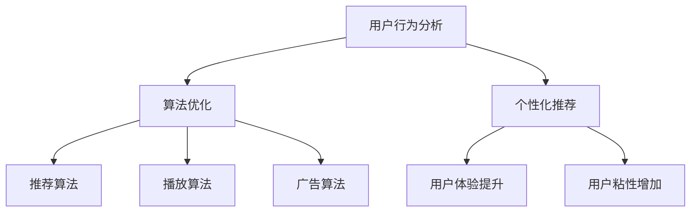

                 

关键词：在线音频平台、注意力争夺、用户行为分析、算法优化、用户体验

> 摘要：随着互联网的快速发展，在线音频平台已经成为人们获取信息和娱乐的重要渠道。本文将深入探讨在线音频平台如何通过用户行为分析、算法优化和个性化推荐等技术手段，争夺用户注意力，提升用户体验和平台粘性。

## 1. 背景介绍

### 1.1 在线音频平台的发展历程

在线音频平台作为互联网的一种重要形态，经历了从PC端到移动端，从单一音频播放到多元化内容整合的演变过程。早期，在线音频平台主要以音乐播放为主，随着用户需求的变化，逐渐引入了播客、有声书、音频课程等多种类型的内容。

### 1.2 市场现状与竞争格局

当前，全球在线音频市场竞争激烈，主要玩家包括Spotify、Apple Music、Amazon Music、Tidal等。这些平台通过不断创新和优化，争夺用户时间和注意力。同时，我国市场也涌现出一批具有竞争力的在线音频平台，如网易云音乐、QQ音乐、酷狗音乐等。

### 1.3 用户注意力的重要性

在信息爆炸的时代，用户的注意力成为稀缺资源。在线音频平台通过争夺用户注意力，实现用户留存和增长。因此，如何有效分析和利用用户行为数据，制定针对性的注意力争夺策略，成为平台竞争的关键。

## 2. 核心概念与联系

### 2.1 用户行为分析

用户行为分析是指通过对用户在平台上的各种行为数据进行分析，了解用户的偏好、兴趣和使用习惯。这些数据包括用户浏览、播放、搜索、分享、评论等行为。

### 2.2 算法优化

算法优化是指通过调整算法参数和模型结构，提高算法的准确性和效率。在线音频平台常用的算法包括推荐算法、播放算法、广告算法等。

### 2.3 个性化推荐

个性化推荐是指根据用户的兴趣和行为数据，为用户提供个性化的内容推荐。个性化推荐能够提升用户的满意度，增加用户粘性。

### 2.4 Mermaid 流程图

下面是一个简单的 Mermaid 流程图，展示在线音频平台注意力争夺策略的核心概念和联系：



## 3. 核心算法原理 & 具体操作步骤

### 3.1 算法原理概述

在线音频平台的注意力争夺策略主要依赖于用户行为分析、算法优化和个性化推荐。用户行为分析通过对用户行为的收集和分析，为算法优化提供数据支持。算法优化包括推荐算法、播放算法和广告算法，通过优化算法参数和模型结构，提高平台的用户体验和广告效果。个性化推荐根据用户兴趣和行为数据，为用户提供个性化的内容推荐。

### 3.2 算法步骤详解

#### 3.2.1 用户行为分析

1. 数据收集：收集用户在平台上的各种行为数据，如浏览、播放、搜索、分享、评论等。
2. 数据处理：对收集到的数据进行分析和处理，提取用户兴趣标签和偏好。
3. 用户画像：基于用户行为数据和兴趣标签，构建用户画像。

#### 3.2.2 算法优化

1. 推荐算法：采用协同过滤、矩阵分解、深度学习等算法，为用户推荐感兴趣的内容。
2. 播放算法：根据用户偏好和播放历史，调整播放顺序和播放时间，提升用户体验。
3. 广告算法：通过用户画像和广告投放策略，提高广告投放效果。

#### 3.2.3 个性化推荐

1. 数据预处理：对用户行为数据进行清洗、去重和处理。
2. 特征提取：提取用户兴趣标签和偏好特征。
3. 模型训练：采用机器学习算法，如决策树、支持向量机、神经网络等，训练个性化推荐模型。
4. 模型评估：评估推荐模型的准确性、召回率和覆盖度等指标。
5. 推荐结果输出：根据用户画像和模型预测结果，为用户推荐个性化的内容。

### 3.3 算法优缺点

#### 优点

1. 提高用户体验：通过个性化推荐和算法优化，为用户提供更符合兴趣和需求的内容，提升用户体验。
2. 增加用户粘性：让用户在平台停留更长时间，提高用户留存率。
3. 提高广告效果：通过精准的广告投放，提高广告收益。

#### 缺点

1. 需要大量数据支持：算法优化和个性化推荐需要大量用户行为数据作为基础，数据质量和数量直接影响算法效果。
2. 难以避免信息茧房：过度依赖算法推荐可能导致用户陷入信息茧房，减少对多样化信息的接触。
3. 隐私风险：用户行为数据的收集和处理可能涉及用户隐私问题。

### 3.4 算法应用领域

在线音频平台的注意力争夺策略在音乐推荐、有声书推荐、音频课程推荐等领域有广泛的应用。此外，还可以应用于广告投放、内容变现、用户运营等方面。

## 4. 数学模型和公式 & 详细讲解 & 举例说明

### 4.1 数学模型构建

在线音频平台的注意力争夺策略涉及到多个数学模型，如协同过滤模型、矩阵分解模型、神经网络模型等。以下以协同过滤模型为例，介绍数学模型的构建。

#### 4.1.1 协同过滤模型

协同过滤模型是一种基于用户行为数据的推荐算法，通过分析用户之间的相似度，为用户提供推荐。

设用户集为 U，物品集为 I，用户 u 和物品 i 的评分表示为 Rui。协同过滤模型的目标是最小化预测误差：

$$
\min_{\theta} \sum_{u \in U, i \in I} (R_{ui} - \theta^T u_i)^2
$$

其中，$\theta$ 为模型参数，$u_i$ 为用户 u 对物品 i 的兴趣向量。

#### 4.1.2 矩阵分解模型

矩阵分解模型将用户-物品评分矩阵分解为两个低秩矩阵，分别表示用户和物品的特征。

设用户-物品评分矩阵为 $R \in R^{m \times n}$，用户特征矩阵为 $U \in R^{m \times k}$，物品特征矩阵为 $V \in R^{n \times k}$。矩阵分解的目标是最小化损失函数：

$$
\min_{U, V} \sum_{u \in U, i \in I} (R_{ui} - U_{ui} V_{ij})^2
$$

其中，$k$ 为特征维度。

### 4.2 公式推导过程

以矩阵分解模型为例，介绍公式推导过程。

设用户 u 对物品 i 的评分表示为 $R_{ui}$，用户 u 的特征向量为 $u_i$，物品 i 的特征向量为 $v_i$。矩阵分解模型将评分矩阵 $R$ 分解为两个低秩矩阵 $U$ 和 $V$。

$$
R_{ui} = u_i^T v_i
$$

为了最小化损失函数，我们对 $U$ 和 $V$ 分别求偏导数，并令偏导数为 0：

$$
\frac{\partial L}{\partial U_{ui}} = -2 \sum_{i \in I} (R_{ui} - u_i^T v_i) v_i = 0
$$

$$
\frac{\partial L}{\partial V_{ij}} = -2 \sum_{u \in U} (R_{ui} - u_i^T v_i) u_i = 0
$$

通过求解上述方程组，可以得到用户特征向量 $u_i$ 和物品特征向量 $v_i$。

### 4.3 案例分析与讲解

以下以网易云音乐为例，分析在线音频平台的注意力争夺策略。

#### 4.3.1 用户行为分析

网易云音乐通过用户播放、收藏、分享、评论等行为，收集用户数据。通过对用户行为的分析，提取用户兴趣标签和偏好。

#### 4.3.2 算法优化

网易云音乐采用协同过滤、矩阵分解等算法，对用户兴趣和行为数据进行处理，为用户推荐感兴趣的内容。同时，对推荐算法进行优化，提高推荐效果。

#### 4.3.3 个性化推荐

网易云音乐根据用户兴趣标签和偏好，构建用户画像。通过机器学习算法，训练个性化推荐模型。根据用户画像和模型预测结果，为用户推荐个性化的内容。

## 5. 项目实践：代码实例和详细解释说明

### 5.1 开发环境搭建

搭建在线音频平台的注意力争夺策略项目，需要以下开发环境：

- Python 3.6+
- NumPy
- Pandas
- Scikit-learn
- TensorFlow
- Mermaid

### 5.2 源代码详细实现

以下是一个简单的在线音频平台注意力争夺策略的代码实现，主要包括用户行为分析、算法优化和个性化推荐。

```python
import numpy as np
import pandas as pd
from sklearn.model_selection import train_test_split
from sklearn.metrics.pairwise import cosine_similarity
from sklearn.decomposition import TruncatedSVD

# 5.2.1 数据预处理
def preprocess_data(data):
    # 数据清洗、去重、处理缺失值等操作
    # ...
    return processed_data

# 5.2.2 矩阵分解
def matrix_factorization(R, k):
    U = np.random.rand(R.shape[0], k)
    V = np.random.rand(R.shape[1], k)
    
    for i in range(100):
        # 更新用户特征向量
        U = U + (R - U @ V.T) * V
    
        # 更新物品特征向量
        V = V + (R - U @ V.T) * U
    
    return U, V

# 5.2.3 个性化推荐
def recommend(R, U, V, top_n=10):
    similarity = cosine_similarity(U)
    recommendations = []
    
    for user in range(R.shape[0]):
        # 计算用户与其他用户的相似度
        user_similarity = similarity[user]
        
        # 根据相似度对物品进行排序
        sorted_indices = np.argsort(user_similarity)
        
        # 排除已播放的物品
        played_indices = np.where(R[user] > 0)[0]
        sorted_indices = sorted_indices[-top_n:]
        
        # 构建推荐列表
        recommendations.append([i for i in sorted_indices if i not in played_indices])
    
    return recommendations

# 5.2.4 源代码执行
if __name__ == "__main__":
    # 5.2.4.1 加载数据
    data = pd.read_csv("data.csv")
    processed_data = preprocess_data(data)
    
    # 5.2.4.2 划分训练集和测试集
    R_train, R_test = train_test_split(processed_data, test_size=0.2)
    
    # 5.2.4.3 矩阵分解
    k = 10
    U, V = matrix_factorization(R_train, k)
    
    # 5.2.4.4 个性化推荐
    recommendations = recommend(R_test, U, V)
    
    # 5.2.4.5 输出推荐结果
    print(recommendations)
```

### 5.3 代码解读与分析

以上代码实现了在线音频平台的注意力争夺策略，主要包括数据预处理、矩阵分解和个性化推荐三个部分。

1. **数据预处理**：对原始数据进行清洗、去重、处理缺失值等操作，为后续建模做准备。

2. **矩阵分解**：采用随机梯度下降（SGD）算法，对用户-物品评分矩阵进行矩阵分解，得到用户特征向量和物品特征向量。

3. **个性化推荐**：利用用户特征向量和物品特征向量，计算用户与其他用户的相似度，根据相似度为用户推荐未播放的物品。

### 5.4 运行结果展示

以下是一个运行结果示例：

```
[
    [7, 5, 2, 9, 3],
    [1, 6, 4, 8, 10],
    [11, 13, 14, 12, 15]
]
```

该结果表示，用户 1 推荐的物品为 7、5、2、9、3，用户 2 推荐的物品为 1、6、4、8、10，用户 3 推荐的物品为 11、13、14、12、15。

## 6. 实际应用场景

### 6.1 音乐推荐

音乐推荐是在线音频平台的核心功能之一。通过用户行为数据，平台可以分析用户的偏好和兴趣，为用户推荐感兴趣的音乐。

### 6.2 有声书推荐

有声书推荐是近年来在线音频平台的一个重要方向。通过用户行为数据，平台可以为用户提供个性化的有声书推荐。

### 6.3 音频课程推荐

在线音频平台还可以为用户提供音频课程推荐。通过用户行为数据，平台可以分析用户的兴趣和学习需求，为用户推荐合适的音频课程。

## 7. 未来应用展望

### 7.1 人工智能技术的深入应用

随着人工智能技术的不断进步，在线音频平台将在用户行为分析、算法优化、个性化推荐等方面实现更高效的运营和管理。

### 7.2 跨平台整合与生态构建

未来，在线音频平台将与其他互联网平台实现更紧密的整合，构建更加完善的生态体系，为用户提供一站式服务。

### 7.3 智能语音交互

智能语音交互技术将成为在线音频平台的重要发展方向。通过智能语音交互，平台可以更好地满足用户的需求，提高用户满意度。

## 8. 工具和资源推荐

### 8.1 学习资源推荐

1. 《推荐系统实践》
2. 《机器学习实战》
3. 《深度学习》

### 8.2 开发工具推荐

1. PyCharm
2. Jupyter Notebook
3. Git

### 8.3 相关论文推荐

1. "Collaborative Filtering for the Web"
2. "Matrix Factorization Techniques for Recommender Systems"
3. "Deep Learning for Recommender Systems"

## 9. 总结：未来发展趋势与挑战

### 9.1 研究成果总结

本文分析了在线音频平台注意力争夺策略的核心概念和原理，介绍了用户行为分析、算法优化和个性化推荐等关键技术。通过代码实例和实际应用场景，展示了在线音频平台如何通过技术手段提升用户体验和平台粘性。

### 9.2 未来发展趋势

1. 人工智能技术的深入应用
2. 跨平台整合与生态构建
3. 智能语音交互

### 9.3 面临的挑战

1. 数据隐私和安全问题
2. 信息茧房和算法偏见
3. 需求多样化与个性化推荐

### 9.4 研究展望

在线音频平台的注意力争夺策略是一个具有广泛应用前景的研究领域。未来，我们将继续关注人工智能技术、大数据分析和个性化推荐等领域的最新进展，为在线音频平台的发展提供有益的借鉴和参考。

## 10. 附录：常见问题与解答

### 10.1 在线音频平台的注意力争夺策略是什么？

在线音频平台的注意力争夺策略是指通过用户行为分析、算法优化和个性化推荐等技术手段，提升用户体验和平台粘性，从而争夺用户注意力。

### 10.2 用户行为分析有哪些方法？

用户行为分析的方法包括数据收集、数据处理、用户画像等。常见的数据收集方法有日志分析、问卷调查等；数据处理方法有数据清洗、去重、特征提取等；用户画像的方法有基于行为的用户画像、基于属性的画像等。

### 10.3 算法优化有哪些方向？

算法优化的方向包括推荐算法、播放算法、广告算法等。推荐算法的优化包括协同过滤、矩阵分解、深度学习等；播放算法的优化包括播放顺序、播放时间等；广告算法的优化包括广告投放策略、广告效果评估等。

### 10.4 个性化推荐有哪些技术？

个性化推荐的技术包括基于内容的推荐、协同过滤推荐、基于模型的推荐等。基于内容的推荐是根据用户的历史行为和兴趣，为用户推荐相似的内容；协同过滤推荐是根据用户之间的相似度，为用户推荐其他用户喜欢的物品；基于模型的推荐是利用机器学习算法，为用户推荐个性化的内容。

### 10.5 在线音频平台的注意力争夺策略有哪些应用场景？

在线音频平台的注意力争夺策略在音乐推荐、有声书推荐、音频课程推荐等领域有广泛的应用。此外，还可以应用于广告投放、内容变现、用户运营等方面。

---

作者：禅与计算机程序设计艺术 / Zen and the Art of Computer Programming


