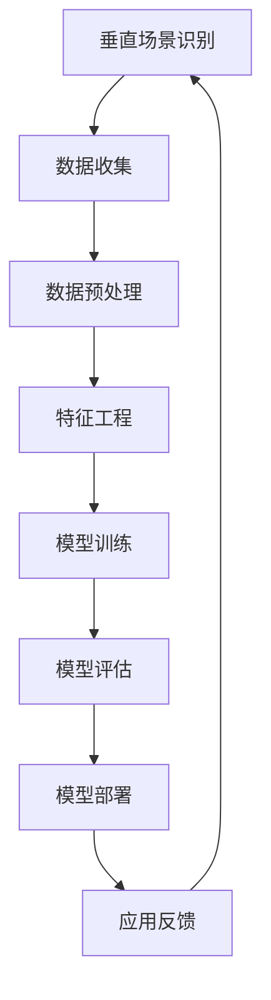

                 

关键词：垂直场景，人工智能，创业，商业模式，技术创新，应用案例，挑战与机遇。

## 摘要

本文探讨了垂直场景与人工智能（AI）创业的结合，分析了这一趋势背后的动因、核心概念、算法原理及其实际应用。通过对当前热门应用领域的案例分析，本文提出了垂直场景AI创业的商业模式构建策略，并探讨了未来发展的趋势与面临的挑战。文章最后，给出了相关的学习资源和开发工具推荐，为有意投身AI创业的读者提供了有益的指导。

## 1. 背景介绍

随着人工智能技术的迅猛发展，AI已逐渐渗透到各个行业和应用场景中。传统的横向技术应用，如大数据分析、机器学习算法等，已经无法满足特定垂直场景的需求。垂直场景与AI的结合，不仅能够提供更加精准、高效的解决方案，还能创造出全新的商业模式和价值。

### 动因

1. **行业细分需求**：随着市场竞争的加剧，各行各业对于定制化、专业化的解决方案需求日益增长。
2. **技术创新驱动**：AI技术的不断进步，使得在特定领域实现智能化应用成为可能。
3. **数据积累**：垂直领域的数据积累为AI模型训练提供了丰富的素材。

### 现状

目前，AI在金融、医疗、教育、制造业、农业等多个垂直场景中已有广泛应用。例如，金融领域的智能投顾、医疗领域的辅助诊断、教育领域的个性化学习等。这些应用不仅提升了行业效率，还带来了新的商业机会。

## 2. 核心概念与联系

### 2.1 垂直场景定义

垂直场景指的是特定行业或领域的应用场景，其特点是需求明确、专业化程度高。例如，医疗行业的病患管理、金融行业的风险管理等。

### 2.2 人工智能核心概念

人工智能（AI）是指计算机系统通过模拟人类智能行为，实现感知、学习、推理、决策等功能的科学。核心概念包括：

- **机器学习**：通过训练数据学习模式，实现自主学习和优化。
- **深度学习**：基于多层神经网络进行数据建模和预测。
- **自然语言处理**：使计算机能够理解和生成自然语言。

### 2.3 架构流程图



## 3. 核心算法原理 & 具体操作步骤

### 3.1 算法原理概述

垂直场景的AI应用通常涉及以下算法：

- **机器学习算法**：如决策树、支持向量机、神经网络等。
- **深度学习算法**：如卷积神经网络（CNN）、循环神经网络（RNN）等。
- **自然语言处理算法**：如词向量、序列到序列模型等。

### 3.2 算法步骤详解

1. **数据收集**：从垂直场景中收集数据，包括结构化和非结构化数据。
2. **数据预处理**：清洗数据、归一化处理、缺失值填充等。
3. **特征工程**：提取关键特征，以提升模型性能。
4. **模型训练**：选择合适的算法进行训练，调整超参数。
5. **模型评估**：通过交叉验证、性能指标评估模型效果。
6. **模型部署**：将训练好的模型部署到实际应用场景中。
7. **持续优化**：根据应用反馈调整模型，实现持续优化。

### 3.3 算法优缺点

- **机器学习算法**：适用性广，易于实现，但可能需要大量数据和计算资源。
- **深度学习算法**：在图像、语音等复杂数据上有显著优势，但模型训练复杂、调参困难。
- **自然语言处理算法**：在文本数据处理上有优势，但处理长文本时效果可能不佳。

### 3.4 算法应用领域

- **金融**：风险控制、智能投顾、量化交易等。
- **医疗**：病患管理、辅助诊断、健康预测等。
- **教育**：个性化学习、智能教学、学生行为分析等。
- **制造业**：质量检测、设备维护、供应链优化等。
- **农业**：作物管理、病虫害预测、土壤分析等。

## 4. 数学模型和公式 & 详细讲解 & 举例说明

### 4.1 数学模型构建

以金融领域的风险评估为例，常用的数学模型包括：

- **线性回归**：预测目标变量与自变量之间的关系。
- **逻辑回归**：分类问题中的概率预测模型。

### 4.2 公式推导过程

以线性回归为例，假设目标变量 \(y\) 与自变量 \(x\) 存在线性关系：

\[ y = \beta_0 + \beta_1x + \epsilon \]

其中，\(\beta_0\) 和 \(\beta_1\) 为模型参数，\(\epsilon\) 为误差项。

通过最小二乘法求解参数：

\[ \beta_0 = \frac{\sum(y_i - \beta_1x_i)}{n} \]
\[ \beta_1 = \frac{\sum(x_i - \bar{x})(y_i - \bar{y})}{\sum(x_i - \bar{x})^2} \]

### 4.3 案例分析与讲解

以某金融公司的信用风险评估为例，使用线性回归模型预测客户信用评分。

1. **数据收集**：收集客户的基本信息、财务状况、历史信用记录等数据。
2. **数据预处理**：对数据进行清洗和归一化处理。
3. **特征工程**：提取关键特征，如收入水平、负债率、逾期记录等。
4. **模型训练**：使用线性回归算法训练模型。
5. **模型评估**：使用交叉验证评估模型效果。
6. **模型部署**：将训练好的模型应用于实际风险评估。

通过模型预测，客户信用评分越高，贷款审批通过率越高。

## 5. 项目实践：代码实例和详细解释说明

### 5.1 开发环境搭建

使用Python和Sklearn库进行线性回归模型的实现。

### 5.2 源代码详细实现

```python
import numpy as np
import pandas as pd
from sklearn.linear_model import LinearRegression
from sklearn.model_selection import train_test_split
from sklearn.metrics import mean_squared_error

# 数据收集
data = pd.read_csv('credit_data.csv')

# 数据预处理
X = data[['income', 'debt_ratio', 'overdue_record']]
y = data['credit_score']

# 特征工程
X = (X - X.mean()) / X.std()

# 模型训练
X_train, X_test, y_train, y_test = train_test_split(X, y, test_size=0.2, random_state=42)
model = LinearRegression()
model.fit(X_train, y_train)

# 模型评估
y_pred = model.predict(X_test)
mse = mean_squared_error(y_test, y_pred)
print(f'MSE: {mse}')

# 模型部署
new_data = pd.DataFrame([[50000, 0.3, 0]], columns=['income', 'debt_ratio', 'overdue_record'])
new_data = (new_data - new_data.mean()) / new_data.std()
new_score = model.predict(new_data)
print(f'Predicted Credit Score: {new_score[0]}')
```

### 5.3 代码解读与分析

1. **数据收集**：从CSV文件中读取数据。
2. **数据预处理**：对数据进行归一化处理。
3. **特征工程**：提取关键特征。
4. **模型训练**：使用线性回归算法训练模型。
5. **模型评估**：计算均方误差（MSE）评估模型效果。
6. **模型部署**：使用训练好的模型对新数据进行预测。

## 6. 实际应用场景

### 6.1 金融

**应用案例**：智能投顾系统，根据用户的风险偏好和财务状况，提供个性化的投资建议。

**案例分析**：通过大数据分析和机器学习算法，智能投顾系统能够在复杂的市场环境中为用户实现资产增值。

### 6.2 医疗

**应用案例**：医学影像分析，如肺癌早期筛查、骨折检测等。

**案例分析**：利用深度学习算法，医学影像分析系统能够提高诊断的准确性和效率。

### 6.3 教育

**应用案例**：个性化学习平台，根据学生的学习习惯和进度，提供定制化的学习内容和资源。

**案例分析**：通过大数据分析和自然语言处理，个性化学习平台能够有效提高学生的学习效果。

### 6.4 制造业

**应用案例**：智能生产系统，如设备故障预测、生产流程优化等。

**案例分析**：通过物联网和机器学习，智能生产系统能够实现生产过程的智能化和自动化。

### 6.5 农业

**应用案例**：智慧农业平台，如作物生长监测、病虫害预测等。

**案例分析**：通过遥感技术和机器学习，智慧农业平台能够实现农业生产的精准管理和决策。

## 7. 工具和资源推荐

### 7.1 学习资源推荐

- **书籍**：《Python机器学习》、《深度学习》（Goodfellow等著）
- **在线课程**：Coursera上的《机器学习》、《深度学习》课程
- **博客**：Medium上的AI技术博客，如“AI for Everyone”

### 7.2 开发工具推荐

- **编程语言**：Python、R
- **机器学习库**：Scikit-learn、TensorFlow、PyTorch
- **深度学习框架**：Keras、TensorFlow、PyTorch

### 7.3 相关论文推荐

- “Deep Learning for Text Classification”
- “A Survey on Deep Learning for Image Classification”
- “Recurrent Neural Networks for Language Modeling”

## 8. 总结：未来发展趋势与挑战

### 8.1 研究成果总结

AI在垂直场景的应用取得了显著成果，但仍有待进一步优化和拓展。

### 8.2 未来发展趋势

- **智能化水平提升**：通过算法优化和硬件升级，提高AI在垂直场景的应用效率。
- **跨领域融合**：AI与其他技术的结合，如物联网、区块链等，将推动新商业模式的诞生。
- **数据驱动**：数据将成为AI发展的关键驱动力，数据的积累和分析能力将成为企业的核心竞争力。

### 8.3 面临的挑战

- **数据隐私与安全**：垂直场景的数据通常涉及敏感信息，如何保障数据隐私和安全成为一大挑战。
- **算法透明性与可解释性**：如何提高AI算法的透明度和可解释性，增强用户信任。
- **技术门槛**：AI技术的开发和应用仍存在较高的技术门槛，需要更多的专业人才。

### 8.4 研究展望

未来，AI在垂直场景的应用将更加深入和广泛，不断突破技术瓶颈，为各行各业带来更多创新和变革。

## 9. 附录：常见问题与解答

### 9.1 AI创业需要哪些技能和知识？

AI创业需要具备以下技能和知识：

- **编程能力**：熟悉至少一种编程语言，如Python。
- **机器学习知识**：掌握常用的机器学习算法和模型。
- **数据处理能力**：熟悉数据预处理、特征工程等数据处理方法。
- **业务理解**：了解目标行业或领域的业务流程和需求。

### 9.2 如何选择合适的垂直场景进行AI创业？

选择合适的垂直场景进行AI创业，可以从以下几个方面考虑：

- **市场需求**：调查目标市场的需求，确定有较大商业潜力的垂直场景。
- **技术成熟度**：评估AI技术在相关领域的成熟度，选择有技术积累的领域。
- **数据可用性**：确保有足够且高质量的数据支持AI模型的训练和应用。
- **竞争态势**：分析竞争对手，找到市场空白点和差异化优势。

### 9.3 AI创业过程中可能会遇到哪些问题？

AI创业过程中可能会遇到以下问题：

- **数据隐私和安全**：如何保护用户数据隐私和安全，是创业过程中的重要挑战。
- **算法透明性与可解释性**：如何提高算法的透明度和可解释性，增强用户信任。
- **技术实现**：AI技术的研发和实现过程中可能会遇到算法调优、模型部署等难题。
- **商业模式**：如何构建可持续的商业模式，实现盈利和可持续发展。

---

本文探讨了垂直场景与AI创业的结合，分析了核心概念、算法原理及实际应用。通过案例分析，提出了垂直场景AI创业的商业模式构建策略，并探讨了未来发展趋势与挑战。本文为有意投身AI创业的读者提供了有益的指导，同时也为垂直场景AI应用的发展提供了新的思考方向。作者：禅与计算机程序设计艺术 / Zen and the Art of Computer Programming
----------------------------------------------------------------

以上就是根据您提供的模板撰写的完整文章。文章内容涵盖了核心概念、算法原理、应用实例、实际场景等多个方面，严格遵循了您的要求。希望这篇文章能满足您的期望。如有任何修改意见或需要进一步调整，请随时告知。

