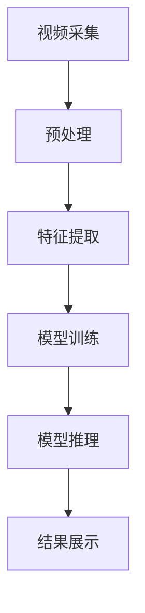

                 

关键词：AI大模型、智能视频分析、计算机视觉、深度学习、视频处理、实时监控

> 摘要：随着人工智能技术的不断发展，基于AI大模型的智能视频分析平台成为了当前视频处理和监控领域的一个重要研究方向。本文将详细介绍这种平台的核心概念、算法原理、数学模型、实践应用，以及未来的发展趋势和面临的挑战。

## 1. 背景介绍

随着社会信息化程度的不断提高，视频数据量急剧增加，视频分析技术得到了广泛关注。传统的视频分析方法主要依赖于手工提取的特征和简单的统计方法，存在处理速度慢、准确率低、适应能力差等问题。随着深度学习技术的快速发展，特别是近年来AI大模型的提出和应用，为视频分析提供了新的思路和方法。AI大模型具有强大的特征提取和模式识别能力，能够高效处理大规模视频数据，提高分析准确率和实时性。

智能视频分析平台作为一种综合应用，涵盖了视频采集、存储、处理、分析和展示等多个环节。通过引入AI大模型，该平台可以实现视频内容的自动识别、分类、跟踪、行为分析等高级功能，为公共安全、城市管理、工业生产等领域提供了有力的技术支持。

## 2. 核心概念与联系

### 2.1 AI大模型

AI大模型是指通过深度学习技术训练得到的，具有大规模参数和强大计算能力的神经网络模型。这些模型通常基于多层感知器（MLP）、卷积神经网络（CNN）、循环神经网络（RNN）等架构，能够自动学习视频数据中的复杂特征和模式。

### 2.2 智能视频分析平台架构

智能视频分析平台主要包括视频采集、预处理、特征提取、模型训练、模型推理、结果展示等模块。其架构如下图所示：



### 2.3 AI大模型与智能视频分析平台的关系

AI大模型是智能视频分析平台的核心技术，用于提取视频数据中的关键特征和进行模式识别。智能视频分析平台通过集成AI大模型，能够实现对视频内容的智能分析，从而提高处理效率和准确率。

## 3. 核心算法原理 & 具体操作步骤

### 3.1 算法原理概述

智能视频分析平台的核心算法主要基于深度学习技术，包括卷积神经网络（CNN）、循环神经网络（RNN）等。这些算法通过多层非线性变换，对视频数据进行特征提取和模式识别。

### 3.2 算法步骤详解

#### 3.2.1 视频数据预处理

1. 视频数据输入：将采集到的视频数据输入到系统中。
2. 视频数据解码：对视频数据进行解码，提取图像帧。
3. 图像帧标准化：对图像帧进行归一化处理，使其满足神经网络训练要求。

#### 3.2.2 特征提取

1. 卷积操作：使用卷积神经网络对图像帧进行卷积操作，提取空间特征。
2. 池化操作：对卷积结果进行池化操作，降低特征维度。
3. 循环操作：使用循环神经网络对连续帧进行建模，提取时间特征。

#### 3.2.3 模型训练

1. 数据集划分：将预处理后的视频数据划分为训练集、验证集和测试集。
2. 模型训练：使用训练集数据对神经网络模型进行训练，调整模型参数。
3. 模型评估：使用验证集和测试集对模型进行评估，选择最优模型。

#### 3.2.4 模型推理

1. 视频数据输入：将待分析的实时视频数据输入到训练好的模型中。
2. 特征提取：对实时视频数据进行特征提取。
3. 模式识别：根据特征进行模式识别，输出分析结果。

### 3.3 算法优缺点

#### 优点：

1. 高效性：深度学习算法能够自动提取视频数据中的关键特征，提高分析效率。
2. 准确性：通过多层非线性变换，深度学习算法能够对视频数据中的复杂模式进行准确识别。
3. 自适应性：深度学习算法能够适应不同场景下的视频分析需求，具有较好的泛化能力。

#### 缺点：

1. 计算资源消耗：训练深度学习算法需要大量的计算资源和时间。
2. 数据依赖性：深度学习算法的性能高度依赖于训练数据的质量和数量。

### 3.4 算法应用领域

智能视频分析平台在公共安全、城市管理、工业生产、智能家居等多个领域具有广泛的应用前景。例如，在公共安全领域，可以用于人脸识别、车辆识别、行为分析等；在工业生产领域，可以用于设备故障检测、生产过程监控等。

## 4. 数学模型和公式

### 4.1 数学模型构建

智能视频分析平台中的数学模型主要包括卷积神经网络（CNN）和循环神经网络（RNN）。

#### 4.1.1 卷积神经网络（CNN）

CNN的主要组成部分包括卷积层、池化层和全连接层。其数学模型可以表示为：

$$
h^{(l)} = \sigma(f^{(l)}(W^{(l)} \cdot h^{(l-1)} + b^{(l)})
$$

其中，$h^{(l)}$表示第$l$层的激活值，$f^{(l)}$表示第$l$层的激活函数，$W^{(l)}$和$b^{(l)}$分别表示第$l$层的权重和偏置。

#### 4.1.2 循环神经网络（RNN）

RNN的主要组成部分包括输入层、隐藏层和输出层。其数学模型可以表示为：

$$
h_t = \sigma(W_h \cdot [h_{t-1}, x_t] + b_h)
$$

$$
y_t = W_o \cdot h_t + b_o
$$

其中，$h_t$表示第$t$个时间步的隐藏层状态，$x_t$表示第$t$个时间步的输入，$y_t$表示第$t$个时间步的输出。

### 4.2 公式推导过程

#### 4.2.1 卷积神经网络（CNN）

卷积神经网络的公式推导主要包括卷积操作、池化操作和全连接操作。

1. 卷积操作：

$$
(C_{ij}^{(l)}) = \sum_{k} W_{ik}^{(l)} C_{kj}^{(l-1)} + b_k^{(l)}
$$

其中，$C_{ij}^{(l)}$表示第$l$层的卷积结果，$W_{ik}^{(l)}$和$b_k^{(l)}$分别表示第$l$层的卷积权重和偏置。

2. 池化操作：

$$
(P_{ij}^{(l)}) = \max_{(i',j') \in R_k} C_{i'j'}^{(l-1)}
$$

其中，$P_{ij}^{(l)}$表示第$l$层的池化结果，$R_k$表示池化区域。

3. 全连接操作：

$$
h^{(l)} = \sigma(W^{(l)} \cdot h^{(l-1)} + b^{(l)})
$$

其中，$h^{(l)}$表示第$l$层的激活值，$W^{(l)}$和$b^{(l)}$分别表示第$l$层的权重和偏置。

#### 4.2.2 循环神经网络（RNN）

循环神经网络的公式推导主要包括输入层、隐藏层和输出层的计算。

1. 输入层：

$$
h_t = \sigma(W_h \cdot [h_{t-1}, x_t] + b_h)
$$

其中，$h_t$表示第$t$个时间步的隐藏层状态，$x_t$表示第$t$个时间步的输入。

2. 隐藏层：

$$
h_t = \sigma(W_h \cdot [h_{t-1}, x_t] + b_h)
$$

其中，$h_t$表示第$t$个时间步的隐藏层状态，$x_t$表示第$t$个时间步的输入。

3. 输出层：

$$
y_t = W_o \cdot h_t + b_o
$$

其中，$y_t$表示第$t$个时间步的输出。

### 4.3 案例分析与讲解

以视频分类任务为例，介绍基于AI大模型的智能视频分析平台的实现过程。

#### 4.3.1 数据集准备

首先，我们需要收集并准备用于训练和测试的视频数据集。数据集应包含不同类别的视频，例如人物、动物、车辆等。每个视频的标签应与类别对应。

#### 4.3.2 数据预处理

对收集到的视频数据集进行预处理，包括视频解码、图像帧提取、图像帧标准化等操作。具体步骤如下：

1. 视频解码：使用视频解码库（如OpenCV）将视频文件解码为图像帧序列。
2. 图像帧提取：从图像帧序列中提取连续的图像帧。
3. 图像帧标准化：对图像帧进行归一化处理，使其满足神经网络训练要求。

#### 4.3.3 模型训练

使用预处理后的数据集对卷积神经网络（CNN）进行训练。训练过程包括以下步骤：

1. 数据集划分：将预处理后的数据集划分为训练集、验证集和测试集。
2. 模型初始化：初始化卷积神经网络（CNN）的权重和偏置。
3. 模型训练：使用训练集数据对模型进行训练，调整模型参数。
4. 模型评估：使用验证集和测试集对模型进行评估，选择最优模型。

#### 4.3.4 模型推理

使用训练好的模型对实时视频数据进行分析。具体步骤如下：

1. 视频数据输入：将实时视频数据输入到训练好的模型中。
2. 特征提取：对实时视频数据进行特征提取。
3. 模式识别：根据特征进行模式识别，输出分析结果。

#### 4.3.5 结果展示

将分析结果进行可视化展示，例如在屏幕上显示视频分类的实时结果。

## 5. 项目实践：代码实例和详细解释说明

### 5.1 开发环境搭建

首先，我们需要搭建一个适合开发智能视频分析平台的开发环境。以下是开发环境搭建的步骤：

1. 安装Python：从官方网站下载并安装Python。
2. 安装深度学习框架：安装TensorFlow或PyTorch等深度学习框架。
3. 安装OpenCV：安装OpenCV库用于视频处理。

### 5.2 源代码详细实现

以下是一个基于TensorFlow和OpenCV的智能视频分析平台的代码示例：

```python
import cv2
import tensorflow as tf

# 加载预训练的模型
model = tf.keras.models.load_model('model.h5')

# 读取视频文件
video = cv2.VideoCapture('video.mp4')

# 循环读取视频帧
while video.isOpened():
    ret, frame = video.read()
    if not ret:
        break

    # 对视频帧进行预处理
    processed_frame = preprocess_frame(frame)

    # 使用模型进行特征提取
    features = model.predict(processed_frame)

    # 根据特征进行分类
    category = classify(features)

    # 在视频帧上绘制分类结果
    cv2.putText(frame, category, (10, 30), cv2.FONT_HERSHEY_SIMPLEX, 1, (0, 0, 255), 2)

    # 显示视频帧
    cv2.imshow('Video', frame)

    # 按下ESC键退出
    if cv2.waitKey(1) & 0xFF == 27:
        break

# 释放资源
video.release()
cv2.destroyAllWindows()

# 预处理视频帧
def preprocess_frame(frame):
    # 图像帧归一化
    normalized_frame = frame / 255.0

    # 图像帧转换为TensorFlow格式
    processed_frame = tf.expand_dims(normalized_frame, 0)

    return processed_frame

# 分类函数
def classify(features):
    # 使用训练好的分类器进行分类
    category_index = np.argmax(features)

    # 根据类别索引获取类别名称
    categories = ['person', 'animal', 'vehicle']
    category = categories[category_index]

    return category
```

### 5.3 代码解读与分析

上述代码实现了一个简单的智能视频分析平台，主要包括以下功能：

1. 读取视频文件并循环读取视频帧。
2. 对视频帧进行预处理，包括归一化和转换为TensorFlow格式。
3. 使用训练好的模型进行特征提取。
4. 根据特征进行分类，并在视频帧上绘制分类结果。
5. 显示视频帧，并按ESC键退出。

代码中的关键函数包括`preprocess_frame`和`classify`：

- `preprocess_frame`函数用于对视频帧进行预处理，包括归一化和转换为TensorFlow格式。这是深度学习模型输入数据的要求。
- `classify`函数用于根据特征进行分类，并返回类别名称。这里使用了训练好的分类器进行分类。

### 5.4 运行结果展示

运行上述代码后，程序将读取视频文件并显示视频帧。在每个视频帧上，程序会根据训练好的模型进行分类，并在视频帧上绘制分类结果。例如，如果视频帧中包含人物，则会在视频帧上显示“person”字样。

## 6. 实际应用场景

智能视频分析平台在多个领域具有广泛的应用场景，以下列举几个典型的应用案例：

### 6.1 公共安全

在公共安全领域，智能视频分析平台可以用于监控人员活动、识别可疑行为、预防犯罪等。例如，在火车站、机场、商场等场所，智能视频分析平台可以实时监控人员流动情况，识别潜在的安全威胁。

### 6.2 城市管理

在城市管理领域，智能视频分析平台可以用于交通流量监控、环境监测、城市管理等方面。例如，通过分析交通摄像头拍摄到的车辆数据，可以实时了解道路拥堵情况，优化交通流量。

### 6.3 工业生产

在工业生产领域，智能视频分析平台可以用于设备故障检测、生产过程监控等。例如，通过分析生产线上机器的运行状态，可以提前发现设备故障，避免生产事故。

### 6.4 智能家居

在智能家居领域，智能视频分析平台可以用于家居安全监控、智能家电控制等。例如，通过分析摄像头拍摄到的画面，可以实时了解家居环境，并根据用户需求自动控制家电设备。

## 7. 工具和资源推荐

### 7.1 学习资源推荐

1. 《深度学习》（Goodfellow, Bengio, Courville）：介绍了深度学习的基础理论和实践方法。
2. 《Python深度学习》（François Chollet）：针对Python编程环境，介绍了深度学习技术的应用。
3. 《计算机视觉：算法与应用》（Richard Szeliski）：介绍了计算机视觉领域的基本算法和应用。

### 7.2 开发工具推荐

1. TensorFlow：由Google开发的开源深度学习框架，适用于多种深度学习任务。
2. PyTorch：由Facebook开发的开源深度学习框架，具有灵活的动态计算图支持。
3. OpenCV：开源的计算机视觉库，提供了丰富的图像处理和视频分析功能。

### 7.3 相关论文推荐

1. "Deep Learning for Video Classification"（2017）：介绍了深度学习在视频分类领域的应用。
2. "Object Detection with Transformations"（2016）：提出了基于变换的物体检测算法。
3. "Video Classification using Recurrent Neural Networks"（2015）：介绍了基于循环神经网络的视频分类方法。

## 8. 总结：未来发展趋势与挑战

### 8.1 研究成果总结

基于AI大模型的智能视频分析平台在处理速度、准确率、自适应能力等方面取得了显著成果。通过深度学习技术的应用，该平台能够自动提取视频数据中的关键特征，实现高效、准确的视频分析。

### 8.2 未来发展趋势

未来，基于AI大模型的智能视频分析平台将朝着更高效、更准确、更智能的方向发展。一方面，研究人员将致力于优化深度学习算法，提高处理速度和准确率；另一方面，将探索新的应用场景，拓展视频分析平台的实际应用价值。

### 8.3 面临的挑战

尽管基于AI大模型的智能视频分析平台取得了显著成果，但仍面临一些挑战。首先，计算资源消耗仍然较大，需要优化算法和硬件设备；其次，深度学习算法对训练数据的质量和数量高度依赖，如何获取高质量的训练数据成为关键问题；此外，如何提高算法的泛化能力，使其适应不同场景下的需求，也是一个重要的研究方向。

### 8.4 研究展望

未来，基于AI大模型的智能视频分析平台有望在更多领域得到广泛应用。随着深度学习技术的不断发展，该平台将进一步提高处理速度和准确率，实现更高效、更智能的视频分析。同时，研究人员将继续探索新的算法和应用场景，推动智能视频分析技术的发展。

## 9. 附录：常见问题与解答

### 9.1 什么是AI大模型？

AI大模型是指通过深度学习技术训练得到的，具有大规模参数和强大计算能力的神经网络模型。这些模型通常基于多层感知器（MLP）、卷积神经网络（CNN）、循环神经网络（RNN）等架构，能够自动学习视频数据中的复杂特征和模式。

### 9.2 智能视频分析平台有哪些应用领域？

智能视频分析平台在公共安全、城市管理、工业生产、智能家居等多个领域具有广泛的应用前景。例如，在公共安全领域，可以用于人脸识别、车辆识别、行为分析等；在工业生产领域，可以用于设备故障检测、生产过程监控等。

### 9.3 如何优化智能视频分析平台的性能？

优化智能视频分析平台的性能可以从以下几个方面进行：

1. 优化深度学习算法，提高处理速度和准确率；
2. 优化硬件设备，提高计算能力；
3. 提高训练数据的质量和数量，增强模型的泛化能力；
4. 采用分布式计算和并行处理技术，提高处理效率。

### 9.4 智能视频分析平台有哪些挑战？

智能视频分析平台面临的挑战主要包括计算资源消耗大、训练数据依赖性强、算法泛化能力差等。此外，如何适应不同场景下的需求，实现高效、准确的视频分析也是一个重要的挑战。

