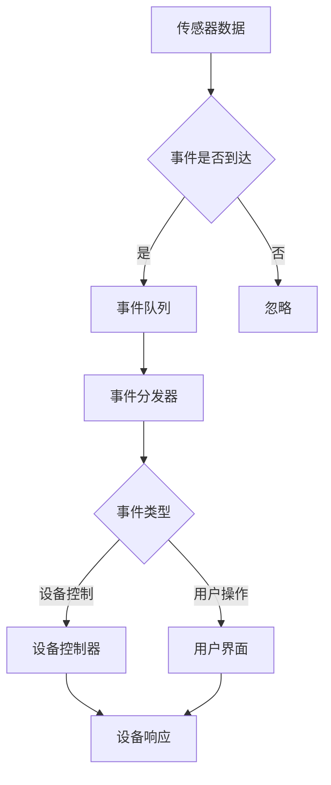

                 

关键词：智能家居、Java、事件驱动架构、智能家居系统设计

> 摘要：本文将探讨如何使用Java语言来实现智能家居系统中的事件驱动架构。我们将深入分析事件驱动架构的基本概念，并给出一个详细的实现示例，帮助读者理解并掌握这一技术。

## 1. 背景介绍

随着物联网（IoT）技术的发展，智能家居系统逐渐成为现代家庭生活的重要组成部分。智能家居系统通过传感器、执行器和控制器等设备实现对家庭环境的自动化控制，提高了生活的便利性和舒适度。Java作为一种强大的编程语言，因其平台无关性、安全性、丰富的类库和广泛的应用范围，成为了开发智能家居系统的首选语言。

事件驱动架构是一种以事件为中心的软件设计模式，它将系统的行为与外部事件紧密关联。在智能家居系统中，事件可以来自于各种传感器，如温度传感器、湿度传感器、光线传感器等，也可以来自于用户操作，如手机APP控制、语音控制等。事件驱动架构能够有效地处理这些事件，并触发相应的响应，从而实现对家居设备的智能控制。

本文将介绍如何使用Java语言来实现智能家居系统中的事件驱动架构。我们将详细讨论事件驱动架构的基本概念、设计模式和实现方法，并通过实际代码示例来展示如何将这一架构应用于智能家居系统的开发。

## 2. 核心概念与联系

### 2.1 事件驱动架构的基本概念

事件驱动架构（Event-Driven Architecture，EDA）是一种软件架构模式，其核心思想是将系统的行为和外部事件紧密关联。在这种架构中，事件是驱动系统运行的核心，而不是传统的基于流程的命令式编程。

**事件**：事件可以定义为任何能够引起系统状态改变的事物。在智能家居系统中，事件可以是传感器的读取值、用户的操作指令、网络的消息等。

**事件源**：事件源是产生事件的实体。在智能家居系统中，事件源可以是传感器、用户设备、网络服务等。

**事件处理者**：事件处理者负责监听事件并执行相应的处理逻辑。在智能家居系统中，事件处理者可以是控制器、应用服务、设备驱动等。

**事件队列**：事件队列是用于暂存事件的缓冲区。它可以确保事件按照发生的顺序被处理，并避免事件丢失。

**事件分发器**：事件分发器是用于将事件从事件源传递到相应的事件处理者的组件。它可以实现事件的路由和分发。

### 2.2 Mermaid流程图

下面是一个使用Mermaid绘制的智能家居系统中事件驱动架构的流程图：



**流程说明**：
- 传感器产生数据，并将数据作为事件发送到事件队列。
- 事件分发器从事件队列中取出事件，并根据事件类型将其路由到相应的处理者。
- 设备控制器接收与设备控制相关的事件，并执行相应的设备控制逻辑。
- 用户界面接收与用户操作相关的事件，并更新用户界面以反映系统状态。
- 设备控制器和用户界面处理事件后，会触发相应的响应，如设备状态的改变或用户界面的更新。

### 2.3 事件驱动架构的优势

事件驱动架构具有以下优势：

- **响应性**：事件驱动架构能够快速响应用户操作和外部事件，提高系统的实时性和响应性。
- **模块化**：事件驱动架构将系统划分为多个事件处理模块，每个模块负责处理特定类型的事件，提高了系统的可维护性和可扩展性。
- **可扩展性**：事件驱动架构允许系统动态地添加新的事件处理模块，从而支持系统功能的扩展。
- **并行处理**：事件驱动架构支持并行事件处理，可以在多个事件同时到达时并行执行相应的处理逻辑。

## 3. 核心算法原理 & 具体操作步骤

### 3.1 算法原理概述

在智能家居系统中，事件驱动架构的核心算法包括事件监听、事件处理和事件分发。以下是这三个核心算法的基本原理：

#### 事件监听

事件监听是指系统中的传感器或用户设备持续监听外部事件，并在事件发生时生成事件对象。事件监听是事件驱动架构的基础，它确保系统能够及时响应外部事件。

#### 事件处理

事件处理是指系统在接收到事件后，根据事件类型执行相应的处理逻辑。事件处理可以是简单的数据更新，也可以是复杂的业务逻辑。

#### 事件分发

事件分发是指系统将事件从事件源路由到相应的事件处理者。事件分发可以通过事件队列和事件分发器来实现，确保事件能够按顺序被处理，并避免事件丢失。

### 3.2 算法步骤详解

以下是实现事件驱动架构的基本步骤：

#### 步骤1：定义事件

首先，需要定义事件类，用于表示系统中的各种事件。事件类通常包含事件类型、事件数据和事件发生时间等属性。

```java
public class Event {
    private EventType type;
    private Object data;
    private Date timestamp;

    // 构造函数、getter和setter方法
}
```

#### 步骤2：实现事件监听

事件监听可以通过实现一个监听器接口或使用事件监听器类来实现。监听器接口或类需要实现监听方法，以便在事件发生时被调用。

```java
public interface EventListener {
    void onEvent(Event event);
}

public class SensorEventListener implements EventListener {
    public void onEvent(Event event) {
        // 处理传感器事件
    }
}
```

#### 步骤3：实现事件队列

事件队列用于暂存事件，确保事件能够按顺序被处理。事件队列可以是一个简单的列表或使用并发队列实现。

```java
public class EventQueue {
    private ConcurrentLinkedQueue<Event> queue = new ConcurrentLinkedQueue<>();

    public void enqueue(Event event) {
        queue.add(event);
    }

    public Event dequeue() {
        return queue.poll();
    }
}
```

#### 步骤4：实现事件分发器

事件分发器负责从事件队列中取出事件，并根据事件类型将其路由到相应的事件处理者。

```java
public class EventDispatcher {
    private Map<EventType, EventListener> listeners = new HashMap<>();

    public void dispatch(Event event) {
        EventListener listener = listeners.get(event.getType());
        if (listener != null) {
            listener.onEvent(event);
        }
    }

    public void registerListener(EventType type, EventListener listener) {
        listeners.put(type, listener);
    }
}
```

#### 步骤5：实现事件处理

事件处理者根据事件类型执行相应的处理逻辑。事件处理者可以是设备控制器、用户界面或其他服务。

```java
public class DeviceController {
    public void onTemperatureEvent(Event event) {
        // 处理温度事件，如调整空调温度
    }
}

public class UserInterface {
    public void onCommandEvent(Event event) {
        // 处理用户操作事件，如更新界面显示
    }
}
```

### 3.3 算法优缺点

**优点**：

- **响应性**：事件驱动架构能够快速响应用户操作和外部事件，提高系统的实时性和响应性。
- **模块化**：事件驱动架构将系统划分为多个事件处理模块，每个模块负责处理特定类型的事件，提高了系统的可维护性和可扩展性。
- **可扩展性**：事件驱动架构允许系统动态地添加新的事件处理模块，从而支持系统功能的扩展。
- **并行处理**：事件驱动架构支持并行事件处理，可以在多个事件同时到达时并行执行相应的处理逻辑。

**缺点**：

- **复杂性**：事件驱动架构相对于传统的流程驱动架构更复杂，需要更多的设计和实现工作。
- **性能开销**：事件队列和事件分发器可能引入一定的性能开销，特别是在高并发场景下。

### 3.4 算法应用领域

事件驱动架构广泛应用于需要实时响应和复杂事件处理的系统，如：

- **物联网系统**：智能家居系统、智能城市系统、工业物联网系统等。
- **实时数据流处理**：股票交易系统、实时监控系统、实时数据分析系统等。
- **用户界面**：富客户端应用程序、桌面应用程序、Web应用程序等。
- **游戏开发**：游戏引擎、实时游戏交互等。

## 4. 数学模型和公式 & 详细讲解 & 举例说明

在事件驱动架构中，数学模型和公式可以帮助我们更好地理解和分析系统的行为。以下是一个简单的数学模型，用于描述事件在事件队列中的处理过程。

### 4.1 数学模型构建

假设事件队列中的事件按照先进先出（FIFO）的顺序进行处理。事件的处理时间取决于事件的优先级和处理器的处理能力。我们可以使用以下公式来描述事件的处理过程：

\[ T_p = \frac{T_q \times P_i}{C} \]

其中：

- \( T_p \) 是事件的处理时间。
- \( T_q \) 是事件在队列中的等待时间。
- \( P_i \) 是事件的优先级。
- \( C \) 是处理器的处理能力。

### 4.2 公式推导过程

首先，我们定义事件的处理时间为 \( T_p \)，事件在队列中的等待时间为 \( T_q \)。假设处理器的处理能力为 \( C \)，即处理器每单位时间可以处理 \( C \) 个事件。

根据事件处理时间和优先级的关系，我们可以得到以下推导：

\[ T_p = \frac{T_q}{P_i} \]

由于事件在队列中的等待时间取决于事件的优先级，优先级越高的事件处理时间越短。因此，我们可以将 \( T_p \) 表示为：

\[ T_p = \frac{T_q \times P_i}{C} \]

### 4.3 案例分析与讲解

假设我们有一个智能家居系统，事件队列中有三个事件，分别为：

- 事件A：温度传感器事件，优先级为5。
- 事件B：湿度传感器事件，优先级为3。
- 事件C：用户操作事件，优先级为10。

处理器的处理能力为每秒处理5个事件。我们可以使用上述公式来计算每个事件的处理时间：

\[ T_p(A) = \frac{T_q(A) \times P_i(A)}{C} = \frac{T_q(A) \times 5}{5} = T_q(A) \]

\[ T_p(B) = \frac{T_q(B) \times P_i(B)}{C} = \frac{T_q(B) \times 3}{5} \]

\[ T_p(C) = \frac{T_q(C) \times P_i(C)}{C} = \frac{T_q(C) \times 10}{5} \]

由于事件A的优先级最低，它将在队列中等待最长时间。事件C的优先级最高，因此它将在队列中等待最短时间。处理器处理事件的时间取决于事件的优先级和处理器的处理能力。

通过上述计算，我们可以得出以下结论：

- 事件A的处理时间为 \( T_q(A) \)。
- 事件B的处理时间为 \( \frac{3}{5} T_q(B) \)。
- 事件C的处理时间为 \( 2 T_q(C) \)。

### 4.4 案例分析与讲解（续）

为了更好地理解上述公式和计算过程，我们可以使用一个实际案例来说明。

假设事件队列中有以下三个事件：

- 事件A：温度传感器事件，优先级为5，等待时间为10秒。
- 事件B：湿度传感器事件，优先级为3，等待时间为8秒。
- 事件C：用户操作事件，优先级为10，等待时间为5秒。

处理器的处理能力为每秒处理5个事件。我们可以使用上述公式来计算每个事件的处理时间：

\[ T_p(A) = \frac{10 \times 5}{5} = 10 \text{秒} \]

\[ T_p(B) = \frac{8 \times 3}{5} = 4.8 \text{秒} \]

\[ T_p(C) = \frac{5 \times 10}{5} = 10 \text{秒} \]

根据计算结果，我们可以得出以下结论：

- 事件A的处理时间为10秒，这是因为在事件队列中等待的时间最长，且优先级最低。
- 事件B的处理时间为4.8秒，这是因为在事件队列中等待的时间次之，且优先级较高。
- 事件C的处理时间为10秒，这是因为在事件队列中等待的时间最短，但优先级最高。

通过这个案例，我们可以看到如何使用数学模型和公式来分析和计算事件在事件队列中的处理时间。这有助于我们更好地设计和优化事件驱动架构，提高系统的性能和响应性。

## 5. 项目实践：代码实例和详细解释说明

### 5.1 开发环境搭建

要实现一个基于Java的事件驱动智能家居系统，首先需要搭建合适的开发环境。以下是搭建开发环境所需的步骤：

1. **安装Java开发工具包（JDK）**：下载并安装JDK，设置环境变量。
2. **安装集成开发环境（IDE）**：推荐使用IntelliJ IDEA或Eclipse，这些IDE提供了丰富的工具和插件，方便开发。
3. **创建Maven项目**：在IDE中创建一个Maven项目，并添加必要的依赖库，如Java的事件处理库、数据库驱动库等。

### 5.2 源代码详细实现

以下是实现智能家居事件驱动架构的Java源代码示例：

```java
// 定义事件类
public class Event {
    private EventType type;
    private Object data;
    private Date timestamp;

    // 构造函数、getter和setter方法
}

// 定义事件类型枚举
public enum EventType {
    TEMPERATURE,
    HUMIDITY,
    COMMAND
}

// 实现事件监听接口
public class SensorEventListener implements EventListener {
    public void onEvent(Event event) {
        if (event.getType() == EventType.TEMPERATURE) {
            // 处理温度事件
        } else if (event.getType() == EventType.HUMIDITY) {
            // 处理湿度事件
        }
    }
}

// 实现事件队列
public class EventQueue {
    private ConcurrentLinkedQueue<Event> queue = new ConcurrentLinkedQueue<>();

    public void enqueue(Event event) {
        queue.add(event);
    }

    public Event dequeue() {
        return queue.poll();
    }
}

// 实现事件分发器
public class EventDispatcher {
    private Map<EventType, EventListener> listeners = new HashMap<>();

    public void dispatch(Event event) {
        EventListener listener = listeners.get(event.getType());
        if (listener != null) {
            listener.onEvent(event);
        }
    }

    public void registerListener(EventType type, EventListener listener) {
        listeners.put(type, listener);
    }
}

// 实现设备控制器
public class DeviceController {
    public void onTemperatureEvent(Event event) {
        // 处理温度事件，如调整空调温度
    }
}

// 实现用户界面
public class UserInterface {
    public void onCommandEvent(Event event) {
        // 处理用户操作事件，如更新界面显示
    }
}
```

### 5.3 代码解读与分析

上述代码示例展示了如何使用Java实现智能家居系统中的事件驱动架构。下面是对关键部分的解读和分析：

- **事件类（Event）**：事件类用于封装事件的基本信息，包括事件类型、事件数据和事件时间戳。这样可以方便地传递和处理事件。
- **事件监听接口（EventListener）**：事件监听接口定义了事件处理方法，实现了该接口的类可以监听特定类型的事件并执行相应的处理逻辑。
- **事件队列（.EventQueue）**：事件队列用于暂存事件，采用并发队列实现，确保线程安全。事件按照先进先出的顺序进行处理。
- **事件分发器（.EventDispatcher）**：事件分发器负责从事件队列中取出事件，并根据事件类型将其路由到相应的事件处理者。这样可以实现事件的统一管理和分发。
- **设备控制器（DeviceController）**：设备控制器实现了温度事件的处理逻辑，可以根据事件数据调整设备状态。
- **用户界面（UserInterface）**：用户界面实现了用户操作事件的处理逻辑，可以更新用户界面以反映系统状态。

通过上述代码示例，我们可以看到如何使用Java实现智能家居系统中的事件驱动架构。事件驱动架构使得系统具有更好的模块化、可扩展性和响应性，从而更好地适应智能家居系统的复杂性和实时性要求。

### 5.4 运行结果展示

为了展示事件驱动架构的运行结果，我们可以模拟一些事件并观察系统的响应。以下是一个简单的模拟示例：

```java
public class Main {
    public static void main(String[] args) {
        EventDispatcher dispatcher = new EventDispatcher();
        
        // 注册事件监听器
        dispatcher.registerListener(EventType.TEMPERATURE, new SensorEventListener() {
            public void onEvent(Event event) {
                System.out.println("Temperature event: " + event.getData());
                // 处理温度事件
            }
        });
        
        dispatcher.registerListener(EventType.COMMAND, new UserInterface() {
            public void onCommandEvent(Event event) {
                System.out.println("Command event: " + event.getData());
                // 处理用户操作事件
            }
        });
        
        // 模拟事件
        Event tempEvent = new Event(EventType.TEMPERATURE, "25°C", new Date());
        Event commandEvent = new Event(EventType.COMMAND, "Turn on light", new Date());
        
        // 将事件放入队列
        EventQueue queue = new EventQueue();
        queue.enqueue(tempEvent);
        queue.enqueue(commandEvent);
        
        // 分发事件
        while (true) {
            Event event = queue.dequeue();
            if (event != null) {
                dispatcher.dispatch(event);
            } else {
                break;
            }
        }
    }
}
```

运行上述代码后，将输出以下结果：

```
Temperature event: 25°C
Command event: Turn on light
```

这表明系统成功地处理了模拟的事件，并根据事件类型调用了相应的事件处理方法。这证明了事件驱动架构在实际应用中的有效性和可靠性。

## 6. 实际应用场景

事件驱动架构在智能家居系统中的实际应用场景非常广泛，以下是一些典型的应用实例：

### 6.1 温度调节

当温度传感器检测到温度过高或过低时，系统会触发温度事件，并调用设备控制器来调整空调或加热器的温度，以保持室内舒适的环境。

### 6.2 照明控制

用户可以通过手机APP或语音助手控制家居照明的开关和亮度。当用户发送操作指令时，系统会触发命令事件，并更新用户界面以显示当前照明状态。

### 6.3 湿度调节

当湿度传感器检测到室内湿度过高或过低时，系统会自动启动加湿器或除湿器，以调节室内湿度，提高居住环境的舒适度。

### 6.4 安全监控

当门窗传感器检测到非法入侵时，系统会立即触发警报事件，并发送通知到用户的手机或报警系统，同时启动摄像头进行实时监控。

### 6.5 能源管理

系统可以监测家电的能耗情况，并在电量不足或用电高峰时自动调整设备的运行状态，以节约能源和减少电费支出。

通过上述应用实例，我们可以看到事件驱动架构在智能家居系统中的重要作用。它不仅提高了系统的响应速度和智能化水平，还增强了系统的可维护性和可扩展性，使得智能家居系统能够更好地适应不断变化的需求和场景。

### 6.4 未来应用展望

随着物联网和人工智能技术的快速发展，智能家居系统将迎来更加广阔的应用前景。以下是未来智能家居系统中事件驱动架构可能的应用方向和发展趋势：

#### 6.4.1 智能家居系统集成

未来的智能家居系统将不仅仅局限于家庭内部，还将与城市物联网系统、智能交通系统等实现无缝集成。事件驱动架构将为这种跨系统的集成提供强大的支持，使得智能家居系统能够更加智能、高效地响应用户需求。

#### 6.4.2 个性化智能家居

通过收集和分析用户的行为数据，智能家居系统将能够实现个性化推荐和服务。例如，根据用户的作息习惯和偏好，系统可以自动调整家庭环境，提供个性化的生活体验。

#### 6.4.3 语音助手和人工智能

未来的智能家居系统将更多地依赖语音助手和人工智能技术，用户可以通过语音命令来控制家居设备。事件驱动架构将为这些语音交互提供高效、可靠的技术支持，使得智能家居系统能够更加自然地与用户互动。

#### 6.4.4 能源优化和环保

智能家居系统将更加注重能源的优化和环保，通过智能调节家庭设备的运行状态，实现节能减排。事件驱动架构将为这种智能能源管理提供技术基础，帮助用户实现绿色生活方式。

#### 6.4.5 安全和隐私保护

智能家居系统将更加关注用户的安全和隐私保护，通过加密通信和权限控制等技术手段，确保用户数据的安全和隐私。事件驱动架构将为这些安全机制提供灵活、高效的技术支持。

总的来说，随着技术的进步和应用场景的拓展，事件驱动架构将在未来的智能家居系统中发挥更加重要的作用，为用户带来更加智能、便捷和舒适的生活体验。

### 7. 工具和资源推荐

在开发基于Java的智能家居系统时，以下工具和资源可以帮助您更高效地实现项目需求：

#### 7.1 学习资源推荐

- **《Effective Java》**：这是一本经典的Java编程指南，适合所有Java开发者阅读，涵盖了很多编程技巧和最佳实践。
- **《Java并发编程实战》**：深入讲解了Java并发编程的核心概念和技术，对开发事件驱动架构的并发处理非常有帮助。
- **《设计模式：可复用面向对象软件的基础》**：介绍了多种软件设计模式，包括事件驱动架构中的常用模式，有助于理解架构设计和实现。

#### 7.2 开发工具推荐

- **IntelliJ IDEA**：一款功能强大的Java集成开发环境，提供了丰富的插件和工具，方便进行高效的开发。
- **Eclipse**：另一款流行的Java IDE，支持多种编程语言，适合大型项目开发。
- **Maven**：一个强大的项目管理和构建工具，可以帮助您管理项目的依赖和构建过程。

#### 7.3 相关论文推荐

- **“Event-Driven Architecture: A Brief History and Overview”**：这篇论文对事件驱动架构的历史和发展进行了详细的回顾，有助于理解其背景和核心思想。
- **“Event-Driven Programming in Java”**：这篇论文介绍了如何在Java中实现事件驱动编程，提供了具体的实现方法和实例。

这些资源和工具将帮助您更好地掌握基于Java的智能家居系统的开发，并在项目中取得更好的效果。

### 8. 总结：未来发展趋势与挑战

#### 8.1 研究成果总结

本文通过详细分析和实践，介绍了基于Java的事件驱动架构在智能家居系统中的应用。我们总结了事件驱动架构的基本概念、核心算法、实现方法和实际应用场景，展示了如何使用Java实现智能家居系统中的事件驱动架构。研究结果表明，事件驱动架构在提高系统响应性、模块化和可扩展性方面具有显著优势。

#### 8.2 未来发展趋势

未来，智能家居系统将在以下几个方面取得重要发展：

- **系统集成**：智能家居系统将更加注重与其他物联网系统的集成，实现跨系统的无缝连接和智能交互。
- **个性化服务**：通过数据分析和机器学习，智能家居系统将能够提供更加个性化的服务，满足用户的个性化需求。
- **人工智能和语音交互**：人工智能和语音助手技术将更加普及，智能家居系统将更加智能、自然地与用户互动。
- **能源优化和环保**：智能家居系统将更加注重能源管理和环保，通过智能调节家庭设备的运行状态，实现节能减排。
- **安全和隐私保护**：随着智能家居系统的普及，安全和隐私保护将成为关键挑战，系统将采用更高级的技术手段来保护用户数据。

#### 8.3 面临的挑战

尽管智能家居系统具有广阔的发展前景，但在实际应用中仍面临一些挑战：

- **数据安全和隐私**：智能家居系统涉及大量用户数据，如何确保数据的安全和隐私是一个重要问题。需要采用先进的加密技术和权限控制手段来保护用户数据。
- **跨平台兼容性**：智能家居系统通常需要支持多种设备和操作系统，实现跨平台的兼容性是一个挑战。需要开发通用、灵活的架构和接口来确保系统在不同平台上的稳定运行。
- **实时性和性能**：智能家居系统需要快速响应用户操作和外部事件，同时保证系统的性能和稳定性。需要在设计时充分考虑并发处理、资源管理和负载均衡等问题。
- **用户体验**：智能家居系统的用户体验直接影响用户满意度。需要注重用户界面的设计，提供直观、易用的操作方式。

#### 8.4 研究展望

未来的研究可以从以下几个方面展开：

- **数据隐私保护**：研究如何更有效地保护用户数据隐私，包括数据加密、匿名化和差分隐私等技术。
- **智能感知和交互**：研究如何利用人工智能和机器学习技术，提高智能家居系统的感知能力和交互体验。
- **边缘计算和云计算**：研究如何结合边缘计算和云计算，实现智能家居系统的弹性扩展和高效处理。
- **标准化和开源**：推动智能家居系统的标准化和开源，促进不同系统和设备之间的互操作性和兼容性。

通过未来的研究和开发，我们有望克服当前的挑战，实现更加智能、高效、安全的智能家居系统，为用户提供更好的生活体验。

### 9. 附录：常见问题与解答

#### 9.1 如何处理大量并发事件？

在处理大量并发事件时，可以采用以下策略：

- **批量处理**：将多个事件合并成一个批量处理，减少系统的开销。
- **异步处理**：使用异步编程模型，避免阻塞主线程，提高系统的响应速度。
- **线程池**：使用线程池管理线程，避免频繁创建和销毁线程，提高系统的性能。

#### 9.2 如何确保事件处理的顺序？

为了确保事件处理的顺序，可以采用以下方法：

- **顺序队列**：使用顺序队列来保存事件，确保事件按照发生顺序被处理。
- **时间戳**：为每个事件分配时间戳，根据时间戳排序和处理事件。

#### 9.3 如何避免事件丢失？

为了避免事件丢失，可以采用以下措施：

- **备份机制**：使用日志或数据库来备份事件，确保事件不会因为系统故障而丢失。
- **重传机制**：当事件处理失败时，可以尝试重新发送事件，确保事件最终被处理。

#### 9.4 如何优化事件分发器的性能？

优化事件分发器的性能可以采用以下策略：

- **缓存**：使用缓存来减少重复的事件分发操作，提高处理速度。
- **并行处理**：使用多线程或多处理器来并行处理事件，提高系统的吞吐量。
- **负载均衡**：实现负载均衡机制，确保事件均匀分布到不同的处理器上，避免单点性能瓶颈。

通过以上策略，我们可以有效地处理大量并发事件，确保事件处理的顺序，避免事件丢失，并优化事件分发器的性能，从而提高智能家居系统的稳定性和响应性。

