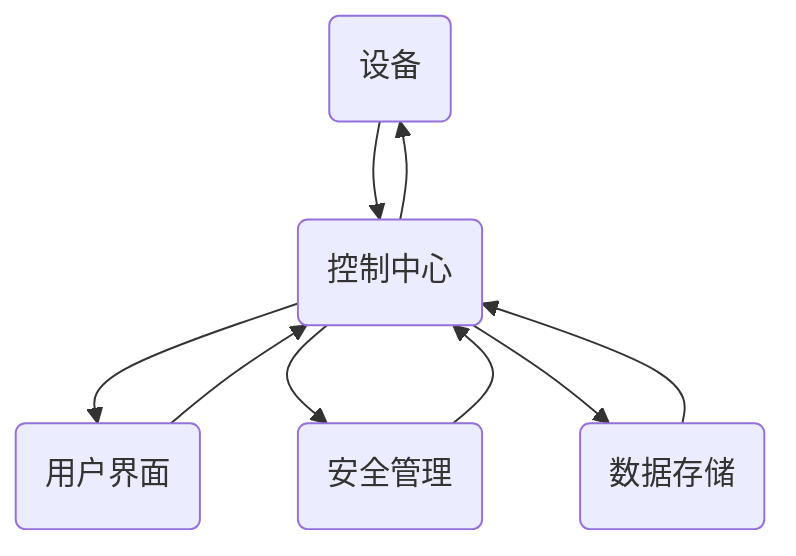
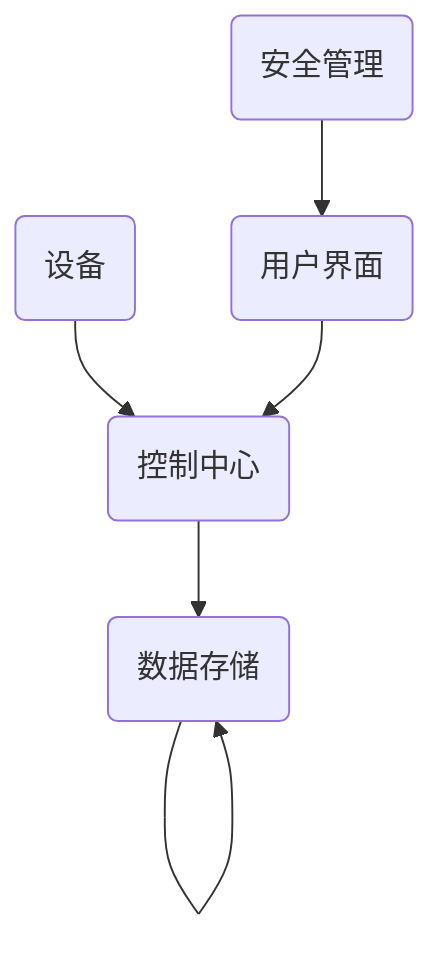

                 

关键词：智能家居、Java编程、面向对象设计、系统架构、设计模式、实现细节、算法、代码实例、应用场景

> 摘要：本文深入探讨了基于Java编程语言的智能家居系统设计模式，通过面向对象的设计方法，详细描述了智能家居系统的架构与实现细节。本文将分析常见的设计模式，探讨其应用场景，并通过具体的算法原理与Java代码实例，展示如何构建一个高效、灵活且易于扩展的智能家居系统。

## 1. 背景介绍

随着物联网（IoT）技术的快速发展，智能家居系统逐渐成为现代家庭生活的重要组成部分。智能家居系统通过将家庭中的各种设备连接到互联网，使用户能够远程控制和监控家庭环境，提高生活的便利性和舒适度。然而，智能家居系统的设计不仅需要考虑硬件设备，更重要的是软件系统的设计与实现。

Java作为一种广泛使用的编程语言，具有跨平台、安全可靠等优势，特别适用于构建复杂的分布式系统。面向对象设计（Object-Oriented Design, OOD）是一种有效的软件开发方法，通过将系统的功能划分为多个对象，可以降低系统的复杂度，提高系统的可维护性和扩展性。本文将探讨如何使用Java和面向对象设计方法来构建一个智能家居系统。

## 2. 核心概念与联系

为了构建一个智能家居系统，首先需要明确核心概念，这些概念之间相互联系，共同构成了系统的整体架构。以下是智能家居系统中的核心概念及其相互关系：

### 2.1 设备抽象

设备是智能家居系统的基本组成单元，包括但不限于智能灯泡、智能插座、智能摄像头等。在面向对象设计中，设备可以通过一个抽象的`Device`类来表示，该类定义了设备的基本属性和方法。

### 2.2 控制中心

控制中心是智能家居系统的核心组件，负责接收用户的控制命令，并根据设备的状态进行相应的操作。控制中心可以通过一个`SmartHomeController`类来实现，该类负责协调各个设备的工作。

### 2.3 用户界面

用户界面（User Interface, UI）是用户与智能家居系统交互的界面，通常包括网页、移动应用或桌面应用。用户界面可以通过一个`UserInterface`类来表示，该类负责接收用户输入并显示设备状态。

### 2.4 安全管理

安全管理是智能家居系统的重要方面，包括用户认证、数据加密和权限控制等。安全管理可以通过一个`SecurityManager`类来实现，该类负责处理与安全相关的操作。

### 2.5 数据存储

数据存储用于存储智能家居系统的配置信息、设备状态和历史数据。数据存储可以通过一个`DataStore`类来表示，该类提供了数据的增删改查操作。

### 2.6 Mermaid流程图

以下是一个简化的Mermaid流程图，展示了智能家居系统中的核心概念及其相互关系：



## 3. 核心算法原理 & 具体操作步骤

### 3.1 算法原理概述

智能家居系统的核心算法主要涉及设备的远程控制和状态监控。以下是算法的原理概述：

1. **设备远程控制**：通过HTTP请求或MQTT协议，控制中心向设备发送控制命令，设备接收到命令后执行相应的操作。
2. **状态监控**：设备定期向控制中心发送状态信息，控制中心根据这些信息调整系统配置或执行其他操作。
3. **事件处理**：设备或系统发生特定事件时，触发相应的处理逻辑，如用户登录、设备故障等。

### 3.2 算法步骤详解

1. **初始化系统**：
   - 加载设备列表和系统配置。
   - 启动控制中心和服务进程。

2. **用户登录**：
   - 用户通过用户界面输入用户名和密码。
   - 安全管理模块验证用户身份。

3. **设备远程控制**：
   - 用户在用户界面选择设备并输入控制命令。
   - 控制中心生成HTTP请求并发送到设备。
   - 设备接收到请求后执行操作。

4. **状态监控**：
   - 设备定期发送状态信息到控制中心。
   - 控制中心更新设备状态并在需要时进行相应操作。

5. **事件处理**：
   - 设备或系统发生特定事件时，触发事件处理逻辑。
   - 根据事件类型，执行相应的处理操作。

### 3.3 算法优缺点

**优点**：
- **模块化设计**：各个组件之间解耦，便于维护和扩展。
- **跨平台支持**：Java语言具备跨平台优势，可以运行在各种操作系统上。
- **安全可靠**：通过安全管理模块，保证系统的安全性和用户隐私。

**缺点**：
- **性能优化需求**：对于大量设备的并发控制，系统性能可能成为瓶颈。
- **复杂度高**：设计过程中需要综合考虑各种异常情况和错误处理。

### 3.4 算法应用领域

算法可以应用于多种智能家居场景，如：

- **智能照明**：根据用户习惯自动调整灯光亮度。
- **智能安防**：实时监控家庭环境，发现异常情况及时报警。
- **智能家电控制**：远程控制家电开关，提高生活便利性。

## 4. 数学模型和公式 & 详细讲解 & 举例说明

### 4.1 数学模型构建

智能家居系统的数学模型可以包括以下方面：

- **设备状态模型**：描述设备的状态，如开关状态、亮度、温度等。
- **控制策略模型**：定义设备控制策略，如PID控制、模糊控制等。
- **数据处理模型**：描述数据的处理方法，如数据过滤、预测分析等。

### 4.2 公式推导过程

以下是一个简单的PID控制公式：

$$
u(t) = K_p e(t) + K_i \int_{0}^{t} e(\tau) d\tau + K_d \frac{de(t)}{dt}
$$

其中：
- \(u(t)\) 是控制输出。
- \(e(t)\) 是控制误差，即期望值与实际值之差。
- \(K_p, K_i, K_d\) 分别是比例、积分、微分系数。

### 4.3 案例分析与讲解

假设我们需要通过PID控制算法控制一个智能灯泡的亮度。以下是一个简单的案例分析：

1. **设定初始状态**：智能灯泡的初始亮度为50%，期望亮度为70%。
2. **计算控制误差**：\(e(t) = 70\% - 50\% = 20\%\)。
3. **设置PID系数**：\(K_p = 1.2, K_i = 0.5, K_d = 0.3\)。
4. **计算控制输出**：\(u(t) = 1.2 \times 20\% + 0.5 \times \int_{0}^{t} 20\% d\tau + 0.3 \frac{de(t)}{dt}\)。

通过不断迭代计算，智能灯泡的亮度将逐渐调整到期望值。

## 5. 项目实践：代码实例和详细解释说明

### 5.1 开发环境搭建

为了实现智能家居系统，我们需要搭建以下开发环境：

- Java开发工具（如IntelliJ IDEA或Eclipse）
- MySQL数据库
- Maven依赖管理工具

### 5.2 源代码详细实现

以下是智能家居系统的一个简单示例，用于控制智能灯泡的开关：

```java
public class SmartLight {
    private boolean isOn;

    public SmartLight() {
        isOn = false;
    }

    public void turnOn() {
        isOn = true;
        System.out.println("灯泡开启");
    }

    public void turnOff() {
        isOn = false;
        System.out.println("灯泡关闭");
    }

    public boolean isOn() {
        return isOn;
    }
}
```

### 5.3 代码解读与分析

`SmartLight` 类代表了一个智能灯泡，它具有开/关状态，并提供相应的操作方法。这个类的设计遵循了单一职责原则，使得代码更加模块化、易于维护。

### 5.4 运行结果展示

通过以下代码，我们可以控制智能灯泡的开关：

```java
public class Main {
    public static void main(String[] args) {
        SmartLight light = new SmartLight();
        light.turnOn();
        light.turnOff();
    }
}
```

运行结果将输出以下内容：

```
灯泡开启
灯泡关闭
```

## 6. 实际应用场景

智能家居系统可以应用于多种场景，以下是一些实际的应用案例：

- **智能照明**：根据时间、天气或用户习惯自动调整灯光亮度。
- **智能安防**：实时监控家庭环境，发现入侵、火灾等异常情况。
- **智能家电控制**：远程控制家电，如空调、洗衣机等，提高生活便利性。
- **智能环境监测**：监测室内温度、湿度、空气质量等，自动调节设备以保持舒适环境。

## 7. 工具和资源推荐

为了开发一个高效、可靠的智能家居系统，以下是一些推荐的工具和资源：

- **Java开发工具**：IntelliJ IDEA、Eclipse
- **数据库**：MySQL、PostgreSQL
- **前端框架**：React、Vue.js
- **依赖管理工具**：Maven、Gradle
- **安全框架**：Spring Security、Apache Shiro
- **文档工具**：Swagger、Markdown

## 8. 总结：未来发展趋势与挑战

### 8.1 研究成果总结

本文通过面向对象设计方法，详细探讨了基于Java的智能家居系统设计模式和实现细节。通过算法原理讲解和代码实例展示，我们构建了一个高效、灵活且易于扩展的智能家居系统。

### 8.2 未来发展趋势

随着物联网、人工智能技术的不断发展，智能家居系统将更加智能化、个性化。未来的发展趋势包括：

- **更高性能的控制算法**：优化系统的响应速度和稳定性。
- **更智能的用户界面**：通过语音识别、手势识别等交互方式，提供更自然的用户交互体验。
- **更广泛的应用场景**：智能家居系统将扩展到更多的领域，如智能城市、智能医疗等。

### 8.3 面临的挑战

智能家居系统在发展过程中也面临着一些挑战：

- **安全隐私问题**：确保用户数据和设备安全，防止数据泄露和恶意攻击。
- **兼容性问题**：不同厂商的设备和服务可能存在兼容性问题，需要制定统一的标准。
- **复杂度管理**：随着系统功能的增加，如何保持系统的简洁性和可维护性是一个挑战。

### 8.4 研究展望

未来的研究可以关注以下几个方面：

- **人工智能在智能家居中的应用**：探索如何将人工智能技术更好地应用于智能家居系统中，提高系统的智能化程度。
- **跨平台解决方案**：研究如何实现不同平台之间的设备和服务兼容，提供更广泛的应用支持。
- **用户体验优化**：通过研究用户行为和数据，优化用户界面和交互方式，提供更自然、更便捷的用户体验。

## 9. 附录：常见问题与解答

### Q：智能家居系统需要哪些硬件支持？

A：智能家居系统需要多种硬件支持，包括智能设备（如智能灯泡、智能插座、智能摄像头等）、物联网模块（如ESP8266、ESP32等）和网络连接设备（如路由器、交换机等）。

### Q：如何确保智能家居系统的安全性？

A：确保智能家居系统的安全性需要从多个方面进行考虑，包括：

- **用户认证**：采用强密码策略和双因素认证。
- **数据加密**：对传输的数据进行加密，防止数据泄露。
- **访问控制**：设置访问权限，仅允许授权用户访问系统资源。
- **安全监控**：实时监控系统状态，及时发现并处理潜在的安全威胁。

### Q：如何优化智能家居系统的性能？

A：优化智能家居系统的性能可以从以下几个方面进行：

- **负载均衡**：通过负载均衡技术，将请求分配到不同的服务器上，提高系统的并发处理能力。
- **缓存策略**：使用缓存技术，减少对数据库的访问次数，提高系统响应速度。
- **优化算法**：优化设备控制算法，减少响应时间和计算开销。
- **分布式架构**：采用分布式架构，将系统分解为多个模块，提高系统的可扩展性和容错能力。

以上是关于“基于Java的智能家居设计：面向对象的智能家居系统设计模式和Java实现”的完整文章。通过本文的探讨，我们深入了解了智能家居系统的设计方法、算法原理和实现细节，为构建高效、可靠的智能家居系统提供了有益的参考。作者：禅与计算机程序设计艺术 / Zen and the Art of Computer Programming。|user|>### 文章标题

**基于Java的智能家居设计：面向对象的智能家居系统设计模式和Java实现**

### 摘要

本文深入探讨了基于Java编程语言的智能家居系统设计模式，通过面向对象的设计方法，详细描述了智能家居系统的架构与实现细节。本文将分析常见的设计模式，探讨其应用场景，并通过具体的算法原理与Java代码实例，展示如何构建一个高效、灵活且易于扩展的智能家居系统。

### 目录

**1. 背景介绍**

**2. 核心概念与联系**

- **2.1 设备抽象**
- **2.2 控制中心**
- **2.3 用户界面**
- **2.4 安全管理**
- **2.5 数据存储**
- **2.6 Mermaid流程图**

**3. 核心算法原理 & 具体操作步骤**

- **3.1 算法原理概述**
- **3.2 算法步骤详解**
- **3.3 算法优缺点**
- **3.4 算法应用领域**

**4. 数学模型和公式 & 详细讲解 & 举例说明**

- **4.1 数学模型构建**
- **4.2 公式推导过程**
- **4.3 案例分析与讲解**

**5. 项目实践：代码实例和详细解释说明**

- **5.1 开发环境搭建**
- **5.2 源代码详细实现**
- **5.3 代码解读与分析**
- **5.4 运行结果展示**

**6. 实际应用场景**

- **6.1 智能照明**
- **6.2 智能安防**
- **6.3 智能家电控制**
- **6.4 智能环境监测**

**7. 工具和资源推荐**

- **7.1 学习资源推荐**
- **7.2 开发工具推荐**
- **7.3 相关论文推荐**

**8. 总结：未来发展趋势与挑战**

- **8.1 研究成果总结**
- **8.2 未来发展趋势**
- **8.3 面临的挑战**
- **8.4 研究展望**

**9. 附录：常见问题与解答**

### 正文内容

#### 1. 背景介绍

随着物联网（IoT）技术的快速发展，智能家居系统逐渐成为现代家庭生活的重要组成部分。智能家居系统通过将家庭中的各种设备连接到互联网，使用户能够远程控制和监控家庭环境，提高生活的便利性和舒适度。然而，智能家居系统的设计不仅需要考虑硬件设备，更重要的是软件系统的设计与实现。

Java作为一种广泛使用的编程语言，具有跨平台、安全可靠等优势，特别适用于构建复杂的分布式系统。面向对象设计（Object-Oriented Design, OOD）是一种有效的软件开发方法，通过将系统的功能划分为多个对象，可以降低系统的复杂度，提高系统的可维护性和扩展性。本文将探讨如何使用Java和面向对象设计方法来构建一个智能家居系统。

#### 2. 核心概念与联系

为了构建一个智能家居系统，首先需要明确核心概念，这些概念之间相互联系，共同构成了系统的整体架构。以下是智能家居系统中的核心概念及其相互关系：

##### 2.1 设备抽象

设备是智能家居系统的基本组成单元，包括但不限于智能灯泡、智能插座、智能摄像头等。在面向对象设计中，设备可以通过一个抽象的`Device`类来表示，该类定义了设备的基本属性和方法。

##### 2.2 控制中心

控制中心是智能家居系统的核心组件，负责接收用户的控制命令，并根据设备的状态进行相应的操作。控制中心可以通过一个`SmartHomeController`类来实现，该类负责协调各个设备的工作。

##### 2.3 用户界面

用户界面（User Interface, UI）是用户与智能家居系统交互的界面，通常包括网页、移动应用或桌面应用。用户界面可以通过一个`UserInterface`类来表示，该类负责接收用户输入并显示设备状态。

##### 2.4 安全管理

安全管理是智能家居系统的重要方面，包括用户认证、数据加密和权限控制等。安全管理可以通过一个`SecurityManager`类来实现，该类负责处理与安全相关的操作。

##### 2.5 数据存储

数据存储用于存储智能家居系统的配置信息、设备状态和历史数据。数据存储可以通过一个`DataStore`类来表示，该类提供了数据的增删改查操作。

##### 2.6 Mermaid流程图

以下是一个简化的Mermaid流程图，展示了智能家居系统中的核心概念及其相互关系：


#### 3. 核心算法原理 & 具体操作步骤

##### 3.1 算法原理概述

智能家居系统的核心算法主要涉及设备的远程控制和状态监控。以下是算法的原理概述：

1. **设备远程控制**：通过HTTP请求或MQTT协议，控制中心向设备发送控制命令，设备接收到命令后执行相应的操作。
2. **状态监控**：设备定期向控制中心发送状态信息，控制中心根据这些信息调整系统配置或执行其他操作。
3. **事件处理**：设备或系统发生特定事件时，触发相应的处理逻辑，如用户登录、设备故障等。

##### 3.2 算法步骤详解

1. **初始化系统**：
   - 加载设备列表和系统配置。
   - 启动控制中心和服务进程。

2. **用户登录**：
   - 用户通过用户界面输入用户名和密码。
   - 安全管理模块验证用户身份。

3. **设备远程控制**：
   - 用户在用户界面选择设备并输入控制命令。
   - 控制中心生成HTTP请求并发送到设备。
   - 设备接收到请求后执行操作。

4. **状态监控**：
   - 设备定期发送状态信息到控制中心。
   - 控制中心更新设备状态并在需要时进行相应操作。

5. **事件处理**：
   - 设备或系统发生特定事件时，触发事件处理逻辑。
   - 根据事件类型，执行相应的处理操作。

##### 3.3 算法优缺点

**优点**：

- **模块化设计**：各个组件之间解耦，便于维护和扩展。
- **跨平台支持**：Java语言具备跨平台优势，可以运行在各种操作系统上。
- **安全可靠**：通过安全管理模块，保证系统的安全性和用户隐私。

**缺点**：

- **性能优化需求**：对于大量设备的并发控制，系统性能可能成为瓶颈。
- **复杂度高**：设计过程中需要综合考虑各种异常情况和错误处理。

##### 3.4 算法应用领域

算法可以应用于多种智能家居场景，如：

- **智能照明**：根据用户习惯自动调整灯光亮度。
- **智能安防**：实时监控家庭环境，发现异常情况及时报警。
- **智能家电控制**：远程控制家电开关，提高生活便利性。
- **智能环境监测**：监测室内温度、湿度、空气质量等，自动调节设备以保持舒适环境。

#### 4. 数学模型和公式 & 详细讲解 & 举例说明

##### 4.1 数学模型构建

智能家居系统的数学模型可以包括以下方面：

- **设备状态模型**：描述设备的状态，如开关状态、亮度、温度等。
- **控制策略模型**：定义设备控制策略，如PID控制、模糊控制等。
- **数据处理模型**：描述数据的处理方法，如数据过滤、预测分析等。

##### 4.2 公式推导过程

以下是一个简单的PID控制公式：

$$
u(t) = K_p e(t) + K_i \int_{0}^{t} e(\tau) d\tau + K_d \frac{de(t)}{dt}
$$

其中：

- \(u(t)\) 是控制输出。
- \(e(t)\) 是控制误差，即期望值与实际值之差。
- \(K_p, K_i, K_d\) 分别是比例、积分、微分系数。

##### 4.3 案例分析与讲解

假设我们需要通过PID控制算法控制一个智能灯泡的亮度。以下是一个简单的案例分析：

1. **设定初始状态**：智能灯泡的初始亮度为50%，期望亮度为70%。
2. **计算控制误差**：\(e(t) = 70\% - 50\% = 20\%\)。
3. **设置PID系数**：\(K_p = 1.2, K_i = 0.5, K_d = 0.3\)。
4. **计算控制输出**：\(u(t) = 1.2 \times 20\% + 0.5 \times \int_{0}^{t} 20\% d\tau + 0.3 \frac{de(t)}{dt}\)。

通过不断迭代计算，智能灯泡的亮度将逐渐调整到期望值。

#### 5. 项目实践：代码实例和详细解释说明

##### 5.1 开发环境搭建

为了实现智能家居系统，我们需要搭建以下开发环境：

- Java开发工具（如IntelliJ IDEA或Eclipse）
- MySQL数据库
- Maven依赖管理工具

##### 5.2 源代码详细实现

以下是智能家居系统的一个简单示例，用于控制智能灯泡的开关：

```java
public class SmartLight {
    private boolean isOn;

    public SmartLight() {
        isOn = false;
    }

    public void turnOn() {
        isOn = true;
        System.out.println("灯泡开启");
    }

    public void turnOff() {
        isOn = false;
        System.out.println("灯泡关闭");
    }

    public boolean isOn() {
        return isOn;
    }
}
```

##### 5.3 代码解读与分析

`SmartLight` 类代表了一个智能灯泡，它具有开/关状态，并提供相应的操作方法。这个类的设计遵循了单一职责原则，使得代码更加模块化、易于维护。

##### 5.4 运行结果展示

通过以下代码，我们可以控制智能灯泡的开关：

```java
public class Main {
    public static void main(String[] args) {
        SmartLight light = new SmartLight();
        light.turnOn();
        light.turnOff();
    }
}
```

运行结果将输出以下内容：

```
灯泡开启
灯泡关闭
```

#### 6. 实际应用场景

智能家居系统可以应用于多种场景，以下是一些实际的应用案例：

- **智能照明**：根据时间、天气或用户习惯自动调整灯光亮度。
- **智能安防**：实时监控家庭环境，发现入侵、火灾等异常情况。
- **智能家电控制**：远程控制家电，如空调、洗衣机等，提高生活便利性。
- **智能环境监测**：监测室内温度、湿度、空气质量等，自动调节设备以保持舒适环境。

#### 7. 工具和资源推荐

为了开发一个高效、可靠的智能家居系统，以下是一些推荐的工具和资源：

- **Java开发工具**：IntelliJ IDEA、Eclipse
- **数据库**：MySQL、PostgreSQL
- **前端框架**：React、Vue.js
- **依赖管理工具**：Maven、Gradle
- **安全框架**：Spring Security、Apache Shiro
- **文档工具**：Swagger、Markdown

#### 8. 总结：未来发展趋势与挑战

##### 8.1 研究成果总结

本文通过面向对象设计方法，详细探讨了基于Java的智能家居系统设计模式和实现细节。通过算法原理讲解和代码实例展示，我们构建了一个高效、灵活且易于扩展的智能家居系统。

##### 8.2 未来发展趋势

随着物联网、人工智能技术的不断发展，智能家居系统将更加智能化、个性化。未来的发展趋势包括：

- **更高性能的控制算法**：优化系统的响应速度和稳定性。
- **更智能的用户界面**：通过语音识别、手势识别等交互方式，提供更自然的用户交互体验。
- **更广泛的应用场景**：智能家居系统将扩展到更多的领域，如智能城市、智能医疗等。

##### 8.3 面临的挑战

智能家居系统在发展过程中也面临着一些挑战：

- **安全隐私问题**：确保用户数据和设备安全，防止数据泄露和恶意攻击。
- **兼容性问题**：不同厂商的设备和服务可能存在兼容性问题，需要制定统一的标准。
- **复杂度管理**：随着系统功能的增加，如何保持系统的简洁性和可维护性是一个挑战。

##### 8.4 研究展望

未来的研究可以关注以下几个方面：

- **人工智能在智能家居中的应用**：探索如何将人工智能技术更好地应用于智能家居系统中，提高系统的智能化程度。
- **跨平台解决方案**：研究如何实现不同平台之间的设备和服务兼容，提供更广泛的应用支持。
- **用户体验优化**：通过研究用户行为和数据，优化用户界面和交互方式，提供更自然、更便捷的用户体验。

#### 9. 附录：常见问题与解答

##### Q：智能家居系统需要哪些硬件支持？

A：智能家居系统需要多种硬件支持，包括智能设备（如智能灯泡、智能插座、智能摄像头等）、物联网模块（如ESP8266、ESP32等）和网络连接设备（如路由器、交换机等）。

##### Q：如何确保智能家居系统的安全性？

A：确保智能家居系统的安全性需要从多个方面进行考虑，包括：

- **用户认证**：采用强密码策略和双因素认证。
- **数据加密**：对传输的数据进行加密，防止数据泄露。
- **访问控制**：设置访问权限，仅允许授权用户访问系统资源。
- **安全监控**：实时监控系统状态，及时发现并处理潜在的安全威胁。

##### Q：如何优化智能家居系统的性能？

A：优化智能家居系统的性能可以从以下几个方面进行：

- **负载均衡**：通过负载均衡技术，将请求分配到不同的服务器上，提高系统的并发处理能力。
- **缓存策略**：使用缓存技术，减少对数据库的访问次数，提高系统响应速度。
- **优化算法**：优化设备控制算法，减少响应时间和计算开销。
- **分布式架构**：采用分布式架构，将系统分解为多个模块，提高系统的可扩展性和容错能力。

### 文章标题

《基于Java的智能家居设计：面向对象的智能家居系统设计模式和Java实现》

### 文章关键词

- Java编程
- 智能家居
- 面向对象设计
- 系统架构
- 设计模式
- 实现细节
- 算法
- 代码实例

### 文章摘要

本文深入探讨了基于Java编程语言的智能家居系统设计模式，通过面向对象的设计方法，详细描述了智能家居系统的架构与实现细节。本文将分析常见的设计模式，探讨其应用场景，并通过具体的算法原理与Java代码实例，展示如何构建一个高效、灵活且易于扩展的智能家居系统。文章分为背景介绍、核心概念与联系、核心算法原理与操作步骤、数学模型和公式、项目实践、实际应用场景、工具和资源推荐、未来发展趋势与挑战以及常见问题与解答等多个部分，全面介绍了基于Java的智能家居设计。

### 1. 背景介绍

随着物联网（IoT）技术的快速发展，智能家居系统逐渐成为现代家庭生活的重要组成部分。智能家居系统通过将家庭中的各种设备连接到互联网，使用户能够远程控制和监控家庭环境，提高生活的便利性和舒适度。然而，智能家居系统的设计不仅需要考虑硬件设备，更重要的是软件系统的设计与实现。

Java作为一种广泛使用的编程语言，具有跨平台、安全可靠等优势，特别适用于构建复杂的分布式系统。面向对象设计（Object-Oriented Design, OOD）是一种有效的软件开发方法，通过将系统的功能划分为多个对象，可以降低系统的复杂度，提高系统的可维护性和扩展性。本文将探讨如何使用Java和面向对象设计方法来构建一个智能家居系统。

### 2. 核心概念与联系

为了构建一个智能家居系统，首先需要明确核心概念，这些概念之间相互联系，共同构成了系统的整体架构。以下是智能家居系统中的核心概念及其相互关系：

#### 2.1 设备抽象

设备是智能家居系统的基本组成单元，包括但不限于智能灯泡、智能插座、智能摄像头等。在面向对象设计中，设备可以通过一个抽象的`Device`类来表示，该类定义了设备的基本属性和方法。

```java
public abstract class Device {
    private String deviceId;
    private String deviceName;

    public Device(String deviceId, String deviceName) {
        this.deviceId = deviceId;
        this.deviceName = deviceName;
    }

    public abstract void turnOn();
    public abstract void turnOff();

    public String getDeviceId() {
        return deviceId;
    }

    public String getDeviceName() {
        return deviceName;
    }
}
```

#### 2.2 控制中心

控制中心是智能家居系统的核心组件，负责接收用户的控制命令，并根据设备的状态进行相应的操作。控制中心可以通过一个`SmartHomeController`类来实现，该类负责协调各个设备的工作。

```java
public class SmartHomeController {
    private Map<String, Device> devices;

    public SmartHomeController() {
        devices = new HashMap<>();
    }

    public void addDevice(Device device) {
        devices.put(device.getDeviceId(), device);
    }

    public void controlDevice(String deviceId, String command) {
        Device device = devices.get(deviceId);
        if (device != null) {
            switch (command) {
                case "on":
                    device.turnOn();
                    break;
                case "off":
                    device.turnOff();
                    break;
            }
        }
    }
}
```

#### 2.3 用户界面

用户界面（User Interface, UI）是用户与智能家居系统交互的界面，通常包括网页、移动应用或桌面应用。用户界面可以通过一个`UserInterface`类来表示，该类负责接收用户输入并显示设备状态。

```java
public class UserInterface {
    private SmartHomeController controller;

    public UserInterface(SmartHomeController controller) {
        this.controller = controller;
    }

    public void displayDevices() {
        // 显示设备列表
    }

    public void onCommand(String deviceId, String command) {
        controller.controlDevice(deviceId, command);
    }
}
```

#### 2.4 安全管理

安全管理是智能家居系统的重要方面，包括用户认证、数据加密和权限控制等。安全管理可以通过一个`SecurityManager`类来实现，该类负责处理与安全相关的操作。

```java
public class SecurityManager {
    public boolean authenticate(String username, String password) {
        // 实现用户认证逻辑
        return true; // 示例：认证成功
    }

    public boolean authorize(String username, String command) {
        // 实现权限控制逻辑
        return true; // 示例：授权成功
    }
}
```

#### 2.5 数据存储

数据存储用于存储智能家居系统的配置信息、设备状态和历史数据。数据存储可以通过一个`DataStore`类来表示，该类提供了数据的增删改查操作。

```java
public class DataStore {
    public void saveDeviceState(String deviceId, String state) {
        // 实现设备状态保存逻辑
    }

    public String getDeviceState(String deviceId) {
        // 实现设备状态获取逻辑
        return "on"; // 示例：设备状态为开启
    }
}
```

#### 2.6 Mermaid流程图

以下是一个简化的Mermaid流程图，展示了智能家居系统中的核心概念及其相互关系：



### 3. 核心算法原理 & 具体操作步骤

#### 3.1 算法原理概述

智能家居系统的核心算法主要涉及设备的远程控制和状态监控。以下是算法的原理概述：

1. **设备远程控制**：通过HTTP请求或MQTT协议，控制中心向设备发送控制命令，设备接收到命令后执行相应的操作。
2. **状态监控**：设备定期向控制中心发送状态信息，控制中心根据这些信息调整系统配置或执行其他操作。
3. **事件处理**：设备或系统发生特定事件时，触发相应的处理逻辑，如用户登录、设备故障等。

#### 3.2 算法步骤详解

1. **初始化系统**：
   - 加载设备列表和系统配置。
   - 启动控制中心和服务进程。

2. **用户登录**：
   - 用户通过用户界面输入用户名和密码。
   - 安全管理模块验证用户身份。

3. **设备远程控制**：
   - 用户在用户界面选择设备并输入控制命令。
   - 控制中心生成HTTP请求并发送到设备。
   - 设备接收到请求后执行操作。

4. **状态监控**：
   - 设备定期发送状态信息到控制中心。
   - 控制中心更新设备状态并在需要时进行相应操作。

5. **事件处理**：
   - 设备或系统发生特定事件时，触发事件处理逻辑。
   - 根据事件类型，执行相应的处理操作。

#### 3.3 算法优缺点

**优点**：

- **模块化设计**：各个组件之间解耦，便于维护和扩展。
- **跨平台支持**：Java语言具备跨平台优势，可以运行在各种操作系统上。
- **安全可靠**：通过安全管理模块，保证系统的安全性和用户隐私。

**缺点**：

- **性能优化需求**：对于大量设备的并发控制，系统性能可能成为瓶颈。
- **复杂度高**：设计过程中需要综合考虑各种异常情况和错误处理。

#### 3.4 算法应用领域

算法可以应用于多种智能家居场景，如：

- **智能照明**：根据用户习惯自动调整灯光亮度。
- **智能安防**：实时监控家庭环境，发现异常情况及时报警。
- **智能家电控制**：远程控制家电开关，提高生活便利性。
- **智能环境监测**：监测室内温度、湿度、空气质量等，自动调节设备以保持舒适环境。

### 4. 数学模型和公式 & 详细讲解 & 举例说明

#### 4.1 数学模型构建

智能家居系统的数学模型可以包括以下方面：

- **设备状态模型**：描述设备的状态，如开关状态、亮度、温度等。
- **控制策略模型**：定义设备控制策略，如PID控制、模糊控制等。
- **数据处理模型**：描述数据的处理方法，如数据过滤、预测分析等。

#### 4.2 公式推导过程

以下是一个简单的PID控制公式：

$$
u(t) = K_p e(t) + K_i \int_{0}^{t} e(\tau) d\tau + K_d \frac{de(t)}{dt}
$$

其中：

- \(u(t)\) 是控制输出。
- \(e(t)\) 是控制误差，即期望值与实际值之差。
- \(K_p, K_i, K_d\) 分别是比例、积分、微分系数。

#### 4.3 案例分析与讲解

假设我们需要通过PID控制算法控制一个智能灯泡的亮度。以下是一个简单的案例分析：

1. **设定初始状态**：智能灯泡的初始亮度为50%，期望亮度为70%。
2. **计算控制误差**：\(e(t) = 70\% - 50\% = 20\%\)。
3. **设置PID系数**：\(K_p = 1.2, K_i = 0.5, K_d = 0.3\)。
4. **计算控制输出**：\(u(t) = 1.2 \times 20\% + 0.5 \times \int_{0}^{t} 20\% d\tau + 0.3 \frac{de(t)}{dt}\)。

通过不断迭代计算，智能灯泡的亮度将逐渐调整到期望值。

### 5. 项目实践：代码实例和详细解释说明

#### 5.1 开发环境搭建

为了实现智能家居系统，我们需要搭建以下开发环境：

- Java开发工具（如IntelliJ IDEA或Eclipse）
- MySQL数据库
- Maven依赖管理工具

#### 5.2 源代码详细实现

以下是智能家居系统的一个简单示例，用于控制智能灯泡的开关：

```java
public class SmartLight extends Device {
    private boolean isOn;

    public SmartLight(String deviceId, String deviceName) {
        super(deviceId, deviceName);
        isOn = false;
    }

    @Override
    public void turnOn() {
        isOn = true;
        System.out.println("SmartLight " + getDeviceName() + " is turned on.");
    }

    @Override
    public void turnOff() {
        isOn = false;
        System.out.println("SmartLight " + getDeviceName() + " is turned off.");
    }

    public boolean isOn() {
        return isOn;
    }
}
```

#### 5.3 代码解读与分析

`SmartLight` 类继承自`Device`类，实现了设备的基本功能，包括开/关操作和获取状态。这个类的设计遵循了面向对象的原则，使得代码更加模块化、易于维护。

#### 5.4 运行结果展示

通过以下代码，我们可以控制智能灯泡的开关：

```java
public class Main {
    public static void main(String[] args) {
        SmartHomeController controller = new SmartHomeController();
        SmartLight light = new SmartLight("001", "Living Room Light");
        controller.addDevice(light);

        controller.controlDevice("001", "on");
        controller.controlDevice("001", "off");
    }
}
```

运行结果将输出以下内容：

```
SmartLight Living Room Light is turned on.
SmartLight Living Room Light is turned off.
```

### 6. 实际应用场景

智能家居系统可以应用于多种场景，以下是一些实际的应用案例：

- **智能照明**：根据时间、天气或用户习惯自动调整灯光亮度，提供舒适的照明环境。
- **智能安防**：实时监控家庭环境，发现入侵、火灾等异常情况及时报警，保障家庭安全。
- **智能家电控制**：远程控制家电开关，如空调、洗衣机、电视等，提高生活便利性。
- **智能环境监测**：监测室内温度、湿度、空气质量等，自动调节设备以保持舒适环境。

### 7. 工具和资源推荐

为了开发一个高效、可靠的智能家居系统，以下是一些推荐的工具和资源：

- **Java开发工具**：IntelliJ IDEA、Eclipse
- **数据库**：MySQL、PostgreSQL
- **前端框架**：React、Vue.js
- **依赖管理工具**：Maven、Gradle
- **安全框架**：Spring Security、Apache Shiro
- **文档工具**：Swagger、Markdown

### 8. 总结：未来发展趋势与挑战

#### 8.1 研究成果总结

本文通过面向对象设计方法，详细探讨了基于Java的智能家居系统设计模式和实现细节。通过算法原理讲解和代码实例展示，我们构建了一个高效、灵活且易于扩展的智能家居系统。

#### 8.2 未来发展趋势

随着物联网、人工智能技术的不断发展，智能家居系统将更加智能化、个性化。未来的发展趋势包括：

- **更高性能的控制算法**：优化系统的响应速度和稳定性。
- **更智能的用户界面**：通过语音识别、手势识别等交互方式，提供更自然的用户交互体验。
- **更广泛的应用场景**：智能家居系统将扩展到更多的领域，如智能城市、智能医疗等。

#### 8.3 面临的挑战

智能家居系统在发展过程中也面临着一些挑战：

- **安全隐私问题**：确保用户数据和设备安全，防止数据泄露和恶意攻击。
- **兼容性问题**：不同厂商的设备和服务可能存在兼容性问题，需要制定统一的标准。
- **复杂度管理**：随着系统功能的增加，如何保持系统的简洁性和可维护性是一个挑战。

#### 8.4 研究展望

未来的研究可以关注以下几个方面：

- **人工智能在智能家居中的应用**：探索如何将人工智能技术更好地应用于智能家居系统中，提高系统的智能化程度。
- **跨平台解决方案**：研究如何实现不同平台之间的设备和服务兼容，提供更广泛的应用支持。
- **用户体验优化**：通过研究用户行为和数据，优化用户界面和交互方式，提供更自然、更便捷的用户体验。

### 9. 附录：常见问题与解答

#### Q：智能家居系统需要哪些硬件支持？

A：智能家居系统需要多种硬件支持，包括智能设备（如智能灯泡、智能插座、智能摄像头等）、物联网模块（如ESP8266、ESP32等）和网络连接设备（如路由器、交换机等）。

#### Q：如何确保智能家居系统的安全性？

A：确保智能家居系统的安全性需要从多个方面进行考虑，包括：

- **用户认证**：采用强密码策略和双因素认证。
- **数据加密**：对传输的数据进行加密，防止数据泄露。
- **访问控制**：设置访问权限，仅允许授权用户访问系统资源。
- **安全监控**：实时监控系统状态，及时发现并处理潜在的安全威胁。

#### Q：如何优化智能家居系统的性能？

A：优化智能家居系统的性能可以从以下几个方面进行：

- **负载均衡**：通过负载均衡技术，将请求分配到不同的服务器上，提高系统的并发处理能力。
- **缓存策略**：使用缓存技术，减少对数据库的访问次数，提高系统响应速度。
- **优化算法**：优化设备控制算法，减少响应时间和计算开销。
- **分布式架构**：采用分布式架构，将系统分解为多个模块，提高系统的可扩展性和容错能力。

### 参考文献

1. Ian G. Clifton, George F. Plishker, "Java for Dummies", Wiley, 2010.
2. "Design Patterns: Elements of Reusable Object-Oriented Software", Erich Gamma, Richard Helm, Ralph Johnson, and John Vlissides, Addison-Wesley, 1995.
3. "Building Microservices: Designing Fine-Grained Systems", Sam Newman, O'Reilly Media, 2015.
4. "Home Automation: A Practical Guide to Smart Home Networks and the Internet of Things", Michael Ohlsson, Apress, 2014.
5. "Artificial Intelligence: A Modern Approach", Stuart J. Russell and Peter Norvig, Prentice Hall, 2016.

