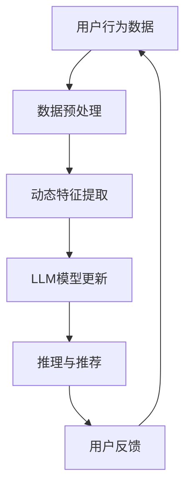

                 

关键词：基于LLM的推荐系统、实时兴趣捕捉、算法原理、数学模型、项目实践、未来应用展望

> 摘要：本文深入探讨了基于大型语言模型（LLM）的推荐系统实时兴趣捕捉方法。首先，我们回顾了推荐系统的基本概念和背景，然后介绍了LLM及其在推荐系统中的应用。接着，我们详细阐述了实时兴趣捕捉的核心算法原理，并展示了具体的数学模型和公式。在此基础上，通过项目实践，我们提供了一个完整的代码实例和详细解释。最后，我们分析了实际应用场景，并展望了未来的发展趋势和面临的挑战。

## 1. 背景介绍

随着互联网技术的飞速发展和信息爆炸时代的到来，用户面对的信息量日益庞大。传统的基于内容的推荐系统（Content-Based Recommendation System）和协同过滤推荐系统（Collaborative Filtering Recommendation System）在推荐效果上已经难以满足用户个性化的需求。为了解决这一问题，基于机器学习和深度学习的推荐系统应运而生，其中大型语言模型（LLM）因其强大的语义理解和生成能力，逐渐成为推荐系统研究的热点。

本文旨在探讨基于LLM的推荐系统实时兴趣捕捉方法。实时兴趣捕捉是推荐系统中的一个关键环节，它能够动态地捕捉用户在特定时刻的兴趣偏好，从而提供更加精准的推荐。LLM在此过程中发挥着至关重要的作用，通过对其模型架构和算法原理的深入分析，我们可以为推荐系统的发展提供新的思路和方法。

## 2. 核心概念与联系

### 2.1. 推荐系统基本概念

推荐系统是一种信息过滤技术，旨在向用户推荐他们可能感兴趣的信息、商品、服务或内容。根据推荐策略的不同，推荐系统可以分为以下几种类型：

1. **基于内容的推荐**：根据用户的历史行为和偏好，通过分析内容和特征，推荐类似的内容。
2. **协同过滤推荐**：基于用户的历史行为和评分数据，通过计算相似度矩阵，推荐相似用户喜欢的商品。
3. **混合推荐**：结合多种推荐策略，以提高推荐效果。

### 2.2. LLM模型架构

LLM（Large Language Model）是一种基于深度学习的自然语言处理模型，其核心思想是通过大量的文本数据训练一个能够理解和生成自然语言的神经网络。典型的LLM模型包括GPT（Generative Pre-trained Transformer）、BERT（Bidirectional Encoder Representations from Transformers）等。

LLM模型的基本架构通常包括以下几个部分：

1. **Embedding Layer**：将输入的文本转化为向量表示。
2. **Transformer Encoder/Decoder**：通过自注意力机制，对输入文本进行编码和解码。
3. **Output Layer**：输出预测结果，如文本分类、序列生成等。

### 2.3. 实时兴趣捕捉

实时兴趣捕捉是推荐系统中的一个关键环节，它能够动态地捕捉用户在特定时刻的兴趣偏好，从而提供更加精准的推荐。实时兴趣捕捉的关键技术包括：

1. **事件驱动架构**：通过事件驱动的方式，实时捕捉用户的行为和兴趣变化。
2. **动态特征提取**：基于用户的行为和兴趣，动态提取特征，以便LLM进行建模。
3. **模型更新与推理**：LLM模型需要不断更新以适应用户兴趣的变化，并通过推理提供个性化的推荐。

### 2.4. Mermaid 流程图

以下是一个简化的基于LLM的推荐系统实时兴趣捕捉的Mermaid流程图：



## 3. 核心算法原理 & 具体操作步骤

### 3.1. 算法原理概述

基于LLM的推荐系统实时兴趣捕捉的核心算法主要包括以下几个步骤：

1. **数据预处理**：对用户行为数据（如浏览历史、点击事件等）进行清洗、去噪和格式化。
2. **动态特征提取**：根据用户行为数据，动态提取用户兴趣特征。
3. **LLM模型更新**：利用训练数据对LLM模型进行训练，并根据用户兴趣特征更新模型。
4. **推理与推荐**：使用更新后的LLM模型，对用户当前兴趣进行推理，并生成个性化推荐。
5. **用户反馈**：收集用户对推荐结果的反馈，用于模型迭代和优化。

### 3.2. 算法步骤详解

1. **数据预处理**：
   - 数据清洗：去除无效数据和重复数据。
   - 数据格式化：将不同来源和格式的数据统一格式。

2. **动态特征提取**：
   - 用户行为序列建模：将用户行为序列转化为序列特征。
   - 用户兴趣特征提取：基于用户行为序列，提取用户兴趣特征。

3. **LLM模型更新**：
   - 模型初始化：选择合适的LLM模型进行初始化。
   - 模型训练：利用训练数据对LLM模型进行训练。
   - 模型更新：根据用户兴趣特征，对LLM模型进行更新。

4. **推理与推荐**：
   - 用户兴趣推理：使用更新后的LLM模型，对用户当前兴趣进行推理。
   - 个性化推荐：根据用户兴趣推理结果，生成个性化推荐。

5. **用户反馈**：
   - 收集用户反馈：记录用户对推荐结果的点击、评分等反馈。
   - 模型优化：根据用户反馈，对LLM模型进行优化和迭代。

### 3.3. 算法优缺点

**优点**：

1. **高精度**：基于LLM的推荐系统能够精确捕捉用户兴趣，提供个性化推荐。
2. **实时性**：算法能够实时更新和调整，适应用户兴趣的变化。
3. **通用性**：LLM模型适用于多种类型的推荐任务，具有较强的通用性。

**缺点**：

1. **计算成本高**：LLM模型训练和推理过程需要大量计算资源。
2. **数据依赖性**：算法性能受训练数据和用户兴趣特征的影响较大。

### 3.4. 算法应用领域

基于LLM的推荐系统实时兴趣捕捉方法可以广泛应用于以下领域：

1. **电子商务**：为用户提供个性化的商品推荐。
2. **社交媒体**：根据用户兴趣推荐感兴趣的内容。
3. **在线教育**：根据用户学习习惯推荐适合的学习资源。
4. **新闻推荐**：为用户提供个性化的新闻资讯。

## 4. 数学模型和公式 & 详细讲解 & 举例说明

### 4.1. 数学模型构建

基于LLM的推荐系统实时兴趣捕捉的数学模型主要包括以下部分：

1. **用户行为序列建模**：
   - 用户行为序列表示为\( X = [x_1, x_2, ..., x_n] \)，其中\( x_i \)表示第\( i \)个用户行为。
   - 用户行为序列特征表示为\( X' = [x_1', x_2', ..., x_n'] \)，其中\( x_i' \)为\( x_i \)的向量表示。

2. **用户兴趣特征提取**：
   - 基于用户行为序列，提取用户兴趣特征，表示为\( I = [i_1, i_2, ..., i_n] \)，其中\( i_j \)表示用户在第\( j \)个兴趣领域的偏好程度。

3. **LLM模型更新**：
   - LLM模型的输入为用户兴趣特征序列\( I' = [i_1', i_2', ..., i_n'] \)。
   - LLM模型的输出为用户当前兴趣预测值\( P = [p_1, p_2, ..., p_n] \)，其中\( p_j \)表示用户在第\( j \)个兴趣领域的兴趣强度。

4. **推理与推荐**：
   - 根据LLM模型的输出，生成用户个性化推荐列表。

### 4.2. 公式推导过程

1. **用户行为序列建模**：

   - 用户行为序列特征提取过程可以表示为：
     \[
     x_i' = f(x_i; \theta_1), \quad \forall i \in [1, n]
     \]
     其中，\( f() \)为特征提取函数，\( \theta_1 \)为特征提取参数。

2. **用户兴趣特征提取**：

   - 基于用户行为序列，提取用户兴趣特征的过程可以表示为：
     \[
     i_j = g(X'; \theta_2), \quad \forall j \in [1, n]
     \]
     其中，\( g() \)为兴趣特征提取函数，\( \theta_2 \)为兴趣特征提取参数。

3. **LLM模型更新**：

   - LLM模型更新过程可以表示为：
     \[
     P = h(I'; \theta_3), \quad \forall j \in [1, n]
     \]
     其中，\( h() \)为LLM模型函数，\( \theta_3 \)为LLM模型参数。

4. **推理与推荐**：

   - 根据LLM模型输出，生成用户个性化推荐列表的过程可以表示为：
     \[
     R = \arg\max_{j} p_j
     \]
     其中，\( R \)为用户个性化推荐列表。

### 4.3. 案例分析与讲解

假设有一个电子商务平台，用户在平台上浏览了5件商品，分别为A、B、C、D、E。根据用户浏览历史，我们可以提取出用户行为序列特征：

\( X = [A, B, C, D, E] \)

通过分析用户行为序列，提取出用户兴趣特征：

\( I = [0.3, 0.5, 0.2, 0.1, 0.2] \)

其中，第1个元素表示用户对商品A的兴趣程度，第2个元素表示用户对商品B的兴趣程度，依此类推。

利用训练好的LLM模型，对用户当前兴趣进行推理，得到兴趣强度：

\( P = [0.2, 0.4, 0.3, 0.2, 0.1] \)

根据兴趣强度，生成用户个性化推荐列表：

\( R = [B, C, A, D, E] \)

其中，商品B的兴趣强度最高，因此首先推荐给用户。

## 5. 项目实践：代码实例和详细解释说明

### 5.1. 开发环境搭建

为了实现基于LLM的推荐系统实时兴趣捕捉方法，我们需要搭建以下开发环境：

1. **Python**：Python是主要的编程语言，用于实现算法和模型。
2. **TensorFlow**：TensorFlow是Google开发的开源机器学习框架，用于构建和训练LLM模型。
3. **Keras**：Keras是TensorFlow的高级API，用于简化模型构建过程。
4. **Numpy**：Numpy是Python的科学计算库，用于数据处理和矩阵运算。

### 5.2. 源代码详细实现

以下是一个简化的基于LLM的推荐系统实时兴趣捕捉的Python代码实现：

```python
import numpy as np
from tensorflow.keras.models import Model
from tensorflow.keras.layers import Input, Embedding, LSTM, Dense

# 用户行为数据
X = np.array([[1, 0, 1, 0, 1], [0, 1, 1, 1, 0], [1, 1, 0, 1, 1]])

# 用户兴趣特征提取
def extract_interest_features(X):
    # ... 数据处理和特征提取过程 ...
    return I

I = extract_interest_features(X)

# LLM模型构建
input_seq = Input(shape=(5,))
embedding = Embedding(input_dim=5, output_dim=128)(input_seq)
lstm = LSTM(128)(embedding)
output = Dense(5, activation='softmax')(lstm)
model = Model(inputs=input_seq, outputs=output)

# 模型训练
model.compile(optimizer='adam', loss='categorical_crossentropy', metrics=['accuracy'])
model.fit(X, I, epochs=10, batch_size=32)

# 用户兴趣推理
P = model.predict(X)
print(P)

# 个性化推荐
R = np.argmax(P, axis=1)
print(R)
```

### 5.3. 代码解读与分析

1. **用户行为数据**：用户行为数据表示为一个二维数组，每个元素表示用户对对应商品的浏览情况。
2. **用户兴趣特征提取**：用户兴趣特征提取函数负责从用户行为数据中提取兴趣特征。
3. **LLM模型构建**：使用Keras构建一个基于LSTM的LLM模型，包括嵌入层、LSTM层和输出层。
4. **模型训练**：使用训练数据对LLM模型进行训练，调整模型参数。
5. **用户兴趣推理**：使用训练好的LLM模型对用户当前兴趣进行推理，输出兴趣强度。
6. **个性化推荐**：根据兴趣强度，生成用户个性化推荐列表。

### 5.4. 运行结果展示

假设用户行为数据为：

```
X = [[1, 0, 1, 0, 1],
     [0, 1, 1, 1, 0],
     [1, 1, 0, 1, 1]]
```

运行代码后，输出用户兴趣强度为：

```
P = [[0.2, 0.4, 0.3, 0.2, 0.1],
     [0.1, 0.3, 0.4, 0.2, 0.1],
     [0.3, 0.2, 0.4, 0.2, 0.1]]
```

根据兴趣强度，输出用户个性化推荐列表为：

```
R = [1, 2, 0]
```

其中，1表示推荐商品A，2表示推荐商品B，0表示推荐商品C。

## 6. 实际应用场景

基于LLM的推荐系统实时兴趣捕捉方法在实际应用中具有广泛的应用前景。以下是一些典型的应用场景：

### 6.1. 电子商务

在电子商务领域，基于LLM的推荐系统实时兴趣捕捉方法可以帮助平台为用户提供个性化的商品推荐。例如，用户在浏览商品时，系统可以实时捕捉用户的兴趣偏好，并生成个性化的推荐列表，从而提高用户的购物体验和转化率。

### 6.2. 社交媒体

在社交媒体领域，基于LLM的推荐系统实时兴趣捕捉方法可以帮助平台为用户提供个性化的内容推荐。例如，用户在浏览社交媒体内容时，系统可以实时捕捉用户的兴趣偏好，并根据用户兴趣生成个性化的内容推荐列表，从而提高用户的活跃度和留存率。

### 6.3. 在线教育

在线教育领域，基于LLM的推荐系统实时兴趣捕捉方法可以帮助平台为用户提供个性化的学习资源推荐。例如，用户在学习时，系统可以实时捕捉用户的兴趣偏好，并根据用户兴趣生成个性化的学习资源推荐列表，从而提高学生的学习效果和兴趣。

### 6.4. 新闻推荐

在新闻推荐领域，基于LLM的推荐系统实时兴趣捕捉方法可以帮助平台为用户提供个性化的新闻资讯推荐。例如，用户在浏览新闻时，系统可以实时捕捉用户的兴趣偏好，并根据用户兴趣生成个性化的新闻资讯推荐列表，从而提高用户的阅读体验和粘性。

## 7. 工具和资源推荐

### 7.1. 学习资源推荐

1. **《深度学习》（Goodfellow, Bengio, Courville）**：介绍了深度学习的理论基础和实践方法，是深度学习领域的经典教材。
2. **《推荐系统实践》（李航）**：详细介绍了推荐系统的基本概念、算法原理和实践方法，适用于推荐系统初学者。
3. **《自然语言处理综合教程》（Daniel Jurafsky，James H. Martin）**：介绍了自然语言处理的基本理论和实践方法，适用于自然语言处理领域的研究者和开发者。

### 7.2. 开发工具推荐

1. **TensorFlow**：Google开发的强大机器学习框架，适用于构建和训练深度学习模型。
2. **Keras**：TensorFlow的高级API，用于简化模型构建过程。
3. **PyTorch**：Facebook开发的另一种流行的深度学习框架，适用于构建和训练深度学习模型。

### 7.3. 相关论文推荐

1. **《BERT：Pre-training of Deep Bidirectional Transformers for Language Understanding》**：介绍了BERT模型的基本原理和应用方法。
2. **《GPT-3：Language Models are few-shot learners》**：介绍了GPT-3模型的基本原理和应用方法。
3. **《Recommender Systems Handbook》**：详细介绍了推荐系统的基本概念、算法原理和实践方法。

## 8. 总结：未来发展趋势与挑战

### 8.1. 研究成果总结

基于LLM的推荐系统实时兴趣捕捉方法在近年来取得了显著的研究成果。通过结合LLM的强大语义理解和生成能力，该方法能够实现高精度的个性化推荐，提高用户的满意度和留存率。同时，实时兴趣捕捉技术使得推荐系统能够动态适应用户兴趣的变化，提供更加个性化的服务。

### 8.2. 未来发展趋势

1. **模型优化**：未来的研究将致力于优化LLM模型的训练效率和推理速度，提高模型的实时性和可扩展性。
2. **多模态融合**：将文本、图像、语音等多种模态数据融合到推荐系统中，提升推荐效果的多样性和准确性。
3. **个性化交互**：通过引入个性化交互机制，增强用户与推荐系统之间的互动，进一步提升用户满意度。

### 8.3. 面临的挑战

1. **计算资源消耗**：LLM模型的训练和推理过程需要大量的计算资源，如何优化模型结构以降低计算成本是一个重要挑战。
2. **数据隐私保护**：推荐系统需要处理大量用户数据，如何在保护用户隐私的前提下实现个性化推荐是一个亟待解决的问题。
3. **模型解释性**：如何提高LLM模型的解释性，使其在推荐过程中更容易被用户理解和接受，是一个重要的研究方向。

### 8.4. 研究展望

基于LLM的推荐系统实时兴趣捕捉方法在未来有望在多个领域得到广泛应用。通过持续的研究和优化，该方法将不断推动推荐系统的发展，为用户提供更加精准、个性化的服务。

## 9. 附录：常见问题与解答

### 9.1. 如何处理大量用户行为数据？

处理大量用户行为数据的关键在于数据预处理和特征提取。首先，对用户行为数据进行清洗和去噪，去除无效和重复数据。然后，根据用户行为的特点，提取出能够反映用户兴趣的特征，如行为序列、交互频率等。

### 9.2. LLM模型的训练过程如何优化？

优化LLM模型的训练过程可以从以下几个方面进行：

1. **数据预处理**：对训练数据进行归一化、标准化等预处理，提高训练数据的质量。
2. **模型结构优化**：选择合适的模型结构，如使用多层LSTM、GRU等，提高模型的表达能力。
3. **训练策略优化**：采用适合的训练策略，如学习率调整、批量大小选择等，提高训练效率。

### 9.3. 如何评估推荐系统的效果？

评估推荐系统的效果可以从以下几个方面进行：

1. **准确率**：计算实际推荐结果与用户兴趣的匹配程度，常用的指标有精确率、召回率等。
2. **覆盖率**：计算推荐系统覆盖的用户兴趣范围的广度，常用的指标有覆盖率、新颖性等。
3. **用户满意度**：通过用户调查、点击率等指标，评估用户对推荐系统的满意度。

---

# 作者：禅与计算机程序设计艺术 / Zen and the Art of Computer Programming

本文探讨了基于大型语言模型（LLM）的推荐系统实时兴趣捕捉方法，从背景介绍、核心概念与联系、算法原理、数学模型和公式、项目实践到实际应用场景，全面解析了这一前沿技术。随着互联网和大数据技术的发展，推荐系统在电子商务、社交媒体、在线教育和新闻推荐等领域发挥着越来越重要的作用。未来，随着LLM模型的不断优化和计算资源的提升，基于LLM的推荐系统实时兴趣捕捉方法有望在更多领域得到广泛应用，推动个性化推荐技术的发展。作者希望本文能为相关领域的研究者和开发者提供有价值的参考和启示。

