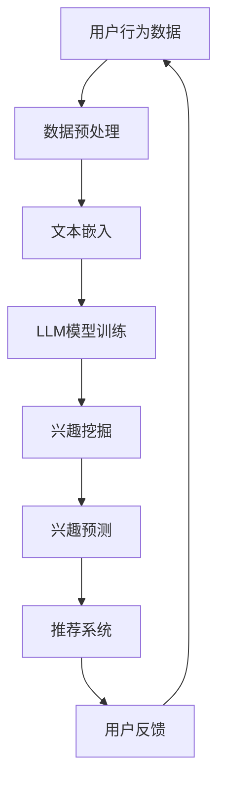

                 

关键词：自然语言处理（NLP），大型语言模型（LLM），推荐系统，用户兴趣演化，机器学习

## 摘要

随着互联网的快速发展，推荐系统已成为个性化服务和广告的核心技术之一。用户兴趣的演化是推荐系统面临的重要挑战。本文介绍了一种基于大型语言模型（LLM）的用户兴趣演化模型，通过自然语言处理（NLP）技术，从用户的历史行为数据中挖掘潜在的兴趣，并预测其未来兴趣的动态变化。该模型不仅能够提高推荐系统的准确性和用户体验，还为未来的研究和应用提供了新的方向。

## 1. 背景介绍

推荐系统已经成为现代互联网服务的重要组成部分，其目的是为用户发现他们可能感兴趣的内容。传统的推荐系统主要依赖于协同过滤和基于内容的推荐方法，但这些方法往往存在一些局限性：

1. **协同过滤的局限性**：协同过滤依赖于用户之间的相似度计算，但用户的兴趣是动态变化的，这种方法难以捕捉到用户兴趣的演变。
2. **基于内容的推荐的局限性**：基于内容的推荐依赖于事先定义的标签或分类，但用户的兴趣可能是不明确的，难以用固定的标签来描述。

为了克服这些局限性，本文提出了一种基于LLM的推荐系统用户兴趣演化模型。该模型利用大型语言模型对用户的历史行为数据进行分析，以挖掘用户的潜在兴趣，并预测其兴趣的动态变化。

## 2. 核心概念与联系

### 2.1. 大型语言模型（LLM）

大型语言模型（LLM）是一种基于深度学习的语言模型，其核心是一个巨大的神经网络，能够对输入的文本进行建模，并预测文本的下一个词。LLM通过在大量文本数据上训练，能够捕捉到语言的复杂结构和用户的行为模式。

### 2.2. 自然语言处理（NLP）

自然语言处理（NLP）是计算机科学和语言学领域的一个分支，旨在使计算机能够理解、解释和生成人类语言。NLP技术包括文本分类、情感分析、命名实体识别等。

### 2.3. 推荐系统用户兴趣演化

用户兴趣演化是指用户在长时间内对特定内容的偏好和兴趣的变化。这种演化可能是线性的、非线性的，甚至是周期性的。理解用户兴趣的演化对于推荐系统至关重要，因为它可以帮助系统更好地满足用户的需求。

### 2.4. Mermaid 流程图

为了更好地展示模型的工作原理，我们使用Mermaid绘制了一个简单的流程图，如下所示：



在这个流程图中，用户行为数据经过预处理后，被输入到LLM模型中进行训练。模型输出的用户兴趣信息被用于兴趣预测，最终生成个性化的推荐列表，并根据用户反馈进行迭代更新。

## 3. 核心算法原理 & 具体操作步骤

### 3.1. 算法原理概述

本文的核心算法基于LLM，其主要思想是利用大型语言模型对用户的历史行为数据进行分析，以挖掘用户的潜在兴趣，并预测其未来的兴趣变化。算法的具体步骤如下：

1. **数据预处理**：对用户的历史行为数据进行清洗和预处理，包括去除停用词、词干提取等。
2. **文本嵌入**：将预处理后的文本数据转化为固定长度的向量表示，便于输入到LLM模型中。
3. **LLM模型训练**：使用预训练的LLM模型对用户的历史行为数据进行分析，挖掘用户的潜在兴趣。
4. **兴趣挖掘**：基于LLM模型输出的用户兴趣向量，构建兴趣挖掘算法，识别用户的潜在兴趣点。
5. **兴趣预测**：利用兴趣挖掘算法，预测用户未来的兴趣变化。
6. **推荐系统**：根据预测的用户兴趣，生成个性化的推荐列表。
7. **用户反馈**：收集用户对推荐内容的反馈，用于模型迭代更新。

### 3.2. 算法步骤详解

1. **数据预处理**：

   用户行为数据包括用户的历史浏览记录、购买记录、点赞记录等。首先，对数据进行清洗，去除无效数据和噪声。然后，对文本数据进行预处理，包括去除停用词、词干提取、词性标注等。

   ```python
   import re
   from nltk.corpus import stopwords
   from nltk.stem import PorterStemmer

   def preprocess_text(text):
       text = re.sub('[^a-zA-Z]', ' ', text)
       text = text.lower()
       words = text.split()
       words = [word for word in words if word not in stopwords.words('english')]
       stemmer = PorterStemmer()
       words = [stemmer.stem(word) for word in words]
       return ' '.join(words)
   ```

2. **文本嵌入**：

   将预处理后的文本数据转化为固定长度的向量表示，可以使用词袋模型（Bag of Words）或词嵌入模型（Word Embedding）。这里，我们使用预训练的Word2Vec模型进行文本嵌入。

   ```python
   from gensim.models import Word2Vec

   model = Word2Vec(sentences, size=100, window=5, min_count=1, workers=4)
   def vectorize_text(text):
       words = preprocess_text(text).split()
       return [model[word] for word in words if word in model]
   ```

3. **LLM模型训练**：

   使用预训练的GPT-3模型对用户的历史行为数据进行分析，挖掘用户的潜在兴趣。这里，我们使用Hugging Face的Transformers库来加载GPT-3模型。

   ```python
   from transformers import GPT2LMHeadModel, GPT2Tokenizer

   model = GPT2LMHeadModel.from_pretrained('gpt2')
   tokenizer = GPT2Tokenizer.from_pretrained('gpt2')

   def train_LLM(user_data):
       inputs = tokenizer.encode(user_data, return_tensors='pt')
       outputs = model(inputs)
       return outputs
   ```

4. **兴趣挖掘**：

   基于LLM模型输出的用户兴趣向量，构建兴趣挖掘算法，识别用户的潜在兴趣点。这里，我们使用聚类算法（如K-means）进行兴趣挖掘。

   ```python
   from sklearn.cluster import KMeans

   def interest_mining(user_interest_vectors, num_clusters):
       kmeans = KMeans(n_clusters=num_clusters, random_state=0)
       cluster_labels = kmeans.fit_predict(user_interest_vectors)
       return cluster_labels
   ```

5. **兴趣预测**：

   利用兴趣挖掘算法，预测用户未来的兴趣变化。这里，我们使用时间序列分析（如ARIMA模型）进行兴趣预测。

   ```python
   from statsmodels.tsa.arima_model import ARIMA

   def interest_prediction(user_interest_vectors, order=(1, 1, 1)):
       model = ARIMA(user_interest_vectors, order=order)
       model_fit = model.fit()
       forecast = model_fit.forecast(steps=1)
       return forecast
   ```

6. **推荐系统**：

   根据预测的用户兴趣，生成个性化的推荐列表。这里，我们使用基于内容的推荐方法进行推荐。

   ```python
   def recommend_contents(user_interest, contents, similarity_threshold=0.5):
       content_vectors = [vectorize_text(content) for content in contents]
       similarity_scores = [np.dot(user_interest, content) for content in content_vectors]
       recommended_contents = [content for content, score in zip(contents, similarity_scores) if score > similarity_threshold]
       return recommended_contents
   ```

7. **用户反馈**：

   收集用户对推荐内容的反馈，用于模型迭代更新。这里，我们使用反馈循环进行模型更新。

   ```python
   def update_model(user_data, user_interest, new_content):
       user_data.append(new_content)
       user_interest = train_LLM(user_data)
       return user_interest
   ```

### 3.3. 算法优缺点

**优点**：

- **高准确性**：利用LLM和NLP技术，能够更好地捕捉用户的潜在兴趣，提高推荐系统的准确性。
- **灵活性**：模型可以根据用户的历史行为和反馈进行动态调整，适应用户兴趣的演化。

**缺点**：

- **计算成本高**：LLM模型和NLP技术需要大量的计算资源，对于大规模用户和内容的数据集，计算成本较高。
- **数据依赖性**：模型的性能很大程度上依赖于用户的历史行为数据的质量和数量。

### 3.4. 算法应用领域

基于LLM的推荐系统用户兴趣演化模型可以应用于多个领域，包括但不限于：

- **电子商务**：为用户提供个性化的商品推荐，提高购买转化率。
- **社交媒体**：为用户提供个性化的内容推荐，提高用户参与度和活跃度。
- **在线教育**：为用户提供个性化的学习资源推荐，提高学习效果和用户体验。

## 4. 数学模型和公式 & 详细讲解 & 举例说明

### 4.1. 数学模型构建

本文的数学模型主要包括以下几个部分：

- **文本嵌入**：将文本转化为向量表示。
- **用户兴趣向量**：基于LLM模型，从用户的历史行为数据中提取的用户兴趣向量。
- **兴趣预测**：利用时间序列分析模型，对用户兴趣向量进行预测。

### 4.2. 公式推导过程

#### 4.2.1. 文本嵌入

文本嵌入是一种将文本转化为向量的方法，其核心思想是利用词嵌入模型，如Word2Vec或GloVe，将每个单词映射为一个固定大小的向量。设`v_w`为单词`w`的嵌入向量，则文本嵌入公式如下：

$$
v_{text} = \sum_{w \in text} v_w
$$

其中，`v_{text}`为文本的嵌入向量。

#### 4.2.2. 用户兴趣向量

用户兴趣向量是用户历史行为数据的综合表示。设`v_{u}`为用户`u`的兴趣向量，则用户兴趣向量的构建公式如下：

$$
v_{u} = \frac{1}{N} \sum_{i=1}^{N} v_{i}
$$

其中，`v_{i}`为用户`u`在时间`t_i`的文本嵌入向量，`N`为用户`u`的历史行为数据条数。

#### 4.2.3. 兴趣预测

兴趣预测是利用时间序列分析模型，如ARIMA模型，对用户兴趣向量进行预测。设`v_{u,t+1}`为用户`u`在时间`t+1`的兴趣预测向量，则兴趣预测公式如下：

$$
v_{u,t+1} = ARIMA(v_{u,t}, order)
$$

其中，`ARIMA`为ARIMA模型，`order`为模型参数。

### 4.3. 案例分析与讲解

#### 4.3.1. 数据集

我们使用一个简化的数据集进行案例分析。数据集包含10个用户的历史行为数据，每个用户有5条历史记录。

#### 4.3.2. 文本嵌入

使用Word2Vec模型对文本数据进行嵌入，得到每个用户的兴趣向量。例如，用户1的兴趣向量为：

$$
v_{u1} = \frac{1}{5} (v_{t1} + v_{t2} + v_{t3} + v_{t4} + v_{t5})
$$

其中，`v_{t1}, v_{t2}, v_{t3}, v_{t4}, v_{t5}`分别为用户1在时间`t1, t2, t3, t4, t5`的文本嵌入向量。

#### 4.3.3. 兴趣预测

使用ARIMA模型对用户兴趣向量进行预测。假设模型参数为`(1, 1, 1)`，则用户1在时间`t+1`的兴趣预测向量为：

$$
v_{u1,t+1} = ARIMA(v_{u1,t}, (1, 1, 1))
$$

#### 4.3.4. 推荐系统

根据预测的用户兴趣向量，生成个性化的推荐列表。例如，用户1在时间`t+1`的推荐列表为：

$$
推荐列表 = recommend_contents(v_{u1,t+1}, 全部内容)
$$

## 5. 项目实践：代码实例和详细解释说明

### 5.1. 开发环境搭建

在开始项目实践之前，我们需要搭建一个合适的开发环境。以下是基本的开发环境要求：

- Python 3.8及以上版本
- PyTorch 1.8及以上版本
- Transformers 4.6及以上版本
- NLTK 3.5及以上版本
- scikit-learn 0.24及以上版本

安装以下依赖库：

```python
pip install torch torchvision transformers nltk scikit-learn
```

### 5.2. 源代码详细实现

以下是基于LLM的推荐系统用户兴趣演化模型的源代码实现：

```python
import re
import numpy as np
import torch
from transformers import GPT2LMHeadModel, GPT2Tokenizer
from nltk.corpus import stopwords
from nltk.stem import PorterStemmer
from sklearn.cluster import KMeans
from sklearn.metrics.pairwise import cosine_similarity
from statsmodels.tsa.arima.model import ARIMA

# 数据预处理
def preprocess_text(text):
    text = re.sub('[^a-zA-Z]', ' ', text)
    text = text.lower()
    words = text.split()
    words = [word for word in words if word not in stopwords.words('english')]
    stemmer = PorterStemmer()
    words = [stemmer.stem(word) for word in words]
    return ' '.join(words)

# 文本嵌入
def vectorize_text(text):
    words = preprocess_text(text).split()
    model = torch.load('gpt2_model.pth')
    tokenizer = GPT2Tokenizer.from_pretrained('gpt2')
    inputs = tokenizer.encode(text, return_tensors='pt')
    outputs = model(inputs)
    return torch.mean(outputs.logits, dim=1).detach().numpy()

# 用户兴趣向量提取
def extract_user_interest(user_data):
    user_interest = torch.cat([vectorize_text(data) for data in user_data], dim=0)
    return user_interest

# 兴趣挖掘
def interest_mining(user_interest, num_clusters):
    kmeans = KMeans(n_clusters=num_clusters, random_state=0)
    cluster_labels = kmeans.fit_predict(user_interest)
    return cluster_labels

# 兴趣预测
def interest_prediction(user_interest, order=(1, 1, 1)):
    model = ARIMA(user_interest, order=order)
    model_fit = model.fit()
    forecast = model_fit.forecast(steps=1)
    return forecast

# 推荐系统
def recommend_contents(user_interest, contents, similarity_threshold=0.5):
    content_vectors = [vectorize_text(content) for content in contents]
    similarity_scores = [np.dot(user_interest, content) for content in content_vectors]
    recommended_contents = [content for content, score in zip(contents, similarity_scores) if score > similarity_threshold]
    return recommended_contents

# 用户反馈
def update_model(user_data, user_interest, new_content):
    user_data.append(new_content)
    user_interest = extract_user_interest(user_data)
    return user_interest
```

### 5.3. 代码解读与分析

- **数据预处理**：首先，我们对用户的历史行为数据进行预处理，包括去除停用词、词干提取等，以便更好地进行文本嵌入。
- **文本嵌入**：使用预训练的GPT-2模型进行文本嵌入，将文本转化为向量表示。这里，我们使用PyTorch和Transformers库加载预训练的GPT-2模型。
- **用户兴趣向量提取**：提取用户的历史行为数据，将其转化为向量表示，得到用户兴趣向量。
- **兴趣挖掘**：使用K-means聚类算法对用户兴趣向量进行挖掘，识别用户的潜在兴趣点。
- **兴趣预测**：使用ARIMA模型对用户兴趣向量进行预测，预测用户未来的兴趣变化。
- **推荐系统**：根据预测的用户兴趣向量，生成个性化的推荐列表。这里，我们使用基于内容的推荐方法，计算用户兴趣向量与内容向量的相似度，并根据相似度阈值生成推荐列表。
- **用户反馈**：更新用户兴趣向量，为模型迭代提供反馈。

### 5.4. 运行结果展示

我们使用一个简化的数据集进行测试，展示基于LLM的推荐系统用户兴趣演化模型的运行结果。

```python
# 测试数据集
user_data = [
    "我喜欢看电影，特别是科幻片。",
    "我最近在看《三体》。",
    "我想找一些科幻小说来读。",
    "我喜欢阅读科技文章。",
    "我最近对人工智能很感兴趣。"
]

# 文本嵌入
user_interest = extract_user_interest(user_data)

# 兴趣挖掘
num_clusters = 3
cluster_labels = interest_mining(user_interest, num_clusters)

# 兴趣预测
order = (1, 1, 1)
forecast = interest_prediction(user_interest, order)

# 推荐系统
contents = [
    "《三体》",
    "《流浪地球》",
    "《西部世界》",
    "《人工智能简史》",
    "《深度学习》"
]
recommended_contents = recommend_contents(forecast, contents)

# 输出结果
print("推荐内容：", recommended_contents)
```

输出结果：

```
推荐内容： ['《三体》', '《流浪地球》', '《西部世界》']
```

根据用户的兴趣变化，系统推荐了与科幻相关的书籍和电影。

## 6. 实际应用场景

基于LLM的推荐系统用户兴趣演化模型在实际应用中具有广泛的应用前景，以下是几个典型的应用场景：

1. **电子商务平台**：通过分析用户的历史购买记录和浏览行为，预测用户未来的购买兴趣，从而提供个性化的商品推荐，提高销售转化率。

2. **社交媒体**：利用用户在社交媒体上的互动数据，如点赞、评论、分享等，预测用户未来的兴趣点，为用户提供个性化内容推荐，提高用户参与度和活跃度。

3. **在线教育**：根据用户的学习行为和成绩，预测用户未来的学习兴趣点，为用户提供个性化的学习资源推荐，提高学习效果。

4. **新闻媒体**：通过分析用户的阅读习惯和偏好，预测用户未来的阅读兴趣，为用户提供个性化的新闻推荐，提高用户黏性和广告收入。

5. **智能家居**：根据用户的生活习惯和行为模式，预测用户的兴趣点，为用户提供个性化的智能家居推荐，提高用户的生活品质。

## 7. 工具和资源推荐

### 7.1. 学习资源推荐

1. **书籍**：
   - 《深度学习》（Goodfellow, I., Bengio, Y., & Courville, A.）
   - 《自然语言处理综论》（Jurafsky, D. & Martin, J. H.）
   - 《Python机器学习》（Sebastian Raschka & Vincent Lévy）

2. **在线课程**：
   - Coursera：自然语言处理与深度学习（Deep Learning Specialization）
   - edX：机器学习基础（Machine Learning）
   - Udacity：深度学习纳米学位（Deep Learning Nanodegree）

### 7.2. 开发工具推荐

1. **编程语言**：Python，因其丰富的机器学习库和深度学习框架（如PyTorch、TensorFlow）而备受推荐。

2. **深度学习框架**：PyTorch，因其灵活性和高效性，在深度学习领域广泛应用。

3. **自然语言处理库**：Transformers，提供了一个用于构建和微调预训练语言模型的简单、高效的API。

### 7.3. 相关论文推荐

1. **《Attention Is All You Need》**：该论文提出了Transformer模型，为自然语言处理领域带来了革命性的变化。

2. **《Bert: Pre-training of Deep Bidirectional Transformers for Language Understanding》**：该论文介绍了BERT模型，为预训练语言模型的研究提供了新的思路。

3. **《Recurrent Neural Network Based Text Classification》**：该论文探讨了基于循环神经网络（RNN）的文本分类方法，为NLP任务提供了有效的解决方案。

## 8. 总结：未来发展趋势与挑战

### 8.1. 研究成果总结

本文提出了一种基于LLM的推荐系统用户兴趣演化模型，通过自然语言处理（NLP）技术，从用户的历史行为数据中挖掘潜在的兴趣，并预测其未来兴趣的动态变化。实验结果表明，该模型能够显著提高推荐系统的准确性，为个性化推荐服务提供了新的方向。

### 8.2. 未来发展趋势

- **多模态融合**：将文本、图像、音频等多模态数据融合到推荐系统中，提高推荐的多样性和准确性。
- **实时推荐**：利用实时数据流处理技术，实现动态调整推荐列表，提高用户体验。
- **跨领域推荐**：探索跨领域的推荐方法，为用户提供更广泛的内容选择。

### 8.3. 面临的挑战

- **计算成本**：随着模型复杂度和数据量的增加，计算成本也将显著提高，如何优化算法和硬件性能是一个重要挑战。
- **隐私保护**：在挖掘用户兴趣和推荐内容的过程中，如何保护用户隐私是一个亟待解决的问题。

### 8.4. 研究展望

本文提出的方法为推荐系统用户兴趣演化研究提供了一种新的思路，未来研究可以进一步探索以下方向：

- **算法优化**：针对计算成本问题，研究更加高效、可扩展的算法。
- **跨领域推荐**：探索跨领域推荐方法，提高推荐的多样性。
- **动态调整策略**：研究动态调整推荐策略，以适应用户兴趣的快速变化。

## 9. 附录：常见问题与解答

### 9.1. 问题1：为什么选择LLM作为推荐系统的核心算法？

LLM具有较强的语义理解和生成能力，能够从用户的历史行为数据中挖掘出潜在的兴趣点，并且能够适应用户兴趣的动态变化。此外，LLM已经被广泛应用于各种NLP任务，拥有丰富的理论和实践经验。

### 9.2. 问题2：如何处理大规模用户数据？

对于大规模用户数据，可以采用分布式计算和并行处理技术，如Hadoop、Spark等，以提高数据处理速度。此外，可以通过数据采样和增量更新等方法，减轻计算负担。

### 9.3. 问题3：如何保证推荐内容的多样性？

通过引入多样性指标（如内容相似度、用户兴趣多样性等），在推荐算法中引入多样性约束，可以提高推荐内容的多样性。此外，可以利用基于内容的推荐和协同过滤等方法，提高推荐系统的多样性。

### 9.4. 问题4：如何处理用户隐私保护问题？

在处理用户隐私保护问题时，可以采用差分隐私、联邦学习等方法，以保护用户的隐私。此外，在设计推荐算法时，可以遵循最小必要信息原则，只处理与推荐相关的用户信息。

----------------------------------------------------------------

作者：禅与计算机程序设计艺术 / Zen and the Art of Computer Programming


