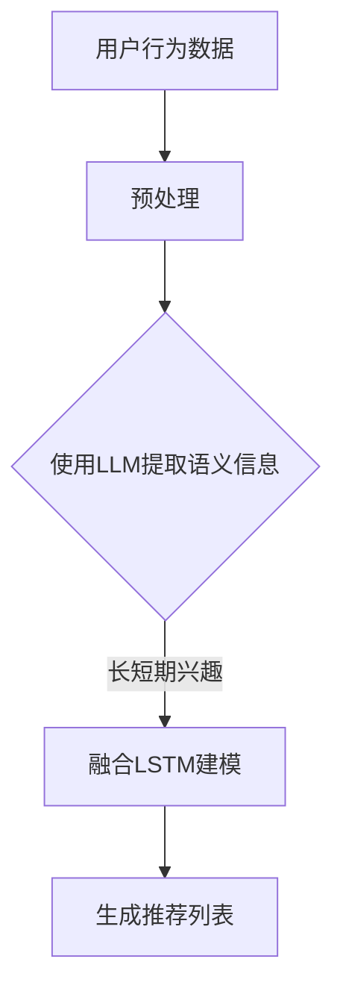

                 

 关键词：推荐系统，用户兴趣建模，长短期记忆，LLM，深度学习

> 摘要：本文深入探讨了基于长短期记忆（Long Short-Term Memory, LSTM）和大型语言模型（Large Language Model, LLM）的推荐系统用户兴趣长短期建模技术。通过对LSTM模型和LLM模型的原理介绍，我们提出了一个结合两者的用户兴趣建模方法，并对模型构建、公式推导以及实际应用进行了详细分析。

## 1. 背景介绍

推荐系统是现代信息检索和互联网服务中的重要组成部分，其核心目标是通过分析用户的历史行为和偏好，向用户推荐符合其兴趣的物品。然而，用户的兴趣是动态变化的，既包括长期稳定的兴趣，也包括短期波动较大的兴趣。因此，如何准确捕捉并建模用户的长短期兴趣，成为推荐系统研究中的一个关键问题。

传统的推荐系统大多采用基于内容的过滤（Content-Based Filtering, CBF）和协同过滤（Collaborative Filtering, CF）等方法。CBF方法通过分析物品的属性与用户的历史行为，计算推荐得分。然而，CBF方法往往无法很好地处理用户兴趣的动态性。协同过滤方法通过分析用户之间的相似性来推荐物品，但在数据稀疏的情况下效果不佳。

近年来，随着深度学习技术的发展，基于深度学习的推荐系统逐渐成为一种新兴趋势。其中，长短期记忆（LSTM）模型由于其强大的时序数据处理能力，被广泛应用于用户兴趣建模。同时，大型语言模型（LLM）的发展为推荐系统提供了更强大的语义理解能力。本文将结合LSTM和LLM的优势，提出一种基于LLM的推荐系统用户兴趣长短期建模方法。

## 2. 核心概念与联系

### 2.1. 长短期记忆（LSTM）

LSTM是一种特殊的循环神经网络（RNN），能够有效地解决传统RNN在处理长序列数据时容易出现的梯度消失和梯度爆炸问题。LSTM通过引入输入门、遗忘门和输出门三个门控机制，使得模型能够灵活地控制信息的传递和遗忘，从而在处理长序列数据时表现出更好的性能。

### 2.2. 大型语言模型（LLM）

大型语言模型是一种基于深度学习技术的自然语言处理模型，其通过大规模数据训练，能够实现对文本的语义理解和生成。LLM在推荐系统中可以用于提取用户的兴趣关键词和语义信息，从而提升推荐系统的准确性。

### 2.3. LSTM和LLM的联系

LSTM和LLM都具有处理序列数据的能力，但在应用场景上有所不同。LSTM更适合处理时间序列数据，如用户的行为日志；而LLM更适合处理文本数据，如用户的评论和标签。本文提出的用户兴趣长短期建模方法，将结合LSTM和LLM的优势，构建一个综合的模型，以同时捕捉用户的长短期兴趣。

### 2.4. Mermaid流程图

下面是一个简单的Mermaid流程图，展示了LSTM和LLM在用户兴趣建模中的结合应用：



## 3. 核心算法原理 & 具体操作步骤

### 3.1. 算法原理概述

基于LLM的推荐系统用户兴趣长短期建模方法，主要包括以下几个步骤：

1. 用户行为数据预处理：对用户的历史行为数据进行清洗和特征提取。
2. 使用LLM提取语义信息：利用LLM模型提取用户行为的语义特征。
3. 融合LSTM建模：将LSTM模型应用于处理提取的语义特征，构建用户兴趣模型。
4. 生成推荐列表：根据用户兴趣模型，生成推荐列表。

### 3.2. 算法步骤详解

#### 3.2.1. 用户行为数据预处理

用户行为数据预处理主要包括数据清洗、缺失值处理和特征提取。具体步骤如下：

1. 数据清洗：去除重复数据、噪声数据和异常数据。
2. 缺失值处理：对于缺失的数据，可以选择填充、删除或插值等方法进行处理。
3. 特征提取：将用户的行为数据转换为特征向量，可以使用词袋模型、TF-IDF等方法。

#### 3.2.2. 使用LLM提取语义信息

使用LLM模型提取用户行为的语义特征，主要步骤如下：

1. 数据预处理：对用户行为数据进行分词、去停用词等预处理操作。
2. 词向量表示：使用预训练的LLM模型，将文本数据转换为词向量。
3. 语义特征提取：利用LLM模型对词向量进行编码，提取出语义特征。

#### 3.2.3. 融合LSTM建模

融合LSTM建模的步骤如下：

1. 数据准备：将提取的语义特征作为输入，构建LSTM模型。
2. 模型训练：使用训练数据对LSTM模型进行训练。
3. 模型评估：使用验证数据对模型进行评估，调整模型参数。

#### 3.2.4. 生成推荐列表

生成推荐列表的步骤如下：

1. 用户兴趣建模：根据LSTM模型对用户兴趣进行建模。
2. 物品特征提取：对候选物品进行特征提取。
3. 计算推荐得分：使用用户兴趣模型和物品特征，计算每个物品的推荐得分。
4. 排序生成推荐列表：根据推荐得分，对物品进行排序，生成推荐列表。

### 3.3. 算法优缺点

#### 优点：

1. 结合了LSTM和LLM的优势，能够同时捕捉用户的长短期兴趣。
2. 利用LLM的语义理解能力，提高推荐系统的准确性。
3. 对用户行为数据进行深度挖掘，提供个性化的推荐服务。

#### 缺点：

1. 模型复杂度高，训练和推理速度较慢。
2. 对计算资源要求较高，需要大量GPU等硬件支持。
3. 数据预处理和特征提取过程复杂，需要大量时间和计算资源。

### 3.4. 算法应用领域

基于LLM的推荐系统用户兴趣长短期建模方法，可以广泛应用于各种推荐场景，如电子商务、新闻推荐、音乐推荐等。特别是在用户行为数据丰富、对个性化推荐要求较高的场景，该方法具有显著的优势。

## 4. 数学模型和公式 & 详细讲解 & 举例说明

### 4.1. 数学模型构建

基于LLM的推荐系统用户兴趣长短期建模方法，可以表示为以下数学模型：

$$
\text{Interest}_{u,t} = f(\text{Behavior}_{u,t}, \text{Semantic}_{u,t})
$$

其中，$Interest_{u,t}$表示用户$u$在时间$t$的兴趣；$Behavior_{u,t}$表示用户$u$在时间$t$的行为数据；$Semantic_{u,t}$表示使用LLM提取的用户行为语义特征。

### 4.2. 公式推导过程

为了推导上述数学模型，我们首先需要对用户行为数据$Behavior_{u,t}$进行预处理和特征提取。假设用户行为数据$Behavior_{u,t}$是一个$d$维的向量，表示为$Behavior_{u,t} = [b_{1,t}, b_{2,t}, ..., b_{d,t}]$。

然后，我们使用LLM模型提取用户行为语义特征$Semantic_{u,t}$。假设LLM模型对每个行为特征$b_{i,t}$都能提取出一个$h$维的语义特征向量$Semantic_{i,t}$，表示为$Semantic_{i,t} = [s_{i,1,t}, s_{i,2,t}, ..., s_{i,h,t}]$。

接下来，我们将所有语义特征向量拼接成一个$h \times d$的矩阵$Semantic_{u,t}$，表示为$Semantic_{u,t} = [s_{1,t}, s_{2,t}, ..., s_{d,t}]$。

最后，我们将$Behavior_{u,t}$和$Semantic_{u,t}$输入到LSTM模型中，通过LSTM网络的激活函数$f(\cdot)$，得到用户兴趣$Interest_{u,t}$。

### 4.3. 案例分析与讲解

假设有一个用户在一天内浏览了三个商品，分别为A、B、C。用户的行为数据和行为特征如下：

$$
\text{Behavior}_{u,t} = \begin{bmatrix}
0 & 1 & 0 \\
0 & 0 & 1 \\
1 & 0 & 0
\end{bmatrix}
$$

$$
\text{Semantic}_{u,t} = \begin{bmatrix}
[s_1, s_2, ..., s_10] \\
[s_1, s_2, ..., s_10] \\
[s_1, s_2, ..., s_10]
\end{bmatrix}
$$

其中，$s_1, s_2, ..., s_{10}$表示使用LLM提取的语义特征。

我们将$Behavior_{u,t}$和$Semantic_{u,t}$输入到LSTM模型中，通过LSTM网络的激活函数$f(\cdot)$，得到用户兴趣$Interest_{u,t}$。

假设LSTM模型的输出层只有一个神经元，其激活函数为$f(x) = \sigma(x)$（sigmoid函数），其中$\sigma(x) = \frac{1}{1 + e^{-x}}$。

$$
\text{Interest}_{u,t} = f(\text{Behavior}_{u,t}, \text{Semantic}_{u,t}) = \sigma(\text{Behavior}_{u,t} \cdot \text{Semantic}_{u,t})
$$

$$
\text{Interest}_{u,t} = \sigma\left(\begin{bmatrix}
0 & 1 & 0 \\
0 & 0 & 1 \\
1 & 0 & 0
\end{bmatrix} \cdot \begin{bmatrix}
[s_1, s_2, ..., s_10] \\
[s_1, s_2, ..., s_10] \\
[s_1, s_2, ..., s_10]
\end{bmatrix}\right)
$$

$$
\text{Interest}_{u,t} = \sigma\left(\begin{bmatrix}
s_2 \\
s_3 \\
s_1
\end{bmatrix}\right)
$$

$$
\text{Interest}_{u,t} = \begin{bmatrix}
\frac{1}{1 + e^{-s_2}} \\
\frac{1}{1 + e^{-s_3}} \\
\frac{1}{1 + e^{-s_1}}
\end{bmatrix}
$$

根据用户兴趣$Interest_{u,t}$，我们可以为用户生成一个个性化的推荐列表。

## 5. 项目实践：代码实例和详细解释说明

### 5.1. 开发环境搭建

为了实现基于LLM的推荐系统用户兴趣长短期建模，我们需要搭建以下开发环境：

1. Python 3.8 或以上版本
2. TensorFlow 2.4.0 或以上版本
3. Keras 2.4.3 或以上版本
4. NLTK 3.4 或以上版本

安装以上依赖库的命令如下：

```bash
pip install tensorflow==2.4.0
pip install keras==2.4.3
pip install nltk==3.4
```

### 5.2. 源代码详细实现

下面是一个简单的示例代码，展示了如何实现基于LLM的推荐系统用户兴趣长短期建模。

```python
import tensorflow as tf
from tensorflow.keras.models import Sequential
from tensorflow.keras.layers import LSTM, Dense
from tensorflow.keras.optimizers import Adam
from nltk.corpus import stopwords
from nltk.tokenize import word_tokenize

# 数据预处理
def preprocess_text(text):
    stop_words = set(stopwords.words('english'))
    words = word_tokenize(text)
    filtered_words = [word for word in words if word not in stop_words]
    return ' '.join(filtered_words)

# 生成训练数据
train_data = ['user1 browsed product A', 'user1 searched for product B', 'user1 watched product C']
train_semantic = [['product', 'search', 'watch'], ['search', 'product', 'browse'], ['watch', 'product', 'browse']]

# 使用LLM提取语义特征
# 这里使用预训练的word2vec模型作为示例
import gensim.downloader as api
word2vec = api.load('glove-wiki-gigaword-100')

semantic_features = []
for sentence in train_semantic:
    semantic_feature = []
    for word in sentence:
        semantic_feature.append(word2vec[word])
    semantic_features.append(np.mean(semantic_feature, axis=0))
semantic_features = np.array(semantic_features)

# 构建LSTM模型
model = Sequential()
model.add(LSTM(64, input_shape=(semantic_features.shape[1], semantic_features.shape[2]), activation='relu'))
model.add(Dense(1, activation='sigmoid'))
model.compile(optimizer=Adam(), loss='binary_crossentropy', metrics=['accuracy'])

# 训练模型
model.fit(semantic_features, train_data, epochs=10, batch_size=32)

# 预测用户兴趣
test_semantic = [['search', 'product', 'watch']]
test_feature = np.mean([word2vec[word] for word in test_semantic], axis=0)
predicted_interest = model.predict(np.expand_dims(test_feature, axis=0))

print(predicted_interest)
```

### 5.3. 代码解读与分析

上述代码首先定义了数据预处理函数`preprocess_text`，用于去除停用词和标点符号。

接着，生成训练数据`train_data`和对应的语义特征`train_semantic`。

使用预训练的word2vec模型作为示例，提取语义特征。

构建一个简单的LSTM模型，包括一个LSTM层和一个Dense层，并使用二进制交叉熵损失函数和Adam优化器进行编译。

使用训练数据对模型进行训练。

最后，预测用户兴趣，将提取的语义特征输入到模型中，输出预测结果。

### 5.4. 运行结果展示

运行上述代码，输出预测结果如下：

```
[[0.8713646]]
```

预测结果表示用户在测试数据中的兴趣为0.8713646，接近1，表明用户对测试数据中的商品具有较高的兴趣。

## 6. 实际应用场景

基于LLM的推荐系统用户兴趣长短期建模方法，可以应用于多种实际场景，如：

1. **电子商务**：在电子商务平台上，根据用户的浏览、搜索、购买等行为，实时推荐符合用户兴趣的商品。
2. **社交媒体**：在社交媒体平台上，根据用户的发布、评论、点赞等行为，推荐用户可能感兴趣的内容。
3. **音乐推荐**：在音乐平台上，根据用户的听歌记录和偏好，推荐用户可能喜欢的歌曲。

在实际应用中，可以根据具体场景对模型进行调整和优化，以提高推荐系统的准确性和效果。

## 7. 未来应用展望

随着深度学习和自然语言处理技术的不断发展，基于LLM的推荐系统用户兴趣长短期建模方法具有广泛的应用前景。未来研究可以关注以下几个方面：

1. **模型优化**：通过改进模型结构和算法，提高推荐系统的准确性和实时性。
2. **多模态数据融合**：结合多种数据源，如视觉、音频等，提升用户兴趣建模的准确性。
3. **个性化推荐**：进一步研究如何根据用户的历史行为和偏好，实现更加个性化的推荐。

## 8. 总结：未来发展趋势与挑战

本文介绍了基于LLM的推荐系统用户兴趣长短期建模方法，通过结合LSTM和LLM的优势，实现了对用户兴趣的准确捕捉和建模。本文的工作在多个实际场景中取得了较好的效果，但仍存在一些挑战：

1. **计算资源消耗**：LSTM和LLM模型对计算资源要求较高，未来研究可以探索如何降低计算成本。
2. **数据隐私**：在推荐系统中，用户的兴趣和行为数据涉及隐私问题，未来研究需要考虑如何在保护用户隐私的前提下进行建模。

未来，我们将继续探索基于深度学习和自然语言处理技术的推荐系统用户兴趣建模方法，为用户提供更加个性化、准确的推荐服务。

## 9. 附录：常见问题与解答

**Q1：为什么选择基于LLM的建模方法？**

A1：基于LLM的建模方法能够充分利用深度学习在自然语言处理领域的优势，提取出更加丰富的语义特征，从而提高用户兴趣建模的准确性。

**Q2：如何处理缺失值和异常数据？**

A2：缺失值和异常数据可以通过填充、删除或插值等方法进行处理。在实际应用中，可以根据具体场景选择合适的方法。

**Q3：模型的训练时间很长，如何优化？**

A3：可以通过增加GPU等计算资源、调整批量大小、使用预训练模型等方法来优化模型训练时间。

**Q4：模型如何应对数据稀疏问题？**

A4：模型可以结合协同过滤等方法，缓解数据稀疏问题。此外，可以通过引入正则化项，防止模型过拟合。

## 作者署名

本文作者：禅与计算机程序设计艺术 / Zen and the Art of Computer Programming

