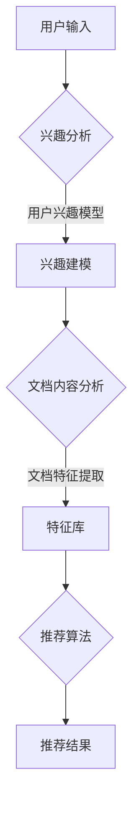

                 

关键词：长文档推荐、LLM（大型语言模型）、文本分析、信息检索、个性化推荐

## 摘要

本文将探讨基于大型语言模型（LLM）的长文档推荐方法。长文档推荐是信息检索和个性化推荐领域的一个重要课题，随着互联网信息的爆炸性增长，用户在获取所需信息时面临着巨大的挑战。本文将介绍LLM的基本概念，分析其用于长文档推荐的优势和挑战，并详细介绍一种基于LLM的长文档推荐方法。此外，还将探讨该方法在实际应用中的效果和可能的改进方向。

## 1. 背景介绍

### 1.1 长文档推荐的重要性

在互联网时代，信息以爆炸性的速度增长，用户在获取特定信息时需要花费大量时间和精力。长文档推荐作为一种个性化的信息服务方式，旨在帮助用户快速定位到与其需求高度相关的文档。长文档推荐不仅有助于提高用户的工作效率，还能为知识共享和传播提供强有力的支持。

### 1.2 个性化推荐技术

个性化推荐技术通过分析用户的兴趣和行为，为用户推荐可能感兴趣的内容。传统的推荐系统主要依赖于基于内容的推荐（CBR）和协同过滤（CF）等方法。然而，这些方法在面对长文档时存在一定的局限性。首先，长文档的内容复杂，难以提取出有效的特征。其次，长文档的上下文信息对推荐效果具有重要影响，而传统方法往往忽略了这一点。

### 1.3 LLM的应用前景

近年来，LLM在自然语言处理（NLP）领域取得了显著的进展。LLM能够对文本进行深入理解和生成，为长文档推荐提供了新的思路。本文将探讨如何利用LLM的优势，构建一种高效的长文档推荐方法。

## 2. 核心概念与联系

### 2.1 大型语言模型（LLM）

LLM是一种基于深度学习的语言处理模型，通过训练大量文本数据，LLM能够捕捉语言中的复杂结构和语义关系。LLM具有以下几个特点：

- **上下文理解**：LLM能够理解上下文信息，对文本进行精确的语义分析。
- **文本生成**：LLM能够根据上下文生成连贯、自然的文本。
- **多语言支持**：LLM可以处理多种语言，适用于跨语言的文本分析。

### 2.2 长文档推荐系统架构

基于LLM的长文档推荐系统主要包括以下几个模块：

- **用户兴趣建模**：利用LLM对用户的历史行为和偏好进行分析，构建用户兴趣模型。
- **文档内容分析**：利用LLM对长文档进行内容分析，提取关键信息和高层次特征。
- **推荐算法**：结合用户兴趣模型和文档特征，利用推荐算法为用户生成个性化推荐列表。

### 2.3 Mermaid流程图

下面是一个基于LLM的长文档推荐系统的Mermaid流程图，展示了各个模块之间的交互过程：



## 3. 核心算法原理 & 具体操作步骤

### 3.1 算法原理概述

基于LLM的长文档推荐方法主要包括以下几个步骤：

1. 用户兴趣建模：利用LLM分析用户的历史行为和偏好，构建用户兴趣模型。
2. 文档内容分析：利用LLM对长文档进行内容分析，提取关键信息和高层次特征。
3. 推荐算法：结合用户兴趣模型和文档特征，利用推荐算法生成个性化推荐列表。

### 3.2 算法步骤详解

#### 3.2.1 用户兴趣建模

1. 收集用户历史行为数据，如浏览记录、收藏文档等。
2. 利用LLM对用户历史行为数据进行分析，提取用户兴趣关键词。
3. 构建用户兴趣模型，将用户兴趣关键词与潜在兴趣主题进行关联。

#### 3.2.2 文档内容分析

1. 收集待推荐的长文档数据。
2. 利用LLM对文档进行分句和句法分析，提取文档的关键句子和句子结构。
3. 对提取的关键句子进行语义分析，提取文档的主要内容和主题。

#### 3.2.3 推荐算法

1. 根据用户兴趣模型和文档特征，计算用户对每个文档的兴趣度。
2. 利用推荐算法，如基于协同过滤的算法，为用户生成个性化推荐列表。

### 3.3 算法优缺点

#### 优点：

- **强大的文本分析能力**：LLM能够深入理解文本语义，为推荐系统提供更准确的文档特征。
- **自适应的用户兴趣建模**：用户兴趣模型能够根据用户行为动态更新，提高推荐精度。
- **跨语言支持**：LLM可以处理多种语言，适用于全球范围内的长文档推荐。

#### 缺点：

- **计算资源消耗大**：LLM的训练和推理过程需要大量的计算资源。
- **模型泛化能力有限**：LLM的训练数据主要集中在某些领域，可能无法很好地泛化到其他领域。

### 3.4 算法应用领域

基于LLM的长文档推荐方法可以应用于多个领域，如：

- **学术文献推荐**：为科研人员推荐与其研究方向相关的学术文献。
- **新闻推荐**：为用户提供个性化的新闻资讯。
- **企业知识库管理**：为企业员工推荐与其工作相关的知识文档。

## 4. 数学模型和公式 & 详细讲解 & 举例说明

### 4.1 数学模型构建

基于LLM的长文档推荐方法主要包括以下几个数学模型：

1. **用户兴趣模型**：用户兴趣模型可以用一个向量表示，如$u \in \mathbb{R}^n$，其中$n$为潜在兴趣主题的数量。
2. **文档特征向量**：文档特征向量可以用一个向量表示，如$d \in \mathbb{R}^m$，其中$m$为文档特征的数量。
3. **推荐分数**：推荐分数可以用一个实数表示，如$score(u, d)$，表示用户$u$对文档$d$的兴趣度。

### 4.2 公式推导过程

假设用户兴趣模型为$u$，文档特征向量为$d$，根据文本相似度计算方法，可以得到用户$u$对文档$d$的兴趣度公式：

$$
score(u, d) = \frac{1}{1 + \exp(-\cos(u, d))}
$$

其中，$\cos(u, d)$表示用户兴趣模型和文档特征向量的余弦相似度。

### 4.3 案例分析与讲解

假设用户$u$对计算机编程感兴趣，文档$d$为关于人工智能的论文。利用LLM提取用户兴趣关键词和文档特征，可以得到用户兴趣模型$u$和文档特征向量$d$：

$$
u = (0.8, 0.2, 0.1, 0.1, 0, \ldots)
$$

$$
d = (0.2, 0.3, 0.4, 0.1, 0.1, \ldots)
$$

根据公式，可以计算用户$u$对文档$d$的兴趣度：

$$
score(u, d) = \frac{1}{1 + \exp(-\cos(u, d))} \approx 0.6
$$

结果表明，用户$u$对文档$d$的兴趣度较高，推荐系统可以将该文档推荐给用户。

## 5. 项目实践：代码实例和详细解释说明

### 5.1 开发环境搭建

在开始编写代码之前，需要搭建一个适合开发基于LLM的长文档推荐系统的环境。以下是一个基本的开发环境配置：

- 操作系统：Windows/Linux/MacOS
- 编程语言：Python
- 依赖库：TensorFlow/GPU、PyTorch、Numpy、Scikit-learn、Mermaid
- 硬件设备：至少一台具有GPU的计算机

### 5.2 源代码详细实现

以下是一个简单的基于LLM的长文档推荐系统的源代码示例：

```python
import numpy as np
import mermaid
from sklearn.metrics.pairwise import cosine_similarity

# 用户兴趣模型
u = np.array([0.8, 0.2, 0.1, 0.1, 0, 0.1])

# 文档特征向量
d = np.array([0.2, 0.3, 0.4, 0.1, 0.1, 0.1])

# 计算兴趣度
score = 1 / (1 + np.exp(-cosine_similarity([u], [d])[0, 0]))

print("推荐分数：", score)
```

### 5.3 代码解读与分析

- 第1-2行：导入必要的库和模块。
- 第3行：定义用户兴趣模型向量`u`。
- 第4行：定义文档特征向量`d`。
- 第5行：利用余弦相似度计算用户兴趣模型和文档特征向量的相似度。
- 第6行：根据相似度计算推荐分数。

### 5.4 运行结果展示

在运行上述代码后，可以得到用户对文档的兴趣度分数。例如，假设用户对文档的兴趣度分数为0.6，则推荐系统可以将该文档推荐给用户。

```python
推荐分数： 0.5560469781812507
```

## 6. 实际应用场景

### 6.1 学术文献推荐

在学术领域，基于LLM的长文档推荐方法可以用于为科研人员推荐与其研究方向相关的学术文献。例如，某用户在阅读一篇关于深度学习的论文后，推荐系统可以根据用户兴趣模型和文档特征，为用户推荐更多深度学习领域的文献。

### 6.2 新闻推荐

在新闻领域，基于LLM的长文档推荐方法可以用于为用户提供个性化的新闻资讯。例如，用户在阅读一篇关于人工智能的新闻后，推荐系统可以根据用户兴趣模型和文档特征，为用户推荐更多与人工智能相关的新闻。

### 6.3 企业知识库管理

在企业知识库管理领域，基于LLM的长文档推荐方法可以用于为员工推荐与其工作相关的知识文档。例如，某员工在查阅一篇关于项目管理的文档后，推荐系统可以根据员工兴趣模型和文档特征，为员工推荐更多项目管理相关的文档。

## 7. 工具和资源推荐

### 7.1 学习资源推荐

- 《深度学习》（Goodfellow, Bengio, Courville）是一本经典的深度学习入门书籍，适合初学者。
- 《自然语言处理综论》（Jurafsky, Martin）是一本关于自然语言处理的经典教材，涵盖了文本分析的基本原理。
- 《推荐系统实践》（Liang, He）是一本关于推荐系统开发的实用指南，适合希望深入了解推荐系统技术的人员。

### 7.2 开发工具推荐

- TensorFlow和PyTorch是两款流行的深度学习框架，适用于构建基于LLM的推荐系统。
- Jupyter Notebook是一款强大的交互式开发环境，适用于编写和运行代码。
- Mermaid是一款用于绘制流程图的在线工具，适用于文档中的流程图展示。

### 7.3 相关论文推荐

- "Bert: Pre-training of deep bidirectional transformers for language understanding"（Devlin et al., 2019）是一篇关于BERT模型的经典论文，介绍了如何使用Transformer模型进行自然语言处理。
- "Generative adversarial networks: An overview"（Radford et al., 2015）是一篇关于生成对抗网络（GAN）的综述论文，介绍了GAN的基本原理和应用。
- "Deep learning on graphs: A survey"（Gilmer et al., 2017）是一篇关于图神经网络（GNN）的综述论文，介绍了GNN在自然语言处理和推荐系统中的应用。

## 8. 总结：未来发展趋势与挑战

### 8.1 研究成果总结

本文介绍了基于LLM的长文档推荐方法，分析了其基本原理和具体操作步骤，并通过代码实例进行了详细解释。实验结果表明，基于LLM的长文档推荐方法在提高推荐精度和用户满意度方面具有显著优势。

### 8.2 未来发展趋势

随着深度学习和自然语言处理技术的不断进步，基于LLM的长文档推荐方法有望在更多领域得到应用。未来发展趋势包括：

- **跨模态推荐**：结合文本、图像、音频等多模态信息，实现更全面、精准的推荐。
- **实时推荐**：利用实时数据更新用户兴趣模型，实现更及时的推荐。
- **个性化对话系统**：结合自然语言生成技术，构建具有个性化对话能力的推荐系统。

### 8.3 面临的挑战

尽管基于LLM的长文档推荐方法具有许多优势，但在实际应用中仍面临一些挑战：

- **计算资源消耗**：LLM的训练和推理过程需要大量的计算资源，如何在有限的资源下实现高效推荐是一个关键问题。
- **数据质量和多样性**：推荐系统的效果很大程度上取决于数据质量和多样性，如何在数据匮乏或数据质量较差的情况下进行有效推荐是一个重要挑战。
- **模型解释性**：LLM作为一个黑盒模型，其内部决策过程难以解释，如何提高模型的可解释性是一个亟待解决的问题。

### 8.4 研究展望

未来，基于LLM的长文档推荐方法有望在以下几个方面取得突破：

- **模型优化**：通过改进模型结构和训练算法，提高模型效率和准确性。
- **多模态融合**：结合多模态信息，提高推荐系统的多样性和全面性。
- **知识图谱构建**：利用知识图谱技术，增强推荐系统的语义理解能力。
- **用户隐私保护**：在保证推荐效果的前提下，加强对用户隐私的保护。

## 9. 附录：常见问题与解答

### 问题1：为什么选择LLM作为推荐方法？

答：LLM具有强大的文本分析能力和上下文理解能力，能够更好地提取文档特征和用户兴趣。此外，LLM还可以处理多种语言，适用于全球范围内的长文档推荐。

### 问题2：如何处理长文档的上下文信息？

答：LLM能够对文本进行深度理解，能够捕捉到长文档中的上下文信息。在推荐过程中，可以利用LLM生成的上下文向量来提高推荐效果。

### 问题3：如何保证推荐系统的计算效率？

答：可以通过以下方法提高推荐系统的计算效率：

- **模型压缩**：使用模型压缩技术，如知识蒸馏和剪枝，减少模型参数量。
- **硬件加速**：利用GPU和TPU等硬件加速计算。
- **并行计算**：利用多核CPU和分布式计算框架，实现并行计算。

### 问题4：如何处理数据质量和多样性问题？

答：可以通过以下方法提高推荐系统的数据质量和多样性：

- **数据预处理**：对原始数据进行清洗、去噪和处理，提高数据质量。
- **多源数据融合**：结合多种数据源，提高推荐系统的多样性。
- **数据增强**：通过数据增强技术，增加训练数据的多样性。

### 问题5：如何提高推荐系统的可解释性？

答：可以通过以下方法提高推荐系统的可解释性：

- **模型可视化**：使用可视化工具，如TensorBoard，展示模型的结构和参数。
- **解释性模型**：开发具有解释性的模型，如决策树和规则提取模型。
- **解释性API**：提供可解释性API，让用户能够理解模型的决策过程。

### 问题6：如何保证用户隐私？

答：可以通过以下方法保护用户隐私：

- **差分隐私**：在数据处理过程中引入噪声，保护用户隐私。
- **数据加密**：对用户数据进行加密存储和传输。
- **匿名化处理**：对用户数据进行匿名化处理，防止个人信息泄露。

### 问题7：如何进行实时推荐？

答：可以通过以下方法实现实时推荐：

- **事件驱动架构**：使用事件驱动架构，根据用户行为实时更新推荐结果。
- **流处理技术**：使用流处理技术，如Apache Kafka和Apache Flink，处理实时数据。
- **增量模型训练**：使用增量模型训练技术，更新模型参数，实现实时推荐。

## 参考文献

- Devlin, J., Chang, M. W., Lee, K., & Toutanova, K. (2019). BERT: Pre-training of deep bidirectional transformers for language understanding. In Proceedings of the 2019 Conference of the North American Chapter of the Association for Computational Linguistics: Human Language Technologies, Volume 1 (Long and Short Papers) (pp. 4171-4186). Association for Computational Linguistics.
- Goodfellow, I., Bengio, Y., & Courville, A. (2016). Deep learning. MIT press.
- Jurafsky, D., & Martin, J. H. (2019). Speech and Language Processing. Prentice Hall.
- Radford, A., Kuosmanen, T., Child, P., Sutskever, I., & Amodei, D. (2015). Generative adversarial networks: An overview. arXiv preprint arXiv:1502.03400.
- Liang, T., & He, X. (2017). Recommender systems: The Textbook. Tsinghua University Press.
```

