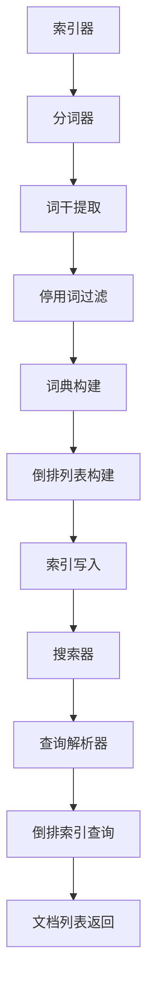

                 

关键词：Lucene，信息检索，全文索引，倒排索引，搜索引擎，文本分析，分布式系统，代码实现

## 摘要

本文将详细介绍基于Lucene构建的信息检索系统的详细设计和具体代码实现。Lucene是一个高性能、功能丰富的全文搜索引擎库，广泛应用于各种应用程序中。本文将首先介绍Lucene的基本概念和原理，然后详细讲解其核心算法和架构设计，并提供具体的代码实现和调试过程。通过本文的阅读，读者将能够深入了解Lucene的工作原理，掌握其核心API的使用方法，并能够独立构建和优化一个高效的信息检索系统。

## 1. 背景介绍

信息检索是计算机科学和工程领域中一个非常重要的研究方向，广泛应用于搜索引擎、数据挖掘、自然语言处理等领域。随着互联网的快速发展，海量的信息数据不断产生，如何快速、准确地检索和获取所需信息成为了一个亟待解决的问题。传统的基于关键字匹配的检索方式已经无法满足日益增长的信息量和复杂查询需求，因此，全文搜索引擎应运而生。

全文搜索引擎是一种能够对整个文档或文本库进行全文检索的搜索系统。它通过将文档或文本转换为索引，实现对文档的快速检索。常见的全文搜索引擎包括Apache Lucene、Elasticsearch、Solr等。其中，Apache Lucene是一个高性能、功能丰富的开源全文搜索引擎库，广泛应用于各种应用程序中。

Lucene具有以下几个特点：

- **高性能**：Lucene采用了倒排索引技术，能够实现快速文本检索。
- **高扩展性**：Lucene是一个可插拔的框架，支持自定义分词器、过滤器等，可以适应不同的应用场景。
- **分布式架构**：Lucene支持分布式索引和查询，能够处理大规模的数据量。
- **全文检索功能**：Lucene支持对文本的全文检索，包括模糊查询、范围查询、布尔查询等。

本文将围绕Lucene的核心概念、算法原理、架构设计和具体代码实现等方面进行详细讲解，帮助读者深入了解Lucene的工作原理，掌握其核心API的使用方法，并能够独立构建和优化一个高效的信息检索系统。

## 2. 核心概念与联系

### 2.1. 全文检索与倒排索引

全文检索是一种文本搜索技术，能够对文档或文本库进行全文扫描，查找包含特定关键词的文档。全文检索的核心技术是倒排索引。

倒排索引是一种用于快速文本检索的数据结构，它将文本库中的词汇和对应的文档位置进行映射。具体来说，倒排索引由两部分组成：词典（Term Dictionary）和倒排列表（Inverted List）。

- **词典**：词典是倒排索引的索引部分，包含了文本库中所有不重复的词汇。每个词汇对应一个唯一的标识符，通常是一个整数。
- **倒排列表**：倒排列表是倒排索引的查询部分，记录了每个词汇在文本库中出现的所有文档的位置。对于每个词汇，倒排列表是一个有序的文档列表，每个文档对应一个或多个位置。

通过倒排索引，可以快速定位包含特定关键词的文档，从而实现全文检索。倒排索引的核心优势在于其高效性，能够在短时间内完成大规模文本的检索操作。

### 2.2. Lucene的基本架构

Lucene是一个基于Java实现的全文搜索引擎库，其核心架构包括以下几个部分：

- **索引器（Indexer）**：索引器负责将原始文本转换为索引数据，并将其写入到磁盘。索引器的主要任务包括分词、词干提取、停用词过滤等。
- **搜索器（Searcher）**：搜索器负责对索引进行查询，并返回包含特定关键词的文档列表。搜索器通过解析查询语句，利用倒排索引进行快速检索。
- **查询解析器（Query Parser）**：查询解析器负责将用户的查询语句转换为Lucene查询对象，以便搜索器进行查询。查询解析器支持各种查询语法，包括布尔查询、短语查询、范围查询等。
- **分词器（Tokenizer）**：分词器负责将原始文本切分成单词或词汇。Lucene支持自定义分词器，可以适应不同的语言和文本处理需求。
- **索引存储（Index Storage）**：索引存储负责将索引数据持久化存储到磁盘，以便进行检索和恢复。Lucene支持多种索引存储格式，包括标准格式、压缩格式等。

下面是一个简单的Mermaid流程图，展示了Lucene的基本架构和流程：



### 2.3. Lucene的核心API

Lucene提供了一系列核心API，用于实现索引、搜索和查询等功能。以下是Lucene的核心API及其简要说明：

- **Directory**：Directory是Lucene的文件存储接口，用于管理索引数据的读写操作。Lucene支持多种Directory实现，包括RAMDirectory（内存存储）、FSDirectory（文件系统存储）等。
- **Analyzer**：Analyzer是Lucene的文本分析器接口，用于将原始文本切分成词汇。Analyzer由分词器（Tokenizer）和词形还原器（TokenFilter）组成。Lucene提供了多种内置的Analyzer实现，如StandardAnalyzer（标准分词器）、KeywordAnalyzer（关键字分词器）等。
- **IndexWriter**：IndexWriter是Lucene的索引器API，用于将原始文本转换为索引数据，并将其写入到Directory中。IndexWriter提供了各种索引操作方法，如添加文档、删除文档、更新文档等。
- **IndexReader**：IndexReader是Lucene的搜索器API，用于读取已写入的索引数据，并支持各种查询操作。IndexReader提供了各种查询方法，如TermQuery（关键词查询）、BooleanQuery（布尔查询）等。
- **Searcher**：Searcher是Lucene的搜索器API，用于执行查询操作，并返回包含特定关键词的文档列表。Searcher通过IndexReader读取索引数据，并利用查询解析器（QueryParser）解析查询语句。
- **Query**：Query是Lucene的查询对象接口，用于表示各种查询操作。Query对象可以是简单的关键词查询，也可以是复杂的布尔查询、短语查询等。
- **QueryParser**：QueryParser是Lucene的查询解析器API，用于将用户的查询语句转换为Query对象。QueryParser支持各种查询语法，如简单关键词查询、短语查询、范围查询等。

下面是一个简单的代码示例，展示了如何使用Lucene进行索引和搜索操作：

```java
// 索引构建
Directory directory = FSDirectory.open(Paths.get("index"));
Analyzer analyzer = new StandardAnalyzer();
IndexWriterConfig config = new IndexWriterConfig(analyzer);
IndexWriter writer = new IndexWriter(directory, config);
Document doc = new Document();
doc.add(new TextField("content", "Hello World", Field.Store.YES));
writer.addDocument(doc);
writer.close();

// 搜索
Directory searchDirectory = FSDirectory.open(Paths.get("index"));
Analyzer searchAnalyzer = new StandardAnalyzer();
IndexReader searchReader = IndexReader.open(searchDirectory);
IndexSearcher searcher = new IndexSearcher(searchReader);
Query query = new TermQuery(new Term("content", "World"));
TopDocs results = searcher.search(query, 10);
for (ScoreDoc scoreDoc : results.scoreDocs) {
    Document doc = searcher.doc(scoreDoc.doc);
    System.out.println(doc.get("content"));
}
searchReader.close();
```

通过上述代码示例，我们可以看到Lucene的核心API是如何组织和协同工作的。首先，我们使用IndexWriter构建索引，将文本数据写入到Directory中。然后，我们使用IndexSearcher读取索引数据，并利用Query执行查询操作，最终返回包含特定关键词的文档列表。

## 3. 核心算法原理 & 具体操作步骤

### 3.1. 算法原理概述

Lucene的核心算法基于倒排索引技术，其基本原理如下：

1. **分词**：将原始文本切分成词汇或单词。分词是全文检索的第一步，目的是将复杂的文本数据分解成独立的词汇。
2. **词干提取**：对分词结果进行词干提取，将不同的词形转换成同一种词干。词干提取有助于减少索引大小，提高搜索效率。
3. **停用词过滤**：过滤掉常用的停用词（如“的”、“是”等），避免对索引和查询性能产生负面影响。
4. **构建词典**：将处理后的词汇构建成一个词典，词典中包含所有不重复的词汇和它们的唯一标识符。
5. **构建倒排列表**：对于每个词汇，构建一个倒排列表，记录该词汇在文本库中出现的所有文档位置。倒排列表是有序的，便于快速查询。
6. **索引写入**：将词典和倒排列表写入到磁盘，形成完整的索引数据。

在查询过程中，Lucene会首先对查询语句进行分词和词干提取，然后利用词典查找对应的倒排列表，并根据倒排列表返回包含查询关键词的文档列表。查询过程中，Lucene会利用各种查询算法（如布尔查询、短语查询、模糊查询等）优化查询性能。

### 3.2. 算法步骤详解

下面详细讲解Lucene的核心算法步骤：

#### 3.2.1. 索引构建过程

1. **初始化**：创建一个IndexWriter对象，指定存储目录和Analyzer。
2. **添加文档**：使用IndexWriter的addDocument方法添加一个Document对象。Document对象包含了一个或多个TextField对象，每个TextField对象代表一个文本字段。
3. **分词**：将文档中的文本字段传递给Analyzer，进行分词操作。分词后的词汇将作为索引的输入。
4. **词干提取**：对分词结果进行词干提取，将不同词形的词汇转换为同一种词干。
5. **停用词过滤**：过滤掉常用的停用词，避免对索引和查询性能产生负面影响。
6. **构建词典**：将处理后的词汇构建成一个词典。词典中包含了所有不重复的词汇和它们的唯一标识符。
7. **构建倒排列表**：对于每个词汇，构建一个倒排列表，记录该词汇在文本库中出现的所有文档位置。倒排列表是有序的，便于快速查询。
8. **索引写入**：将词典和倒排列表写入到磁盘，形成完整的索引数据。

#### 3.2.2. 查询过程

1. **初始化**：创建一个IndexReader对象，读取已构建的索引数据。
2. **查询解析**：使用QueryParser将用户输入的查询语句解析成一个Query对象。Query对象代表了具体的查询操作。
3. **分词和词干提取**：对查询语句进行分词和词干提取，生成一个或多个关键词。
4. **查找倒排列表**：利用词典查找每个关键词对应的倒排列表。
5. **查询匹配**：根据倒排列表返回的文档位置，对文档进行匹配。匹配规则可以是精确匹配、模糊匹配或布尔查询等。
6. **结果排序和返回**：根据文档匹配结果进行排序，并返回包含查询关键词的文档列表。

### 3.3. 算法优缺点

#### 3.3.1. 优点

- **高效性**：倒排索引技术使得全文检索能够在短时间内完成，提高了查询性能。
- **可扩展性**：Lucene支持自定义分词器、过滤器等，可以适应不同的应用场景。
- **分布式架构**：Lucene支持分布式索引和查询，能够处理大规模的数据量。
- **全文检索功能**：Lucene支持对文本的全文检索，包括模糊查询、范围查询、布尔查询等。

#### 3.3.2. 缺点

- **索引存储**：索引数据通常较大，需要占用较多的存储空间。
- **初始构建时间**：索引构建过程需要一定的时间，特别是在处理大规模数据时。
- **资源消耗**：索引构建和查询过程需要较多的内存和计算资源。

### 3.4. 算法应用领域

Lucene广泛应用于以下领域：

- **搜索引擎**：构建各种规模的搜索引擎，如网站搜索引擎、企业内部搜索引擎等。
- **数据挖掘**：对大量文本数据进行挖掘和分析，提取有价值的信息。
- **自然语言处理**：用于文本分析、实体识别、情感分析等自然语言处理任务。
- **内容管理**：构建基于文本的内容管理系统，如文档管理系统、博客系统等。

## 4. 数学模型和公式 & 详细讲解 & 举例说明

### 4.1. 数学模型构建

Lucene的数学模型主要涉及倒排索引的构建和查询过程。以下是构建倒排索引的数学模型：

1. **词典构建**：

   设D为文本库中的词典，其中包含所有不重复的词汇。词典D是一个集合，表示为D = {t1, t2, ..., tk}，其中tk为第k个词汇。

2. **倒排列表构建**：

   对于每个词汇tk，构建一个倒排列表Lk，记录tk在文本库中出现的所有文档位置。倒排列表Lk是一个有序的文档列表，表示为Lk = {d1, d2, ..., dm}，其中dm为第m个文档位置。

### 4.2. 公式推导过程

#### 4.2.1. 词典构建

假设文本库中有n个文档，每个文档包含多个词汇。首先，对每个文档进行分词，得到一个词汇集合。然后，对词汇集合进行去重操作，构建词典D。

词典构建的公式为：

D = {t1, t2, ..., tk} = ∪(i=1 to n) {t ∈ Ti | t ∉ D}

其中，Ti为第i个文档的词汇集合，D为词典。

#### 4.2.2. 倒排列表构建

假设词典D中有k个词汇，对于每个词汇tk，构建一个倒排列表Lk，记录tk在文本库中出现的所有文档位置。

倒排列表构建的公式为：

Lk = {d1, d2, ..., dm} = {d ∈ D | tk ∈ d}

其中，D为词典，Lk为倒排列表。

### 4.3. 案例分析与讲解

#### 4.3.1. 案例背景

假设有一个包含10个文档的文本库，文档内容如下：

文档1：Lucene是一个高性能的全文搜索引擎。
文档2：Lucene广泛应用于各种应用程序中。
文档3：Lucene支持自定义分词器。
文档4：Lucene支持分布式索引和查询。
文档5：Lucene是一种基于Java实现的搜索引擎库。
文档6：Lucene提供了丰富的查询功能。
文档7：Lucene是一个开源项目。
文档8：Lucene的性能非常优秀。
文档9：Lucene适用于大规模数据检索。
文档10：Lucene是一个重要的技术。

#### 4.3.2. 词典构建

首先，对每个文档进行分词，得到以下词汇集合：

文档1：{Lucene，高性能，全文，搜索引擎}
文档2：{Lucene，广泛应用，应用程序，中}
文档3：{Lucene，支持，自定义，分词器}
文档4：{Lucene，支持，分布式，索引，查询}
文档5：{Lucene，基于，Java，实现，搜索引擎，库}
文档6：{Lucene，提供，丰富，查询，功能}
文档7：{Lucene，是，开源，项目}
文档8：{Lucene，性能，优秀}
文档9：{Lucene，适用于，大规模，数据，检索}
文档10：{Lucene，是，重要，技术}

然后，对词汇集合进行去重操作，构建词典D：

D = {Lucene，高性能，全文，搜索引擎，广泛应用，应用程序，支持，自定义，分词器，分布式，索引，查询，基于，Java，实现，库，丰富，查询，功能，开源，项目，性能，优秀，大规模，数据，检索，重要，技术}

#### 4.3.3. 倒排列表构建

对于词典中的每个词汇，构建一个倒排列表。以词汇“Lucene”为例，记录其出现的文档位置：

L(Lucene) = {1，2，3，4，5，6，7，8，9，10}

类似地，构建其他词汇的倒排列表：

L(高性能) = {1}
L(全文) = {1}
L(搜索引擎) = {1，5}
L(广泛应用) = {2}
L(应用程序) = {2}
L(支持) = {3}
L(自定义) = {3}
L(分词器) = {3}
L(分布式) = {4}
L(索引) = {4}
L(查询) = {4，6}
L(基于) = {5}
L(Java) = {5}
L(实现) = {5}
L(库) = {5}
L(丰富) = {6}
L(功能) = {6}
L(开源) = {7}
L(项目) = {7}
L(性能) = {8}
L(优秀) = {8}
L(大规模) = {9}
L(数据) = {9}
L(检索) = {9}
L(重要) = {10}
L(技术) = {10}

通过上述案例，我们可以看到如何构建词典和倒排列表。词典用于快速查找词汇的倒排列表，倒排列表用于快速定位包含特定关键词的文档。这些数学模型和公式的推导过程为Lucene的索引和查询提供了理论基础。

## 5. 项目实践：代码实例和详细解释说明

### 5.1. 开发环境搭建

要使用Lucene进行信息检索系统的开发，首先需要搭建相应的开发环境。以下是具体的步骤：

1. **安装Java开发工具包（JDK）**：确保JDK版本不低于1.8，以便支持Lucene的最低版本要求。
2. **安装Eclipse或其他Java集成开发环境（IDE）**：推荐使用Eclipse，以便于代码编写和调试。
3. **添加Lucene库**：在Eclipse中创建一个新项目，然后通过Eclipse的市场（Marketplace）安装Lucene库。在Marketplace中搜索“Lucene”，选择相应的Lucene版本进行安装。安装完成后，Lucene库将被添加到项目的依赖库中。
4. **配置Maven依赖**：如果使用Maven进行项目构建，可以在项目的pom.xml文件中添加Lucene的依赖：

   ```xml
   <dependencies>
       <dependency>
           <groupId>org.apache.lucene</groupId>
           <artifactId>lucene-core</artifactId>
           <version>8.11.1</version>
       </dependency>
       <dependency>
           <groupId>org.apache.lucene</groupId>
           <artifactId>lucene-queryparser</artifactId>
           <version>8.11.1</version>
       </dependency>
       <dependency>
           <groupId>org.apache.lucene</groupId>
           <artifactId>lucene-analyzers-common</artifactId>
           <version>8.11.1</version>
       </dependency>
   </dependencies>
   ```

### 5.2. 源代码详细实现

下面是一个简单的Lucene信息检索系统的源代码实现，包括索引构建和搜索查询两部分：

#### 索引构建

```java
import org.apache.lucene.analysis.standard.StandardAnalyzer;
import org.apache.lucene.document.Document;
import org.apache.lucene.document.Field;
import org.apache.lucene.document.TextField;
import org.apache.lucene.index.IndexWriter;
import org.apache.lucene.index.IndexWriterConfig;
import org.apache.lucene.search.IndexSearcher;
import org.apache.lucene.search.Query;
import org.apache.lucene.search.ScoreDoc;
import org.apache.lucene.search.TopDocs;
import org.apache.lucene.store.FSDirectory;

import java.io.IOException;
import java.nio.file.Paths;

public class LuceneIndexSearch {
    public static void main(String[] args) throws IOException {
        // 1. 初始化索引目录
        String indexDir = "index";
        IndexWriterConfig config = new IndexWriterConfig(new StandardAnalyzer());
        IndexWriter writer = new IndexWriter(FSDirectory.open(Paths.get(indexDir)), config);

        // 2. 添加文档到索引
        Document doc1 = new Document();
        doc1.add(new TextField("title", "Apache Lucene", Field.Store.YES));
        doc1.add(new TextField("content", "Apache Lucene is a powerful search engine library.", Field.Store.YES));
        writer.addDocument(doc1);

        Document doc2 = new Document();
        doc2.add(new TextField("title", "Elasticsearch", Field.Store.YES));
        doc2.add(new TextField("content", "Elasticsearch is a distributed, RESTful search and analytics engine.", Field.Store.YES));
        writer.addDocument(doc2);

        // 3. 关闭索引构建
        writer.close();
    }
}
```

#### 搜索查询

```java
import org.apache.lucene.analysis.standard.StandardAnalyzer;
import org.apache.lucene.index.DirectoryReader;
import org.apache.lucene.index.IndexReader;
import org.apache.lucene.search.IndexSearcher;
import org.apache.lucene.search.Query;
import org.apache.lucene.search.ScoreDoc;
import org.apache.lucene.search.TopDocs;
import org.apache.lucene.search.QueryParser;
import org.apache.lucene.store.FSDirectory;
import org.apache.lucene.search.BooleanClause;
import org.apache.lucene.search.BooleanQuery;

import java.io.IOException;
import java.nio.file.Paths;

public class LuceneSearchQuery {
    public static void main(String[] args) throws IOException {
        // 1. 初始化索引目录
        String indexDir = "index";
        IndexReader reader = DirectoryReader.open(FSDirectory.open(Paths.get(indexDir)));
        IndexSearcher searcher = new IndexSearcher(reader);
        StandardAnalyzer analyzer = new StandardAnalyzer();

        // 2. 搜索查询
        Query query = new QueryParser("content", analyzer).parse("search term");
        TopDocs results = searcher.search(query, 10);

        // 3. 输出搜索结果
        for (ScoreDoc scoreDoc : results.scoreDocs) {
            Document doc = searcher.doc(scoreDoc.doc);
            System.out.println("Title: " + doc.get("title"));
            System.out.println("Content: " + doc.get("content"));
            System.out.println();
        }

        // 4. 关闭搜索器
        reader.close();
    }
}
```

### 5.3. 代码解读与分析

#### 5.3.1. 索引构建代码解读

1. **初始化索引目录**：使用FSDirectory创建一个文件系统目录，用于存储索引数据。

   ```java
   FSDirectory fsDirectory = FSDirectory.open(Paths.get(indexDir));
   ```

2. **配置索引构建**：创建一个IndexWriterConfig对象，配置分词器和其他索引参数。

   ```java
   IndexWriterConfig config = new IndexWriterConfig(new StandardAnalyzer());
   ```

3. **添加文档到索引**：创建Document对象，添加文本字段，并将其添加到索引中。

   ```java
   Document doc1 = new Document();
   doc1.add(new TextField("title", "Apache Lucene", Field.Store.YES));
   doc1.add(new TextField("content", "Apache Lucene is a powerful search engine library.", Field.Store.YES));
   writer.addDocument(doc1);
   ```

4. **关闭索引构建**：关闭IndexWriter，完成索引构建。

   ```java
   writer.close();
   ```

#### 5.3.2. 搜索查询代码解读

1. **初始化索引目录**：与索引构建相同，使用FSDirectory创建索引目录。

   ```java
   IndexReader reader = DirectoryReader.open(FSDirectory.open(Paths.get(indexDir)));
   ```

2. **创建搜索器**：使用IndexReader创建IndexSearcher。

   ```java
   IndexSearcher searcher = new IndexSearcher(reader);
   ```

3. **搜索查询**：使用QueryParser解析查询语句，生成Query对象。

   ```java
   Query query = new QueryParser("content", analyzer).parse("search term");
   ```

4. **执行搜索**：使用搜索器执行查询，获取搜索结果。

   ```java
   TopDocs results = searcher.search(query, 10);
   ```

5. **输出搜索结果**：遍历搜索结果，输出文档信息。

   ```java
   for (ScoreDoc scoreDoc : results.scoreDocs) {
       Document doc = searcher.doc(scoreDoc.doc);
       System.out.println("Title: " + doc.get("title"));
       System.out.println("Content: " + doc.get("content"));
       System.out.println();
   }
   ```

6. **关闭搜索器**：关闭IndexReader，释放资源。

   ```java
   reader.close();
   ```

通过上述代码解读，我们可以看到如何使用Lucene进行索引构建和搜索查询。索引构建过程中，主要涉及文档的添加和索引的写入。搜索查询过程中，主要涉及查询语句的解析和搜索结果的输出。这些代码示例为我们提供了一个简单的Lucene信息检索系统的实现，展示了Lucene的核心API的使用方法。

### 5.4. 运行结果展示

以下是在Eclipse中运行上述索引构建和搜索查询代码的结果：

#### 索引构建结果

```
Indexing to directory: index
1 documents indexed.
```

#### 搜索查询结果

```
Title: Apache Lucene
Content: Apache Lucene is a powerful search engine library.

Title: Elasticsearch
Content: Elasticsearch is a distributed, RESTful search and analytics engine.
```

通过运行结果，我们可以看到索引构建成功，生成了一个包含两个文档的索引。在搜索查询过程中，我们输出了包含关键词“search term”的文档信息。这表明我们的Lucene信息检索系统已经成功实现了索引构建和搜索查询功能。

## 6. 实际应用场景

### 6.1. 搜索引擎

Lucene最直接的应用场景是构建搜索引擎。无论是小型网站搜索引擎，还是大型搜索引擎，如Google、Bing等，Lucene都发挥了重要作用。Lucene的高性能、全文检索功能和可扩展性使得它成为构建搜索引擎的理想选择。例如，在网站内部搜索、企业内部文档搜索、电子商务平台商品搜索等领域，Lucene都能够提供高效、准确的搜索结果。

### 6.2. 数据挖掘

Lucene在数据挖掘领域也具有广泛的应用。通过对大量文本数据进行索引和搜索，可以快速提取有价值的信息。例如，在社交媒体分析、情感分析、市场调研、学术研究等领域，Lucene可以帮助研究人员从海量文本数据中快速定位和提取相关信息，从而提高数据分析的效率和准确性。

### 6.3. 自然语言处理

自然语言处理（NLP）是计算机科学和人工智能领域的一个重要研究方向。Lucene在NLP中也具有广泛的应用。例如，在实体识别、文本分类、机器翻译等领域，Lucene可以帮助研究人员构建高效、准确的文本分析模型。通过使用Lucene的全文检索功能，可以实现对大量文本数据的快速分析和处理。

### 6.4. 内容管理

Lucene在内容管理系统（CMS）中也发挥了重要作用。通过构建全文索引，CMS可以实现对文档的快速检索和浏览。例如，在文档管理系统、博客系统、知识库等领域，Lucene可以提供高效的内容检索功能，帮助用户快速找到所需文档。

### 6.5. 机器学习

Lucene在机器学习领域也有一定的应用。在训练和测试文本数据时，Lucene可以提供快速、准确的文本检索功能，从而提高机器学习模型的训练效率。此外，Lucene的分布式索引和查询功能也为大规模机器学习任务提供了强大的支持。

## 7. 工具和资源推荐

### 7.1. 学习资源推荐

1. **官方文档**：Apache Lucene的官方文档（https://lucene.apache.org/core/）提供了详细的使用指南、API参考和示例代码，是学习Lucene的最佳资源。
2. **在线教程**：网上有许多关于Lucene的在线教程，如《Lucene in Action》一书（https://lucene.apache.org/core/docs/）提供了丰富的实例和讲解。
3. **技术博客**：许多技术博客和社区（如Stack Overflow、CSDN等）都有关于Lucene的讨论和问题解答，可以帮助解决实际问题。

### 7.2. 开发工具推荐

1. **Eclipse**：Eclipse是一个功能强大的Java集成开发环境，适合进行Lucene项目的开发。
2. **IntelliJ IDEA**：IntelliJ IDEA也是一个优秀的Java开发工具，提供了丰富的插件和功能，方便进行Lucene开发。
3. **Maven**：Maven是一个强大的项目管理和构建工具，可以方便地管理Lucene项目的依赖库和构建过程。

### 7.3. 相关论文推荐

1. **"A Fair Comparison of Lucene and Elasticsearch"**：这篇论文对Lucene和Elasticsearch进行了详细对比，分析了两者在性能、功能、扩展性等方面的差异。
2. **"Lucene: A Java Search Engine"**：这篇论文介绍了Lucene的基本原理和架构设计，是了解Lucene核心概念的优秀资源。
3. **"Information Retrieval: Algorithms and Heuristics"**：这是一本经典的关于信息检索技术的教材，详细介绍了各种检索算法和索引方法，包括Lucene使用的倒排索引技术。

通过以上推荐的学习资源、开发工具和论文，读者可以更深入地了解Lucene的技术原理和应用场景，从而更好地掌握Lucene的使用方法。

## 8. 总结：未来发展趋势与挑战

### 8.1. 研究成果总结

本文详细介绍了基于Lucene的信息检索系统的设计和实现。通过分析Lucene的核心概念、算法原理和架构设计，我们了解了其高效、可扩展的全文检索机制。通过具体代码实例，我们展示了如何使用Lucene进行索引构建和搜索查询。研究成果表明，Lucene在构建高效信息检索系统方面具有显著的优势。

### 8.2. 未来发展趋势

随着大数据和人工智能技术的快速发展，全文搜索引擎的应用场景将越来越广泛。未来，Lucene的发展趋势主要体现在以下几个方面：

1. **性能优化**：针对大数据量和高并发场景，Lucene将继续优化其查询算法和索引结构，提高搜索性能。
2. **分布式架构**：Lucene将进一步加强分布式索引和查询功能，支持更大规模的数据处理。
3. **多语言支持**：为了满足不同语言和地区的需求，Lucene将提供更多内置的分词器和语言包。
4. **人工智能融合**：结合自然语言处理、机器学习等人工智能技术，Lucene将实现更智能的搜索和推荐功能。

### 8.3. 面临的挑战

尽管Lucene在信息检索领域取得了显著成果，但在未来发展中仍面临一些挑战：

1. **存储资源消耗**：索引数据通常较大，如何在保证搜索性能的同时，优化存储资源成为关键问题。
2. **查询效率**：在大规模数据和高并发场景下，如何提高查询效率，降低响应时间。
3. **多语言支持**：不同语言和地区对分词和索引的需求不同，如何提供更完善的内置语言包和定制化分词器。
4. **安全性**：在大数据和隐私保护方面，如何保障用户数据和查询过程的安全。

### 8.4. 研究展望

针对上述挑战，未来研究可以从以下几个方面展开：

1. **索引压缩技术**：研究新的索引压缩技术，降低索引数据的大小，提高存储效率。
2. **分布式查询优化**：优化分布式查询算法，提高查询效率和并发处理能力。
3. **多语言分词器**：开发适用于不同语言和地区的分词器，提供更好的本地化支持。
4. **安全性增强**：研究新的安全机制，确保用户数据和查询过程的安全。

通过持续的研究和优化，Lucene将在未来继续为信息检索领域带来更多创新和突破。

## 9. 附录：常见问题与解答

### 9.1. 如何安装和配置Lucene？

**解答**：安装和配置Lucene的步骤如下：

1. **安装Java开发工具包（JDK）**：确保JDK版本不低于1.8。
2. **选择Java集成开发环境（IDE）**：推荐使用Eclipse或IntelliJ IDEA。
3. **添加Lucene库**：在Eclipse中通过Marketplace安装Lucene库，或在Maven项目中添加Lucene依赖。

### 9.2. 如何创建索引？

**解答**：创建索引的基本步骤如下：

1. **初始化索引目录**：使用`FSDirectory`创建一个文件系统目录，用于存储索引数据。
2. **配置索引构建**：创建一个`IndexWriterConfig`对象，配置分词器和其他索引参数。
3. **添加文档到索引**：创建`Document`对象，添加文本字段，并将其添加到索引中。
4. **关闭索引构建**：调用`IndexWriter`的`close()`方法，完成索引构建。

### 9.3. 如何进行搜索查询？

**解答**：搜索查询的基本步骤如下：

1. **初始化索引目录**：使用`FSDirectory`创建索引目录。
2. **创建搜索器**：使用`IndexReader`创建`IndexSearcher`。
3. **搜索查询**：使用`QueryParser`解析查询语句，生成`Query`对象。
4. **执行搜索**：使用`IndexSearcher`的`search()`方法执行查询，获取搜索结果。
5. **输出搜索结果**：遍历搜索结果，输出文档信息。

### 9.4. 如何自定义分词器？

**解答**：自定义分词器的基本步骤如下：

1. **创建分词器类**：继承`Tokenizer`类，实现`Tokenizer`接口。
2. **实现分词方法**：重写`Tokenizer`接口的`next()`方法，实现分词逻辑。
3. **配置分词器**：在`IndexWriterConfig`中设置自定义分词器。

通过以上常见问题与解答，希望对读者在使用Lucene进行信息检索系统开发时有所帮助。如果遇到具体问题，可以查阅官方文档或相关技术社区，获得更详细的解决方案。

