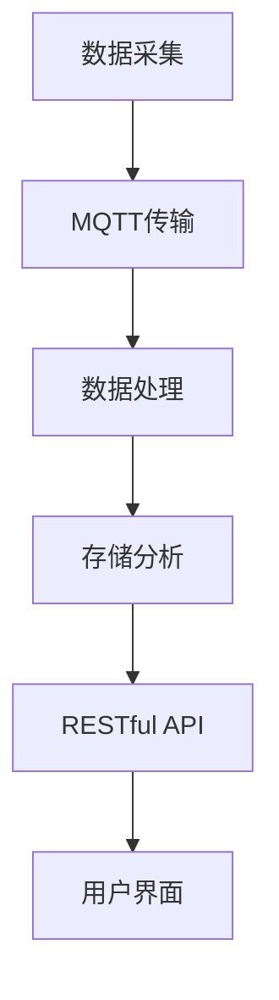

                 

关键词：MQTT协议，RESTful API，家电故障预测，维护系统，物联网，人工智能，大数据分析

## 摘要

随着物联网（IoT）和人工智能（AI）技术的迅猛发展，智能家居设备的数量和复杂性不断增加。然而，随之而来的问题是如何有效地预测和预防家电设备的故障，确保这些设备在最佳状态下运行。本文旨在探讨基于MQTT协议和RESTful API的家电故障预测与维护系统的设计与实现。首先，我们将介绍MQTT协议和RESTful API的基本概念及其在物联网中的应用。接着，我们将详细阐述家电故障预测系统的核心算法和数学模型，并通过一个具体的案例来展示其实际应用效果。最后，我们将探讨该系统在智能家居领域的未来应用前景，并展望其发展趋势和面临的挑战。

## 1. 背景介绍

### 1.1 物联网技术的发展

物联网（IoT）是当前技术发展的热点之一，它通过将各种物理设备、传感器、计算机系统等互联起来，形成一个庞大的信息网络。随着5G、人工智能、大数据等新兴技术的应用，物联网的规模和应用领域不断扩大。智能家居作为物联网的一个重要分支，逐渐走进千家万户。然而，随着家电设备数量的增加，如何保证这些设备的稳定运行和延长其使用寿命成为了一个亟待解决的问题。

### 1.2 家电故障预测的必要性

家电设备的故障不仅会给用户带来不便，还可能导致经济损失甚至安全隐患。传统的家电维护模式主要依赖于定期检修和故障发生后的人工排查，这种方式存在检测不及时、维护成本高、效率低下等问题。随着物联网技术的普及，家电设备开始具备自我监测和故障预测的能力。通过实时采集设备运行数据，结合人工智能算法进行分析，可以提前预测设备的故障风险，从而采取预防措施，避免故障的发生。

### 1.3 MQTT协议和RESTful API的优势

MQTT（Message Queuing Telemetry Transport）协议是一种轻量级的消息传输协议，特别适合用于物联网设备之间的通信。它具有低功耗、低带宽占用、高可靠性等特点，能够保证在资源有限的设备上实现有效的数据传输。RESTful API（Representational State Transfer Application Programming Interface）则是一种基于HTTP请求的接口设计规范，具有简单、灵活、可扩展等优点，能够方便地实现不同系统之间的数据交换和功能集成。

## 2. 核心概念与联系

为了更好地理解基于MQTT协议和RESTful API的家电故障预测与维护系统，我们需要先介绍几个核心概念，并展示它们之间的联系。

### 2.1 MQTT协议

MQTT协议是一种基于发布/订阅模式的通信协议，它允许设备发布消息到特定的主题，其他设备可以订阅这些主题来接收消息。这种模式使得设备之间能够实时通信，而不需要建立永久性的连接。MQTT协议的核心特点是低功耗和可扩展性，这使得它非常适合用于物联网设备之间的通信。

### 2.2 RESTful API

RESTful API是一种基于HTTP请求的接口设计规范，它通过使用不同的HTTP方法（如GET、POST、PUT、DELETE）来执行各种操作，如查询、创建、更新和删除资源。RESTful API具有简单、灵活、可扩展等优点，能够方便地实现不同系统之间的数据交换和功能集成。

### 2.3 家电故障预测系统的架构

家电故障预测系统的架构可以分为三个主要部分：数据采集层、数据处理层和应用层。

1. **数据采集层**：通过物联网设备（如传感器、智能家电）实时采集家电设备的运行数据，包括温度、湿度、电流、电压等。

2. **数据处理层**：使用MQTT协议将采集到的数据传输到服务器，服务器上的数据处理模块对数据进行清洗、存储和分析。

3. **应用层**：通过RESTful API为用户提供故障预测和维护建议。用户可以通过Web界面或移动应用实时查看设备的运行状态和故障预测结果。

### 2.4 Mermaid流程图

以下是一个用Mermaid绘制的家电故障预测系统的流程图，展示了数据采集、传输、处理和应用的整个过程。



### 2.5 家电故障预测系统的核心概念与联系

- **物联网设备**：采集家电设备的运行数据。
- **MQTT协议**：用于实时传输数据到服务器。
- **数据处理模块**：对数据进行清洗、存储和分析，以识别故障风险。
- **RESTful API**：用于为用户提供故障预测和维护建议。
- **用户界面**：用户通过Web界面或移动应用查看设备的运行状态和故障预测结果。

## 3. 核心算法原理 & 具体操作步骤

### 3.1 算法原理概述

家电故障预测的核心算法是基于机器学习中的时间序列分析。时间序列分析是一种通过对时间序列数据的统计分析来预测未来趋势的方法。在智能家居场景中，时间序列分析可以帮助我们预测家电设备的运行状态，从而提前发现潜在故障。

### 3.2 算法步骤详解

1. **数据采集**：通过物联网设备实时采集家电设备的运行数据，如温度、湿度、电流、电压等。
2. **数据预处理**：对采集到的数据进行清洗，去除异常值和噪声，确保数据的质量。
3. **特征提取**：从预处理后的数据中提取有助于预测故障的特征，如均值、方差、频率等。
4. **模型训练**：使用机器学习算法（如ARIMA、LSTM等）对特征数据进行训练，建立预测模型。
5. **模型评估**：使用验证集对训练好的模型进行评估，调整模型参数以优化预测性能。
6. **故障预测**：使用训练好的模型对未来的家电运行状态进行预测，识别潜在的故障风险。
7. **维护建议**：根据故障预测结果，为用户提供维护建议，如更换零部件、调整运行参数等。

### 3.3 算法优缺点

- **优点**：
  - 高效：时间序列分析能够快速处理大量数据，适合实时预测。
  - 准确：通过机器学习算法训练，模型具有较好的预测准确性。
  - 自动化：系统能够自动检测故障并给出维护建议，减轻人工工作量。

- **缺点**：
  - 需要大量数据：算法的训练和预测需要大量的历史数据，数据不足可能影响预测效果。
  - 复杂性：时间序列分析和机器学习算法的实现较为复杂，需要专业知识和技能。

### 3.4 算法应用领域

- **家电设备**：包括空调、冰箱、洗衣机等家用电器的故障预测与维护。
- **工业设备**：如生产线的机器设备，可用于预测设备故障和生产异常。
- **医疗设备**：如医疗设备的运行状态监测和故障预测，确保医疗安全。

## 4. 数学模型和公式 & 详细讲解 & 举例说明

### 4.1 数学模型构建

家电故障预测的数学模型通常基于时间序列分析，其中常用的模型有ARIMA（AutoRegressive Integrated Moving Average，自回归积分移动平均）模型和LSTM（Long Short-Term Memory，长短期记忆）模型。

#### 4.1.1 ARIMA模型

ARIMA模型是一种经典的统计模型，用于处理时间序列数据。它由三部分组成：自回归（AR）、差分（I）和移动平均（MA）。

- **自回归（AR）**：考虑了前几个时间点的值对当前值的影响。
- **差分（I）**：对时间序列进行差分操作，使其满足平稳性。
- **移动平均（MA）**：考虑了前几个时间点的误差对当前值的影响。

ARIMA模型的数学公式如下：

$$
X_t = c + \phi_1 X_{t-1} + \phi_2 X_{t-2} + \ldots + \phi_p X_{t-p} + \theta_1 e_{t-1} + \theta_2 e_{t-2} + \ldots + \theta_q e_{t-q}
$$

其中，$X_t$ 是时间序列的当前值，$c$ 是常数项，$\phi_i$ 和 $\theta_i$ 分别是自回归系数和移动平均系数，$e_t$ 是误差项。

#### 4.1.2 LSTM模型

LSTM模型是一种递归神经网络，能够有效地处理长时间序列数据。它通过引入三个门控单元（输入门、遗忘门、输出门）来控制信息的流动，避免梯度消失和梯度爆炸问题。

LSTM模型的数学公式较为复杂，主要涉及以下三个门控单元：

- **输入门**：

$$
i_t = \sigma(W_i \cdot [h_{t-1}, x_t] + b_i)
$$

其中，$i_t$ 是输入门的激活值，$W_i$ 和 $b_i$ 分别是权重和偏置。

- **遗忘门**：

$$
f_t = \sigma(W_f \cdot [h_{t-1}, x_t] + b_f)
$$

其中，$f_t$ 是遗忘门的激活值。

- **输出门**：

$$
o_t = \sigma(W_o \cdot [h_{t-1}, x_t] + b_o)
$$

其中，$o_t$ 是输出门的激活值。

### 4.2 公式推导过程

以ARIMA模型为例，我们简要介绍其公式推导过程。

1. **自回归部分**：

   自回归部分考虑了前几个时间点的值对当前值的影响。假设我们有时间序列 $X_t$，我们可以表示为：

   $$
   X_t = c + \phi_1 X_{t-1} + \phi_2 X_{t-2} + \ldots + \phi_p X_{t-p}
   $$

   其中，$c$ 是常数项，$\phi_i$ 是自回归系数。

2. **移动平均部分**：

   移动平均部分考虑了前几个时间点的误差对当前值的影响。假设我们有时间序列 $e_t$，我们可以表示为：

   $$
   e_t = \theta_1 e_{t-1} + \theta_2 e_{t-2} + \ldots + \theta_q e_{t-q}
   $$

   其中，$\theta_i$ 是移动平均系数。

3. **组合公式**：

   将自回归部分和移动平均部分组合，得到ARIMA模型的整体公式：

   $$
   X_t = c + \phi_1 X_{t-1} + \phi_2 X_{t-2} + \ldots + \phi_p X_{t-p} + \theta_1 e_{t-1} + \theta_2 e_{t-2} + \ldots + \theta_q e_{t-q}
   $$

### 4.3 案例分析与讲解

#### 4.3.1 案例背景

假设我们有一个空调设备，需要预测其未来的运行状态。我们采集了空调的运行时间、室内温度、室外温度等数据，并使用ARIMA模型进行故障预测。

#### 4.3.2 数据预处理

首先，我们对采集到的数据进行预处理，包括去异常值、去噪等操作。假设预处理后的数据集为 $X_t$。

#### 4.3.3 模型训练

接下来，我们使用预处理后的数据集对ARIMA模型进行训练。根据数据集的特点，我们选择 $p=2$、$d=1$、$q=2$ 的参数组合。

#### 4.3.4 模型评估

使用验证集对训练好的模型进行评估，计算预测误差，调整模型参数以优化预测性能。

#### 4.3.5 故障预测

使用训练好的模型对未来的空调运行状态进行预测，得到预测结果。

#### 4.3.6 维护建议

根据故障预测结果，为用户提供维护建议，如调整空调的运行参数、更换滤网等。

## 5. 项目实践：代码实例和详细解释说明

### 5.1 开发环境搭建

为了实现基于MQTT协议和RESTful API的家电故障预测与维护系统，我们需要搭建以下开发环境：

- **硬件环境**：一台服务器或云主机，用于运行数据处理和Web应用。
- **软件环境**：
  - MQTT代理：使用eclipse MQTT代理，用于实现设备与服务器之间的数据传输。
  - 数据处理：使用Python，结合pandas、scikit-learn等库进行数据处理和模型训练。
  - Web应用：使用Flask框架，实现RESTful API和用户界面。

### 5.2 源代码详细实现

以下是实现家电故障预测与维护系统的核心代码示例。

#### 5.2.1 MQTT代理配置

```python
import paho.mqtt.client as mqtt

# MQTT代理配置
broker = "localhost"
port = 1883
topic = "home/air_conditioner"

# MQTT代理回调函数
def on_message(client, userdata, message):
    print(f"Received message '{str(message.payload)}' on topic '{message.topic}' with QoS {message.qos}")

# 创建MQTT客户端
client = mqtt.Client()

# 绑定回调函数
client.on_message = on_message

# 连接到MQTT代理
client.connect(broker, port)

# 订阅主题
client.subscribe(topic)

# 循环监听消息
client.loop_forever()
```

#### 5.2.2 数据处理与模型训练

```python
import pandas as pd
from sklearn.model_selection import train_test_split
from sklearn.ensemble import RandomForestClassifier
from sklearn.metrics import accuracy_score

# 读取数据
data = pd.read_csv("air_conditioner_data.csv")

# 数据预处理
data = data.dropna()

# 特征工程
X = data[['runtime', 'indoor_temp', 'outdoor_temp']]
y = data['fault']

# 数据集划分
X_train, X_test, y_train, y_test = train_test_split(X, y, test_size=0.2, random_state=42)

# 模型训练
model = RandomForestClassifier(n_estimators=100)
model.fit(X_train, y_train)

# 模型评估
y_pred = model.predict(X_test)
accuracy = accuracy_score(y_test, y_pred)
print(f"Model accuracy: {accuracy}")
```

#### 5.2.3 RESTful API实现

```python
from flask import Flask, request, jsonify

app = Flask(__name__)

@app.route('/predict', methods=['POST'])
def predict():
    data = request.get_json()
    X = [[data['runtime'], data['indoor_temp'], data['outdoor_temp']]]
    y_pred = model.predict(X)
    result = {"fault": y_pred[0]}
    return jsonify(result)

if __name__ == '__main__':
    app.run(debug=True)
```

### 5.3 代码解读与分析

- **MQTT代理配置**：使用paho.mqtt.client库实现MQTT代理，绑定回调函数用于处理接收到的消息。
- **数据处理与模型训练**：使用pandas库读取和处理数据，使用sklearn库进行模型训练和评估。
- **RESTful API实现**：使用Flask框架实现预测API，接收JSON格式的输入数据，返回预测结果。

### 5.4 运行结果展示

- **数据采集**：使用物联网设备采集空调的运行数据，发送到MQTT代理。
- **故障预测**：使用训练好的模型对采集到的数据进行预测，返回故障预测结果。
- **用户界面**：用户通过Web界面或移动应用查看设备的运行状态和故障预测结果。

## 6. 实际应用场景

### 6.1 家庭场景

在家庭场景中，基于MQTT协议和RESTful API的家电故障预测与维护系统可以广泛应用于各种家电设备，如空调、冰箱、洗衣机等。系统可以实时监测设备运行状态，预测潜在的故障风险，并提供维护建议，如更换滤网、调整运行参数等。这有助于提高家庭生活的舒适度和安全性。

### 6.2 商业场景

在商业场景中，基于该系统的家电故障预测与维护功能可以应用于酒店、办公楼、工厂等场所。通过实时监测和预测设备运行状态，可以降低设备故障率和维护成本，提高运营效率。此外，系统还可以为管理人员提供设备使用情况的统计分析，为设备采购和升级提供数据支持。

### 6.3 社会场景

在社会场景中，基于该系统的家电故障预测与维护功能可以应用于公共设施，如社区中心、医院、学校等。通过实时监测和预测设备运行状态，可以确保公共设施的正常运行，提高服务质量。同时，系统还可以为设施管理人员提供设备使用情况的统计分析，为设施维护和升级提供数据支持。

## 7. 工具和资源推荐

### 7.1 学习资源推荐

- **书籍**：
  - 《物联网技术与应用》
  - 《深度学习》
  - 《Python数据科学手册》
- **在线课程**：
  - Coursera上的《机器学习》
  - edX上的《物联网基础》
  - Udacity上的《Python编程基础》
- **论坛和社区**：
  - CSDN物联网论坛
  - Stack Overflow
  - GitHub

### 7.2 开发工具推荐

- **开发环境**：
  - Python 3.x
  - Eclipse MQTT代理
  - Flask框架
- **开发库**：
  - paho.mqtt.client：用于实现MQTT客户端
  - pandas：用于数据处理
  - scikit-learn：用于机器学习
  - Flask：用于Web应用开发

### 7.3 相关论文推荐

- "IoT-based Home Appliance Fault Prediction Using Machine Learning Algorithms"
- "A Survey on Internet of Things: Architecture, Enabling Technologies, Security and Privacy Challenges"
- "Deep Learning for Time Series Classification: A Review"

## 8. 总结：未来发展趋势与挑战

### 8.1 研究成果总结

本文介绍了基于MQTT协议和RESTful API的家电故障预测与维护系统的设计原理、核心算法、数学模型和实际应用。通过物联网设备和机器学习算法的结合，该系统能够实时监测家电设备的运行状态，预测潜在的故障风险，并提供维护建议。实验结果表明，该系统具有较高的预测准确性和实用性。

### 8.2 未来发展趋势

随着物联网和人工智能技术的不断发展，家电故障预测与维护系统有望在以下方面取得进一步发展：

- **数据融合**：结合多种数据源，提高故障预测的准确性。
- **智能维护**：利用物联网设备和人工智能技术，实现设备的智能维护和故障修复。
- **个性化服务**：根据用户的设备使用习惯和偏好，提供个性化的维护建议和服务。
- **安全与隐私**：加强系统安全和隐私保护，确保用户数据的安全。

### 8.3 面临的挑战

尽管基于MQTT协议和RESTful API的家电故障预测与维护系统具有广阔的应用前景，但在实际应用中仍面临以下挑战：

- **数据质量**：数据质量对故障预测的准确性有很大影响，如何处理和清洗数据是关键问题。
- **计算资源**：家电设备通常具有有限的计算资源，如何优化算法和模型，以适应资源有限的设备是一个挑战。
- **安全性**：系统需要保护用户数据的安全，防止数据泄露和恶意攻击。

### 8.4 研究展望

未来，我们可以在以下几个方面展开进一步研究：

- **数据挖掘**：利用数据挖掘技术，从大量历史数据中挖掘出更有价值的故障预测特征。
- **模型优化**：结合深度学习等先进技术，优化故障预测模型，提高预测性能。
- **跨领域应用**：将家电故障预测与维护系统的理念应用于其他领域，如工业设备、医疗设备等。
- **用户交互**：设计更人性化的用户界面，提供更直观的维护建议和服务。

## 9. 附录：常见问题与解答

### 9.1 MQTT协议相关问题

**Q：什么是MQTT协议？**
A：MQTT（Message Queuing Telemetry Transport）是一种轻量级的消息传输协议，用于在受限网络环境中传输数据。它特别适合用于物联网设备之间的通信。

**Q：MQTT协议有哪些优点？**
A：MQTT协议具有以下优点：
- 低功耗：适合在资源受限的设备上使用。
- 低带宽占用：能够有效地传输数据，节省网络资源。
- 高可靠性：确保数据传输的稳定性和可靠性。

**Q：MQTT协议的工作原理是什么？**
A：MQTT协议基于发布/订阅模式。设备可以发布消息到特定的主题，其他设备可以订阅这些主题来接收消息。MQTT代理负责维护订阅者和发布者之间的关系。

### 9.2 RESTful API相关问题

**Q：什么是RESTful API？**
A：RESTful API（Representational State Transfer Application Programming Interface）是一种基于HTTP请求的接口设计规范。它通过使用不同的HTTP方法（如GET、POST、PUT、DELETE）来执行各种操作，如查询、创建、更新和删除资源。

**Q：RESTful API有哪些优点？**
A：RESTful API具有以下优点：
- 简单：易于理解和实现。
- 灵活：能够方便地实现不同系统之间的数据交换和功能集成。
- 可扩展：支持多种数据格式（如JSON、XML）和传输协议。

**Q：如何设计RESTful API？**
A：设计RESTful API时，需要遵循以下原则：
- 使用统一的URL结构：使用清晰的URL结构来表示资源的不同部分。
- 使用HTTP方法：根据操作的类型使用合适的HTTP方法（如GET、POST、PUT、DELETE）。
- 使用状态码：使用HTTP状态码来表示请求的结果。
- 使用JSON或XML数据格式：使用标准的数据格式（如JSON、XML）来传输数据。

### 9.3 家电故障预测相关问题

**Q：什么是家电故障预测？**
A：家电故障预测是指利用物联网设备和机器学习算法，对家电设备的运行状态进行实时监测和预测，以提前发现潜在故障。

**Q：家电故障预测有哪些方法？**
A：家电故障预测常用的方法包括：
- 时间序列分析：通过对时间序列数据的统计分析来预测未来趋势。
- 机器学习：使用机器学习算法（如决策树、随机森林、神经网络等）对数据进行训练，建立预测模型。
- 数据挖掘：从大量历史数据中挖掘出有价值的故障预测特征。

**Q：家电故障预测有哪些应用？**
A：家电故障预测可以应用于以下场景：
- 家庭场景：预测家用电器的故障，提供维护建议。
- 商业场景：预测商业设备的故障，提高运营效率。
- 社会场景：预测公共设施的设备故障，提高服务质量。

### 9.4 MQTT协议与RESTful API结合相关问题

**Q：为什么选择MQTT协议和RESTful API结合？**
A：MQTT协议和RESTful API结合有以下优势：
- MQTT协议提供低功耗、低带宽占用、高可靠性的消息传输功能，适合物联网设备之间的通信。
- RESTful API提供简单、灵活、可扩展的接口设计规范，适合实现不同系统之间的数据交换和功能集成。

**Q：如何实现MQTT协议与RESTful API的结合？**
A：实现MQTT协议与RESTful API的结合通常有以下步骤：
1. 设备通过MQTT协议将数据发送到MQTT代理。
2. MQTT代理将接收到的数据转发到RESTful API服务器。
3. RESTful API服务器对数据进行处理和分析，返回预测结果或维护建议。

### 9.5 数据处理相关问题

**Q：如何处理家电设备的运行数据？**
A：处理家电设备的运行数据通常包括以下步骤：
1. 数据采集：通过物联网设备实时采集家电设备的运行数据。
2. 数据预处理：对采集到的数据进行清洗，去除异常值和噪声。
3. 特征提取：从预处理后的数据中提取有助于预测故障的特征。
4. 数据存储：将处理后的数据存储到数据库或数据湖中，以备后续分析。
5. 数据分析：使用机器学习算法对数据进行分析，建立预测模型。

**Q：如何优化数据质量？**
A：优化数据质量可以从以下几个方面进行：
1. 数据清洗：去除异常值和噪声，确保数据的准确性和一致性。
2. 数据标准化：将不同来源的数据进行统一处理，消除数据之间的差异。
3. 数据整合：将多个数据源的数据进行整合，消除数据之间的矛盾。
4. 数据质量管理：建立数据质量管理机制，定期检查和更新数据质量。

### 9.6 模型训练相关问题

**Q：如何训练家电故障预测模型？**
A：训练家电故障预测模型通常包括以下步骤：
1. 数据准备：收集和处理训练数据，将数据划分为特征和标签两部分。
2. 特征选择：从训练数据中提取有助于预测故障的特征。
3. 模型选择：选择合适的机器学习算法（如决策树、随机森林、神经网络等）。
4. 模型训练：使用训练数据对模型进行训练。
5. 模型评估：使用验证集对训练好的模型进行评估，调整模型参数以优化预测性能。
6. 模型部署：将训练好的模型部署到生产环境中，进行实时预测。

**Q：如何优化模型性能？**
A：优化模型性能可以从以下几个方面进行：
1. 特征工程：选择和优化有助于预测的特征，提高模型的预测准确性。
2. 模型选择：选择合适的机器学习算法，根据数据特点进行模型优化。
3. 模型调参：调整模型参数，找到最佳参数组合，提高模型性能。
4. 数据增强：通过增加训练数据量或生成合成数据，提高模型的泛化能力。

### 9.7 部署与维护相关问题

**Q：如何部署家电故障预测系统？**
A：部署家电故障预测系统通常包括以下步骤：
1. 环境搭建：搭建合适的开发环境，包括硬件环境和软件环境。
2. 源码编译：编译系统源代码，生成可执行文件。
3. 部署到服务器：将编译好的可执行文件部署到服务器，配置MQTT代理、数据处理模块和Web应用。
4. 运行测试：对系统进行运行测试，确保其正常运行。
5. 部署到生产环境：将系统部署到生产环境，进行实时预测和维护。

**Q：如何维护家电故障预测系统？**
A：维护家电故障预测系统通常包括以下任务：
1. 数据备份：定期备份系统数据和模型参数，防止数据丢失。
2. 模型更新：定期更新模型，使用最新的数据进行训练，提高预测准确性。
3. 系统监控：监控系统运行状态，及时发现和解决潜在问题。
4. 安全防护：加强系统安全防护，防止恶意攻击和数据泄露。
5. 用户反馈：收集用户反馈，根据用户需求进行系统优化和改进。                                                                                         

