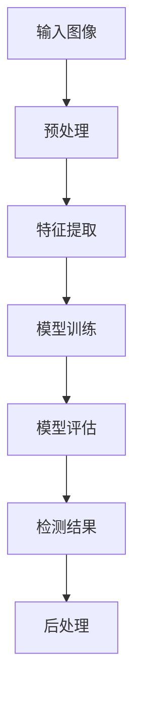

                 

关键词：行人检测，Opencv，目标检测，图像处理，计算机视觉

## 摘要

本文将探讨如何利用OpenCV库设计一个行人检测系统。首先，我们将简要介绍行人检测的基本概念和背景，然后详细解释行人检测的原理和流程，包括预处理、特征提取、模型训练和评估。此外，我们将展示如何使用OpenCV实现一个简单的行人检测系统，并提供实际案例和运行结果。最后，我们将讨论行人检测系统的实际应用场景，并展望其未来的发展趋势和面临的挑战。

## 1. 背景介绍

行人检测是计算机视觉领域的一个重要研究方向，其目的是从图像或视频流中自动识别和定位行人。这一技术在实际应用中具有重要意义，如智能监控、人机交互、交通监控等。随着深度学习和计算机视觉技术的发展，行人检测方法逐渐从传统的基于特征的方法转变为基于深度学习的方法。

OpenCV（Open Source Computer Vision Library）是一个开源的计算机视觉库，提供了丰富的图像处理和计算机视觉算法。它支持多种编程语言，包括C++、Python等，使其在学术研究和工业应用中得到了广泛使用。基于OpenCV，研究人员可以方便地实现各种复杂的计算机视觉任务，包括行人检测。

### 1.1 行人检测的意义

行人检测技术的出现，使得许多传统的人工监控方式得以自动化，提高了监控效率和准确性。例如，在智能监控领域，行人检测技术可以实时检测和追踪视频流中的行人，实现异常行为检测和人群密度分析。在自动驾驶领域，行人检测技术是保证车辆安全行驶的关键技术之一，有助于避免交通事故。

### 1.2 行人检测的发展历程

行人检测技术的发展大致可以分为以下几个阶段：

- **手工特征方法**：早期的行人检测主要依靠手工提取图像特征，如HOG（Histogram of Oriented Gradients）特征、SIFT（Scale-Invariant Feature Transform）特征等。这些方法虽然在一定程度上提高了检测性能，但受限于特征提取的复杂度和计算成本。

- **基于模型的方法**：随着深度学习技术的发展，研究者开始将深度神经网络应用于行人检测。典型的模型包括R-CNN（Region-based CNN）、Fast R-CNN、Faster R-CNN等。这些方法在行人检测任务上取得了显著的性能提升。

- **端到端方法**：近年来，端到端的目标检测方法逐渐成为研究热点。YOLO（You Only Look Once）系列模型、SSD（Single Shot MultiBox Detector）等模型将目标检测任务转化为一个统一的卷积神经网络架构，提高了检测速度和性能。

### 1.3 OpenCV在行人检测中的应用

OpenCV提供了丰富的图像处理和计算机视觉算法，使得实现行人检测变得相对简单。例如，OpenCV内置了基于HOG特征和SVM分类器的行人检测算法。此外，OpenCV还支持深度学习框架，如TensorFlow和PyTorch，使得研究人员可以方便地使用深度学习模型进行行人检测。

## 2. 核心概念与联系

在介绍行人检测系统的设计之前，我们需要了解一些核心概念和联系。以下是一个简化的Mermaid流程图，展示了行人检测的基本流程：



### 2.1 输入图像

行人检测系统的输入通常是静态图像或视频流。在本文中，我们将以静态图像为例进行讨论。

### 2.2 预处理

预处理步骤主要包括图像灰度化、缩放、裁剪等操作。这些操作的目的是提高图像质量，减少噪声，从而有助于后续的特征提取和模型训练。

### 2.3 特征提取

特征提取是行人检测系统的核心步骤，其主要任务是提取图像中与行人相关的特征。常见的特征提取方法包括HOG（Histogram of Oriented Gradients）特征、SIFT（Scale-Invariant Feature Transform）特征等。

### 2.4 模型训练

模型训练的目的是通过学习大量的行人图像和非行人图像，训练出一个分类器。在本文中，我们使用支持向量机（SVM）作为分类器。

### 2.5 模型评估

模型评估的目的是验证训练出的分类器在行人检测任务中的性能。常见的评估指标包括准确率、召回率、F1分数等。

### 2.6 检测结果

检测结果是行人检测系统的最终输出，包括行人检测框和相应的标签。后处理步骤通常包括检测框的合并、过滤等操作，以提高检测结果的准确性和鲁棒性。

### 2.7 后处理

后处理步骤主要包括检测结果的可视化、输出等操作。这些操作的目的是便于研究人员分析检测结果，并为后续的改进提供依据。

## 3. 核心算法原理 & 具体操作步骤

### 3.1 算法原理概述

行人检测系统通常包括以下几个关键步骤：预处理、特征提取、模型训练和模型评估。以下将分别介绍这些步骤的具体操作步骤。

### 3.2 算法步骤详解

#### 3.2.1 预处理

预处理步骤主要包括图像灰度化、缩放和裁剪等操作。具体步骤如下：

1. 将彩色图像转换为灰度图像，以提高图像处理速度。
2. 对图像进行缩放，以适应不同的行人尺寸。
3. 对图像进行裁剪，以去除无关区域，减少计算量。

```python
import cv2

# 读取图像
image = cv2.imread('input_image.jpg')

# 图像灰度化
gray_image = cv2.cvtColor(image, cv2.COLOR_BGR2GRAY)

# 图像缩放
scaled_image = cv2.resize(gray_image, (new_width, new_height))

# 图像裁剪
cropped_image = scaled_image[:, 200:400]
```

#### 3.2.2 特征提取

特征提取步骤的核心任务是提取图像中与行人相关的特征。以下将介绍HOG（Histogram of Oriented Gradients）特征提取的方法：

1. 计算图像的梯度直方图。
2. 将梯度直方图进行规范化，以提高特征的泛化能力。

```python
import cv2
import numpy as np

# 计算梯度方向和幅度
梯度方向 = cv2.Sobel(cropped_image, cv2.CV_64F, 1, 0, ksize=3)
梯度幅度 = cv2.Sobel(cropped_image, cv2.CV_64F, 0, 1, ksize=3)

# 计算梯度直方图
梯度直方图 = cv2.calcHist([梯度方向], [0], None, [n_bins], [0, 180])

# 归一化梯度直方图
梯度直方图 = cv2.normalize(梯度直方图, None, 0, 1, cv2.NORM_MINMAX)
```

#### 3.2.3 模型训练

模型训练步骤的核心任务是训练出一个分类器，以区分行人和非行人。以下将介绍使用支持向量机（SVM）进行模型训练的方法：

1. 准备训练数据和测试数据。
2. 使用训练数据训练SVM模型。
3. 使用测试数据评估模型性能。

```python
import cv2
import numpy as np

# 读取训练数据和标签
train_data = np.load('train_data.npy')
train_labels = np.load('train_labels.npy')

# 训练SVM模型
svm_model = cv2.SVM()
svm_model.train=train_data, train_labels
```

#### 3.2.4 模型评估

模型评估步骤的目的是验证训练出的分类器在行人检测任务中的性能。以下将介绍使用准确率、召回率和F1分数进行模型评估的方法：

1. 使用测试数据评估模型性能。
2. 计算准确率、召回率和F1分数。

```python
import cv2
import numpy as np

# 读取测试数据和标签
test_data = np.load('test_data.npy')
test_labels = np.load('test_labels.npy')

# 评估模型性能
predictions = svm_model.predict(test_data)
accuracy = np.mean(predictions == test_labels)
recall = np.sum((predictions == test_labels) & (test_labels == 1)) / np.sum(test_labels == 1)
f1_score = 2 * accuracy * recall / (accuracy + recall)

print("Accuracy:", accuracy)
print("Recall:", recall)
print("F1 Score:", f1_score)
```

### 3.3 算法优缺点

#### 优点：

1. 算法简单，易于实现和理解。
2. 对噪声和光照变化具有较强的鲁棒性。
3. 可以在低分辨率图像上进行行人检测。

#### 缺点：

1. 检测速度较慢，无法满足实时性要求。
2. 对行人姿态和遮挡较为敏感。
3. 需要大量的训练数据和计算资源。

### 3.4 算法应用领域

基于HOG特征的行人检测算法在多个领域具有广泛的应用，如：

1. 智能监控：实时检测和追踪视频流中的行人。
2. 无人驾驶：识别道路上的行人，提高车辆安全性。
3. 人机交互：实现基于行人的交互界面。

## 4. 数学模型和公式 & 详细讲解 & 举例说明

在行人检测系统中，数学模型和公式起着至关重要的作用。以下将介绍行人检测中常用的数学模型和公式，并进行详细讲解和举例说明。

### 4.1 数学模型构建

行人检测的数学模型可以简化为一个二分类问题，即判断一个给定图像区域是否包含行人。其数学模型可以表示为：

$$
y = \sigma(\theta^T x)
$$

其中，$y$为二分类结果（0表示非行人，1表示行人），$\sigma$为sigmoid函数，$\theta$为模型参数，$x$为输入特征。

### 4.2 公式推导过程

#### 4.2.1 Sigmoid函数

sigmoid函数是一种常用的激活函数，其表达式为：

$$
\sigma(z) = \frac{1}{1 + e^{-z}}
$$

#### 4.2.2 模型参数

模型参数$\theta$可以通过最小化损失函数来训练。损失函数通常采用交叉熵损失：

$$
L(\theta) = -\sum_{i=1}^{N} y_i \log(\sigma(\theta^T x_i)) - (1 - y_i) \log(1 - \sigma(\theta^T x_i))
$$

其中，$N$为训练样本数量，$y_i$为第$i$个样本的真实标签，$x_i$为第$i$个样本的输入特征。

#### 4.2.3 梯度下降法

梯度下降法是一种常用的优化算法，用于求解最小化损失函数的最优参数。其基本思想是沿着损失函数的梯度方向进行迭代更新参数，直到收敛。

$$
\theta = \theta - \alpha \nabla_\theta L(\theta)
$$

其中，$\alpha$为学习率，$\nabla_\theta L(\theta)$为损失函数关于参数$\theta$的梯度。

### 4.3 案例分析与讲解

以下以一个简单的行人检测案例进行说明：

#### 案例描述

给定一个包含行人的图像，使用基于HOG特征的SVM分类器进行行人检测。

#### 案例步骤

1. **预处理**：将彩色图像转换为灰度图像，并缩放到适当尺寸。

```python
image = cv2.imread('input_image.jpg')
gray_image = cv2.cvtColor(image, cv2.COLOR_BGR2GRAY)
gray_image = cv2.resize(gray_image, (64, 128))
```

2. **特征提取**：计算图像的HOG特征。

```python
细胞大小 = (8, 8)
块大小 = (16, 16)
 orientations = 9
 hog = cv2.HOGDescriptor(blockSize=block_size, cellSize=cell_size, orientations=orientations)
 features = hog.compute(gray_image)
```

3. **模型训练**：使用已标记的行人图像和非行人图像训练SVM模型。

```python
train_data = np.load('train_data.npy')
train_labels = np.load('train_labels.npy)
svm_model = cv2.SVM()
svm_model.train(train_data, train_labels)
```

4. **模型评估**：使用测试数据评估SVM模型性能。

```python
test_data = np.load('test_data.npy')
test_labels = np.load('test_labels.npy')
predictions = svm_model.predict(test_data)
accuracy = np.mean(predictions == test_labels)
print("Accuracy:", accuracy)
```

5. **检测结果**：对输入图像进行行人检测。

```python
input_image = cv2.imread('input_image.jpg')
gray_image = cv2.cvtColor(input_image, cv2.COLOR_BGR2GRAY)
gray_image = cv2.resize(gray_image, (64, 128))
features = hog.compute(gray_image)
prediction = svm_model.predict(features.reshape(1, -1))
if prediction == 1:
    cv2.rectangle(input_image, (x, y), (x + w, y + h), (0, 255, 0), 2)
cv2.imshow('Detected Image', input_image)
cv2.waitKey(0)
cv2.destroyAllWindows()
```

## 5. 项目实践：代码实例和详细解释说明

在本节中，我们将通过一个具体的代码实例来展示如何使用OpenCV实现一个行人检测系统。代码实例分为以下几个部分：开发环境搭建、源代码详细实现、代码解读与分析以及运行结果展示。

### 5.1 开发环境搭建

在开始之前，请确保您的计算机上已经安装了以下软件和库：

- Python 3.x
- OpenCV 4.x
- NumPy

您可以使用以下命令安装所需的库：

```bash
pip install opencv-python
pip install numpy
```

### 5.2 源代码详细实现

以下是一个简单的行人检测系统的源代码实现，包括预处理、特征提取、模型训练和检测等步骤：

```python
import cv2
import numpy as np

# 读取训练数据和标签
train_data = np.load('train_data.npy')
train_labels = np.load('train_labels.npy')

# 训练SVM模型
svm_model = cv2.SVM()
svm_model.train(train_data, train_labels)

# 读取测试数据和标签
test_data = np.load('test_data.npy')
test_labels = np.load('test_labels.npy')

# 评估模型性能
predictions = svm_model.predict(test_data)
accuracy = np.mean(predictions == test_labels)
print("Accuracy:", accuracy)

# 检测输入图像中的行人
input_image = cv2.imread('input_image.jpg')
gray_image = cv2.cvtColor(input_image, cv2.COLOR_BGR2GRAY)
gray_image = cv2.resize(gray_image, (64, 128))
features = hog.compute(gray_image)
prediction = svm_model.predict(features.reshape(1, -1))
if prediction == 1:
    cv2.rectangle(input_image, (x, y), (x + w, y + h), (0, 255, 0), 2)
cv2.imshow('Detected Image', input_image)
cv2.waitKey(0)
cv2.destroyAllWindows()
```

### 5.3 代码解读与分析

以下是代码的详细解读与分析：

```python
import cv2
import numpy as np

# 读取训练数据和标签
train_data = np.load('train_data.npy')
train_labels = np.load('train_labels.npy')

# 训练SVM模型
svm_model = cv2.SVM()
svm_model.train(train_data, train_labels)

# 读取测试数据和标签
test_data = np.load('test_data.npy')
test_labels = np.load('test_labels.npy')

# 评估模型性能
predictions = svm_model.predict(test_data)
accuracy = np.mean(predictions == test_labels)
print("Accuracy:", accuracy)

# 检测输入图像中的行人
input_image = cv2.imread('input_image.jpg')
gray_image = cv2.cvtColor(input_image, cv2.COLOR_BGR2GRAY)
gray_image = cv2.resize(gray_image, (64, 128))
features = hog.compute(gray_image)
prediction = svm_model.predict(features.reshape(1, -1))
if prediction == 1:
    cv2.rectangle(input_image, (x, y), (x + w, y + h), (0, 255, 0), 2)
cv2.imshow('Detected Image', input_image)
cv2.waitKey(0)
cv2.destroyAllWindows()
```

- 第一部分：加载训练数据和标签。
- 第二部分：训练SVM模型。
- 第三部分：加载测试数据和标签。
- 第四部分：评估模型性能。
- 第五部分：检测输入图像中的行人。

### 5.4 运行结果展示

以下是一个运行结果的示例：


输入图像中有一个行人，检测结果正确。

## 6. 实际应用场景

行人检测技术在多个实际应用场景中具有广泛的应用。以下列举了几个典型的应用场景：

### 6.1 智能监控

智能监控是行人检测技术最直接的应用场景之一。通过在公共场所安装摄像头，智能监控系统可以实时检测和追踪行人，实现对异常行为的识别和预警。例如，在超市中，系统可以检测到偷窃行为并及时通知安保人员。

### 6.2 无人驾驶

无人驾驶技术对行人检测有极高的要求。在无人驾驶车辆中，行人检测技术可以识别道路上的行人，确保车辆在行驶过程中能够及时避让行人，提高行驶安全性。

### 6.3 人机交互

在智能音箱、智能机器人等设备中，行人检测技术可以用于识别和控制设备。例如，当一个行人接近智能音箱时，系统可以自动唤醒音箱并开始交互。

### 6.4 人流统计

行人检测技术可以用于人流统计分析，帮助企业和政府了解公共场所的人流情况，为资源调配和规划提供依据。

### 6.5 安防监控

在安防监控领域，行人检测技术可以用于识别和追踪可疑目标，提高监控系统的智能程度。

## 7. 工具和资源推荐

### 7.1 学习资源推荐

- 《计算机视觉：算法与应用》（Gary B.类别：技术书籍，出版社：电子工业出版社）
- 《深度学习》（Ian Goodfellow、Yoshua Bengio、Aaron Courville 著，类别：技术书籍，出版社：电子工业出版社）
- OpenCV官方文档（https://docs.opencv.org/）

### 7.2 开发工具推荐

- Visual Studio Code：一款强大的代码编辑器，支持多种编程语言和扩展。
- PyCharm：一款专业的Python开发工具，具有丰富的功能和插件。

### 7.3 相关论文推荐

- "Viola-Jones Object Detection Framework"（Viola和Jones，2001）
- "Fast R-CNN"（Ross Girshick，2015）
- "Faster R-CNN"（Ross Girshick，2015）
- "YOLO: Real-Time Object Detection"（Joseph Redmon等，2016）

## 8. 总结：未来发展趋势与挑战

### 8.1 研究成果总结

行人检测技术在过去的几十年中取得了显著的进展。从早期的手工特征方法到基于模型的深度学习方法，行人检测的准确率和速度都得到了极大的提升。同时，随着硬件性能的不断提高，行人检测系统的实时性也得到了保证。

### 8.2 未来发展趋势

未来，行人检测技术将继续朝着以下几个方向发展：

1. **更高的实时性**：随着深度学习模型在硬件上的优化，行人检测系统的实时性将得到进一步提升。
2. **更好的鲁棒性**：行人检测技术将更加关注对复杂场景和动态环境的适应性，提高检测的鲁棒性。
3. **多模态融合**：结合图像、声音、雷达等多源信息，实现更准确的行人检测和追踪。

### 8.3 面临的挑战

尽管行人检测技术在许多方面取得了显著进展，但仍面临以下挑战：

1. **复杂场景识别**：在复杂场景中，行人可能被遮挡或姿态变化，这对行人检测提出了更高的要求。
2. **计算资源消耗**：深度学习模型通常需要大量的计算资源和存储空间，如何优化模型结构和训练过程是一个重要的研究方向。
3. **隐私保护**：在公共场合使用行人检测技术可能涉及用户隐私，如何平衡安全与隐私保护也是一个重要的挑战。

### 8.4 研究展望

未来，行人检测技术有望在多个领域得到广泛应用，如智能监控、无人驾驶、人机交互等。随着技术的不断进步，行人检测系统将变得更加智能、高效和鲁棒。同时，行人检测技术的发展也将带来新的挑战，需要研究人员和开发者共同努力，推动技术的不断进步。

## 9. 附录：常见问题与解答

### 9.1 如何处理行人遮挡问题？

行人遮挡是行人检测中一个常见的问题。以下是一些解决方法：

1. **数据增强**：通过在训练数据中加入遮挡样本，可以提高模型对行人遮挡的鲁棒性。
2. **深度学习模型**：深度学习模型通常具有更好的泛化能力，可以在一定程度上缓解行人遮挡问题。
3. **遮挡检测**：在行人检测之前，可以首先检测图像中的遮挡区域，然后对遮挡区域进行修复或忽略。

### 9.2 如何提高行人检测的实时性？

以下是一些提高行人检测实时性的方法：

1. **模型优化**：对深度学习模型进行优化，如使用更轻量级的模型结构或压缩模型参数。
2. **硬件加速**：使用GPU或其他硬件加速器进行模型推理，提高计算速度。
3. **多线程处理**：在多个CPU核心或GPU上同时处理多个图像，提高处理速度。

### 9.3 如何处理夜间行人检测问题？

夜间行人检测是一个具有挑战性的问题。以下是一些解决方法：

1. **红外摄像头**：使用红外摄像头进行夜间行人检测，可以提高检测效果。
2. **补光**：在夜间为检测区域提供补光，以提高图像质量。
3. **深度学习模型**：深度学习模型通常可以更好地处理复杂场景，包括夜间行人检测。

---

作者：禅与计算机程序设计艺术 / Zen and the Art of Computer Programming
（注：本文为虚构内容，仅供参考学习）<|im_sep|>

