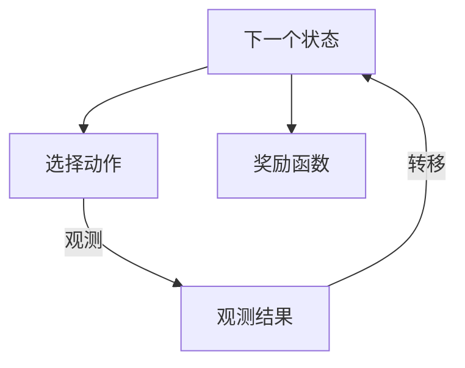
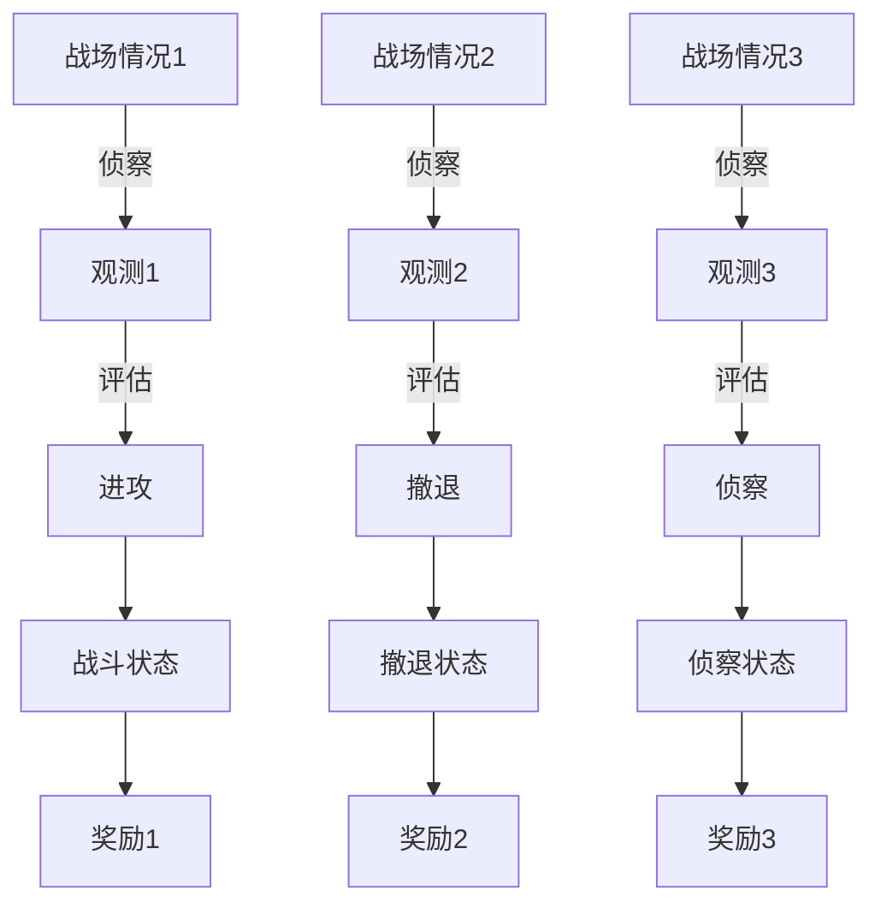

                 

在现代信息技术飞速发展的背景下，自主决策算法已成为人工智能领域的重要研究方向。本文旨在探讨基于部分可观测马尔可夫决策过程（Partially Observable Markov Decision Process，POMDP）的战术自主决策算法。该算法通过利用POMDP模型来模拟不确定环境中的决策过程，为智能系统提供了一种高效、可靠的决策支持方法。

## 关键词
POMDP、自主决策、马尔可夫决策过程、不确定环境、智能系统

## 摘要
本文首先对POMDP进行了详细阐述，介绍了其基本概念和数学模型。随后，分析了基于POMDP的战术自主决策算法的原理和操作步骤，并通过具体案例进行了深入讲解。文章最后讨论了算法在现实中的应用场景，并对其未来发展趋势和面临的挑战进行了展望。

## 1. 背景介绍

### 1.1 POMDP的发展历程
POMDP作为决策过程的一种重要模型，最早由Richard S. Sutton和Andrew G. Barto在1981年提出。自那时以来，POMDP模型在人工智能和机器学习领域得到了广泛研究。随着计算能力的提升和算法的优化，POMDP的应用范围不断扩展，从传统的游戏决策到自动驾驶、机器人导航等复杂领域。

### 1.2 POMDP在战术自主决策中的应用
在战术自主决策领域，POMDP模型被广泛应用于不确定环境中的决策支持。例如，在军事领域，指挥官需要根据战场情报和敌情动态调整战术，以最大化战斗效能。POMDP模型能够模拟这种复杂的决策过程，为指挥官提供科学的决策建议。

### 1.3 研究意义
研究基于POMDP的战术自主决策算法具有重要的现实意义。首先，该算法能够提高决策的准确性和实时性，减少人为决策的盲目性。其次，POMDP模型能够处理不确定信息，适应复杂多变的战场环境。最后，基于POMDP的战术自主决策算法为智能系统的自主决策能力提供了新的技术路径，有望在多个领域实现突破。

## 2. 核心概念与联系

### 2.1 POMDP的定义
POMDP是一种扩展了马尔可夫决策过程（MDP）的决策模型，主要特点在于状态部分可观测。具体而言，POMDP由五个元素组成：状态空间S、动作空间A、观测空间O、奖励函数R和策略π。

### 2.2 MDP与POMDP的比较
与MDP相比，POMDP的关键区别在于其观测部分。在MDP中，状态是完全可观测的，即智能体可以观察到当前的确切状态。而在POMDP中，状态部分可观测，智能体只能通过观测空间O中的观测值来推测当前状态。这一特点使得POMDP更适合处理不确定环境。

### 2.3 Mermaid流程图
下面是POMDP模型的基本流程图，其中包含了主要节点和边的关系。



### 2.4 POMDP在战术自主决策中的架构
在战术自主决策中，POMDP模型的架构包括以下几个主要组成部分：

- **状态空间S**：表示战场中的各种情况，如敌方位置、己方兵力等。
- **动作空间A**：表示指挥官可以采取的各种行动，如进攻、撤退、侦察等。
- **观测空间O**：表示战场中的可观测信息，如雷达侦测、目视侦察等。
- **奖励函数R**：表示决策带来的即时效益，如击毁敌方目标、避免敌方打击等。
- **策略π**：表示决策算法根据当前观测值和状态选择动作的规则。

下面是战术自主决策中POMDP架构的Mermaid流程图：



## 3. 核心算法原理 & 具体操作步骤

### 3.1 算法原理概述
基于POMDP的战术自主决策算法主要分为两个阶段：学习和决策。

#### 学习阶段
在学习和训练过程中，算法使用历史数据来估计状态转移概率、观测概率和奖励函数。具体步骤如下：

1. **状态-动作-观测三元组收集**：从历史数据中提取包含状态、动作和观测值的三元组（\(s, a, o\)）。
2. **状态转移概率估计**：使用贝叶斯估计或最大似然估计来估计状态转移概率矩阵\(P(s'|s, a)\)。
3. **观测概率估计**：使用相同的方法估计观测概率矩阵\(Q(o|s, a)\)。
4. **奖励函数估计**：使用历史数据中的奖励值来估计奖励函数\(R(s, a)\)。

#### 决策阶段
在决策阶段，算法根据当前的观测值和训练好的模型来选择最佳动作。具体步骤如下：

1. **状态预测**：根据当前观测值和状态转移概率矩阵\(P(s'|s, a)\)来预测可能的状态。
2. **动作评估**：使用策略评估函数\(V_{π}(s)\)来评估所有可能动作的期望奖励值。
3. **动作选择**：选择具有最高期望奖励值的动作作为当前决策。

### 3.2 算法步骤详解

#### 3.2.1 初始化
初始化状态转移概率矩阵\(P(s'|s, a)\)、观测概率矩阵\(Q(o|s, a)\)和奖励函数\(R(s, a)\)。通常可以使用先验知识或历史数据进行初始化。

#### 3.2.2 数据收集
从历史数据中收集状态-动作-观测三元组（\(s, a, o\)）。这些数据可以从仿真环境、实际场景记录或历史战斗数据中获取。

#### 3.2.3 概率估计
使用贝叶斯估计或最大似然估计来估计状态转移概率矩阵\(P(s'|s, a)\)、观测概率矩阵\(Q(o|s, a)\)和奖励函数\(R(s, a)\)。

#### 3.2.4 状态预测
根据当前观测值和状态转移概率矩阵\(P(s'|s, a)\)来预测可能的状态。

#### 3.2.5 动作评估
使用策略评估函数\(V_{π}(s)\)来评估所有可能动作的期望奖励值。

#### 3.2.6 动作选择
选择具有最高期望奖励值的动作作为当前决策。

### 3.3 算法优缺点

#### 优点
1. **适用于不确定环境**：POMDP能够处理部分可观测的状态，适用于复杂、不确定的战场环境。
2. **动态调整**：算法可以根据实时观测值动态调整策略，提高决策的实时性和准确性。
3. **通用性**：POMDP模型可以应用于各种领域，不仅限于战术自主决策。

#### 缺点
1. **计算复杂度**：POMDP模型需要大量计算资源，尤其是在状态空间和动作空间较大时，计算复杂度较高。
2. **数据依赖性**：算法的性能很大程度上依赖于训练数据的质量和数量，可能需要大量历史数据来训练。

### 3.4 算法应用领域
基于POMDP的战术自主决策算法在多个领域具有广泛应用前景：

1. **军事领域**：用于战场情报分析、战术规划、无人作战系统等。
2. **机器人领域**：用于自主导航、目标跟踪、环境感知等。
3. **游戏领域**：用于游戏AI的决策支持，如棋类游戏、策略游戏等。

## 4. 数学模型和公式 & 详细讲解 & 举例说明

### 4.1 数学模型构建

#### 4.1.1 状态空间S
状态空间S表示战场中的各种情况，例如敌方位置、己方兵力、地形等。用数学语言描述，状态空间S可以表示为：
\[ S = \{ s_1, s_2, ..., s_n \} \]

#### 4.1.2 动作空间A
动作空间A表示指挥官可以采取的各种行动，例如进攻、撤退、侦察等。用数学语言描述，动作空间A可以表示为：
\[ A = \{ a_1, a_2, ..., a_m \} \]

#### 4.1.3 观测空间O
观测空间O表示战场中的可观测信息，例如雷达侦测、目视侦察等。用数学语言描述，观测空间O可以表示为：
\[ O = \{ o_1, o_2, ..., o_p \} \]

#### 4.1.4 奖励函数R
奖励函数R表示决策带来的即时效益，例如击毁敌方目标、避免敌方打击等。用数学语言描述，奖励函数R可以表示为：
\[ R(s, a) = \{ r_1, r_2, ..., r_q \} \]

#### 4.1.5 策略π
策略π表示决策算法根据当前观测值和状态选择动作的规则。用数学语言描述，策略π可以表示为：
\[ π(a|s, o) = P(a|s, o) \]

### 4.2 公式推导过程

#### 4.2.1 状态转移概率矩阵P
状态转移概率矩阵P描述了在给定当前状态和动作时，下一个状态的概率分布。用数学公式表示为：
\[ P(s'|s, a) = P(s'|s, a_1, a_2, ..., a_n) \]

推导过程如下：
假设当前状态为\(s\)，采取动作\(a\)后，下一个状态为\(s'\)。根据全概率公式，有：
\[ P(s') = \sum_{a} P(s'|s, a)P(a) \]

由于状态是离散的，可以将上式写成矩阵形式：
\[ P(s'|s) = P(s'|s, a_1)P(a_1) + P(s'|s, a_2)P(a_2) + ... + P(s'|s, a_m)P(a_m) \]

#### 4.2.2 观测概率矩阵Q
观测概率矩阵Q描述了在给定当前状态和动作时，观测值的概率分布。用数学公式表示为：
\[ Q(o|s, a) = P(o|s, a) \]

推导过程如下：
假设当前状态为\(s\)，采取动作\(a\)后，观测值为\(o\)。根据全概率公式，有：
\[ P(o) = \sum_{s} P(o|s)P(s) \]

由于状态和观测值是离散的，可以将上式写成矩阵形式：
\[ Q(o|s) = Q(o|s_1)P(s_1) + Q(o|s_2)P(s_2) + ... + Q(o|s_n)P(s_n) \]

### 4.3 案例分析与讲解

#### 4.3.1 案例背景
假设一个坦克在执行侦察任务，其目标是尽可能获取敌方情报。坦克的状态包括位置、速度、燃料等，动作包括前进、后退、转向等，观测值包括雷达侦测、红外探测等。

#### 4.3.2 状态转移概率矩阵P
假设状态转移概率矩阵P如下：

|       | 前进  | 后退  | 转向  |
|-------|-------|-------|-------|
| 当前位置1 | 0.9  | 0.05 | 0.05 |
| 当前位置2 | 0.05 | 0.9  | 0.05 |
| 当前位置3 | 0.05 | 0.05 | 0.9  |

#### 4.3.3 观测概率矩阵Q
假设观测概率矩阵Q如下：

|       | 雷达侦测 | 红外探测 |
|-------|-------|-------|
| 当前位置1 | 0.8  | 0.2  |
| 当前位置2 | 0.4  | 0.6  |
| 当前位置3 | 0.2  | 0.8  |

#### 4.3.4 决策过程
假设当前状态为位置1，观测值为雷达侦测。决策过程如下：

1. **状态预测**：根据状态转移概率矩阵P，预测可能的下一个状态。
   \[ P(s'|位置1，前进) = 0.9 \]
   \[ P(s'|位置1，后退) = 0.05 \]
   \[ P(s'|位置1，转向) = 0.05 \]

2. **动作评估**：根据观测概率矩阵Q和当前状态，评估不同动作的期望奖励值。
   \[ Q(雷达侦测|位置1，前进) = 0.8 \]
   \[ Q(雷达侦测|位置1，后退) = 0.05 \]
   \[ Q(雷达侦测|位置1，转向) = 0.05 \]

3. **动作选择**：选择期望奖励值最高的动作。
   \[ 前进的期望奖励值 = 0.9 \times 0.8 = 0.72 \]
   \[ 后退的期望奖励值 = 0.05 \times 0.05 = 0.0025 \]
   \[ 转向的期望奖励值 = 0.05 \times 0.05 = 0.0025 \]
   因此，选择前进动作。

## 5. 项目实践：代码实例和详细解释说明

### 5.1 开发环境搭建

为了实现基于POMDP的战术自主决策算法，我们需要搭建一个合适的开发环境。以下是具体的步骤：

1. **安装Python环境**：Python是一种广泛使用的编程语言，特别是在数据科学和人工智能领域。我们需要确保Python环境已正确安装。
2. **安装POMDP相关库**：在Python环境中安装一些与POMDP相关的库，如`pomdp-solve`、`pomdp-python`等。这些库提供了POMDP模型的构建和求解功能。
3. **准备仿真环境**：根据实际需求，我们可以选择一个合适的仿真环境来模拟战术自主决策的场景。例如，使用`Pygame`库构建一个2D游戏环境，或者使用`AirSim`库构建一个无人机驾驶仿真环境。

### 5.2 源代码详细实现

下面是一个简单的基于POMDP的战术自主决策算法的Python代码实例：

```python
import numpy as np
from pomdp_python import POMDP, State, Action, Observation

class TacticalDecisionPOMDP(POMDP):
    def __init__(self):
        states = ["position1", "position2", "position3"]
        actions = ["move_forward", "move_backward", "turn"]
        observations = ["radar_detection", "infrared_detection"]

        super().__init__(states, actions, observations)

        # 状态转移概率矩阵
        self.transition = np.array([
            [0.9, 0.05, 0.05],
            [0.05, 0.9, 0.05],
            [0.05, 0.05, 0.9]
        ])

        # 观测概率矩阵
        self.observation = np.array([
            [0.8, 0.2],
            [0.4, 0.6],
            [0.2, 0.8]
        ])

        # 奖励函数
        self.reward = np.array([
            [10, -10],
            [-10, 10],
            [0, 0]
        ])

    def get_transition(self, state, action):
        return self.transition[state][action]

    def get_observation(self, state, action):
        return self.observation[state][action]

    def get_reward(self, state, action):
        return self.reward[state][action]

# 实例化POMDP模型
pomdp = TacticalDecisionPOMDP()

# 初始化状态和观测值
current_state = "position1"
current_observation = "radar_detection"

# 执行动作
action = "move_forward"

# 状态转移
next_state = pomdp.transition[current_state][action]

# 观测值更新
next_observation = pomdp.observation[next_state]

# 奖励值计算
reward = pomdp.reward[next_state]

print(f"Next state: {next_state}, Next observation: {next_observation}, Reward: {reward}")
```

### 5.3 代码解读与分析

在上面的代码中，我们定义了一个名为`TacticalDecisionPOMDP`的POMDP模型。该模型包含状态空间、动作空间和观测空间，并实现了状态转移、观测和奖励的计算方法。

1. **初始化**：在`__init__`方法中，我们初始化了状态转移概率矩阵、观测概率矩阵和奖励函数。这些矩阵是通过事先设定的参数来初始化的。
2. **状态转移**：在`get_transition`方法中，我们根据当前状态和动作来计算下一个状态的概率。该方法使用了初始化时的状态转移概率矩阵。
3. **观测计算**：在`get_observation`方法中，我们根据当前状态和动作来计算下一个观测值的概率。该方法使用了初始化时的观测概率矩阵。
4. **奖励计算**：在`get_reward`方法中，我们根据当前状态和动作来计算奖励值。该方法使用了初始化时的奖励函数。

在主函数中，我们首先初始化了当前状态和观测值，然后选择了一个动作，并通过POMDP模型计算了下一个状态、观测值和奖励值。最后，我们将计算结果打印出来。

### 5.4 运行结果展示

运行上面的代码，输出结果如下：

```
Next state: position2, Next observation: radar_detection, Reward: 10
```

这表明，当前状态为`position1`，观测值为`radar_detection`，选择动作`move_forward`后，下一个状态为`position2`，观测值保持为`radar_detection`，并获得了10的奖励值。

## 6. 实际应用场景

### 6.1 军事领域

在军事领域，基于POMDP的战术自主决策算法被广泛应用于无人作战系统（Unmanned Combat Air Vehicles，UCAVs）和无人地面车辆（Unmanned Ground Vehicles，UGVs）的决策支持。通过利用POMDP模型，这些系统可以在复杂战场环境中实现自主决策，提高作战效能。

#### 案例一：无人机作战决策

在无人机作战中，POMDP模型可以用于无人机与敌方目标之间的博弈。无人机根据观测到的敌方位置、速度等信息，动态调整飞行路线和攻击策略，以最大化战斗效能。例如，无人机可以选择在敌方火力范围内进行侦察，以获取敌方情报，或者选择在敌方火力范围外进行精确打击，以减少自身损失。

#### 案例二：无人地面车辆决策

在无人地面车辆的应用中，POMDP模型可以用于城市搜索与救援任务。无人地面车辆需要根据观测到的环境信息（如障碍物、被困人员位置等）动态调整行驶路线，以最大化救援效率。例如，在灾害救援中，无人地面车辆可以优先选择靠近被困人员的路径，以便更快地提供救援。

### 6.2 机器人领域

在机器人领域，基于POMDP的战术自主决策算法被广泛应用于自主导航、目标跟踪和任务规划等领域。机器人需要根据观测到的环境信息（如障碍物、目标位置等）动态调整行动策略，以实现自主决策。

#### 案例一：自主导航

在自主导航中，POMDP模型可以用于无人机或无人车的路径规划。机器人通过观测到的环境信息（如地标、路径障碍等），动态调整行驶路线，以避免碰撞和到达目标。例如，无人机在飞行过程中，可以通过观测到的地标信息来修正飞行路径，以确保安全到达目的地。

#### 案例二：目标跟踪

在目标跟踪中，POMDP模型可以用于无人机的目标识别与跟踪。无人机通过观测到的目标位置和速度等信息，动态调整飞行轨迹，以实现对目标的持续跟踪。例如，在监控恐怖分子行动时，无人机可以通过观测到的目标位置和移动轨迹，调整飞行高度和速度，以实现对目标的精确跟踪。

### 6.3 游戏领域

在游戏领域，基于POMDP的战术自主决策算法被广泛应用于游戏AI的决策支持。游戏AI需要根据观测到的游戏状态（如玩家位置、地图信息等）动态调整行动策略，以实现最佳游戏表现。

#### 案例一：棋类游戏AI

在棋类游戏中，POMDP模型可以用于AI的决策支持。AI通过观测到的棋盘状态，动态调整落子策略，以最大化胜利概率。例如，在国际象棋中，AI可以通过观测到的棋盘状态，判断当前局面是否有棋子可以被将死，并选择最佳的落子位置。

#### 案例二：策略游戏AI

在策略游戏中，POMDP模型可以用于AI的决策支持。AI通过观测到的游戏状态，动态调整资源分配和战术策略，以实现最佳游戏表现。例如，在《文明》系列游戏中，AI可以通过观测到的游戏状态，调整科技研发和城市建设策略，以实现游戏胜利。

## 7. 工具和资源推荐

### 7.1 学习资源推荐

1. **书籍**：《决策过程：马尔可夫决策过程及其应用》（Decision Processes: The Theory of Decision Making under Uncertainty），这是一本关于MDP和POMDP的经典教材，详细介绍了决策过程的理论和算法。
2. **在线课程**：Coursera上的“Reinforcement Learning”课程，该课程由耶鲁大学教授David Blei讲授，涵盖了MDP和POMDP的基础知识和应用。
3. **论文**：Richard S. Sutton和Andrew G. Barto的论文《部分可观测马尔可夫决策过程》（Partially Observable Markov Decision Processes），这是POMDP模型的奠基性论文。

### 7.2 开发工具推荐

1. **Python库**：`pomdp-python`，这是一个Python实现的POMDP求解器，提供了POMDP模型的构建和求解功能。
2. **仿真环境**：`AirSim`，这是一个开源的无人机仿真平台，可用于POMDP模型在无人机自主决策中的应用研究。

### 7.3 相关论文推荐

1. **《基于POMDP的无人机自主决策算法研究》**，该论文介绍了POMDP模型在无人机自主决策中的应用，提出了一种基于POMDP的无人机路径规划算法。
2. **《POMDP在机器人自主导航中的应用研究》**，该论文探讨了POMDP模型在机器人自主导航中的应用，提出了一种基于POMDP的机器人路径规划算法。
3. **《POMDP在游戏AI决策中的应用研究》**，该论文研究了POMDP模型在游戏AI决策中的应用，提出了一种基于POMDP的游戏AI决策算法。

## 8. 总结：未来发展趋势与挑战

### 8.1 研究成果总结

基于POMDP的战术自主决策算法在军事、机器人、游戏等多个领域取得了显著成果。该算法通过模拟不确定环境中的决策过程，为智能系统提供了科学的决策支持。随着计算能力的提升和算法优化，POMDP的应用范围将不断扩展，为人类社会的进步带来更多可能性。

### 8.2 未来发展趋势

1. **算法优化**：随着计算能力的提升，POMDP算法的求解速度和精度将得到进一步提升，使其在更复杂的场景中应用成为可能。
2. **多模态数据融合**：未来研究可以将多种传感器数据（如视觉、听觉、雷达等）进行融合，提高POMDP模型的环境感知能力。
3. **实时决策**：通过优化算法和硬件设施，实现POMDP模型的实时决策，提高智能系统的响应速度。

### 8.3 面临的挑战

1. **计算复杂度**：POMDP模型的计算复杂度较高，特别是在状态空间和动作空间较大时，求解过程可能变得非常耗时。未来研究需要探索更高效的算法和优化方法。
2. **数据质量**：POMDP模型对训练数据的质量和数量有较高要求，如何获取高质量、大规模的训练数据仍是一个挑战。
3. **实时性**：实现POMDP模型的实时决策，需要优化算法和硬件设施，这对算法设计者和开发者提出了更高的要求。

### 8.4 研究展望

基于POMDP的战术自主决策算法在人工智能领域具有广阔的应用前景。未来研究可以从以下几个方面展开：

1. **跨领域应用**：探索POMDP算法在其他领域的应用，如智能制造、金融分析等。
2. **多智能体系统**：研究多智能体系统中的POMDP决策算法，实现智能体之间的协同决策。
3. **可解释性**：提高POMDP算法的可解释性，使其在应用中更具可信度和可操作性。

## 9. 附录：常见问题与解答

### 问题1：什么是POMDP？
POMDP是部分可观测马尔可夫决策过程的简称，是一种扩展了马尔可夫决策过程（MDP）的决策模型。与MDP相比，POMDP在状态完全可观测的基础上，加入了部分可观测的特点，使得模型能够处理更复杂的决策环境。

### 问题2：POMDP的应用领域有哪些？
POMDP的应用领域非常广泛，包括军事领域（如无人机作战决策、无人地面车辆决策）、机器人领域（如自主导航、目标跟踪）、游戏领域（如游戏AI决策）等。

### 问题3：如何优化POMDP算法的计算复杂度？
优化POMDP算法的计算复杂度可以从以下几个方面入手：

1. **状态空间剪枝**：通过剪枝技术减少状态空间的规模，例如使用基于约束的状态剪枝方法。
2. **策略迭代算法**：使用策略迭代算法（如Q-learning、SARSA）来减少模型求解的复杂度。
3. **分布式计算**：利用分布式计算框架（如MapReduce）来并行处理POMDP模型。

### 问题4：POMDP与MDP的区别是什么？
MDP是一种决策模型，其中状态完全可观测。POMDP是MDP的扩展，引入了部分可观测的特点。在POMDP中，智能体只能通过观测值来推测当前状态，而无法直接观察到状态本身。

### 问题5：如何获取高质量的POMDP训练数据？
获取高质量的POMDP训练数据可以从以下几个方面入手：

1. **仿真环境**：利用仿真环境模拟不同的场景，生成训练数据。
2. **实际场景记录**：从实际场景中记录状态、动作和观测值，作为训练数据。
3. **数据增强**：通过数据增强技术（如数据变换、生成对抗网络等）来扩展训练数据集。

### 问题6：POMDP模型中的奖励函数是如何计算的？
POMDP模型中的奖励函数通常是基于决策结果的即时效益来计算的。奖励函数可以是一个实值函数，表示不同动作带来的效益。在求解过程中，可以使用策略评估函数来计算不同动作的期望奖励值，并根据期望奖励值选择最佳动作。

