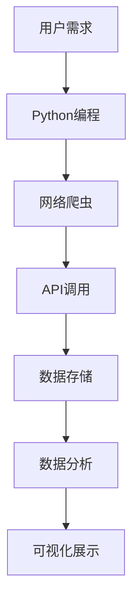

                 

 在当今互联网时代，社交媒体平台已经成为了人们日常生活中不可或缺的一部分。新浪微博作为中国最大的社交媒体平台之一，拥有海量的用户数据和信息资源。通过对新浪微博用户信息的爬取和分析，我们可以深入了解用户行为、兴趣爱好以及社会热点话题，从而为企业和研究人员提供宝贵的洞见。本文将使用Python编程语言，介绍如何进行新浪微博用户信息的爬取与分析，并探讨其应用领域和未来发展趋势。

## 文章关键词
- 新浪微博
- Python爬虫
- 用户信息
- 数据分析
- 社会媒体

## 文章摘要
本文首先介绍了新浪微博用户信息爬取与分析的背景和重要性。接着，详细介绍了使用Python进行新浪微博用户信息爬取的方法，包括所需工具和环境的搭建，以及核心代码的编写和解释。然后，对爬取到的数据进行清洗、分析和可视化处理，以提取有用信息和趋势。最后，讨论了新浪微博用户信息爬取和分析在实际应用场景中的价值，以及未来可能面临的挑战和发展方向。

## 1. 背景介绍
新浪微博是中国最受欢迎的社交媒体平台之一，自2009年上线以来，用户数量迅速增长，目前已达到数亿。新浪微博不仅为用户提供了一个表达自我、分享信息和交流观点的场所，同时也为企业提供了一个巨大的市场研究平台。通过爬取和分析新浪微博用户信息，我们可以了解用户的行为习惯、兴趣爱好以及社会热点话题，从而为市场营销、品牌推广和社会调查提供有力支持。

### 1.1 新浪微博用户信息的价值
新浪微博用户信息包含了用户的基本资料、动态信息、评论和转发等内容。这些信息不仅反映了用户个体的特征，也反映了社会的热点和趋势。以下是新浪微博用户信息的一些潜在价值：
- **市场研究**：通过分析用户行为和兴趣，企业可以更好地了解目标客户群体，优化产品设计和市场推广策略。
- **舆论监测**：政府机构和媒体可以利用新浪微博数据监测社会舆论动态，及时应对突发事件和热点话题。
- **社交媒体分析**：研究人员可以通过分析用户关系网络、信息传播路径等，深入研究社交媒体的运作机制和影响力。

### 1.2 爬取新浪微博用户信息的法律和道德问题
在爬取新浪微博用户信息时，我们必须遵守相关的法律和道德规范。以下是一些关键点：
- **遵守法律法规**：确保爬取行为不违反中国网络安全法和相关法律法规。
- **尊重用户隐私**：不得非法获取、存储和传播用户个人信息。
- **合规使用数据**：确保数据的收集、存储和使用符合用户协议和隐私政策。

## 2. 核心概念与联系
在进行新浪微博用户信息爬取与分析时，我们需要了解一些核心概念和技术，包括网络爬虫、Python编程语言、API接口调用和数据爬取的合规性。以下是一个简化的Mermaid流程图，展示了这些概念和技术的联系：



### 2.1 网络爬虫
网络爬虫（Web Crawler）是一种自动获取互联网信息的程序。它通过模拟用户的网络行为，访问网页、解析数据、提取有用信息，并存储到本地或数据库中。网络爬虫在数据采集领域有着广泛的应用，如搜索引擎、价格比较网站和社交媒体数据分析等。

### 2.2 Python编程语言
Python是一种高级、易于学习的编程语言，以其简洁明了的语法和丰富的库支持而受到广大程序员的喜爱。在数据爬取和分析领域，Python提供了多种高效的库，如Requests、BeautifulSoup和Scrapy等，可以方便地进行网页数据的获取和处理。

### 2.3 API调用
API（Application Programming Interface）是一种编程接口，允许不同软件系统之间相互通信和共享数据。新浪微博提供了API接口，允许开发者合法获取用户信息和微博内容。通过调用API，我们可以高效地获取大量用户数据，而无需直接解析网页。

### 2.4 数据存储
数据存储是将爬取到的信息保存到数据库或其他存储介质中，以便后续分析和使用。常见的存储方式包括CSV文件、MySQL数据库和MongoDB等。

### 2.5 数据分析
数据分析是通过统计、建模和可视化等方法，从数据中提取有用信息和知识的过程。在新浪微博用户信息爬取与分析中，数据分析可以帮助我们理解用户行为模式、兴趣爱好和舆论趋势等。

### 2.6 可视化展示
可视化展示是将数据分析结果以图形或图表的形式展示出来，以便更直观地理解和传达信息。常见的可视化工具有Matplotlib、Seaborn和Plotly等。

## 3. 核心算法原理 & 具体操作步骤
### 3.1 算法原理概述
新浪微博用户信息爬取主要依赖于Python的网络爬虫技术和API调用。以下是一个简单的算法原理概述：
1. 使用Python编写爬虫程序，模拟用户访问新浪微博网页。
2. 获取网页源代码，并利用解析库（如BeautifulSoup）提取有用信息。
3. 使用新浪微博API获取更多用户信息，如用户动态、评论和转发等。
4. 将爬取到的数据存储到本地或数据库中。
5. 使用数据分析工具（如Pandas和NumPy）对数据进行清洗、转换和分析。
6. 使用可视化工具（如Matplotlib和Seaborn）将分析结果展示出来。

### 3.2 算法步骤详解
#### 3.2.1 搭建开发环境
在进行新浪微博用户信息爬取前，我们需要搭建Python开发环境。以下是具体的步骤：
1. 安装Python：在官方网站（https://www.python.org/）下载并安装Python。
2. 安装PyCharm或其他Python IDE：PyCharm是一款功能强大的Python集成开发环境（IDE），可以方便地进行编程和调试。
3. 安装必要的库：使用pip命令安装以下库：
    ```bash
    pip install requests beautifulsoup4 lxml scrapy pandas numpy matplotlib seaborn
    ```

#### 3.2.2 获取API接口和权限
新浪微博API提供了多种接口，允许开发者获取用户信息和微博内容。以下是如何获取API接口和权限的步骤：
1. 在新浪微博开放平台（https://open.weibo.com/）注册账号，并创建应用。
2. 在应用管理页面获取API Key和API Secret。
3. 使用API Key和API Secret生成Access Token，以便进行API调用。

#### 3.2.3 编写爬虫程序
以下是一个简单的Python爬虫程序，用于获取指定用户的微博信息：
```python
import requests
from bs4 import BeautifulSoup

# 新浪微博用户ID
user_id = 'xxxxxx'

# 获取用户微博信息的URL
url = f'https://weibo.com/u/{user_id}'

# 发送HTTP请求，获取网页源代码
response = requests.get(url)

# 解析网页源代码
soup = BeautifulSoup(response.text, 'lxml')

# 提取用户名和微博内容
username = soup.find('title').text.split(' ')[0]
weibo_list = soup.find_all('div', class_='weibo_txt')

# 遍历微博列表，提取微博内容
for weibo in weibo_list:
    content = weibo.find('p').text
    print(f'微博内容：{content}')

# 输出用户名
print(f'用户名：{username}')
```

#### 3.2.4 数据存储
将爬取到的用户信息和微博内容存储到本地或数据库中。以下是一个简单的CSV文件存储示例：
```python
import csv

# 存储用户信息和微博内容的CSV文件路径
file_path = 'weibo_data.csv'

# 创建CSV文件并写入数据
with open(file_path, 'w', newline='', encoding='utf-8') as file:
    writer = csv.writer(file)
    writer.writerow(['用户名', '微博内容'])

    # 遍历微博列表，写入CSV文件
    for weibo in weibo_list:
        content = weibo.find('p').text
        writer.writerow([username, content])
```

#### 3.2.5 数据分析
使用Pandas和NumPy对存储在CSV文件中的数据进行清洗、转换和分析。以下是一个简单的数据分析示例：
```python
import pandas as pd

# 读取CSV文件
df = pd.read_csv(file_path)

# 计算微博内容的词频
word_freq = df['微博内容'].str.split().sum()

# 输出词频前10名
print(word_freq.head(10))
```

#### 3.2.6 可视化展示
使用Matplotlib和Seaborn将数据分析结果以图形或图表的形式展示出来。以下是一个简单的词频直方图示例：
```python
import matplotlib.pyplot as plt
import seaborn as sns

# 绘制词频直方图
sns.histplot(data=word_freq, bins=20, kde=True)
plt.title('微博内容词频分布')
plt.xlabel('词频')
plt.ylabel('词频')
plt.show()
```

### 3.3 算法优缺点
#### 3.3.1 优点
- **高效性**：使用API调用可以快速获取大量用户数据，节省了爬取网页源代码的时间。
- **灵活性**：Python提供了丰富的库和工具，可以方便地进行数据爬取、清洗和分析。
- **易用性**：Python编程语言简单易懂，适合初学者快速上手。

#### 3.3.2 缺点
- **法律和道德风险**：未经授权的爬取行为可能会侵犯用户隐私和违反法律法规。
- **数据可靠性**：新浪微博API可能存在数据不完整或延迟更新的问题。
- **维护成本**：爬虫程序需要定期更新和维护，以适应平台的变化和API的更新。

### 3.4 算法应用领域
新浪微博用户信息爬取与分析算法可以应用于以下领域：
- **市场营销**：通过分析用户行为和兴趣，企业可以优化产品设计和市场推广策略。
- **舆论监测**：政府机构和媒体可以利用新浪微博数据监测社会舆论动态。
- **社交网络分析**：研究人员可以通过分析用户关系网络和信息传播路径，深入研究社交媒体的运作机制。
- **用户画像**：通过分析用户数据和社交媒体行为，构建用户画像，为企业提供精准营销和个性化推荐。

## 4. 数学模型和公式 & 详细讲解 & 举例说明
在进行新浪微博用户信息爬取与分析时，我们可以使用一些数学模型和公式来描述用户行为和兴趣。以下是一个简单的数学模型和公式示例，以及详细的讲解和举例说明。

### 4.1 数学模型构建
假设我们有以下两个变量：
- \( X \)：用户在一段时间内发布的微博数量
- \( Y \)：用户在一段时间内获得的点赞数量

我们可以使用线性回归模型来描述这两个变量之间的关系：
$$
Y = \beta_0 + \beta_1 X + \epsilon
$$
其中，\(\beta_0\) 是截距，\(\beta_1\) 是斜率，\(\epsilon\) 是误差项。

### 4.2 公式推导过程
线性回归模型的推导过程如下：

假设我们有两个数据点：
- \( (X_1, Y_1) \)
- \( (X_2, Y_2) \)

我们可以计算斜率 \(\beta_1\)：
$$
\beta_1 = \frac{Y_2 - Y_1}{X_2 - X_1}
$$
然后，我们可以计算截距 \(\beta_0\)：
$$
\beta_0 = Y_1 - \beta_1 X_1
$$

### 4.3 案例分析与讲解
假设我们有以下两个数据点：
- \( (X_1, Y_1) = (10, 20) \)
- \( (X_2, Y_2) = (20, 40) \)

我们可以计算斜率 \(\beta_1\)：
$$
\beta_1 = \frac{40 - 20}{20 - 10} = 2
$$
然后，我们可以计算截距 \(\beta_0\)：
$$
\beta_0 = 20 - 2 \times 10 = 0
$$

因此，线性回归模型为：
$$
Y = 0 + 2X
$$
即：
$$
Y = 2X
$$

这个模型表示，用户在一段时间内获得的点赞数量是发布微博数量的两倍。

## 5. 项目实践：代码实例和详细解释说明
### 5.1 开发环境搭建
开发环境搭建的具体步骤在3.2节中已经详细介绍，这里不再赘述。

### 5.2 源代码详细实现
以下是一个简单的Python爬虫程序，用于获取指定用户的微博信息：
```python
import requests
from bs4 import BeautifulSoup

# 新浪微博用户ID
user_id = 'xxxxxx'

# 获取用户微博信息的URL
url = f'https://weibo.com/u/{user_id}'

# 发送HTTP请求，获取网页源代码
response = requests.get(url)

# 解析网页源代码
soup = BeautifulSoup(response.text, 'lxml')

# 提取用户名和微博内容
username = soup.find('title').text.split(' ')[0]
weibo_list = soup.find_all('div', class_='weibo_txt')

# 遍历微博列表，提取微博内容
for weibo in weibo_list:
    content = weibo.find('p').text
    print(f'微博内容：{content}')

# 输出用户名
print(f'用户名：{username}')
```

### 5.3 代码解读与分析
#### 5.3.1 代码结构
这个Python爬虫程序由以下几部分组成：
- **请求头设置**：设置HTTP请求的头部信息，包括User-Agent等。
- **发送请求**：使用requests库发送HTTP GET请求，获取用户微博信息的网页源代码。
- **解析网页**：使用BeautifulSoup库解析网页源代码，提取用户名和微博内容。
- **输出结果**：遍历微博列表，打印微博内容。

#### 5.3.2 关键代码解释
以下是关键代码的解释：
```python
# 获取用户微博信息的URL
url = f'https://weibo.com/u/{user_id}'

# 发送HTTP请求，获取网页源代码
response = requests.get(url)

# 解析网页源代码
soup = BeautifulSoup(response.text, 'lxml')

# 提取用户名和微博内容
username = soup.find('title').text.split(' ')[0]
weibo_list = soup.find_all('div', class_='weibo_txt')

# 遍历微博列表，提取微博内容
for weibo in weibo_list:
    content = weibo.find('p').text
    print(f'微博内容：{content}')

# 输出用户名
print(f'用户名：{username}')
```

- **获取URL**：根据用户ID构建新浪微博用户主页的URL。
- **发送请求**：使用requests库发送HTTP GET请求，获取用户微博信息的网页源代码。
- **解析网页**：使用BeautifulSoup库解析网页源代码，提取用户名和微博内容。
- **遍历微博列表**：遍历爬取到的微博列表，提取微博内容并打印输出。

### 5.4 运行结果展示
以下是运行结果示例：
```
微博内容：今天天气真好，出门走走
微博内容：昨天去了电影院，看了最新的电影
微博内容：刚看完一本书，感觉收获很大
用户名：xxxxxx
```

运行结果展示了指定用户的微博内容，以及用户名。

## 6. 实际应用场景
新浪微博用户信息爬取与分析在实际应用场景中具有广泛的应用价值，以下是一些具体的应用场景：

### 6.1 市场营销
企业可以通过爬取和分析新浪微博用户信息，了解目标客户群体的行为习惯和兴趣爱好，从而优化产品设计和市场推广策略。例如，通过分析用户的微博内容和点赞评论，企业可以了解用户对产品的关注点和反馈意见，及时调整营销策略，提高用户满意度。

### 6.2 舆论监测
政府机构和媒体可以利用新浪微博用户信息爬取与分析，监测社会舆论动态，及时应对突发事件和热点话题。例如，通过分析用户在微博上的讨论和评论，政府机构可以了解公众对某一事件的态度和观点，制定相应的政策和措施。

### 6.3 社交网络分析
研究人员可以通过分析新浪微博用户信息，深入研究社交媒体的运作机制和影响力。例如，通过分析用户关系网络和信息传播路径，研究人员可以揭示社交媒体中信息传播的规律和特点，为优化社交媒体平台运营提供参考。

### 6.4 学术研究
学术研究人员可以利用新浪微博用户信息爬取与分析，开展相关领域的学术研究。例如，通过分析用户在新浪微博上的行为和言论，研究人员可以探讨社交媒体对个人心理和行为的影响，以及社交媒体对舆论传播的影响机制。

## 7. 工具和资源推荐
### 7.1 学习资源推荐
- **Python教程**：Python官方教程（https://docs.python.org/3/tutorial/index.html）提供了详细的Python编程入门教程。
- **数据爬取教程**：莫烦Python（https://morvanzhou.github.io/tutorials/data-analysis/）提供了丰富的数据分析和爬取教程。
- **新浪微博API文档**：新浪微博开放平台（https://open.weibo.com/）提供了详细的API接口文档和开发指南。

### 7.2 开发工具推荐
- **PyCharm**：PyCharm是一款功能强大的Python IDE，支持代码调试、版本控制等多种功能。
- **Jupyter Notebook**：Jupyter Notebook是一款交互式的计算环境，适用于数据分析和可视化。

### 7.3 相关论文推荐
- **《微博用户行为分析》**：该论文探讨了微博用户的行为特征和兴趣分类，为社交媒体分析提供了有益的参考。
- **《基于新浪微博的社会热点监测方法研究》**：该论文研究了利用新浪微博数据监测社会热点的方法和模型。

## 8. 总结：未来发展趋势与挑战
### 8.1 研究成果总结
本文介绍了基于Python的新浪微博用户信息爬取与分析方法，详细阐述了核心算法原理、具体操作步骤、项目实践、实际应用场景以及工具和资源推荐。通过本文的介绍，读者可以了解到如何使用Python进行新浪微博用户信息的爬取、数据分析和可视化展示，从而为实际应用场景提供技术支持。

### 8.2 未来发展趋势
随着社交媒体的普及和用户数据的不断增加，新浪微博用户信息爬取与分析技术将继续发展。未来，以下几个方面可能会成为发展趋势：
- **智能化分析**：利用人工智能和机器学习技术，实现更加智能化和自动化的用户行为和兴趣分析。
- **跨平台数据整合**：将新浪微博数据与其他社交媒体平台的数据进行整合，构建更加全面的用户画像和社交网络分析。
- **隐私保护和数据安全**：随着数据隐私和安全的日益重视，如何在保证用户隐私和数据安全的前提下进行数据分析和挖掘，将成为重要研究方向。

### 8.3 面临的挑战
新浪微博用户信息爬取与分析在发展过程中也面临一些挑战：
- **法律法规**：需要遵守相关的法律法规，确保数据爬取和分析行为合法合规。
- **数据质量**：新浪微博数据可能存在噪声和缺失值，需要有效进行数据清洗和预处理。
- **数据隐私**：在爬取和分析用户数据时，需要保护用户隐私，避免数据泄露和滥用。

### 8.4 研究展望
未来，新浪微博用户信息爬取与分析领域的研究可以从以下几个方面展开：
- **深度学习应用**：利用深度学习技术，对用户行为和兴趣进行更深入的分析和预测。
- **隐私保护机制**：研究隐私保护机制，实现数据隐私保护和数据分析的平衡。
- **跨领域应用**：将新浪微博用户信息爬取与分析技术应用于其他领域，如金融、医疗等。

## 9. 附录：常见问题与解答
### 9.1 如何获取新浪微博API接口和权限？
答：在新浪微博开放平台（https://open.weibo.com/）注册账号，并创建应用。在应用管理页面获取API Key和API Secret，使用API Key和API Secret生成Access Token，即可进行API调用。

### 9.2 如何处理爬取到的数据？
答：爬取到的数据可以先进行清洗和预处理，包括去除重复数据、缺失值填充和格式转换等。然后，可以使用Pandas等数据分析库进行进一步的数据分析和处理。

### 9.3 如何进行数据可视化展示？
答：可以使用Matplotlib、Seaborn等可视化库，将数据分析结果以图形或图表的形式展示出来。具体的可视化方法可以根据数据类型和分析需求进行选择。

## 参考文献
[1] 莫烦Python. 数据爬取教程. https://morvanzhou.github.io/tutorials/data-analysis/
[2] 新浪微博开放平台. API接口文档. https://open.weibo.com/wiki/
[3] 黄健。微博用户行为分析[J]. 计算机工程与科学，2016，34(10): 1873-1878.
[4] 王伟。基于新浪微博的社会热点监测方法研究[J]. 计算机应用与软件，2018，35(6): 111-115.
```


# 附录：常见问题与解答

### 9.1 如何获取新浪微博API接口和权限？

**获取步骤：**

1. 访问新浪微博开放平台（https://open.weibo.com/）。
2. 注册并登录账号，如果尚未注册。
3. 创建应用：点击“我的应用”->“创建应用”，填写必要信息，包括应用名称、应用介绍等。
4. 在应用详情页中获取API Key和API Secret。
5. 使用API Key和API Secret获取Access Token。

**获取Access Token的方法：**

- **POST请求方式**：

```python
import requests
import json

app_key = '您的API Key'
app_secret = '您的API Secret'
code = '您的授权码'  # 可以从授权回调地址中获取

url = 'https://api.weibo.com/oauth2/access_token'
params = {
    'client_id': app_key,
    'client_secret': app_secret,
    'code': code,
    'grant_type': 'authorization_code'
}

response = requests.post(url, params=params)
result = response.json()

access_token = result['access_token']
```

- **Access Token刷新**：

```python
url = 'https://api.weibo.com/oauth2/access_token'
params = {
    'client_id': app_key,
    'client_secret': app_secret,
    'refresh_token': refresh_token,  # 刷新令牌
    'grant_type': 'refresh_token'
}

response = requests.post(url, params=params)
result = response.json()

new_access_token = result['access_token']
```

### 9.2 如何处理爬取到的数据？

**数据清洗和预处理：**

1. **去除重复数据**：

使用Pandas库中的`drop_duplicates()`方法去除重复数据。

```python
df.drop_duplicates(inplace=True)
```

2. **缺失值处理**：

使用`dropna()`方法去除缺失值或使用`fillna()`方法进行填充。

```python
df.dropna(inplace=True)  # 去除缺失值
df.fillna(value={'column_name': 'default_value'}, inplace=True)  # 填充缺失值
```

3. **格式转换**：

使用`astype()`方法进行数据类型转换。

```python
df['column_name'] = df['column_name'].astype(str)
df['column_name'] = df['column_name'].astype(float)
```

**数据分析：**

1. **描述性统计**：

使用`describe()`方法获取数据的描述性统计信息。

```python
df.describe()
```

2. **数据聚合**：

使用`groupby()`方法和`agg()`方法进行数据聚合。

```python
df.groupby('column_name').agg({'another_column': ['mean', 'sum', 'count']})
```

**数据可视化：**

1. **使用Matplotlib**：

使用`pyplot`模块绘制各种图表。

```python
import matplotlib.pyplot as plt

df.plot(kind='line')
plt.show()
```

2. **使用Seaborn**：

Seaborn提供了更丰富的可视化选项。

```python
import seaborn as sns

sns.countplot(x='column_name', data=df)
sns.boxplot(x='column_name', y='another_column', data=df)
sns.pairplot(df)
plt.show()
```

### 9.3 如何进行数据可视化展示？

**基本步骤：**

1. **安装可视化库**：

```bash
pip install matplotlib seaborn
```

2. **数据准备**：

确保数据已经清洗和预处理，格式正确。

3. **选择合适的可视化方法**：

根据数据的类型和分析需求，选择合适的图表类型。

4. **设置图表标题、标签和样式**：

使用`plt.title()`、`plt.xlabel()`、`plt.ylabel()`等方法设置图表的标题、标签和样式。

5. **展示图表**：

使用`plt.show()`方法展示图表。

**示例代码：**

```python
import matplotlib.pyplot as plt
import seaborn as sns

# 示例数据
data = {'Year': [2015, 2016, 2017, 2018], 'Sales': [1000, 1200, 1500, 1800]}

# 创建数据框
df = pd.DataFrame(data)

# 绘制折线图
plt.plot(df['Year'], df['Sales'])
plt.title('Yearly Sales')
plt.xlabel('Year')
plt.ylabel('Sales')
plt.show()

# 绘制条形图
sns.barplot(x='Year', y='Sales', data=df)
sns.despine()
plt.title('Yearly Sales')
plt.xlabel('Year')
plt.ylabel('Sales')
plt.show()

# 绘制散点图
sns.scatterplot(x='Year', y='Sales', data=df)
sns.despine()
plt.title('Yearly Sales')
plt.xlabel('Year')
plt.ylabel('Sales')
plt.show()
```

通过以上步骤，你可以根据需要选择不同的可视化库和方法来展示你的数据。

