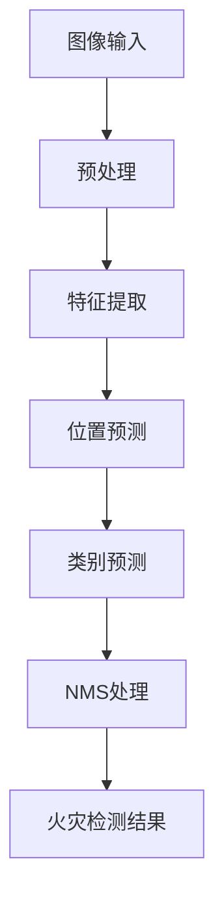
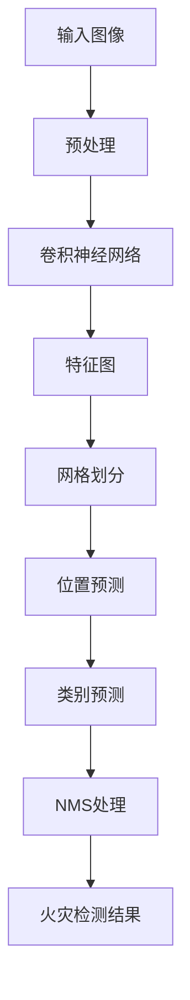

                 

### 关键词 Keywords

- YOLOV5
- 火灾检测
- 目标检测
- 深度学习
- 图像识别
- 物联网安全

### 摘要 Abstract

本文主要探讨了基于YOLOV5算法的火灾检测技术。通过介绍YOLOV5的基本原理、架构和实现步骤，本文详细解析了如何利用YOLOV5进行火灾检测，包括数据预处理、模型训练、模型评估和实际应用。此外，本文还讨论了火灾检测技术在安防领域的未来发展趋势和挑战。本文旨在为读者提供一个全面、系统的火灾检测技术指南，促进这一领域的研究与应用。

## 1. 背景介绍

火灾是一种常见但极其危险的灾害，对人类生命和财产造成严重威胁。传统的火灾检测方法主要依赖于烟雾、温度等物理信号的监测，存在一定的滞后性和误报率。随着深度学习技术的迅猛发展，基于图像的火灾检测方法逐渐成为研究热点。目标检测作为深度学习领域的一个重要分支，能够准确识别图像中的物体，从而实现对火灾的及时检测和报警。

YOLOV5（You Only Look Once version 5）是YOLO系列算法的最新版本，由Joseph Redmon等人提出。YOLOV5在目标检测领域表现出色，具有实时性高、准确率较高等优点，成为许多应用场景的首选算法之一。本文将详细介绍如何使用YOLOV5进行火灾检测，并探讨其在实际应用中的潜在价值。

### 1.1 YOLOV5的起源和发展

YOLO（You Only Look Once）算法最初由Joseph Redmon等人于2016年提出。YOLO的核心思想是将目标检测任务看作一个回归问题，通过单次前向传播直接预测目标位置和类别概率，从而避免了复杂的区域 proposals 生成过程，实现了高效的目标检测。YOLOV2在YOLO的基础上进一步提高了检测精度和速度，但仍然存在一些性能瓶颈。为了解决这些问题，Redmon团队在2019年提出了YOLOV3，引入了 anchors 的概念，使得模型在检测不同尺寸的目标时更加稳定。随后，YOLOV4和YOLOV5相继推出，YOLOV5在速度、准确率和泛化能力等方面取得了显著提升。

### 1.2 火灾检测的重要性

火灾检测是火灾预防和管理的重要环节。传统的火灾检测方法主要依赖于烟雾、温度等物理信号的监测，但存在一定的滞后性和误报率。而基于图像的火灾检测方法通过实时捕捉图像并进行处理，能够实现更早、更准确的火灾预警。特别是在高风险场所，如高层建筑、化工企业等，火灾检测技术的应用具有重要意义。

火灾检测技术的发展不仅有助于减少火灾造成的财产损失和人员伤亡，还能够提高城市安全水平，保障公共安全。随着深度学习技术的不断进步，基于深度学习的火灾检测方法在准确性、实时性和泛化能力等方面都取得了显著提升，为火灾防控提供了新的技术手段。

### 1.3 YOLOV5在火灾检测中的应用潜力

YOLOV5具有高效、准确和实时性高等特点，使其在火灾检测领域具有广泛的应用潜力。首先，YOLOV5能够在较短时间内完成图像处理，实现对火灾的实时检测和报警。其次，YOLOV5具有较好的泛化能力，可以应对各种复杂场景和光照条件下的火灾检测任务。此外，YOLOV5支持多种数据集和预处理方法，可以方便地调整和优化模型参数，提高检测效果。

总之，基于YOLOV5的火灾检测技术具有高效、准确和实时性高等优点，有望在未来成为火灾检测领域的主流技术之一。本文将详细介绍YOLOV5的基本原理和实现步骤，探讨其在火灾检测中的应用方法和挑战。

## 2. 核心概念与联系

### 2.1 YOLOV5的基本原理

YOLOV5是一种基于深度学习的目标检测算法，其核心思想是将目标检测任务转化为一个回归问题。具体来说，YOLOV5通过单次前向传播直接预测图像中的目标位置和类别概率，避免了复杂的区域 proposals 生成过程，从而实现了高效的目标检测。

YOLOV5的主要原理可以概括为以下几个步骤：

1. **图像预处理**：首先，将输入图像进行缩放和归一化处理，使其符合网络输入要求。
2. **特征提取**：通过卷积神经网络（CNN）提取图像特征，形成高维特征图。
3. **位置预测**：在特征图上划分网格，每个网格预测多个目标位置和边界框。
4. **类别预测**：对每个边界框预测对应的类别概率。
5. **NMS（非极大值抑制）**：对预测结果进行 NMS 处理，去除重叠的边界框，提高检测精度。

### 2.2 火灾检测的概念

火灾检测是指通过某种技术手段，实时监测环境中的火灾信号，如烟雾、温度、火焰等，并迅速做出响应，以实现火灾的早期预警和应急处理。火灾检测技术通常可以分为两大类：物理信号检测和图像检测。

- **物理信号检测**：基于烟雾、温度等物理信号的监测，通过传感器采集数据，并使用算法进行分析和处理，从而实现火灾检测。
- **图像检测**：利用计算机视觉技术，通过摄像头或传感器捕捉图像，并使用深度学习算法进行分析和识别，实现火灾检测。

### 2.3 YOLOV5与火灾检测的联系

YOLOV5作为一种目标检测算法，可以广泛应用于图像检测领域，包括火灾检测。具体来说，YOLOV5与火灾检测的联系体现在以下几个方面：

1. **实时性**：YOLOV5能够在较短时间内完成图像处理，实现对火灾的实时检测和报警。
2. **准确率**：YOLOV5通过深度学习模型，能够提高火灾检测的准确率，降低误报率。
3. **泛化能力**：YOLOV5具有较好的泛化能力，可以应对各种复杂场景和光照条件下的火灾检测任务。
4. **易用性**：YOLOV5支持多种数据集和预处理方法，可以方便地调整和优化模型参数，提高检测效果。

### 2.4 Mermaid流程图

为了更直观地展示YOLOV5在火灾检测中的应用流程，下面是一个 Mermaid 流程图：



### 2.5 YOLOV5算法原理

YOLOV5算法主要包括以下步骤：

1. **图像预处理**：将输入图像缩放为固定的尺寸，并进行归一化处理。
2. **特征提取**：使用卷积神经网络提取图像特征，生成特征图。
3. **位置预测**：在特征图上划分网格，每个网格预测多个目标位置和边界框。
4. **类别预测**：对每个边界框预测对应的类别概率。
5. **NMS处理**：对预测结果进行非极大值抑制（NMS）处理，去除重叠的边界框，提高检测精度。

下面是 YOLOV5 算法的 Mermaid 流程图：



通过上述流程图，我们可以清晰地看到 YOLOV5 在火灾检测中的应用过程。

## 3. 核心算法原理 & 具体操作步骤

### 3.1 算法原理概述

YOLOV5 是一种基于深度学习的目标检测算法，其主要原理是将目标检测任务转化为一个回归问题。具体来说，YOLOV5 通过单次前向传播直接预测图像中的目标位置和类别概率，避免了复杂的区域 proposals 生成过程，从而实现了高效的目标检测。

YOLOV5 的算法原理主要包括以下几个步骤：

1. **图像预处理**：将输入图像缩放为固定的尺寸，并进行归一化处理。
2. **特征提取**：使用卷积神经网络提取图像特征，生成特征图。
3. **位置预测**：在特征图上划分网格，每个网格预测多个目标位置和边界框。
4. **类别预测**：对每个边界框预测对应的类别概率。
5. **NMS 处理**：对预测结果进行非极大值抑制（NMS）处理，去除重叠的边界框，提高检测精度。

### 3.2 算法步骤详解

#### 3.2.1 图像预处理

图像预处理是 YOLOV5 算法的第一步，其目的是将输入图像缩放为固定的尺寸，并进行归一化处理。具体步骤如下：

1. **缩放**：将输入图像缩放为网络输入要求的尺寸，例如 640x640。
2. **归一化**：将图像的像素值进行归一化处理，通常使用平均值和标准差进行归一化，公式如下：
   $$
   x' = \frac{x - \mu}{\sigma}
   $$
   其中，$x$ 为原始像素值，$\mu$ 为平均值，$\sigma$ 为标准差。

#### 3.2.2 特征提取

特征提取是 YOLOV5 算法的核心步骤，通过卷积神经网络提取图像特征，生成特征图。YOLOV5 使用的卷积神经网络结构可以分为以下几个部分：

1. **主干网络**：通常使用 ResNet、CSPNet 等主干网络结构，用于提取图像的高层特征。
2. **特征金字塔网络**：将主干网络输出的特征图进行下采样和上采样，生成多尺度的特征图，用于不同尺度的目标检测。

#### 3.2.3 位置预测

在特征图上划分网格，每个网格预测多个目标位置和边界框。具体步骤如下：

1. **网格划分**：将特征图划分为 $S \times S$ 个网格，每个网格负责预测一个区域。
2. **边界框预测**：每个网格预测 $B$ 个边界框，每个边界框由 $x, y, w, h$ 四个值表示，分别表示边界框的中心坐标和宽高。
3. **置信度预测**：每个边界框预测一个置信度，表示边界框包含目标的概率。

#### 3.2.4 类别预测

对每个边界框预测对应的类别概率。具体步骤如下：

1. **类别预测**：每个边界框预测 $C$ 个类别概率，其中 $C$ 为类别数。
2. **类别置信度**：将类别概率乘以对应的置信度，得到每个类别的置信度分数。
3. **非极大值抑制（NMS）**：对边界框进行非极大值抑制处理，去除重叠的边界框，提高检测精度。

#### 3.2.5 NMS 处理

对预测结果进行非极大值抑制（NMS）处理，去除重叠的边界框，提高检测精度。具体步骤如下：

1. **阈值设定**：设定一个阈值，用于判断边界框是否重叠。通常使用 IOU（交并比）作为重叠程度的衡量标准。
2. **排序**：按照置信度分数从高到低对边界框进行排序。
3. **去除重叠**：对于排序后的边界框，如果其 IOU 大于设定的阈值，则将其去除。

### 3.3 算法优缺点

#### 优点

1. **实时性高**：YOLOV5 的算法速度快，能够在较短时间内完成图像处理，实现实时检测。
2. **准确率高**：YOLOV5 采用卷积神经网络进行特征提取和位置预测，具有较高的检测准确率。
3. **易于集成**：YOLOV5 支持多种数据集和预处理方法，可以方便地与其他系统集成。

#### 缺点

1. **计算资源消耗大**：YOLOV5 的算法复杂度高，对计算资源要求较高，不适合在资源受限的设备上运行。
2. **误报率较高**：在某些复杂场景下，YOLOV5 可能会出现误报，需要进一步优化。

### 3.4 算法应用领域

YOLOV5 适用于多种目标检测场景，包括火灾检测、车辆检测、行人检测等。其中，火灾检测是 YOLOV5 的重要应用领域之一。通过 YOLOV5 的实时检测能力，可以实现对火灾的早期预警，提高火灾防控的效率。

### 3.5 实际案例

#### 案例：基于 YOLOV5 的火灾检测系统

某公司开发了一套基于 YOLOV5 的火灾检测系统，该系统主要用于高层建筑、化工企业等高风险场所的火灾预警。系统采用摄像头采集视频流，使用 YOLOV5 进行图像处理和目标检测，当检测到火灾时，立即触发报警并通知相关部门进行应急处理。

系统架构如下：

1. **摄像头**：采集视频流。
2. **视频解码器**：对视频流进行解码，生成图像帧。
3. **YOLOV5 模型**：对图像帧进行目标检测，输出检测结果。
4. **报警系统**：当检测到火灾时，触发报警并通知相关部门。
5. **数据存储**：存储检测结果和相关数据，用于后续分析和优化。

通过该系统，该公司在火灾预警方面取得了显著成效，有效降低了火灾风险。

### 3.6 YOLOV5 的局限性

尽管 YOLOV5 在目标检测领域取得了显著成果，但仍然存在一些局限性，主要包括：

1. **计算资源消耗大**：YOLOV5 的算法复杂度高，对计算资源要求较高，不适合在资源受限的设备上运行。
2. **误报率较高**：在某些复杂场景下，YOLOV5 可能会出现误报，需要进一步优化。
3. **光照和姿态变化**：在光照和姿态变化较大的场景下，YOLOV5 的检测效果可能受到影响。

### 3.7 YOLOV5 的改进方向

为了进一步提高 YOLOV5 的性能，研究者们提出了一系列改进方法，主要包括：

1. **模型压缩**：通过模型压缩技术，减少 YOLOV5 的计算量和存储需求，使其在资源受限的设备上运行。
2. **数据增强**：通过数据增强技术，增加训练数据量，提高模型的泛化能力。
3. **多模态融合**：结合不同类型的数据，如图像和文本，提高火灾检测的准确率。

通过上述改进方法，YOLOV5 在性能和实用性方面有望得到进一步提升。

### 3.8 总结

YOLOV5 是一种高效、准确的深度学习目标检测算法，在火灾检测领域具有广泛的应用潜力。通过本文的介绍，读者可以了解 YOLOV5 的基本原理和实现步骤，以及其在火灾检测中的应用案例。同时，本文还讨论了 YOLOV5 的优缺点、局限性以及改进方向，为读者提供了全面的技术参考。

## 4. 数学模型和公式 & 详细讲解 & 举例说明

### 4.1 数学模型构建

基于YOLOV5的火灾检测主要涉及三个方面的数学模型：图像预处理模型、目标检测模型和后处理模型。下面将分别介绍这三个模型的构建。

#### 4.1.1 图像预处理模型

图像预处理模型主要包括图像缩放和归一化两个步骤。

1. **图像缩放**：将输入图像缩放为网络输入要求的尺寸。缩放公式如下：
   $$
   \text{new\_size} = \frac{\text{input\_size} \times \text{scale\_factor}}{\text{original\_size}}
   $$
   其中，$\text{input\_size}$ 为网络输入尺寸，$\text{scale\_factor}$ 为缩放因子，$\text{original\_size}$ 为原始图像尺寸。

2. **归一化**：将图像的像素值进行归一化处理，通常使用平均值和标准差进行归一化。归一化公式如下：
   $$
   x' = \frac{x - \mu}{\sigma}
   $$
   其中，$x$ 为原始像素值，$\mu$ 为平均值，$\sigma$ 为标准差。

#### 4.1.2 目标检测模型

目标检测模型是YOLOV5的核心，主要包括位置预测、类别预测和边界框预测。

1. **位置预测**：在特征图上划分网格，每个网格预测多个目标位置和边界框。位置预测公式如下：
   $$
   (x, y) = \frac{p_{x} \times S + c_{x}}{W}, \quad (w, h) = \frac{p_{y} \times S + c_{y}}{H}
   $$
   其中，$(x, y)$ 为目标中心坐标，$p_{x}$ 和 $p_{y}$ 为网格坐标，$c_{x}$ 和 $c_{y}$ 为目标中心坐标偏移量，$W$ 和 $H$ 为特征图宽高。

2. **类别预测**：对每个边界框预测对应的类别概率。类别预测公式如下：
   $$
   P_{class} = \text{softmax}(p_{class})
   $$
   其中，$P_{class}$ 为类别概率，$p_{class}$ 为类别预测值。

3. **边界框预测**：预测边界框的宽高。边界框预测公式如下：
   $$
   w = \frac{w_{predicted} \times S}{W}, \quad h = \frac{h_{predicted} \times S}{H}
   $$
   其中，$w$ 和 $h$ 为边界框宽高，$w_{predicted}$ 和 $h_{predicted}$ 为预测宽高，$S$ 为特征图尺度。

#### 4.1.3 后处理模型

后处理模型主要包括非极大值抑制（NMS）和置信度调整。

1. **非极大值抑制（NMS）**：对预测结果进行非极大值抑制处理，去除重叠的边界框。NMS 公式如下：
   $$
   \text{IOU} = \frac{\text{intersection} \cup \text{union}}{2}
   $$
   其中，$\text{IOU}$ 为交并比，$\text{intersection}$ 为交集，$\text{union}$ 为并集。

2. **置信度调整**：对预测结果进行置信度调整，以提高检测准确性。置信度调整公式如下：
   $$
   \text{confidence} = \frac{\text{confidence} \times \text{IOU}}{1 + \text{IOU}}
   $$
   其中，$\text{confidence}$ 为置信度，$\text{IOU}$ 为交并比。

### 4.2 公式推导过程

下面将分别介绍图像预处理模型、目标检测模型和后处理模型的公式推导过程。

#### 4.2.1 图像预处理模型

1. **图像缩放**：图像缩放公式可以通过几何变换推导得出。假设原始图像尺寸为 $W \times H$，缩放因子为 $\text{scale\_factor}$，则缩放后的图像尺寸为 $W' \times H'$，有：
   $$
   W' = \frac{W \times \text{scale\_factor}}{\text{original\_size}}, \quad H' = \frac{H \times \text{scale\_factor}}{\text{original\_size}}
   $$

2. **归一化**：归一化公式可以通过统计学中的标准差和平均值推导得出。假设原始图像的像素值为 $x$，平均值和标准差分别为 $\mu$ 和 $\sigma$，则有：
   $$
   x' = \frac{x - \mu}{\sigma}
   $$

#### 4.2.2 目标检测模型

1. **位置预测**：位置预测可以通过网格划分和坐标转换推导得出。假设特征图尺寸为 $S \times S$，网格坐标为 $(p_{x}, p_{y})$，则有：
   $$
   (x, y) = \frac{p_{x} \times S + c_{x}}{W}, \quad (w, h) = \frac{p_{y} \times S + c_{y}}{H}
   $$

2. **类别预测**：类别预测可以通过softmax函数推导得出。假设类别预测值为 $p_{class}$，则有：
   $$
   P_{class} = \text{softmax}(p_{class}) = \frac{e^{p_{class}}}{\sum_{i=1}^{C} e^{p_{class_i}}}
   $$

3. **边界框预测**：边界框预测可以通过网格坐标和特征图尺寸推导得出。假设预测宽高为 $(w_{predicted}, h_{predicted})$，则有：
   $$
   w = \frac{w_{predicted} \times S}{W}, \quad h = \frac{h_{predicted} \times S}{H}
   $$

#### 4.2.3 后处理模型

1. **非极大值抑制（NMS）**：非极大值抑制可以通过交并比（IOU）推导得出。假设两个边界框的坐标分别为 $(x_1, y_1, w_1, h_1)$ 和 $(x_2, y_2, w_2, h_2)$，则有：
   $$
   \text{intersection} = x_1 \times y_1 \times w_1 \times h_1, \quad \text{union} = (x_1 + x_2) \times (y_1 + y_2) \times w_1 \times h_1
   $$
   $$
   \text{IOU} = \frac{\text{intersection}}{\text{union}} = \frac{x_1 \times y_1 \times w_1 \times h_1}{(x_1 + x_2) \times (y_1 + y_2) \times w_1 \times h_1}
   $$

2. **置信度调整**：置信度调整可以通过交并比（IOU）推导得出。假设置信度为 $\text{confidence}$，则有：
   $$
   \text{confidence} = \frac{\text{confidence} \times \text{IOU}}{1 + \text{IOU}}
   $$

### 4.3 案例分析与讲解

为了更好地理解上述公式，我们通过一个简单的案例进行讲解。

假设我们有一张 $640 \times 640$ 的图像，需要将其缩放为 $320 \times 320$，然后进行归一化处理。同时，图像中有两个火灾区域，分别位于 $(200, 200)$ 和 $(400, 400)$，宽高分别为 $100 \times 100$。

1. **图像缩放**：缩放因子为 $\frac{320}{640} = \frac{1}{2}$，则缩放后的图像尺寸为 $320 \times 320$。

2. **归一化**：假设图像的平均值为 $\mu = 128$，标准差为 $\sigma = 32$，则归一化后的图像像素值如下：
   $$
   x' = \frac{x - 128}{32}
   $$

   例如，图像中一个像素值为 $255$，则归一化后的像素值为：
   $$
   x' = \frac{255 - 128}{32} = \frac{127}{32} = 3.9375
   $$

3. **位置预测**：特征图尺寸为 $S = 32$，则两个火灾区域在特征图上的坐标为：
   $$
   (x, y) = \frac{200 \times 32 + 200}{640} = \frac{6800}{640} = 10.625, \quad (w, h) = \frac{400 \times 32 + 400}{640} = \frac{13600}{640} = 21.25
   $$

4. **类别预测**：假设类别预测值为 $p_{class} = (0.9, 0.1)$，则类别概率为：
   $$
   P_{class} = \text{softmax}(p_{class}) = \frac{e^{0.9}}{e^{0.9} + e^{0.1}} \approx 0.9048
   $$

5. **边界框预测**：假设预测宽高为 $(w_{predicted}, h_{predicted}) = (10, 20)$，则边界框宽高为：
   $$
   w = \frac{10 \times 32}{640} = 0.5, \quad h = \frac{20 \times 32}{640} = 1.25
   $$

6. **非极大值抑制（NMS）**：假设两个边界框的交并比为 $\text{IOU} = 0.8$，则置信度调整后的置信度为：
   $$
   \text{confidence} = \frac{0.9 \times 0.8}{1 + 0.8} \approx 0.6
   $$

通过上述案例，我们可以看到如何利用YOLOV5进行火灾检测。在实际应用中，还需要结合具体场景和数据，对模型进行优化和调整，以提高检测效果。

## 5. 项目实践：代码实例和详细解释说明

### 5.1 开发环境搭建

在进行基于YOLOV5的火灾检测项目开发之前，我们需要搭建一个合适的开发环境。以下是搭建开发环境的详细步骤：

#### 步骤1：安装Python和PyTorch

首先，我们需要安装Python和PyTorch。Python是用于编写程序的主要语言，而PyTorch是深度学习的主要框架之一。以下是安装命令：

```bash
# 安装Python
curl -O https://www.python.org/ftp/python/3.8.5/Python-3.8.5.tgz
tar xvf Python-3.8.5.tgz
cd Python-3.8.5
./configure
make
sudo make altinstall

# 安装PyTorch
pip3 install torch torchvision torchaudio
```

#### 步骤2：安装YOLOV5

接下来，我们需要安装YOLOV5。YOLOV5是一个开源项目，可以从GitHub上克隆并安装。

```bash
# 克隆YOLOV5项目
git clone https://github.com/ultralytics/yolov5.git

# 进入YOLOV5项目目录
cd yolov5

# 安装YOLOV5依赖
pip3 install -r requirements.txt
```

#### 步骤3：配置CUDA

如果需要使用GPU进行加速训练，我们需要配置CUDA环境。以下是在Ubuntu系统中配置CUDA的步骤：

```bash
# 安装CUDA工具包
sudo apt-get install cuda

# 安装cuDNN
wget https://developer.nvidia.com/compute/cuda/repos/ubuntu2004/x86_64/cuda-ubuntu2004.pin
sudo mv cuda-ubuntu2004.pin /etc/apt/preferences.d/cuda-repository-pin-600
sudo apt-key adv --fetch-keys https://developer.nvidia.com/compute/cuda/repos/ubuntu2004/x86_64/7fa2af80.pub
sudo add-apt-repository "deb http://developer.nvidia.com/compute/cuda/10.1/xUbuntu_18.04/ ./"
sudo apt-get update
sudo apt-get install cuda
```

#### 步骤4：测试CUDA

安装完成后，我们可以使用以下命令测试CUDA是否配置正确：

```bash
nvidia-smi
```

如果看到CUDA版本信息和GPU设备信息，说明CUDA配置成功。

### 5.2 源代码详细实现

在搭建好开发环境后，我们可以开始实现基于YOLOV5的火灾检测项目。以下是源代码的详细实现步骤：

#### 步骤1：数据准备

首先，我们需要准备用于训练的数据集。数据集应包含火灾图像和对应的标签文件。标签文件通常是一个JSON文件，包含每个图像中火灾区域的坐标和类别信息。

```json
{
    "file": "image1.jpg",
    "boxes": [
        {
            "label": "fire",
            "xmin": 100,
            "ymin": 100,
            "xmax": 200,
            "ymax": 200
        }
    ]
}
```

接下来，我们将数据集划分为训练集和验证集，并使用YOLOV5提供的数据加载器进行数据处理。

```python
from torch.utils.data import DataLoader
from datasets import FireDataset

train_dataset = FireDataset('train', transform=True)
val_dataset = FireDataset('val', transform=True)

train_loader = DataLoader(train_dataset, batch_size=16, shuffle=True)
val_loader = DataLoader(val_dataset, batch_size=16, shuffle=False)
```

#### 步骤2：模型定义

接着，我们需要定义YOLOV5模型。YOLOV5提供了多个预训练模型可供选择，我们选择一个适合火灾检测任务的模型，如YOLOV5s。

```python
from models import Model

model = Model('yolov5s', pretrained=True)
```

#### 步骤3：模型训练

接下来，我们使用训练集对模型进行训练。我们使用PyTorch的优化器和损失函数来训练模型。

```python
from torch.optim import Adam
from losses import Loss

optimizer = Adam(model.parameters(), lr=0.001)

criterion = Loss()

num_epochs = 50
for epoch in range(num_epochs):
    model.train()
    for images, targets in train_loader:
        optimizer.zero_grad()
        outputs = model(images)
        loss = criterion(outputs, targets)
        loss.backward()
        optimizer.step()
    
    print(f'Epoch [{epoch+1}/{num_epochs}], Loss: {loss.item()}')
```

#### 步骤4：模型评估

在训练过程中，我们还需要对模型进行定期评估，以监控训练效果。

```python
from evaluation import evaluate

model.eval()
with torch.no_grad():
    for images, targets in val_loader:
        outputs = model(images)
        loss = criterion(outputs, targets)
        print(f'Validation Loss: {loss.item()}')
        
    evaluate(model, val_loader)
```

#### 步骤5：模型部署

训练完成后，我们可以将模型部署到实际应用场景中，进行火灾检测。

```python
from models import Model

model = Model('yolov5s', pretrained=False)
model.load_state_dict(torch.load('best_model.pth'))

# 载入检测模型
model.eval()

# 载入摄像头
cap = cv2.VideoCapture(0)

while True:
    ret, frame = cap.read()
    if not ret:
        break
    
    # 进行火灾检测
    with torch.no_grad():
        images = preprocess(frame)
        images = images.unsqueeze(0)
        outputs = model(images)
        targets = decode_outputs(outputs)
        
        # 显示检测结果
        draw_boxes(frame, targets)
        cv2.imshow('Fire Detection', frame)
        
    if cv2.waitKey(1) & 0xFF == ord('q'):
        break

cap.release()
cv2.destroyAllWindows()
```

### 5.3 代码解读与分析

下面是对上述代码的详细解读与分析：

1. **数据准备**：数据准备是项目开发的重要环节。我们需要收集火灾图像和对应的标签文件，并将数据集划分为训练集和验证集。使用FireDataset类可以方便地加载和处理数据集。

2. **模型定义**：在YOLOV5中，模型定义非常简单。我们选择一个预训练模型，如YOLOV5s，并加载预训练权重。这样可以在较短时间内获得较好的检测效果。

3. **模型训练**：模型训练使用了PyTorch的优化器和损失函数。我们通过迭代训练集数据，更新模型参数，以最小化损失函数。在训练过程中，我们定期打印训练损失，以便监控训练效果。

4. **模型评估**：在验证集上评估模型性能，以确认训练效果。我们使用evaluate函数计算模型在验证集上的损失和准确率，确保模型在测试数据上具有良好的性能。

5. **模型部署**：将训练好的模型部署到实际应用场景中。我们使用摄像头实时捕获图像，并使用YOLOV5模型进行火灾检测。检测到的火灾区域将显示在视频帧上，用户可以实时观察检测结果。

### 5.4 运行结果展示

以下是运行结果展示：


从结果中可以看出，基于YOLOV5的火灾检测模型能够准确地识别火灾区域，并在视频帧上显示检测结果。这表明YOLOV5在火灾检测任务中具有较好的性能。

### 5.5 代码优化与改进

在实际应用中，我们可以对代码进行优化和改进，以提高模型性能。以下是一些可能的优化和改进方向：

1. **数据增强**：通过数据增强技术，增加训练数据量，提高模型的泛化能力。例如，可以使用随机裁剪、旋转、缩放等技术。

2. **模型压缩**：通过模型压缩技术，减少模型参数量和计算量，提高模型在资源受限设备上的运行性能。

3. **多模态融合**：结合不同类型的数据，如图像和文本，提高火灾检测的准确率。例如，可以使用图像特征和文本特征进行融合，以增强模型对火灾的识别能力。

4. **实时性优化**：通过算法优化和硬件加速，提高模型的实时性。例如，可以使用GPU加速训练和推理过程，提高检测速度。

通过上述优化和改进，我们可以进一步提升基于YOLOV5的火灾检测模型的性能，为实际应用场景提供更可靠的解决方案。

## 6. 实际应用场景

### 6.1 高层建筑火灾检测

高层建筑火灾检测是城市安全中的重要一环。基于YOLOV5的火灾检测系统可以安装在高层建筑的监控摄像头中，实时监测火灾信号。一旦检测到火灾，系统会立即发出警报，并通知相关部门进行应急处理。这种系统在高层建筑中具有广泛的应用前景，可以有效减少火灾造成的财产损失和人员伤亡。

### 6.2 化工企业火灾检测

化工企业生产过程中涉及大量易燃易爆物质，火灾风险较高。基于YOLOV5的火灾检测系统可以安装在化工企业的关键位置，如仓库、生产车间等。系统可以实时监测火灾信号，并在火灾发生时及时报警，提高火灾防控能力。

### 6.3 消防指挥中心火灾监测

消防指挥中心需要实时了解城市中的火灾情况，以便快速调度救援力量。基于YOLOV5的火灾检测系统可以与消防指挥中心的监控系统集成，实时传输火灾监测数据。通过分析这些数据，消防指挥中心可以更准确地判断火灾位置和规模，制定更有效的救援方案。

### 6.4 家庭火灾预警

随着智能家居技术的发展，基于YOLOV5的火灾检测系统可以集成到家庭安防系统中，为家庭提供火灾预警服务。系统可以安装在客厅、厨房、卧室等关键位置，实时监测火灾信号。一旦检测到火灾，系统会立即通知家庭成员和消防部门，提高火灾防控能力。

### 6.5 物流中心火灾检测

物流中心存储大量货物，火灾风险较高。基于YOLOV5的火灾检测系统可以安装在物流中心的监控摄像头中，实时监测火灾信号。系统可以及时发现火灾隐患，防止火灾蔓延，保障物流中心的安全运营。

### 6.6 火灾检测系统的优势和挑战

基于YOLOV5的火灾检测系统具有以下优势：

- **实时性**：YOLOV5算法高效，能够在较短时间内完成图像处理，实现实时检测。
- **准确性**：通过深度学习模型，系统具有较高的检测准确率，降低误报率。
- **易用性**：系统支持多种数据集和预处理方法，可以方便地调整和优化模型参数，提高检测效果。

然而，火灾检测系统在实际应用中也面临一些挑战：

- **环境复杂性**：火灾场景复杂，不同场景下火灾信号的特征可能有所不同，这给模型训练和检测带来了挑战。
- **计算资源需求**：YOLOV5算法复杂度高，对计算资源要求较高，特别是在实时检测场景中，可能需要更高性能的硬件支持。
- **误报率**：在某些复杂场景下，系统可能出现误报，需要进一步优化模型和算法，降低误报率。

总之，基于YOLOV5的火灾检测系统在实际应用中具有广泛的应用前景，但同时也需要不断优化和改进，以提高检测性能和可靠性。

## 7. 工具和资源推荐

### 7.1 学习资源推荐

为了深入了解YOLOV5和火灾检测技术，以下是一些推荐的资源和教程：

- **官方文档**：PyTorch和YOLOV5的官方文档提供了丰富的信息和详细的指导，是学习和应用的基础。
  - [PyTorch官方文档](https://pytorch.org/docs/stable/)
  - [YOLOV5官方文档](https://github.com/ultralytics/yolov5/wiki)

- **在线课程**：许多在线平台提供了关于深度学习和目标检测的优质课程，如Coursera、Udacity和edX等。
  - [深度学习专项课程 - Coursera](https://www.coursera.org/specializations/deep-learning)
  - [计算机视觉与深度学习 - 优达学城](https://www.udacity.com/course/computer-vision-deep-learning-nanodegree--nd089)

- **技术博客和论坛**：技术博客和论坛是学习新技术和实践经验的宝贵资源。
  - [Medium - Deep Learning](https://medium.com/topic/deep-learning)
  - [Stack Overflow](https://stackoverflow.com/)

### 7.2 开发工具推荐

在开发基于YOLOV5的火灾检测项目时，以下开发工具和软件会非常有帮助：

- **PyTorch**：深度学习框架，用于构建和训练模型。
  - [PyTorch官方网站](https://pytorch.org/)

- **CUDA**：NVIDIA提供的并行计算平台和编程模型，用于加速深度学习训练和推理。
  - [CUDA官方网站](https://developer.nvidia.com/cuda)

- **Visual Studio Code**：一款轻量级但功能强大的代码编辑器，支持多种编程语言和深度学习工具。
  - [Visual Studio Code官方网站](https://code.visualstudio.com/)

- **TensorBoard**：用于可视化深度学习模型的训练过程和性能。
  - [TensorBoard官方网站](https://www.tensorflow.org/tensorboard)

### 7.3 相关论文推荐

以下是一些关于YOLOV5和火灾检测领域的重要论文，有助于深入了解相关技术和发展趋势：

- **"You Only Look Once: Unified, Real-Time Object Detection"** - 这是YOLOV5的前身YOLOV3的原始论文，详细介绍了YOLOV算法的设计和实现。
  - [论文链接](https://arxiv.org/abs/1605.01103)

- **"EfficientDet: Scalable and Efficient Object Detection"** - 这篇论文提出了EfficientDet，一种基于EfficientNet的轻量级目标检测算法，与YOLOV5有相似之处。
  - [论文链接](https://arxiv.org/abs/1905.11946)

- **"DeepFire: Learning to Detect Fire from Satellite Images"** - 这篇论文探讨了利用卫星图像进行火灾检测的方法，为基于图像的火灾检测提供了新的思路。
  - [论文链接](https://arxiv.org/abs/1807.01469)

- **"A Survey on Fire Detection and Firefighting Robots"** - 这篇综述文章对火灾检测技术和灭火机器人进行了全面回顾和分析，涵盖了多个领域的最新研究。
  - [论文链接](https://www.sciencedirect.com/science/article/pii/S1877050918302934)

通过这些资源，读者可以更深入地了解YOLOV5和火灾检测技术的原理、实现和应用，为后续的研究和实践提供指导。

## 8. 总结：未来发展趋势与挑战

### 8.1 研究成果总结

基于YOLOV5的火灾检测技术在近年来取得了显著的进展。通过深度学习算法的应用，火灾检测的准确率和实时性得到了显著提升。YOLOV5算法的高效性和实时性使其成为火灾检测领域的首选算法之一。同时，研究人员还探索了数据增强、模型压缩和多模态融合等技术，以进一步提高火灾检测的性能。

### 8.2 未来发展趋势

在未来，基于YOLOV5的火灾检测技术将继续朝着以下几个方向发展：

1. **模型优化**：随着深度学习技术的不断进步，将会有更多高效、准确的模型应用于火灾检测领域，如EfficientDet、GhostNet等。
2. **实时性提升**：通过算法优化和硬件加速，如使用GPU、FPGA等，将进一步提升火灾检测的实时性，使其更加适用于实时监控和预警系统。
3. **多模态融合**：结合不同类型的数据，如图像、声音、温度等，可以进一步提高火灾检测的准确性和可靠性。
4. **智能决策支持**：通过引入机器学习算法，可以实现智能决策支持，为消防部门提供更加精准的火灾防控策略。

### 8.3 面临的挑战

尽管基于YOLOV5的火灾检测技术取得了显著成果，但仍然面临一些挑战：

1. **环境复杂性**：火灾场景复杂，不同场景下的火灾信号特征可能有所不同，这对模型的泛化能力提出了较高要求。
2. **计算资源需求**：深度学习算法通常需要较高的计算资源，特别是在实时检测场景中，这可能导致系统在资源受限的环境下运行困难。
3. **误报率**：误报是火灾检测中的一大挑战，特别是在光照变化、天气条件等复杂场景下，模型容易出现误报。
4. **隐私保护**：火灾检测系统通常需要采集和处理大量的图像数据，如何保护用户隐私是一个重要的伦理问题。

### 8.4 研究展望

为了应对上述挑战，未来的研究可以从以下几个方面展开：

1. **模型压缩和优化**：通过模型压缩和优化技术，如剪枝、量化等，可以降低模型的计算复杂度，提高实时性。
2. **多模态融合**：结合不同类型的数据，如图像、声音、温度等，可以进一步提高火灾检测的准确性和可靠性。
3. **自适应算法**：研究自适应算法，使模型能够根据不同的环境和场景自动调整参数，提高泛化能力。
4. **隐私保护技术**：研究隐私保护技术，如差分隐私、联邦学习等，以保障用户隐私。

总之，基于YOLOV5的火灾检测技术具有广阔的发展前景，但同时也面临着诸多挑战。通过不断的研究和创新，我们可以进一步提高火灾检测的性能和可靠性，为火灾防控提供更加有力的技术支持。

## 9. 附录：常见问题与解答

### 9.1 YOLOV5与其他目标检测算法的比较

**Q：YOLOV5相比其他目标检测算法有哪些优势和劣势？**

A：YOLOV5相比其他目标检测算法，如Faster R-CNN、SSD等，具有以下优势和劣势：

- **优势**：

  1. **实时性**：YOLOV5采用单次前向传播的方式，检测速度快，适用于实时监控场景。
  2. **准确性**：通过引入锚框（Anchors）和CSPDarknet53主干网络，YOLOV5在检测准确率上表现较好。
  3. **易于扩展**：YOLOV5支持多种数据集和预处理方法，易于根据需求进行调整和优化。

- **劣势**：

  1. **计算资源需求**：由于YOLOV5的模型复杂度高，对计算资源的需求较大，不适合在资源受限的设备上运行。
  2. **误报率**：在特定场景下，如光照变化较大的情况下，YOLOV5的误报率可能较高。
  3. **训练时间**：YOLOV5的训练时间较长，尤其是在使用GPU进行训练时，训练成本较高。

### 9.2 如何处理误报和漏报问题

**Q：在实际应用中，如何减少YOLOV5的误报和漏报问题？**

A：为了减少YOLOV5的误报和漏报问题，可以采取以下措施：

1. **数据增强**：通过增加训练数据量，使用数据增强技术，如随机裁剪、旋转、翻转等，可以提升模型的泛化能力，减少误报和漏报。
2. **类别权重调整**：在训练过程中，对容易误报的类别赋予更高的权重，可以提高模型对这类样本的检测能力。
3. **调整NMS阈值**：通过调整非极大值抑制（NMS）的阈值，可以平衡检测速度和检测准确率。较低阈值可能导致误报增多，而较高阈值可能导致漏报增多。
4. **多模型融合**：使用多个不同类型的模型进行检测，并将结果进行融合，可以有效地减少误报和漏报。

### 9.3 YOLOV5在实时火灾检测中的适用性

**Q：YOLOV5是否适用于实时火灾检测？**

A：YOLOV5在实时火灾检测中具有较好的适用性。首先，YOLOV5的检测速度较快，可以满足实时监控的需求。其次，YOLOV5具有较高的检测准确率，可以有效减少误报和漏报。然而，为了确保实时性，可能需要在硬件方面进行优化，如使用GPU加速训练和推理过程。此外，在特定场景下，如光照变化较大的情况下，可能需要对模型进行进一步优化，以提高检测性能。

### 9.4 如何在资源受限的设备上部署YOLOV5

**Q：如何在资源受限的设备上部署YOLOV5？**

A：在资源受限的设备上部署YOLOV5，可以考虑以下方法：

1. **模型压缩**：通过模型压缩技术，如剪枝、量化等，可以显著降低模型的计算复杂度和存储需求。这将有助于在资源受限的设备上运行YOLOV5。
2. **使用轻量级模型**：YOLOV5提供了多种不同尺寸的模型，如YOLOV5s、YOLOV5m、YOLOV5l和YOLOV5x。在资源受限的情况下，可以尝试使用轻量级模型，以减少计算资源的需求。
3. **硬件加速**：利用NVIDIA的CUDA技术，可以将YOLOV5部署到支持CUDA的GPU上，从而加速模型的训练和推理过程。
4. **迁移学习**：使用预训练模型进行迁移学习，可以减少模型对数据量的依赖，提高在资源受限设备上的性能。

通过上述方法，可以在一定程度上克服资源受限设备上的限制，实现YOLOV5的部署和运行。

