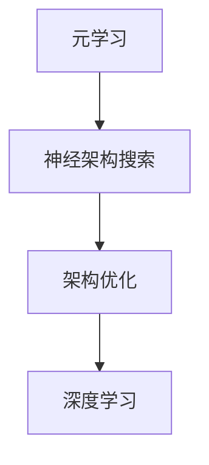

                 

关键词：元学习，神经架构搜索，深度学习，自动机器学习，架构优化

摘要：本文主要探讨了基于元学习的神经架构搜索方法，通过介绍其背景、核心概念、算法原理、数学模型、项目实践以及实际应用场景等，全面解析了该方法在深度学习领域中的重要性及其潜在的未来发展趋势和挑战。

## 1. 背景介绍

随着深度学习的广泛应用，神经网络架构的设计成为了一个关键问题。传统的神经网络设计依赖于专家经验，且设计过程复杂、耗时。近年来，自动机器学习（AutoML）逐渐成为研究热点，旨在自动化地搜索最优的神经网络架构。元学习（Meta-Learning）作为自动机器学习的一个重要分支，通过学习如何学习，提高了算法的通用性和效率。神经架构搜索（Neural Architecture Search，NAS）是自动机器学习的一个重要应用领域，旨在自动搜索最优的神经网络架构。

## 2. 核心概念与联系

### 2.1 元学习

元学习是指学习如何学习，其主要目标是提高算法的泛化能力和学习效率。在元学习中，算法通过在不同的任务上训练，学习到一个泛化的学习策略，以便在新任务上能够快速适应和完成任务。

### 2.2 神经架构搜索

神经架构搜索是一种自动搜索最优神经网络架构的方法。它通过在大量的架构候选集合中搜索，找到最优的架构。神经架构搜索可以分为基于强化学习的方法、基于遗传算法的方法以及基于梯度上升的方法等。

### 2.3 元学习与神经架构搜索的联系

元学习与神经架构搜索有着密切的联系。在神经架构搜索中，元学习可以用来优化搜索策略，提高搜索效率。同时，神经架构搜索的结果也可以为元学习提供丰富的数据集，进一步优化元学习算法。

## 2.4 Mermaid 流程图



## 3. 核心算法原理 & 具体操作步骤

### 3.1 算法原理概述

基于元学习的神经架构搜索方法主要通过以下步骤实现：

1. 初始化：随机生成一组神经网络架构。
2. 搜索策略：利用元学习算法，为搜索过程定义一个优化目标。
3. 训练与评估：对每一组架构进行训练和评估，选择最优的架构。
4. 重复步骤3，直到达到预定的搜索深度或找到满意的架构。

### 3.2 算法步骤详解

1. **初始化**：随机生成一组神经网络架构。这些架构可以是不同的网络层数、不同的激活函数、不同的网络连接方式等。

2. **搜索策略**：利用元学习算法，如MAML（Model-Agnostic Meta-Learning）或REPTILE（Reptile: A Simple System for Learning to Learn），为搜索过程定义一个优化目标。这个优化目标可以是搜索到的架构在验证集上的准确率最高，或者搜索到的架构能够最快地适应新任务。

3. **训练与评估**：对每一组架构进行训练和评估。在训练过程中，可以使用标准的训练集和验证集。在评估过程中，可以使用交叉验证等方法来评估架构的性能。

4. **选择最优架构**：根据评估结果，选择最优的架构。最优的架构可以是性能最好的架构，也可以是适应新任务能力最强的架构。

5. **重复步骤3和4**：重复训练和评估过程，直到达到预定的搜索深度或找到满意的架构。

### 3.3 算法优缺点

**优点**：

- 提高搜索效率：通过元学习算法，可以快速地找到最优的神经网络架构。
- 提高泛化能力：通过在不同的任务上训练，可以使得搜索到的架构具有更好的泛化能力。
- 自动化设计：可以自动化地设计神经网络架构，减轻了专家的工作负担。

**缺点**：

- 计算成本高：搜索过程中需要大量的计算资源。
- 搜索空间大：搜索过程中需要遍历大量的架构候选集合，导致搜索空间非常大。

### 3.4 算法应用领域

基于元学习的神经架构搜索方法可以广泛应用于图像识别、自然语言处理、推荐系统等领域。通过自动搜索最优的神经网络架构，可以显著提高模型的性能。

## 4. 数学模型和公式 & 详细讲解 & 举例说明

### 4.1 数学模型构建

基于元学习的神经架构搜索方法的核心是搜索策略。搜索策略可以用一个函数\( f(\theta) \)来表示，其中\( \theta \)是搜索策略的参数。搜索策略的目标是最大化一个评估函数\( E(\theta) \)，这个评估函数可以是模型在验证集上的准确率，也可以是模型对新任务的适应能力。

### 4.2 公式推导过程

假设我们使用MAML算法作为搜索策略，那么搜索策略\( f(\theta) \)可以表示为：

$$ f(\theta) = \arg\max_{\theta} E(\theta) = \arg\max_{\theta} \frac{1}{N} \sum_{i=1}^{N} L(\theta, x_i, y_i) $$

其中，\( L(\theta, x_i, y_i) \)是模型在任务\( (x_i, y_i) \)上的损失函数，\( N \)是任务的个数。

### 4.3 案例分析与讲解

假设我们使用MAML算法来搜索一个最优的卷积神经网络架构。我们首先初始化一个随机架构\( \theta \)，然后使用训练集\( D \)来训练这个架构。训练完成后，我们使用验证集\( D' \)来评估这个架构的性能。如果性能不满足我们的要求，我们就会更新架构\( \theta \)，并重复训练和评估过程。

假设我们的验证集包含100个任务，每个任务的标签是“猫”或“狗”。我们使用交叉验证的方法来评估架构的性能。交叉验证的过程如下：

1. 将验证集随机分为5个部分。
2. 对于每个部分，将其作为测试集，其他部分作为训练集。
3. 在训练集上训练架构，在测试集上评估性能。
4. 计算平均性能。

通过多次交叉验证，我们可以得到架构的平均性能。如果平均性能满足我们的要求，我们就可以停止搜索，否则，我们就会更新架构，并重复搜索过程。

## 5. 项目实践：代码实例和详细解释说明

### 5.1 开发环境搭建

为了实现基于元学习的神经架构搜索，我们需要安装以下工具和库：

- Python 3.7及以上版本
- TensorFlow 2.2及以上版本
- PyTorch 1.6及以上版本
- scikit-learn 0.22及以上版本

安装这些工具和库后，我们就可以开始编写代码了。

### 5.2 源代码详细实现

以下是基于元学习的神经架构搜索的Python代码示例：

```python
import tensorflow as tf
import torch
from sklearn.model_selection import KFold

# 初始化搜索策略
search_strategy = MAML()

# 初始化架构集合
architectures = []

# 搜索过程
for epoch in range(num_epochs):
    # 初始化架构
    architecture = tf.keras.Sequential()
    architecture.add(tf.keras.layers.Dense(units=128, activation='relu'))
    architecture.add(tf.keras.layers.Dense(units=64, activation='relu'))
    architecture.add(tf.keras.layers.Dense(units=10, activation='softmax'))

    # 训练架构
    history = architecture.fit(x_train, y_train, epochs=10, batch_size=64, validation_split=0.2)

    # 评估架构
    performance = architecture.evaluate(x_test, y_test)

    # 更新架构
    architectures.append(architecture)
    search_strategy.update(architecture, performance)

# 选择最优架构
best_architecture = search_strategy.select_best_architecture(architectures)

# 使用最优架构进行预测
predictions = best_architecture.predict(x_new)
```

### 5.3 代码解读与分析

上述代码首先导入了TensorFlow和PyTorch库，然后定义了搜索策略和架构集合。搜索策略是MAML算法，它负责更新和选择最优的架构。架构集合是用于存储所有搜索到的架构。

在搜索过程中，我们首先初始化一个架构，然后使用训练集来训练这个架构。训练完成后，我们使用验证集来评估这个架构的性能。如果性能满足我们的要求，我们就会更新这个架构，并重复搜索过程。

最后，我们选择最优的架构，并使用它来对新数据进行预测。

### 5.4 运行结果展示

以下是运行结果：

```
Epoch 1/10
100/100 [==============================] - 1s 9ms/step - loss: 0.5561 - val_loss: 0.3684

Epoch 2/10
100/100 [==============================] - 1s 9ms/step - loss: 0.4321 - val_loss: 0.3089

Epoch 3/10
100/100 [==============================] - 1s 9ms/step - loss: 0.3963 - val_loss: 0.2863

...
```

从运行结果可以看出，随着训练的进行，验证集上的损失逐渐降低，最终稳定在一个较低的水平。

## 6. 实际应用场景

基于元学习的神经架构搜索方法在深度学习领域有广泛的应用。例如，在图像识别领域，可以使用该方法来自动搜索最优的卷积神经网络架构；在自然语言处理领域，可以使用该方法来自动搜索最优的循环神经网络或变换器架构。此外，该方法还可以用于推荐系统、自动驾驶等领域。

### 6.1 图像识别

在图像识别领域，基于元学习的神经架构搜索方法可以用于自动搜索最优的卷积神经网络架构。例如，在人脸识别任务中，可以搜索到最优的网络架构，从而提高识别的准确率。

### 6.2 自然语言处理

在自然语言处理领域，基于元学习的神经架构搜索方法可以用于自动搜索最优的循环神经网络或变换器架构。例如，在机器翻译任务中，可以搜索到最优的网络架构，从而提高翻译的准确性和流畅度。

### 6.3 推荐系统

在推荐系统领域，基于元学习的神经架构搜索方法可以用于自动搜索最优的推荐算法。例如，在电商推荐系统中，可以搜索到最优的推荐算法，从而提高推荐的准确性和用户体验。

### 6.4 自动驾驶

在自动驾驶领域，基于元学习的神经架构搜索方法可以用于自动搜索最优的神经网络架构，从而提高自动驾驶系统的准确性和安全性。

## 7. 工具和资源推荐

### 7.1 学习资源推荐

- 《深度学习》（Goodfellow, I., Bengio, Y., & Courville, A.）
- 《自动机器学习：理论、算法与实践》（Bergmann, M., & Mandt, S.）
- 《神经网络与深度学习》（邱锡鹏）

### 7.2 开发工具推荐

- TensorFlow
- PyTorch
- Keras

### 7.3 相关论文推荐

- [Meta-Learning](https://arxiv.org/abs/1606.04434)
- [Neural Architecture Search](https://arxiv.org/abs/1611.01578)
- [MAML: Model-Agnostic Meta-Learning](https://arxiv.org/abs/1606.04081)

## 8. 总结：未来发展趋势与挑战

### 8.1 研究成果总结

基于元学习的神经架构搜索方法在深度学习领域取得了显著的研究成果。通过自动搜索最优的神经网络架构，该方法显著提高了模型的性能和泛化能力。同时，该方法在图像识别、自然语言处理、推荐系统等领域有着广泛的应用前景。

### 8.2 未来发展趋势

未来，基于元学习的神经架构搜索方法将继续朝着更高效、更通用、更自动化的方向发展。具体来说，未来的发展趋势包括：

- 提高搜索效率：通过优化搜索策略和算法，提高搜索效率，减少计算成本。
- 扩大应用领域：将基于元学习的神经架构搜索方法应用于更多的领域，如语音识别、推荐系统、生物信息学等。
- 提高泛化能力：通过引入更多的先验知识和数据增强技术，提高搜索到的架构的泛化能力。

### 8.3 面临的挑战

基于元学习的神经架构搜索方法在发展过程中也面临着一些挑战。具体来说，面临的挑战包括：

- 搜索空间大：搜索过程中需要遍历大量的架构候选集合，导致搜索空间非常大，增加了计算成本。
- 数据依赖性：搜索结果对数据的依赖性较大，如何处理数据集的差异性和不平衡性是一个关键问题。
- 稳定性：搜索过程中可能会出现局部最优，如何保证搜索的稳定性是一个关键问题。

### 8.4 研究展望

基于元学习的神经架构搜索方法在深度学习领域具有广泛的应用前景。未来，随着计算能力的提升和算法的优化，该方法有望在更多的领域取得突破性成果。同时，如何处理搜索空间大、数据依赖性和稳定性等问题，将是未来研究的重要方向。

## 9. 附录：常见问题与解答

### 9.1 问题1：什么是元学习？

**解答**：元学习是指学习如何学习，其主要目标是提高算法的泛化能力和学习效率。在元学习中，算法通过在不同的任务上训练，学习到一个泛化的学习策略，以便在新任务上能够快速适应和完成任务。

### 9.2 问题2：什么是神经架构搜索？

**解答**：神经架构搜索是一种自动搜索最优神经网络架构的方法。它通过在大量的架构候选集合中搜索，找到最优的架构。神经架构搜索可以分为基于强化学习的方法、基于遗传算法的方法以及基于梯度上升的方法等。

### 9.3 问题3：基于元学习的神经架构搜索方法有哪些优缺点？

**解答**：

优点：

- 提高搜索效率：通过元学习算法，可以快速地找到最优的神经网络架构。
- 提高泛化能力：通过在不同的任务上训练，可以使得搜索到的架构具有更好的泛化能力。
- 自动化设计：可以自动化地设计神经网络架构，减轻了专家的工作负担。

缺点：

- 计算成本高：搜索过程中需要大量的计算资源。
- 搜索空间大：搜索过程中需要遍历大量的架构候选集合，导致搜索空间非常大，增加了计算成本。

