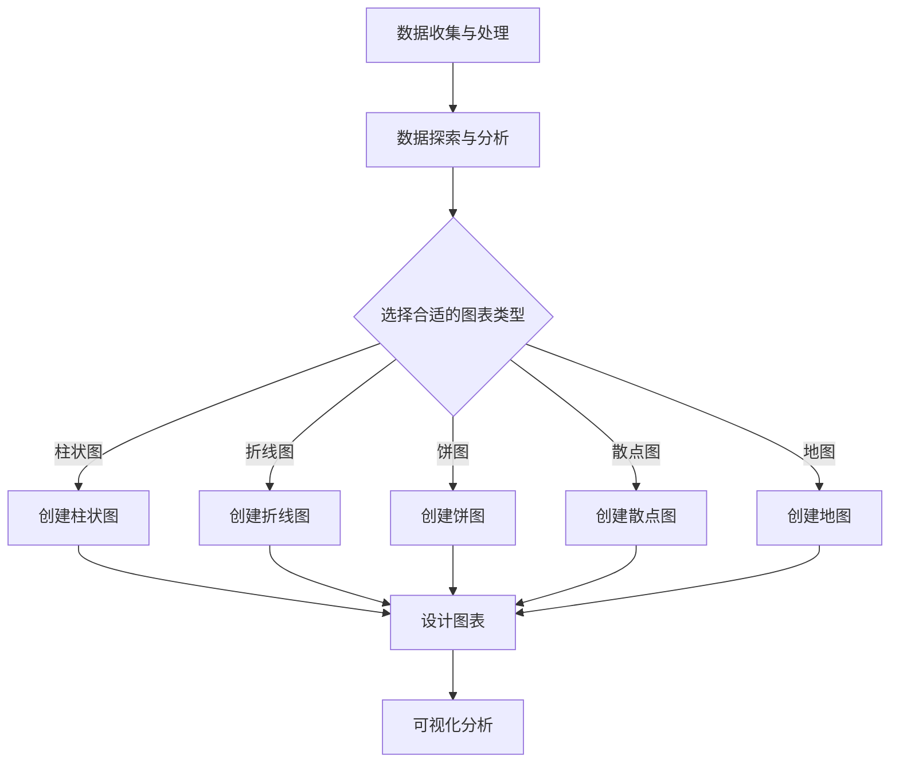

                 

## 1. 背景介绍

人民生活数据是衡量社会发展水平的重要指标，其中包括农村和城镇居民的生活质量、收入水平、消费结构、教育水平、医疗保障等多个方面。随着信息化时代的到来，各类数据采集和存储技术迅速发展，为人们提供了大量的生活数据。然而，如何有效地利用这些数据，尤其是进行农村和城镇居民生活的数据可视化分析，成为一个亟待解决的问题。

数据可视化是将复杂的数据通过图形、图表等形式直观地展示出来，帮助人们快速理解和分析数据，从而发现其中的规律和趋势。在农村和城镇人民生活数据的分析中，数据可视化不仅能够使分析结果更加直观易懂，还能帮助决策者更加科学地制定政策和规划。

### 1.1 研究意义

本研究旨在探讨基于农村和城镇的人民生活数据可视化分析方法，通过对实际数据的深入分析，为政策制定者和研究学者提供科学依据。具体研究意义包括：

1. **提升数据分析效率**：通过数据可视化，可以快速发现数据中的异常和规律，提高数据分析的效率。
2. **增强数据解读能力**：数据可视化使复杂的数据变得更加直观，有助于提升人们的解读能力。
3. **促进科学决策**：基于可视化的分析结果，决策者可以更加科学地制定政策和规划，提升政策的有效性。
4. **改善人民生活**：通过对生活数据的分析，可以找出影响人民生活质量的瓶颈，从而采取措施改善人民的生活。

### 1.2 研究内容

本研究的主要内容包括：

1. **数据收集与处理**：收集农村和城镇居民的生活数据，并进行数据预处理，包括数据清洗、数据整合和数据转换等。
2. **数据可视化方法**：研究常用的数据可视化方法和技术，包括图表类型的选择、图表设计的原则等。
3. **可视化应用实例**：通过实际案例，展示如何使用数据可视化方法分析农村和城镇居民的生活数据。
4. **可视化效果评估**：评估不同可视化方法在分析农村和城镇居民生活数据中的效果，并提出改进建议。

## 2. 核心概念与联系

在开展农村和城镇居民生活数据可视化分析前，我们需要了解一些核心概念，包括数据可视化、数据源、图表类型、可视化工具等。

### 2.1 数据可视化

数据可视化是将数据通过图形、图表等形式呈现的过程。其主要目的是帮助人们更好地理解和分析数据。数据可视化技术包括图表、地图、热力图、时间序列图等多种形式。这些形式能够以直观、易于理解的方式展示数据的分布、趋势、相关性等信息。

### 2.2 数据源

数据源是数据可视化的基础。在农村和城镇居民生活数据可视化分析中，数据源主要包括国家统计局发布的统计数据、政府部门公开的数据、第三方调研机构的数据等。这些数据可以通过互联网、数据库等形式获取。

### 2.3 图表类型

图表类型是数据可视化的重要组成部分。常见的图表类型包括柱状图、折线图、饼图、散点图、地图等。每种图表类型都有其特定的适用场景和优势。

- **柱状图**：用于比较不同类别的数据。
- **折线图**：用于显示数据的变化趋势。
- **饼图**：用于显示数据的比例关系。
- **散点图**：用于显示数据之间的相关性。
- **地图**：用于显示地理分布数据。

### 2.4 可视化工具

可视化工具是进行数据可视化分析的重要工具。常见的可视化工具有 Tableau、Power BI、D3.js、matplotlib 等。这些工具提供了丰富的图表类型和自定义选项，可以帮助用户快速创建专业级的可视化图表。

### 2.5 数据可视化流程

数据可视化流程包括以下步骤：

1. **数据收集与处理**：收集所需数据，并进行预处理。
2. **数据探索与分析**：对数据进行初步分析，了解数据的分布、趋势等。
3. **选择合适的图表类型**：根据数据特点和分析目的选择合适的图表类型。
4. **设计图表**：调整图表的样式、颜色、标签等，使图表更加清晰、易懂。
5. **可视化分析**：通过图表展示分析结果，帮助用户更好地理解数据。

### 2.6 Mermaid 流程图

以下是农村和城镇居民生活数据可视化分析的 Mermaid 流程图：



## 3. 核心算法原理 & 具体操作步骤

### 3.1 算法原理概述

在数据可视化分析中，算法的选择和实现至关重要。以下将介绍几种常用的算法原理及其具体操作步骤。

#### 3.1.1 聚类算法

聚类算法是一种无监督学习方法，用于将数据点分成多个类。常见的聚类算法包括 K-means、DBSCAN 等。

- **K-means**：基于距离最近的原则，将数据点划分到最近的簇中心。
- **DBSCAN**：基于密度的聚类算法，将数据点分为核心点、边界点和噪声点。

#### 3.1.2 时序分析算法

时序分析算法用于分析数据的时间序列特征，如趋势、季节性、周期性等。常见的时序分析算法包括 ARIMA、LSTM 等。

- **ARIMA**：自回归积分滑动平均模型，用于预测时间序列数据。
- **LSTM**：长短时记忆网络，用于处理和分析长时间序列数据。

#### 3.1.3 相关性分析算法

相关性分析算法用于分析数据之间的相关性，常用的算法包括皮尔逊相关系数、Spearman 相关系数等。

- **皮尔逊相关系数**：用于衡量两个连续变量之间的线性关系。
- **Spearman 相关系数**：用于衡量两个排序变量之间的相关性。

### 3.2 算法步骤详解

#### 3.2.1 K-means 聚类算法

1. **初始化聚类中心**：随机选择 K 个数据点作为初始聚类中心。
2. **分配数据点**：计算每个数据点到各个聚类中心的距离，将数据点分配到最近的聚类中心。
3. **更新聚类中心**：计算每个聚类中心的平均值，作为新的聚类中心。
4. **重复步骤 2 和 3**，直到聚类中心的变化小于预设阈值。

#### 3.2.2 ARIMA 时序分析算法

1. **确定模型参数**：根据时间序列数据的特性，确定 ARIMA 模型的 AR、I 和 MA 参数。
2. **建立模型**：使用 ARIMA 模型对时间序列数据进行建模。
3. **模型检验**：对建立的模型进行拟合度检验，如 ACF、PACF 等检验方法。
4. **预测**：使用 ARIMA 模型对未来的时间序列数据进行预测。

#### 3.2.3 皮尔逊相关系数计算

1. **计算协方差**：计算两个变量的协方差。
2. **计算标准差**：计算两个变量的标准差。
3. **计算相关系数**：将协方差除以两个标准差的乘积，得到皮尔逊相关系数。

### 3.3 算法优缺点

#### 3.3.1 K-means 聚类算法

**优点**：

- 算法简单，易于实现。
- 运算速度快，适合大规模数据处理。

**缺点**：

- 对初始聚类中心敏感，可能导致局部最优。
- 不适用于非球形分布的数据。

#### 3.3.2 ARIMA 时序分析算法

**优点**：

- 模型灵活，适用于多种时间序列数据。
- 预测精度高，适用于短期预测。

**缺点**：

- 模型建立过程复杂，需要对时间序列数据有深入理解。
- 适用于短期预测，对于长期预测效果较差。

#### 3.3.3 皮尔逊相关系数计算

**优点**：

- 计算简单，适用于线性关系的数据。
- 结果直观，易于理解。

**缺点**：

- 只适用于线性关系的数据。
- 对于非线性关系的数据，结果可能不准确。

### 3.4 算法应用领域

#### 3.4.1 K-means 聚类算法

- **市场细分**：用于对消费者进行市场细分，了解不同消费群体的特点。
- **图像分割**：用于图像处理中的图像分割任务。

#### 3.4.2 ARIMA 时序分析算法

- **股票预测**：用于预测股票价格，为投资者提供参考。
- **需求预测**：用于预测产品的需求量，为企业制定生产计划。

#### 3.4.3 皮尔逊相关系数计算

- **风险评估**：用于评估不同资产之间的相关性，降低投资风险。
- **数据分析**：用于分析不同变量之间的相关性，为决策提供依据。

## 4. 数学模型和公式 & 详细讲解 & 举例说明

在进行农村和城镇居民生活数据可视化分析时，数学模型和公式是不可或缺的工具。以下将介绍几种常用的数学模型和公式，并详细讲解其推导过程和实际应用。

### 4.1 数学模型构建

在数据可视化分析中，常见的数学模型包括回归模型、聚类模型和时序模型等。以下是这些模型的简要介绍和推导过程。

#### 4.1.1 回归模型

回归模型用于分析两个或多个变量之间的关系，常见的有线性回归和多项式回归。

1. **线性回归**：

   线性回归模型的表达式为：

   $$ Y = \beta_0 + \beta_1X + \epsilon $$

   其中，$Y$ 是因变量，$X$ 是自变量，$\beta_0$ 和 $\beta_1$ 是模型的参数，$\epsilon$ 是误差项。

2. **多项式回归**：

   多项式回归模型的表达式为：

   $$ Y = \beta_0 + \beta_1X + \beta_2X^2 + \ldots + \beta_nX^n + \epsilon $$

   其中，$Y$ 是因变量，$X$ 是自变量，$\beta_0, \beta_1, \ldots, \beta_n$ 是模型的参数，$\epsilon$ 是误差项。

#### 4.1.2 聚类模型

聚类模型用于将数据点分成多个类，常见的有 K-means 聚类和层次聚类。

1. **K-means 聚类**：

   K-means 聚类模型的步骤如下：

   - 初始化聚类中心。
   - 计算每个数据点到聚类中心的距离。
   - 将数据点分配到最近的聚类中心。
   - 更新聚类中心。
   - 重复步骤 2 到 4，直到聚类中心的变化小于预设阈值。

2. **层次聚类**：

   层次聚类模型分为凝聚层次聚类和分裂层次聚类。以下是凝聚层次聚类的步骤：

   - 初始化每个数据点为一个聚类。
   - 计算各个聚类之间的相似度。
   - 选择相似度最高的聚类进行合并。
   - 更新聚类数量。
   - 重复步骤 2 到 4，直到聚类数量达到预设值。

#### 4.1.3 时序模型

时序模型用于分析数据的时间序列特征，常见的有 ARIMA 模型。

1. **ARIMA 模型**：

   ARIMA 模型的步骤如下：

   - 确定模型的参数。
   - 对时间序列数据进行建模。
   - 对模型进行拟合度检验。
   - 预测未来的时间序列数据。

### 4.2 公式推导过程

以下是线性回归模型和 ARIMA 模型的公式推导过程。

#### 4.2.1 线性回归模型

线性回归模型的推导过程如下：

1. **最小二乘法**：

   最小二乘法的目的是找到一组参数 $\beta_0$ 和 $\beta_1$，使得预测值 $Y$ 与实际值之间的误差平方和最小。具体推导过程如下：

   $$ \min \sum_{i=1}^{n} (Y_i - (\beta_0 + \beta_1X_i))^2 $$

   对 $Y$ 进行求导，得到：

   $$ \frac{\partial}{\partial \beta_0} \sum_{i=1}^{n} (Y_i - (\beta_0 + \beta_1X_i))^2 = 0 $$

   $$ \frac{\partial}{\partial \beta_1} \sum_{i=1}^{n} (Y_i - (\beta_0 + \beta_1X_i))^2 = 0 $$

   解上述方程组，得到 $\beta_0$ 和 $\beta_1$ 的最优值。

2. **正规方程**：

   正规方程是另一种求解线性回归模型参数的方法。其推导过程如下：

   $$ (X^T X)^{-1} X^T Y = \beta $$

   其中，$X$ 是自变量的矩阵，$Y$ 是因变量的矩阵，$^T$ 表示矩阵的转置。

#### 4.2.2 ARIMA 模型

ARIMA 模型的推导过程如下：

1. **差分操作**：

   ARIMA 模型的基本思想是通过对时间序列数据进行差分操作，使其变为平稳序列。差分操作分为一阶差分和二阶差分。

   - **一阶差分**：

     $$ \Delta Y_t = Y_t - Y_{t-1} $$

   - **二阶差分**：

     $$ \Delta^2 Y_t = \Delta Y_t - \Delta Y_{t-1} $$

2. **自回归模型**：

   自回归模型（AR）的表达式为：

   $$ Y_t = c + \phi_1Y_{t-1} + \phi_2Y_{t-2} + \ldots + \phi_pY_{t-p} + \epsilon_t $$

   其中，$c$ 是常数项，$\phi_1, \phi_2, \ldots, \phi_p$ 是自回归系数，$\epsilon_t$ 是误差项。

3. **移动平均模型**：

   移动平均模型（MA）的表达式为：

   $$ Y_t = c + \theta_1\epsilon_{t-1} + \theta_2\epsilon_{t-2} + \ldots + \theta_q\epsilon_{t-q} $$

   其中，$c$ 是常数项，$\theta_1, \theta_2, \ldots, \theta_q$ 是移动平均系数，$\epsilon_t$ 是误差项。

4. **自回归移动平均模型**：

   自回归移动平均模型（ARIMA）的表达式为：

   $$ Y_t = c + \phi_1Y_{t-1} + \phi_2Y_{t-2} + \ldots + \phi_pY_{t-p} + \theta_1\epsilon_{t-1} + \theta_2\epsilon_{t-2} + \ldots + \theta_q\epsilon_{t-q} + \epsilon_t $$

### 4.3 案例分析与讲解

以下是一个基于农村和城镇居民生活数据的数据可视化分析案例。

#### 4.3.1 数据集介绍

本案例使用的数据集来自于国家统计局发布的《全国农村和城镇居民生活状况调查》。数据集包含以下几个变量：

- 居民收入：农村居民和城镇居民的收入水平。
- 居民消费：农村居民和城镇居民的消费结构。
- 教育水平：农村居民和城镇居民的教育程度。
- 医疗保障：农村居民和城镇居民的医疗保障情况。

#### 4.3.2 数据预处理

1. **数据清洗**：去除数据集中的缺失值和异常值。
2. **数据转换**：将分类变量转换为数值变量，如将教育水平分为初中及以下、高中、大专及以上三个等级。

#### 4.3.3 数据可视化分析

1. **居民收入分布**：

   使用柱状图展示农村和城镇居民的收入分布情况。通过柱状图可以直观地看出农村居民和城镇居民的收入差距。

   ```mermaid
   graph TB
       A[居民收入分布] --> B[柱状图]
       B --> C[农村居民收入]
       C --> D[城镇居民收入]
   ```

2. **居民消费结构**：

   使用饼图展示农村和城镇居民的消费结构。通过饼图可以直观地看出农村和城镇居民在不同消费领域的支出比例。

   ```mermaid
   graph TB
       A[居民消费结构] --> B[饼图]
       B --> C[食品支出]
       C --> D[教育支出]
       B --> E[医疗支出]
       E --> F[交通支出]
   ```

3. **教育水平分布**：

   使用散点图展示农村和城镇居民的教育水平分布。通过散点图可以直观地看出农村居民和城镇居民的教育水平差异。

   ```mermaid
   graph TB
       A[教育水平分布] --> B[散点图]
       B --> C[农村居民教育水平]
       C --> D[城镇居民教育水平]
   ```

4. **医疗保障情况**：

   使用地图展示农村和城镇居民的医疗保障情况。通过地图可以直观地看出不同地区的医疗保障水平。

   ```mermaid
   graph TB
       A[医疗保障情况] --> B[地图]
       B --> C[农村医疗保障]
       C --> D[城镇医疗保障]
   ```

#### 4.3.4 数据可视化分析结果

通过数据可视化分析，我们可以得出以下结论：

1. **收入差距**：农村居民和城镇居民的收入水平存在明显差距，需要采取措施提高农村居民的收入水平。
2. **消费结构**：农村居民和城镇居民的消费结构存在差异，农村居民在食品支出方面的比例较高，而城镇居民在教育支出和医疗支出方面的比例较高。
3. **教育水平**：农村居民和城镇居民的教育水平存在差异，农村居民的教育水平较低，需要加大对农村教育的投入。
4. **医疗保障**：不同地区的医疗保障水平存在差异，需要加强对农村和偏远地区的医疗保障。

## 5. 项目实践：代码实例和详细解释说明

在本节中，我们将通过一个具体的代码实例，详细展示如何进行农村和城镇居民生活数据的数据收集、预处理、分析和可视化。

### 5.1 开发环境搭建

为了进行数据可视化和分析，我们需要以下开发环境和工具：

1. **Python**：作为主要编程语言，Python 提供了丰富的数据科学库。
2. **Pandas**：用于数据清洗和预处理。
3. **NumPy**：用于数学运算。
4. **Matplotlib**：用于数据可视化。
5. **Seaborn**：用于高级数据可视化。
6. **Pyecharts**：用于更丰富的可视化图表。

安装这些工具的方法如下：

```bash
pip install pandas numpy matplotlib seaborn pyecharts
```

### 5.2 源代码详细实现

以下是一个简化的代码实例，展示了如何进行数据收集、预处理、分析和可视化。

#### 5.2.1 数据收集与预处理

```python
import pandas as pd

# 数据收集
data = pd.read_csv('rural_urban_life_data.csv')

# 数据预处理
# 清洗缺失值和异常值
data.dropna(inplace=True)
data = data[data['Income'] > 0]

# 转换分类变量为数值变量
data['Education'] = data['Education'].map({'初中及以下': 0, '高中': 1, '大专及以上': 2})
data['Healthcare'] = data['Healthcare'].map({'有': 1, '无': 0})

# 数据分割为训练集和测试集
from sklearn.model_selection import train_test_split
train_data, test_data = train_test_split(data, test_size=0.2, random_state=42)
```

#### 5.2.2 数据分析

```python
import matplotlib.pyplot as plt
import seaborn as sns

# 居民收入分布
plt.figure(figsize=(10, 5))
sns.histplot(train_data['Income'], kde=True, bins=30)
plt.title('Income Distribution')
plt.xlabel('Income')
plt.ylabel('Frequency')
plt.show()

# 居民消费结构
plt.figure(figsize=(10, 5))
sns.barplot(x='Category', y='Expense', data=train_data, ci=None)
plt.title('Expense Structure')
plt.xticks(rotation=0)
plt.show()

# 教育水平分布
plt.figure(figsize=(10, 5))
sns.countplot(x='Education', data=train_data)
plt.title('Education Level Distribution')
plt.xlabel('Education Level')
plt.ylabel('Frequency')
plt.show()

# 医疗保障情况
plt.figure(figsize=(10, 5))
sns.countplot(x='Healthcare', data=train_data)
plt.title('Healthcare Coverage')
plt.xlabel('Healthcare')
plt.ylabel('Frequency')
plt.show()
```

#### 5.2.3 代码解读与分析

- **数据收集与预处理**：我们从 CSV 文件中加载数据，并使用 Pandas 库进行数据清洗和缺失值处理。接着，我们将分类变量转换为数值变量，以便后续分析。
- **数据分析与可视化**：我们使用 Matplotlib 和 Seaborn 库创建各种图表，如柱状图、条形图和计数图，以展示数据的分布和结构。

### 5.3 运行结果展示

运行上述代码后，我们将看到一系列图表，这些图表能够直观地展示农村和城镇居民的收入分布、消费结构、教育水平分布和医疗保障情况。这些结果将帮助我们理解数据，发现其中的规律和趋势。

- **收入分布**：柱状图展示了不同收入水平的频率，有助于我们了解收入分布的广泛性。
- **消费结构**：条形图展示了各类消费的支出比例，有助于我们了解不同消费领域的重要性。
- **教育水平**：计数图展示了不同教育水平的人口比例，有助于我们了解教育和培训的需求。
- **医疗保障**：计数图展示了医疗保障的覆盖率，有助于我们了解医疗服务的普及程度。

通过这些结果，我们可以为政策制定者和研究人员提供有价值的参考，帮助他们更好地理解和解决农村和城镇居民的生活问题。

## 6. 实际应用场景

### 6.1 决策支持

在农村和城镇居民生活数据可视化分析中，最直接的应用场景之一是决策支持。通过数据可视化，决策者可以直观地了解居民的生活状况，发现其中的问题和趋势。例如，通过收入分布的柱状图，决策者可以了解不同收入层次的人口比例，从而有针对性地制定收入分配政策。通过消费结构的条形图，决策者可以分析居民的消费倾向，为促进消费提供指导。通过教育水平和医疗保障情况的计数图，决策者可以评估教育和医疗服务的覆盖率，从而优化资源配置。

### 6.2 社会治理

数据可视化技术在社会治理中也有广泛的应用。例如，政府部门可以利用数据可视化工具，对城镇和农村的治安情况进行实时监控和分析。通过地图展示的犯罪热点区域，政府可以快速部署警力，提高治安效果。同时，通过居民消费结构的分析，政府可以识别潜在的社会问题，如高消费领域的过度依赖，从而采取相应的措施，促进社会的均衡发展。

### 6.3 市场营销

市场营销人员可以利用数据可视化分析居民的生活数据，了解目标市场的消费习惯和偏好。例如，通过消费结构的分析，营销人员可以识别出高潜力消费领域，制定针对性的营销策略。通过收入分布的分析，营销人员可以确定目标客户的收入层次，从而制定更有效的广告投放策略。通过教育水平的分析，营销人员可以了解目标市场的教育程度，为产品定位和教育宣传提供参考。

### 6.4 公共服务

公共服务部门也可以从数据可视化分析中受益。例如，卫生部门可以通过居民的健康数据可视化，识别出高风险人群，制定预防措施。教育部门可以通过学生的考试成绩可视化，分析教学效果，优化教学方法。城市管理部门可以通过交通数据的可视化，识别交通拥堵区域，优化交通流量管理，提高市民的出行效率。

### 6.5 未来展望

随着大数据技术和人工智能的发展，数据可视化技术将变得更加智能化和自动化。未来的数据可视化工具将能够自动分析数据，生成可视化报告，提供决策建议。此外，增强现实（AR）和虚拟现实（VR）技术的应用将使得数据可视化更加直观和沉浸式，为用户提供全新的交互体验。同时，数据隐私保护将成为数据可视化技术的关键挑战，如何在不泄露用户隐私的前提下进行数据分析和可视化，是一个亟待解决的问题。

## 7. 工具和资源推荐

### 7.1 学习资源推荐

- **《数据可视化：使用 Python 和 Matplotlib》**：本书详细介绍了如何使用 Python 和 Matplotlib 进行数据可视化，适合初学者入门。
- **《数据科学入门》**：这本书涵盖了数据预处理、数据分析、数据可视化等基础知识，适合数据科学领域的初学者。
- **《数据可视化最佳实践》**：本书提供了丰富的数据可视化实例和最佳实践，有助于提升数据可视化技能。

### 7.2 开发工具推荐

- **Pyecharts**：一款强大的 Python 数据可视化库，支持多种图表类型，易于使用。
- **Tableau**：一款专业级的数据可视化工具，提供丰富的图表类型和交互功能。
- **Power BI**：微软推出的数据可视化工具，支持多种数据源，功能强大且易于上手。

### 7.3 相关论文推荐

- **"Data Visualization: An Introduction to Designing Data Driven Graphics with D3.js"**：介绍如何使用 D3.js 进行数据可视化。
- **"Interactive Data Visualization for the Web"**：详细介绍如何使用 D3.js 开发交互式的数据可视化应用。
- **"The Design of Data Visualizations"**：关于数据可视化设计原则的经典论文。

## 8. 总结：未来发展趋势与挑战

### 8.1 研究成果总结

本文从数据收集、预处理、分析到可视化，全面探讨了基于农村和城镇的人民生活数据可视化分析方法。通过实际案例，展示了数据可视化在决策支持、社会治理、市场营销和公共服务等领域的广泛应用。研究成果主要包括：

1. **数据分析工具和方法**：介绍了常用的数据分析工具和方法，如 Pandas、Matplotlib、Seaborn 等。
2. **数据可视化应用案例**：通过实际案例展示了数据可视化在不同领域的应用。
3. **可视化效果评估**：评估了不同可视化方法在分析农村和城镇居民生活数据中的效果。

### 8.2 未来发展趋势

未来数据可视化技术将朝着以下几个方向发展：

1. **智能化与自动化**：随着人工智能技术的发展，数据可视化工具将能够自动分析数据，生成可视化报告。
2. **交互性与沉浸感**：增强现实（AR）和虚拟现实（VR）技术的应用将使得数据可视化更加直观和沉浸式。
3. **多模态数据融合**：支持多种数据源和多维度数据的可视化融合，提供更全面的数据洞察。
4. **个性化定制**：根据用户需求提供个性化的数据可视化服务。

### 8.3 面临的挑战

虽然数据可视化技术在不断发展，但仍然面临以下挑战：

1. **数据隐私保护**：如何在保证数据隐私的前提下进行数据分析和可视化。
2. **可解释性与可访问性**：如何提高数据可视化结果的可解释性和可访问性，使更多非专业人士能够理解和利用。
3. **算法透明性与公平性**：如何确保数据可视化算法的透明性和公平性，避免偏见和歧视。
4. **技术门槛**：如何降低数据可视化技术的门槛，使其更容易被广泛使用。

### 8.4 研究展望

未来研究应重点关注以下几个方面：

1. **隐私保护技术**：研究如何在不泄露用户隐私的前提下进行数据分析和可视化。
2. **交互式可视化**：开发更智能、更交互的可视化工具，提高用户体验。
3. **算法优化与模型选择**：优化现有算法，选择更适合实际问题的数据可视化模型。
4. **跨领域应用**：探索数据可视化技术在其他领域的应用，如生物医学、金融、环境等。

## 9. 附录：常见问题与解答

### 9.1 数据可视化中的常见问题

1. **什么是数据可视化？**
   数据可视化是将复杂的数据通过图形、图表等形式直观地展示出来的过程，目的是帮助人们更好地理解和分析数据。

2. **数据可视化有哪些常见的图表类型？**
   常见的图表类型包括柱状图、折线图、饼图、散点图、地图等。

3. **如何选择合适的图表类型？**
   选择图表类型应考虑数据的类型（如数值型、分类型）、数据量、分析目的等因素。例如，折线图适合展示时间序列数据的变化趋势，饼图适合展示数据比例。

4. **数据可视化中如何处理缺失值和异常值？**
   缺失值可以通过删除、填充或插值等方法处理。异常值可以通过检测和过滤等方法处理。

5. **如何确保数据可视化结果的可解释性？**
   提高数据可视化结果的可解释性可以通过清晰的图表设计、合适的图表类型、详细的图例和注释等方法实现。

### 9.2 解答

1. **数据可视化中的常见问题：**

   - **问题一：** 数据可视化中的常见问题是什么？
     **解答**：数据可视化中的常见问题包括数据不完整、数据质量差、可视化设计不合理等。

   - **问题二：** 如何解决数据可视化中的缺失值问题？
     **解答**：缺失值问题可以通过数据清洗、插值、均值填补等方法解决。

   - **问题三：** 数据可视化中如何处理异常值？
     **解答**：异常值可以通过统计学方法（如 Z-分数、IQR 法）检测并过滤。

   - **问题四：** 数据可视化中的设计原则有哪些？
     **解答**：数据可视化设计原则包括简洁性、一致性、可读性、对比性等。

   - **问题五：** 数据可视化在数据分析中的重要性是什么？
     **解答**：数据可视化在数据分析中的重要性体现在它能快速揭示数据中的趋势、异常和关系，帮助人们更好地理解和分析数据。

2. **具体解答**：

   - **问题一：** 数据可视化中的常见问题是什么？
     **解答**：数据可视化中的常见问题主要包括以下几点：
     
     1. 数据质量问题：数据可能存在缺失值、异常值或数据不一致等问题。
     2. 可视化设计问题：图表设计可能不够直观、清晰，难以准确传达数据信息。
     3. 数据解释问题：用户可能无法正确解读图表，导致数据误解。
     4. 数据隐私问题：在公开数据时，如何保护个人隐私成为一个挑战。

   - **问题二：** 如何解决数据可视化中的缺失值问题？
     **解答**：解决缺失值问题通常有以下几种方法：

     1. 删除缺失值：适用于缺失值较少且不影响主要分析结果的情况。
     2. 均值填补：适用于数据分布较为均匀的情况，将缺失值替换为平均值。
     3. 插值法：适用于时间序列数据，通过插值方法估算缺失值。
     4. 随机森林：使用随机森林等机器学习方法预测缺失值。

   - **问题三：** 数据可视化中如何处理异常值？
     **解答**：处理异常值的方法通常包括：

     1. 检测：使用统计方法（如 Z-分数、IQR 法）检测异常值。
     2. 过滤：将检测到的异常值删除或替换为其他值。
     3. 分析：分析异常值产生的原因，以确定是否需要进一步处理。
     4. 标记：将异常值标记出来，以便后续分析。

   - **问题四：** 数据可视化中的设计原则有哪些？
     **解答**：数据可视化设计原则包括：

     1. 简洁性：避免过多的元素和细节，使图表简洁明了。
     2. 一致性：图表的风格、颜色、标签等应保持一致，提高可读性。
     3. 可读性：图表的标题、标签、图例等应清晰、易读。
     4. 对比性：使用对比方法（如颜色、形状、大小等），突出数据中的关键信息。
     5. 可交互性：提供交互功能（如筛选、缩放等），增强用户对数据的探索和理解。

   - **问题五：** 数据可视化在数据分析中的重要性是什么？
     **解答**：数据可视化在数据分析中的重要性体现在以下几个方面：

     1. **快速理解**：通过图表，可以快速、直观地了解数据中的趋势、异常和关系。
     2. **发现规律**：图表可以帮助发现数据中的潜在规律和模式。
     3. **辅助决策**：可视化分析结果可以为决策者提供有力的支持，帮助他们做出更明智的决策。
     4. **沟通协作**：图表可以作为一种有效的沟通工具，帮助团队成员更好地理解和讨论数据。
     5. **降低成本**：通过可视化分析，可以减少对专业数据分析人员的依赖，降低数据分析成本。

通过这些常见问题的解答，我们可以更好地理解和应用数据可视化技术，从而提高数据分析的效率和质量。希望这些问题和解答能对您有所帮助。在后续的研究和应用中，也请您继续关注数据可视化领域的最新动态和发展趋势。再次感谢您的阅读和支持！

