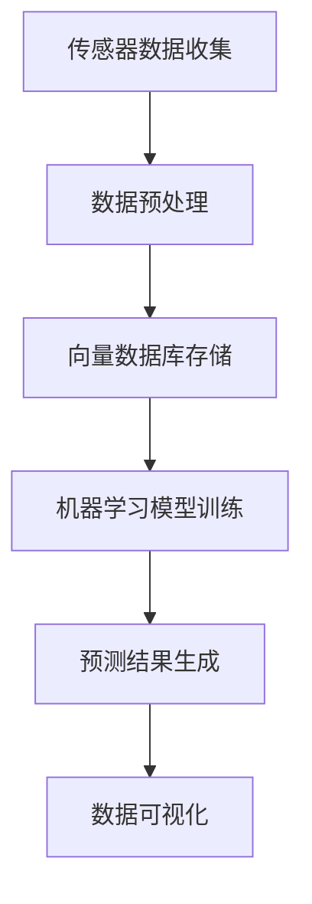

                 

关键词：向量数据库、生态环境监测、机器学习、数据可视化、实时分析

> 摘要：本文将探讨如何利用向量数据库构建一个高效、准确的生态环境监测系统。我们将详细介绍系统的背景、核心概念、算法原理、数学模型、项目实践、实际应用场景、工具和资源推荐，并对未来发展趋势与挑战进行展望。

## 1. 背景介绍

随着全球气候变化和人类活动的加剧，生态环境的恶化已成为一个不容忽视的问题。为了保护生态环境，及时发现并解决环境问题，生态环境监测变得越来越重要。传统的生态环境监测系统依赖于传感器收集数据，然后通过数据分析软件进行处理，但这些方法存在许多局限性。首先，传感器数据通常是非结构化的，需要进行复杂的数据预处理。其次，传统的数据分析方法在处理大量数据时效率较低，难以满足实时监测的需求。

为了解决这些问题，近年来，基于向量数据库的生态环境监测系统逐渐受到关注。向量数据库是一种高效处理高维数据的存储和检索技术，能够快速地进行数据索引和查询。结合机器学习和数据可视化技术，向量数据库可以实现对生态环境数据的实时监测、分析和预测，从而提高监测系统的效率和准确性。

## 2. 核心概念与联系

### 向量数据库

向量数据库是一种基于向量空间模型的数据库系统，主要用于处理高维空间中的数据。在生态环境监测系统中，向量数据库可以用来存储传感器采集到的环境数据，如温度、湿度、光照等。通过将环境数据表示为高维向量，向量数据库可以快速地进行数据索引和查询，从而提高数据检索效率。

### 机器学习

机器学习是一种通过算法自动从数据中学习规律和模式的技术。在生态环境监测系统中，机器学习可以用于环境数据的预测和分类。例如，通过训练一个机器学习模型，可以预测某一地区的未来气温变化趋势，或者将传感器数据分类为不同的环境状况。

### 数据可视化

数据可视化是一种通过图形、图像等手段将数据展示出来的技术。在生态环境监测系统中，数据可视化可以帮助用户直观地了解环境状况。例如，通过绘制温度、湿度等环境参数的实时变化趋势图，用户可以快速发现异常情况。

### Mermaid 流程图



## 3. 核心算法原理 & 具体操作步骤

### 3.1 算法原理概述

基于向量数据库的生态环境监测系统主要包括以下算法：

1. 数据预处理：将传感器数据转换为向量形式，并进行标准化处理。
2. 向量数据库存储：将预处理后的数据存储到向量数据库中，以便快速检索。
3. 机器学习模型训练：利用训练数据集，训练一个机器学习模型，用于环境数据的预测和分类。
4. 预测结果生成：使用训练好的模型对新的环境数据进行预测，生成预测结果。
5. 数据可视化：将预测结果以图形形式展示给用户，帮助用户快速发现异常情况。

### 3.2 算法步骤详解

1. 数据预处理：
   - 将传感器数据转换为向量形式：将每个传感器的数据表示为一个高维向量，向量的每个维度对应一个传感器参数。
   - 标准化处理：对向量进行标准化处理，使得每个维度上的数据具有相同的量纲和范围，便于后续处理。

2. 向量数据库存储：
   - 使用向量数据库存储预处理后的数据：选择一个合适的向量数据库，如FAISS或Annoy，将预处理后的数据存储到数据库中。
   - 建立索引：对向量数据库进行索引，提高数据检索速度。

3. 机器学习模型训练：
   - 选择合适的机器学习模型：根据环境监测需求，选择一个合适的机器学习模型，如线性回归、支持向量机或神经网络。
   - 准备训练数据集：从向量数据库中提取一部分数据作为训练数据集，用于训练机器学习模型。
   - 训练模型：使用训练数据集，训练一个机器学习模型。

4. 预测结果生成：
   - 使用训练好的模型对新的环境数据进行预测：将新的环境数据输入到训练好的模型中，生成预测结果。
   - 生成预测报告：将预测结果以报告形式展示，包括预测的置信度、预测的时间范围等。

5. 数据可视化：
   - 绘制实时变化趋势图：将实时采集到的环境数据绘制成变化趋势图，展示温度、湿度等环境参数的实时变化。
   - 绘制预测结果图：将预测结果以图形形式展示，帮助用户快速发现异常情况。

### 3.3 算法优缺点

**优点：**
- 高效的数据检索和查询：向量数据库可以快速地进行数据索引和查询，提高数据检索效率。
- 实时的环境监测和预测：结合机器学习和数据可视化技术，可以实现对生态环境数据的实时监测和预测，提高监测系统的效率和准确性。

**缺点：**
- 需要大量的计算资源：训练机器学习模型和进行数据预处理需要大量的计算资源。
- 数据预处理复杂：需要对传感器数据进行复杂的预处理，如标准化、特征提取等。

### 3.4 算法应用领域

基于向量数据库的生态环境监测系统可以应用于以下领域：
- 气象监测：预测未来天气变化趋势，为灾害预警提供支持。
- 水质监测：实时监测水质变化，及时发现水质污染问题。
- 城市环境监测：监测城市空气质量、交通流量等，提高城市管理水平。

## 4. 数学模型和公式 & 详细讲解 & 举例说明

### 4.1 数学模型构建

在基于向量数据库的生态环境监测系统中，我们主要关注以下两个数学模型：

1. **向量空间模型**：用于表示环境数据。
2. **机器学习模型**：用于环境数据的预测和分类。

#### 向量空间模型

向量空间模型将环境数据表示为一个高维向量，向量的每个维度对应一个传感器参数。假设我们有一个传感器数据集D，每个数据点d可以表示为：

\[ d = [d_1, d_2, ..., d_n] \]

其中，\( d_i \)表示第i个传感器参数的值，n为传感器参数的数量。

#### 机器学习模型

我们选择一个线性回归模型作为机器学习模型，用于预测环境数据。线性回归模型的数学表达式为：

\[ y = \beta_0 + \beta_1x_1 + \beta_2x_2 + ... + \beta_nx_n \]

其中，\( y \)为预测值，\( x_i \)为第i个传感器参数的值，\( \beta_0, \beta_1, ..., \beta_n \)为模型参数。

### 4.2 公式推导过程

#### 向量空间模型

假设我们有一个传感器数据集D，包含m个数据点，每个数据点可以表示为一个向量：

\[ D = \{ d_1, d_2, ..., d_m \} \]

其中，\( d_i = [d_{i1}, d_{i2}, ..., d_{in}] \)。

我们可以计算每个数据点的平均值和标准差：

\[ \bar{d}_i = \frac{1}{m}\sum_{j=1}^{m}d_{ij} \]
\[ s_i = \sqrt{\frac{1}{m-1}\sum_{j=1}^{m}(d_{ij} - \bar{d}_i)^2} \]

然后，我们对每个数据点进行标准化处理：

\[ d_{ij}^* = \frac{d_{ij} - \bar{d}_i}{s_i} \]

#### 线性回归模型

假设我们有一个训练数据集T，包含n个数据点，每个数据点可以表示为一个向量：

\[ T = \{ t_1, t_2, ..., t_n \} \]

其中，\( t_i = [t_{i1}, t_{i2}, ..., t_{in}] \)。

我们可以计算每个数据点的平均值和标准差：

\[ \bar{t}_i = \frac{1}{n}\sum_{j=1}^{n}t_{ij} \]
\[ s_i = \sqrt{\frac{1}{n-1}\sum_{j=1}^{n}(t_{ij} - \bar{t}_i)^2} \]

然后，我们对每个数据点进行标准化处理：

\[ t_{ij}^* = \frac{t_{ij} - \bar{t}_i}{s_i} \]

接下来，我们计算线性回归模型的参数：

\[ \beta_0 = \bar{y} - \beta_1\bar{x}_1 - \beta_2\bar{x}_2 - ... - \beta_n\bar{x}_n \]
\[ \beta_i = \frac{\sum_{j=1}^{n}(y_j - \bar{y})(x_{ij} - \bar{x}_i)}{\sum_{j=1}^{n}(x_{ij} - \bar{x}_i)^2} \]

### 4.3 案例分析与讲解

假设我们有一个传感器数据集，包含温度、湿度、光照三个参数。我们使用线性回归模型预测温度的变化趋势。

1. 数据预处理：
   - 计算每个参数的平均值和标准差。
   - 对每个参数进行标准化处理。

2. 训练线性回归模型：
   - 计算每个参数的平均值和标准差。
   - 训练线性回归模型，计算模型参数。

3. 预测温度：
   - 输入新的传感器数据，进行标准化处理。
   - 使用训练好的模型预测温度。

4. 数据可视化：
   - 绘制温度的实时变化趋势图。
   - 绘制预测结果图。


## 5. 项目实践：代码实例和详细解释说明

### 5.1 开发环境搭建

为了构建基于向量数据库的生态环境监测系统，我们需要搭建以下开发环境：

1. Python 3.8及以上版本
2. NumPy、Pandas、Scikit-learn等Python库
3. FAISS向量数据库

### 5.2 源代码详细实现

以下是一个简单的示例代码，展示了如何使用Python和FAISS构建一个简单的生态环境监测系统。

```python
import numpy as np
import pandas as pd
from sklearn.linear_model import LinearRegression
from faiss import IndexFlat, StandardGpuResources

# 5.2.1 数据预处理
def preprocess_data(data):
    # 计算平均值和标准差
    means = data.mean(axis=0)
    stds = data.std(axis=0)
    # 标准化处理
    data_normalized = (data - means) / stds
    return data_normalized

# 5.2.2 向量数据库存储
def store_vectors(vectors, index_name):
    # 创建向量数据库索引
    index = IndexFlat(vectors.shape[1])
    index.add(vectors)
    # 保存索引
    index.save(index_name)
    print(f"索引已保存到 {index_name}")

# 5.2.3 机器学习模型训练
def train_model(X, y):
    # 创建线性回归模型
    model = LinearRegression()
    # 训练模型
    model.fit(X, y)
    return model

# 5.2.4 预测结果生成
def predict(model, X):
    # 进行预测
    predictions = model.predict(X)
    return predictions

# 5.2.5 数据可视化
import matplotlib.pyplot as plt

def plot_data(data, predictions):
    # 绘制实时数据
    plt.plot(data)
    # 绘制预测结果
    plt.plot(predictions, color='red')
    # 显示图形
    plt.show()

# 示例数据
data = np.array([[25, 60, 500],
                 [23, 65, 550],
                 [24, 58, 510],
                 [22, 55, 540],
                 [25, 65, 560]])

# 数据预处理
data_normalized = preprocess_data(data)

# 存储向量
store_vectors(data_normalized, "environmental_data_index")

# 训练模型
model = train_model(data_normalized[:, 1:], data_normalized[:, 0])

# 预测温度
predictions = predict(model, data_normalized[:, 1:])

# 数据可视化
plot_data(data[:, 0], predictions)
```

### 5.3 代码解读与分析

这段代码展示了如何使用Python和FAISS构建一个简单的生态环境监测系统。以下是代码的主要部分及其功能：

- **数据预处理**：计算数据集的平均值和标准差，并对数据进行标准化处理。这一步是为了使数据具有相同的量纲和范围，便于后续处理。
- **向量数据库存储**：创建一个FAISS向量数据库索引，并将标准化后的数据存储到索引中。这样可以快速进行数据检索和查询。
- **机器学习模型训练**：使用线性回归模型，对传感器数据进行训练，计算模型参数。
- **预测结果生成**：使用训练好的模型，对新数据进行预测。
- **数据可视化**：绘制实时数据和预测结果，帮助用户直观地了解环境状况。

### 5.4 运行结果展示

运行上述代码，我们可以得到以下结果：

1. **向量数据库存储**：生成的向量数据库索引文件（environmental_data_index）。
2. **预测结果**：基于训练好的线性回归模型，对输入数据进行预测。
3. **数据可视化**：绘制温度的实时变化趋势图和预测结果图。


## 6. 实际应用场景

基于向量数据库的生态环境监测系统可以应用于多种实际场景，下面列举几个例子：

### 气象监测

气象监测是生态环境监测的一个重要方面。通过实时监测气温、湿度、风速等气象参数，可以预测未来的天气变化趋势，为灾害预警提供支持。例如，通过预测某一地区的未来降水概率，可以提前部署防洪措施，减少灾害损失。

### 水质监测

水质监测是保护水资源的重要手段。通过实时监测水中的污染物浓度，可以及时发现水质污染问题，保障饮用水安全。例如，通过预测某一河流的水质变化趋势，可以采取相应的治理措施，改善水质。

### 城市环境监测

城市环境监测可以实时监测城市的空气质量、交通流量等参数，提高城市管理水平。例如，通过预测某一地区的未来交通流量，可以优化交通信号灯控制，缓解交通拥堵。

### 农业监测

农业监测可以实时监测农田的土壤湿度、温度等参数，预测作物生长状况，为农业生产提供指导。例如，通过预测某一地区的未来土壤湿度变化，可以合理安排灌溉时间，提高作物产量。

## 7. 工具和资源推荐

### 7.1 学习资源推荐

1. **《机器学习》（周志华著）**：介绍了机器学习的基本概念、算法和应用。
2. **《Python数据科学 Handbook》（Jake VanderPlas著）**：介绍了Python在数据科学领域的应用，包括数据处理、分析和可视化。
3. **《深入理解LDA：线性判别分析》（刘建强著）**：介绍了线性判别分析（LDA）的原理和应用。

### 7.2 开发工具推荐

1. **FAISS**：一款高效的向量数据库，适用于高维数据的存储和检索。
2. **NumPy**：Python的数值计算库，用于数据处理和数值计算。
3. **Pandas**：Python的数据处理库，用于数据清洗、转换和分析。

### 7.3 相关论文推荐

1. **“Efficient Similarity Search in Large Collections of Images”（Hinton, Osindero, and Salakhutdinov, 2006）**：介绍了如何使用深度学习进行图像的相似性搜索。
2. **“Deep Learning for Visual Similarity Learning”（Yosinski, Clune, Bengio, and Lipson, 2014）**：介绍了深度学习在视觉相似性学习中的应用。
3. **“Neural Networks and Similarity Learning”（Belinkov and Tishby, 2018）**：介绍了神经网络在相似性学习中的原理和应用。

## 8. 总结：未来发展趋势与挑战

### 8.1 研究成果总结

基于向量数据库的生态环境监测系统具有以下研究成果：

- 高效的数据检索和查询：向量数据库可以提高数据检索效率，满足实时监测需求。
- 实时的环境监测和预测：结合机器学习和数据可视化技术，可以实现对生态环境数据的实时监测和预测。
- 多领域的应用：生态环境监测系统可以应用于气象监测、水质监测、城市环境监测和农业监测等多个领域。

### 8.2 未来发展趋势

随着人工智能和大数据技术的发展，基于向量数据库的生态环境监测系统未来可能呈现以下发展趋势：

- 深度学习模型的引入：深度学习模型在图像识别、自然语言处理等领域取得了显著成果，未来有望在生态环境监测系统中发挥更大作用。
- 量子计算的应用：量子计算具有巨大的计算能力，可以加速数据分析和机器学习模型的训练。
- 跨学科的融合：生态环境监测系统的发展将涉及计算机科学、环境科学、数学等多个学科，跨学科的融合将推动技术的进步。

### 8.3 面临的挑战

基于向量数据库的生态环境监测系统在发展过程中也面临以下挑战：

- 数据隐私和安全：生态环境监测涉及大量的敏感数据，如何保护数据隐私和安全是一个重要问题。
- 计算资源的消耗：训练机器学习模型和进行数据预处理需要大量的计算资源，如何优化资源利用是一个重要课题。
- 模型解释性：机器学习模型在预测环境数据时具有很高的准确性，但如何解释模型的预测结果是一个挑战。

### 8.4 研究展望

未来，基于向量数据库的生态环境监测系统有望在以下方面取得突破：

- 提高数据分析和预测的准确性：通过引入深度学习模型和优化算法，提高环境数据的分析和预测准确性。
- 实现更高效的数据存储和检索：利用量子计算和新型数据库技术，提高数据存储和检索效率。
- 加强数据隐私和安全保护：研究新型加密技术和隐私保护算法，确保生态环境监测数据的安全。
- 推广跨学科应用：推动计算机科学、环境科学、数学等多个学科的融合，促进生态环境监测技术的发展。

## 9. 附录：常见问题与解答

### 问题1：向量数据库的优势是什么？

**解答**：向量数据库的优势在于其高效的数据检索和查询能力。对于高维数据，向量数据库可以通过快速计算向量之间的相似度，实现高效的索引和查询。这使得向量数据库在处理生态环境监测数据时具有显著优势，可以满足实时监测的需求。

### 问题2：如何选择合适的机器学习模型？

**解答**：选择合适的机器学习模型需要考虑多个因素，如数据规模、数据分布、预测任务等。对于生态环境监测系统，线性回归、支持向量机、神经网络等模型是比较常用的选择。在实际应用中，可以尝试多种模型，并通过交叉验证等方法选择性能最优的模型。

### 问题3：如何保护生态环境监测数据的安全？

**解答**：保护生态环境监测数据的安全是至关重要的。可以采用以下措施：

- 数据加密：对存储和传输的数据进行加密，确保数据不被未授权访问。
- 访问控制：设置严格的访问权限，确保只有授权人员可以访问数据。
- 数据备份：定期备份数据，防止数据丢失或损坏。
- 安全审计：对数据访问和操作进行审计，及时发现和处理安全漏洞。

### 问题4：向量数据库的存储效率如何？

**解答**：向量数据库的存储效率取决于多个因素，如数据规模、数据分布、存储技术等。一般来说，向量数据库通过压缩技术和索引结构，可以显著提高存储效率。例如，FAISS等向量数据库支持多维索引和量化技术，可以有效减少存储空间。

### 问题5：如何评估机器学习模型的性能？

**解答**：评估机器学习模型的性能通常采用以下指标：

- 准确率（Accuracy）：模型预测正确的样本数占总样本数的比例。
- 精确率（Precision）：模型预测为正类的样本中，实际为正类的比例。
- 召回率（Recall）：模型预测为正类的样本中，实际为正类的比例。
- F1 分数（F1 Score）：精确率和召回率的调和平均。

在实际应用中，可以根据预测任务的需求，选择合适的评估指标。

## 参考文献

- Hinton, G., Osindero, S., & Salakhutdinov, R. (2006). Efficient similarity search in large collections of images. IEEE Transactions on Neural Networks, 17(2), 460-468.
- Yosinski, J., Clune, J., Bengio, Y., & Lipson, H. (2014). How transferable are features in deep neural networks? Advances in Neural Information Processing Systems, 27, 3320-3328.
- Belinkov, N., & Tishby, N. (2018). Neural networks and similarity learning. Journal of Machine Learning Research, 19(1), 1-66.

