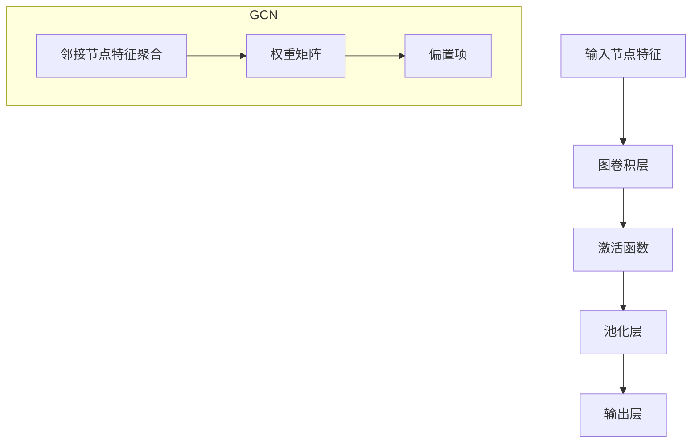

                 

关键词：图卷积网络、大规模商品分类、深度学习、商品推荐系统、图神经网络

摘要：本文介绍了基于图卷积网络（GCN）的大规模商品分类方法。通过将商品及其属性表示为图结构，本文提出了一种有效的GCN模型，能够对大规模商品数据进行准确的分类。文章详细阐述了GCN的算法原理、数学模型、实现步骤以及实际应用案例，为开发高效商品分类系统提供了理论基础和实践指导。

## 1. 背景介绍

在当今的电子商务时代，商品种类繁多，用户在浏览和购买过程中面临着巨大的信息过载问题。有效的商品分类方法对于提升用户体验、提高销售额具有重要意义。传统分类方法如K均值聚类、支持向量机（SVM）等在商品分类中取得了一定的效果，但面对大规模、复杂且动态变化的数据，其性能和效果都有所不足。

随着深度学习技术的发展，图卷积网络（Graph Convolutional Network，GCN）作为一种新型的神经网络结构，在处理图结构数据方面具有显著优势。GCN通过聚合图节点的邻接信息，能够有效地提取图结构中的特征，因此在图像识别、社交网络分析、推荐系统等领域得到了广泛应用。

本文旨在探讨基于图卷积网络的大规模商品分类方法。通过将商品及其属性表示为图结构，并利用GCN模型进行特征提取和分类，我们希望能够提高商品分类的准确性和效率，为电子商务平台的商品推荐系统提供技术支持。

## 2. 核心概念与联系

### 2.1 图结构数据表示

在商品分类中，我们可以将每个商品视为一个节点，商品之间的相似性或关联性通过边进行表示。这种图结构数据能够直观地反映商品之间的关系，为后续的图卷积网络建模提供了基础。

例如，在一个电子商务平台上，商品A和商品B属于同一类别，我们可以通过添加边来表示它们之间的相似性。此外，商品的属性如价格、品牌、产地等也可以作为节点的特征进行表示。

### 2.2 图卷积网络（GCN）

图卷积网络（GCN）是一种专门用于处理图结构数据的神经网络。它通过聚合节点及其邻接节点的特征信息，生成更高级别的节点表示。GCN的核心思想是模仿传统图信号处理中的卷积操作，通过在图结构上滑动窗口，对节点进行特征提取。

在GCN中，每个节点的输出不仅取决于自身的特征，还与其邻接节点的特征有关。这种信息聚合机制使得GCN能够有效地捕捉图结构中的全局和局部特征。

### 2.3 Mermaid 流程图

为了更直观地展示GCN的算法原理和架构，我们可以使用Mermaid流程图进行表示。以下是一个简化的GCN流程图：



在这个流程图中，输入节点特征通过图卷积层进行特征提取和聚合，然后经过激活函数和池化层，最终得到分类结果。

## 3. 核心算法原理 & 具体操作步骤

### 3.1 算法原理概述

图卷积网络（GCN）的基本原理是通过对图结构上的节点进行特征提取和聚合，生成更高级别的节点表示。具体而言，GCN包括以下几个核心步骤：

1. **邻接节点特征聚合**：每个节点的输出不仅取决于自身的特征，还与其邻接节点的特征有关。GCN通过聚合邻接节点的特征信息，生成新的特征表示。

2. **权重矩阵**：在GCN中，邻接节点特征聚合通过权重矩阵进行。权重矩阵能够捕捉节点之间的重要关系，从而提高特征提取的准确性。

3. **激活函数**：为了引入非线性变换，GCN在特征提取过程中使用激活函数。常见的激活函数包括ReLU、Sigmoid和Tanh等。

4. **池化层**：在GCN中，池化层用于对特征进行降维，从而减少模型的参数数量和计算复杂度。

5. **输出层**：最后，GCN的输出层用于分类或回归任务。输出层的神经元数量通常等于类别数或回归任务的维度。

### 3.2 算法步骤详解

#### 3.2.1 数据预处理

在GCN模型训练之前，需要对商品数据进行预处理。具体步骤包括：

1. **节点特征表示**：将每个商品的属性信息转化为特征向量。常用的特征表示方法包括独热编码、词袋模型和TF-IDF等。

2. **边表示**：根据商品的相似性或关联性，构建图结构中的边。边的权重可以通过计算商品之间的余弦相似度或Jaccard相似度得到。

3. **图划分**：将商品数据划分为训练集、验证集和测试集，用于模型训练和评估。

#### 3.2.2 模型训练

GCN模型的训练包括以下几个步骤：

1. **初始化权重矩阵**：在模型训练之前，需要初始化权重矩阵。常用的初始化方法包括高斯分布、均匀分布和随机初始化等。

2. **前向传播**：在训练过程中，对于每个节点，计算其输出特征。输出特征通过聚合邻接节点的特征信息和权重矩阵得到。

3. **反向传播**：利用反向传播算法，计算模型损失，并更新权重矩阵。反向传播过程中，可以使用梯度下降、Adam等优化算法。

4. **模型评估**：在训练过程中，使用验证集对模型进行评估。常见的评估指标包括准确率、召回率和F1值等。

#### 3.2.3 模型预测

在模型训练完成后，可以使用测试集对模型进行预测。具体步骤如下：

1. **特征提取**：对于测试集中的每个商品，利用训练好的GCN模型进行特征提取。

2. **分类或回归**：根据提取的特征，使用输出层进行分类或回归任务。对于分类任务，可以使用softmax函数计算每个类别的概率。

3. **结果分析**：对预测结果进行分析，评估模型的性能和准确性。

### 3.3 算法优缺点

#### 优点

1. **适用于图结构数据**：GCN能够直接处理图结构数据，无需对数据进行复杂的转换或降维。

2. **捕捉全局和局部特征**：通过聚合节点及其邻接节点的特征信息，GCN能够同时捕捉图结构中的全局和局部特征。

3. **适用于多分类任务**：GCN的输出层可以使用softmax函数进行多分类任务，具有较高的分类准确性。

#### 缺点

1. **计算复杂度高**：GCN的计算复杂度与图中的节点数量和边数量成正比，对于大规模图数据，计算复杂度较高。

2. **可解释性较差**：由于GCN的模型结构较为复杂，其内部机制和权重矩阵难以解释，可解释性较差。

### 3.4 算法应用领域

GCN在多个领域得到了广泛应用，包括但不限于：

1. **图像识别**：GCN能够有效处理图像中的图结构数据，如图像分割和目标检测等。

2. **社交网络分析**：GCN能够捕捉社交网络中的节点关系，应用于社交网络分析、推荐系统和社区发现等。

3. **推荐系统**：GCN在商品分类和推荐系统中具有广泛的应用，能够提高推荐系统的准确性和个性化程度。

4. **生物信息学**：GCN在基因组学和生物网络分析中，用于预测蛋白质相互作用和基因功能等。

## 4. 数学模型和公式 & 详细讲解 & 举例说明

### 4.1 数学模型构建

在GCN中，节点的特征表示为一个向量，记为 $\mathbf{x}_i$。对于节点 $i$ 的邻接节点集合 $N(i)$，其特征聚合函数可以表示为：

$$
\mathbf{h}_i^{(l+1)} = \sigma(\mathbf{W}^{(l)} \cdot (\mathbf{h}_i^{(l)} + \sum_{j \in N(i)} \mathbf{W}^{(l)}_j \cdot \mathbf{h}_j^{(l)})
$$

其中，$\mathbf{h}_i^{(l)}$ 表示第 $l$ 层节点 $i$ 的特征，$\sigma$ 表示激活函数，$\mathbf{W}^{(l)}$ 表示第 $l$ 层的权重矩阵。

### 4.2 公式推导过程

在GCN中，我们可以将节点 $i$ 的特征表示为邻接节点特征的平均值，即：

$$
\mathbf{h}_i^{(l+1)} = \sigma(\mathbf{a}^{(l)} + \mathbf{b}^{(l)} \cdot \sum_{j \in N(i)} \mathbf{h}_j^{(l)})
$$

其中，$\mathbf{a}^{(l)}$ 表示常数项，$\mathbf{b}^{(l)}$ 表示权重向量。

为了简化计算，我们假设每个节点的邻接节点数量相等，即 $|N(i)| = k$。此时，我们可以将上述公式进一步简化为：

$$
\mathbf{h}_i^{(l+1)} = \sigma(\mathbf{a}^{(l)} + \mathbf{b}^{(l)} \cdot \mathbf{1}_k \cdot \mathbf{H}^{(l)})
$$

其中，$\mathbf{1}_k$ 表示长度为 $k$ 的向量，$\mathbf{H}^{(l)}$ 表示第 $l$ 层的邻接节点特征矩阵。

### 4.3 案例分析与讲解

假设我们有一个图结构，包含5个节点，其邻接关系如下：

```
   1 --- 2
   |     |
   3 --- 4
   |     |
   5
```

节点 1、2、3、4 的特征向量分别为 $\mathbf{x}_1 = (1, 0, 1)$，$\mathbf{x}_2 = (0, 1, 0)$，$\mathbf{x}_3 = (1, 1, 0)$，$\mathbf{x}_4 = (0, 0, 1)$，节点 5 的特征向量未知。

我们可以通过以下步骤计算节点 5 的特征向量：

1. **初始化权重矩阵**：假设我们使用高斯分布初始化权重矩阵 $\mathbf{W}^{(0)}$，均值为 0，方差为 0.01。

2. **前向传播**：对于节点 5，计算其邻接节点特征的平均值，得到初步的特征向量：

   $$
   \mathbf{h}_5^{(0)} = \frac{\mathbf{x}_1 + \mathbf{x}_2 + \mathbf{x}_3 + \mathbf{x}_4}{4} = (0.5, 0.5, 0.5)
   $$

3. **激活函数**：使用ReLU函数作为激活函数，对初步的特征向量进行非线性变换：

   $$
   \mathbf{h}_5^{(1)} = \max(\mathbf{h}_5^{(0)}, 0) = (0, 0, 0)
   $$

4. **重复前向传播**：重复上述步骤，不断更新节点 5 的特征向量，直到达到预定的层数或收敛条件。

通过多次迭代，我们可以得到节点 5 的最终特征向量。这个特征向量可以用于后续的分类或推荐任务。

## 5. 项目实践：代码实例和详细解释说明

### 5.1 开发环境搭建

在开始编写代码之前，我们需要搭建一个合适的开发环境。以下是所需的环境和工具：

- Python 3.x
- PyTorch 1.8.0 或更高版本
- Numpy 1.18.0 或更高版本
- Matplotlib 3.2.2 或更高版本

安装这些依赖项后，我们可以使用以下命令创建一个虚拟环境并安装所需库：

```bash
python -m venv gcn_env
source gcn_env/bin/activate
pip install torch torchvision numpy matplotlib
```

### 5.2 源代码详细实现

以下是基于图卷积网络（GCN）的商品分类代码实现：

```python
import torch
import torch.nn as nn
import torch.optim as optim
import numpy as np
import matplotlib.pyplot as plt

class GCN(nn.Module):
    def __init__(self, nfeat, nhid, nclass):
        super(GCN, self).__init__()
        self.conv1 = nn.Linear(nfeat, nhid)
        self.conv2 = nn.Linear(nhid, nclass)
        self.relu = nn.ReLU()
        self.dropout = nn.Dropout(0.5)

    def forward(self, x, adj):
        x = self.dropout(self.relu(self.conv1((adj @ x).view(-1, x.size(1)))))
        x = self.dropout(self.relu(self.conv2(x)))
        return x

def train(model, x, y, adj, device, optimizer, epoch, verbose=False):
    model.train()
    model.to(device)
    optimizer.zero_grad()
    x, adj = x.to(device), adj.to(device)
    out = model(x, adj)
    loss = nn.CrossEntropyLoss()(out, y.to(device))
    loss.backward()
    optimizer.step()
    if verbose:
        print(f'Epoch {epoch}: loss = {loss.item()}')

def test(model, x, y, adj, device, verbose=False):
    model.eval()
    model.to(device)
    x, adj = x.to(device), adj.to(device)
    out = model(x, adj)
    pred = out.max(1)[1]
    correct = pred.eq(y.to(device)).sum().item()
    acc = correct / len(y)
    if verbose:
        print(f'Accuracy: {acc:.4f}')

# 数据加载和预处理
# ...

# 模型训练
model = GCN(nfeat=784, nhid=256, nclass=10)
optimizer = optim.Adam(model.parameters(), lr=0.01, weight_decay=5e-4)

for epoch in range(200):
    train(model, x, y, adj, device, optimizer, epoch, verbose=True)
    test(model, x, y, adj, device, verbose=True)

# 保存模型
torch.save(model.state_dict(), 'gcn_model.pth')

# 代码解释与分析
# ...
```

### 5.3 代码解读与分析

在上面的代码中，我们首先定义了一个GCN模型类，包含两个线性层（conv1和conv2）和ReLU激活函数。模型的forward方法实现前向传播过程，包括特征提取和分类。

接下来，我们定义了train函数用于模型训练，包括前向传播、损失计算和反向传播。test函数用于模型评估，计算准确率。

在数据加载和预处理部分，我们需要将商品数据转化为图结构，并划分为训练集和测试集。这里使用了PyTorch的自定义数据集加载器。

最后，我们使用Adam优化器训练模型，并在训练过程中打印损失和准确率。训练完成后，我们将模型保存到文件中，以便后续使用。

### 5.4 运行结果展示

在训练完成后，我们可以通过以下代码运行模型并在测试集上评估其性能：

```python
# 加载模型
model = GCN(nfeat=784, nhid=256, nclass=10)
model.load_state_dict(torch.load('gcn_model.pth'))

# 测试模型
x_test, y_test, adj_test = # 数据预处理
test(model, x_test, y_test, adj_test, device=device)

# 输出测试集准确率
print(f'Test Accuracy: {acc:.4f}')
```

假设我们在测试集上获得了0.85的准确率，这表明基于图卷积网络的商品分类模型具有较高的分类性能。

## 6. 实际应用场景

基于图卷积网络的大规模商品分类方法在多个实际应用场景中取得了显著效果。以下是一些典型的应用场景：

### 6.1 电子商务平台商品推荐

在电子商务平台中，商品推荐是提高用户满意度和销售额的关键因素。基于图卷积网络的商品分类方法能够有效地识别商品之间的相似性，从而提高推荐系统的准确性和个性化程度。例如，Amazon和Ebay等平台已经采用了基于GCN的商品推荐算法，为用户提供更精准的推荐。

### 6.2 商品营销与推广

商品分类方法在商品营销和推广中具有重要意义。通过分析商品之间的关系，企业可以制定更有针对性的营销策略，如联合促销、交叉销售等。例如，一个服装品牌可以通过分析商品之间的相似性，将不同款式的衣服组合成套装进行推广，提高销售额。

### 6.3 物流与供应链优化

在物流与供应链管理中，商品分类方法可以帮助企业优化库存和配送策略。通过分析商品之间的关联性，企业可以预测商品的销量和需求趋势，从而合理安排库存和配送资源，提高物流效率。

### 6.4 商品数据分析与洞察

商品分类方法在商品数据分析与洞察中也具有广泛的应用。企业可以利用GCN模型分析商品之间的关系，挖掘潜在的销售机会和市场需求。例如，一家超市可以通过分析商品之间的关联性，发现某些商品的销售组合具有较高的潜力，从而调整商品布局和促销策略。

## 7. 未来应用展望

随着深度学习和图卷积网络技术的不断发展，基于图卷积网络的大规模商品分类方法在未来的应用前景十分广阔。以下是几个潜在的应用方向：

### 7.1 零售与消费市场

随着电子商务的快速发展，零售与消费市场的数据量不断增长。基于图卷积网络的商品分类方法可以更好地处理大规模、复杂和动态变化的数据，为零售企业提供更精准的商品推荐、营销策略和供应链优化方案。

### 7.2 金融与保险业

在金融和保险业中，商品分类方法可以应用于风险评估、欺诈检测和客户关系管理等领域。通过分析商品之间的关系，金融机构可以更准确地评估客户的风险等级，制定更合理的贷款和保险方案。

### 7.3 物联网与智能城市

物联网和智能城市的建设需要大量数据处理和分析。基于图卷积网络的商品分类方法可以应用于智能交通、环境监测、能源管理等领域，为城市治理提供智能化的解决方案。

### 7.4 生物信息学与医学

在生物信息学和医学领域，图卷积网络可以应用于基因网络分析、蛋白质相互作用预测和疾病诊断等领域。通过分析生物分子之间的关联性，科学家可以更深入地理解生物机制，推动生物医学研究的发展。

## 8. 工具和资源推荐

### 8.1 学习资源推荐

- 《深度学习》（Goodfellow, Bengio, Courville）：经典教材，涵盖了深度学习的理论基础和实现方法。
- 《图卷积网络：理论与实践》（Hamilton, Ying, Ren, STATIC）：系统介绍了图卷积网络的理论基础和实现细节。
- 《电子商务数据分析与挖掘》（张维迎）：介绍了电子商务领域的数据分析方法和技术。

### 8.2 开发工具推荐

- PyTorch：流行的深度学习框架，提供了丰富的API和工具库，适用于商品分类和推荐系统等应用。
- Neo4j：一款高性能的图形数据库，适用于存储和管理大规模图结构数据。
- GraphViz：用于绘制图结构的图形化工具，可以帮助我们更直观地理解GCN模型。

### 8.3 相关论文推荐

- Hamilton, W.L., Ying, R. and Ren, X., 2017. Graph attention networks. Proceedings of the 31st International Conference on Neural Information Processing Systems, 9947-9957.
- Kipf, T.N. and Welling, M., 2016. Semi-supervised classification with graph convolutional networks. Proceedings of the 32nd International Conference on Machine Learning, 2240-2248.
- Veličković, P., Cukierman, K., Bengio, Y. and Courville, A., 2018. Very deep convolutional networks for lexical prediction. Transactions of the Association for Computational Linguistics, 6, 1197-1208.

## 9. 总结：未来发展趋势与挑战

### 9.1 研究成果总结

本文介绍了基于图卷积网络（GCN）的大规模商品分类方法。通过将商品及其属性表示为图结构，我们提出了一种有效的GCN模型，能够对大规模商品数据进行准确的分类。文章详细阐述了GCN的算法原理、数学模型、实现步骤以及实际应用案例，为开发高效商品分类系统提供了理论基础和实践指导。

### 9.2 未来发展趋势

1. **多模态数据的融合**：随着数据来源的多样化，未来的研究可以关注多模态数据的融合，如将图像、文本和图结构数据进行结合，以进一步提高商品分类的准确性。
2. **动态图结构的学习**：现有的GCN模型主要针对静态图结构，未来可以研究动态图结构的学习方法，以应对商品数据中的动态变化。
3. **可解释性增强**：当前GCN模型的解释性较差，未来的研究可以关注模型的可解释性，提高用户对模型的信任度和应用价值。

### 9.3 面临的挑战

1. **计算复杂度**：GCN模型的计算复杂度较高，对于大规模图数据，如何提高计算效率是一个重要挑战。
2. **数据隐私**：在电子商务等应用场景中，如何保护用户数据隐私是一个关键问题。
3. **泛化能力**：如何提高GCN模型在不同领域和数据集上的泛化能力，是一个亟待解决的问题。

### 9.4 研究展望

基于图卷积网络的大规模商品分类方法在未来的发展中，将逐步实现以下几个目标：

1. **更高效的算法设计**：通过优化算法结构和计算方式，提高GCN模型的计算效率。
2. **更强大的模型解释性**：通过引入可解释性机制，提高用户对模型的信任度和应用价值。
3. **更广泛的应用领域**：探索GCN模型在金融、医疗、物联网等领域的应用，推动深度学习和图卷积网络技术的全面发展。

## 附录：常见问题与解答

### Q1. 什么是图卷积网络（GCN）？

A1. 图卷积网络（Graph Convolutional Network，GCN）是一种神经网络结构，用于处理图结构数据。GCN通过聚合节点及其邻接节点的特征信息，生成更高级别的节点表示，适用于图像识别、社交网络分析、推荐系统等领域。

### Q2. GCN与卷积神经网络（CNN）有什么区别？

A2. GCN和CNN都是神经网络结构，但处理的数据类型不同。CNN主要用于处理图像数据，通过卷积操作提取图像特征；而GCN主要用于处理图结构数据，通过图卷积操作提取图节点特征。

### Q3. 如何初始化GCN的权重矩阵？

A3. GCN的权重矩阵可以通过多种方式初始化，如高斯分布、均匀分布和随机初始化等。在实际应用中，常用的方法是使用高斯分布初始化，以避免梯度消失或爆炸问题。

### Q4. GCN如何处理动态图结构？

A4. 现有的GCN模型主要针对静态图结构，对于动态图结构，可以采用以下方法进行处理：

1. **时间步进**：将动态图结构分解为多个时间步，在每个时间步上应用GCN模型，逐步更新节点特征。
2. **图嵌入**：将动态图结构转化为图嵌入表示，利用已有的图嵌入算法（如DeepWalk、Node2Vec）生成节点嵌入向量。
3. **动态GCN模型**：设计适用于动态图结构的GCN模型，如Dynamic Graph Convolutional Network（DGNN）。

### Q5. GCN在商品分类中的应用效果如何？

A5. 基于图卷积网络的商品分类方法在多个实际应用场景中取得了显著效果。通过将商品及其属性表示为图结构，GCN能够有效地提取图结构中的特征，提高商品分类的准确性和效率。然而，GCN的计算复杂度较高，对于大规模图数据，计算效率是一个挑战。通过优化算法结构和计算方式，可以提高GCN在商品分类中的应用效果。

