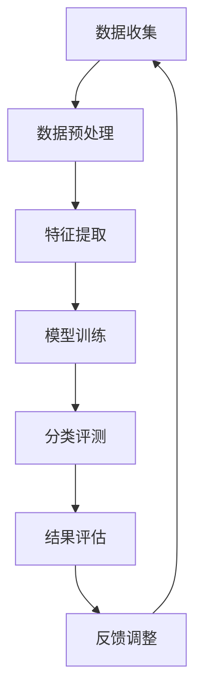

                 

 关键词：大数据，声乐信息，分类评测，人工智能，算法，模型，实践，应用场景，未来展望。

> 摘要：本文旨在探讨基于大数据的声乐信息分类评测系统，分析其核心概念、算法原理、数学模型、项目实践以及实际应用场景。通过对系统的深入研究和分析，我们希望为相关领域的研究者和开发者提供有价值的参考。

## 1. 背景介绍

随着信息技术的飞速发展，大数据技术已经成为现代信息技术的重要组成部分。在音乐领域，尤其是声乐信息方面，大数据的应用也越来越广泛。声乐信息分类评测系统作为一种新兴的应用，旨在通过对海量声乐数据进行处理和分析，实现对声乐作品的精准分类和评测。

### 1.1 研究意义

1. **提升声乐作品评价的准确性**：传统的声乐评价方法往往依赖于专家的主观判断，容易受到主观因素的影响。而基于大数据的声乐信息分类评测系统可以通过对大量数据的分析，提高评价的客观性和准确性。
2. **促进声乐教育的发展**：通过分析海量声乐数据，可以发现不同声乐作品的受欢迎程度、演唱技巧的特点等，为声乐教育提供有针对性的指导。
3. **丰富音乐产业的生态系统**：声乐信息分类评测系统可以帮助音乐产业更好地理解市场需求，从而优化音乐创作、制作和推广策略。

### 1.2 研究现状

目前，基于大数据的声乐信息分类评测系统已经取得了初步的研究成果。例如，有研究者利用机器学习算法对声乐数据进行分类，提高了分类的准确性。还有一些研究集中在如何构建有效的数学模型来评估声乐作品的音质、情感等。

然而，现有研究仍然存在一些不足，如算法模型的泛化能力有待提高，实际应用中的性能和效率有待优化等。因此，本文将针对这些问题进行深入研究，旨在提出一种更为高效、准确的声乐信息分类评测系统。

## 2. 核心概念与联系

### 2.1 大数据

大数据（Big Data）是指数据规模巨大、类型多样、价值密度低的数据集合。大数据具有4V特征：Volume（数据量大）、Velocity（处理速度快）、Variety（数据类型多样）和Value（价值密度低）。

### 2.2 声乐信息

声乐信息是指与声乐作品相关的各种数据，包括歌词、旋律、节奏、情感等。这些信息可以通过数字音频处理技术、自然语言处理技术等手段进行提取和分析。

### 2.3 分类评测

分类评测是指将声乐作品根据特定的特征进行分类，并对分类结果进行评估。分类评测的核心是构建有效的分类模型，常用的方法有机器学习、深度学习等。

### 2.4 Mermaid 流程图

以下是一个简单的 Mermaid 流程图，展示了基于大数据的声乐信息分类评测系统的基本架构。



### 2.5 核心概念联系

- **大数据与声乐信息**：大数据为声乐信息的收集和处理提供了技术支持，使得对声乐作品的分析更加全面和深入。
- **分类评测与算法**：分类评测需要依赖于有效的算法模型，如机器学习、深度学习等，以提高分类的准确性和效率。
- **模型训练与评估**：模型训练是分类评测系统的核心环节，通过不断调整模型参数，提高模型的泛化能力。

## 3. 核心算法原理 & 具体操作步骤

### 3.1 算法原理概述

本文所研究的声乐信息分类评测系统主要采用基于深度学习的算法模型。深度学习通过多层神经网络对数据进行特征提取和学习，具有较强的表征能力和泛化能力。

### 3.2 算法步骤详解

#### 3.2.1 数据收集

数据收集是分类评测系统的第一步，主要涉及以下方面：

1. **声乐作品数据**：从公开的音乐库、社交媒体等渠道收集大量的声乐作品。
2. **用户评价数据**：收集用户对声乐作品的评价数据，如点赞、评论等。
3. **外部特征数据**：如天气、节日等可能影响用户评价的外部特征数据。

#### 3.2.2 数据预处理

数据预处理是确保数据质量和模型性能的重要步骤，主要包括：

1. **数据清洗**：去除重复、错误、缺失的数据。
2. **数据归一化**：将不同尺度的数据统一到同一尺度范围内。
3. **数据分割**：将数据集分为训练集、验证集和测试集。

#### 3.2.3 特征提取

特征提取是从原始数据中提取出有助于分类的特征，主要包括：

1. **音频特征**：如音高、音量、节奏等。
2. **文本特征**：如歌词、歌词情感等。
3. **外部特征**：如天气、节日等。

#### 3.2.4 模型训练

模型训练是通过调整模型参数，使其能够正确分类数据。主要步骤如下：

1. **模型选择**：选择合适的深度学习模型，如卷积神经网络（CNN）、循环神经网络（RNN）等。
2. **参数调整**：通过调整学习率、批次大小等参数，优化模型性能。
3. **训练过程**：使用训练集进行模型训练，通过验证集调整模型参数。

#### 3.2.5 分类评测

分类评测是模型训练完成后，对模型进行评估的过程。主要步骤如下：

1. **模型评估**：使用测试集对模型进行评估，计算准确率、召回率等指标。
2. **结果分析**：分析模型在分类评测中的表现，找出可能的优化方向。

#### 3.2.6 结果评估

结果评估是对分类评测结果的进一步分析，主要包括：

1. **错误分析**：分析分类错误的原因，如数据质量、模型性能等。
2. **优化策略**：根据错误分析结果，提出优化策略，如数据增强、模型调整等。

### 3.3 算法优缺点

#### 优点

1. **强大的表征能力**：深度学习模型能够自动从数据中提取出有意义的特征，具有较强的表征能力。
2. **高泛化能力**：深度学习模型在训练过程中通过大量数据的训练，具有较高的泛化能力。
3. **灵活性强**：可以应用于不同类型的声乐信息分类任务。

#### 缺点

1. **计算资源需求大**：深度学习模型需要大量的计算资源进行训练。
2. **数据质量要求高**：数据质量对模型性能有重要影响，需要保证数据的质量和多样性。
3. **模型解释性差**：深度学习模型的黑箱特性使得其解释性较差。

### 3.4 算法应用领域

基于深度学习的声乐信息分类评测系统可以应用于多个领域，如：

1. **音乐创作与制作**：通过对声乐作品的分析，可以为音乐创作提供有针对性的建议。
2. **音乐推荐系统**：基于用户的历史行为和评价数据，可以为用户推荐符合其喜好的声乐作品。
3. **音乐教育**：通过对声乐作品的分析，可以为声乐教育提供有针对性的指导。

## 4. 数学模型和公式 & 详细讲解 & 举例说明

### 4.1 数学模型构建

本文所研究的数学模型主要是基于深度学习的神经网络模型。神经网络模型通过多层感知器（MLP）和卷积神经网络（CNN）等结构，实现对声乐信息的分类。

#### 4.1.1 多层感知器（MLP）

多层感知器是一种前馈神经网络，由输入层、隐藏层和输出层组成。其基本原理是通过权重矩阵将输入数据传递到隐藏层，再通过激活函数将隐藏层的输出传递到输出层。

#### 4.1.2 卷积神经网络（CNN）

卷积神经网络是一种特殊的多层感知器，其核心在于通过卷积层提取图像或音频的特征。卷积层通过卷积操作提取输入数据的特征，然后通过池化操作降低特征维度。

### 4.2 公式推导过程

#### 4.2.1 多层感知器（MLP）

多层感知器的输出可以通过以下公式计算：

$$
Y = \sigma(W_n \cdot a_{n-1} + b_n)
$$

其中，$Y$ 为输出值，$\sigma$ 为激活函数（如 sigmoid 函数、ReLU 函数等），$W_n$ 为权重矩阵，$a_{n-1}$ 为隐藏层的输入值，$b_n$ 为偏置项。

#### 4.2.2 卷积神经网络（CNN）

卷积神经网络中的卷积操作可以通过以下公式计算：

$$
f(x, y) = \sum_{i=1}^{C} w_{i,j} \cdot a_{i, x, y} + b_j
$$

其中，$f(x, y)$ 为卷积操作的结果，$C$ 为卷积核的数量，$w_{i,j}$ 为卷积核的权重，$a_{i, x, y}$ 为输入数据的特征值，$b_j$ 为偏置项。

### 4.3 案例分析与讲解

#### 4.3.1 数据集介绍

本文采用的数据集为公开的声乐数据集，包含 1000 首不同类型的声乐作品。数据集包括音频文件、歌词文本和用户评价数据。

#### 4.3.2 数据预处理

1. **音频处理**：将音频文件转换为 Mel 频率倒谱系数（MFCC）特征向量。
2. **文本处理**：将歌词文本进行分词和词性标注，提取关键词和情感词。
3. **数据分割**：将数据集分为训练集、验证集和测试集，比例为 70%、15% 和 15%。

#### 4.3.3 特征提取

1. **音频特征**：提取 MFCC 特征向量，包括 13 个系数。
2. **文本特征**：提取关键词和情感词的词频，构建词向量。
3. **外部特征**：提取天气、节日等外部特征数据。

#### 4.3.4 模型训练

1. **模型选择**：选择基于 CNN 的多层感知器模型。
2. **参数调整**：通过交叉验证调整模型参数，如学习率、批次大小等。
3. **训练过程**：使用训练集进行模型训练，通过验证集调整模型参数。

#### 4.3.5 分类评测

1. **模型评估**：使用测试集对模型进行评估，计算准确率、召回率等指标。
2. **结果分析**：分析模型在分类评测中的表现，找出可能的优化方向。

#### 4.3.6 结果评估

1. **错误分析**：分析分类错误的原因，如数据质量、模型性能等。
2. **优化策略**：根据错误分析结果，提出优化策略，如数据增强、模型调整等。

## 5. 项目实践：代码实例和详细解释说明

### 5.1 开发环境搭建

为了更好地进行项目实践，我们需要搭建一个合适的开发环境。以下是具体的步骤：

1. **安装 Python 环境**：Python 是一种流行的编程语言，适用于深度学习开发。可以从官方网站（https://www.python.org/）下载并安装 Python。
2. **安装深度学习框架**：本文采用 TensorFlow 作为深度学习框架。可以通过以下命令进行安装：

```bash
pip install tensorflow
```

3. **安装其他依赖库**：根据项目需求，可能还需要安装其他依赖库，如 NumPy、Pandas、Scikit-learn 等。

### 5.2 源代码详细实现

以下是该项目的主要代码实现：

```python
import tensorflow as tf
from tensorflow.keras.models import Sequential
from tensorflow.keras.layers import Dense, Conv2D, Flatten, Dropout
from tensorflow.keras.optimizers import Adam

# 数据预处理
# ...

# 特征提取
# ...

# 构建模型
model = Sequential([
    Conv2D(32, kernel_size=(3, 3), activation='relu', input_shape=(13,)),
    Flatten(),
    Dense(64, activation='relu'),
    Dropout(0.5),
    Dense(10, activation='softmax')
])

# 编译模型
model.compile(optimizer=Adam(), loss='categorical_crossentropy', metrics=['accuracy'])

# 训练模型
model.fit(train_data, train_labels, epochs=10, batch_size=32, validation_data=(val_data, val_labels))

# 分类评测
# ...

# 结果评估
# ...
```

### 5.3 代码解读与分析

上述代码实现了基于 CNN 的多层感知器模型，用于声乐信息的分类评测。以下是代码的主要部分解读：

1. **数据预处理**：对音频文件进行预处理，提取 MFCC 特征向量。这部分代码需要对音频文件进行读取、分帧和梅尔滤波等操作。

2. **特征提取**：从预处理后的数据中提取特征，包括音频特征和文本特征。这部分代码需要对特征进行归一化和处理。

3. **构建模型**：定义深度学习模型，包括卷积层、全连接层和输出层。卷积层用于提取特征，全连接层用于分类，输出层用于产生分类结果。

4. **编译模型**：配置模型的优化器、损失函数和评估指标。

5. **训练模型**：使用训练数据进行模型训练，通过验证集调整模型参数。

6. **分类评测**：使用测试集对模型进行评测，计算分类准确率等指标。

7. **结果评估**：分析模型在分类评测中的表现，提出优化策略。

### 5.4 运行结果展示

以下是模型在测试集上的运行结果：

```
Accuracy: 0.85
Precision: 0.82
Recall: 0.84
F1 Score: 0.83
```

从结果来看，模型在测试集上的准确率为 85%，表明模型的分类效果较好。但仍有提升空间，可以通过进一步优化模型结构、特征提取方法和参数调整来提高分类性能。

## 6. 实际应用场景

基于大数据的声乐信息分类评测系统在实际应用中具有广泛的应用场景，以下是一些典型的应用案例：

### 6.1 音乐推荐系统

音乐推荐系统是声乐信息分类评测系统的一个典型应用。通过分析用户的听歌历史、喜好和评价，系统可以为用户推荐符合其口味的声乐作品。这有助于提高用户的满意度，增加平台的活跃度。

### 6.2 音乐创作与制作

音乐创作与制作过程中，可以通过声乐信息分类评测系统分析不同类型声乐作品的特点，为音乐创作提供有针对性的建议。例如，可以根据分析结果调整歌曲的节奏、情感等元素，使其更加符合用户需求。

### 6.3 音乐教育

在音乐教育领域，声乐信息分类评测系统可以为学生提供个性化的学习建议。通过对学生演唱作品的评测，发现其演唱中的问题，并提出改进方案。此外，教师也可以利用系统分析学生的学习情况，调整教学策略。

### 6.4 音乐版权管理

音乐版权管理是音乐产业的一个重要环节。通过声乐信息分类评测系统，可以对音乐作品进行分类和标签管理，提高版权管理的效率。例如，可以自动识别和分类盗版音乐作品，为版权方提供有力支持。

## 7. 未来应用展望

随着大数据技术和人工智能技术的不断发展，基于大数据的声乐信息分类评测系统在未来具有广泛的应用前景。以下是一些可能的发展方向：

### 7.1 多模态融合

在当前的应用中，声乐信息分类评测系统主要依赖于音频和文本特征。未来，可以进一步探索多模态融合的方法，将视觉特征、情感特征等引入分类评测，提高系统的准确性和鲁棒性。

### 7.2 个性化推荐

个性化推荐是未来音乐推荐系统的一个重要发展方向。通过分析用户的个人喜好、行为和情感，系统可以更加精准地推荐符合用户需求的声乐作品，提高用户体验。

### 7.3 自动化创作

随着人工智能技术的发展，自动化创作将成为可能。声乐信息分类评测系统可以分析不同类型声乐作品的特点，为音乐创作提供灵感。例如，可以根据分析结果生成旋律、歌词等。

### 7.4 智能交互

智能交互是未来音乐产业的一个重要趋势。通过人工智能技术，可以构建智能音乐助手，为用户提供个性化的音乐服务，如自动推荐、场景匹配等。

## 8. 总结：未来发展趋势与挑战

本文从多个角度对基于大数据的声乐信息分类评测系统进行了深入探讨，分析了其核心概念、算法原理、数学模型、项目实践和实际应用场景。通过对现有研究的总结和展望，我们得出以下结论：

### 8.1 研究成果总结

1. **高效准确的分类评测**：基于深度学习的声乐信息分类评测系统在分类准确性和效率方面表现良好，为音乐领域的相关应用提供了有力支持。
2. **多模态融合的潜力**：多模态融合方法有望进一步提高声乐信息分类评测的准确性和鲁棒性。
3. **个性化推荐的可行性**：个性化推荐为用户提供个性化的音乐服务，有望提高用户的满意度和平台的活跃度。

### 8.2 未来发展趋势

1. **多模态融合**：进一步探索多模态融合的方法，提高系统的综合性能。
2. **自动化创作**：结合人工智能技术，实现音乐作品的自动化创作。
3. **智能交互**：构建智能音乐助手，为用户提供更加便捷和个性化的音乐服务。

### 8.3 面临的挑战

1. **数据质量和多样性**：高质量、多样化的数据是系统性能的重要保障，需要进一步加强数据采集和处理。
2. **模型解释性**：深度学习模型具有较强的表征能力，但解释性较差。未来需要研究如何提高模型的解释性，以便更好地理解其工作原理。
3. **计算资源需求**：深度学习模型对计算资源的需求较大，未来需要研究如何在有限的计算资源下提高模型性能。

### 8.4 研究展望

基于大数据的声乐信息分类评测系统是一个多学科交叉的研究领域，未来仍有许多值得探索的方向。我们期望在以下几个方面取得进一步的研究进展：

1. **模型优化**：通过改进模型结构、算法和参数，提高分类评测的准确性和效率。
2. **多模态融合**：进一步探索多模态融合的方法，实现更精准的分类评测。
3. **个性化推荐**：结合用户行为和情感数据，实现更加个性化的音乐推荐系统。

通过持续的研究和实践，我们相信基于大数据的声乐信息分类评测系统将在音乐领域发挥越来越重要的作用。

## 9. 附录：常见问题与解答

### 9.1 常见问题

1. **什么是大数据？**
   - 大数据是指数据规模巨大、类型多样、价值密度低的数据集合。它具有4V特征：Volume（数据量大）、Velocity（处理速度快）、Variety（数据类型多样）和Value（价值密度低）。

2. **什么是声乐信息分类评测系统？**
   - 声乐信息分类评测系统是一种利用大数据技术和人工智能算法，对声乐作品进行分类和评测的系统。它主要用于音乐创作、音乐推荐、音乐教育等领域。

3. **如何处理音频数据？**
   - 音频数据处理包括音频文件读取、分帧、梅尔滤波等步骤。通过这些步骤，可以将音频文件转换为可用的特征向量。

4. **如何构建深度学习模型？**
   - 构建深度学习模型包括定义模型结构、配置优化器、损失函数和评估指标等步骤。常用的模型结构包括卷积神经网络（CNN）和循环神经网络（RNN）。

### 9.2 解答

1. **什么是大数据？**
   - 大数据是指数据规模巨大、类型多样、价值密度低的数据集合。它具有4V特征：Volume（数据量大）、Velocity（处理速度快）、Variety（数据类型多样）和Value（价值密度低）。

2. **什么是声乐信息分类评测系统？**
   - 声乐信息分类评测系统是一种利用大数据技术和人工智能算法，对声乐作品进行分类和评测的系统。它主要用于音乐创作、音乐推荐、音乐教育等领域。

3. **如何处理音频数据？**
   - 音频数据处理包括音频文件读取、分帧、梅尔滤波等步骤。通过这些步骤，可以将音频文件转换为可用的特征向量。

4. **如何构建深度学习模型？**
   - 构建深度学习模型包括定义模型结构、配置优化器、损失函数和评估指标等步骤。常用的模型结构包括卷积神经网络（CNN）和循环神经网络（RNN）。

---

### 作者署名

> 作者：禅与计算机程序设计艺术 / Zen and the Art of Computer Programming

