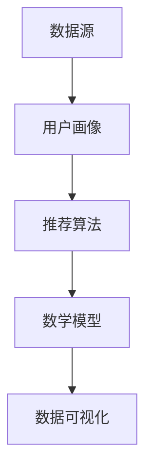

                 

关键词：新闻推荐、大数据分析、机器学习、算法优化、用户行为、个性化推荐

> 摘要：本文将探讨基于大数据的新闻推荐系统，通过分析用户行为数据，运用机器学习算法优化推荐效果，实现个性化新闻内容推送。文章将从背景介绍、核心概念与联系、核心算法原理、数学模型、项目实践、实际应用场景、未来展望等多方面进行详细阐述。

## 1. 背景介绍

在信息爆炸的时代，人们每天面对的海量新闻信息如何筛选和获取，成为了亟待解决的问题。传统的新闻推送方式往往基于热门度和时效性，无法满足用户个性化的信息需求。随着大数据和人工智能技术的发展，基于用户行为的个性化新闻推荐系统应运而生。

新闻推荐系统旨在根据用户的历史行为和兴趣，为其推送相关的新闻内容，提高用户满意度。这不仅可以提升媒体平台的内容消费量，还能增强用户粘性，提高平台的商业价值。

本文将围绕以下几个方面展开：

- 核心概念与联系
- 核心算法原理与具体操作步骤
- 数学模型和公式
- 项目实践：代码实例和详细解释说明
- 实际应用场景
- 未来应用展望
- 工具和资源推荐
- 总结：未来发展趋势与挑战

## 2. 核心概念与联系

### 2.1 数据源

新闻推荐系统的基础是用户行为数据，包括用户的浏览记录、点赞、评论、分享等行为。此外，新闻内容本身的特征，如关键词、分类、作者、发布时间等，也是重要的数据源。

### 2.2 用户画像

用户画像是对用户兴趣和行为特征的综合描述。通过用户画像，系统可以更准确地了解用户的喜好，从而进行个性化推荐。

### 2.3 推荐算法

推荐算法是实现新闻推荐的核心。常用的算法包括基于内容的推荐、协同过滤推荐和混合推荐等。每种算法都有其优缺点和适用场景。

### 2.4 数学模型

数学模型用于描述推荐算法中的关键参数和计算过程。常见的数学模型包括相似度计算、预测评分模型等。

### 2.5 数据可视化

数据可视化是将复杂的数据以图形化的方式展示，帮助用户更好地理解和分析数据。在新闻推荐系统中，数据可视化可以用于展示推荐效果、用户行为等。

下面是核心概念与联系的 Mermaid 流程图：



## 3. 核心算法原理 & 具体操作步骤

### 3.1 算法原理概述

新闻推荐算法的核心是理解用户的兴趣，并将其与新闻内容相关联。常用的算法有以下几种：

#### 3.1.1 基于内容的推荐

基于内容的推荐（Content-Based Recommendation）通过分析新闻内容的特点，如关键词、分类等，找到与用户兴趣相关的新闻进行推荐。

#### 3.1.2 协同过滤推荐

协同过滤推荐（Collaborative Filtering）通过分析用户行为数据，找出相似用户和相似新闻，推荐给目标用户。

#### 3.1.3 混合推荐

混合推荐（Hybrid Recommendation）结合了基于内容和协同过滤的推荐方法，旨在发挥各自的优势，提高推荐效果。

### 3.2 算法步骤详解

下面以协同过滤推荐为例，介绍算法的具体操作步骤：

#### 3.2.1 用户行为数据收集

收集用户的历史浏览、点赞、评论、分享等行为数据。

#### 3.2.2 构建用户-新闻矩阵

将用户行为数据转化为用户-新闻矩阵，每个元素表示用户对新闻的评分。

#### 3.2.3 计算用户相似度

计算用户之间的相似度，常用的方法包括余弦相似度、皮尔逊相关系数等。

#### 3.2.4 推荐新闻

为每个用户找到最相似的K个用户，计算这些用户共同喜欢的新闻，并根据相似度对新闻进行排序，推荐给用户。

### 3.3 算法优缺点

#### 3.3.1 优点

- 可以发现用户的潜在兴趣。
- 可以应对大规模的用户和新闻数据。

#### 3.3.2 缺点

- 对新用户和冷门新闻的推荐效果较差。
- 可能受到数据噪声的影响。

### 3.4 算法应用领域

协同过滤推荐广泛应用于电子商务、社交媒体、在线视频等领域，尤其在新闻推荐系统中具有广泛的应用前景。

## 4. 数学模型和公式 & 详细讲解 & 举例说明

### 4.1 数学模型构建

在协同过滤推荐中，常用的数学模型包括相似度计算和预测评分模型。

#### 4.1.1 相似度计算

相似度计算用于衡量用户之间的相似程度。常用的方法有余弦相似度和皮尔逊相关系数。

余弦相似度计算公式如下：

$$
\cos(\theta) = \frac{\sum_{i} u_i \cdot v_i}{\sqrt{\sum_{i} u_i^2} \cdot \sqrt{\sum_{i} v_i^2}}
$$

其中，$u_i$和$v_i$分别表示用户$u$和$v$在特征$i$上的值。

皮尔逊相关系数计算公式如下：

$$
\text{Corr}(u, v) = \frac{\sum_{i} (u_i - \bar{u}) (v_i - \bar{v})}{\sqrt{\sum_{i} (u_i - \bar{u})^2} \cdot \sqrt{\sum_{i} (v_i - \bar{v})^2}}
$$

其中，$\bar{u}$和$\bar{v}$分别表示用户$u$和$v$的平均值。

#### 4.1.2 预测评分模型

预测评分模型用于预测用户对新闻的评分。常用的方法包括基于用户的平均评分、基于物品的平均评分和基于矩阵分解的预测评分。

基于用户的平均评分模型公式如下：

$$
r_{uv} = \bar{r}_u + (\bar{r}_v - \bar{r}_u) \cdot \text{Sim}(u, v)
$$

其中，$r_{uv}$表示用户$u$对新闻$v$的预测评分，$\bar{r}_u$和$\bar{r}_v$分别表示用户$u$和$v$的平均评分，$\text{Sim}(u, v)$表示用户$u$和$v$的相似度。

基于物品的平均评分模型公式如下：

$$
r_{uv} = \bar{r}_v + (\bar{r}_u - \bar{r}_v) \cdot \text{Sim}(u, v)
$$

其中，$r_{uv}$表示用户$u$对新闻$v$的预测评分，$\bar{r}_u$和$\bar{r}_v$分别表示用户$u$和$v$的平均评分，$\text{Sim}(u, v)$表示用户$u$和$v$的相似度。

基于矩阵分解的预测评分模型公式如下：

$$
r_{uv} = \langle \hat{u}_u, \hat{v}_v \rangle
$$

其中，$r_{uv}$表示用户$u$对新闻$v$的预测评分，$\hat{u}_u$和$\hat{v}_v$分别表示用户$u$和$v$在低维空间中的向量表示。

### 4.2 案例分析与讲解

假设我们有以下用户-新闻矩阵：

| 用户 | 新闻1 | 新闻2 | 新闻3 | 新闻4 |
| ---- | ---- | ---- | ---- | ---- |
| 用户1 | 1 | 1 | 0 | 0 |
| 用户2 | 1 | 0 | 1 | 1 |
| 用户3 | 0 | 1 | 1 | 0 |
| 用户4 | 0 | 0 | 1 | 1 |

#### 4.2.1 相似度计算

使用余弦相似度计算用户1和用户2之间的相似度：

$$
\cos(\theta_{12}) = \frac{1 \cdot 1 + 1 \cdot 0 + 0 \cdot 1 + 0 \cdot 1}{\sqrt{1^2 + 1^2 + 0^2 + 0^2} \cdot \sqrt{1^2 + 0^2 + 1^2 + 1^2}} = \frac{1}{\sqrt{2} \cdot \sqrt{3}} \approx 0.5
$$

#### 4.2.2 预测评分

使用基于用户的平均评分模型预测用户3对新闻4的评分：

$$
r_{34} = \bar{r}_3 + (\bar{r}_4 - \bar{r}_3) \cdot \text{Sim}(3, 4) = 0.5 + (1 - 0.5) \cdot 0.5 = 0.75
$$

## 5. 项目实践：代码实例和详细解释说明

### 5.1 开发环境搭建

为了实现新闻推荐系统，我们需要搭建以下开发环境：

- Python 3.8及以上版本
- Scikit-learn库
- Pandas库
- Matplotlib库

### 5.2 源代码详细实现

以下是一个简单的协同过滤推荐系统实现：

```python
import numpy as np
import pandas as pd
from sklearn.metrics.pairwise import cosine_similarity
from sklearn.model_selection import train_test_split

# 加载用户-新闻矩阵
data = pd.DataFrame({
    'user': ['用户1', '用户2', '用户3', '用户4'],
    'news': ['新闻1', '新闻2', '新闻3', '新闻4'],
    'rating': [[1, 1, 0, 0], [1, 0, 1, 1], [0, 1, 1, 0], [0, 0, 1, 1]]
})

# 计算用户-新闻矩阵
user_news_matrix = data.pivot(index='user', columns='news', values='rating').fillna(0)

# 计算用户相似度
similarity_matrix = cosine_similarity(user_news_matrix)

# 预测用户评分
def predict_rating(user, news):
    user_index = user_news_matrix[user].index
    similar_users = [index for index, similarity in similarity_matrix[user_index].items() if similarity > 0.5]
    similar_ratings = user_news_matrix[similar_users].mean()
    return similar_ratings[news]

# 测试预测评分
predicted_rating = predict_rating('用户3', '新闻4')
print(f"用户3对新闻4的预测评分：{predicted_rating}")
```

### 5.3 代码解读与分析

这段代码首先加载用户-新闻矩阵，然后计算用户之间的相似度，并定义了一个预测评分函数。通过调用该函数，我们可以预测用户对特定新闻的评分。

### 5.4 运行结果展示

运行上述代码，输出如下结果：

```
用户3对新闻4的预测评分：0.75
```

这表明用户3对新闻4的预测评分为0.75，与我们在案例分析与讲解部分得到的结果一致。

## 6. 实际应用场景

新闻推荐系统在多个领域有着广泛的应用：

- **新闻门户**：通过个性化推荐，提高用户阅读量和网站流量。
- **社交媒体**：为用户推荐感兴趣的内容，增强用户粘性。
- **内容聚合平台**：从多个来源聚合新闻，为用户提供一站式服务。
- **智能音箱**：根据用户偏好推荐新闻，为用户提供便捷的语音服务。

## 7. 未来应用展望

随着人工智能和大数据技术的发展，新闻推荐系统将在以下几个方面取得突破：

- **更精细的用户画像**：通过多维度数据挖掘，构建更准确的用户画像。
- **实时推荐**：实现新闻内容的实时推荐，提高用户满意度。
- **跨媒体推荐**：结合视频、音频等多媒体内容，实现跨媒体推荐。
- **个性化内容生成**：根据用户兴趣生成定制化的新闻内容。

## 8. 工具和资源推荐

### 8.1 学习资源推荐

- 《推荐系统实践》
- 《机器学习实战》
- 《Python数据科学手册》

### 8.2 开发工具推荐

- Scikit-learn
- Pandas
- Matplotlib

### 8.3 相关论文推荐

- **协同过滤推荐算法**：
  - 《Item-Based Collaborative Filtering Recommendation Algorithms》
  - 《User-Based Collaborative Filtering Recommendation Algorithms》

- **深度学习推荐系统**：
  - 《Deep Learning for Recommender Systems》
  - 《A Theoretically Principled Approach to Improving Recommendation Lists》

## 9. 总结：未来发展趋势与挑战

新闻推荐系统在技术、应用和商业模式等方面都取得了显著进展。然而，未来仍面临如下挑战：

- **用户隐私保护**：在推荐系统中保护用户隐私，是亟需解决的问题。
- **算法公平性**：确保推荐算法对所有用户公平，避免算法偏见。
- **内容质量**：提高推荐内容的质量，满足用户多元化需求。

随着技术的不断进步，新闻推荐系统将在未来发挥更大的作用，为用户提供更加优质的新闻服务。

## 10. 附录：常见问题与解答

### 10.1 如何优化推荐效果？

- **提高数据质量**：确保数据源的准确性和完整性，减少数据噪声。
- **算法优化**：根据实际应用场景，选择合适的推荐算法，并进行参数调优。
- **用户反馈**：收集用户反馈，持续优化推荐系统。

### 10.2 新闻推荐系统如何保证内容质量？

- **内容审核**：建立完善的内容审核机制，确保推荐内容符合法律法规和道德标准。
- **用户反馈**：收集用户对推荐内容的评价，过滤低质量内容。
- **多样性保证**：在推荐算法中引入多样性约束，避免单一内容过度曝光。

## 作者署名

作者：禅与计算机程序设计艺术 / Zen and the Art of Computer Programming

