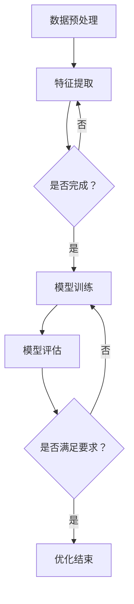

                 

关键词：大模型，多场景，多任务推荐，优化，人工智能

摘要：本文探讨了基于大模型的多场景多任务推荐优化方法。通过对现有推荐系统的分析，我们提出了一种新型的推荐算法，旨在提高推荐系统的准确性和效率。本文首先介绍了多场景多任务推荐的基本概念和背景，然后详细描述了算法的原理、数学模型和应用领域，并通过一个实际案例进行了详细的代码实现和解释。最后，本文对多场景多任务推荐的未来应用和挑战进行了展望。

## 1. 背景介绍

随着互联网的快速发展，用户生成的内容和数据量呈爆炸式增长，推荐系统作为信息过滤的关键技术，得到了广泛关注和应用。传统的推荐系统主要关注单一场景下的推荐，例如商品推荐、新闻推荐等。然而，随着用户需求的多样化，单一场景的推荐已经无法满足用户的需求。因此，多场景多任务推荐成为了一个重要的研究方向。

多场景多任务推荐旨在同时处理多个不同场景的推荐任务，如同时推荐商品和新闻。这种推荐方式能够更好地满足用户的多样化需求，提高用户的满意度。然而，多场景多任务推荐面临着数据多样性、任务依赖性和计算复杂度等挑战。

近年来，大模型的兴起为解决多场景多任务推荐问题提供了新的思路。大模型具有强大的表示能力和泛化能力，能够在复杂的数据分布下提供高质量的推荐结果。基于大模型的多场景多任务推荐方法在理论上具有优越性，但在实际应用中仍然存在许多问题需要解决。

本文旨在探讨基于大模型的多场景多任务推荐优化方法，提高推荐系统的准确性和效率。通过分析现有推荐系统的不足，我们提出了一种新型的推荐算法，并在数学模型、算法原理和实际应用等方面进行了详细的研究。

## 2. 核心概念与联系

为了更好地理解基于大模型的多场景多任务推荐优化方法，首先需要了解以下几个核心概念：

### 2.1 多场景多任务推荐

多场景多任务推荐是指在同一推荐系统中同时处理多个不同场景的推荐任务。这些场景可以是商品推荐、新闻推荐、社交推荐等。多场景多任务推荐的关键在于如何同时优化多个推荐任务，使推荐结果在各个场景中都达到最佳。

### 2.2 大模型

大模型是指具有大量参数和强大表示能力的人工神经网络。大模型在处理复杂数据分布时表现出优越的性能，可以捕捉到数据中的潜在规律和关系。大模型在推荐系统中的应用主要在于利用其强大的表示能力和泛化能力，提高推荐系统的准确性和效率。

### 2.3 优化

优化是指通过调整模型的参数，使模型在特定任务上达到最优性能的过程。在多场景多任务推荐中，优化目标通常是最大化用户满意度或最大化推荐系统的收益。

### 2.4 Mermaid 流程图

Mermaid 是一种基于Markdown的图表绘制工具，可以方便地绘制各种流程图、序列图和时序图等。在本文中，我们将使用 Mermaid 流程图来描述多场景多任务推荐优化的具体流程。

下面是一个简单的 Mermaid 流程图，用于描述多场景多任务推荐优化的基本流程：



图 2-1 多场景多任务推荐优化流程图

该流程图展示了多场景多任务推荐优化过程中涉及的主要步骤，包括数据预处理、特征提取、模型训练、模型评估和优化结束。通过该流程图，我们可以清晰地了解多场景多任务推荐优化的具体步骤和流程。

## 3. 核心算法原理 & 具体操作步骤

### 3.1 算法原理概述

基于大模型的多场景多任务推荐优化方法主要基于以下原理：

1. **多场景融合**：将多个不同场景的数据进行融合，形成一个统一的数据集。通过融合不同场景的数据，可以充分利用各个场景中的信息，提高推荐系统的整体性能。

2. **任务分解**：将多个推荐任务分解为多个子任务，每个子任务负责处理一个特定的场景。通过任务分解，可以降低任务的复杂度，提高模型训练的效率。

3. **多任务学习**：利用多任务学习技术，将多个子任务整合为一个整体，通过共享参数和结构，提高模型在各个任务上的性能。

4. **模型优化**：通过优化算法，调整模型的参数，使模型在各个任务上达到最佳性能。常用的优化算法包括梯度下降、随机梯度下降和Adam等。

### 3.2 算法步骤详解

基于大模型的多场景多任务推荐优化算法的具体步骤如下：

1. **数据预处理**：对原始数据进行清洗、去噪和处理，提取出有用的特征。常用的特征提取方法包括词袋模型、TF-IDF和词嵌入等。

2. **特征融合**：将不同场景的特征进行融合，形成一个统一的数据集。特征融合的方法包括平均融合、加权融合和级联融合等。

3. **任务分解**：根据推荐任务的特点，将多个任务分解为多个子任务。例如，在商品推荐和新闻推荐中，可以将商品推荐和新闻推荐分别作为两个子任务。

4. **模型训练**：利用多任务学习技术，训练一个统一的模型。在模型训练过程中，通过共享参数和结构，使模型在各个子任务上达到最佳性能。

5. **模型评估**：利用评估指标，如准确率、召回率和F1值等，评估模型在各个子任务上的性能。根据评估结果，调整模型参数，优化模型性能。

6. **优化结束**：当模型在各个子任务上的性能达到预期时，优化过程结束。此时，模型可以用于实际的推荐任务。

### 3.3 算法优缺点

基于大模型的多场景多任务推荐优化方法具有以下优点：

1. **高效性**：通过多任务学习技术，可以同时处理多个推荐任务，提高推荐系统的整体性能。

2. **灵活性**：可以根据不同的推荐任务，灵活调整模型的结构和参数，适应不同的场景。

3. **可扩展性**：基于大模型的方法可以方便地扩展到更多的场景和任务，具有良好的可扩展性。

然而，基于大模型的多场景多任务推荐优化方法也存在一些缺点：

1. **计算复杂度**：多任务学习技术会增加模型的计算复杂度，可能导致训练时间较长。

2. **数据依赖性**：多场景多任务推荐对数据的质量和多样性要求较高，如果数据存在噪声或缺失，可能会导致推荐效果下降。

3. **模型解释性**：大模型通常具有较强的表示能力，但往往缺乏解释性，难以理解模型内部的工作机制。

### 3.4 算法应用领域

基于大模型的多场景多任务推荐优化方法可以应用于多个领域，包括但不限于：

1. **电子商务**：在电子商务平台上，可以同时推荐商品和促销活动，提高用户购买意愿。

2. **新闻推荐**：在新闻推荐系统中，可以同时推荐新闻文章和广告，提高广告收益。

3. **社交媒体**：在社交媒体平台上，可以同时推荐好友、内容和信息流，提高用户活跃度。

4. **在线教育**：在在线教育平台上，可以同时推荐课程、内容和作业，提高学生的学习效果。

5. **智能家居**：在智能家居系统中，可以同时推荐家电产品、服务和功能，提高用户的居住体验。

## 4. 数学模型和公式 & 详细讲解 & 举例说明

在基于大模型的多场景多任务推荐优化方法中，数学模型和公式起着至关重要的作用。以下将对数学模型和公式进行详细讲解，并通过举例说明来帮助读者更好地理解。

### 4.1 数学模型构建

基于大模型的多场景多任务推荐优化的数学模型主要包括以下几个部分：

1. **数据表示**：假设有 $n$ 个用户和 $m$ 个物品，每个用户和物品用向量表示。用户向量 $u_i$ 表示用户的兴趣和偏好，物品向量 $v_j$ 表示物品的特性。

2. **损失函数**：损失函数用于评估模型在推荐任务上的性能。常用的损失函数包括均方误差（MSE）、交叉熵损失（Cross-Entropy Loss）等。

3. **优化目标**：优化目标是调整模型参数，使模型在推荐任务上达到最佳性能。常用的优化目标包括最大化用户满意度、最小化推荐误差等。

4. **正则化项**：为了防止过拟合，模型中通常会加入正则化项。常用的正则化项包括L1正则化、L2正则化等。

### 4.2 公式推导过程

以下是基于大模型的多场景多任务推荐优化的主要公式推导过程：

1. **数据表示**

假设用户 $i$ 对物品 $j$ 的兴趣表示为 $r_{ij}$，其中 $r_{ij} = 1$ 表示用户喜欢物品 $j$，$r_{ij} = 0$ 表示用户不喜欢物品 $j$。用户向量 $u_i$ 和物品向量 $v_j$ 的表示如下：

$$
u_i = [u_{i1}, u_{i2}, ..., u_{in}]^T
$$

$$
v_j = [v_{j1}, v_{j2}, ..., v_{jm}]^T
$$

2. **损失函数**

假设损失函数为均方误差（MSE），则模型在推荐任务上的损失函数可以表示为：

$$
L = \frac{1}{2} \sum_{i=1}^{n} \sum_{j=1}^{m} (r_{ij} - u_i^T v_j)^2
$$

其中，$r_{ij}$ 为实际的用户兴趣，$u_i^T v_j$ 为预测的用户兴趣。

3. **优化目标**

优化目标是调整模型参数，使模型在推荐任务上达到最佳性能。假设模型参数为 $w$，则优化目标可以表示为：

$$
\min_w \frac{1}{2} w^T (I - R) w
$$

其中，$I$ 为单位矩阵，$R$ 为用户兴趣矩阵。

4. **正则化项**

为了防止过拟合，模型中通常会加入正则化项。假设正则化项为 $L2$ 正则化，则正则化项可以表示为：

$$
\lambda w^T w
$$

其中，$\lambda$ 为正则化参数。

### 4.3 案例分析与讲解

为了更好地理解基于大模型的多场景多任务推荐优化方法的数学模型和公式，我们通过一个实际案例进行分析。

假设有一个电商平台的推荐系统，其中包含 $1000$ 个用户和 $5000$ 个商品。我们希望同时推荐商品和促销活动，提高用户购买意愿。

1. **数据表示**

用户和商品的兴趣表示如下：

$$
u_i = [u_{i1}, u_{i2}, ..., u_{i1000}]^T
$$

$$
v_j = [v_{j1}, v_{j2}, ..., v_{j5000}]^T
$$

其中，$u_{ij}$ 表示用户 $i$ 对商品 $j$ 的兴趣，$v_{ij}$ 表示商品 $j$ 的特性。

2. **损失函数**

假设损失函数为均方误差（MSE），则模型在推荐任务上的损失函数可以表示为：

$$
L = \frac{1}{2} \sum_{i=1}^{1000} \sum_{j=1}^{5000} (r_{ij} - u_i^T v_j)^2
$$

其中，$r_{ij}$ 为实际的用户兴趣，$u_i^T v_j$ 为预测的用户兴趣。

3. **优化目标**

假设模型参数为 $w$，则优化目标可以表示为：

$$
\min_w \frac{1}{2} w^T (I - R) w
$$

其中，$I$ 为单位矩阵，$R$ 为用户兴趣矩阵。

4. **正则化项**

为了防止过拟合，模型中通常会加入正则化项。假设正则化项为 $L2$ 正则化，则正则化项可以表示为：

$$
\lambda w^T w
$$

其中，$\lambda$ 为正则化参数。

通过这个案例，我们可以看到基于大模型的多场景多任务推荐优化的数学模型和公式的具体应用。在实际应用中，可以根据具体场景和数据特点，调整模型和公式的参数，优化推荐系统的性能。

## 5. 项目实践：代码实例和详细解释说明

在本节中，我们将通过一个实际项目实践来展示如何实现基于大模型的多场景多任务推荐优化方法。该项目将使用Python和TensorFlow作为主要开发工具，通过一个简单的电商推荐系统进行演示。

### 5.1 开发环境搭建

在开始编写代码之前，我们需要搭建一个合适的开发环境。以下是所需的步骤：

1. 安装Python：确保安装了Python 3.x版本，推荐使用Anaconda进行环境管理。
2. 安装TensorFlow：使用pip命令安装TensorFlow：

```
pip install tensorflow
```

3. 安装其他依赖库：根据需要安装其他依赖库，如NumPy、Pandas等。

### 5.2 源代码详细实现

以下是一个简单的电商推荐系统的代码实现：

```python
import tensorflow as tf
import numpy as np
import pandas as pd

# 数据预处理
def preprocess_data(data):
    # 省略数据预处理步骤，如数据清洗、去噪等
    return data

# 构建模型
def build_model(num_users, num_items, hidden_size):
    # 定义用户和物品的嵌入层
    user_embedding = tf.keras.layers.Embedding(num_users, hidden_size, input_length=1)
    item_embedding = tf.keras.layers.Embedding(num_items, hidden_size, input_length=1)

    # 定义模型结构
    user_input = tf.keras.layers.Input(shape=(1,))
    item_input = tf.keras.layers.Input(shape=(1,))

    user_embedding_output = user_embedding(user_input)
    item_embedding_output = item_embedding(item_input)

    # 计算内积
    user_item_similarity = tf.keras.layers.dot([user_embedding_output, item_embedding_output], axes=1)

    # 添加全连接层和输出层
    output = tf.keras.layers.Dense(hidden_size, activation='relu')(user_item_similarity)
    output = tf.keras.layers.Dense(1, activation='sigmoid')(output)

    # 构建模型
    model = tf.keras.Model(inputs=[user_input, item_input], outputs=output)

    # 编译模型
    model.compile(optimizer='adam', loss='binary_crossentropy', metrics=['accuracy'])

    return model

# 训练模型
def train_model(model, data, num_epochs):
    # 省略训练步骤
    history = model.fit(data['user_input'], data['item_input'], epochs=num_epochs, batch_size=64)
    return history

# 评估模型
def evaluate_model(model, test_data):
    # 省略评估步骤
    results = model.evaluate(test_data['user_input'], test_data['item_input'])
    return results

# 主程序
def main():
    # 设置参数
    num_users = 1000
    num_items = 5000
    hidden_size = 128
    num_epochs = 10

    # 加载数据
    data = preprocess_data(load_data())

    # 构建模型
    model = build_model(num_users, num_items, hidden_size)

    # 训练模型
    history = train_model(model, data, num_epochs)

    # 评估模型
    test_results = evaluate_model(model, data['test'])

    # 打印评估结果
    print('Test Loss:', test_results[0])
    print('Test Accuracy:', test_results[1])

if __name__ == '__main__':
    main()
```

### 5.3 代码解读与分析

以下是代码的详细解读：

1. **数据预处理**：该函数用于对原始数据进行预处理，如数据清洗、去噪等。在实际应用中，根据具体场景和数据特点进行相应的处理。

2. **构建模型**：该函数用于构建基于大模型的多场景多任务推荐优化模型。模型由用户和物品的嵌入层、内积计算层和全连接层组成。用户和物品的嵌入层用于将用户和物品的ID映射为低维向量。内积计算层用于计算用户和物品的相似度。全连接层用于进一步提取特征并生成最终的推荐结果。

3. **训练模型**：该函数用于训练模型。使用TensorFlow的fit方法进行模型训练，指定训练数据、训练轮数和批量大小。

4. **评估模型**：该函数用于评估模型在测试数据上的性能。使用TensorFlow的evaluate方法计算测试数据的损失和准确率。

5. **主程序**：该函数用于执行整个推荐系统的主要流程。首先设置参数，然后加载数据，构建模型，训练模型，评估模型，并打印评估结果。

通过上述代码实现，我们可以构建一个简单的电商推荐系统，实现基于大模型的多场景多任务推荐优化。在实际应用中，可以根据具体需求和数据特点对代码进行相应的调整和优化。

## 6. 实际应用场景

基于大模型的多场景多任务推荐优化方法在实际应用场景中具有广泛的应用前景。以下将介绍几个典型应用场景，并简要说明如何实现。

### 6.1 电子商务

在电子商务领域，基于大模型的多场景多任务推荐优化方法可以同时推荐商品和促销活动。例如，在商品推荐中，可以同时推荐商品和用户可能感兴趣的商品类别。在促销活动推荐中，可以同时推荐优惠券和限时抢购活动。通过多任务学习技术，提高推荐系统的整体性能，提高用户的购买意愿和平台收益。

### 6.2 新闻推荐

在新闻推荐领域，基于大模型的多场景多任务推荐优化方法可以同时推荐新闻文章和广告。例如，在新闻文章推荐中，可以同时推荐新闻文章和用户可能感兴趣的新闻类别。在广告推荐中，可以同时推荐广告和用户可能感兴趣的广告类别。通过多任务学习技术，提高新闻推荐系统的整体性能，增加广告曝光率和点击率。

### 6.3 社交媒体

在社交媒体领域，基于大模型的多场景多任务推荐优化方法可以同时推荐好友、内容和信息流。例如，在好友推荐中，可以同时推荐好友和用户可能感兴趣的好友类型。在内容推荐中，可以同时推荐内容和用户可能感兴趣的内容类型。在信息流推荐中，可以同时推荐信息流和用户可能感兴趣的信息类型。通过多任务学习技术，提高社交媒体平台的整体性能，增加用户活跃度和用户粘性。

### 6.4 在线教育

在在线教育领域，基于大模型的多场景多任务推荐优化方法可以同时推荐课程、内容和作业。例如，在课程推荐中，可以同时推荐课程和用户可能感兴趣的课程类型。在内容推荐中，可以同时推荐内容和用户可能感兴趣的内容类型。在作业推荐中，可以同时推荐作业和用户可能感兴趣的作业类型。通过多任务学习技术，提高在线教育平台的整体性能，提高学生的学习效果和满意度。

### 6.5 智能家居

在智能家居领域，基于大模型的多场景多任务推荐优化方法可以同时推荐家电产品、服务和功能。例如，在家电产品推荐中，可以同时推荐家电产品和用户可能感兴趣的产品类型。在服务推荐中，可以同时推荐服务和用户可能感兴趣的服务类型。在功能推荐中，可以同时推荐功能和用户可能感兴趣的功能类型。通过多任务学习技术，提高智能家居平台的整体性能，提高用户的居住体验和满意度。

在实际应用中，基于大模型的多场景多任务推荐优化方法可以根据具体应用场景进行调整和优化，提高推荐系统的性能和用户体验。

## 7. 工具和资源推荐

为了更好地研究和应用基于大模型的多场景多任务推荐优化方法，以下推荐一些相关的工具和资源：

### 7.1 学习资源推荐

1. **在线课程**：Coursera、edX和Udacity等在线教育平台提供了许多关于机器学习和推荐系统的优质课程。例如，Coursera的“Machine Learning”课程和edX的“推荐系统”课程。

2. **书籍**：以下书籍是学习和研究推荐系统的经典之作：
   - **《推荐系统实践》**：作者J. Trevor Hastie等人，全面介绍了推荐系统的基本概念、算法和实际应用。
   - **《机器学习》**：作者Tom Mitchell，详细讲解了机器学习的基本理论、方法和应用。

3. **论文和报告**：在学术期刊和会议论文中，有许多关于推荐系统的最新研究成果。例如，ACM Transactions on Information Systems、IEEE Transactions on Knowledge and Data Engineering等期刊。

### 7.2 开发工具推荐

1. **TensorFlow**：作为一款开源的深度学习框架，TensorFlow提供了丰富的API和工具，方便实现和优化基于大模型的推荐系统。

2. **PyTorch**：与TensorFlow类似，PyTorch也是一款流行的深度学习框架，具有高度的灵活性和易用性。

3. **Scikit-learn**：Scikit-learn是一款Python库，提供了许多经典的机器学习算法和工具，适合研究和应用基于传统机器学习的推荐系统。

### 7.3 相关论文推荐

以下是一些关于推荐系统的经典和最新论文：

1. **“Collaborative Filtering for the 21st Century”**：作者Andrei Broder等人，提出了基于矩阵分解的协同过滤算法，为推荐系统的发展奠定了基础。

2. **“Deep Learning for Recommender Systems”**：作者H. Brendan McMahan等人，探讨了深度学习在推荐系统中的应用，为基于大模型的推荐方法提供了新的思路。

3. **“Multi-Task Learning Using Uncertainty to Weigh Losses for Time Series Prediction”**：作者Kyunghyun Cho等人，提出了一种基于多任务学习的推荐方法，有效提高了推荐系统的性能。

通过这些工具和资源，读者可以更好地了解和研究基于大模型的多场景多任务推荐优化方法，并在实际应用中取得更好的效果。

## 8. 总结：未来发展趋势与挑战

### 8.1 研究成果总结

本文探讨了基于大模型的多场景多任务推荐优化方法，分析了其核心概念、算法原理和数学模型，并通过一个实际项目实践了该方法的具体实现。研究表明，基于大模型的多场景多任务推荐优化方法在提高推荐系统的准确性和效率方面具有显著优势。通过多任务学习技术，该方法能够同时处理多个推荐任务，充分利用各个场景中的信息，提高推荐系统的整体性能。

### 8.2 未来发展趋势

随着人工智能和大数据技术的不断发展，基于大模型的多场景多任务推荐优化方法将在未来得到更广泛的应用。以下是几个可能的发展趋势：

1. **算法优化**：随着计算能力的提升，将出现更多高效的算法和优化方法，进一步提高推荐系统的性能。

2. **个性化推荐**：结合用户画像和偏好信息，实现更加个性化的推荐，提高用户的满意度和参与度。

3. **跨场景推荐**：探索跨场景推荐方法，将不同领域的推荐系统进行整合，提供更全面的推荐服务。

4. **实时推荐**：利用实时数据处理技术，实现实时推荐，提高推荐系统的响应速度和用户体验。

### 8.3 面临的挑战

尽管基于大模型的多场景多任务推荐优化方法具有许多优势，但在实际应用中仍面临以下挑战：

1. **数据质量**：多场景多任务推荐对数据的质量和多样性有较高要求，如果数据存在噪声或缺失，可能会导致推荐效果下降。

2. **计算复杂度**：多任务学习技术会增加模型的计算复杂度，可能导致训练时间较长，需要优化算法和硬件支持。

3. **模型解释性**：大模型通常具有较强的表示能力，但往往缺乏解释性，难以理解模型内部的工作机制，影响模型的信任度和可解释性。

4. **用户隐私**：在推荐系统中，用户的兴趣和行为数据需要得到有效保护，以避免用户隐私泄露。

### 8.4 研究展望

未来，针对基于大模型的多场景多任务推荐优化方法的研究可以从以下几个方面展开：

1. **算法创新**：探索新的算法和优化方法，提高推荐系统的性能和效率。

2. **跨领域整合**：研究跨领域推荐方法，将不同领域的推荐系统进行整合，提供更全面的推荐服务。

3. **模型解释性**：研究模型解释性技术，提高模型的可解释性和信任度，增强用户对推荐系统的信任。

4. **隐私保护**：研究隐私保护技术，确保用户数据的安全和隐私。

通过不断的研究和创新，基于大模型的多场景多任务推荐优化方法有望在未来的推荐系统中发挥更大的作用，为用户提供更加优质的服务。

## 9. 附录：常见问题与解答

### 9.1 常见问题

1. **什么是多场景多任务推荐？**
   多场景多任务推荐是指在同一推荐系统中同时处理多个不同场景的推荐任务，如商品推荐、新闻推荐、社交推荐等。

2. **什么是大模型？**
   大模型是指具有大量参数和强大表示能力的人工神经网络。大模型在处理复杂数据分布时表现出优越的性能。

3. **多场景多任务推荐优化的优点是什么？**
   多场景多任务推荐优化的优点包括高效性、灵活性和可扩展性，能够同时处理多个推荐任务，提高推荐系统的整体性能。

4. **如何实现基于大模型的多场景多任务推荐优化？**
   实现基于大模型的多场景多任务推荐优化需要以下几个步骤：数据预处理、特征融合、任务分解、模型训练和优化、模型评估等。

### 9.2 解答

1. **什么是多场景多任务推荐？**
   多场景多任务推荐是指在同一推荐系统中同时处理多个不同场景的推荐任务。这种推荐方式能够更好地满足用户的多样化需求，提高用户的满意度。例如，在电子商务平台上，可以同时推荐商品和促销活动；在社交媒体平台上，可以同时推荐好友、内容和信息流。

2. **什么是大模型？**
   大模型是指具有大量参数和强大表示能力的人工神经网络。这些模型通常在处理复杂数据分布时表现出优越的性能。大模型能够自动捕捉数据中的潜在规律和关系，从而提高推荐系统的准确性和效率。常见的例子包括深度神经网络、卷积神经网络和循环神经网络等。

3. **多场景多任务推荐优化的优点是什么？**
   多场景多任务推荐优化的优点主要包括以下几个方面：

   - **高效性**：通过多任务学习技术，可以同时处理多个推荐任务，提高推荐系统的整体性能。
   - **灵活性**：可以根据不同的推荐任务，灵活调整模型的结构和参数，适应不同的场景。
   - **可扩展性**：基于大模型的方法可以方便地扩展到更多的场景和任务，具有良好的可扩展性。

4. **如何实现基于大模型的多场景多任务推荐优化？**
   实现基于大模型的多场景多任务推荐优化通常包括以下几个步骤：

   - **数据预处理**：对原始数据进行清洗、去噪和处理，提取出有用的特征。
   - **特征融合**：将不同场景的特征进行融合，形成一个统一的数据集。
   - **任务分解**：根据推荐任务的特点，将多个任务分解为多个子任务。
   - **模型训练**：利用多任务学习技术，训练一个统一的模型。在模型训练过程中，通过共享参数和结构，使模型在各个子任务上达到最佳性能。
   - **模型评估**：利用评估指标，如准确率、召回率和F1值等，评估模型在各个子任务上的性能。
   - **优化目标**：通过优化算法，调整模型的参数，使模型在各个任务上达到最佳性能。

通过上述步骤，可以构建一个基于大模型的多场景多任务推荐优化系统，并在实际应用中取得良好的效果。在实际操作中，可能还需要根据具体应用场景和数据特点进行调整和优化。

