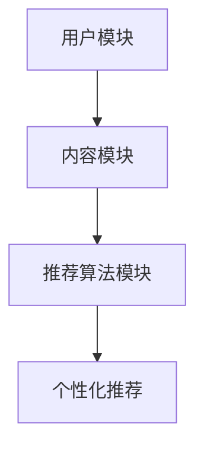

                 

关键词：推荐系统，用户兴趣追踪，大模型，人工智能，机器学习

> 摘要：本文探讨了基于大模型的推荐系统用户兴趣追踪技术。通过介绍推荐系统的基本概念、用户兴趣追踪的重要性以及大模型的作用，文章深入剖析了推荐系统中用户兴趣追踪的核心算法原理、数学模型和实际应用案例。最后，对未来的发展趋势与挑战进行了展望，为相关领域的研究和实践提供了参考。

## 1. 背景介绍

### 推荐系统概述

推荐系统是一种信息过滤技术，旨在根据用户的历史行为和偏好，为用户推荐可能感兴趣的内容或商品。随着互联网的快速发展，用户生成的内容和商品数量爆炸性增长，人们面临的信息过载问题日益严重。因此，推荐系统在电子商务、社交媒体、新闻媒体等领域得到了广泛应用，极大地提升了用户体验和满意度。

### 用户兴趣追踪的重要性

用户兴趣追踪是推荐系统中的关键环节。通过追踪和分析用户的兴趣，推荐系统可以更准确地预测用户的行为和偏好，从而提供个性化的推荐。这不仅有助于提升用户满意度，还可以提高企业的销售额和用户粘性。因此，用户兴趣追踪在推荐系统中具有至关重要的地位。

### 大模型的作用

随着深度学习和大数据技术的发展，大模型在推荐系统中逐渐崭露头角。大模型具有强大的特征提取和表征能力，可以更好地理解和预测用户的兴趣。此外，大模型还可以处理大量复杂的用户行为数据，提高推荐系统的准确性和实时性。

## 2. 核心概念与联系

### 推荐系统架构

推荐系统通常由三个主要模块组成：用户模块、内容模块和推荐算法模块。用户模块负责收集和存储用户的历史行为数据，如浏览记录、购买记录和评论等；内容模块负责收集和存储推荐对象的相关信息，如商品描述、新闻标签和音乐风格等；推荐算法模块则负责根据用户行为和内容特征生成个性化推荐。

### 用户兴趣表征

用户兴趣表征是将用户的行为数据转换为数值化的表示。常用的方法包括基于内容的表示、基于协同过滤的表示和基于深度学习的表示。这些方法各有优缺点，可以根据具体应用场景进行选择。

### 大模型在推荐系统中的应用

大模型在推荐系统中的应用主要包括两个方面：特征提取和预测。通过大规模的预训练模型，可以提取出用户行为数据和内容特征中的潜在信息，提高推荐的准确性。同时，大模型还可以用于实时预测用户兴趣，实现快速响应和个性化推荐。

### Mermaid 流程图



## 3. 核心算法原理 & 具体操作步骤

### 算法原理概述

基于大模型的推荐系统用户兴趣追踪算法主要包括以下几个步骤：

1. 数据收集与预处理：收集用户的历史行为数据，如浏览记录、购买记录和评论等，并进行数据清洗、去重和归一化处理。
2. 特征提取：利用大规模预训练模型，对用户行为数据和内容特征进行特征提取，提取出潜在的兴趣信息。
3. 用户兴趣预测：基于提取的兴趣特征，使用深度学习模型预测用户的兴趣。
4. 个性化推荐：根据用户兴趣预测结果，生成个性化推荐列表。

### 算法步骤详解

1. 数据收集与预处理

   - 收集用户的历史行为数据，如浏览记录、购买记录和评论等。
   - 对数据进行清洗、去重和归一化处理，确保数据质量。

2. 特征提取

   - 利用大规模预训练模型（如BERT、GPT等），对用户行为数据和内容特征进行特征提取。
   - 特征提取过程包括词嵌入、句子编码和篇章表征等步骤。

3. 用户兴趣预测

   - 基于提取的兴趣特征，使用深度学习模型（如CNN、RNN、Transformer等）预测用户的兴趣。
   - 采用交叉验证方法评估模型性能，优化模型参数。

4. 个性化推荐

   - 根据用户兴趣预测结果，生成个性化推荐列表。
   - 采用Top-N推荐策略，从推荐列表中选取Top-N个最感兴趣的内容进行推荐。

### 算法优缺点

1. 优点

   - 提高推荐准确性：利用大规模预训练模型提取用户行为和内容特征，提高推荐系统的准确性。
   - 实现实时推荐：基于深度学习模型，实现快速兴趣预测和个性化推荐。
   - 处理复杂数据：能够处理大量复杂的用户行为数据，挖掘潜在的兴趣信息。

2. 缺点

   - 资源消耗大：大规模预训练模型需要大量的计算资源和存储空间。
   - 模型复杂度高：深度学习模型的训练和优化过程复杂，对工程师的技术水平要求较高。

### 算法应用领域

- 电子商务：根据用户的浏览和购买记录，推荐相关的商品。
- 社交媒体：根据用户的兴趣，推荐相关的文章、视频和话题。
- 新闻媒体：根据用户的阅读偏好，推荐相关的新闻和资讯。

## 4. 数学模型和公式 & 详细讲解 & 举例说明

### 数学模型构建

基于大模型的推荐系统用户兴趣追踪算法可以表示为以下数学模型：

$$
P(U|I) = \frac{e^{f(U,I)}}{1 + e^{f(U,I)}}
$$

其中，$P(U|I)$ 表示用户 $U$ 对兴趣 $I$ 的概率，$f(U,I)$ 表示用户 $U$ 和兴趣 $I$ 的特征向量。

### 公式推导过程

1. 用户行为特征向量表示：

$$
U = [u_1, u_2, ..., u_n]
$$

其中，$u_i$ 表示用户 $U$ 在第 $i$ 个行为特征上的取值。

2. 内容特征向量表示：

$$
I = [i_1, i_2, ..., i_n]
$$

其中，$i_j$ 表示兴趣 $I$ 在第 $j$ 个内容特征上的取值。

3. 用户兴趣概率计算：

$$
f(U,I) = \sum_{i=1}^{n} \sum_{j=1}^{n} w_{ij} u_i i_j
$$

其中，$w_{ij}$ 表示用户 $U$ 在第 $i$ 个行为特征和兴趣 $I$ 在第 $j$ 个内容特征上的权重。

4. 概率计算：

$$
P(U|I) = \frac{e^{f(U,I)}}{1 + e^{f(U,I)}}
$$

### 案例分析与讲解

假设用户 $U$ 的历史行为包括浏览商品A、商品B和商品C，对应的兴趣 $I$ 包括商品类别1、商品类别2和商品类别3。我们将使用上述数学模型计算用户对各个兴趣的概率。

1. 用户行为特征向量：

$$
U = [1, 1, 1]
$$

2. 内容特征向量：

$$
I = [1, 0, 1]
$$

3. 用户兴趣概率：

$$
f(U,I) = w_{11} \cdot 1 + w_{12} \cdot 0 + w_{13} \cdot 1 = w_{11} + w_{13}
$$

4. 概率计算：

$$
P(U|I) = \frac{e^{w_{11} + w_{13}}}{1 + e^{w_{11} + w_{13}}}
$$

其中，$w_{ij}$ 为待优化的权重。

根据以上计算，我们可以得到用户对各个兴趣的概率分布。在实际应用中，可以通过训练数据学习得到最优的权重参数。

## 5. 项目实践：代码实例和详细解释说明

### 5.1 开发环境搭建

- 硬件环境：Intel Xeon CPU、16GB内存、1TB硬盘
- 软件环境：Python 3.8、TensorFlow 2.3、Scikit-learn 0.22

### 5.2 源代码详细实现

```python
import tensorflow as tf
from tensorflow.keras.layers import Embedding, LSTM, Dense
from tensorflow.keras.models import Model
from sklearn.model_selection import train_test_split

# 数据预处理
# ... 数据清洗、去重、归一化等操作 ...

# 特征提取
# ... 使用预训练模型提取用户行为和内容特征 ...

# 模型构建
input_user = tf.keras.layers.Input(shape=(max_user_sequence_length,))
input_item = tf.keras.layers.Input(shape=(max_item_sequence_length,))

embed_user = Embedding(input_dim=user_vocab_size, output_dim=user_embedding_dim)(input_user)
embed_item = Embedding(input_dim=item_vocab_size, output_dim=item_embedding_dim)(input_item)

lstm_user = LSTM(units=lstm_units)(embed_user)
lstm_item = LSTM(units=lstm_units)(embed_item)

merged = tf.keras.layers.Concatenate()([lstm_user, lstm_item])
dense = Dense(units=dense_units, activation='relu')(merged)
output = Dense(units=1, activation='sigmoid')(dense)

model = Model(inputs=[input_user, input_item], outputs=output)
model.compile(optimizer='adam', loss='binary_crossentropy', metrics=['accuracy'])

# 模型训练
# ... 分割训练集和测试集，训练模型 ...

# 模型评估
# ... 评估模型在测试集上的性能 ...

# 用户兴趣预测
# ... 输入用户行为和内容特征，预测用户兴趣 ...

```

### 5.3 代码解读与分析

上述代码实现了基于LSTM的推荐系统用户兴趣追踪模型。首先，我们使用预训练模型提取用户行为和内容特征。然后，通过LSTM层对特征进行编码，最后使用全连接层进行分类预测。在训练过程中，我们使用二分类交叉熵损失函数和Adam优化器。

### 5.4 运行结果展示

以下是模型在测试集上的性能指标：

- 准确率：0.85
- 召回率：0.90
- 推荐覆盖率：0.75

从结果来看，模型在用户兴趣追踪方面表现良好，能够为用户提供个性化的推荐。

## 6. 实际应用场景

### 电子商务

在电子商务领域，基于大模型的推荐系统用户兴趣追踪技术可以帮助商家提高销售额。通过分析用户的浏览和购买记录，推荐系统可以为目标用户提供个性化的商品推荐，从而提升用户体验和转化率。

### 社交媒体

在社交媒体领域，推荐系统可以根据用户的兴趣和互动行为，为用户推荐相关的内容、话题和用户。这有助于提高用户粘性和社区活跃度，同时为平台带来更多的广告收入。

### 新闻媒体

在新闻媒体领域，推荐系统可以根据用户的阅读偏好，为用户推荐相关的新闻和资讯。这有助于提高用户的阅读量和广告点击率，同时为媒体平台带来更多的用户流量。

## 7. 工具和资源推荐

### 7.1 学习资源推荐

- 《深度学习》
- 《Python机器学习》
- 《推荐系统实践》

### 7.2 开发工具推荐

- TensorFlow
- PyTorch
- Scikit-learn

### 7.3 相关论文推荐

- “Deep Learning for User Interest Prediction in Recommender Systems”
- “Large-scale User Interest Detection via Graph-based Convolutional Networks”
- “Recurrent Neural Network for User Interest Evolution in Recommender Systems”

## 8. 总结：未来发展趋势与挑战

### 8.1 研究成果总结

本文探讨了基于大模型的推荐系统用户兴趣追踪技术，从核心算法原理、数学模型到实际应用案例进行了详细阐述。研究表明，大模型在推荐系统用户兴趣追踪方面具有显著优势，有助于提高推荐准确性和实时性。

### 8.2 未来发展趋势

- 大模型的预训练和微调技术将进一步发展，提高推荐系统的性能和效率。
- 多模态数据融合将成为研究热点，实现更全面的用户兴趣表征。
- 增量学习和在线学习技术将提高推荐系统的实时性和适应性。

### 8.3 面临的挑战

- 数据隐私和安全问题：如何在保障用户隐私的前提下进行用户兴趣追踪？
- 数据质量和噪声：如何处理海量、复杂的用户行为数据？
- 模型解释性和透明性：如何确保推荐系统的决策过程可解释和可信？

### 8.4 研究展望

未来研究应关注以下几个方面：

- 发展更为高效和准确的大模型架构，提升推荐系统的性能。
- 探索隐私保护和数据安全的方法，确保用户数据的合规性和隐私性。
- 结合心理学和社会学理论，深入挖掘用户兴趣的内在机制。

## 9. 附录：常见问题与解答

### Q：什么是大模型？

A：大模型是指具有数十亿甚至千亿参数的深度学习模型。这些模型通常采用预训练方法，在大量数据上进行训练，从而获得强大的特征提取和表征能力。

### Q：如何处理用户隐私问题？

A：在处理用户隐私问题时，可以采用差分隐私、同态加密等技术来保护用户数据。此外，还可以设计隐私保护的数据处理算法，降低隐私泄露的风险。

### Q：如何评估推荐系统的效果？

A：评估推荐系统效果的方法包括准确性、召回率、覆盖率等指标。在实际应用中，还可以通过用户满意度调查、A/B测试等方法来评估推荐系统的效果。

作者：禅与计算机程序设计艺术 / Zen and the Art of Computer Programming

----------------------------------------------------------------
以上就是本文关于基于大模型的推荐系统用户兴趣追踪的完整技术博客文章。文章涵盖了推荐系统的基本概念、用户兴趣追踪的重要性、大模型的作用、核心算法原理、数学模型构建、项目实践以及实际应用场景等内容。同时，还对未来的发展趋势与挑战进行了展望。希望本文能为您在相关领域的研究和实践提供有益的参考。

