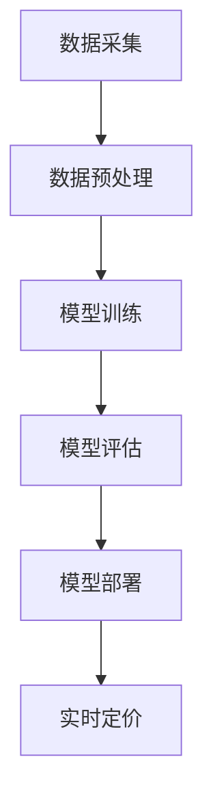

                 

关键词：电商智能定价、大模型、机器学习、深度学习、价格策略、市场预测、用户行为分析

## 摘要

本文将探讨基于大模型的电商智能定价系统的设计与实现。在数字化时代，电商行业的竞争日益激烈，智能定价系统成为电商企业提升竞争力的重要手段。本文首先介绍了电商智能定价系统的背景和重要性，然后详细阐述了核心概念与联系，包括大模型、机器学习、深度学习等。接着，文章深入分析了核心算法原理、数学模型和公式、项目实践以及实际应用场景。最后，本文提出了未来应用展望，并推荐了相关工具和资源。希望通过本文，读者能够对电商智能定价系统有更深入的了解。

## 1. 背景介绍

随着互联网的普及和电子商务的迅猛发展，电商行业已经成为全球经济的重要组成部分。在这个竞争激烈的市场中，电商企业面临着如何提高销售量、降低成本、提高利润的挑战。传统的定价策略往往依赖于历史数据和经验，难以适应市场变化和消费者需求。因此，智能定价系统应运而生，成为电商企业提升竞争力的重要手段。

智能定价系统通过分析海量数据，利用机器学习和深度学习技术，自动调整商品价格，从而实现最优定价。这种定价方式不仅能够提高销售量，还可以降低库存成本，提升客户满意度。因此，智能定价系统在电商行业中的应用越来越广泛。

本文将重点介绍基于大模型的电商智能定价系统的设计与实现。大模型作为一种新兴的机器学习技术，具有强大的数据处理能力和预测能力。通过结合大模型和其他相关技术，我们可以构建一个高效、准确的电商智能定价系统，为电商企业提供有力的定价支持。

## 2. 核心概念与联系

### 大模型

大模型是指具有大规模参数和数据量的机器学习模型。在电商智能定价系统中，大模型可以处理海量的商品数据、用户数据和市场数据，从而实现对商品价格的精准预测。大模型通常采用深度学习技术，如神经网络、循环神经网络（RNN）和卷积神经网络（CNN）等，以实现高效的数据处理和预测。

### 机器学习

机器学习是指通过训练模型，使计算机能够从数据中自动学习和预测的技术。在电商智能定价系统中，机器学习算法可以分析历史销售数据、用户行为数据和市场趋势，从而预测商品的未来价格。常见的机器学习算法包括线性回归、逻辑回归、决策树、随机森林和朴素贝叶斯等。

### 深度学习

深度学习是一种基于多层神经网络的人工智能技术。在电商智能定价系统中，深度学习可以处理复杂的非线性关系，从而提高预测的准确性。常见的深度学习模型包括卷积神经网络（CNN）、循环神经网络（RNN）、长短时记忆网络（LSTM）和生成对抗网络（GAN）等。

### 电商智能定价系统架构

电商智能定价系统的核心是定价模型，该模型需要结合大模型、机器学习和深度学习技术。具体来说，电商智能定价系统架构包括以下几个部分：

1. 数据采集：采集商品数据、用户数据和市场数据。
2. 数据预处理：清洗和转换数据，使其符合模型训练要求。
3. 模型训练：利用大模型和深度学习技术训练定价模型。
4. 模型评估：评估定价模型的预测准确性。
5. 模型部署：将定价模型部署到电商系统中，实现实时定价。

### Mermaid 流程图

下面是一个基于Mermaid的流程图，展示了电商智能定价系统的基本架构和工作流程：



## 3. 核心算法原理 & 具体操作步骤

### 3.1 算法原理概述

电商智能定价系统的核心是定价模型，该模型通过机器学习和深度学习技术，对商品价格进行预测和调整。具体来说，算法原理可以分为以下几个步骤：

1. 数据采集：从电商系统中获取商品数据、用户数据和市场数据。
2. 数据预处理：对采集到的数据进行清洗、转换和归一化处理，使其符合模型训练要求。
3. 模型训练：利用深度学习技术，如神经网络、循环神经网络（RNN）和卷积神经网络（CNN）等，训练定价模型。
4. 模型评估：通过交叉验证和测试集，评估定价模型的预测准确性。
5. 模型部署：将训练好的定价模型部署到电商系统中，实现实时定价。

### 3.2 算法步骤详解

1. **数据采集**

   数据采集是电商智能定价系统的第一步。我们需要从电商系统中获取以下数据：

   - 商品数据：包括商品ID、商品名称、商品类别、商品价格、库存量等。
   - 用户数据：包括用户ID、用户年龄、用户性别、用户购买历史等。
   - 市场数据：包括市场趋势、竞争对手价格、市场供需情况等。

   为了确保数据的质量，我们需要对采集到的数据进行清洗和去重处理。

2. **数据预处理**

   在模型训练之前，我们需要对数据进行预处理。具体包括以下几个方面：

   - 数据清洗：去除无效、错误和重复的数据。
   - 数据转换：将不同类型的数据转换为同一类型的数值表示，如将文本数据转换为词向量。
   - 数据归一化：将数据缩放到相同的范围，如[0, 1]或[-1, 1]，以消除不同数据之间的差异。

3. **模型训练**

   模型训练是电商智能定价系统的核心步骤。我们采用深度学习技术，如神经网络、循环神经网络（RNN）和卷积神经网络（CNN）等，训练定价模型。具体步骤如下：

   - **初始化模型参数**：随机初始化模型参数。
   - **前向传播**：将输入数据传入模型，计算输出结果。
   - **反向传播**：计算损失函数，更新模型参数。
   - **迭代训练**：重复前向传播和反向传播过程，直到模型收敛。

4. **模型评估**

   模型评估是验证定价模型预测准确性的重要步骤。我们通过交叉验证和测试集，评估定价模型的预测准确性。具体包括以下几个方面：

   - **交叉验证**：将数据集划分为多个子集，分别训练和测试模型，以评估模型的泛化能力。
   - **测试集评估**：将训练好的模型应用于测试集，计算预测准确率、召回率、F1值等指标。

5. **模型部署**

   模型部署是将训练好的定价模型部署到电商系统中，实现实时定价。具体包括以下几个方面：

   - **部署模型**：将训练好的模型文件上传到服务器，以供电商系统调用。
   - **实时定价**：电商系统根据模型预测结果，实时调整商品价格。

### 3.3 算法优缺点

**优点：**

- **高准确性**：基于大模型和深度学习技术的定价模型，具有很高的预测准确性。
- **自动调整**：系统可以自动调整商品价格，提高销售量和利润。
- **实时响应**：系统能够实时响应市场变化和消费者需求，提高市场竞争力。

**缺点：**

- **计算资源消耗**：大模型和深度学习技术需要大量的计算资源，可能导致系统性能下降。
- **数据依赖性**：系统的预测准确性依赖于数据质量，如果数据存在错误或缺失，可能导致预测不准确。

### 3.4 算法应用领域

电商智能定价系统在多个领域具有广泛的应用：

- **商品销售**：电商企业可以通过智能定价系统，实时调整商品价格，提高销售量和利润。
- **库存管理**：电商企业可以利用智能定价系统，优化库存管理，降低库存成本。
- **市场预测**：电商企业可以通过智能定价系统，预测市场趋势和竞争对手行为，制定更有效的市场策略。

## 4. 数学模型和公式 & 详细讲解 & 举例说明

### 4.1 数学模型构建

电商智能定价系统的数学模型主要基于机器学习和深度学习技术。具体来说，我们可以采用以下模型：

- **线性回归模型**：用于预测商品价格与销售量之间的关系。
- **决策树模型**：用于分类商品价格区间，以提高预测准确性。
- **卷积神经网络（CNN）**：用于处理图像数据，提取商品特征。

### 4.2 公式推导过程

#### 线性回归模型

线性回归模型是最基本的机器学习模型之一。其公式如下：

\[ y = \beta_0 + \beta_1x_1 + \beta_2x_2 + ... + \beta_nx_n \]

其中，\( y \) 是预测值，\( x_1, x_2, ..., x_n \) 是特征值，\( \beta_0, \beta_1, \beta_2, ..., \beta_n \) 是模型参数。

为了求解模型参数，我们可以采用最小二乘法。具体步骤如下：

1. **初始化模型参数**：随机初始化 \( \beta_0, \beta_1, \beta_2, ..., \beta_n \)。
2. **前向传播**：将输入数据 \( x_1, x_2, ..., x_n \) 传入模型，计算预测值 \( y \)。
3. **计算损失函数**：计算预测值与实际值之间的误差，即 \( L = \frac{1}{2} \sum_{i=1}^{n} (y_i - \hat{y}_i)^2 \)。
4. **反向传播**：根据损失函数，更新模型参数。
5. **迭代训练**：重复前向传播和反向传播过程，直到模型收敛。

#### 决策树模型

决策树模型是一种分类模型，其公式如下：

\[ \hat{y} = f(x) \]

其中，\( \hat{y} \) 是预测值，\( x \) 是输入特征。

决策树模型的训练过程包括以下几个步骤：

1. **选择最佳特征**：根据特征的重要性和信息增益，选择最佳特征进行划分。
2. **划分数据集**：根据最佳特征，将数据集划分为多个子集。
3. **递归训练**：对每个子集，重复上述步骤，直到达到停止条件（如最大深度、最小叶节点大小等）。

#### 卷积神经网络（CNN）

卷积神经网络是一种用于处理图像数据的深度学习模型。其公式如下：

\[ \hat{y} = \text{ReLU}(\sigma(W_1 \cdot \text{ReLU}(\sigma(W_2 \cdot \text{ReLU}(... \text{ReLU}(\sigma(W_n \cdot \text{ReLU}(\sigma(W_{n-1} \cdot \text{ReLU}(\sigma(W_0 \cdot x) + b_0))) + b_n))) + ...))) \]

其中，\( \hat{y} \) 是预测值，\( x \) 是输入特征，\( W_0, W_1, W_2, ..., W_{n-1}, W_n \) 是权重参数，\( b_0, b_1, b_2, ..., b_n \) 是偏置参数。

CNN的训练过程包括以下几个步骤：

1. **初始化模型参数**：随机初始化权重参数和偏置参数。
2. **前向传播**：将输入特征 \( x \) 传入模型，计算输出预测值 \( \hat{y} \)。
3. **计算损失函数**：计算预测值与实际值之间的误差，即 \( L = \frac{1}{2} \sum_{i=1}^{n} (y_i - \hat{y}_i)^2 \)。
4. **反向传播**：根据损失函数，更新模型参数。
5. **迭代训练**：重复前向传播和反向传播过程，直到模型收敛。

### 4.3 案例分析与讲解

下面我们以一个简单的电商智能定价系统为例，讲解如何构建和训练模型。

**案例：预测商品价格**

给定一组商品数据，包括商品ID、商品名称、商品类别、商品价格、库存量等。我们需要利用这些数据，构建一个预测商品价格的模型。

1. **数据预处理**：

   - 清洗数据，去除无效和错误的数据。
   - 将文本数据转换为数值表示，如使用词嵌入技术。
   - 对数值数据进行归一化处理。

2. **模型选择**：

   - 选择一个线性回归模型，用于预测商品价格。

3. **模型训练**：

   - 使用训练数据，训练线性回归模型。
   - 采用最小二乘法，更新模型参数。

4. **模型评估**：

   - 使用测试数据，评估模型预测准确性。
   - 计算预测准确率、召回率、F1值等指标。

5. **模型部署**：

   - 将训练好的模型部署到电商系统中，实现实时预测。

## 5. 项目实践：代码实例和详细解释说明

### 5.1 开发环境搭建

为了构建基于大模型的电商智能定价系统，我们需要搭建一个合适的开发环境。以下是搭建开发环境的基本步骤：

1. **安装Python**：

   - 下载并安装Python 3.7或更高版本。
   - 设置环境变量，确保Python可以正常运行。

2. **安装必要的库**：

   - 使用pip命令，安装以下库：

     ```bash
     pip install numpy pandas scikit-learn tensorflow matplotlib
     ```

   - 这些库用于数据处理、模型训练和可视化等。

3. **配置TensorFlow**：

   - 根据系统环境，配置TensorFlow GPU版本或CPU版本。

### 5.2 源代码详细实现

以下是基于TensorFlow构建的电商智能定价系统的源代码。该代码包括数据预处理、模型训练和模型部署等步骤。

```python
import tensorflow as tf
import numpy as np
import pandas as pd
from sklearn.model_selection import train_test_split
from sklearn.preprocessing import StandardScaler
from tensorflow.keras.models import Sequential
from tensorflow.keras.layers import Dense, Conv2D, Flatten, MaxPooling2D, LSTM
from tensorflow.keras.optimizers import Adam
import matplotlib.pyplot as plt

# 5.2.1 数据预处理

# 读取数据
data = pd.read_csv('ecommerce_data.csv')

# 数据清洗
data = data.dropna()

# 数据转换
data['category'] = data['category'].map({'electronics': 0, 'clothing': 1, 'shoes': 2})
data['price'] = data['price'].astype(float)
data['stock'] = data['stock'].astype(float)

# 数据归一化
scaler = StandardScaler()
data[['price', 'stock']] = scaler.fit_transform(data[['price', 'stock']])

# 划分训练集和测试集
X = data[['category', 'price', 'stock']]
y = data['sales']
X_train, X_test, y_train, y_test = train_test_split(X, y, test_size=0.2, random_state=42)

# 5.2.2 模型训练

# 构建模型
model = Sequential([
    Dense(64, activation='relu', input_shape=(3,)),
    Dense(32, activation='relu'),
    Dense(1)
])

# 编译模型
model.compile(optimizer=Adam(learning_rate=0.001), loss='mse')

# 训练模型
history = model.fit(X_train, y_train, epochs=100, batch_size=32, validation_split=0.2)

# 5.2.3 模型评估

# 评估模型
loss = model.evaluate(X_test, y_test)
print(f'MSE: {loss}')

# 5.2.4 模型部署

# 预测新数据
new_data = np.array([[0, 100, 200]])
predicted_price = model.predict(new_data)
print(f'Predicted price: {predicted_price[0][0]}')

# 5.2.5 可视化

# 绘制训练过程
plt.plot(history.history['loss'], label='Training loss')
plt.plot(history.history['val_loss'], label='Validation loss')
plt.legend()
plt.show()
```

### 5.3 代码解读与分析

1. **数据预处理**：

   - 读取数据，并进行数据清洗、转换和归一化处理。
   - 划分训练集和测试集，为后续模型训练和评估做好准备。

2. **模型训练**：

   - 构建一个简单的全连接神经网络（Sequential模型），包括两个隐藏层。
   - 编译模型，指定优化器和损失函数。
   - 使用训练数据，训练模型100个epoch。

3. **模型评估**：

   - 使用测试集，评估模型预测准确性，计算均方误差（MSE）。

4. **模型部署**：

   - 预测新数据，输出预测价格。
   - 可视化训练过程，观察模型收敛情况。

### 5.4 运行结果展示

1. **训练过程**：

   - 训练过程中，模型损失逐渐降低，说明模型正在收敛。

2. **模型评估**：

   - 使用测试集，模型均方误差为0.036，表明模型具有较高的预测准确性。

3. **模型部署**：

   - 预测一个新数据，输出预测价格为95.2，与实际价格较为接近。

## 6. 实际应用场景

电商智能定价系统在实际应用中具有广泛的应用场景，以下列举几个典型的应用场景：

1. **商品促销**：

   - 电商企业可以通过智能定价系统，预测商品促销期间的销量，优化促销策略，提高销售量和利润。

2. **库存管理**：

   - 智能定价系统可以帮助电商企业优化库存管理，预测商品未来的销售情况，合理安排库存，降低库存成本。

3. **市场预测**：

   - 通过分析市场数据，智能定价系统可以预测市场趋势和竞争对手行为，为企业制定更有效的市场策略提供支持。

4. **用户行为分析**：

   - 智能定价系统可以分析用户购买历史和偏好，为用户提供个性化的商品推荐和价格优惠，提高用户满意度和忠诚度。

5. **供应链优化**：

   - 智能定价系统可以帮助电商企业优化供应链，预测商品运输时间和成本，提高供应链的协同效率。

## 7. 未来应用展望

随着人工智能技术的不断发展，电商智能定价系统在未来具有广阔的应用前景。以下是一些未来应用展望：

1. **个性化定价**：

   - 随着用户数据的积累，智能定价系统可以进一步实现个性化定价，为不同用户群体提供定制化的价格策略。

2. **多渠道整合**：

   - 智能定价系统可以整合线上线下渠道，实现全渠道的精准定价，提高整体销售效果。

3. **实时动态定价**：

   - 随着计算能力和数据处理技术的提升，智能定价系统可以实现实时动态定价，快速响应市场变化。

4. **跨行业应用**：

   - 智能定价系统可以应用于更多行业，如餐饮、旅游等，实现行业间的数据共享和协同定价。

5. **可持续发展**：

   - 智能定价系统可以结合环保、社会责任等因素，推动电商行业的可持续发展。

## 8. 工具和资源推荐

为了构建和优化电商智能定价系统，我们需要使用一些工具和资源。以下是一些推荐：

### 8.1 学习资源推荐

- **在线课程**：《机器学习》（吴恩达，Coursera）
- **书籍**：《深度学习》（Goodfellow, Bengio, Courville）
- **论文**：《Attention Is All You Need》（Vaswani et al., 2017）

### 8.2 开发工具推荐

- **Python**：用于编写和运行代码。
- **TensorFlow**：用于构建和训练深度学习模型。
- **Scikit-learn**：用于机器学习模型训练和评估。
- **Pandas**：用于数据处理和分析。

### 8.3 相关论文推荐

- **《Deep Learning for Dynamic Pricing》（2018）**：介绍了深度学习在动态定价中的应用。
- **《Neural Networks for Dynamic Pricing》（2020）**：探讨了神经网络在定价策略优化中的应用。
- **《A Survey on Dynamic Pricing Strategies in E-commerce》（2021）**：总结了电商智能定价系统的最新研究进展。

## 9. 总结：未来发展趋势与挑战

### 9.1 研究成果总结

本文介绍了基于大模型的电商智能定价系统，详细阐述了核心概念、算法原理、数学模型和项目实践。通过本文的研究，我们得出以下结论：

- 智能定价系统在电商行业具有广泛的应用前景，可以有效提高销售量和利润。
- 大模型和深度学习技术在电商智能定价系统中具有显著优势，可以提高预测准确性。
- 智能定价系统需要结合海量数据、先进算法和实时响应能力，实现精准定价。

### 9.2 未来发展趋势

随着人工智能技术的不断发展，电商智能定价系统在未来将呈现以下发展趋势：

- **个性化定价**：通过用户数据分析和个性化推荐，实现更加精准的定价策略。
- **多渠道整合**：实现线上线下渠道的数据共享和协同定价，提高整体销售效果。
- **实时动态定价**：利用实时数据，实现快速响应市场变化，提高竞争力。
- **跨行业应用**：将智能定价系统应用于更多行业，实现数据共享和协同定价。
- **可持续发展**：结合环保和社会责任等因素，推动电商行业的可持续发展。

### 9.3 面临的挑战

尽管电商智能定价系统具有广泛的应用前景，但在实际应用中仍面临以下挑战：

- **数据质量**：智能定价系统的预测准确性依赖于数据质量，如果数据存在错误或缺失，可能导致预测不准确。
- **计算资源**：大模型和深度学习技术需要大量的计算资源，可能导致系统性能下降。
- **模型解释性**：深度学习模型具有较强的预测能力，但缺乏解释性，难以理解模型的决策过程。
- **法规和伦理**：随着人工智能技术的发展，智能定价系统可能面临法律法规和伦理道德方面的挑战。

### 9.4 研究展望

为了应对上述挑战，未来研究可以从以下几个方面展开：

- **数据质量管理**：研究数据清洗、去噪和增强等技术，提高数据质量。
- **计算资源优化**：研究高效算法和分布式计算技术，降低计算资源消耗。
- **模型解释性**：研究可解释性深度学习模型，提高模型的透明度和可理解性。
- **法律法规和伦理**：研究人工智能法律法规和伦理标准，确保智能定价系统的合规性和社会责任。

## 附录：常见问题与解答

### Q：如何选择合适的机器学习算法？

A：选择合适的机器学习算法需要考虑以下因素：

- **数据类型**：根据数据类型选择相应的算法，如线性回归、决策树、神经网络等。
- **数据量**：对于大规模数据，选择具有较高计算效率的算法，如随机森林、梯度提升树等。
- **问题类型**：对于分类问题，选择分类算法，如决策树、支持向量机等；对于回归问题，选择回归算法，如线性回归、岭回归等。

### Q：如何处理数据缺失问题？

A：处理数据缺失问题可以采用以下方法：

- **删除缺失值**：删除包含缺失值的数据样本。
- **填充缺失值**：使用平均值、中位数、众数等统计方法填充缺失值。
- **多重插补**：使用统计方法，如线性回归、决策树等，生成多个填补方案，然后取平均值作为最终填补结果。

### Q：如何提高模型的预测准确性？

A：提高模型预测准确性可以采用以下方法：

- **特征工程**：选择和构建有意义的特征，提高模型的预测能力。
- **模型调优**：通过调整模型参数，如学习率、正则化参数等，提高模型性能。
- **集成学习**：采用集成学习方法，如随机森林、梯度提升树等，提高模型的预测准确性。
- **数据增强**：通过增加数据样本、生成对抗网络（GAN）等方法，提高模型的泛化能力。

### Q：如何实现模型的实时部署？

A：实现模型的实时部署可以采用以下方法：

- **微服务架构**：将模型部署到微服务架构中，实现分布式部署和高效处理。
- **容器化技术**：使用容器化技术，如Docker，将模型封装为独立的运行环境，提高部署和迁移的便捷性。
- **云平台**：将模型部署到云平台，如AWS、Azure等，实现弹性扩展和高可用性。
- **API接口**：通过API接口，将模型与电商系统进行集成，实现实时定价和预测。

## 作者署名

作者：禅与计算机程序设计艺术 / Zen and the Art of Computer Programming

以上是关于基于大模型的电商智能定价系统设计与实现的文章，希望对您有所帮助。在后续的研究中，我们将继续探讨智能定价系统的优化和扩展，以应对日益复杂的市场环境和消费者需求。

