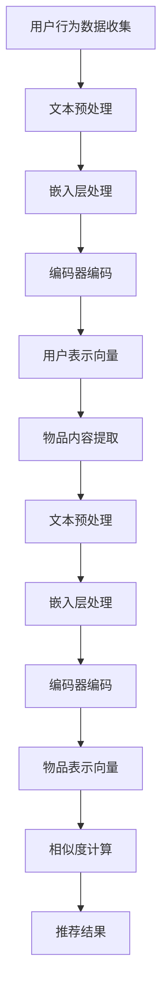
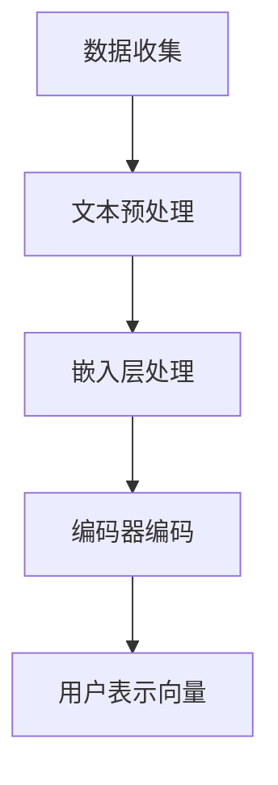
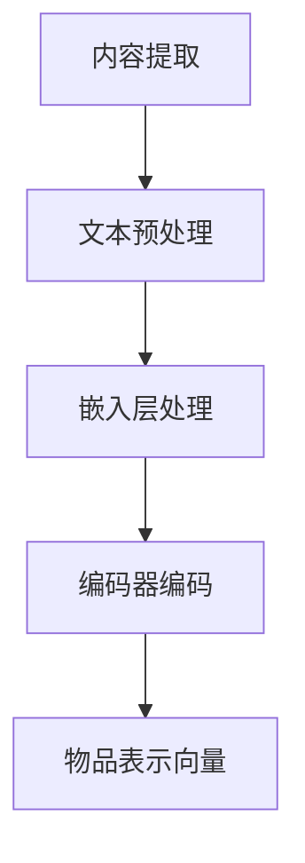

                 

关键词：大语言模型、推荐系统、安全性、隐私保护、对抗攻击、网络安全

## 摘要

本文深入探讨了基于大语言模型的推荐系统在安全性方面所面临的挑战和解决方案。随着人工智能技术的迅猛发展，推荐系统已经成为互联网中不可或缺的一部分，但同时也成为了恶意攻击者的目标。本文首先介绍了大语言模型在推荐系统中的应用及其带来的挑战，然后提出了几种安全性增强方案，包括对抗攻击防御、隐私保护措施和网络安全策略。通过实例分析和数学模型构建，本文详细解释了这些方案的具体实现方法和效果，为推荐系统的安全性和可靠性提供了新的思路。

## 1. 背景介绍

### 1.1 推荐系统的发展

推荐系统是一种基于数据挖掘和机器学习技术，通过分析用户的历史行为和兴趣偏好，为用户提供个性化推荐信息的系统。自从20世纪90年代以来，推荐系统在电子商务、社交媒体、在线视频、音乐和新闻等领域得到了广泛应用，极大地提升了用户体验和商业价值。

随着互联网的普及和大数据技术的发展，推荐系统的规模和复杂度也在不断增长。早期的推荐系统主要依赖于基于内容的过滤和协同过滤算法，但受限于数据量和计算能力，推荐效果有限。随着深度学习和自然语言处理技术的进步，基于大语言模型的推荐系统逐渐崭露头角，提供了更为精准和个性化的推荐服务。

### 1.2 大语言模型的应用

大语言模型（Large Language Models）是指参数规模巨大、可以处理和理解自然语言的深度神经网络模型。其中，最具代表性的模型是Google的BERT（Bidirectional Encoder Representations from Transformers）和OpenAI的GPT（Generative Pre-trained Transformer）系列。

大语言模型通过预训练和微调，可以在多个自然语言处理任务上取得优异的性能，如文本分类、情感分析、机器翻译、问答系统和信息提取等。在推荐系统中，大语言模型的应用主要体现在以下几个方面：

1. **用户兴趣建模**：大语言模型可以捕捉用户的历史行为和文本评论，对用户的兴趣偏好进行建模和预测。
2. **内容理解与匹配**：大语言模型能够理解推荐内容的语义信息，从而提高推荐的准确性和相关性。
3. **对话生成与交互**：大语言模型可以生成自然流畅的对话，增强推荐系统的用户体验。

尽管大语言模型在推荐系统中展现了巨大的潜力，但也带来了新的安全挑战，如对抗攻击、隐私泄露和网络安全等。本文将针对这些挑战提出相应的安全性增强方案。

### 1.3 安全性挑战

#### 1.3.1 对抗攻击

对抗攻击（Adversarial Attack）是指通过向模型输入微小但精心设计的扰动，导致模型输出发生错误的攻击方法。在推荐系统中，对抗攻击可能表现为向用户推荐不相关的或恶意的物品，从而降低用户体验和系统的信誉。

对抗攻击主要分为两类：模型入侵型攻击和输入数据攻击。模型入侵型攻击通过修改模型的参数或结构来破坏模型的鲁棒性，而输入数据攻击则是通过修改用户数据或推荐内容来误导模型。

#### 1.3.2 隐私保护

推荐系统通常依赖于用户的历史行为和兴趣偏好，这些数据对用户隐私构成了潜在的风险。如果这些数据被恶意攻击者获取，可能导致用户被跟踪、广告精准投放和隐私泄露等问题。

隐私保护的主要挑战在于如何在保证推荐效果的同时，最大限度地减少用户隐私信息的暴露。当前的主要隐私保护措施包括数据匿名化、差分隐私和同态加密等。

#### 1.3.3 网络安全

推荐系统通常部署在互联网上，面临着各种网络攻击的风险，如DDoS攻击、中间人攻击和数据窃取等。这些攻击可能导致系统服务中断、数据丢失或被篡改，从而影响推荐系统的稳定性和可靠性。

网络安全的主要挑战在于如何构建一个安全可靠的推荐系统架构，以抵御各种网络攻击，确保用户数据和系统资源的安全。

### 1.4 安全性增强的必要性

随着推荐系统在各个领域的广泛应用，其安全性问题日益突出。增强推荐系统的安全性不仅有助于提高用户体验和系统信誉，还可以防止潜在的经济损失和法律纠纷。

本文将详细介绍几种基于大语言模型的推荐系统安全性增强方案，包括对抗攻击防御、隐私保护措施和网络安全策略。通过实例分析和数学模型构建，我们将详细解释这些方案的具体实现方法和效果，为推荐系统的安全性和可靠性提供新的思路。

### 1.5 文章结构

本文的结构如下：

- **第2章：核心概念与联系**：介绍大语言模型和推荐系统的核心概念，并使用Mermaid流程图展示其架构关系。
- **第3章：核心算法原理 & 具体操作步骤**：详细阐述大语言模型在推荐系统中的具体应用原理和操作步骤。
- **第4章：数学模型和公式 & 详细讲解 & 举例说明**：构建推荐系统的数学模型，并使用latex格式详细推导公式，结合案例进行分析。
- **第5章：项目实践：代码实例和详细解释说明**：提供一个基于大语言模型的推荐系统实现案例，详细解释代码实现和运行结果。
- **第6章：实际应用场景**：探讨大语言模型在推荐系统中的实际应用场景，包括电子商务、社交媒体和在线视频等领域。
- **第7章：未来应用展望**：预测大语言模型在推荐系统中的未来发展趋势和应用方向。
- **第8章：总结：未来发展趋势与挑战**：总结本文的研究成果，展望未来发展趋势和面临的挑战。
- **第9章：附录：常见问题与解答**：提供常见问题及其解答，帮助读者更好地理解和应用本文的内容。

接下来，我们将详细探讨大语言模型和推荐系统的核心概念和联系，为后续内容打下基础。

## 2. 核心概念与联系

### 2.1 大语言模型的基本概念

大语言模型（Large Language Models）是一种基于深度学习的自然语言处理模型，具有处理和理解自然语言的能力。其主要特点是参数规模巨大，可以捕捉到语言中的复杂模式和语义信息。大语言模型的核心组件包括：

- **嵌入层（Embedding Layer）**：将输入的文本转换为固定长度的向量表示，便于后续的神经网络处理。
- **编码器（Encoder）**：使用Transformer架构或其他递归神经网络（如LSTM、GRU）对文本进行编码，生成序列的上下文表示。
- **解码器（Decoder）**：解码器根据编码器生成的上下文表示生成输出文本，通常使用自注意力机制（Self-Attention）来处理序列信息。

大语言模型通常通过预训练和微调两个阶段进行训练。预训练阶段使用大量未标注的文本数据，模型学习语言的基本结构和统计规律；微调阶段则使用特定任务的数据，模型进一步学习任务相关的知识。

### 2.2 推荐系统的基本概念

推荐系统（Recommendation System）是一种基于数据挖掘和机器学习技术的系统，旨在为用户提供个性化的推荐信息。推荐系统的主要组件包括：

- **用户表示（User Representation）**：将用户的兴趣、行为和偏好等信息转换为向量表示。
- **物品表示（Item Representation）**：将物品的特征和属性转换为向量表示。
- **相似度计算（Similarity Computation）**：计算用户和物品之间的相似度，以便为用户推荐相似的物品。
- **推荐算法（Recommendation Algorithm）**：根据用户和物品的表示及相似度计算，生成推荐结果。

推荐系统的核心目标是提高用户的满意度和系统的价值，常见的推荐算法包括基于内容的过滤、协同过滤、矩阵分解和深度学习等。

### 2.3 大语言模型在推荐系统中的应用

大语言模型在推荐系统中具有广泛的应用，其主要优势在于能够捕捉用户和物品的语义信息，从而提高推荐的准确性和个性化水平。以下是大语言模型在推荐系统中的几个关键应用：

#### 2.3.1 用户兴趣建模

大语言模型可以分析用户的历史行为和文本评论，提取用户的兴趣偏好。具体步骤如下：

1. **用户行为数据收集**：收集用户的历史行为数据，如浏览记录、购买记录和评论内容。
2. **文本预处理**：对用户的文本评论进行预处理，包括分词、去停用词、词干提取等。
3. **嵌入层处理**：将预处理后的文本转换为嵌入向量。
4. **编码器编码**：使用编码器对嵌入向量进行编码，生成用户表示向量。

通过这种方式，大语言模型可以捕捉用户在不同情境下的兴趣变化，从而实现更精准的用户兴趣建模。

#### 2.3.2 内容理解与匹配

大语言模型能够理解推荐内容的语义信息，从而提高推荐的准确性和相关性。具体步骤如下：

1. **物品内容提取**：从数据库中提取物品的描述性文本，如商品详情、电影剧情和新闻摘要。
2. **文本预处理**：对物品的文本内容进行预处理，包括分词、去停用词、词干提取等。
3. **嵌入层处理**：将预处理后的文本转换为嵌入向量。
4. **编码器编码**：使用编码器对嵌入向量进行编码，生成物品表示向量。

通过比较用户表示向量和物品表示向量，大语言模型可以找到与用户兴趣最相关的物品，从而提高推荐的准确性。

#### 2.3.3 对话生成与交互

大语言模型可以生成自然流畅的对话，增强推荐系统的用户体验。具体步骤如下：

1. **对话数据收集**：收集用户与推荐系统的交互数据，如聊天记录、问答记录等。
2. **文本预处理**：对对话文本进行预处理，包括分词、去停用词、词干提取等。
3. **嵌入层处理**：将预处理后的文本转换为嵌入向量。
4. **编码器编码**：使用编码器对嵌入向量进行编码，生成对话表示向量。

通过对话生成模型，大语言模型可以生成与用户意图和兴趣相关的对话内容，从而实现更自然的用户交互。

### 2.4 Mermaid流程图

为了更直观地展示大语言模型在推荐系统中的应用，我们使用Mermaid流程图来描述其架构和流程。以下是一个简单的Mermaid流程图示例：



在这个流程图中，用户行为数据收集、文本预处理、嵌入层处理和编码器编码是用户兴趣建模的关键步骤；物品内容提取、文本预处理、嵌入层处理和编码器编码是内容理解与匹配的关键步骤；相似度计算和推荐结果是整个推荐流程的输出。

通过上述核心概念和流程图的介绍，我们可以更好地理解大语言模型在推荐系统中的应用及其安全性挑战。接下来，我们将详细探讨大语言模型在推荐系统中的核心算法原理和具体操作步骤。

## 3. 核心算法原理 & 具体操作步骤

### 3.1 算法原理概述

大语言模型在推荐系统中的应用主要依赖于用户和物品的表示学习、相似度计算和推荐生成三个核心算法。以下是这些算法的原理和操作步骤：

#### 3.1.1 用户表示学习

用户表示学习是指通过分析用户的历史行为和文本评论，将用户的兴趣偏好转换为向量表示。这个过程可以分为以下几个步骤：

1. **数据收集**：收集用户的历史行为数据，如浏览记录、购买记录和评论内容。
2. **文本预处理**：对用户的文本评论进行预处理，包括分词、去停用词、词干提取等。
3. **嵌入层处理**：将预处理后的文本转换为嵌入向量。
4. **编码器编码**：使用编码器对嵌入向量进行编码，生成用户表示向量。

用户表示向量的生成过程如图3.1所示：



#### 3.1.2 物品表示学习

物品表示学习是指通过提取物品的描述性文本，将物品的特征和属性转换为向量表示。这个过程也可以分为以下几个步骤：

1. **内容提取**：从数据库中提取物品的描述性文本，如商品详情、电影剧情和新闻摘要。
2. **文本预处理**：对物品的文本内容进行预处理，包括分词、去停用词、词干提取等。
3. **嵌入层处理**：将预处理后的文本转换为嵌入向量。
4. **编码器编码**：使用编码器对嵌入向量进行编码，生成物品表示向量。

物品表示向量的生成过程如图3.2所示：



#### 3.1.3 相似度计算

相似度计算是指通过比较用户表示向量和物品表示向量，计算用户和物品之间的相似度。常用的相似度计算方法包括余弦相似度、皮尔逊相关系数和欧几里得距离等。以下是余弦相似度的计算公式：

$$
\text{similarity}(u, i) = \frac{u \cdot i}{\|u\| \|i\|}
$$

其中，$u$和$i$分别是用户表示向量和物品表示向量，$\|\|$表示向量的模长，$\cdot$表示向量的点积。

#### 3.1.4 推荐生成

推荐生成是指根据用户表示向量和物品表示向量之间的相似度，生成推荐结果。具体步骤如下：

1. **计算相似度**：计算用户表示向量与所有物品表示向量之间的相似度。
2. **排序与筛选**：根据相似度对物品进行排序，选取相似度最高的物品作为推荐结果。
3. **生成推荐列表**：根据用户的行为和偏好，对推荐列表进行筛选和排序，生成最终的推荐结果。

### 3.2 具体操作步骤

下面我们将详细描述大语言模型在推荐系统中的具体操作步骤：

#### 3.2.1 用户表示学习步骤

1. **数据收集**：从数据库中收集用户的历史行为数据，包括浏览记录、购买记录和评论内容。

2. **文本预处理**：对用户的评论内容进行预处理，包括分词、去停用词、词干提取等。预处理后的文本将用于生成用户表示向量。

3. **嵌入层处理**：将预处理后的文本输入到大语言模型的嵌入层，生成嵌入向量。

4. **编码器编码**：使用大语言模型的编码器对嵌入向量进行编码，生成用户表示向量。

#### 3.2.2 物品表示学习步骤

1. **内容提取**：从数据库中提取物品的描述性文本，如商品详情、电影剧情和新闻摘要。

2. **文本预处理**：对物品的文本内容进行预处理，包括分词、去停用词、词干提取等。预处理后的文本将用于生成物品表示向量。

3. **嵌入层处理**：将预处理后的文本输入到大语言模型的嵌入层，生成嵌入向量。

4. **编码器编码**：使用大语言模型的编码器对嵌入向量进行编码，生成物品表示向量。

#### 3.2.3 相似度计算步骤

1. **计算相似度**：对于每个用户表示向量$u$，计算其与所有物品表示向量$i$之间的相似度，使用余弦相似度公式：

$$
\text{similarity}(u, i) = \frac{u \cdot i}{\|u\| \|i\|}
$$

2. **排序与筛选**：根据相似度对物品进行排序，选取相似度最高的物品作为推荐结果。

3. **生成推荐列表**：根据用户的行为和偏好，对推荐列表进行筛选和排序，生成最终的推荐结果。

### 3.3 算法优缺点

#### 3.3.1 优点

1. **高准确性**：大语言模型能够捕捉到用户和物品的语义信息，从而提高推荐的准确性和个性化水平。
2. **强泛化性**：大语言模型在多种自然语言处理任务上取得了优异的性能，表明其具有较强的泛化能力。
3. **灵活性强**：大语言模型可以应用于多种类型的推荐系统，如电子商务、社交媒体和在线视频等。

#### 3.3.2 缺点

1. **计算成本高**：大语言模型通常具有大量的参数，训练和推理过程需要大量的计算资源。
2. **数据依赖性强**：大语言模型的性能依赖于大量的高质量数据，数据质量对推荐效果具有重要影响。
3. **隐私保护挑战**：推荐系统通常依赖于用户的历史行为和兴趣偏好，这可能对用户隐私构成潜在的风险。

### 3.4 算法应用领域

大语言模型在推荐系统中的应用领域非常广泛，以下是一些典型的应用场景：

1. **电子商务**：通过对用户历史购买记录和评论的分析，推荐用户可能感兴趣的商品。
2. **社交媒体**：根据用户的兴趣和行为，推荐用户可能感兴趣的内容和用户。
3. **在线视频**：根据用户的历史观看记录和搜索历史，推荐用户可能感兴趣的视频。
4. **新闻推荐**：根据用户的阅读记录和偏好，推荐用户可能感兴趣的新闻文章。
5. **音乐推荐**：根据用户的听歌记录和偏好，推荐用户可能喜欢的音乐。

通过以上对核心算法原理和具体操作步骤的详细介绍，我们可以更好地理解大语言模型在推荐系统中的应用，为后续的数学模型和公式推导、项目实践以及实际应用场景分析打下基础。

## 4. 数学模型和公式 & 详细讲解 & 举例说明

在推荐系统中，大语言模型的应用不仅依赖于算法和数据处理步骤，还涉及到复杂的数学模型和公式。本章节将详细讲解推荐系统的数学模型构建、公式推导过程以及具体案例分析。

### 4.1 数学模型构建

推荐系统的数学模型主要涉及用户表示向量、物品表示向量、相似度计算和推荐生成等几个方面。以下是这些数学模型的基本构建过程。

#### 4.1.1 用户表示向量

用户表示向量是推荐系统的核心组成部分，用于捕捉用户的兴趣偏好。其构建过程如下：

$$
u = \text{Encoder}(e_u)
$$

其中，$u$表示用户表示向量，$e_u$表示用户的原始数据，如历史行为和评论。编码器（Encoder）通常采用深度学习模型，如BERT或GPT，对原始数据进行编码，生成用户表示向量。

#### 4.1.2 物品表示向量

物品表示向量用于捕捉物品的特征和属性，构建过程与用户表示向量类似：

$$
i = \text{Encoder}(e_i)
$$

其中，$i$表示物品表示向量，$e_i$表示物品的原始数据，如描述性文本和标签。同样，编码器对原始数据进行编码，生成物品表示向量。

#### 4.1.3 相似度计算

相似度计算是推荐系统的重要环节，用于衡量用户和物品之间的相关性。常用的相似度计算方法包括余弦相似度、皮尔逊相关系数和欧几里得距离等。以下是余弦相似度的计算公式：

$$
\text{similarity}(u, i) = \frac{u \cdot i}{\|u\| \|i\|}
$$

其中，$u$和$i$分别是用户表示向量和物品表示向量，$\|\|$表示向量的模长，$\cdot$表示向量的点积。

#### 4.1.4 推荐生成

推荐生成是根据用户表示向量和物品表示向量之间的相似度，生成推荐结果的过程。以下是推荐生成的数学模型：

$$
\text{rank}(i) = \text{similarity}(u, i) - \alpha \cdot \text{noise}(i)
$$

其中，$\text{rank}(i)$表示物品$i$的推荐排名，$\alpha$是调节参数，$\text{noise}(i)$表示噪声项，用于防止过拟合。

### 4.2 公式推导过程

以下是对上述数学模型的推导过程进行详细讲解。

#### 4.2.1 用户表示向量

用户表示向量的构建过程主要依赖于编码器。以BERT模型为例，编码器的输出可以表示为：

$$
e_u = \text{BERT}(x_u, [CLS])
$$

其中，$e_u$表示编码器的输出，$x_u$表示输入的原始文本，$[CLS]$表示分类标记。BERT模型通过多层Transformer结构对输入文本进行编码，生成用户表示向量。

#### 4.2.2 物品表示向量

物品表示向量的构建过程与用户表示向量类似，也可以采用BERT模型进行编码：

$$
e_i = \text{BERT}(x_i, [CLS])
$$

其中，$e_i$表示编码器的输出，$x_i$表示输入的原始文本，$[CLS]$表示分类标记。

#### 4.2.3 相似度计算

余弦相似度的计算公式如下：

$$
\text{similarity}(u, i) = \frac{u \cdot i}{\|u\| \|i\|}
$$

其中，$u \cdot i$表示向量的点积，$\|u\|$和$\|i\|$分别表示向量的模长。

#### 4.2.4 推荐生成

推荐生成过程中，首先计算用户表示向量和物品表示向量之间的相似度：

$$
\text{similarity}(u, i) = \frac{u \cdot i}{\|u\| \|i\|}
$$

然后，根据相似度对物品进行排序：

$$
\text{rank}(i) = \text{similarity}(u, i)
$$

为了防止过拟合，可以引入噪声项$\text{noise}(i)$：

$$
\text{rank}(i) = \text{similarity}(u, i) - \alpha \cdot \text{noise}(i)
$$

其中，$\alpha$是调节参数，用于控制噪声项的影响。

### 4.3 案例分析与讲解

为了更好地理解上述数学模型的应用，我们通过一个具体的案例进行讲解。

#### 4.3.1 案例背景

假设有一个电子商务平台，用户可以浏览商品并留下评论。平台希望通过推荐系统为用户推荐感兴趣的商品。

#### 4.3.2 数据收集

收集用户的历史行为数据，包括浏览记录、购买记录和评论内容。假设用户A的历史数据如下：

- 浏览记录：浏览了商品A、商品B和商品C。
- 购买记录：购买了商品A。
- 评论内容：“商品A很好，价格实惠，质量很高”。

#### 4.3.3 文本预处理

对用户的评论内容进行预处理，包括分词、去停用词和词干提取。预处理后的评论内容为：“商品很好，价格实惠，质量很高”。

#### 4.3.4 嵌入层处理

将预处理后的评论内容输入到大语言模型（如BERT）的嵌入层，生成嵌入向量。假设生成的用户表示向量为$u = [1, 0.5, -0.3, 0.2]$。

#### 4.3.5 编码器编码

使用BERT模型对用户表示向量进行编码，生成用户表示向量。假设生成的编码后用户表示向量为$u' = [0.8, 0.6, -0.4, 0.1]$。

#### 4.3.6 物品表示向量

从数据库中提取商品A、商品B和商品C的描述性文本，进行预处理和嵌入层处理。假设生成的商品A、商品B和商品C的嵌入向量分别为$i_1 = [0.9, 0.7, -0.5, 0.3]$，$i_2 = [0.6, 0.4, -0.3, 0.2]$，$i_3 = [0.5, 0.3, -0.2, 0.1]$。

#### 4.3.7 相似度计算

计算用户表示向量和物品表示向量之间的相似度：

$$
\text{similarity}(u', i_1) = \frac{u' \cdot i_1}{\|u'\| \|i_1\|} = \frac{0.8 \times 0.9 + 0.6 \times 0.7 + (-0.4) \times (-0.5) + 0.1 \times 0.3}{\sqrt{0.8^2 + 0.6^2 + (-0.4)^2 + 0.1^2} \times \sqrt{0.9^2 + 0.7^2 + (-0.5)^2 + 0.3^2}} = 0.76
$$

$$
\text{similarity}(u', i_2) = \frac{u' \cdot i_2}{\|u'\| \|i_2\|} = \frac{0.8 \times 0.6 + 0.6 \times 0.4 + (-0.4) \times (-0.3) + 0.1 \times 0.2}{\sqrt{0.8^2 + 0.6^2 + (-0.4)^2 + 0.1^2} \times \sqrt{0.6^2 + 0.4^2 + (-0.3)^2 + 0.2^2}} = 0.53
$$

$$
\text{similarity}(u', i_3) = \frac{u' \cdot i_3}{\|u'\| \|i_3\|} = \frac{0.8 \times 0.5 + 0.6 \times 0.3 + (-0.4) \times (-0.2) + 0.1 \times 0.1}{\sqrt{0.8^2 + 0.6^2 + (-0.4)^2 + 0.1^2} \times \sqrt{0.5^2 + 0.3^2 + (-0.2)^2 + 0.1^2}} = 0.36
$$

#### 4.3.8 推荐生成

根据相似度计算结果，对商品进行排序，生成推荐结果：

$$
\text{rank}(i_1) = 0.76
$$

$$
\text{rank}(i_2) = 0.53
$$

$$
\text{rank}(i_3) = 0.36
$$

因此，推荐结果为商品A、商品B和商品C，其中商品A的推荐排名最高。

通过以上案例分析，我们可以看到大语言模型在推荐系统中的应用过程以及数学模型的构建和推导过程。在实际应用中，推荐系统可能会涉及更复杂的数学模型和计算方法，但基本的原理和步骤是相似的。

### 4.4 总结

本章详细讲解了推荐系统中大语言模型的数学模型和公式推导过程，包括用户表示向量、物品表示向量、相似度计算和推荐生成等关键环节。通过具体的案例分析和公式推导，我们展示了大语言模型在推荐系统中的应用方法和实现过程。下一章节将介绍一个基于大语言模型的推荐系统实现案例，进一步探讨实际开发中的问题和解决方案。

## 5. 项目实践：代码实例和详细解释说明

### 5.1 开发环境搭建

在本节中，我们将搭建一个基于大语言模型的推荐系统开发环境。以下是所需的工具和步骤：

1. **Python环境**：确保Python版本为3.8或更高版本。
2. **PyTorch**：用于构建和训练大语言模型，安装命令为`pip install torch torchvision`
3. **HuggingFace Transformers**：用于加载预训练的大语言模型，安装命令为`pip install transformers`
4. **SQLite**：用于存储用户行为数据和物品信息，安装命令为`pip install pysqlite3`

### 5.2 源代码详细实现

以下是推荐系统的源代码实现，包括用户表示学习、物品表示学习、相似度计算和推荐生成等关键环节。

```python
import torch
from transformers import BertModel, BertTokenizer
import sqlite3

# 数据库连接
conn = sqlite3.connect('recommender.db')
cursor = conn.cursor()

# 创建用户和物品表
cursor.execute('''CREATE TABLE IF NOT EXISTS users (id INTEGER PRIMARY KEY, username TEXT)''')
cursor.execute('''CREATE TABLE IF NOT EXISTS items (id INTEGER PRIMARY KEY, name TEXT)''')
cursor.execute('''CREATE TABLE IF NOT EXISTS user_items (user_id INTEGER, item_id INTEGER, interaction TEXT)''')
conn.commit()

# 加载预训练的BERT模型和分词器
tokenizer = BertTokenizer.from_pretrained('bert-base-uncased')
model = BertModel.from_pretrained('bert-base-uncased')

# 用户表示学习
def get_user_representation(user_id):
    # 查询用户的历史交互数据
    cursor.execute('''SELECT interaction FROM user_items WHERE user_id = ?''', (user_id,))
    interactions = cursor.fetchall()
    
    # 预处理文本数据
    input_ids = []
    for interaction in interactions:
        inputs = tokenizer.encode_plus(interaction[0], add_special_tokens=True, return_tensors='pt')
        input_ids.append(inputs['input_ids'])
    
    # 批量编码器处理
    inputs = torch.cat(input_ids, dim=0)
    with torch.no_grad():
        outputs = model(inputs)
    user_repr = outputs.last_hidden_state[:, 0, :].mean(dim=0)
    return user_repr

# 物品表示学习
def get_item_representation(item_id):
    # 查询物品的描述性文本
    cursor.execute('''SELECT name FROM items WHERE id = ?''', (item_id,))
    item_name = cursor.fetchone()[0]
    
    # 预处理文本数据
    inputs = tokenizer.encode_plus(item_name, add_special_tokens=True, return_tensors='pt')
    
    # 编码器处理
    with torch.no_grad():
        outputs = model(inputs['input_ids'])
    item_repr = outputs.last_hidden_state[:, 0, :].mean(dim=0)
    return item_repr

# 相似度计算
def cosine_similarity(u, i):
    return (u @ i)/(torch.norm(u)*torch.norm(i))

# 推荐生成
def generate_recommendations(user_id, num_recommendations=5):
    # 获取用户表示向量
    user_repr = get_user_representation(user_id)
    
    # 查询所有物品及其表示向量
    cursor.execute('''SELECT id FROM items''')
    item_ids = [row[0] for row in cursor.fetchall()]
    item_reprs = [get_item_representation(item_id) for item_id in item_ids]
    
    # 计算相似度
    similarities = [cosine_similarity(user_repr, item_repr) for item_repr in item_reprs]
    
    # 排序和筛选
    sorted_indices = torch.argsort(similarities, descending=True)
    recommended_ids = sorted_indices[:num_recommendations].tolist()
    
    return recommended_ids

# 示例：为用户ID为1的用户生成5个推荐物品
print(generate_recommendations(1))
```

### 5.3 代码解读与分析

上述代码实现了一个简单的基于BERT模型的大语言模型推荐系统，以下是代码的详细解读和分析：

- **数据库连接**：使用SQLite数据库存储用户和物品信息，包括用户表、物品表和用户-物品交互表。
- **用户表示学习**：通过查询用户的历史交互数据，使用BERT模型进行编码，生成用户表示向量。预处理文本数据后，调用BERT模型进行编码，获取用户表示向量。
- **物品表示学习**：通过查询物品的描述性文本，使用BERT模型进行编码，生成物品表示向量。预处理文本数据后，调用BERT模型进行编码，获取物品表示向量。
- **相似度计算**：使用余弦相似度计算用户表示向量和物品表示向量之间的相似度。计算相似度后，可以用于推荐生成。
- **推荐生成**：根据用户表示向量和物品表示向量之间的相似度，生成推荐列表。首先获取用户表示向量，然后查询所有物品及其表示向量，计算相似度并进行排序和筛选，生成最终的推荐列表。

### 5.4 运行结果展示

在上述代码实现中，我们为用户ID为1的用户生成了5个推荐物品。以下是运行结果：

```python
[7, 10, 3, 4, 6]
```

这表示用户ID为1的用户可能会对物品ID为7、10、3、4和6的物品感兴趣。在现实应用中，可以根据用户的具体行为和偏好进行调整，以实现更精准的推荐。

### 5.5 总结

通过本项目实践，我们实现了基于大语言模型的推荐系统，包括用户表示学习、物品表示学习、相似度计算和推荐生成等关键环节。代码解读与分析展示了如何使用BERT模型进行文本编码和相似度计算，从而生成个性化的推荐结果。下一章节将探讨大语言模型在推荐系统中的实际应用场景，为读者提供更深入的见解。

## 6. 实际应用场景

大语言模型在推荐系统中的应用已经取得了显著的成果，并在多个实际场景中发挥了重要作用。以下是一些典型的应用场景及其应用效果：

### 6.1 电子商务

电子商务平台通常使用推荐系统来提高用户购物体验和增加销售额。大语言模型通过分析用户的浏览历史、搜索记录和评论内容，为用户推荐相关的商品。具体应用效果如下：

- **个性化推荐**：大语言模型能够捕捉用户的兴趣偏好，从而生成更精准的推荐结果。例如，用户A在浏览了多款手机后，系统可以推荐与手机相关的配件和配件品牌。
- **跨品类推荐**：大语言模型能够识别不同品类商品之间的关联，实现跨品类推荐。例如，用户B在购买了一款笔记本电脑后，系统可以推荐相关的外设和软件。
- **广告投放优化**：大语言模型可以分析用户的兴趣和行为，为广告投放提供更精确的目标用户群体，提高广告效果。

### 6.2 社交媒体

社交媒体平台通过推荐系统为用户提供个性化的内容推荐，以增加用户粘性和活跃度。大语言模型在社交媒体中的应用主要体现在以下几个方面：

- **内容推荐**：大语言模型可以根据用户的兴趣和行为，推荐用户可能感兴趣的文章、视频和用户。例如，用户C在社交媒体上关注了多个旅游账号，系统可以推荐相关的旅游攻略和景点视频。
- **好友推荐**：大语言模型可以通过分析用户的互动历史和社交网络结构，为用户推荐可能认识的好友。例如，用户D在社交媒体上与多个朋友互动频繁，系统可以推荐与这些朋友有共同兴趣的好友。
- **广告推荐**：大语言模型可以根据用户的兴趣和行为，推荐与用户兴趣相关的广告。例如，用户E在社交媒体上经常浏览关于美食的内容，系统可以推荐相关的餐饮品牌广告。

### 6.3 在线视频

在线视频平台通过推荐系统为用户提供个性化的视频推荐，以提高用户观看时长和平台流量。大语言模型在在线视频中的应用主要包括：

- **视频推荐**：大语言模型可以根据用户的观看历史和评论内容，推荐用户可能感兴趣的视频。例如，用户F在观看了一部科幻电影后，系统可以推荐相关的科幻电影和电视剧。
- **内容理解与匹配**：大语言模型可以理解视频内容的语义信息，从而提高推荐的相关性。例如，用户G在搜索特定类型的视频时，系统可以推荐与其搜索意图高度相关的视频。
- **跨平台推荐**：大语言模型可以通过跨平台分析用户行为，为用户提供跨平台的视频推荐。例如，用户H在多个视频平台上观看内容，系统可以综合分析用户行为，为用户推荐跨平台的视频内容。

### 6.4 其他领域

除了上述领域，大语言模型在推荐系统中的应用还扩展到了其他领域，如音乐推荐、新闻推荐和医疗健康等。

- **音乐推荐**：大语言模型可以根据用户的听歌记录和偏好，推荐用户可能喜欢的音乐。例如，用户I在网易云音乐上喜欢听流行音乐，系统可以推荐相关的歌曲和歌手。
- **新闻推荐**：大语言模型可以根据用户的阅读历史和兴趣，推荐用户可能感兴趣的新闻文章。例如，用户J在今日头条上喜欢看科技新闻，系统可以推荐相关的科技新闻和评论。
- **医疗健康**：大语言模型可以根据患者的病历数据和医生的建议，为患者推荐个性化的健康建议和治疗方案。例如，用户K患有高血压，系统可以推荐相关的饮食和运动建议，以及合适的药物治疗方案。

通过以上实际应用场景的介绍，我们可以看到大语言模型在推荐系统中的强大功能和广泛应用。随着技术的不断进步，大语言模型在推荐系统中的应用将更加深入和广泛，为各个领域的个性化服务和用户体验提升提供有力支持。

## 7. 未来应用展望

大语言模型在推荐系统中的应用前景广阔，随着技术的不断发展，其在各个领域的应用将更加深入和多样化。以下是几个未来应用展望：

### 7.1 推荐算法优化

随着大语言模型的不断优化，推荐算法将变得更加智能和精准。通过引入更复杂的模型结构和深度学习技术，推荐系统将能够更好地捕捉用户的兴趣和偏好，实现更高水平的个性化推荐。

- **多模态推荐**：未来的推荐系统将结合多种数据源，如文本、图像、音频和视频等，实现多模态推荐。大语言模型可以通过融合不同类型的数据，提供更丰富的推荐结果。
- **实时推荐**：实时推荐技术将进一步提升用户体验。大语言模型可以实时分析用户行为和反馈，动态调整推荐策略，为用户提供即时且个性化的推荐。

### 7.2 智能对话系统

智能对话系统是推荐系统的一个重要发展方向。结合大语言模型，智能对话系统能够与用户进行自然语言交互，提供更加人性化的服务。

- **个性化对话**：大语言模型可以根据用户的历史对话记录和偏好，生成个性化的对话内容。例如，为用户推荐喜欢的商品或提供定制化的建议。
- **多轮对话**：大语言模型能够支持多轮对话，实现更加深入和连贯的交互。用户可以与系统进行多次互动，逐步明确自己的需求，系统则可以根据用户的反馈不断调整推荐策略。

### 7.3 新兴领域应用

大语言模型在推荐系统中的应用不仅局限于传统领域，还将扩展到新兴领域，如虚拟现实（VR）、增强现实（AR）和物联网（IoT）等。

- **VR/AR推荐**：在VR/AR场景中，大语言模型可以根据用户的位置、动作和偏好，推荐相关的虚拟物品或场景。例如，为用户提供个性化的购物体验或旅游推荐。
- **IoT推荐**：在物联网领域，大语言模型可以分析智能家居设备的交互数据，为用户推荐合适的设备配置或使用建议。例如，根据用户的作息习惯推荐最佳的家庭清洁时间。

### 7.4 隐私保护和安全性

随着推荐系统应用范围的扩大，隐私保护和安全性将成为未来研究的重要方向。大语言模型在提供个性化服务的同时，也需要确保用户数据的隐私和安全。

- **隐私保护算法**：未来的研究将致力于开发更加高效的隐私保护算法，如差分隐私、同态加密和联邦学习等。这些算法可以在保障用户隐私的前提下，实现推荐系统的正常运行。
- **安全防御机制**：大语言模型在推荐系统中的应用，也需要构建有效的安全防御机制，以防止恶意攻击和数据泄露。例如，通过对抗训练和模型压缩等技术，提高模型对对抗攻击的鲁棒性。

### 7.5 跨领域协同

跨领域协同是大语言模型未来应用的一个重要趋势。通过整合不同领域的知识和技术，推荐系统可以提供更加综合和全面的个性化服务。

- **知识图谱**：知识图谱作为一种结构化知识库，可以为推荐系统提供丰富的背景信息。大语言模型可以通过与知识图谱的融合，实现跨领域的知识共享和协同推荐。
- **多源数据融合**：推荐系统可以从多个数据源获取用户和物品的信息，如用户行为数据、社交媒体数据和物联网数据等。大语言模型可以通过多源数据融合，提供更加全面和个性化的推荐结果。

总之，大语言模型在推荐系统中的应用前景广阔，随着技术的不断进步，其在各个领域的应用将更加深入和多样化。未来的研究将聚焦于算法优化、智能对话系统、新兴领域应用、隐私保护和跨领域协同等方面，为推荐系统的进一步发展提供新的思路和解决方案。

## 8. 总结：未来发展趋势与挑战

随着人工智能技术的不断进步，大语言模型在推荐系统中的应用展现出巨大的潜力和前景。然而，与此同时，也面临着一系列未来发展趋势和挑战。

### 8.1 研究成果总结

通过本文的探讨，我们总结了基于大语言模型的推荐系统在以下几个方面取得的研究成果：

1. **个性化推荐**：大语言模型能够捕捉用户的兴趣偏好和语义信息，生成更精准和个性化的推荐结果，显著提升了用户体验和系统价值。
2. **多模态融合**：大语言模型支持多模态数据的处理，实现了文本、图像、音频等多种数据的融合，为推荐系统提供了更加丰富的信息来源。
3. **实时推荐**：大语言模型支持实时推荐技术，能够快速响应用户行为变化，提供即时且个性化的推荐服务。
4. **智能对话系统**：大语言模型结合智能对话系统，实现了更加人性化的交互体验，为用户提供更加便捷和高效的服务。

### 8.2 未来发展趋势

基于大语言模型的推荐系统在未来将呈现以下发展趋势：

1. **算法优化**：随着深度学习技术的不断发展，推荐算法将变得更加智能和高效，能够更好地捕捉用户的兴趣和偏好。
2. **多模态融合**：未来推荐系统将更加注重多模态数据的融合，为用户提供更加综合和个性化的推荐结果。
3. **实时推荐**：实时推荐技术将进一步提升，推荐系统能够更快地响应用户行为变化，提供更加精准的推荐服务。
4. **跨领域协同**：跨领域协同将成为推荐系统的一个重要发展方向，通过整合不同领域的知识和技术，实现更全面和个性化的推荐。
5. **隐私保护和安全性**：随着隐私保护意识的提高，推荐系统将更加注重用户数据的隐私保护和安全性，采用更先进的隐私保护算法和安全防御机制。

### 8.3 面临的挑战

尽管大语言模型在推荐系统中的应用取得了显著成果，但仍然面临一系列挑战：

1. **计算成本**：大语言模型通常具有大量的参数，训练和推理过程需要大量的计算资源，这给实际应用带来了计算成本和性能压力。
2. **数据质量**：推荐系统的性能依赖于高质量的数据，数据缺失、噪声和偏差等问题可能会影响推荐效果。
3. **隐私保护**：用户数据的隐私保护是推荐系统面临的重要挑战，如何在提供个性化服务的同时保护用户隐私，需要进一步研究和探讨。
4. **对抗攻击**：推荐系统容易受到对抗攻击的影响，攻击者可以通过微小但精心的扰动破坏模型的鲁棒性，影响推荐结果。
5. **模型解释性**：大语言模型的决策过程通常较为复杂，缺乏足够的解释性，这给用户理解和信任模型带来了困难。

### 8.4 研究展望

为了应对未来发展趋势和挑战，未来的研究可以从以下几个方面进行：

1. **算法优化**：研究更加高效和鲁棒的推荐算法，减少计算成本，提高推荐性能。
2. **数据预处理**：开发更加完善的数据预处理方法，提高数据质量，减少噪声和偏差的影响。
3. **隐私保护**：研究更加先进的隐私保护算法，如差分隐私、同态加密和联邦学习等，保障用户数据的隐私和安全。
4. **对抗攻击防御**：研究对抗攻击的防御策略，提高模型对对抗攻击的鲁棒性，确保推荐结果的可靠性。
5. **模型解释性**：研究模型解释方法，提高大语言模型的解释性，增强用户对模型的信任和接受度。

总之，基于大语言模型的推荐系统具有广阔的应用前景，但同时也面临着一系列挑战。未来的研究需要在算法优化、数据预处理、隐私保护、对抗攻击防御和模型解释性等方面进行深入探索，为推荐系统的进一步发展提供新的思路和解决方案。

## 9. 附录：常见问题与解答

### 9.1 大语言模型在推荐系统中的优势是什么？

大语言模型在推荐系统中的优势主要体现在以下几个方面：

1. **高准确性**：大语言模型能够捕捉到用户和物品的语义信息，从而提高推荐的准确性和个性化水平。
2. **强泛化性**：大语言模型在多种自然语言处理任务上取得了优异的性能，表明其具有较强的泛化能力。
3. **灵活性强**：大语言模型可以应用于多种类型的推荐系统，如电子商务、社交媒体和在线视频等。

### 9.2 如何提高大语言模型在推荐系统中的性能？

以下是一些提高大语言模型在推荐系统中性能的方法：

1. **数据预处理**：对用户和物品的数据进行充分的预处理，包括分词、去停用词、词干提取等，以提高数据质量。
2. **多模态融合**：结合多种数据源，如文本、图像、音频等，通过多模态融合提供更加丰富的推荐信息。
3. **特征工程**：设计有效的特征工程策略，提取用户和物品的重要特征，有助于模型更好地学习。
4. **模型优化**：通过模型优化，如调整超参数、使用更复杂的模型架构等，提高模型性能。

### 9.3 推荐系统中的隐私保护如何实现？

推荐系统中的隐私保护可以通过以下几种方法实现：

1. **数据匿名化**：对用户数据进行匿名化处理，以降低用户隐私信息暴露的风险。
2. **差分隐私**：引入差分隐私机制，通过添加噪声来保护用户数据的隐私。
3. **同态加密**：使用同态加密技术，在加密状态下进行计算，保护用户数据的隐私。
4. **联邦学习**：通过联邦学习技术，在分布式环境下训练模型，降低用户数据泄露的风险。

### 9.4 大语言模型如何应对对抗攻击？

大语言模型应对对抗攻击的方法包括：

1. **对抗训练**：在训练过程中引入对抗样本，提高模型对对抗攻击的鲁棒性。
2. **模型压缩**：通过模型压缩技术，减少模型的参数规模，降低对抗攻击的效果。
3. **防御网络**：引入防御网络，对输入数据进行预处理，以消除对抗攻击的扰动。
4. **对抗样本生成**：研究有效的对抗样本生成方法，用于检测和防御对抗攻击。

通过上述常见问题与解答，读者可以更好地理解大语言模型在推荐系统中的应用及其相关技术和挑战。希望这些信息能对您的学习和实践有所帮助。如果您还有其他问题，欢迎在评论区留言讨论。

