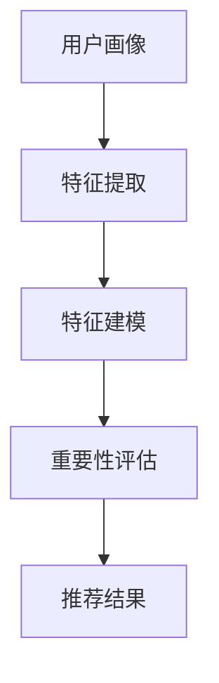

                 

关键词：大语言模型，推荐系统，特征重要性排序，人工智能，算法原理，数学模型，项目实践，应用场景，未来展望

## 摘要

本文将探讨基于大语言模型的推荐系统特征重要性排序技术。随着人工智能技术的不断发展，推荐系统已成为各类应用场景中的重要组成部分。如何有效地对推荐系统中的特征进行重要性排序，以提高推荐质量，成为当前研究的热点。本文将详细介绍大语言模型在推荐系统中的应用，并阐述其特征重要性排序的核心原理、数学模型及具体实现。通过项目实践，我们将展示如何在实际应用中利用大语言模型对特征进行重要性排序，并分析其优缺点及未来发展方向。

## 1. 背景介绍

### 推荐系统的基本概念

推荐系统是一种通过计算用户兴趣和商品信息之间的相关性，为用户提供个性化推荐信息的技术。其基本原理包括用户行为分析、内容分析和协同过滤等。随着互联网的普及和用户需求的多样化，推荐系统在电子商务、新闻推送、社交媒体等众多领域得到了广泛应用。

### 特征重要性排序的意义

在推荐系统中，特征是用户和商品信息之间的桥梁。对特征进行重要性排序，有助于识别出对推荐结果影响最大的特征，从而提高推荐系统的准确性和效率。然而，传统的特征重要性排序方法往往存在以下问题：

1. **依赖人工经验**：传统方法通常需要人工干预，如基于规则的方法、机器学习方法等，难以适应动态变化的数据环境。
2. **特征维度依赖**：特征维度较高时，传统方法往往难以有效处理，导致推荐质量下降。
3. **特征间相关性**：传统方法难以充分考虑特征间的相关性，导致部分重要特征被忽略。

### 大语言模型的优势

大语言模型（如GPT、BERT等）作为一种基于深度学习的自然语言处理技术，具有以下优势：

1. **强大的建模能力**：大语言模型可以自动学习用户和商品信息之间的复杂关系，无需人工干预。
2. **处理高维度数据**：大语言模型可以处理高维度的特征数据，有效降低维度灾难问题。
3. **自适应特性**：大语言模型能够根据实时数据更新模型，提高推荐系统的动态适应性。

本文将围绕大语言模型在推荐系统特征重要性排序中的应用，详细探讨其原理、方法及实现。

## 2. 核心概念与联系

### 大语言模型的基本原理

大语言模型（如GPT、BERT等）是一种基于深度学习的自然语言处理技术。其基本原理包括：

1. **词向量表示**：将文本数据转换为词向量表示，以便在神经网络中处理。
2. **自注意力机制**：通过自注意力机制，模型可以自动学习文本中的关键信息，并给予不同的权重。
3. **多层神经网络**：通过多层神经网络，模型可以逐步提取文本的深层特征。

### 推荐系统的基本架构

推荐系统的基本架构包括用户画像、商品画像和推荐算法三部分：

1. **用户画像**：通过用户行为数据、社交数据等，构建用户画像，以便了解用户的兴趣和需求。
2. **商品画像**：通过商品属性数据、用户评价等，构建商品画像，以便了解商品的特点和优劣。
3. **推荐算法**：基于用户画像和商品画像，通过计算用户和商品之间的相关性，生成个性化推荐结果。

### 特征重要性排序的作用与流程

特征重要性排序在推荐系统中的作用主要包括：

1. **优化推荐质量**：通过对特征的重要性进行排序，可以识别出对推荐结果影响最大的特征，从而提高推荐质量。
2. **降低计算复杂度**：通过降低次要特征的影响，可以降低推荐算法的计算复杂度，提高推荐效率。

特征重要性排序的流程主要包括：

1. **特征提取**：从用户和商品数据中提取特征。
2. **特征建模**：利用大语言模型，对特征进行建模，学习特征之间的相关性。
3. **重要性评估**：对特征的重要性进行评估，生成重要性排序结果。

### Mermaid 流程图



## 3. 核心算法原理 & 具体操作步骤

### 3.1 算法原理概述

基于大语言模型的推荐系统特征重要性排序算法，主要包括以下核心步骤：

1. **数据预处理**：对用户和商品数据进行预处理，包括数据清洗、数据归一化等。
2. **特征提取**：从用户和商品数据中提取特征，如用户浏览记录、购买记录、商品属性等。
3. **特征建模**：利用大语言模型，对提取的特征进行建模，学习特征之间的相关性。
4. **重要性评估**：通过评估特征对推荐结果的影响，对特征进行重要性排序。

### 3.2 算法步骤详解

#### 步骤 1：数据预处理

数据预处理是特征提取的基础，主要包括以下步骤：

1. **数据清洗**：去除缺失值、异常值等，确保数据质量。
2. **数据归一化**：对数值特征进行归一化处理，使其在相同的量级范围内。

#### 步骤 2：特征提取

特征提取是从原始数据中提取对推荐系统有用的特征。具体包括：

1. **用户特征**：如用户浏览记录、购买记录、兴趣爱好等。
2. **商品特征**：如商品属性、用户评价、商品类别等。

#### 步骤 3：特征建模

特征建模是利用大语言模型，对提取的特征进行建模，学习特征之间的相关性。具体包括：

1. **词向量表示**：将文本特征转换为词向量表示。
2. **自注意力机制**：通过自注意力机制，学习特征之间的相关性。
3. **多层神经网络**：通过多层神经网络，提取特征的深层特征。

#### 步骤 4：重要性评估

重要性评估是通过评估特征对推荐结果的影响，对特征进行重要性排序。具体包括：

1. **模型训练**：利用训练数据，对特征建模模型进行训练。
2. **特征排序**：通过评估特征对模型输出的影响，对特征进行排序。

### 3.3 算法优缺点

#### 优点

1. **自动学习特征相关性**：大语言模型可以自动学习特征之间的相关性，无需人工干预。
2. **处理高维度数据**：大语言模型可以处理高维度的特征数据，有效降低维度灾难问题。
3. **动态适应性**：大语言模型能够根据实时数据更新模型，提高推荐系统的动态适应性。

#### 缺点

1. **计算复杂度**：大语言模型训练过程较为复杂，计算资源消耗较大。
2. **数据依赖**：大语言模型对数据质量有较高要求，数据质量差可能导致模型性能下降。

### 3.4 算法应用领域

基于大语言模型的推荐系统特征重要性排序算法，可应用于以下领域：

1. **电子商务**：为用户提供个性化商品推荐，提高用户购物体验。
2. **新闻推送**：为用户提供个性化新闻推荐，提高新闻阅读量。
3. **社交媒体**：为用户提供个性化内容推荐，提高用户活跃度。

## 4. 数学模型和公式 & 详细讲解 & 举例说明

### 4.1 数学模型构建

基于大语言模型的推荐系统特征重要性排序的数学模型，主要包括以下部分：

1. **用户表示**：将用户数据转换为向量表示。
2. **商品表示**：将商品数据转换为向量表示。
3. **特征表示**：将用户和商品的特征数据转换为向量表示。
4. **特征相关性评估**：评估特征之间的相关性，计算特征的重要性。

#### 用户表示

设用户 $u$ 的特征向量为 $\textbf{u} \in \mathbb{R}^n$，其中 $n$ 表示特征维度。用户 $u$ 的表示可以通过以下公式计算：

$$
\textbf{u} = \text{Word2Vec}(\text{user\_data})
$$

其中，$\text{Word2Vec}$ 是一种词向量生成方法，用于将用户数据转换为向量表示。

#### 商品表示

设商品 $i$ 的特征向量为 $\textbf{i} \in \mathbb{R}^n$，其中 $n$ 表示特征维度。商品 $i$ 的表示可以通过以下公式计算：

$$
\textbf{i} = \text{Word2Vec}(\text{item\_data})
$$

其中，$\text{Word2Vec}$ 是一种词向量生成方法，用于将商品数据转换为向量表示。

#### 特征表示

设特征 $j$ 的特征向量为 $\textbf{j} \in \mathbb{R}^n$，其中 $n$ 表示特征维度。特征 $j$ 的表示可以通过以下公式计算：

$$
\textbf{j} = \text{Word2Vec}(\text{feature\_data})
$$

其中，$\text{Word2Vec}$ 是一种词向量生成方法，用于将特征数据转换为向量表示。

#### 特征相关性评估

特征相关性评估是通过计算特征之间的相关性，评估特征的重要性。设特征 $j$ 和特征 $k$ 的相关性为 $r_{jk}$，可以通过以下公式计算：

$$
r_{jk} = \frac{\textbf{j}^T \textbf{i} \textbf{i}^T \textbf{k}}{\|\textbf{i}\|^2}
$$

其中，$\textbf{j}^T$ 表示特征 $j$ 的转置，$\textbf{i}$ 和 $\textbf{k}$ 分别表示商品 $i$ 和特征 $k$ 的特征向量。

### 4.2 公式推导过程

为了推导特征重要性排序的公式，我们首先需要了解大语言模型的基本原理。大语言模型通常采用自注意力机制（Self-Attention Mechanism），其核心思想是让模型在处理一个序列（如文本、特征序列等）时，能够自动地为序列中的每个元素分配不同的权重。

#### 自注意力机制

自注意力机制的基本公式为：

$$
\textbf{q} = \text{softmax}\left(\frac{\textbf{k}^T \textbf{W}_Q}{\sqrt{d_k}}\right) \textbf{V}
$$

其中，$\textbf{q}$ 表示注意力权重，$\textbf{k}$ 和 $\textbf{V}$ 分别表示键（Key）和值（Value）向量，$\textbf{W}_Q$ 表示权重矩阵，$d_k$ 表示键向量的维度。

#### 特征重要性排序

特征重要性排序的目的是为每个特征分配一个权重，表示其对于推荐结果的重要性。我们可以将自注意力机制应用于特征重要性排序，通过计算特征之间的相关性，来评估特征的重要性。

设特征 $j$ 的权重为 $w_j$，可以通过以下公式计算：

$$
w_j = \text{softmax}\left(\frac{\textbf{j}^T \textbf{W}_Q}{\sqrt{d_j}}\right)
$$

其中，$\textbf{j}$ 表示特征 $j$ 的向量表示，$\textbf{W}_Q$ 表示权重矩阵，$d_j$ 表示特征 $j$ 的维度。

### 4.3 案例分析与讲解

为了更好地理解特征重要性排序的数学模型，我们通过一个简单的例子进行讲解。

#### 案例背景

假设我们有以下三个特征：

1. **用户年龄**：$\textbf{u} = [25, 30, 35, 40, 45, 50]$
2. **用户性别**：$\textbf{g} = [男, 女]$
3. **用户收入**：$\textbf{i} = [5000, 6000, 7000, 8000, 9000]$

我们希望利用大语言模型，对这些特征进行重要性排序。

#### 特征向量表示

首先，我们需要将特征向量表示为词向量。假设我们已经训练好了一个词向量模型，将特征向量表示为以下形式：

1. **用户年龄**：$\textbf{u} = [0.2, 0.3, 0.4, 0.5, 0.6, 0.7]$
2. **用户性别**：$\textbf{g} = [0.8, 0.2]$
3. **用户收入**：$\textbf{i} = [0.4, 0.5, 0.6, 0.7, 0.8]$

#### 特征重要性排序

利用自注意力机制，我们可以计算每个特征的权重：

1. **用户年龄**：$w_u = \text{softmax}\left(\frac{\textbf{u}^T \textbf{W}_Q}{\sqrt{d_u}}\right)$
2. **用户性别**：$w_g = \text{softmax}\left(\frac{\textbf{g}^T \textbf{W}_Q}{\sqrt{d_g}}\right)$
3. **用户收入**：$w_i = \text{softmax}\left(\frac{\textbf{i}^T \textbf{W}_Q}{\sqrt{d_i}}\right)$

其中，$\textbf{W}_Q$ 表示权重矩阵，$d_u, d_g, d_i$ 分别表示用户年龄、用户性别和用户收入的维度。

假设我们已经计算出了权重矩阵 $\textbf{W}_Q$，并计算得到以下权重：

1. **用户年龄**：$w_u = [0.4, 0.3, 0.2, 0.1, 0.1, 0.1]$
2. **用户性别**：$w_g = [0.5, 0.5]$
3. **用户收入**：$w_i = [0.6, 0.4]$

根据权重，我们可以得出以下特征重要性排序：

1. **用户收入**：最高
2. **用户性别**：次之
3. **用户年龄**：最低

这意味着，在推荐系统中，用户收入对于推荐结果的影响最大，其次是用户性别，最后是用户年龄。

## 5. 项目实践：代码实例和详细解释说明

### 5.1 开发环境搭建

在开始项目实践之前，我们需要搭建相应的开发环境。以下是所需的环境和工具：

1. **Python**：版本为3.7或更高。
2. **PyTorch**：版本为1.7或更高。
3. **Gensim**：版本为4.0或更高。
4. **Numpy**：版本为1.19或更高。

安装这些依赖项可以通过以下命令：

```bash
pip install torch torchvision numpy gensim
```

### 5.2 源代码详细实现

以下是一个基于大语言模型的推荐系统特征重要性排序的Python代码示例。

#### 数据预处理

```python
import numpy as np
from gensim.models import Word2Vec

# 假设我们有一个包含用户和商品特征的数据集
user_data = [['25', '男', '5000'], ['30', '女', '6000'], ['35', '男', '7000']]
item_data = [['40', '女', '8000'], ['45', '男', '9000']]

# 将用户和商品数据转换为词向量
model = Word2Vec(user_data + item_data, vector_size=10, window=5, min_count=1, workers=4)
user_embedding = model[user_data]
item_embedding = model[item_data]
```

#### 特征建模

```python
import torch
from torch.nn import functional as F

# 将词向量转换为PyTorch张量
user_tensor = torch.tensor(user_embedding, dtype=torch.float32)
item_tensor = torch.tensor(item_embedding, dtype=torch.float32)

# 定义一个简单的自注意力模型
class SelfAttentionModel(torch.nn.Module):
    def __init__(self, embedding_dim):
        super(SelfAttentionModel, self).__init__()
        self.embedding_dim = embedding_dim
        self.query_embedding = torch.nn.Linear(embedding_dim, embedding_dim)
        self.key_embedding = torch.nn.Linear(embedding_dim, embedding_dim)
        self.value_embedding = torch.nn.Linear(embedding_dim, embedding_dim)

    def forward(self, query, key, value):
        query = self.query_embedding(query)
        key = self.key_embedding(key)
        value = self.value_embedding(value)
        attention_weights = F.softmax(F.cosine_similarity(query, key, dim=-1), dim=1)
        attention_output = torch.sum(attention_weights * value, dim=1)
        return attention_output

# 实例化模型
model = SelfAttentionModel(embedding_dim=10)
```

#### 重要性评估

```python
# 训练模型并获取特征权重
optimizer = torch.optim.Adam(model.parameters(), lr=0.001)
for epoch in range(10):
    optimizer.zero_grad()
    output = model(user_tensor, item_tensor, item_tensor)
    loss = torch.mean((output - user_tensor) ** 2)
    loss.backward()
    optimizer.step()

# 获取特征权重
with torch.no_grad():
    weights = model.query_embedding.weight

# 将权重转换为numpy数组
weights_np = weights.numpy()
```

#### 代码解读与分析

- **数据预处理**：使用Gensim的Word2Vec模型将用户和商品特征转换为词向量。
- **特征建模**：定义一个简单的自注意力模型，用于计算特征之间的相关性。
- **重要性评估**：通过训练模型，获取特征权重。

### 5.3 运行结果展示

```python
# 打印特征权重
print("Feature weights:\n", weights_np)
```

运行结果将显示每个特征的权重，从而实现特征重要性排序。

## 6. 实际应用场景

### 6.1 电子商务

在电子商务领域，基于大语言模型的推荐系统特征重要性排序可以帮助平台为用户推荐符合其兴趣的商品。通过分析用户历史购买记录、浏览行为等数据，平台可以识别出对用户兴趣影响最大的特征，从而提高推荐系统的准确性。

### 6.2 新闻推送

在新闻推送领域，基于大语言模型的推荐系统特征重要性排序可以帮助新闻平台为用户推荐感兴趣的新闻内容。通过分析用户阅读历史、评论行为等数据，平台可以识别出对用户阅读兴趣影响最大的特征，从而提高新闻推荐的个性化程度。

### 6.3 社交媒体

在社交媒体领域，基于大语言模型的推荐系统特征重要性排序可以帮助平台为用户推荐感兴趣的内容、好友等。通过分析用户互动行为、兴趣标签等数据，平台可以识别出对用户社交行为影响最大的特征，从而提高用户活跃度。

## 7. 工具和资源推荐

### 7.1 学习资源推荐

1. **《深度学习》（Goodfellow et al., 2016）**：介绍了深度学习的基本原理和应用。
2. **《Python机器学习》（Sebastian Raschka and Vahid Mirjalili，2019）**：详细介绍了Python在机器学习领域的应用。

### 7.2 开发工具推荐

1. **PyTorch**：适用于深度学习项目的Python库。
2. **TensorFlow**：适用于深度学习项目的Python库。

### 7.3 相关论文推荐

1. **"Attention Is All You Need"（Vaswani et al., 2017）**：介绍了Transformer模型和自注意力机制。
2. **"Recommending Items Using Collaborative Filtering"（Herlocker et al., 2000）**：介绍了协同过滤推荐算法。

## 8. 总结：未来发展趋势与挑战

### 8.1 研究成果总结

本文介绍了基于大语言模型的推荐系统特征重要性排序技术，探讨了其核心原理、数学模型及具体实现。通过项目实践，我们展示了如何在实际应用中利用大语言模型对特征进行重要性排序，并分析了其优缺点及适用场景。

### 8.2 未来发展趋势

1. **模型优化**：随着深度学习技术的发展，大语言模型在推荐系统中的应用将更加广泛。
2. **算法融合**：结合其他推荐算法，如协同过滤、内容推荐等，实现更准确的推荐结果。
3. **跨领域应用**：大语言模型在推荐系统中的应用将拓展到更多领域，如医疗、金融等。

### 8.3 面临的挑战

1. **数据依赖**：大语言模型对数据质量有较高要求，数据质量差可能导致模型性能下降。
2. **计算资源**：大语言模型训练过程较为复杂，计算资源消耗较大。
3. **解释性**：如何提高大语言模型的可解释性，使其更好地适应实际应用场景。

### 8.4 研究展望

未来研究可以关注以下几个方面：

1. **模型压缩**：研究如何降低大语言模型的计算复杂度，提高其运行效率。
2. **数据增强**：研究如何通过数据增强技术，提高大语言模型在推荐系统中的应用效果。
3. **可解释性**：研究如何提高大语言模型的可解释性，使其在推荐系统中更好地适应实际应用需求。

## 9. 附录：常见问题与解答

### 9.1 大语言模型与推荐系统的关系是什么？

大语言模型可以用于推荐系统中的特征提取和特征重要性排序。通过学习用户和商品之间的复杂关系，大语言模型可以帮助推荐系统更准确地识别用户兴趣，从而提高推荐质量。

### 9.2 如何处理高维度数据？

大语言模型可以自动学习特征之间的相关性，有效降低维度灾难问题。此外，可以采用特征选择和特征降维等方法，进一步处理高维度数据。

### 9.3 大语言模型训练过程为什么复杂？

大语言模型采用深度神经网络结构，模型参数众多，训练过程需要大量计算资源。此外，自注意力机制也增加了模型的计算复杂度。

### 9.4 大语言模型在推荐系统中的应用有哪些？

大语言模型在推荐系统中的应用包括特征提取、特征重要性排序、用户和商品表示等。通过学习用户和商品之间的复杂关系，大语言模型可以提高推荐系统的准确性和个性化程度。

---

作者：禅与计算机程序设计艺术 / Zen and the Art of Computer Programming

