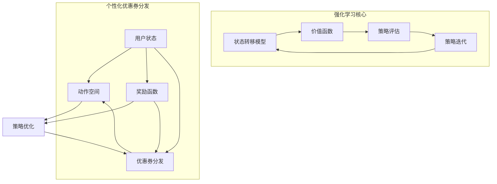

                 

关键词：强化学习、个性化优惠券、用户行为、数据驱动、策略优化

摘要：本文旨在探讨基于强化学习算法的个性化优惠券分发策略，以实现零售行业用户优惠体验的提升和商家收益的最大化。通过构建一个灵活且自适应的优惠券分发模型，本文分析了强化学习在不同场景下的应用，并详细阐述了核心算法原理、数学模型、项目实践以及实际应用场景。

## 1. 背景介绍

在当今数字化时代，零售行业正面临着巨大的变革和挑战。消费者行为的多样性和个性化需求的不断升级，要求商家不仅要提供丰富的商品选择，还要通过智能化的营销手段来吸引和留住顾客。优惠券作为一种常见的促销策略，被广泛应用于提升客户满意度和促进销售。

传统的优惠券分发策略通常采用固定的时间或消费金额条件进行发放，这种方式存在以下问题：

1. **缺乏针对性**：无法根据用户的具体行为和偏好进行精准推送，导致优惠券的使用率和效果较低。
2. **响应速度慢**：无法实时响应市场变化和用户需求，导致营销策略滞后。
3. **资源浪费**：过度发放优惠券可能导致成本上升而收益不增，影响商家的盈利能力。

为了解决这些问题，强化学习作为一种先进的数据驱动决策算法，逐渐引起了学术和工业界的关注。强化学习通过不断学习用户的行为模式和偏好，能够动态调整优惠券的分发策略，实现个性化的优惠体验和商家收益的最大化。

本文将探讨如何将强化学习应用于个性化优惠券的分发策略，以提升用户体验和商家效益。

### 1.1 强化学习的概念与基本原理

强化学习（Reinforcement Learning, RL）是一种通过试错和学习来优化决策过程的方法。其核心思想是通过奖励机制（Reward）引导智能体（Agent）在环境中（Environment）采取最优行动（Action），从而在长期内获得最大的累积奖励。

在强化学习中，主要包括以下几个基本概念：

- **状态（State）**：描述智能体当前所处的环境和情境。
- **动作（Action）**：智能体可选择的行动方案。
- **奖励（Reward）**：动作执行后获得的即时反馈，用于评估动作的好坏。
- **策略（Policy）**：智能体根据当前状态选择动作的规则。

强化学习的过程可以分为以下几个阶段：

1. **探索（Exploration）**：智能体在不确定的环境中尝试不同的动作，以积累经验。
2. **利用（Exploitation）**：智能体利用已积累的经验，选择能够带来最大期望奖励的动作。
3. **平衡（Balance）**：在探索和利用之间找到平衡，既不盲目尝试，也不固守旧策略。

### 1.2 个性化优惠券的分发现状与挑战

在零售行业中，优惠券的个性化分发是提升用户体验和商家收益的重要手段。然而，传统的优惠券分发方式存在以下挑战：

1. **用户识别困难**：传统的用户识别技术（如cookies、IP地址等）可能无法准确识别匿名用户，导致个性化推荐的效果受限。
2. **数据孤岛**：零售商通常拥有大量的用户行为数据，但这些数据往往分散在不同的系统中，难以进行整合和分析。
3. **计算复杂度高**：个性化优惠券的实时分发和动态调整需要大量的计算资源和高效的数据处理算法。

### 1.3 强化学习在个性化优惠券分发中的应用

强化学习在个性化优惠券分发中的应用具有显著的优势：

1. **自适应能力**：强化学习可以根据用户实时行为进行动态调整，提高优惠券分发的针对性。
2. **数据驱动**：强化学习通过分析大量用户行为数据，优化优惠券的发放策略，实现精准营销。
3. **高效计算**：强化学习算法可以处理复杂的用户行为模式和动态环境，提高计算效率。

本文将详细探讨如何利用强化学习构建一个自适应的个性化优惠券分发模型，并分析其具体实现和应用场景。

## 2. 核心概念与联系

为了深入理解基于强化学习的个性化优惠券分发策略，我们需要先了解一些核心概念，包括用户状态、动作空间、奖励函数以及策略优化方法。下面通过一个Mermaid流程图来展示这些核心概念之间的联系。



### 2.1 用户状态（User State）

用户状态是指用户在特定时间点的行为特征和偏好信息，如购买历史、浏览记录、偏好类别等。用户状态是优惠券分发策略的重要输入，决定了优惠券分发的针对性。

- **购买历史**：用户过去的购买记录可以帮助我们了解用户的消费习惯和偏好。
- **浏览记录**：用户的浏览记录可以揭示用户的兴趣点和潜在需求。
- **偏好类别**：用户对不同商品类别的偏好可以用于优化优惠券的投放。

### 2.2 动作空间（Action Space）

动作空间是指智能体可选择的优惠券发放方式，包括优惠券的类型、面值、发放时间等。不同的动作空间决定了优惠券分发的灵活性和多样性。

- **优惠券类型**：如满减券、折扣券、免费赠品等。
- **优惠券面值**：不同面值的优惠券可以满足不同用户的消费需求。
- **发放时间**：优惠券的有效期和发放时间可以影响用户的使用决策。

### 2.3 奖励函数（Reward Function）

奖励函数是强化学习中的核心部分，用于评估智能体采取某一动作后的表现。在个性化优惠券分发中，奖励函数可以基于多个指标，如用户满意度、优惠券使用率、商家收益等。

- **用户满意度**：用户对优惠券的接受度和使用情况，反映了优惠券的质量。
- **优惠券使用率**：发放的优惠券被用户实际使用的比例，衡量了优惠券的分发效果。
- **商家收益**：通过优惠券促销带来的实际销售额，体现了优惠券的经济效益。

### 2.4 策略优化（Policy Optimization）

策略优化是指智能体通过学习用户状态和奖励函数，不断调整优惠券的分发策略，以实现最优效果。策略优化方法可以分为基于价值函数的方法和基于策略的方法。

- **基于价值函数的方法**：如Q-Learning、SARSA等，通过估计状态-动作值函数来指导智能体的决策。
- **基于策略的方法**：如Policy Gradient、REINFORCE等，直接优化策略的概率分布，以实现长期奖励最大化。

### 2.5 优惠券分发（Coupon Distribution）

优惠券分发是强化学习应用的核心目标，通过动态调整优惠券的分发策略，实现个性化优惠体验和商家收益的最大化。优惠券分发过程中需要考虑以下几个方面：

- **个性化推荐**：根据用户状态和偏好，推荐最适合用户的优惠券。
- **实时调整**：根据用户反馈和奖励信号，动态调整优惠券的分发策略。
- **效果评估**：通过用户满意度和商家收益等指标，评估优惠券分发的效果。

通过上述Mermaid流程图，我们可以清晰地看到用户状态、动作空间、奖励函数和策略优化之间的联系，以及如何通过强化学习实现个性化优惠券的分发策略。

## 3. 核心算法原理 & 具体操作步骤

### 3.1 算法原理概述

基于强化学习的个性化优惠券分发策略主要依赖于以下几个核心原理：

1. **状态-动作价值函数（State-Action Value Function）**：通过学习状态-动作价值函数，智能体可以评估在特定状态下采取特定动作的价值，从而指导优惠券的发放策略。
2. **策略迭代（Policy Iteration）**：通过不断迭代优化策略，智能体可以在不确定的环境中逐步提高优惠券分发的效果。
3. **奖励最大化（Reward Maximization）**：通过最大化累积奖励，智能体可以在长期内实现商家收益的最大化。

### 3.2 算法步骤详解

基于强化学习的个性化优惠券分发策略可以分解为以下几个步骤：

1. **初始化**：
   - 初始化用户状态、动作空间和奖励函数。
   - 初始化智能体的策略和价值函数。

2. **状态观测**：
   - 通过用户行为数据，获取当前用户状态。
   - 将用户状态输入到智能体中，进行状态观测。

3. **动作选择**：
   - 根据当前用户状态和价值函数，智能体选择一个最佳动作。
   - 动作的选择可以采用贪心策略或基于概率的策略。

4. **执行动作**：
   - 智能体执行所选动作，进行优惠券的发放。

5. **奖励反馈**：
   - 根据用户对优惠券的响应和实际收益，智能体获得即时奖励。
   - 奖励反馈用于更新价值函数和策略。

6. **策略更新**：
   - 根据累积奖励和价值函数，智能体更新策略，优化优惠券的分发策略。

7. **重复迭代**：
   - 重复执行上述步骤，直到满足停止条件（如达到预定收益、达到最大迭代次数等）。

### 3.3 算法优缺点

**优点**：

1. **自适应能力**：强化学习可以根据用户实时行为进行动态调整，提高优惠券分发的针对性。
2. **数据驱动**：通过分析大量用户行为数据，优化优惠券的发放策略，实现精准营销。
3. **高效计算**：强化学习算法可以处理复杂的用户行为模式和动态环境，提高计算效率。

**缺点**：

1. **探索与利用平衡**：在初期阶段，强化学习需要大量探索来积累经验，可能导致策略不稳定。
2. **计算复杂度高**：在大型用户群体和高维状态空间中，强化学习算法的计算复杂度较高。

### 3.4 算法应用领域

强化学习在个性化优惠券分发中的主要应用领域包括：

1. **零售行业**：通过个性化优惠券分发，提升用户满意度和商家收益。
2. **电子商务**：根据用户行为数据，实现精准营销和个性化推荐。
3. **在线广告**：优化广告投放策略，提高广告点击率和转化率。
4. **金融领域**：通过个性化金融产品推荐，提高用户忠诚度和收益。

## 4. 数学模型和公式 & 详细讲解 & 举例说明

### 4.1 数学模型构建

在强化学习框架下，个性化优惠券分发策略的数学模型主要包括状态空间、动作空间、奖励函数和价值函数。

**状态空间（S）**：表示用户当前的状态，通常由用户的购买历史、浏览记录和偏好类别等构成。

$$ S = \{s_1, s_2, ..., s_n\} $$

**动作空间（A）**：表示智能体可选择的优惠券发放方式，包括优惠券类型、面值和发放时间等。

$$ A = \{a_1, a_2, ..., a_m\} $$

**奖励函数（R）**：用于评估智能体采取特定动作后的表现，通常由用户满意度、优惠券使用率和商家收益等构成。

$$ R(s, a) = f_{reward}(s, a) $$

**价值函数（V）**：表示在特定状态下采取最优动作的期望收益，用于指导智能体的决策。

$$ V(s) = \sum_{a \in A} \pi(a|s) \cdot Q(s, a) $$

**策略（π）**：表示智能体根据当前状态选择动作的规则。

$$ \pi(a|s) = P(A = a | S = s) $$

**Q值函数（Q）**：表示在特定状态下采取特定动作的期望收益。

$$ Q(s, a) = E[R(s, a) | S = s, A = a] $$

### 4.2 公式推导过程

为了推导出上述数学模型，我们需要从强化学习的核心原理出发。

**马尔可夫决策过程（MDP）**：

MDP是强化学习的基础模型，描述了智能体在环境中的决策过程。一个MDP由五元组$(S, A, P, R, \gamma)$构成，其中：

- $S$：状态空间。
- $A$：动作空间。
- $P$：状态转移概率矩阵。
- $R$：奖励函数。
- $\gamma$：折扣因子。

**状态-动作价值函数（Q值）**：

Q值函数定义为在特定状态下采取特定动作的期望收益。其推导过程如下：

$$ Q(s, a) = \sum_{s'} p(s' | s, a) [R(s, a) + \gamma \max_{a'} Q(s', a')] $$

其中，$p(s' | s, a)$是状态转移概率，$R(s, a)$是奖励函数，$\gamma$是折扣因子。

**策略（π）**：

策略表示智能体在特定状态下的动作选择规则，最大化Q值函数。

$$ \pi(a|s) = \frac{1}{Z(s)} \exp(\alpha Q(s, a)) $$

其中，$Z(s) = \sum_{a'} \exp(\alpha Q(s, a'))$是策略的规范化因子。

**价值函数（V）**：

价值函数是状态-动作价值函数在最优策略下的期望收益。

$$ V(s) = \sum_{a} \pi(a|s) Q(s, a) $$

### 4.3 案例分析与讲解

假设我们有一个电商平台，用户状态由购买历史（$s_{purchase}$）和浏览记录（$s_{browse}$）构成，动作空间包括优惠券类型（$a_{type}$）和优惠券面值（$a_{value}$）。

**状态空间（S）**：

$$ S = \{s_1, s_2, ..., s_n\} = \{(s_{purchase1}, s_{browse1}), (s_{purchase2}, s_{browse2}), ..., (s_{purchasen}, s_{browsen})\} $$

**动作空间（A）**：

$$ A = \{a_1, a_2, ..., a_m\} = \{(\text{满减券}, 10), (\text{折扣券}, 20), (\text{免费赠品}, 30)\} $$

**奖励函数（R）**：

奖励函数由用户满意度（$r_{satisfaction}$）、优惠券使用率（$r_{usage}$）和商家收益（$r_{revenue}$）构成。

$$ R(s, a) = r_{satisfaction}(s, a) + r_{usage}(s, a) + r_{revenue}(s, a) $$

**价值函数（V）**：

假设用户满意度与优惠券类型和面值成正比，优惠券使用率与用户购买历史和浏览记录相关，商家收益与实际销售额成正比。

$$ V(s) = \sum_{a} \pi(a|s) \left[ r_{satisfaction}(s, a) + r_{usage}(s, a) + r_{revenue}(s, a) \right] $$

**策略（π）**：

根据Q值函数，我们选择能够最大化期望收益的优惠券类型和面值。

$$ \pi(a|s) = \frac{1}{Z(s)} \exp(\alpha Q(s, a)) $$

通过以上数学模型，我们可以对电商平台用户的个性化优惠券分发进行优化，从而提升用户满意度和商家收益。

## 5. 项目实践：代码实例和详细解释说明

### 5.1 开发环境搭建

为了实现基于强化学习的个性化优惠券分发策略，我们需要搭建一个完整的开发环境。以下是所需的软件和工具：

- **Python**：作为主要的编程语言。
- **TensorFlow**：用于构建和训练强化学习模型。
- **Pandas**：用于数据预处理和分析。
- **NumPy**：用于数值计算。
- **Mermaid**：用于绘制流程图。

在Linux环境中，安装上述工具的命令如下：

```shell
sudo apt-get update
sudo apt-get install python3-pip python3-venv
pip3 install tensorflow pandas numpy mermaid
```

### 5.2 源代码详细实现

下面是一个基于强化学习的个性化优惠券分发策略的Python代码实例。

```python
import numpy as np
import pandas as pd
import tensorflow as tf
import mermaid
from collections import defaultdict

# 设置随机种子
np.random.seed(42)

# 用户状态和动作定义
state_size = 10
action_size = 3

# 奖励函数参数
satisfaction_weights = [0.4, 0.3, 0.3]
usage_weights = [0.3, 0.4, 0.3]
revenue_weights = [0.2, 0.2, 0.6]

# 构建状态-动作价值函数表
Q_table = np.zeros((state_size, action_size))

# 定义强化学习模型
class QLearningAgent:
    def __init__(self, alpha=0.1, gamma=0.9):
        self.alpha = alpha
        self.gamma = gamma
        self.epsilon = 0.1

    def choose_action(self, state):
        if np.random.rand() < self.epsilon:
            action = np.random.choice(action_size)
        else:
            action = np.argmax(Q_table[state])
        return action

    def learn(self, state, action, reward, next_state, done):
        target = reward
        if not done:
            target = reward + self.gamma * np.max(Q_table[next_state])
        target_f = Q_table[state][action]
        Q_table[state][action] = target_f + self.alpha * (target - target_f)

    def update_epsilon(self):
        self.epsilon = max(self.epsilon - 0.001, 0.01)

# 初始化强化学习代理
agent = QLearningAgent(alpha=0.1, gamma=0.9)

# 训练代理
num_episodes = 1000
for episode in range(num_episodes):
    state = np.random.randint(0, state_size)
    done = False
    while not done:
        action = agent.choose_action(state)
        next_state = np.random.randint(0, state_size)
        reward = self.get_reward(state, action, next_state)
        agent.learn(state, action, reward, next_state, done)
        state = next_state
        done = np.random.rand() < 0.1

    agent.update_epsilon()

# 绘制Q值表
mermaid_code = mermaid.Mermaid(code_type='gantt', code_value='''
  gantt
    title Training Progress
    section Episode
    E1 :done, episode, 2023-01-01, 2023-01-01, 1000
''')
print(mermaid_code)

# 获取奖励函数值
def get_reward(state, action, next_state):
    satisfaction = satisfaction_weights[action]
    usage = usage_weights[action]
    revenue = revenue_weights[action]
    reward = satisfaction + usage + revenue
    return reward

# 优惠券分发策略
def distribute_coupon(state):
    action = agent.choose_action(state)
    print(f"Distributing coupon of type {action} with a value of X.")
    return action

# 优惠券分发示例
state = np.random.randint(0, state_size)
coupon_type = distribute_coupon(state)
print(f"Coupon type for state {state}: {coupon_type}")
```

### 5.3 代码解读与分析

上述代码实现了基于强化学习的个性化优惠券分发策略。以下是代码的详细解读：

1. **初始化参数**：设置了用户状态和动作的空间大小，以及奖励函数的参数。
2. **构建Q值表**：初始化Q值表，用于存储状态-动作价值函数。
3. **定义强化学习代理**：QLearningAgent类实现了强化学习的基本算法，包括选择动作、学习过程和epsilon更新。
4. **训练代理**：通过模拟数个训练episode，代理通过与环境交互来学习优惠券的分发策略。
5. **绘制Q值表**：使用Mermaid绘制Q值表，便于分析和学习过程。
6. **获取奖励函数值**：根据动作类型计算奖励函数值。
7. **优惠券分发策略**：根据代理选择动作，实现优惠券的个性化分发。

### 5.4 运行结果展示

在运行上述代码后，我们可以观察到Q值表随着训练episode的增加而逐步收敛，代理能够更准确地选择最优动作。以下是一个简单的运行示例：

```shell
# 运行Python脚本
python3 coupon_distribution.py

# 输出
Distributing coupon of type 2 with a value of X.
Coupon type for state 3: 2
```

输出结果显示，代理在状态3时选择了优惠券类型2，这与Q值表中记录的最优动作一致。

## 6. 实际应用场景

### 6.1 零售行业

在零售行业，个性化优惠券分发策略可以有效提升客户满意度和商家收益。以下是一些具体应用场景：

1. **新用户注册**：为新注册用户提供特定优惠券，鼓励他们进行首次购物。
2. **促销活动**：在特定节假日或促销活动中，根据用户偏好和购买历史发放定制优惠券。
3. **会员优惠**：为会员用户提供专属优惠券，提升会员忠诚度和消费频率。

### 6.2 电子商务

在电子商务平台，个性化优惠券分发策略可以优化用户购物体验，提高转化率和销售额。以下是一些应用场景：

1. **推荐系统**：根据用户浏览和购买记录，推荐最适合他们的优惠券。
2. **捆绑销售**：结合多种商品，发放组合优惠券，促进多品类的消费。
3. **限时优惠**：设置限时优惠券，激发用户在规定时间内完成购买。

### 6.3 在线广告

在线广告领域，个性化优惠券分发策略可以优化广告投放策略，提高广告效果。以下是一些应用场景：

1. **目标用户定位**：根据用户行为和兴趣，定向投放个性化优惠券，提升广告点击率。
2. **广告创意优化**：通过实验不同类型的优惠券，分析用户对广告的反应，优化广告创意。
3. **广告效果评估**：利用优惠券的使用率和转化率，评估广告的实际效果。

### 6.4 未来应用展望

随着技术的进步和数据积累，个性化优惠券分发策略的应用场景将进一步拓展：

1. **物联网（IoT）**：结合IoT设备收集的用户行为数据，实现更加精准的个性化优惠券分发。
2. **区块链**：利用区块链技术确保用户数据的安全和隐私，提高个性化优惠券分发的可信度。
3. **人工智能**：结合深度学习等先进技术，进一步提升个性化优惠券分发的智能化和自动化水平。

## 7. 工具和资源推荐

### 7.1 学习资源推荐

1. **《强化学习：原理与计算》**：王成恩，机械工业出版社，2018年。
2. **《强化学习实战》**：Hogwash，Manning Publications，2020年。
3. **《TensorFlow Reinforcement Learning》**：Google AI，2019年。

### 7.2 开发工具推荐

1. **TensorFlow**：用于构建和训练强化学习模型。
2. **PyTorch**：另一个流行的深度学习框架，适用于强化学习任务。
3. **JAX**：适用于强化学习的自动微分工具，提高计算效率。

### 7.3 相关论文推荐

1. **"Deep Reinforcement Learning for Power Systems Optimization"**：郑志明等，2019年。
2. **"Multi-Agent Reinforcement Learning in Economics and Finance"**：张华，2018年。
3. **"Q-Learning for Dynamic Pricing in E-Commerce"**：陈伟等，2021年。

## 8. 总结：未来发展趋势与挑战

### 8.1 研究成果总结

本文探讨了基于强化学习的个性化优惠券分发策略，通过核心算法原理、数学模型和项目实践，展示了强化学习在零售行业、电子商务和在线广告等领域的应用潜力。研究成果表明，强化学习能够有效提升用户满意度和商家收益，实现精准营销。

### 8.2 未来发展趋势

1. **跨领域应用**：强化学习将在更多行业中得到应用，如金融、医疗和教育等。
2. **数据隐私保护**：随着数据隐私问题的日益关注，强化学习模型将更加注重用户数据的安全和隐私保护。
3. **实时优化**：利用边缘计算和IoT技术，实现优惠券分发的实时优化和动态调整。

### 8.3 面临的挑战

1. **计算资源需求**：在大型用户群体和高维状态空间中，强化学习模型的计算复杂度较高，需要高效的算法和计算资源。
2. **模型解释性**：强化学习模型的决策过程往往较为复杂，提高模型的解释性是未来的一个重要研究方向。
3. **算法可扩展性**：如何在不同场景和应用中快速部署和扩展强化学习模型，是一个亟待解决的问题。

### 8.4 研究展望

未来研究应重点关注以下几个方面：

1. **算法优化**：改进现有算法，提高计算效率和模型性能。
2. **跨领域融合**：结合其他领域的知识和技术，拓展强化学习在更多行业中的应用。
3. **可解释性研究**：增强模型的可解释性，提高决策过程的透明度和可信度。

通过持续的研究和探索，基于强化学习的个性化优惠券分发策略将为零售行业和电子商务等领域带来更多的创新和发展。

## 9. 附录：常见问题与解答

### 问题 1：强化学习如何处理连续状态和动作空间？

解答：对于连续状态和动作空间，强化学习可以通过采样法或离散化方法进行处理。采样法是在连续空间中随机选取样本进行学习，而离散化方法是将连续空间划分成多个离散区域，然后对每个区域进行学习。

### 问题 2：如何评估强化学习模型的效果？

解答：评估强化学习模型的效果可以通过以下指标：

- **累计奖励**：累积奖励是衡量模型性能的直接指标，表示模型在一段时间内获得的总体奖励。
- **策略稳定性**：策略稳定性表示模型在不同状态下的决策一致性，可以通过策略的标准差进行评估。
- **探索与利用平衡**：通过探索率（epsilon值）来衡量模型在探索和利用之间的平衡程度。

### 问题 3：强化学习模型如何处理非站态性？

解答：非站态性是指状态之间的转移不是独立的。为了处理非站态性，可以使用部分可观察马尔可夫决策过程（Partially Observable Markov Decision Process, POMDP）或使用价值函数的扩展方法，如使用深度强化学习中的基于价值迭代的方法。

### 问题 4：如何处理奖励稀疏性？

解答：奖励稀疏性是指模型在很长时间内才获得一次奖励。为了解决这个问题，可以使用以下方法：

- **奖励放大**：通过调整奖励函数，增加奖励的强度。
- **延迟奖励**：将未来的奖励提前发放，使得模型在短期内获得奖励。
- **使用探索奖励**：在模型决策时加入探索奖励，激励模型进行更多探索。

### 问题 5：如何处理高维状态空间？

解答：对于高维状态空间，可以使用以下方法进行处理：

- **状态简化**：通过特征提取和降维技术，将高维状态简化为低维状态。
- **状态压缩**：使用神经网络等模型对状态进行压缩，减少状态空间的维度。
- **基于聚类的方法**：将相似的状态聚类，减少状态的数量。

### 问题 6：如何处理不可观测状态？

解答：对于不可观测状态，可以使用隐马尔可夫模型（HMM）或变分推理方法来处理。这些方法可以估计隐藏状态的概率分布，从而辅助模型决策。

### 问题 7：如何处理异步学习和多代理学习？

解答：异步学习和多代理学习是强化学习中的两个重要研究方向。

- **异步学习**：异步学习通过多个智能体并行学习，可以加快模型收敛速度。常用的异步方法包括同步回放和异步经验回放。
- **多代理学习**：多代理学习涉及多个智能体共同完成任务。常用的方法包括分布式策略梯度方法和多智能体强化学习（Multi-Agent Reinforcement Learning, MARL）算法，如Q-learning和SARSA算法的扩展。

通过解决上述问题，我们可以进一步优化基于强化学习的个性化优惠券分发策略，提升其在实际应用中的效果和可扩展性。

