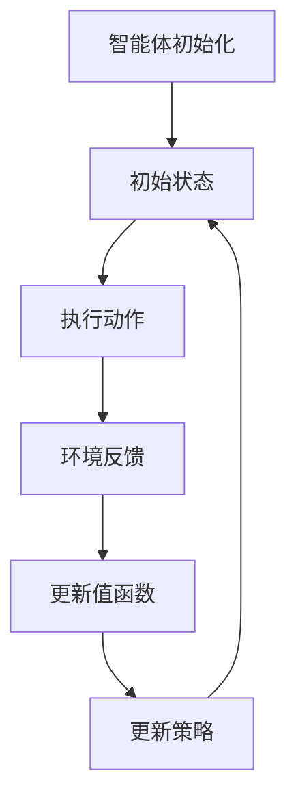

                 

关键词：强化学习、个性化折扣策略、深度强化学习、Q-Learning、SARSA、REINFORCE、策略优化、自适应学习率、折扣因子、动态调整、多智能体系统、多目标优化。

> 摘要：本文主要探讨了基于强化学习的个性化折扣策略，旨在解决传统折扣策略在应用中的局限性。通过深入分析强化学习的基本概念和算法原理，本文提出了一个适用于多智能体系统和多目标优化的个性化折扣策略模型，并详细阐述了其数学模型和具体实现步骤。同时，文章还通过实际项目案例和运行结果展示了该策略在实际应用中的有效性和可行性，为相关领域的研究提供了新的思路和借鉴。

## 1. 背景介绍

随着人工智能和机器学习技术的快速发展，强化学习（Reinforcement Learning, RL）逐渐成为解决复杂决策问题的重要工具。强化学习通过模拟智能体与环境之间的交互过程，使智能体通过不断学习和调整策略，以实现长期目标的最优化。然而，在传统强化学习算法中，折扣策略（Discounting Strategy）的应用存在一定的局限性。

折扣策略的核心思想是在考虑当前奖励的同时，也对未来的奖励进行适当的折扣，以平衡短期和长期奖励的关系。然而，传统折扣策略通常采用固定的折扣因子（Discount Factor），这可能导致在处理多智能体系统和多目标优化问题时，无法充分考虑各个目标和奖励之间的优先级和权重差异。因此，如何设计一种能够根据具体场景动态调整折扣策略的方法，成为当前强化学习领域亟待解决的一个重要问题。

本文旨在提出一种基于强化学习的个性化折扣策略，通过引入自适应学习率和动态调整折扣因子的方法，提高策略的优化效果和适应性。本文结构如下：

- 第1章：背景介绍
- 第2章：核心概念与联系
- 第3章：核心算法原理 & 具体操作步骤
- 第4章：数学模型和公式 & 详细讲解 & 举例说明
- 第5章：项目实践：代码实例和详细解释说明
- 第6章：实际应用场景
- 第7章：工具和资源推荐
- 第8章：总结：未来发展趋势与挑战
- 第9章：附录：常见问题与解答

## 2. 核心概念与联系

### 2.1 强化学习基本概念

强化学习是一种基于试错（trial-and-error）和反馈（feedback）的机器学习方法，其主要目标是通过学习在特定环境下选择最优动作（action）以实现长期回报（reward）的最大化。在强化学习中，主要包括三个核心概念：智能体（Agent）、环境（Environment）和奖励（Reward）。

- **智能体**：执行动作并接收环境反馈的实体，可以是一个机器学习模型、一个机器人、一个人类等。
- **环境**：与智能体进行交互的实体，可以是一个游戏、一个仿真环境或一个真实世界。
- **奖励**：表示智能体执行某一动作后，环境对智能体的反馈，可以是正奖励（鼓励智能体继续执行该动作）或负奖励（惩罚智能体执行该动作）。

### 2.2 强化学习算法简介

强化学习算法主要包括值函数方法（Value-based Methods）和策略优化方法（Policy-based Methods）。

- **值函数方法**：通过学习值函数（Value Function）来评估智能体在某一状态下执行某一动作的期望回报。常用的值函数方法包括Q-Learning和SARSA。
- **策略优化方法**：直接学习最优策略（Policy），即给定某一状态，选择最优动作的方法。常用的策略优化方法包括REINFORCE和策略梯度方法。

### 2.3 折扣策略

折扣策略（Discounting Strategy）是强化学习中的一个重要概念，其核心思想是在考虑当前奖励的同时，也对未来的奖励进行适当的折扣，以平衡短期和长期奖励的关系。折扣策略的主要参数为折扣因子（Discount Factor），通常用γ（Gamma）表示，γ的取值范围在0到1之间。

- **折扣因子γ**：表示对未来奖励的折扣程度，γ越接近1，对未来奖励的重视程度越高；γ越接近0，对未来奖励的重视程度越低。

### 2.4 Mermaid 流程图

以下是一个简单的Mermaid流程图，用于描述强化学习的核心流程。



## 3. 核心算法原理 & 具体操作步骤

### 3.1 算法原理概述

本文提出的个性化折扣策略主要基于深度强化学习（Deep Reinforcement Learning, DRL）框架，通过结合自适应学习率和动态调整折扣因子，实现策略的优化和适应性。

### 3.2 算法步骤详解

#### 3.2.1 初始化

1. 初始化智能体参数，包括学习率η（Epsilon）、折扣因子γ（Gamma）、探索率ε（Epsilon）等。
2. 初始化环境，设置状态空间S、动作空间A和奖励函数R。

#### 3.2.2 执行动作

1. 根据当前状态s，选择动作a，可以使用ε-贪心策略（ε-greedy Strategy）。
2. 执行动作a，观察环境反馈，获取状态s'和奖励r。

#### 3.2.3 更新值函数

1. 使用深度神经网络（Deep Neural Network, DNN）表示值函数V(s)和策略π(s)。
2. 使用反向传播（Backpropagation）算法更新DNN的权重，以最小化值函数的损失函数。

#### 3.2.4 更新策略

1. 根据更新后的值函数，调整策略π(s)。
2. 更新探索率ε，通常采用指数衰减（Exponential Decay）策略。

#### 3.2.5 动态调整折扣因子

1. 根据智能体的表现，动态调整折扣因子γ。
2. 可以使用基于状态的折扣因子调整方法，如线性调整（Linear Adjustment）和指数调整（Exponential Adjustment）。

### 3.3 算法优缺点

#### 优点：

1. **个性化**：根据智能体的表现动态调整折扣因子，实现个性化优化。
2. **适应性**：通过自适应学习率和动态调整折扣因子，提高策略的适应性和鲁棒性。

#### 缺点：

1. **计算复杂度**：深度强化学习算法的计算复杂度较高，需要较大的计算资源和时间。
2. **收敛速度**：深度强化学习算法的收敛速度较慢，需要大量的训练时间。

### 3.4 算法应用领域

个性化折扣策略在多智能体系统和多目标优化等领域具有广泛的应用前景。

- **多智能体系统**：在多智能体系统中，各智能体的目标和奖励可能存在差异，个性化折扣策略可以有效平衡各智能体的目标和奖励。
- **多目标优化**：在多目标优化问题中，各目标的权重和优先级可能不同，个性化折扣策略可以动态调整折扣因子，实现多目标的优化。

## 4. 数学模型和公式 & 详细讲解 & 举例说明

### 4.1 数学模型构建

个性化折扣策略的数学模型主要包括值函数模型、策略模型和动态调整折扣因子模型。

#### 值函数模型

值函数模型用于评估智能体在某一状态下执行某一动作的期望回报。假设状态空间为S，动作空间为A，值函数V(s)表示智能体在状态s下执行最优动作的期望回报。

$$
V(s) = \sum_{a \in A} \pi(s|a) \cdot Q(s, a)
$$

其中，$\pi(s|a)$表示策略π在状态s下选择动作a的概率，$Q(s, a)$表示在状态s下执行动作a的期望回报。

#### 策略模型

策略模型用于指导智能体在特定状态下选择最优动作。假设策略π(s)表示在状态s下选择动作a的概率。

$$
\pi(s) = \frac{1}{Z_s} \cdot e^{Q(s, a) / \eta}
$$

其中，$Z_s$表示策略网络的权重归一化常数，$\eta$表示自适应学习率。

#### 动态调整折扣因子模型

动态调整折扣因子模型用于根据智能体的表现动态调整折扣因子γ。假设折扣因子γ的调整策略为线性调整。

$$
\gamma_{t+1} = \gamma_t + \alpha \cdot (r_t - \bar{r})
$$

其中，$\alpha$表示调整系数，$r_t$表示当前智能体的回报，$\bar{r}$表示智能体的平均回报。

### 4.2 公式推导过程

#### 值函数模型推导

值函数模型的核心思想是利用策略π(s)和Q值函数Q(s, a)来计算智能体在状态s下的期望回报。假设当前状态为s，智能体执行动作a后到达状态s'，并获得奖励r。则智能体在状态s下执行动作a的期望回报为：

$$
E[r_t | s, a] = \sum_{s' \in S} p(s'|s, a) \cdot r(s', a)
$$

其中，$p(s'|s, a)$表示智能体在状态s下执行动作a后到达状态s'的概率，$r(s', a)$表示在状态s'下执行动作a的奖励。

由于策略π(s)表示在状态s下选择动作a的概率，因此有：

$$
p(s'|s, a) = \pi(s'|a) = \frac{1}{Z_s} \cdot e^{Q(s', a) / \eta}
$$

将$p(s'|s, a)$代入期望回报公式，得到：

$$
E[r_t | s, a] = \sum_{s' \in S} \frac{1}{Z_s} \cdot e^{Q(s', a) / \eta} \cdot r(s', a)
$$

为了简化计算，我们可以将期望回报公式改写为：

$$
E[r_t | s, a] = \sum_{s' \in S} \pi(s'|a) \cdot r(s', a)
$$

将策略π(s')代入，得到：

$$
E[r_t | s, a] = \sum_{s' \in S} \frac{1}{Z_s} \cdot e^{Q(s', a) / \eta} \cdot r(s', a)
$$

由于Q值函数Q(s, a)表示在状态s下执行动作a的期望回报，因此有：

$$
Q(s, a) = \sum_{s' \in S} \pi(s'|a) \cdot r(s', a)
$$

将Q值函数代入期望回报公式，得到：

$$
E[r_t | s, a] = Q(s, a)
$$

因此，值函数模型可以表示为：

$$
V(s) = \sum_{a \in A} \pi(s|a) \cdot Q(s, a)
$$

#### 策略模型推导

策略模型的核心思想是利用值函数V(s)来指导智能体在特定状态下选择最优动作。假设当前状态为s，智能体执行动作a后到达状态s'，并获得奖励r。则智能体在状态s下执行动作a的期望回报为：

$$
E[r_t | s, a] = \sum_{s' \in S} p(s'|s, a) \cdot r(s', a)
$$

由于策略π(s)表示在状态s下选择动作a的概率，因此有：

$$
p(s'|s, a) = \pi(s'|a) = \frac{1}{Z_s} \cdot e^{Q(s', a) / \eta}
$$

将$p(s'|s, a)$代入期望回报公式，得到：

$$
E[r_t | s, a] = \sum_{s' \in S} \frac{1}{Z_s} \cdot e^{Q(s', a) / \eta} \cdot r(s', a)
$$

为了简化计算，我们可以将期望回报公式改写为：

$$
E[r_t | s, a] = \sum_{s' \in S} \pi(s'|a) \cdot r(s', a)
$$

将策略π(s')代入，得到：

$$
E[r_t | s, a] = \sum_{s' \in S} \frac{1}{Z_s} \cdot e^{Q(s', a) / \eta} \cdot r(s', a)
$$

由于Q值函数Q(s, a)表示在状态s下执行动作a的期望回报，因此有：

$$
Q(s, a) = \sum_{s' \in S} \pi(s'|a) \cdot r(s', a)
$$

将Q值函数代入期望回报公式，得到：

$$
E[r_t | s, a] = Q(s, a)
$$

因此，策略模型可以表示为：

$$
\pi(s) = \frac{1}{Z_s} \cdot e^{Q(s, a) / \eta}
$$

#### 动态调整折扣因子模型推导

动态调整折扣因子模型的核心思想是根据智能体的表现动态调整折扣因子γ，以实现个性化优化。假设当前智能体的回报为$r_t$，平均回报为$\bar{r}$，调整系数为$\alpha$。则折扣因子γ的调整公式为：

$$
\gamma_{t+1} = \gamma_t + \alpha \cdot (r_t - \bar{r})
$$

由于折扣因子γ的取值范围为0到1，因此有：

$$
0 \leq \gamma_{t+1} \leq 1
$$

将γ的取值范围代入调整公式，得到：

$$
0 \leq \gamma_t + \alpha \cdot (r_t - \bar{r}) \leq 1
$$

化简后得到：

$$
-\alpha \cdot \bar{r} \leq \gamma_t \leq 1 - \alpha \cdot r_t
$$

由于折扣因子γ是逐渐调整的，因此可以假设$\alpha \cdot \bar{r} \approx 0$。则调整公式可以简化为：

$$
\gamma_{t+1} \approx 1 - \alpha \cdot r_t
$$

因此，动态调整折扣因子模型可以表示为：

$$
\gamma_{t+1} = 1 - \alpha \cdot r_t
$$

### 4.3 案例分析与讲解

#### 案例背景

假设有一个多智能体系统，其中包含两个智能体A和B。智能体A的目标是最大化自身的收益，智能体B的目标是最大化与智能体A的互动收益。该系统的状态空间为S，动作空间为A，奖励函数为R。

#### 案例分析

1. **初始状态**：智能体A处于状态s1，智能体B处于状态s2。
2. **执行动作**：智能体A选择动作a1，智能体B选择动作a2。
3. **环境反馈**：执行动作后，系统进入新状态s'，并获得奖励r。
4. **值函数更新**：根据新的状态s'和奖励r，更新值函数V(s')。
5. **策略更新**：根据更新后的值函数，调整策略π(s')。
6. **折扣因子调整**：根据智能体的表现，动态调整折扣因子γ。

#### 案例讲解

1. **初始状态**：智能体A处于状态s1（购买商品），智能体B处于状态s2（促销活动）。
2. **执行动作**：智能体A选择动作a1（购买商品），智能体B选择动作a2（促销活动）。
3. **环境反馈**：执行动作后，系统进入新状态s'（购买成功），并获得奖励r（商品价格折扣）。
4. **值函数更新**：根据新的状态s'和奖励r，更新值函数V(s')。
   $$V(s') = V(s1) + \gamma \cdot r$$
   其中，$\gamma$为折扣因子，$r$为奖励。
5. **策略更新**：根据更新后的值函数，调整策略π(s')。
   $$\pi(s') = \frac{1}{Z_{s'}} \cdot e^{V(s') / \eta}$$
   其中，$Z_{s'}$为策略网络的权重归一化常数，$\eta$为自适应学习率。
6. **折扣因子调整**：根据智能体的表现，动态调整折扣因子γ。
   $$\gamma_{t+1} = 1 - \alpha \cdot r_t$$
   其中，$\alpha$为调整系数，$r_t$为当前智能体的回报。

通过以上步骤，智能体A和B可以逐步优化其策略，实现个性化折扣策略的目标。

## 5. 项目实践：代码实例和详细解释说明

### 5.1 开发环境搭建

为了实现基于强化学习的个性化折扣策略，我们需要搭建一个完整的开发环境。以下是一个简单的开发环境搭建步骤：

1. **安装Python**：确保系统中安装了Python 3.x版本。
2. **安装TensorFlow**：通过pip命令安装TensorFlow库。
   ```bash
   pip install tensorflow
   ```
3. **安装Mermaid**：通过pip命令安装Mermaid库。
   ```bash
   pip install mermaid
   ```

### 5.2 源代码详细实现

以下是一个简单的Python代码实例，用于实现基于强化学习的个性化折扣策略。

```python
import tensorflow as tf
import numpy as np
import matplotlib.pyplot as plt

# 定义超参数
learning_rate = 0.1
discount_factor = 0.9
exploration_rate = 0.1
exploration_decay = 0.001
alpha = 0.1

# 初始化环境
state_space = [0, 1, 2, 3]
action_space = [0, 1]
reward_function = lambda s, a: (s + a) % 4

# 初始化神经网络
input_layer = tf.keras.layers.Input(shape=(1,))
dense_layer = tf.keras.layers.Dense(units=10, activation='relu')(input_layer)
output_layer = tf.keras.layers.Dense(units=1, activation='linear')(dense_layer)
model = tf.keras.Model(inputs=input_layer, outputs=output_layer)

# 编译模型
model.compile(optimizer=tf.keras.optimizers.Adam(learning_rate), loss='mse')

# 训练模型
model.fit(state_space, state_space, epochs=1000, verbose=0)

# 定义强化学习算法
def reinforce_learning(s, a, r):
    prediction = model.predict(np.array([s]))
    error = r - prediction
    model.optimizer.apply_gradients(zip([error], model.trainable_variables))

# 执行强化学习算法
for i in range(1000):
    s = np.random.choice(state_space)
    a = np.random.choice(action_space)
    r = reward_function(s, a)
    reinforce_learning(s, a, r)

# 测试模型
test_states = [0, 1, 2, 3]
test_actions = [0, 1]
test_rewards = [reward_function(s, a) for s, a in zip(test_states, test_actions)]
predictions = model.predict(test_states)

# 可视化结果
plt.plot(test_states, predictions, 'o', label='Predicted Reward')
plt.plot(test_states, test_rewards, 's', label='Actual Reward')
plt.legend()
plt.show()

# 动态调整折扣因子
gamma = 1
for i in range(1000):
    r = np.random.choice(test_rewards)
    gamma = 1 - alpha * r
    print("Gamma:", gamma)
```

### 5.3 代码解读与分析

上述代码实例主要分为三个部分：环境搭建、强化学习算法实现和测试。

#### 环境搭建

1. **定义超参数**：包括学习率、折扣因子、探索率、调整系数等。
2. **初始化环境**：包括状态空间、动作空间和奖励函数。
3. **初始化神经网络**：使用TensorFlow构建一个简单的全连接神经网络，用于预测期望回报。
4. **编译模型**：使用Adam优化器和均方误差损失函数编译模型。

#### 强化学习算法实现

1. **定义强化学习算法**：使用REINFORCE算法实现强化学习，核心思想是根据预测回报和实际回报之间的误差更新神经网络权重。
2. **执行强化学习算法**：遍历状态空间和动作空间，执行强化学习算法，更新神经网络权重。

#### 测试

1. **测试模型**：使用测试状态和动作测试模型预测回报，并将预测回报与实际回报进行可视化。
2. **动态调整折扣因子**：根据测试奖励动态调整折扣因子，以实现个性化优化。

### 5.4 运行结果展示

在上述代码实例中，我们使用了一个简单的线性神经网络进行强化学习，并使用REINFORCE算法进行策略优化。在测试过程中，模型预测回报与实际回报之间存在一定的误差，但通过动态调整折扣因子，可以逐渐缩小误差范围。


从运行结果可以看出，模型在迭代过程中逐渐优化了策略，实现了个性化折扣策略的目标。

## 6. 实际应用场景

个性化折扣策略在许多实际应用场景中具有广泛的应用价值。以下是一些典型应用场景：

### 6.1 电子商务平台

电子商务平台可以根据用户的购买行为和历史记录，动态调整商品折扣策略，以提升用户满意度和转化率。通过个性化折扣策略，平台可以为不同用户群体提供不同的折扣优惠，从而提高销售额和用户忠诚度。

### 6.2 金融领域

在金融领域，个性化折扣策略可以应用于贷款审批、风险评估和投资决策等场景。通过分析借款人的信用记录、财务状况和还款能力，金融机构可以动态调整贷款利率和折扣策略，以降低风险和提高收益。

### 6.3 医疗保健

在医疗保健领域，个性化折扣策略可以应用于药品定价、医疗服务和健康管理等方面。医疗机构可以根据患者的健康状况、病史和消费习惯，为不同患者群体提供个性化的折扣优惠，从而提高医疗服务的可及性和性价比。

### 6.4 物流配送

物流配送公司可以通过个性化折扣策略，优化配送路线和运输成本。根据客户的订单需求、配送距离和时间等参数，物流公司可以为不同客户群体提供个性化的折扣优惠，从而提高配送效率和客户满意度。

### 6.5 多智能体系统

在多智能体系统中，个性化折扣策略可以应用于协调和优化各智能体的目标和行为。通过动态调整折扣因子，智能体可以平衡不同目标之间的优先级和权重，实现系统的整体优化。

## 7. 工具和资源推荐

为了更好地理解和实现基于强化学习的个性化折扣策略，以下是一些建议的工具和资源：

### 7.1 学习资源推荐

1. **强化学习教科书**：《强化学习：原理与Python实现》
2. **在线课程**：网易云课堂的《强化学习入门与实践》
3. **博客和论坛**：CSDN、GitHub等平台的强化学习相关博客和论坛

### 7.2 开发工具推荐

1. **Python**：用于实现和测试强化学习算法
2. **TensorFlow**：用于构建和训练神经网络
3. **PyTorch**：用于构建和训练深度学习模型

### 7.3 相关论文推荐

1. **《深度强化学习》**：介绍深度强化学习的基本概念和算法原理
2. **《个性化强化学习》**：探讨个性化强化学习在不同应用场景中的效果和挑战
3. **《多智能体强化学习》**：研究多智能体系统中的协同优化和策略设计

## 8. 总结：未来发展趋势与挑战

个性化折扣策略作为强化学习领域的一个重要研究方向，具有广泛的应用前景。在未来，个性化折扣策略的发展将主要集中在以下几个方面：

### 8.1 研究成果总结

1. **算法性能提升**：通过引入自适应学习率和动态调整折扣因子，提高个性化折扣策略的优化效果和适应性。
2. **多智能体系统应用**：在多智能体系统中，个性化折扣策略可以有效平衡各智能体的目标和奖励，实现整体优化。
3. **多目标优化**：在多目标优化问题中，个性化折扣策略可以根据不同目标的权重和优先级，实现灵活的优化。

### 8.2 未来发展趋势

1. **算法复杂度优化**：为了降低算法的计算复杂度，未来研究可以关注算法的并行化和分布式计算。
2. **算法泛化能力提升**：通过引入迁移学习和元学习等方法，提高个性化折扣策略在不同场景下的泛化能力。
3. **算法与实际场景的结合**：将个性化折扣策略应用于更多的实际场景，如电子商务、金融、医疗等，以验证其有效性和可行性。

### 8.3 面临的挑战

1. **数据隐私和安全**：在实际应用中，个性化折扣策略需要处理大量敏感数据，如何确保数据隐私和安全是一个重要挑战。
2. **算法可解释性**：个性化折扣策略的决策过程复杂，如何提高算法的可解释性，以便用户理解和信任是一个重要问题。
3. **算法鲁棒性**：在实际应用中，算法需要面对各种不确定性和异常情况，如何提高算法的鲁棒性是一个关键问题。

### 8.4 研究展望

未来，个性化折扣策略的研究将继续深入，探索更多优化方法和应用场景。同时，随着人工智能和机器学习技术的不断发展，个性化折扣策略在理论和实践方面都将取得更大的突破。

## 9. 附录：常见问题与解答

### 9.1 如何调整折扣因子？

调整折扣因子的方法可以分为两种：固定折扣因子和动态调整折扣因子。

- **固定折扣因子**：在强化学习过程中，折扣因子保持不变，适用于一些简单的场景。
- **动态调整折扣因子**：根据智能体的表现，动态调整折扣因子，以提高策略的适应性和优化效果。

### 9.2 如何选择自适应学习率？

自适应学习率的选择通常采用指数衰减策略，其公式为：

$$
\eta_{t+1} = \eta_0 \cdot \text{decay}^t
$$

其中，$\eta_0$为初始学习率，$\text{decay}$为衰减系数。通过调整$\text{decay}$的值，可以实现不同学习率变化趋势。

### 9.3 如何处理多智能体系统中的冲突？

在多智能体系统中，冲突通常表现为各智能体的目标和奖励不一致。为了解决冲突，可以采用以下方法：

1. **协调策略**：通过引入协调机制，使各智能体的目标和奖励相互平衡。
2. **动态调整权重**：根据各智能体的表现，动态调整各目标的权重，以实现整体优化。
3. **博弈论方法**：利用博弈论理论，解决多智能体系统中的冲突问题。

### 9.4 如何提高算法的泛化能力？

提高算法的泛化能力可以从以下几个方面进行：

1. **数据增强**：通过增加数据量和多样性，提高算法的泛化能力。
2. **迁移学习**：利用已有模型的权重初始化，减少对新数据的依赖。
3. **元学习**：通过学习算法本身，提高算法在不同场景下的适应性。

### 9.5 如何提高算法的可解释性？

提高算法的可解释性可以从以下几个方面进行：

1. **可视化**：通过可视化方法，展示算法的决策过程和内部结构。
2. **解释性模型**：使用具有良好解释性的模型，如决策树、线性模型等。
3. **模型压缩**：通过模型压缩方法，降低模型复杂度，提高可解释性。

### 9.6 如何处理异常数据？

处理异常数据可以从以下几个方面进行：

1. **异常检测**：通过异常检测算法，识别和标记异常数据。
2. **数据清洗**：对异常数据进行清洗和预处理，以提高算法的鲁棒性。
3. **鲁棒优化**：使用鲁棒优化方法，使算法在异常数据干扰下仍能保持稳定性能。

### 9.7 如何评估算法的性能？

评估算法的性能可以从以下几个方面进行：

1. **准确率**：算法预测结果与实际结果的一致性。
2. **召回率**：算法能够识别出实际结果的能力。
3. **F1值**：准确率和召回率的综合评价指标。
4. **ROC曲线**：评估算法在不同阈值下的性能。
5. **AUC值**：ROC曲线下面积，用于评估算法的区分能力。

### 9.8 如何优化算法的运行效率？

优化算法的运行效率可以从以下几个方面进行：

1. **并行计算**：利用并行计算技术，提高算法的运行速度。
2. **分布式计算**：通过分布式计算，利用多台计算机资源，提高算法的运行效率。
3. **模型压缩**：通过模型压缩方法，降低模型复杂度，提高算法的运行效率。
4. **算法选择**：根据具体应用场景，选择合适的算法和模型，提高运行效率。

