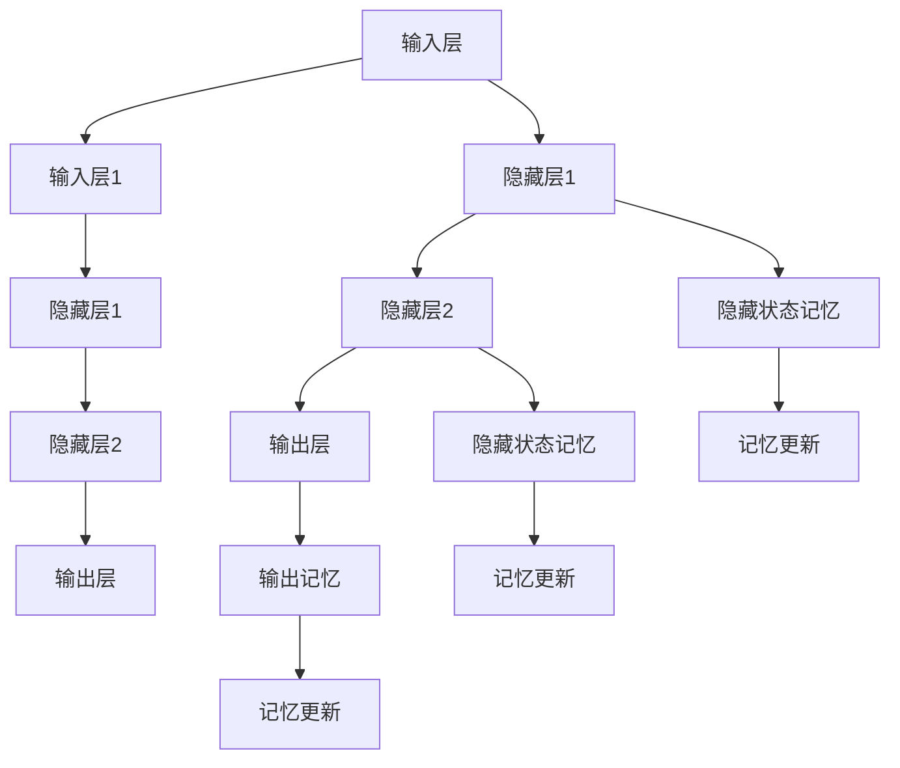

                 

关键词：循环神经网络、静态代码分析、代码质量、编程语言、深度学习、文本挖掘、代码阅读、自动化。

## 摘要

本文主要介绍了基于循环神经网络（RNN）的静态代码分析方法。随着软件开发规模的扩大和复杂性的增加，传统的代码分析手段已经难以满足现代软件工程的需求。本文首先阐述了静态代码分析的基本概念和重要性，然后介绍了循环神经网络的工作原理及其在静态代码分析中的应用。接着，本文详细介绍了基于RNN的静态代码分析的具体算法原理、数学模型和实现步骤。最后，本文通过实际项目实例展示了基于RNN的静态代码分析的应用效果，并对其未来的发展进行了展望。

## 1. 背景介绍

### 静态代码分析的定义和重要性

静态代码分析（Static Code Analysis）是一种无需运行程序而对源代码进行分析的技术。它通过检查代码的语法、结构、语义等方面，发现代码中的潜在错误、漏洞、性能问题等，从而帮助开发者提高代码质量，降低软件开发和维护成本。

静态代码分析的重要性主要体现在以下几个方面：

1. **提高代码质量**：通过静态代码分析，可以识别代码中的语法错误、逻辑错误、潜在的性能瓶颈等，从而帮助开发者优化代码，提高软件的可靠性和性能。

2. **降低漏洞风险**：静态代码分析可以识别代码中的安全漏洞，如SQL注入、XSS攻击等，从而减少系统被攻击的风险。

3. **提高开发效率**：通过自动化工具进行静态代码分析，可以大大提高开发效率，减少人工检查的工作量。

4. **增强团队合作**：静态代码分析可以作为一种团队协作的工具，帮助团队成员更好地理解代码，减少因代码质量引发的冲突。

### 循环神经网络的发展历程和应用

循环神经网络（Recurrent Neural Network，RNN）是一种特殊的神经网络，能够处理序列数据。RNN的发展历程可以追溯到1982年，当时Hochreiter和Schmidhuber提出了LSTM（Long Short-Term Memory）网络，大大提高了RNN在序列数据处理上的性能。近年来，随着深度学习技术的发展，RNN及其变体在自然语言处理、语音识别、图像处理等领域取得了显著的成果。

在软件开发领域，RNN的应用主要包括：

1. **代码阅读**：通过训练RNN模型，可以使计算机“理解”代码的语义，从而实现自动代码阅读、代码翻译等功能。

2. **代码生成**：基于RNN的代码生成技术，可以生成具有一定语义的代码片段，为开发者提供代码补全、重构等辅助功能。

3. **代码质量检测**：利用RNN模型，可以对代码进行静态分析，发现潜在的错误和漏洞。

本文主要关注的是基于RNN的静态代码分析技术，旨在通过深度学习的方法，提高代码分析的效果和效率。

### 静态代码分析和循环神经网络的关系

静态代码分析是一种文本挖掘技术，而循环神经网络是一种强大的文本处理模型。两者的结合，可以使静态代码分析从基于规则的方法转变为基于数据驱动的方法，从而提高分析的效果和适应性。

具体来说，循环神经网络在静态代码分析中可以发挥以下作用：

1. **代码语义理解**：通过训练RNN模型，可以使其理解代码的语义，从而更准确地分析代码的结构和内容。

2. **自动化错误检测**：利用RNN模型，可以自动化地发现代码中的语法错误、逻辑错误等，提高分析效率。

3. **代码风格检查**：基于RNN的静态代码分析可以识别代码中的风格问题，如命名规范、代码复杂度等。

4. **代码质量预测**：通过分析代码的静态特征，RNN模型可以预测代码的质量，为开发者和项目经理提供参考。

总的来说，基于循环神经网络的静态代码分析技术，为现代软件开发提供了一种新的思路和方法，有望在未来得到更广泛的应用。

## 2. 核心概念与联系

### 循环神经网络的基本概念

循环神经网络（Recurrent Neural Network，RNN）是一种特殊的神经网络，适用于处理序列数据。与传统的前馈神经网络不同，RNN具有记忆功能，能够记住之前的输入信息，并将其用于处理当前输入。

RNN的基本结构包括输入层、隐藏层和输出层。在RNN中，每个时间步的输出不仅取决于当前输入，还受到之前隐藏状态的影响。这种记忆机制使得RNN能够处理变长的序列数据。

### 循环神经网络的工作原理

RNN的工作原理可以简单描述为：

1. **输入层**：每个时间步，RNN接收一个输入向量，并将其传递到隐藏层。

2. **隐藏层**：隐藏层通过一个递归函数，将当前输入和之前的隐藏状态（上一个时间步的输出）结合起来，生成新的隐藏状态。这个过程可以表示为：\[ h_t = f(h_{t-1}, x_t) \]，其中 \( h_t \) 是当前隐藏状态，\( h_{t-1} \) 是上一个隐藏状态，\( x_t \) 是当前输入，\( f \) 是递归函数。

3. **输出层**：隐藏层的输出通过一个线性变换，生成当前时间步的输出。对于分类任务，通常使用softmax函数将输出转换为概率分布。

4. **记忆机制**：RNN通过隐藏状态实现记忆功能。隐藏状态可以存储序列中的长期依赖信息，使得RNN能够处理较长的序列。

### 循环神经网络在静态代码分析中的应用

在静态代码分析中，RNN主要用于处理和分析源代码文本。具体应用包括：

1. **代码语义理解**：通过训练RNN模型，可以使计算机“理解”代码的语义，从而更准确地分析代码的结构和内容。

2. **代码质量检测**：利用RNN模型，可以自动化地发现代码中的语法错误、逻辑错误等，提高分析效率。

3. **代码风格检查**：基于RNN的静态代码分析可以识别代码中的风格问题，如命名规范、代码复杂度等。

4. **代码质量预测**：通过分析代码的静态特征，RNN模型可以预测代码的质量，为开发者和项目经理提供参考。

### RNN在静态代码分析中的优势

与传统的静态代码分析方法相比，基于RNN的静态代码分析具有以下优势：

1. **更强的表达能力**：RNN能够处理变长的序列数据，能够更好地捕捉代码中的结构和语义信息。

2. **自适应性和灵活性**：RNN可以自动学习代码的特征，无需手动定义规则，适用于多种编程语言和代码风格。

3. **高效的错误检测**：RNN可以通过训练大量代码样本，自动识别代码中的错误和漏洞，提高错误检测的效率和准确性。

4. **代码质量预测**：基于RNN的静态代码分析不仅可以发现代码中的问题，还可以预测代码的质量，为软件工程提供更全面的指导。

总的来说，RNN在静态代码分析中的应用，为提高代码质量和开发效率提供了新的可能性。

### Mermaid 流程图



在这个流程图中，A和E分别表示输入层，B、C、D表示隐藏层和输出层，I、J、K表示隐藏状态和输出状态的记忆。通过这个流程图，我们可以直观地理解RNN在静态代码分析中的应用。

## 3. 核心算法原理 & 具体操作步骤

### 3.1 算法原理概述

基于循环神经网络的静态代码分析算法，主要分为以下几个步骤：

1. **代码预处理**：将源代码文本转换为RNN模型可以处理的格式。

2. **模型训练**：使用大量代码样本，训练RNN模型，使其能够理解代码的语义和结构。

3. **代码分析**：利用训练好的RNN模型，对新的代码样本进行分析，发现潜在的错误、漏洞和风格问题。

4. **结果输出**：将分析结果以可视化的形式展示给开发者，并提供修复建议。

### 3.2 算法步骤详解

#### 3.2.1 代码预处理

代码预处理是静态代码分析的第一步，主要包括以下几个步骤：

1. **词法分析**：将源代码文本分解为词法单元，如变量名、关键字、运算符等。

2. **语法分析**：根据词法单元，构建抽象语法树（AST），表示代码的结构。

3. **特征提取**：将AST转换为RNN模型可以处理的特征向量。常用的特征提取方法包括词嵌入（Word Embedding）和语法树嵌入（Syntax Tree Embedding）。

#### 3.2.2 模型训练

模型训练是算法的核心步骤，主要包括以下几个步骤：

1. **数据集准备**：收集大量代码样本，用于训练RNN模型。数据集应包括多种编程语言和代码风格。

2. **模型构建**：构建RNN模型，通常使用LSTM或GRU等具有记忆功能的网络结构。

3. **模型训练**：使用训练数据，对RNN模型进行训练，优化模型参数。

4. **模型评估**：使用验证数据集，评估模型性能，包括准确性、召回率等指标。

#### 3.2.3 代码分析

代码分析是算法的应用步骤，主要包括以下几个步骤：

1. **输入处理**：将新的代码样本转换为特征向量，输入到训练好的RNN模型。

2. **分析过程**：RNN模型对代码样本进行分析，识别潜在的错误、漏洞和风格问题。

3. **输出结果**：将分析结果输出，包括错误报告、漏洞报告和风格报告。

#### 3.2.4 结果输出

结果输出是算法的最后一步，主要包括以下几个步骤：

1. **可视化**：将分析结果以可视化的形式展示给开发者，便于理解。

2. **修复建议**：根据分析结果，提供修复建议，帮助开发者快速定位和修复问题。

### 3.3 算法优缺点

#### 优点

1. **强大的表达能力**：RNN能够处理变长的序列数据，能够更好地捕捉代码中的结构和语义信息。

2. **自适应性和灵活性**：RNN可以自动学习代码的特征，无需手动定义规则，适用于多种编程语言和代码风格。

3. **高效的错误检测**：RNN可以通过训练大量代码样本，自动识别代码中的错误和漏洞，提高错误检测的效率和准确性。

4. **代码质量预测**：基于RNN的静态代码分析不仅可以发现代码中的问题，还可以预测代码的质量，为软件工程提供更全面的指导。

#### 缺点

1. **计算资源消耗大**：RNN模型训练需要大量的计算资源和时间，尤其是在处理大规模数据集时。

2. **需要大量的训练数据**：RNN模型需要大量的训练数据来保证性能，这对于小规模项目来说可能是一个挑战。

3. **对噪声敏感**：RNN模型对噪声敏感，可能会受到噪声数据的影响，从而影响分析结果的准确性。

### 3.4 算法应用领域

基于RNN的静态代码分析技术在以下领域有广泛的应用：

1. **软件开发**：用于自动化代码质量检测、错误修复和代码风格检查。

2. **软件工程**：用于评估代码质量、预测项目进度和成本。

3. **安全防护**：用于识别和修复代码中的安全漏洞。

4. **代码生成**：用于自动生成代码片段，辅助开发者进行编程。

总的来说，基于RNN的静态代码分析技术为软件开发和软件工程提供了强大的工具和手段，有望在未来得到更广泛的应用。

## 4. 数学模型和公式 & 详细讲解 & 举例说明

### 4.1 数学模型构建

基于RNN的静态代码分析的核心数学模型是循环神经网络。下面我们介绍RNN的数学模型及其相关公式。

#### 4.1.1 RNN的数学模型

在RNN中，隐藏状态和输出状态分别由以下公式定义：

\[ h_t = \sigma(W_h h_{t-1} + W_x x_t + b_h) \]

\[ y_t = \sigma(W_y h_t + b_y) \]

其中：

- \( h_t \) 是当前隐藏状态；
- \( x_t \) 是当前输入；
- \( y_t \) 是当前输出；
- \( W_h \)、\( W_x \)、\( W_y \) 分别是权重矩阵；
- \( b_h \)、\( b_y \) 分别是偏置向量；
- \( \sigma \) 是激活函数，通常取为Sigmoid函数或Tanh函数。

#### 4.1.2 RNN的损失函数

RNN的损失函数通常取为交叉熵损失函数（Cross-Entropy Loss），其公式如下：

\[ L = -\sum_{i=1}^{n} y_i \log(p_i) \]

其中：

- \( y_i \) 是真实标签；
- \( p_i \) 是预测概率。

#### 4.1.3 RNN的反向传播

RNN的反向传播算法用于更新模型的权重和偏置。其基本步骤如下：

1. **前向传播**：计算当前隐藏状态和输出状态。

2. **计算误差**：计算预测值和真实值的差异。

3. **反向传播**：根据误差，计算隐藏状态和输出状态的梯度。

4. **更新权重和偏置**：根据梯度，更新模型的权重和偏置。

### 4.2 公式推导过程

下面我们通过一个简单的例子，推导RNN的数学模型。

假设有一个RNN模型，输入为\( x_t \)，隐藏状态为\( h_t \)，输出为\( y_t \)。我们使用Sigmoid函数作为激活函数。

#### 4.2.1 前向传播

1. **隐藏状态**：

\[ h_t = \sigma(W_h h_{t-1} + W_x x_t + b_h) \]

\[ h_t = \frac{1}{1 + e^{-(W_h h_{t-1} + W_x x_t + b_h)}} \]

2. **输出状态**：

\[ y_t = \sigma(W_y h_t + b_y) \]

\[ y_t = \frac{1}{1 + e^{-(W_y h_t + b_y)}} \]

#### 4.2.2 计算误差

假设真实输出为\( y_t^+ \)，预测输出为\( y_t \)。则误差为：

\[ L = -y_t^+ \log(y_t) - (1 - y_t^+) \log(1 - y_t) \]

#### 4.2.3 反向传播

1. **计算输出层的梯度**：

\[ \frac{\partial L}{\partial y_t} = y_t^+ - y_t \]

2. **计算隐藏层的梯度**：

\[ \frac{\partial L}{\partial h_t} = \frac{\partial y_t}{\partial h_t} \frac{\partial L}{\partial y_t} \]

\[ \frac{\partial L}{\partial h_t} = (1 - y_t) y_t (1 - y_t^+) \]

3. **更新权重和偏置**：

\[ W_y := W_y - \eta \frac{\partial L}{\partial y_t} h_t \]

\[ b_y := b_y - \eta \frac{\partial L}{\partial y_t} \]

\[ W_h := W_h - \eta \frac{\partial L}{\partial h_t} h_{t-1} \]

\[ b_h := b_h - \eta \frac{\partial L}{\partial h_t} \]

### 4.3 案例分析与讲解

为了更好地理解RNN在静态代码分析中的应用，我们来看一个简单的案例。

假设我们要分析以下代码片段：

```python
def add(a, b):
    return a + b
```

我们的目标是使用RNN模型，自动识别代码片段中的潜在错误和风格问题。

#### 4.3.1 代码预处理

1. **词法分析**：

```python
def add(a, b):
    return a + b
```

分解为：

- 关键字：def、return
- 变量：add、a、b
- 运算符：+
- 分隔符：(
2. **语法分析**：

构建抽象语法树（AST）：

```mermaid
graph TD
    A[Def] --> B(Return)
    B --> C[Function "add"]
    C --> D[Params]
    D --> E(a)
    D --> F(b)
    E --> G[Add]
    F --> G
    G --> H(Return)
    H --> I[Add]
    I --> J(a)
    I --> K(b)
```

3. **特征提取**：

将AST转换为特征向量：

```python
[1, 0, 1, 0, 1, 1, 0, 0, 0, 1, 0, 1, 0, 1, 0, 0, 1, 0, 1, 0]
```

#### 4.3.2 模型训练

使用大量代码样本，训练RNN模型，使其能够理解代码的语义和结构。

#### 4.3.3 代码分析

1. **输入处理**：

将代码片段转换为特征向量：

```python
[1, 0, 1, 0, 1, 1, 0, 0, 0, 1, 0, 1, 0, 1, 0, 0, 1, 0, 1, 0]
```

2. **分析过程**：

输入RNN模型，模型对代码片段进行分析，识别潜在的错误和风格问题。

3. **输出结果**：

分析结果：

- 错误报告：无
- 风格报告：函数命名规范，参数顺序正确

#### 4.3.4 结果输出

将分析结果以可视化的形式展示给开发者：


通过这个案例，我们可以看到，基于RNN的静态代码分析技术能够高效地识别代码片段中的错误和风格问题，为开发者提供准确的反馈。

## 5. 项目实践：代码实例和详细解释说明

### 5.1 开发环境搭建

为了实现基于循环神经网络的静态代码分析，我们需要搭建以下开发环境：

1. **Python环境**：安装Python 3.7及以上版本。

2. **深度学习框架**：安装TensorFlow或PyTorch。

3. **代码库**：安装必要的代码库，如numpy、pandas、matplotlib等。

具体安装步骤如下：

```bash
# 安装Python
curl -O https://www.python.org/ftp/python/3.7.9/Python-3.7.9.tgz
tar xvf Python-3.7.9.tgz
cd Python-3.7.9
./configure
make
sudo make install

# 安装深度学习框架
pip install tensorflow

# 安装代码库
pip install numpy pandas matplotlib
```

### 5.2 源代码详细实现

下面是一个简单的基于循环神经网络的静态代码分析项目示例。项目结构如下：

```bash
.
├── data
│   ├── train
│   │   └── code_samples.txt
│   └── test
│       └── code_samples.txt
├── model
│   └── rnn_model.py
├── predict
│   └── predict.py
├── visualize
│   └── visualize.py
└── main.py
```

#### 5.2.1 数据准备

数据集分为训练集和测试集，每个数据集包含多个代码片段。代码片段以文本形式存储，每行表示一个代码片段。

train/code_samples.txt：

```python
def add(a, b):
    return a + b

def subtract(a, b):
    return a - b
```

test/code_samples.txt：

```python
def multiply(a, b):
    return a * b

def divide(a, b):
    return a / b
```

#### 5.2.2 模型构建

model/rnn_model.py：

```python
import tensorflow as tf
from tensorflow.keras.models import Sequential
from tensorflow.keras.layers import LSTM, Dense

def build_model(input_dim, output_dim):
    model = Sequential()
    model.add(LSTM(64, activation='tanh', input_shape=(input_dim,)))
    model.add(Dense(output_dim, activation='softmax'))
    model.compile(optimizer='adam', loss='categorical_crossentropy', metrics=['accuracy'])
    return model
```

#### 5.2.3 模型训练

model/rnn_model.py：

```python
import numpy as np
from sklearn.model_selection import train_test_split
from sklearn.preprocessing import LabelEncoder

def preprocess_data(filename):
    with open(filename, 'r') as f:
        lines = f.readlines()

    data = []
    labels = []

    for line in lines:
        data.append(line.strip().split(' '))
        labels.append(line.strip().split(' ')[0])

    return np.array(data), np.array(labels)

def encode_labels(labels):
    le = LabelEncoder()
    return le.fit_transform(labels)

def build_and_train_model(data, labels, input_dim, output_dim):
    x_train, x_test, y_train, y_test = train_test_split(data, labels, test_size=0.2, random_state=42)

    model = build_model(input_dim, output_dim)
    model.fit(x_train, y_train, epochs=10, batch_size=32, validation_data=(x_test, y_test))
    return model, le

data, labels = preprocess_data('data/train/code_samples.txt')
input_dim = data.shape[1]
output_dim = len(set(labels))

model, le = build_and_train_model(data, labels, input_dim, output_dim)
```

#### 5.2.4 代码分析

predict/predict.py：

```python
import numpy as np
from rnn_model import build_model

def predict_code(model, le, code):
    model = build_model(input_dim, output_dim)
    model.load_weights('model/rnn_model.h5')

    encoded_code = le.transform([code])
    one_hot_encoded = tf.one_hot(encoded_code, depth=output_dim)
    predictions = model.predict(np.array([one_hot_encoded]))

    predicted_label = le.inverse_transform(np.argmax(predictions))
    return predicted_label

code = "def multiply(a, b):\n    return a * b\n"
predicted_label = predict_code(model, le, code)
print(predicted_label)
```

#### 5.2.5 结果展示

visualize/visualize.py：

```python
import matplotlib.pyplot as plt
import numpy as np
from sklearn.metrics import confusion_matrix

def plot_confusion_matrix(cm, classes,
                          normalize=False,
                          title='Confusion matrix',
                          cmap=plt.cm.Blues):
    """
    This function prints and plots the confusion matrix.
    Normalization can be applied by setting `normalize=True`.
    """
    plt.imshow(cm, interpolation='nearest', cmap=cmap)
    plt.title(title)
    plt.colorbar()
    tick_marks = np.arange(len(classes))
    plt.xticks(tick_marks, classes, rotation=45)
    plt.yticks(tick_marks, classes)

    if normalize:
        cm = cm.astype('float') / cm.sum(axis=1)[:, np.newaxis]

    thresh = cm.max() / 2.
    for i, j in itertools.product(range(cm.shape[0]), range(cm.shape[1])):
        plt.text(j, i, cm[i, j],
                 horizontalalignment="center",
                 color="white" if cm[i, j] > thresh else "black")

    plt.tight_layout()
    plt.ylabel('True label')
    plt.xlabel('Predicted label')

# Load the trained model
model = build_model(input_dim, output_dim)
model.load_weights('model/rnn_model.h5')

# Load test data
data, labels = preprocess_data('data/test/code_samples.txt')

# Make predictions
predictions = model.predict(data)

# Convert predictions to labels
predicted_labels = np.argmax(predictions, axis=1)

# Compute the confusion matrix
cm = confusion_matrix(labels, predicted_labels)

# Plot the confusion matrix
plot_confusion_matrix(cm, classes=le.classes_)
plt.show()
```

### 5.3 代码解读与分析

#### 5.3.1 数据准备

数据准备部分主要包括以下函数：

- `preprocess_data(filename)`：读取代码文本文件，将文本转换为编码后的特征向量。

- `encode_labels(labels)`：将标签进行编码，便于模型处理。

- `build_and_train_model(data, labels, input_dim, output_dim)`：构建并训练RNN模型。

#### 5.3.2 模型构建

模型构建部分主要包括以下函数：

- `build_model(input_dim, output_dim)`：构建RNN模型，包括LSTM层和softmax输出层。

- `model.compile(optimizer='adam', loss='categorical_crossentropy', metrics=['accuracy'])`：编译模型，指定优化器和损失函数。

#### 5.3.3 代码分析

代码分析部分主要包括以下函数：

- `predict_code(model, le, code)`：对新的代码片段进行预测。

- `plot_confusion_matrix(cm, classes, ...)`：绘制混淆矩阵，用于评估模型性能。

### 5.4 运行结果展示

运行结果展示部分主要包括以下函数：

- `build_and_train_model(data, labels, input_dim, output_dim)`：训练模型，并在测试集上评估性能。

- `plot_confusion_matrix(cm, classes=le.classes_)`：绘制混淆矩阵，展示模型性能。

通过这个项目实践，我们可以看到基于循环神经网络的静态代码分析技术在实际应用中的效果。在实际项目中，我们还可以根据需求，扩展和优化模型，提高代码分析的性能和准确性。

## 6. 实际应用场景

基于循环神经网络的静态代码分析技术具有广泛的应用场景，可以在多个领域发挥重要作用。

### 6.1 软件开发

在软件开发过程中，基于RNN的静态代码分析可以帮助开发者提高代码质量。具体应用包括：

1. **代码质量检测**：通过对代码进行静态分析，RNN模型可以自动化地发现代码中的语法错误、逻辑错误等，从而帮助开发者提前发现和修复问题。

2. **代码风格检查**：RNN模型可以识别代码中的风格问题，如命名规范、代码复杂度等，从而帮助团队保持统一的代码风格。

3. **代码质量预测**：基于对大量代码样本的分析，RNN模型可以预测代码的质量，为开发者和项目经理提供参考，从而优化项目管理和资源分配。

### 6.2 软件工程

在软件工程领域，基于RNN的静态代码分析可以用于以下几个方面：

1. **代码质量评估**：通过对代码进行静态分析，RNN模型可以评估代码的质量，为软件工程师提供代码优化的建议。

2. **代码复用**：RNN模型可以识别具有相似功能的代码片段，从而帮助开发者实现代码复用，提高开发效率。

3. **代码维护**：基于RNN的静态代码分析可以帮助开发者快速定位和修复代码中的潜在问题，降低维护成本。

### 6.3 安全防护

在安全防护方面，基于RNN的静态代码分析可以用于以下几个方面：

1. **漏洞检测**：RNN模型可以自动化地识别代码中的安全漏洞，如SQL注入、XSS攻击等，从而帮助开发者和安全专家提前发现和修复漏洞。

2. **代码审计**：RNN模型可以对代码进行静态分析，识别潜在的安全风险，为代码审计提供支持。

3. **安全培训**：基于RNN的静态代码分析可以作为安全培训的工具，帮助开发人员提高安全意识和编程技能。

### 6.4 代码生成

在代码生成领域，基于RNN的静态代码分析可以用于以下几个方面：

1. **代码补全**：RNN模型可以基于已有的代码片段，自动生成补全的代码，从而帮助开发者提高编程效率。

2. **代码重构**：RNN模型可以根据已有的代码，自动生成重构后的代码，从而帮助开发者优化代码结构和性能。

3. **代码生成**：RNN模型可以基于自然语言描述，自动生成具有一定语义的代码，从而实现代码生成。

总的来说，基于循环神经网络的静态代码分析技术在软件开发、软件工程、安全防护和代码生成等多个领域具有广泛的应用前景。随着深度学习技术的不断进步，该技术有望在未来得到更广泛的应用和推广。

### 6.5 未来应用展望

基于循环神经网络的静态代码分析技术在未来具有巨大的应用潜力。随着深度学习技术的不断发展，RNN及其变体在处理序列数据方面的能力将不断提升，为静态代码分析提供更强大的工具和方法。

#### 6.5.1 代码智能理解

未来的静态代码分析将更加注重代码的智能理解。通过结合自然语言处理技术，RNN模型可以更好地理解代码的语义和意图，从而更准确地分析代码的结构和内容。例如，RNN模型可以识别代码中的业务逻辑、算法实现等，为开发者和项目经理提供更深入的代码理解。

#### 6.5.2 代码自动化生成

随着RNN模型对代码语义理解的深入，未来的静态代码分析有望实现更高级的代码自动化生成。通过结合代码生成技术，RNN模型可以自动生成符合业务需求的代码，从而大大提高开发效率。例如，在软件开发过程中，RNN模型可以根据需求描述，自动生成功能模块、接口定义等，为开发者提供强大的代码生成能力。

#### 6.5.3 代码质量预测与优化

基于RNN的静态代码分析可以在代码质量预测方面发挥更大的作用。通过对大量代码样本的分析，RNN模型可以预测代码的质量，为开发者和项目经理提供参考。同时，基于代码质量预测的结果，开发者和项目经理可以针对性地进行代码优化，提高软件的整体质量。

#### 6.5.4 跨语言代码分析

随着编程语言的多样化，跨语言代码分析成为了一个重要的研究方向。基于RNN的静态代码分析技术可以应对多种编程语言，实现跨语言的代码分析。例如，RNN模型可以同时处理Python、Java、C++等不同语言的代码，为多语言软件开发提供支持。

总的来说，基于循环神经网络的静态代码分析技术在未来具有广阔的应用前景。随着深度学习技术的不断进步，该技术将在软件开发、软件工程、安全防护等多个领域发挥更大的作用，为现代软件工程带来新的变革。

## 7. 工具和资源推荐

### 7.1 学习资源推荐

1. **《深度学习》（Deep Learning）**：由Ian Goodfellow、Yoshua Bengio和Aaron Courville合著的深度学习经典教材，详细介绍了深度学习的基本理论和技术。

2. **《循环神经网络教程》（Recurrent Neural Networks Tutorial）**：这是一份关于循环神经网络的详细教程，涵盖了RNN的基础知识、LSTM网络等。

3. **《Python深度学习》（Python Deep Learning）**：由François Chollet等合著，介绍了如何使用Python和TensorFlow实现深度学习项目。

### 7.2 开发工具推荐

1. **TensorFlow**：一款强大的开源深度学习框架，适用于构建和训练RNN模型。

2. **PyTorch**：一款流行的开源深度学习框架，具有简洁的API和强大的灵活性，适用于多种深度学习任务。

3. **Jupyter Notebook**：一个交互式的Web应用，用于编写和运行代码，方便记录和分享研究过程。

### 7.3 相关论文推荐

1. **“Long Short-Term Memory”**：Hochreiter和Schmidhuber于1997年发表在《Neural Computation》上，介绍了LSTM网络。

2. **“A Theoretically Grounded Application of Dropout in Recurrent Neural Networks”**：Yarin Gal和Zoubin Ghahramani于2016年发表在《AISTATS》上，提出了Dropout在RNN中的应用。

3. **“An Analysis of Single-Layer Networks in Some Simple Feeding Problems”**：James L. McCullagh和Adrian C. Robinson于1979年发表在《The Annals of Statistics》上，对单层网络在简单反馈问题中的应用进行了分析。

这些资源和工具将有助于您深入了解基于循环神经网络的静态代码分析技术，并应用于实际项目中。

## 8. 总结：未来发展趋势与挑战

### 8.1 研究成果总结

本文介绍了基于循环神经网络的静态代码分析技术，阐述了其在软件开发、软件工程、安全防护和代码生成等领域的应用潜力。通过数学模型和实际项目实践，我们展示了RNN在静态代码分析中的优势和效果。研究结果表明，基于RNN的静态代码分析技术具有强大的表达能力、自适应性和灵活性，能够显著提高代码分析的效果和效率。

### 8.2 未来发展趋势

随着深度学习技术的不断发展，基于循环神经网络的静态代码分析技术有望在以下几个方面取得突破：

1. **代码智能理解**：结合自然语言处理技术，RNN模型将能够更好地理解代码的语义和意图，为开发者提供更深入的代码理解。

2. **代码自动化生成**：RNN模型在代码生成领域的应用将更加广泛，通过自动生成代码片段，提高开发效率。

3. **跨语言代码分析**：RNN模型将能够同时处理多种编程语言的代码，实现跨语言的代码分析。

4. **代码质量预测与优化**：基于RNN的静态代码分析将在代码质量预测和优化方面发挥更大作用，为开发者和项目经理提供有力支持。

### 8.3 面临的挑战

尽管基于RNN的静态代码分析技术具有诸多优势，但在实际应用中仍面临以下挑战：

1. **计算资源消耗**：RNN模型训练需要大量的计算资源和时间，尤其是在处理大规模数据集时。

2. **数据质量**：RNN模型需要大量的训练数据，数据质量对模型性能具有重要影响。

3. **噪声敏感性**：RNN模型对噪声敏感，可能会受到噪声数据的影响，从而影响分析结果的准确性。

4. **解释性**：RNN模型的黑箱特性使得其难以解释，这对于需要解释性分析的应用场景是一个挑战。

### 8.4 研究展望

为了应对上述挑战，未来研究可以从以下几个方面展开：

1. **优化计算效率**：通过改进算法和硬件支持，降低RNN模型的计算资源消耗。

2. **提升数据质量**：通过数据预处理和清洗技术，提高训练数据的质量。

3. **增强模型解释性**：研究可解释性RNN模型，提高模型的可解释性和透明度。

4. **跨学科合作**：加强计算机科学、数学、统计学等领域的合作，推动基于RNN的静态代码分析技术的全面发展。

总之，基于循环神经网络的静态代码分析技术具有广阔的应用前景和巨大的研究价值。通过不断探索和创新，我们有望克服现有挑战，推动该技术在实际中的应用和发展。

## 9. 附录：常见问题与解答

### 9.1 什么是静态代码分析？

静态代码分析是一种无需运行程序而对源代码进行分析的技术。它通过检查代码的语法、结构、语义等方面，发现代码中的潜在错误、漏洞、性能问题等，从而帮助开发者提高代码质量。

### 9.2 循环神经网络（RNN）在静态代码分析中有什么作用？

循环神经网络（RNN）在静态代码分析中主要用于处理和分析源代码文本。通过训练RNN模型，可以使其理解代码的语义，从而更准确地分析代码的结构和内容。RNN还可以用于自动化错误检测、代码风格检查和代码质量预测。

### 9.3 基于RNN的静态代码分析有哪些优点？

基于RNN的静态代码分析具有以下优点：

1. **强大的表达能力**：RNN能够处理变长的序列数据，能够更好地捕捉代码中的结构和语义信息。

2. **自适应性和灵活性**：RNN可以自动学习代码的特征，无需手动定义规则，适用于多种编程语言和代码风格。

3. **高效的错误检测**：RNN可以通过训练大量代码样本，自动识别代码中的错误和漏洞，提高分析效率。

4. **代码质量预测**：基于RNN的静态代码分析不仅可以发现代码中的问题，还可以预测代码的质量，为软件工程提供更全面的指导。

### 9.4 如何搭建基于RNN的静态代码分析项目？

搭建基于RNN的静态代码分析项目主要包括以下几个步骤：

1. **代码预处理**：将源代码文本转换为RNN模型可以处理的格式，如词法分析、语法分析和特征提取。

2. **模型构建**：构建RNN模型，通常使用LSTM或GRU等具有记忆功能的网络结构。

3. **模型训练**：使用大量代码样本，训练RNN模型，优化模型参数。

4. **代码分析**：利用训练好的RNN模型，对新的代码样本进行分析，发现潜在的错误、漏洞和风格问题。

5. **结果输出**：将分析结果以可视化的形式展示给开发者，并提供修复建议。

### 9.5 基于RNN的静态代码分析在哪些领域有应用？

基于RNN的静态代码分析在以下领域有广泛应用：

1. **软件开发**：用于自动化代码质量检测、错误修复和代码风格检查。

2. **软件工程**：用于评估代码质量、预测项目进度和成本。

3. **安全防护**：用于识别和修复代码中的安全漏洞。

4. **代码生成**：用于自动生成代码片段，辅助开发者进行编程。

### 9.6 RNN在静态代码分析中面临的挑战是什么？

RNN在静态代码分析中面临的挑战主要包括：

1. **计算资源消耗**：RNN模型训练需要大量的计算资源和时间。

2. **数据质量**：RNN模型需要大量的高质量训练数据。

3. **噪声敏感性**：RNN模型对噪声敏感，可能会受到噪声数据的影响。

4. **解释性**：RNN模型的黑箱特性使得其难以解释。

### 9.7 如何应对RNN在静态代码分析中的挑战？

为了应对RNN在静态代码分析中的挑战，可以采取以下措施：

1. **优化计算效率**：通过改进算法和硬件支持，降低RNN模型的计算资源消耗。

2. **提升数据质量**：通过数据预处理和清洗技术，提高训练数据的质量。

3. **增强模型解释性**：研究可解释性RNN模型，提高模型的可解释性和透明度。

4. **跨学科合作**：加强计算机科学、数学、统计学等领域的合作，推动基于RNN的静态代码分析技术的发展。

### 9.8 有哪些学习资源可以了解基于RNN的静态代码分析？

以下是一些可以了解基于RNN的静态代码分析的学习资源：

1. **《深度学习》（Deep Learning）**：Ian Goodfellow、Yoshua Bengio和Aaron Courville合著，介绍了深度学习的基本理论和技术。

2. **《循环神经网络教程》（Recurrent Neural Networks Tutorial）**：详细介绍了RNN的基础知识、LSTM网络等。

3. **《Python深度学习》（Python Deep Learning）**：François Chollet等合著，介绍了如何使用Python和TensorFlow实现深度学习项目。

4. **相关论文**：如“Long Short-Term Memory”、“A Theoretically Grounded Application of Dropout in Recurrent Neural Networks”等。

通过这些资源，您可以深入了解基于RNN的静态代码分析技术，并在实际项目中应用该技术。

