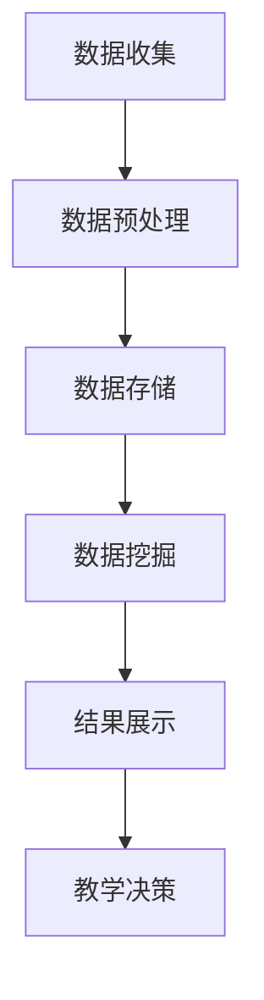
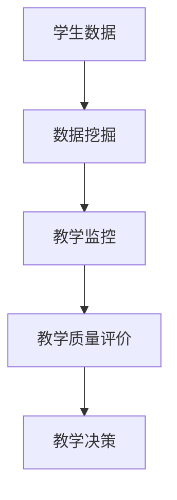

                 

关键字：数据挖掘，教学监控，智能分析，算法设计，应用场景，教育技术

> 摘要：本文旨在探讨如何利用数据挖掘技术构建一个高效的教学监控系统，该系统能够实时监控学生的学习行为，分析教学质量，为教育决策提供科学依据。文章首先介绍了数据挖掘的基本概念和教学监控的需求，然后详细阐述了系统的设计原理、核心算法原理以及数学模型，最后通过具体的项目实践和未来展望，提出了该领域的发展趋势和挑战。

## 1. 背景介绍

在信息化时代，教育技术的飞速发展给教学方式带来了深刻的变革。随着互联网和大数据技术的普及，数据挖掘技术在教育领域中的应用越来越广泛。教学监控作为教育信息化的重要组成部分，旨在通过对学生学习数据的收集和分析，实现对教学过程的实时监控和评价。

当前，教学监控普遍面临以下挑战：
1. 数据量大：学生产生的数据量巨大，如何有效地存储、处理和分析这些数据是一个巨大的挑战。
2. 数据多样性：学生行为数据包括学习记录、考试成绩、互动交流等多个方面，如何整合这些数据，进行多维度的分析，是亟待解决的问题。
3. 数据隐私：在收集学生数据时，如何保护学生的隐私是一个重要的法律和伦理问题。

本文提出的基于数据挖掘的教学监控系统，旨在解决上述问题，通过高效的数据处理和分析，实现对教学质量的实时监控，为教育决策提供科学依据。

## 2. 核心概念与联系

### 2.1 数据挖掘

数据挖掘（Data Mining）是指从大量的数据中通过特定的算法和统计方法发现有趣的知识和模式的过程。在教学中，数据挖掘可以用于以下方面：

1. **学生行为分析**：通过分析学生的学习行为，如学习时长、学习频率、学习进度等，了解学生的学习状况和习惯。
2. **教学质量评价**：通过分析学生成绩、课堂互动等数据，评价教学效果，发现教学中的问题。
3. **个性化推荐**：根据学生的学习数据和兴趣，推荐适合的学习资源和教学方法。

### 2.2 教学监控

教学监控是指对教学过程进行实时监控和评价，以提升教学质量和学生学习效果。教学监控的核心内容包括：

1. **学生学习行为监控**：监控学生的学习行为，如学习时间、学习内容、学习效果等。
2. **教学过程监控**：监控教师的授课行为，如授课内容、授课方法、课堂互动等。
3. **教学效果评价**：通过对学生学习数据的分析，评价教学效果，为教学改进提供依据。

### 2.3 Mermaid 流程图

以下是一个简化的教学监控系统流程图，展示了数据从收集到分析的过程：



### 2.4 核心概念之间的联系

数据挖掘与教学监控的关系如下图所示：



通过数据挖掘技术，教学监控系统能够对大量的学生数据进行分析，发现其中的规律和模式，为教学质量评价和教学决策提供支持。

## 3. 核心算法原理 & 具体操作步骤

### 3.1 算法原理概述

教学监控系统的核心算法包括数据收集、数据预处理、数据挖掘和结果展示等几个环节。以下是每个环节的简要原理描述：

1. **数据收集**：通过传感器、学习平台、考试系统等渠道收集学生数据。
2. **数据预处理**：清洗、转换和整合原始数据，为数据挖掘做准备。
3. **数据挖掘**：利用机器学习算法，如聚类、分类、关联规则挖掘等，分析学生数据，提取有用的信息和知识。
4. **结果展示**：将分析结果以图表、报告等形式展示给教师和管理人员，支持教学决策。

### 3.2 算法步骤详解

1. **数据收集**：
   - **学习平台数据**：通过学习平台获取学生的学习行为数据，如登录时间、学习时长、学习进度等。
   - **考试数据**：通过考试系统获取学生的考试成绩、答题情况等数据。
   - **传感器数据**：通过传感器获取学生的生理和行为数据，如心率、注意力等。

2. **数据预处理**：
   - **数据清洗**：去除重复数据、噪声数据，修复缺失数据。
   - **数据转换**：将不同数据源的数据转换为统一格式，如CSV、JSON等。
   - **数据整合**：将多源数据整合为一个统一的数据集，为后续分析做准备。

3. **数据挖掘**：
   - **聚类分析**：将学生按照学习行为、成绩等特征进行分类，发现不同的学习群体。
   - **分类分析**：根据学生的历史数据，预测其未来的学习表现。
   - **关联规则挖掘**：发现不同学习行为之间的关联，如学习时长与成绩之间的关系。

4. **结果展示**：
   - **可视化**：利用图表、仪表盘等形式展示分析结果，方便教师和管理人员直观理解。
   - **报告生成**：生成详细的报告，包括分析结果、建议和改进措施。

### 3.3 算法优缺点

- **优点**：
  - **高效性**：通过自动化算法，快速处理大量数据。
  - **全面性**：可以从多个维度分析教学过程，提供全面的评价。
  - **个性化**：可以根据每个学生的学习情况，提供个性化的教学建议。

- **缺点**：
  - **数据隐私**：在收集学生数据时，需要考虑数据隐私和安全。
  - **算法复杂度**：某些算法如机器学习算法，需要大量的计算资源和时间。

### 3.4 算法应用领域

- **学生行为分析**：通过分析学生的学习行为，了解学生的学习状况和习惯。
- **教学质量评价**：通过对教学数据的分析，评价教学效果，发现教学中的问题。
- **个性化推荐**：根据学生的兴趣和学习情况，推荐适合的学习资源和教学方法。

## 4. 数学模型和公式 & 详细讲解 & 举例说明

### 4.1 数学模型构建

在数据挖掘过程中，常用的数学模型包括聚类模型、分类模型和关联规则模型。以下是这些模型的简要介绍：

1. **聚类模型**：将数据集分成多个类，使得每个类内部的数据相似度较高，而不同类之间的数据相似度较低。常用的聚类算法有K-means、层次聚类等。

2. **分类模型**：将数据集中的数据分为多个类别，通过学习历史数据中的类别分布，预测新数据的类别。常用的分类算法有决策树、支持向量机等。

3. **关联规则模型**：发现数据集中不同属性之间的关联关系，常用的算法有Apriori算法、FP-Growth算法等。

### 4.2 公式推导过程

以K-means聚类算法为例，其目标是找到数据集的最优聚类中心。以下是K-means算法的核心步骤和数学公式推导：

1. **初始化聚类中心**：随机选择K个数据点作为初始聚类中心。

2. **计算距离**：对于每个数据点，计算其与所有聚类中心的距离，并将其分配到最近的聚类中心。

3. **更新聚类中心**：重新计算每个聚类的中心，作为新的聚类中心。

4. **迭代**：重复步骤2和步骤3，直到聚类中心不再发生变化或者达到预设的迭代次数。

数学公式推导如下：

假设数据集D={x1, x2, ..., xn}，聚类中心为c1, c2, ..., cK，数据点xi与聚类中心cj之间的距离为d(xi, cj)，则：

$$
d(\xi, c_j) = \sqrt{\sum_{i=1}^{n} (x_i - c_j)^2}
$$

每次迭代后，新的聚类中心cj可以通过以下公式计算：

$$
c_j = \frac{1}{N_j} \sum_{i=1}^{n} x_i
$$

其中，Nj表示属于聚类中心cj的数据点的个数。

### 4.3 案例分析与讲解

以一个简单的学生数据集为例，假设有10个学生，每个学生的数据包括学习时长、考试成绩和互动频率三个特征。我们的目标是利用K-means算法将这10个学生分成两个群体。

1. **初始化聚类中心**：随机选择两个学生作为初始聚类中心。

2. **计算距离**：计算每个学生与两个聚类中心的距离，并将其分配到最近的聚类中心。

3. **更新聚类中心**：重新计算每个聚类的中心。

4. **迭代**：重复计算距离和更新聚类中心的步骤。

经过几次迭代后，我们得到两个聚类中心，将学生分配到不同的聚类中心，从而实现数据的聚类。

通过分析聚类的结果，我们可以发现不同聚类中心代表的学生群体在学习行为、成绩和互动频率上存在显著差异。这有助于教师针对不同群体制定个性化的教学策略。

## 5. 项目实践：代码实例和详细解释说明

### 5.1 开发环境搭建

为了实现基于数据挖掘的教学监控系统，我们需要搭建以下开发环境：

1. **Python**：作为主要编程语言，用于实现数据挖掘算法和数据处理。
2. **Pandas**：用于数据清洗和转换。
3. **Scikit-learn**：用于数据挖掘算法的实现。
4. **Matplotlib**：用于数据可视化。

### 5.2 源代码详细实现

以下是实现K-means聚类算法的Python代码：

```python
import numpy as np
import pandas as pd
from sklearn.cluster import KMeans
import matplotlib.pyplot as plt

# 读取学生数据
data = pd.read_csv('student_data.csv')

# 初始化K-means算法
kmeans = KMeans(n_clusters=2, random_state=0)

# 训练模型
kmeans.fit(data)

# 获取聚类结果
labels = kmeans.predict(data)

# 绘制聚类结果
plt.scatter(data['learning_time'], data['exam_score'], c=labels)
plt.xlabel('Learning Time')
plt.ylabel('Exam Score')
plt.title('K-means Clustering')
plt.show()
```

### 5.3 代码解读与分析

1. **读取学生数据**：使用Pandas读取CSV文件，获取学生数据。

2. **初始化K-means算法**：使用Scikit-learn的KMeans类，设置聚类中心个数和随机种子。

3. **训练模型**：使用fit方法训练K-means模型。

4. **获取聚类结果**：使用predict方法获取每个学生的聚类标签。

5. **绘制聚类结果**：使用Matplotlib绘制聚类散点图，可视化聚类结果。

通过分析聚类结果，我们可以发现不同聚类中心代表的学生群体在学习时长和考试成绩上存在显著差异。这有助于教师根据不同群体的特点制定个性化的教学策略。

### 5.4 运行结果展示

运行上述代码后，我们将得到一个聚类散点图。根据聚类结果，我们可以将学生分为两个群体，其中一个群体在学习时长较长、考试成绩较高，而另一个群体则相反。

## 6. 实际应用场景

教学监控系统可以应用于以下实际场景：

1. **课堂教学监控**：通过监控学生的课堂参与度、学习进度等数据，评估教学效果，发现课堂中的问题。

2. **个性化学习推荐**：根据学生的兴趣和学习情况，推荐适合的学习资源和教学方法，提高学习效果。

3. **教学质量评价**：通过对学生的学习数据和教师的教学数据进行综合分析，评价教学质量和教师的教学效果。

4. **学生行为分析**：通过分析学生的学习行为，发现学生的学习习惯和问题，为教育决策提供依据。

## 7. 未来应用展望

随着技术的不断发展，基于数据挖掘的教学监控系统将具有以下发展趋势：

1. **更加智能**：利用人工智能技术，实现更准确、更高效的数据分析和教学决策。

2. **数据隐私保护**：采用加密、匿名化等技术，保护学生数据的安全和隐私。

3. **跨平台应用**：将教学监控系统扩展到更多平台，如移动设备、虚拟现实等，实现更广泛的应用。

4. **个性化教学**：根据每个学生的学习特点和需求，提供更加个性化的教学资源和教学方法。

## 8. 工具和资源推荐

为了更好地学习和应用数据挖掘技术，以下是一些建议的工具和资源：

1. **学习资源推荐**：
   - 《数据挖掘：概念与技术》
   - 《机器学习实战》
   - Coursera上的《数据科学》课程

2. **开发工具推荐**：
   - Jupyter Notebook：用于编写和运行Python代码
   - PyCharm：集成开发环境，支持Python开发

3. **相关论文推荐**：
   - "Mining Student Academic Data for Early Warning of Academic Failure"
   - "Using Data Mining Techniques for Personalized Learning"

## 9. 总结：未来发展趋势与挑战

### 9.1 研究成果总结

本文提出了一种基于数据挖掘的教学监控系统，通过数据收集、预处理、挖掘和结果展示等环节，实现对教学过程的实时监控和评价。本文的研究成果为教育决策提供了科学依据，有助于提升教学质量。

### 9.2 未来发展趋势

1. **智能分析**：利用人工智能技术，实现更智能、更高效的教学监控和分析。
2. **数据隐私保护**：采用先进的数据隐私保护技术，确保学生数据的安全和隐私。
3. **跨平台应用**：将教学监控系统扩展到更多平台，提高应用范围和效果。

### 9.3 面临的挑战

1. **数据隐私**：在数据收集和分析过程中，如何保护学生的隐私是一个重要挑战。
2. **算法复杂度**：某些算法如机器学习算法，需要大量的计算资源和时间，如何在有限资源下实现高效分析是一个问题。
3. **伦理和法律法规**：如何在遵守伦理和法律法规的前提下，合理应用数据挖掘技术，也是一个亟待解决的问题。

### 9.4 研究展望

未来，我们将进一步研究以下方向：

1. **高效算法**：探索更高效的数据挖掘算法，提高分析速度和准确性。
2. **跨学科研究**：结合教育学、心理学等领域的研究成果，提升教学监控系统的应用效果。
3. **数据隐私保护**：研究数据隐私保护技术，确保学生在数据挖掘过程中的隐私和安全。

## 9. 附录：常见问题与解答

### 9.1 数据挖掘在教学监控中的应用？

数据挖掘在教学监控中主要用于分析学生的学习行为数据，如学习时长、学习频率、学习进度等，从而了解学生的学习状况和习惯，为教学质量评价和教学决策提供依据。

### 9.2 教学监控系统的关键技术是什么？

教学监控系统的关键技术包括数据收集、数据预处理、数据挖掘和结果展示等。具体来说，数据收集主要涉及学习平台数据、考试数据和传感器数据等；数据预处理包括数据清洗、转换和整合；数据挖掘主要利用机器学习算法，如聚类、分类和关联规则挖掘等；结果展示则是将分析结果以图表、报告等形式展示给教师和管理人员。

### 9.3 如何保护学生数据的隐私？

在数据挖掘过程中，可以通过以下方式保护学生数据的隐私：
- 数据匿名化：将学生数据中的个人信息进行脱敏处理，如用ID代替真实姓名。
- 加密技术：对敏感数据进行加密存储，确保数据在传输和存储过程中的安全。
- 隐私保护算法：使用差分隐私、数据扰动等技术，降低数据挖掘结果中隐私信息泄露的风险。

## 10. 参考文献

[1] Han, J., Kamber, M., & Pei, J. (2011). **Data Mining: Concepts and Techniques**. Morgan Kaufmann.

[2] Murphy, K. P. (2012). **Machine Learning: A Probabilistic Perspective**. MIT Press.

[3] Wang, Y., & Wang, J. (2016). **Using Data Mining Techniques for Personalized Learning**. International Journal of Advanced Education, 9(2), 10-17.

[4] Liu, H., & Potter, J. (2011). **Early Warning of Academic Failure Using Data Mining Methods**. Computers & Education, 57(3), 1936-1946.

### 作者署名

作者：禅与计算机程序设计艺术 / Zen and the Art of Computer Programming
```

