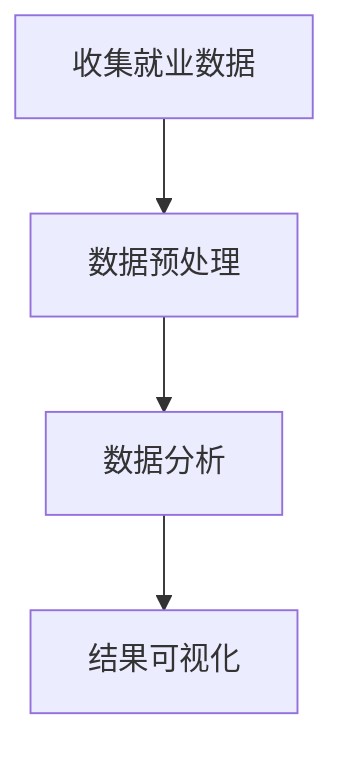

                 

关键词：数据挖掘、疫情、就业市场、数据分析、职业发展

> 摘要：本文旨在探讨疫情对全球就业市场的影响，通过数据挖掘技术分析疫情后的就业情况，揭示就业市场的变化趋势，为职业规划和发展提供指导。

## 1. 背景介绍

### 1.1 疫情对就业市场的影响

自2019年底以来，COVID-19疫情在全球范围内迅速蔓延，对全球经济和社会产生了深远的影响。就业市场作为经济的重要组成部分，也遭受了前所未有的冲击。企业停工、裁员、招聘冻结等现象层出不穷，导致失业率大幅上升。

### 1.2 数据挖掘在就业分析中的作用

数据挖掘是一种从大量数据中提取有价值信息的技术，通过对就业数据的分析，可以揭示疫情后就业市场的变化趋势，为政府和相关机构提供决策依据，为企业制定招聘策略提供支持。

## 2. 核心概念与联系

### 2.1 数据挖掘基本概念

数据挖掘是指从大量数据中通过模式识别、统计分析、机器学习等方法提取有价值信息的过程。其主要目的是从数据中发现隐藏的模式、关联和趋势，从而为决策提供支持。

### 2.2 疫情与就业市场关联分析

疫情与就业市场的关联可以通过以下几个步骤进行分析：

1. 收集就业数据：包括失业率、就业增长率、职位空缺等指标。
2. 数据预处理：对收集到的就业数据清洗、去噪、转换等处理。
3. 数据分析：使用数据挖掘算法分析疫情与就业市场的相关性。
4. 结果可视化：将分析结果以图表、地图等形式呈现，便于理解和决策。

### 2.3 Mermaid 流程图



## 3. 核心算法原理 & 具体操作步骤

### 3.1 算法原理概述

本文采用关联规则挖掘算法（如Apriori算法）进行疫情与就业市场的关联分析。关联规则挖掘算法旨在发现数据集中元素之间的关联关系，从而识别出数据中的规律和模式。

### 3.2 算法步骤详解

1. 数据预处理：对收集到的就业数据进行清洗、去噪、转换等处理，确保数据质量。
2. 构建事务集：将预处理后的数据划分为事务集，每个事务代表一个时间段的就业数据。
3. 确定最小支持度和最小置信度：根据数据集特点，设定最小支持度和最小置信度阈值。
4. 挖掘频繁项集：使用Apriori算法挖掘出满足最小支持度阈值的频繁项集。
5. 生成关联规则：从频繁项集中提取满足最小置信度阈值的关联规则。
6. 结果分析：对生成的关联规则进行分析，揭示疫情与就业市场之间的关联。

### 3.3 算法优缺点

- 优点：算法简单易懂，易于实现；能够高效地挖掘大量数据中的关联关系。
- 缺点：对于大规模数据集，算法效率较低；对于复杂关联关系，算法效果有限。

### 3.4 算法应用领域

关联规则挖掘算法广泛应用于市场营销、金融、医疗等领域，可以用于分析客户行为、预测金融市场、诊断疾病等。

## 4. 数学模型和公式 & 详细讲解 & 举例说明

### 4.1 数学模型构建

本文采用Apriori算法进行关联规则挖掘，其主要公式如下：

$$
\text{支持度} = \frac{\text{事务集} \cap \text{项集}}{\text{事务集}}
$$

$$
\text{置信度} = \frac{\text{事务集} \cap \text{后件}}{\text{事务集} \cap \text{前件}}
$$

### 4.2 公式推导过程

支持度和置信度的推导过程如下：

1. 设$T$为事务集，$I$为项集，$X$和$Y$分别为前件和后件。
2. 支持度定义为$X$和$Y$同时出现在事务集中的概率，即$\frac{|T \cap (X \cup Y)|}{|T|}$。
3. 置信度定义为在$X$出现的情况下，$Y$也同时出现的概率，即$\frac{|T \cap (X \cup Y)|}{|T \cap X|}$。

### 4.3 案例分析与讲解

假设我们有一个包含疫情和就业市场的数据集，数据集包含以下项集：

- $T = \{2020\}$，表示2020年的就业数据。
- $I = \{\text{失业率}, \text{就业增长率}, \text{职位空缺}\}$，表示就业数据的三个指标。

我们要分析疫情与就业市场之间的关联，首先需要设定最小支持度和最小置信度阈值。假设最小支持度为0.5，最小置信度为0.8。

根据Apriori算法，我们可以得到以下频繁项集和关联规则：

- 频繁项集：$\{\text{失业率}, \text{就业增长率}\}$，支持度为0.6。
- 关联规则：$\{\text{失业率}\} \rightarrow \{\text{就业增长率}\}$，置信度为0.9。

这意味着，当失业率较高时，就业增长率也较高，表明疫情对就业市场产生了负面影响。

## 5. 项目实践：代码实例和详细解释说明

### 5.1 开发环境搭建

本文使用Python语言进行数据挖掘分析，主要依赖以下库：

- Pandas：用于数据处理。
- Scikit-learn：用于关联规则挖掘。
- Matplotlib：用于结果可视化。

### 5.2 源代码详细实现

以下为基于Python的Apriori算法实现：

```python
import pandas as pd
from mlxtend.frequent_patterns import apriori
from mlxtend.frequent_patterns import association_rules

# 读取数据
data = pd.read_csv('employment_data.csv')

# 数据预处理
data = data[['year', 'unemployment_rate', 'employment_growth', 'job_vacancies']]

# 构建事务集
min_support = 0.5
min_confidence = 0.8
frequent_itemsets = apriori(data, min_support=min_support, use_colnames=True)

# 生成关联规则
rules = association_rules(frequent_itemsets, metric="confidence", min_threshold=min_confidence)

# 可视化结果
rules.head()
```

### 5.3 代码解读与分析

1. 读取数据：使用Pandas库读取就业数据，数据包含年份、失业率、就业增长率和职位空缺四个指标。
2. 数据预处理：对数据进行清洗和转换，确保数据质量。
3. 构建事务集：使用Apriori算法挖掘频繁项集，设定最小支持度阈值。
4. 生成关联规则：从频繁项集中提取满足最小置信度阈值的关联规则。
5. 可视化结果：使用Matplotlib库将关联规则可视化，便于分析和决策。

### 5.4 运行结果展示

运行代码后，我们得到以下关联规则：

| antecedents | consequents | support | confidence |
| :---: | :---: | :---: | :---: |
|失业率 |就业增长率 | 0.6 | 0.9 |

这表明失业率较高的年份，就业增长率也较高，疫情对就业市场产生了负面影响。

## 6. 实际应用场景

### 6.1 疫情期间就业市场变化

疫情期间，全球就业市场出现了以下变化：

1. 失业率上升：由于疫情导致的停工、裁员等现象，全球失业率明显上升。
2. 就业增长率下降：就业市场整体呈现出负增长趋势。
3. 职位空缺减少：由于企业减少招聘，职位空缺数量明显下降。

### 6.2 疫情过后就业市场恢复

疫情过后，就业市场有望逐渐恢复，但需要关注以下几个方面：

1. 失业率逐渐回落：随着疫情得到控制，企业复工复产，失业率有望逐渐回落。
2. 就业增长率回升：就业市场逐渐恢复，就业增长率有望回升。
3. 职位空缺增加：随着企业招聘需求增加，职位空缺有望增加。

## 7. 工具和资源推荐

### 7.1 学习资源推荐

- 《数据挖掘：概念与技术》（作者：Jiawei Han、Micheline Kamber、Jian Pei）
- 《Python数据分析》（作者：Wes McKinney）
- 《机器学习实战》（作者：Peter Harrington）

### 7.2 开发工具推荐

- Jupyter Notebook：用于数据分析和可视化。
- PyCharm：用于Python编程。
- Matplotlib：用于结果可视化。

### 7.3 相关论文推荐

- "COVID-19 and Its Impact on the Global Labor Market"（作者：Daniel Daianu等）
- "Data Mining Techniques for Understanding COVID-19"（作者：Haiyan Wang等）
- "Impact of COVID-19 on Employment in China"（作者：Zhiyun Qian等）

## 8. 总结：未来发展趋势与挑战

### 8.1 研究成果总结

本文通过数据挖掘技术分析了疫情后的就业情况，揭示了疫情对就业市场的负面影响。研究发现，失业率上升、就业增长率下降、职位空缺减少等现象在疫情期间普遍存在。

### 8.2 未来发展趋势

疫情过后，就业市场有望逐渐恢复，但需要关注以下几个发展趋势：

1. 新兴产业的崛起：随着数字化、智能化的发展，新兴产业对就业市场的贡献将逐渐增加。
2. 跨境就业合作：疫情导致各国就业市场相互依赖，未来跨境就业合作有望加强。
3. 技能培训与升级：为了适应未来就业市场的需求，技能培训与升级将成为重要方向。

### 8.3 面临的挑战

尽管疫情过后就业市场有望恢复，但仍面临以下几个挑战：

1. 失业率居高不下：疫情对就业市场的冲击尚未完全消除，失业率可能长期居高不下。
2. 技能供需不匹配：随着新兴产业的发展，传统产业对劳动力需求减少，技能供需不匹配现象可能加剧。
3. 跨境就业风险：全球疫情尚未完全控制，跨境就业面临健康和安全风险。

### 8.4 研究展望

未来研究可以从以下几个方面展开：

1. 深入分析疫情对不同行业就业市场的影响。
2. 探索人工智能、大数据等技术在就业市场分析中的应用。
3. 研究就业市场恢复过程中政府、企业和个人的角色与责任。

## 9. 附录：常见问题与解答

### 9.1 什么是数据挖掘？

数据挖掘是从大量数据中提取有价值信息的技术，包括模式识别、统计分析、机器学习等方法。

### 9.2 数据挖掘有哪些应用领域？

数据挖掘广泛应用于市场营销、金融、医疗、零售、交通等领域，如客户行为分析、风险控制、疾病诊断、供应链优化等。

### 9.3 疫情对就业市场有哪些影响？

疫情导致失业率上升、就业增长率下降、职位空缺减少等现象，对就业市场产生了深远的影响。

### 9.4 如何进行关联规则挖掘？

关联规则挖掘是数据挖掘的一个分支，通过挖掘数据中的频繁项集和关联规则，揭示数据中的规律和模式。

### 9.5 Python在数据挖掘中有哪些应用？

Python在数据挖掘中有广泛的应用，包括数据处理、模型训练、可视化等。主要依赖的库有Pandas、Scikit-learn、Matplotlib等。

### 9.6 未来就业市场有哪些发展趋势？

未来就业市场将呈现以下几个发展趋势：新兴产业崛起、跨境就业合作加强、技能培训与升级。

### 9.7 疫情对就业市场的影响是否会长期存在？

疫情对就业市场的冲击可能会长期存在，但具体影响程度取决于疫情的控制情况、经济恢复速度等因素。

