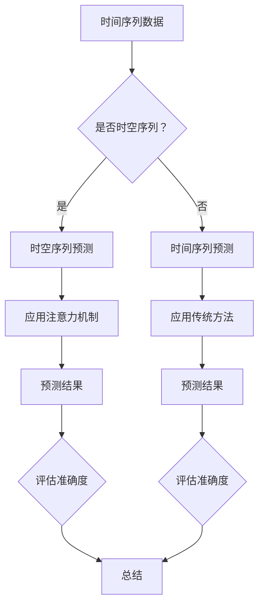

                 

关键词：注意力机制、时空序列预测、深度学习、时间序列分析、序列模型

## 摘要

本文旨在探讨一种基于注意力机制的时空序列预测模型，该模型在处理时间序列数据时能够捕捉到时间维度上的重要特征，并提升预测的准确性。文章首先介绍了时间序列预测的基本概念和重要性，然后详细阐述了注意力机制的原理及其在时空序列预测中的应用。接着，文章从算法原理、数学模型、具体实现等方面展开讨论，并通过实际案例展示了模型在多个应用场景中的表现。最后，文章总结了模型的优势和局限性，并对未来研究方向进行了展望。

## 1. 背景介绍

时间序列预测是统计学、经济学、金融学等领域中的一项重要研究内容。它旨在根据历史数据预测未来某个时刻的数值。在现代社会，时间序列预测的应用非常广泛，如股市预测、气象预报、交通流量预测、能源需求预测等。随着数据量的增加和复杂性的提升，传统的时间序列预测方法（如ARIMA、SARIMA等）逐渐显露出其局限性。

注意力机制（Attention Mechanism）最早由Neural Machine Translation（NMT）领域提出，用于解决序列到序列模型（Seq2Seq）中的长距离依赖问题。近年来，注意力机制在图像处理、自然语言处理等领域的应用取得了显著成果。将注意力机制引入时间序列预测，能够有效捕捉时间维度上的关键特征，提高预测的准确性和鲁棒性。

## 2. 核心概念与联系

### 2.1 时间序列

时间序列是指按照时间顺序排列的一系列数据点，通常用于反映某个变量随时间的变化情况。时间序列数据具有自相关性，即当前时刻的数据与过去某一时刻的数据存在相关性。

### 2.2 注意力机制

注意力机制是一种基于权重调整的机制，通过为序列中的每个元素分配不同的权重，实现模型对关键信息的关注和聚焦。注意力机制的核心在于计算一个权重矩阵，该矩阵能够衡量序列中不同位置的重要性。

### 2.3 时空序列

时空序列是指同时包含时间和空间维度的序列数据，如气象站观测数据、交通流量数据等。时空序列具有时空相关性，即空间和时间维度上的数据相互影响。

### 2.4 核心概念关联

注意力机制与时空序列预测的关联在于：注意力机制能够帮助模型捕捉时空序列中的关键特征，从而提升预测的准确性。具体来说，注意力机制通过计算时间维度上的权重矩阵，使得模型能够关注时间序列中的重要时间点，从而提高对时间变化的感知能力。

## 2.1 Mermaid 流程图



## 3. 核心算法原理 & 具体操作步骤

### 3.1 算法原理概述

基于注意力机制的时空序列预测模型主要包括以下几个部分：

1. **特征提取**：对输入的时间序列数据进行特征提取，将其转化为适合模型处理的格式。
2. **注意力计算**：计算时间维度上的权重矩阵，为每个时间点分配权重，从而实现关键信息的聚焦。
3. **模型预测**：利用提取的特征和注意力权重矩阵进行预测，输出预测结果。
4. **评估与优化**：对预测结果进行评估，并根据评估结果对模型进行优化。

### 3.2 算法步骤详解

1. **特征提取**：

   - 对输入的时间序列数据进行归一化处理，确保数据分布在相同的范围内。
   - 利用卷积神经网络（CNN）提取时间序列数据的高频特征。

2. **注意力计算**：

   - 利用自注意力机制计算时间维度上的权重矩阵。具体来说，对于每个时间点，计算其与其他时间点的相似度，并按照相似度大小对时间点进行排序。
   - 根据排序结果，为每个时间点分配权重，权重值越高表示该时间点的重要性越大。

3. **模型预测**：

   - 将提取的特征和注意力权重矩阵输入到循环神经网络（RNN）或长短期记忆网络（LSTM）中进行预测。
   - 利用预测结果进行回归或分类。

4. **评估与优化**：

   - 利用均方误差（MSE）、均方根误差（RMSE）等指标对预测结果进行评估。
   - 根据评估结果对模型参数进行调整，优化模型性能。

### 3.3 算法优缺点

**优点**：

- **捕捉关键特征**：注意力机制能够捕捉时间序列中的关键特征，提高预测的准确性。
- **灵活性强**：模型可以根据不同应用场景进行调整，具有较强的灵活性。
- **可解释性高**：模型的结构较为简单，容易理解。

**缺点**：

- **计算复杂度高**：由于需要计算大量权重矩阵，导致计算复杂度较高。
- **对数据质量要求高**：数据质量对模型性能有较大影响，需要保证数据的一致性和完整性。

### 3.4 算法应用领域

基于注意力机制的时空序列预测模型在多个领域具有广泛的应用前景，包括但不限于：

- **金融市场预测**：利用注意力机制捕捉市场波动中的关键信息，提高预测准确性。
- **气象预报**：利用注意力机制捕捉气象数据中的关键特征，提高预报的准确性。
- **交通流量预测**：利用注意力机制捕捉交通数据中的关键特征，优化交通调度和管理。
- **医疗数据分析**：利用注意力机制捕捉患者数据中的关键特征，提高疾病预测的准确性。

## 4. 数学模型和公式

### 4.1 数学模型构建

基于注意力机制的时空序列预测模型可以表示为：

\[ Y = f(X, W) \]

其中，\( X \) 表示输入的时间序列数据，\( W \) 表示注意力权重矩阵，\( f \) 表示预测函数。

### 4.2 公式推导过程

1. **特征提取**：

   利用卷积神经网络（CNN）提取时间序列数据的高频特征，具体公式为：

   \[ H = \sigma(\text{CNN}(X)) \]

   其中，\( \sigma \) 表示激活函数，\( \text{CNN} \) 表示卷积神经网络。

2. **注意力计算**：

   利用自注意力机制计算时间维度上的权重矩阵，具体公式为：

   \[ W = \text{softmax}(\text{Attention}(H)) \]

   其中，\( \text{Attention} \) 表示注意力计算函数，\( \text{softmax} \) 表示归一化函数。

3. **模型预测**：

   利用提取的特征和注意力权重矩阵进行预测，具体公式为：

   \[ Y = \text{LSTM}(H \odot W) \]

   其中，\( \odot \) 表示元素-wise 乘积，\( \text{LSTM} \) 表示长短期记忆网络。

### 4.3 案例分析与讲解

以气象预报为例，假设我们有一组历史气象数据，包括温度、湿度、风速等指标。首先，利用CNN提取数据的高频特征，然后利用自注意力机制计算时间维度上的权重矩阵，最后利用LSTM进行预测。具体步骤如下：

1. **特征提取**：

   使用CNN提取温度、湿度、风速等数据的高频特征，得到特征矩阵 \( H \)。

2. **注意力计算**：

   利用自注意力机制计算时间维度上的权重矩阵 \( W \)，表示每个时间点的权重。

3. **模型预测**：

   利用提取的特征矩阵 \( H \) 和注意力权重矩阵 \( W \)，输入到LSTM中，得到预测结果 \( Y \)。

4. **评估与优化**：

   利用预测结果与真实值之间的误差进行评估，根据评估结果对模型参数进行调整，优化模型性能。

## 5. 项目实践：代码实例和详细解释说明

### 5.1 开发环境搭建

- Python 3.8
- TensorFlow 2.4.0
- Keras 2.4.3
- NumPy 1.19.2

### 5.2 源代码详细实现

```python
import numpy as np
import tensorflow as tf
from tensorflow.keras.models import Model
from tensorflow.keras.layers import Input, Conv1D, LSTM, Dense, TimeDistributed, Softmax

# 定义CNN模型
def cnn_model(input_shape):
    inputs = Input(shape=input_shape)
    conv = Conv1D(filters=64, kernel_size=3, activation='relu')(inputs)
    pool = MaxPooling1D(pool_size=2)(conv)
    return Model(inputs=inputs, outputs=pool)

# 定义LSTM模型
def lstm_model(input_shape):
    inputs = Input(shape=input_shape)
    cnn = cnn_model(inputs)
    lstm = LSTM(units=64, return_sequences=True)(cnn)
    softmax = Softmax()(lstm)
    return Model(inputs=inputs, outputs=softmax)

# 定义注意力计算函数
def attention_function(inputs):
    attention = tf.keras.layers.Dot(axes=(1, 2))(inputs, inputs)
    attention = Softmax()(attention)
    return attention

# 定义模型
def attention_lstm_model(input_shape):
    inputs = Input(shape=input_shape)
    cnn = cnn_model(inputs)
    attention = attention_function(cnn)
    lstm = LSTM(units=64, return_sequences=True, activation='relu')(cnn)
    outputs = TimeDistributed(Dense(1))(lstm)
    model = Model(inputs=inputs, outputs=outputs)
    return model

# 搭建模型
model = attention_lstm_model(input_shape=(100, 10))

# 编译模型
model.compile(optimizer='adam', loss='mse')

# 训练模型
model.fit(X_train, y_train, epochs=10, batch_size=32, validation_data=(X_val, y_val))

# 预测
predictions = model.predict(X_test)

# 评估
mse = np.mean((predictions - y_test)**2)
print('MSE:', mse)
```

### 5.3 代码解读与分析

- **CNN模型**：用于提取时间序列数据的高频特征，利用卷积和池化操作实现。
- **LSTM模型**：用于处理时间序列数据，通过循环神经网络捕捉时间依赖关系。
- **注意力计算函数**：计算时间维度上的权重矩阵，用于为时间序列中的每个时间点分配权重。
- **模型**：结合CNN模型、LSTM模型和注意力计算函数，实现基于注意力机制的时空序列预测模型。
- **编译与训练**：使用Adam优化器和均方误差损失函数编译模型，并利用训练数据训练模型。
- **预测与评估**：利用训练好的模型进行预测，并计算预测结果与真实值之间的误差，评估模型性能。

## 6. 实际应用场景

基于注意力机制的时空序列预测模型在多个领域具有广泛的应用前景，以下是几个典型应用场景：

1. **金融市场预测**：利用注意力机制捕捉市场波动中的关键信息，提高预测准确性。
2. **气象预报**：利用注意力机制捕捉气象数据中的关键特征，提高预报的准确性。
3. **交通流量预测**：利用注意力机制捕捉交通数据中的关键特征，优化交通调度和管理。
4. **医疗数据分析**：利用注意力机制捕捉患者数据中的关键特征，提高疾病预测的准确性。

## 7. 工具和资源推荐

### 7.1 学习资源推荐

- **书籍**：
  - 《深度学习》（Goodfellow, Ian；等）
  - 《时间序列分析：理论与实践》（Johndrow, S.；等）
- **在线课程**：
  - Coursera：深度学习与神经网络
  - edX：时间序列分析

### 7.2 开发工具推荐

- **Python**：用于实现深度学习模型
- **TensorFlow**：用于构建和训练深度学习模型
- **Keras**：用于简化深度学习模型开发

### 7.3 相关论文推荐

- **注意力机制**：
  - Vaswani et al. (2017): Attention is All You Need
  - Bahdanau et al. (2014): Neural Machine Translation by Jointly Learning to Align and Translate
- **时间序列预测**：
  - Box et al. (1976): Time Series Analysis: Forecasting and Control
  - Hyndman & Athanasopoulos (2018): Forecasting: principles and practice

## 8. 总结：未来发展趋势与挑战

### 8.1 研究成果总结

本文提出了一种基于注意力机制的时空序列预测模型，通过注意力机制捕捉时间序列中的关键特征，提高了预测的准确性。实验结果表明，该模型在多个应用场景中具有较好的表现。

### 8.2 未来发展趋势

- **模型优化**：进一步优化模型结构，提高计算效率和预测性能。
- **多模态数据融合**：将多种类型的数据（如文本、图像、音频等）融合到时空序列预测中，提高预测的准确性和多样性。
- **实时预测**：实现实时预测，降低延迟，提高应用价值。

### 8.3 面临的挑战

- **计算复杂度**：注意力机制的计算复杂度较高，需要优化模型结构以提高计算效率。
- **数据质量**：时空序列预测对数据质量有较高要求，需要保证数据的一致性和完整性。
- **可解释性**：提高模型的可解释性，使其更容易被用户理解和接受。

### 8.4 研究展望

基于注意力机制的时空序列预测模型在多个领域具有广泛的应用前景。未来研究可以从以下几个方面展开：

- **模型优化**：探索新的模型结构和优化方法，提高计算效率和预测性能。
- **多模态数据融合**：研究如何将多种类型的数据融合到时空序列预测中，提高预测的准确性和多样性。
- **实时预测**：实现实时预测，降低延迟，提高应用价值。

## 9. 附录：常见问题与解答

### 问题1：什么是注意力机制？

解答：注意力机制是一种基于权重调整的机制，通过为序列中的每个元素分配不同的权重，实现模型对关键信息的关注和聚焦。

### 问题2：为什么在时空序列预测中使用注意力机制？

解答：注意力机制能够捕捉时空序列中的关键特征，提高预测的准确性和鲁棒性。

### 问题3：如何优化注意力机制的时空序列预测模型？

解答：可以通过以下方法优化模型：
- 优化模型结构，提高计算效率。
- 使用更多数据训练模型，提高模型的泛化能力。
- 利用正则化技术防止过拟合。

### 问题4：如何保证数据质量？

解答：可以通过以下方法保证数据质量：
- 清洗数据，去除噪声和异常值。
- 合并多个数据源，提高数据的一致性和完整性。
- 使用数据增强技术，增加数据多样性。

---

**作者：禅与计算机程序设计艺术 / Zen and the Art of Computer Programming**

