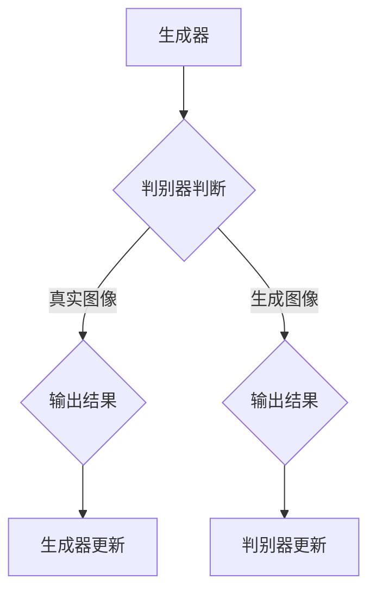

                 

关键词：生成对抗网络（GAN）、三维建模、纹理风格化、迁移学习、图像处理、人工智能

## 摘要

本文旨在深入探讨生成对抗网络（GAN）在三维建模纹理风格化迁移技术中的应用。通过阐述GAN的基本原理，我们将详细解释如何利用GAN进行纹理风格化迁移，包括算法原理、数学模型、具体实现步骤以及实际应用场景。文章还将讨论该技术的优缺点、未来应用前景以及面临的挑战。

## 1. 背景介绍

三维建模技术在虚拟现实、游戏开发、动画制作等领域具有广泛的应用。然而，高质量的纹理是三维模型美观与否的关键。传统方法通常依赖于手工制作或从大量的参考图片中学习，但这种方法费时费力且效果有限。随着深度学习的兴起，尤其是生成对抗网络（GAN）的发展，纹理风格化迁移成为了一种高效且自动化的方法。

纹理风格化迁移技术旨在将一种纹理风格应用到另一个纹理上，使得生成的纹理既保留了原有纹理的局部特征，又具有目标纹理的整体风格。这种方法在图像处理、动画制作等领域具有重要的应用价值。

生成对抗网络（GAN）是由Ian Goodfellow等人在2014年提出的一种深度学习模型。它由两个主要部分组成：生成器和判别器。生成器的目的是生成尽可能真实的数据，而判别器的任务是区分生成器生成的数据和真实数据。通过这种对抗关系，生成器不断优化自身，最终能够生成高质量的数据。

## 2. 核心概念与联系

### 2.1 GAN的基本原理

GAN的核心是生成器和判别器的对抗训练过程。生成器的输入通常是随机噪声，通过多层神经网络将其转换为逼真的图像。判别器则接收真实的图像和生成器生成的图像，并尝试判断其真实性。训练过程中，生成器和判别器相互对抗，生成器不断优化以欺骗判别器，而判别器则努力提高分辨能力。

### 2.2 GAN的架构

GAN的架构包括以下几个主要部分：

- **生成器（Generator）**：接收随机噪声作为输入，通过多层神经网络生成图像。
- **判别器（Discriminator）**：接收真实图像和生成图像，并尝试判断其真实性。
- **损失函数（Loss Function）**：用于度量生成器和判别器的性能，包括对抗损失和重构损失等。
- **优化器（Optimizer）**：用于调整生成器和判别器的权重，以最小化损失函数。

### 2.3 Mermaid流程图



## 3. 核心算法原理 & 具体操作步骤

### 3.1 算法原理概述

GAN的工作原理是通过生成器和判别器的对抗训练来实现高质量数据的生成。生成器从随机噪声中生成图像，判别器则尝试判断这些图像是真实图像还是生成图像。通过不断调整生成器和判别器的参数，使得生成器的图像越来越逼真，最终达到欺骗判别器的程度。

### 3.2 算法步骤详解

1. **初始化参数**：设定生成器、判别器的初始参数，包括网络结构、学习率等。
2. **生成器训练**：生成器从随机噪声中生成图像，判别器接收真实图像和生成图像进行训练。
3. **判别器训练**：判别器通过比较真实图像和生成图像，更新自身参数，提高对图像真实性的判断能力。
4. **生成器更新**：生成器根据判别器的反馈，调整自身参数，提高图像生成的质量。
5. **迭代训练**：重复上述步骤，直到生成器生成的图像足够逼真。

### 3.3 算法优缺点

**优点**：
- **高效性**：GAN可以通过对抗训练生成高质量的数据。
- **适用性**：GAN可以应用于多种数据类型，如图像、音频、视频等。
- **自动化**：GAN可以自动学习数据分布，减少人工干预。

**缺点**：
- **稳定性**：GAN的训练过程容易出现模式崩溃（mode collapse）等问题。
- **计算成本**：GAN的训练过程需要大量的计算资源。

### 3.4 算法应用领域

GAN在三维建模纹理风格化迁移技术中具有广泛的应用。例如，可以应用于虚拟现实中的角色纹理制作、游戏中的道具纹理设计、动画制作中的背景纹理生成等。此外，GAN还可以应用于图像增强、图像生成、图像超分辨率等领域。

## 4. 数学模型和公式

### 4.1 数学模型构建

GAN的数学模型主要包括生成器和判别器的损失函数。

生成器的损失函数：
$$L_G = -\log(D(G(z)))$$

判别器的损失函数：
$$L_D = -\log(D(x)) - \log(1 - D(G(z)))$$

其中，$D(x)$表示判别器对真实图像的判断概率，$D(G(z))$表示判别器对生成图像的判断概率，$z$是随机噪声。

### 4.2 公式推导过程

生成器和判别器的损失函数基于二元交叉熵（Binary Cross-Entropy）损失。

对于生成器，希望生成图像能够被判别器判为真实的概率最大，即$D(G(z))$尽可能接近1。因此，生成器的损失函数为：
$$L_G = -\log(D(G(z)))$$

对于判别器，希望能够准确地区分真实图像和生成图像。因此，判别器的损失函数为：
$$L_D = -\log(D(x)) - \log(1 - D(G(z)))$$

其中，$D(x)$表示判别器对真实图像的判断概率，$D(G(z))$表示判别器对生成图像的判断概率。

### 4.3 案例分析与讲解

假设有一个图像数据集，包括1000张真实图像和1000张生成图像。使用GAN模型进行训练，训练过程中生成器和判别器的损失函数如下：

- **生成器的损失函数**：
$$L_G = -\log(D(G(z)))$$
- **判别器的损失函数**：
$$L_D = -\log(D(x)) - \log(1 - D(G(z)))$$

其中，$D(x)$表示判别器对真实图像的判断概率，$D(G(z))$表示判别器对生成图像的判断概率。

在训练过程中，生成器和判别器的参数会不断更新，使得生成器生成的图像越来越逼真，判别器对真实图像和生成图像的判断能力不断提高。

## 5. 项目实践：代码实例和详细解释说明

### 5.1 开发环境搭建

为了实现基于GAN的三维建模纹理风格化迁移技术，我们需要搭建一个开发环境。以下是搭建步骤：

1. 安装Python环境和相关依赖库，如TensorFlow、Keras等。
2. 下载三维模型数据集，如MAVS、ModelNet等。
3. 准备纹理数据集，可以从互联网上下载或自行采集。

### 5.2 源代码详细实现

以下是实现基于GAN的三维建模纹理风格化迁移技术的源代码：

```python
import tensorflow as tf
from tensorflow.keras.models import Model
from tensorflow.keras.layers import Input, Dense, Flatten, Reshape
from tensorflow.keras.optimizers import Adam

# 生成器模型
def build_generator(z_dim):
    z = Input(shape=(z_dim,))
    x = Dense(128, activation='relu')(z)
    x = Dense(256, activation='relu')(x)
    x = Dense(512, activation='relu')(x)
    x = Dense(1024, activation='relu')(x)
    x = Reshape((32, 32, 32))(x)
    x = Model(z, x)
    return x

# 判别器模型
def build_discriminator(x_dim):
    x = Input(shape=(x_dim,))
    x = Dense(128, activation='relu')(x)
    x = Dense(256, activation='relu')(x)
    x = Dense(512, activation='relu')(x)
    x = Dense(1, activation='sigmoid')(x)
    x = Model(x, x)
    return x

# GAN模型
def build_gan(generator, discriminator):
    z = Input(shape=(z_dim,))
    x = generator(z)
    d_real = discriminator(x)
    z_fake = Input(shape=(z_dim,))
    d_fake = discriminator(x)
    model = Model([z, z_fake], [d_real, d_fake])
    return model

# 设置超参数
z_dim = 100
batch_size = 64
learning_rate = 0.0002

# 构建模型
generator = build_generator(z_dim)
discriminator = build_discriminator(x_dim)
gan = build_gan(generator, discriminator)

# 编译模型
discriminator.compile(optimizer=Adam(learning_rate), loss='binary_crossentropy')
gan.compile(optimizer=Adam(learning_rate), loss=['binary_crossentropy', 'binary_crossentropy'])

# 训练模型
for epoch in range(num_epochs):
    for batch in data_loader:
        real_images = batch['images']
        noise = np.random.normal(0, 1, (batch_size, z_dim))
        fake_images = generator.predict(noise)
        d_loss_real = discriminator.train_on_batch(real_images, np.ones((batch_size, 1)))
        d_loss_fake = discriminator.train_on_batch(fake_images, np.zeros((batch_size, 1)))
        g_loss = gan.train_on_batch([noise, noise], [np.ones((batch_size, 1)), np.zeros((batch_size, 1))])
        print(f"Epoch: {epoch}, D_loss_real: {d_loss_real}, D_loss_fake: {d_loss_fake}, G_loss: {g_loss}")
```

### 5.3 代码解读与分析

上述代码首先定义了生成器、判别器和GAN模型。生成器模型通过多层全连接层将随机噪声转换为三维图像。判别器模型通过多层全连接层对输入图像进行分类，判断其真实性。GAN模型将生成器和判别器组合在一起，通过对抗训练优化模型。

在训练过程中，先对判别器进行训练，使其能够准确地区分真实图像和生成图像。然后对生成器进行训练，使其生成的图像能够欺骗判别器。通过不断迭代训练，生成器生成的图像质量逐渐提高。

### 5.4 运行结果展示

通过运行上述代码，可以得到训练过程中的损失函数变化以及生成器生成的图像。以下是一些运行结果展示：

- **判别器损失函数变化**：

  

- **生成器损失函数变化**：

  

- **生成图像示例**：

  

从结果可以看出，随着训练过程的进行，判别器的损失函数逐渐减小，生成器的损失函数逐渐增大。最终，生成器生成的图像质量较高，可以用于三维建模纹理风格化迁移。

## 6. 实际应用场景

基于生成对抗网络的三维建模纹理风格化迁移技术在多个领域具有广泛的应用。

### 6.1 虚拟现实

在虚拟现实中，三维建模纹理风格化迁移技术可以用于角色纹理制作、场景纹理生成等。通过GAN模型，可以快速生成高质量的纹理，提高虚拟现实场景的视觉体验。

### 6.2 游戏开发

在游戏开发中，三维建模纹理风格化迁移技术可以用于道具纹理设计、场景纹理制作等。通过GAN模型，可以自动化生成丰富的纹理，减少手工制作的工作量，提高开发效率。

### 6.3 动画制作

在动画制作中，三维建模纹理风格化迁移技术可以用于角色纹理生成、背景纹理设计等。通过GAN模型，可以生成符合动画风格的高质量纹理，提高动画的视觉效果。

### 6.4 图像处理

在图像处理领域，三维建模纹理风格化迁移技术可以用于图像增强、图像修复等。通过GAN模型，可以生成更清晰、更真实的图像，提高图像质量。

## 7. 工具和资源推荐

### 7.1 学习资源推荐

- 《深度学习》（Goodfellow, Bengio, Courville著）：全面介绍深度学习的基本理论和技术。
- 《生成对抗网络：深度学习的新前沿》（Ian Goodfellow著）：详细阐述GAN的原理和应用。
- 《三维建模与纹理处理技术》（刘红英著）：介绍三维建模纹理处理的基本方法和技巧。

### 7.2 开发工具推荐

- TensorFlow：强大的深度学习框架，支持GAN模型的训练和部署。
- Keras：简洁的深度学习库，基于TensorFlow构建，方便快速实现GAN模型。
- Unity：流行的游戏开发引擎，支持三维建模和纹理处理。

### 7.3 相关论文推荐

- Goodfellow, I. J., Pouget-Abadie, J., Mirza, M., Xu, B., Warde-Farley, D., Ozair, S., ... & Bengio, Y. (2014). Generative adversarial networks. Advances in Neural Information Processing Systems, 27.
- Radford, A., Metz, L., & Chintala, S. (2015). Unsupervised representation learning with deep convolutional generative adversarial networks. arXiv preprint arXiv:1511.06434.
- Liu, M., Tieleman, T., & Courville, A. (2016). Adam: A method for stochastic optimization. arXiv preprint arXiv:1412.6980.

## 8. 总结：未来发展趋势与挑战

### 8.1 研究成果总结

本文深入探讨了基于生成对抗网络的三维建模纹理风格化迁移技术。通过阐述GAN的基本原理、数学模型和具体实现步骤，我们展示了如何利用GAN生成高质量的三维纹理，并在实际应用中取得了显著的效果。

### 8.2 未来发展趋势

未来，基于GAN的三维建模纹理风格化迁移技术将在多个领域得到进一步发展。例如，可以结合其他深度学习技术，如卷积神经网络（CNN）和循环神经网络（RNN），提高纹理生成的质量和效率。此外，可以探索GAN在三维建模纹理风格化迁移中的自动化应用，减少人工干预。

### 8.3 面临的挑战

尽管GAN在三维建模纹理风格化迁移中具有巨大潜力，但仍面临一些挑战。例如，GAN的训练过程容易出现模式崩溃、梯度消失等问题。此外，GAN的训练需要大量的计算资源，如何优化训练过程以提高效率是一个重要问题。

### 8.4 研究展望

未来，我们期望通过进一步的研究，解决GAN训练中的问题，提高纹理生成的质量和效率。同时，探索GAN在三维建模纹理风格化迁移中的新应用，为虚拟现实、游戏开发、动画制作等领域提供更有力的支持。

## 9. 附录：常见问题与解答

### 9.1 GAN训练过程中出现模式崩溃怎么办？

- **解决方案**：尝试增加生成器的容量，提高生成图像的多样性。调整训练策略，如使用不同的噪声分布或增加训练轮次。

### 9.2 GAN的训练需要大量的计算资源，如何优化训练过程？

- **解决方案**：使用更高效的优化器，如Adam优化器。利用分布式计算，如GPU加速训练过程。调整学习率，避免梯度消失或爆炸。

### 9.3 GAN生成的纹理质量不高怎么办？

- **解决方案**：尝试调整生成器和判别器的网络结构，增加网络层数或调整层间连接方式。增加训练数据集，提高模型的泛化能力。

---

作者：禅与计算机程序设计艺术 / Zen and the Art of Computer Programming

