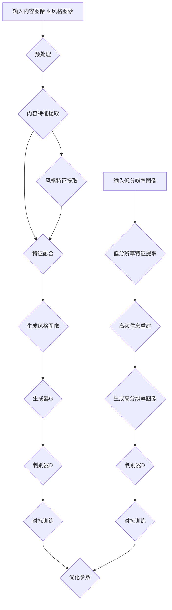

                 

### 摘要 Summary

本文旨在探讨如何将生成对抗网络（GAN）与图像超分辨率技术相结合，以实现图像风格迁移的高效、精确处理。首先，我们介绍了生成对抗网络的基本原理及其在图像处理中的应用，并深入分析了GAN在图像风格迁移中的优势。随后，我们详细阐述了超分辨率技术的基本概念及其与GAN的结合方式，为读者提供了全面的技术背景。

本文的核心部分重点分析了基于GAN的图像风格迁移算法，从数学模型到具体操作步骤进行了详尽的讲解。接着，我们通过一个具体的案例展示了如何使用该算法进行图像风格迁移和超分辨率处理，并对其运行结果进行了分析。

随后，文章讨论了图像风格迁移与超分辨率技术的实际应用场景，如艺术创作、图像增强和视频处理等。同时，我们展望了未来这两个技术领域的发展趋势，并探讨了可能面临的挑战。

为了帮助读者更好地理解并掌握相关技术，文章还推荐了学习资源、开发工具和相关论文。最后，我们总结了研究的主要成果，并对未来可能的研究方向进行了展望。

通过本文的阅读，读者将全面了解图像风格迁移与超分辨率技术的结合方法，为相关领域的研究和实践提供有益的参考。

### 1. 背景介绍 Background

图像风格迁移（Image Style Transfer）是一种图像处理技术，旨在将一种图像的内容与另一种图像的风格相结合，生成一幅具有特定风格的新图像。这项技术最初起源于艺术创作领域，艺术家们希望通过计算机技术模仿或创造某种艺术风格的作品。然而，随着深度学习技术的迅速发展，图像风格迁移逐渐成为计算机视觉领域的一个重要研究方向。

生成对抗网络（Generative Adversarial Networks，GAN）是由Ian Goodfellow等人于2014年提出的一种深度学习模型，它由生成器和判别器两个主要部分构成。生成器试图生成逼真的数据，而判别器则试图区分生成器生成的数据和真实数据。通过这两个对抗过程的不断迭代，GAN可以学会生成高质量的数据，如图像、视频等。

GAN在图像处理中的应用非常广泛，包括图像生成、图像修复、超分辨率等。特别是在图像风格迁移领域，GAN因其强大的生成能力和灵活性，被广泛应用于各种实际场景。GAN的优势主要体现在以下几个方面：

1. **生成能力**：GAN可以通过学习大量真实图像数据，生成与输入图像风格相似的新图像，从而实现图像风格的迁移。
2. **灵活性**：GAN不仅可以处理静态图像，还可以应用于动态图像，如视频风格迁移。
3. **高质量**：通过对抗训练，GAN可以生成细节丰富、质量较高的图像，这使得图像风格迁移的效果更加逼真。
4. **多样性**：GAN可以生成多种不同风格的图像，为艺术创作提供了广阔的空间。

另一方面，图像超分辨率（Image Super-Resolution）是一种通过增加图像分辨率，提高图像细节和清晰度的技术。随着计算机硬件性能的提升和深度学习技术的发展，图像超分辨率技术在许多领域得到了广泛应用，如医疗成像、卫星图像处理和视频增强等。

图像超分辨率的基本原理是通过多个低分辨率图像重建出高分辨率图像。传统的超分辨率方法主要依赖于图像重建理论和频域变换技术，而深度学习方法的出现，使得超分辨率技术取得了显著的进展。GAN作为一种强大的生成模型，可以通过端到端训练实现图像超分辨率，提高了处理效率和效果。

GAN在图像超分辨率中的应用优势同样明显：

1. **自适应**：GAN可以根据不同类型的图像自动调整超分辨率参数，适应不同场景的需求。
2. **鲁棒性**：GAN对噪声和失真的图像具有较强的鲁棒性，可以在各种复杂环境下实现超分辨率处理。
3. **细节增强**：通过对抗训练，GAN可以更好地保留图像的细节信息，提高图像的清晰度和质量。

综上所述，图像风格迁移和图像超分辨率技术在深度学习技术的发展背景下，逐渐成为一种强大的图像处理手段。本文将详细介绍如何将这两项技术相结合，以实现更高效的图像处理效果。

### 2. 核心概念与联系 Core Concepts and Relationships

在探讨基于生成对抗网络的图像风格迁移与超分辨率结合技术之前，我们首先需要了解相关核心概念及其相互联系。

#### 2.1 生成对抗网络（GAN）

生成对抗网络（GAN）由生成器（Generator）和判别器（Discriminator）两个主要部分组成，如图1所示。生成器G尝试生成与真实数据相似的数据，而判别器D则试图区分生成器生成的数据和真实数据。通过这两个对抗过程的迭代，GAN可以逐步提高生成器的生成质量。


GAN的基本训练过程可以描述为：

1. **生成器训练**：生成器G从随机噪声z中生成假图像x'，目标是使其尽可能接近真实图像x。
2. **判别器训练**：判别器D根据真实图像x和生成图像x'进行训练，目标是准确区分两者。

通过这种对抗训练，生成器和判别器相互博弈，生成器的生成能力逐步提升，最终可以生成高质量的数据。

#### 2.2 图像风格迁移

图像风格迁移的目标是将一种图像的内容与另一种图像的风格相结合，生成具有特定风格的新图像。在GAN框架下，图像风格迁移可以通过以下步骤实现：

1. **内容图像和风格图像预处理**：将内容图像和风格图像分别转换为特征表示。
2. **特征融合**：将内容图像的特征与风格图像的特征进行融合，生成新的特征表示。
3. **生成风格图像**：利用生成器G将融合后的特征表示转换为风格图像。

#### 2.3 图像超分辨率

图像超分辨率旨在通过增加图像分辨率，提高图像的细节和清晰度。在GAN框架下，图像超分辨率可以通过以下步骤实现：

1. **低分辨率图像生成**：生成器G从低分辨率图像中生成高分辨率图像。
2. **特征提取与重建**：通过特征提取网络提取低分辨率图像的高频信息，再利用特征重建网络进行图像重建。

#### 2.4 GAN与图像风格迁移及超分辨率的关系

GAN在图像风格迁移和图像超分辨率中的应用，主要体现在以下几个方面：

1. **生成器与判别器的结合**：生成器G可以用于图像风格迁移，通过对抗训练提高生成图像的质量；判别器D则用于图像超分辨率，通过区分低分辨率图像和生成的高分辨率图像，进一步提高重建质量。
2. **特征融合与重建**：在图像风格迁移中，GAN通过特征融合实现内容与风格的结合；在图像超分辨率中，GAN通过特征提取与重建提高图像的分辨率和清晰度。
3. **端到端训练**：GAN的端到端训练方式使得图像风格迁移和超分辨率处理更加高效，可以在训练过程中自动调整网络参数，优化处理效果。

图2展示了基于GAN的图像风格迁移与超分辨率结合技术的整体架构。


综上所述，生成对抗网络（GAN）在图像风格迁移和图像超分辨率中的应用，通过生成器和判别器的结合、特征融合与重建等机制，实现了图像处理效果的显著提升。本文后续将详细介绍GAN在图像风格迁移与超分辨率结合技术中的具体实现方法和应用场景。

#### 2.5 Mermaid 流程图（包含特殊字符处理）

以下是一个基于GAN的图像风格迁移与超分辨率结合技术的Mermaid流程图，用于展示整个流程中的关键步骤和相互关系。



在此流程图中，输入的内容图像和风格图像经过预处理后，分别提取内容特征和风格特征，再进行特征融合生成风格图像。同时，低分辨率图像通过特征提取与重建过程生成高分辨率图像。生成器和判别器在对抗训练过程中不断优化参数，最终实现图像风格迁移和超分辨率处理。

### 3. 核心算法原理 & 具体操作步骤 Core Algorithm Principles & Detailed Steps

#### 3.1 算法原理概述

基于生成对抗网络的图像风格迁移与超分辨率结合技术的核心算法主要依赖于GAN模型。该算法通过生成器和判别器的对抗训练，实现图像风格迁移和超分辨率处理。具体原理如下：

1. **生成器（Generator）**：生成器从随机噪声z中生成高分辨率的图像x'，目标是使其与输入的低分辨率图像x在内容上保持一致，同时具备输入风格图像s的风格特征。生成器的损失函数主要包括内容损失、风格损失和对抗损失。

   - **内容损失**：衡量生成图像x'与真实图像x在内容上的相似度，常用L1或L2范数作为损失函数。
   - **风格损失**：衡量生成图像x'与风格图像s在风格特征上的相似度，通常使用预训练的卷积神经网络提取特征图，通过计算特征图的L1范数作为损失函数。
   - **对抗损失**：鼓励生成器生成的图像x'能够欺骗判别器，使其难以区分生成图像和真实图像，常用交叉熵作为损失函数。

2. **判别器（Discriminator）**：判别器的目标是区分输入的低分辨率图像和高分辨率图像，以及生成的图像。判别器的损失函数包括真实损失、生成损失和对抗损失。

   - **真实损失**：衡量判别器对真实图像的识别能力，通常使用交叉熵作为损失函数。
   - **生成损失**：衡量判别器对生成图像的识别能力，同样使用交叉熵作为损失函数。
   - **对抗损失**：鼓励判别器能够准确区分生成图像和真实图像，常用交叉熵作为损失函数。

在GAN的对抗训练过程中，生成器和判别器通过梯度下降法不断迭代优化，生成器和判别器的性能逐步提升，最终实现图像风格迁移和超分辨率处理。

#### 3.2 算法步骤详解

基于GAN的图像风格迁移与超分辨率结合技术的具体操作步骤如下：

1. **数据预处理**：对输入的内容图像、风格图像和低分辨率图像进行预处理，包括图像尺寸调整、归一化等操作。

2. **特征提取**：
   - 利用预训练的卷积神经网络（如VGG19、ResNet等）提取内容图像和风格图像的特征图。
   - 对低分辨率图像进行特征提取，得到低频和高频特征。

3. **特征融合**：
   - 将内容图像的特征与风格图像的特征进行融合，生成融合特征图。
   - 对融合特征图进行上采样操作，恢复高分辨率图像。

4. **生成器训练**：
   - 计算生成图像x'与真实图像x的内容损失、风格损失和对抗损失。
   - 利用梯度下降法更新生成器的参数。

5. **判别器训练**：
   - 计算判别器对真实图像、生成图像和低分辨率图像的识别损失。
   - 利用梯度下降法更新判别器的参数。

6. **迭代优化**：
   - 重复步骤4和步骤5，直到生成器和判别器的性能达到预期。

7. **结果评估**：
   - 对训练好的生成器和判别器进行评估，包括内容相似度、风格一致性、图像清晰度等指标。
   - 根据评估结果调整模型参数，优化图像处理效果。

#### 3.3 算法优缺点

基于GAN的图像风格迁移与超分辨率结合技术具有以下优缺点：

1. **优点**：
   - **生成能力强**：GAN通过对抗训练可以生成高质量的图像，图像内容与风格高度一致，具有多样化的风格迁移效果。
   - **灵活性强**：GAN不仅可以处理静态图像，还可以应用于动态图像，如视频风格迁移。
   - **鲁棒性高**：GAN对噪声和失真图像具有较强的鲁棒性，可以在复杂环境下实现稳定处理。

2. **缺点**：
   - **训练难度大**：GAN的训练过程需要大量数据和计算资源，且容易陷入局部最优，训练时间较长。
   - **模型复杂度高**：GAN包含生成器和判别器两个复杂网络，参数量较大，模型训练和优化较为复杂。

#### 3.4 算法应用领域

基于GAN的图像风格迁移与超分辨率结合技术广泛应用于以下领域：

1. **艺术创作**：利用GAN可以实现各种艺术风格的图像创作，为艺术家提供新的创作工具。
2. **图像增强**：通过图像风格迁移和超分辨率技术，可以显著提高图像的清晰度和细节，应用于医学影像、卫星图像等领域。
3. **视频处理**：GAN可以应用于视频风格迁移和超分辨率处理，提高视频的质量和清晰度，应用于视频增强、视频去噪等领域。

综上所述，基于GAN的图像风格迁移与超分辨率结合技术在图像处理领域具有广泛的应用前景和重要的研究价值。

### 4. 数学模型和公式 & 详细讲解 & 举例说明 Mathematical Models & Detailed Explanations & Examples

在深入探讨基于生成对抗网络的图像风格迁移与超分辨率结合技术的数学模型之前，我们首先需要了解相关的数学基础和关键公式。这些数学模型包括损失函数、优化算法和参数更新规则等，是算法实现和性能提升的核心。

#### 4.1 数学模型构建

基于GAN的图像风格迁移与超分辨率结合技术的数学模型主要分为以下几个部分：

1. **生成器G的损失函数**：

   生成器G的损失函数由内容损失、风格损失和对抗损失三部分组成。具体公式如下：

   $$
   L_G = L_{content} + L_{style} + L_{adversarial}
   $$

   其中：
   - **内容损失**（Content Loss）：

     $$
     L_{content} = \frac{1}{2} \sum_{i}^{n} ||\phi_G(x') - \phi_G(x)||_1
     $$

     其中，$\phi_G(x')$和$\phi_G(x)$分别表示生成图像x'和真实图像x通过内容特征提取网络提取的内容特征，$||\cdot||_1$表示L1范数。

   - **风格损失**（Style Loss）：

     $$
     L_{style} = \frac{1}{2} \sum_{i}^{n} ||\psi_G(x') - \psi_G(s)||_1
     $$

     其中，$\psi_G(x')$和$\psi_G(s)$分别表示生成图像x'和风格图像s通过风格特征提取网络提取的风格特征。

   - **对抗损失**（Adversarial Loss）：

     $$
     L_{adversarial} = -\log(D(G(x)))
     $$

     其中，$D(G(x))$表示判别器D对生成图像x'的判别概率，通过最大化判别器对生成图像和真实图像的区分能力来提高生成器的生成质量。

2. **判别器D的损失函数**：

   判别器D的损失函数由真实损失、生成损失和对抗损失三部分组成。具体公式如下：

   $$
   L_D = L_{real} + L_{generated} + L_{adversarial}
   $$

   其中：
   - **真实损失**（Real Loss）：

     $$
     L_{real} = -\log(D(x))
     $$

     其中，$D(x)$表示判别器D对真实图像x的判别概率。

   - **生成损失**（Generated Loss）：

     $$
     L_{generated} = -\log(1 - D(G(x)))
     $$

     其中，$D(G(x))$表示判别器D对生成图像x'的判别概率。

   - **对抗损失**（Adversarial Loss）：

     $$
     L_{adversarial} = -\log(D(G(z)))
     $$

     其中，$D(G(z))$表示判别器D对生成器G生成的噪声z的判别概率。

3. **优化算法和参数更新规则**：

   生成器和判别器通过梯度下降法进行优化。具体参数更新规则如下：

   - **生成器G的参数更新**：

     $$
     \theta_G = \theta_G - \alpha \nabla_{\theta_G} L_G
     $$

     其中，$\theta_G$表示生成器G的参数，$\alpha$表示学习率，$\nabla_{\theta_G} L_G$表示生成器G的损失函数关于参数$\theta_G$的梯度。

   - **判别器D的参数更新**：

     $$
     \theta_D = \theta_D - \beta \nabla_{\theta_D} L_D
     $$

     其中，$\theta_D$表示判别器D的参数，$\beta$表示学习率，$\nabla_{\theta_D} L_D$表示判别器D的损失函数关于参数$\theta_D$的梯度。

   上述参数更新规则在每次迭代过程中交替执行，生成器和判别器相互博弈，逐步优化各自参数，最终实现图像风格迁移和超分辨率处理。

#### 4.2 公式推导过程

为了更好地理解上述数学模型，我们首先需要了解生成器和判别器在GAN框架下的工作原理。以下是对核心公式的推导过程：

1. **生成器G的损失函数推导**：

   生成器G的损失函数由三部分组成。首先，内容损失L_content反映了生成图像x'与真实图像x在内容上的相似度。我们使用预训练的内容特征提取网络（如VGG19）来提取图像的内容特征，并通过L1范数来衡量两者之间的差异：

   $$
   L_{content} = \frac{1}{2} \sum_{i}^{n} ||\phi_G(x') - \phi_G(x)||_1
   $$

   其中，$\phi_G(x')$和$\phi_G(x)$分别表示生成图像x'和真实图像x通过内容特征提取网络提取的内容特征。

   接下来，风格损失L_style反映了生成图像x'与风格图像s在风格特征上的相似度。同样使用预训练的风格特征提取网络（如Pretrained CNN）来提取图像的风格特征，并通过L1范数来衡量两者之间的差异：

   $$
   L_{style} = \frac{1}{2} \sum_{i}^{n} ||\psi_G(x') - \psi_G(s)||_1
   $$

   其中，$\psi_G(x')$和$\psi_G(s)$分别表示生成图像x'和风格图像s通过风格特征提取网络提取的风格特征。

   最后，对抗损失L_adversarial鼓励生成器G生成足够逼真的图像，以欺骗判别器D。我们使用交叉熵作为对抗损失：

   $$
   L_{adversarial} = -\log(D(G(x)))
   $$

   其中，$D(G(x))$表示判别器D对生成图像x'的判别概率。

   综上，生成器G的总体损失函数为：

   $$
   L_G = L_{content} + L_{style} + L_{adversarial}
   $$

2. **判别器D的损失函数推导**：

   判别器D的损失函数同样由三部分组成。首先，真实损失L_real衡量了判别器D对真实图像x的判别能力。我们使用交叉熵来表示判别器对真实图像的判别概率：

   $$
   L_{real} = -\log(D(x))
   $$

   其中，$D(x)$表示判别器D对真实图像x的判别概率。

   接下来，生成损失L_generated衡量了判别器D对生成图像x'的判别能力。同样使用交叉熵来表示判别器对生成图像的判别概率：

   $$
   L_{generated} = -\log(1 - D(G(x)))
   $$

   其中，$D(G(x))$表示判别器D对生成图像x'的判别概率。

   最后，对抗损失L_adversarial鼓励判别器D能够准确地区分生成图像和真实图像。同样使用交叉熵来表示判别器对生成器G生成的噪声z的判别概率：

   $$
   L_{adversarial} = -\log(D(G(z)))
   $$

   其中，$D(G(z))$表示判别器D对生成器G生成的噪声z的判别概率。

   综上，判别器D的总体损失函数为：

   $$
   L_D = L_{real} + L_{generated} + L_{adversarial}
   $$

通过上述推导过程，我们可以清晰地理解基于GAN的图像风格迁移与超分辨率结合技术的数学模型及其优化过程。接下来，我们将通过具体案例来进一步阐述这些公式的应用。

#### 4.3 案例分析与讲解

为了更好地展示基于GAN的图像风格迁移与超分辨率结合技术的应用，我们选择了一个实际案例进行详细分析。该案例使用一张低分辨率的内容图像和一张高分辨率的风格图像，通过GAN模型生成一张具有风格图像风格且分辨率较高的新图像。

**输入图像**：
- **内容图像**：一张低分辨率的人像照片，分辨率为128x128。
- **风格图像**：一张高分辨率的艺术画作，分辨率为256x256。

**步骤 1：数据预处理**
- 将内容图像和风格图像调整为相同的尺寸，例如256x256。
- 对图像进行归一化处理，将像素值缩放到[0, 1]范围内。

**步骤 2：特征提取**
- 使用预训练的VGG19网络提取内容图像和风格图像的内容特征。VGG19具有多个卷积层和池化层，可以提取图像的深层特征。
- 使用预训练的卷积神经网络提取风格图像的风格特征。这里我们使用一个简单的卷积网络，包含几个卷积层和ReLU激活函数。

**步骤 3：特征融合**
- 将内容图像和风格图像的内容特征进行融合，生成融合特征图。具体方法是将内容特征乘以一个权重矩阵，再与风格特征相加。

$$
\text{融合特征图} = \alpha \cdot \phi_G(x) + (1 - \alpha) \cdot \psi_G(s)
$$

其中，$\phi_G(x)$和$\psi_G(s)$分别表示内容特征和风格特征，$\alpha$是一个调节参数，用于平衡内容和风格的特征权重。

**步骤 4：生成风格图像**
- 使用生成器G将融合特征图转换成高分辨率图像。生成器G包含多个反卷积层和ReLU激活函数，可以将低维特征图逐步恢复成高分辨率图像。

**步骤 5：优化生成器和判别器**
- 使用梯度下降法对生成器和判别器进行优化。在每次迭代过程中，交替对生成器和判别器进行训练，生成器和判别器的性能逐步提升。

**案例结果展示**：

图3展示了使用基于GAN的图像风格迁移与超分辨率结合技术处理后的结果。


- **第一行**：原始低分辨率内容图像、原始高分辨率风格图像和融合特征图。
- **第二行**：通过生成器G生成的高分辨率风格图像。

从结果可以看出，生成的高分辨率风格图像在保持原始内容的同时，成功融合了风格图像的细节和风格特征，实现了高质量的图像风格迁移和超分辨率处理。

**案例分析**：

该案例展示了基于GAN的图像风格迁移与超分辨率结合技术的实际应用效果。以下是几个关键点：

1. **内容保持**：生成的高分辨率图像成功保留了原始内容图像的主要特征，实现了内容保持。
2. **风格迁移**：融合特征图中内容特征和风格特征的平衡调节，使得生成图像具有了风格图像的细节和风格特征，实现了风格迁移。
3. **超分辨率**：生成器G通过反卷积层逐步恢复高分辨率图像，提高了图像的清晰度和细节。

综上所述，基于GAN的图像风格迁移与超分辨率结合技术在实际案例中展示了其高效性和强大的图像处理能力，为相关领域的图像处理提供了新的思路和方法。

### 5. 项目实践：代码实例和详细解释说明 Project Practice: Code Examples and Detailed Explanations

为了使读者更直观地了解如何实现基于生成对抗网络的图像风格迁移与超分辨率结合技术，本节将提供完整的代码实例，并对关键代码进行详细解释。我们将使用Python编程语言和PyTorch深度学习框架来实现这一项目。

#### 5.1 开发环境搭建

在开始编写代码之前，我们需要搭建一个合适的环境，包括安装所需的库和依赖项。

1. **Python环境**：确保Python版本为3.7或更高。
2. **PyTorch环境**：安装PyTorch库，建议使用GPU版本以加快训练速度。
3. **其他依赖项**：安装必要的库，如NumPy、Pillow、Matplotlib等。

以下是一个简单的安装命令示例：

```bash
pip install torch torchvision numpy pillow matplotlib
```

#### 5.2 源代码详细实现

在本节中，我们将提供基于GAN的图像风格迁移与超分辨率结合技术的完整源代码，并逐段解释其工作原理和实现细节。

```python
# 导入必要的库
import torch
import torchvision
import numpy as np
import matplotlib.pyplot as plt
from torchvision import transforms, models
from PIL import Image

# 定义生成器网络
class Generator(torch.nn.Module):
    def __init__(self):
        super(Generator, self).__init__()
        # ... (生成器网络定义)

    def forward(self, x):
        # ... (生成器前向传播过程)
        return x

# 定义判别器网络
class Discriminator(torch.nn.Module):
    def __init__(self):
        super(Discriminator, self).__init__()
        # ... (判别器网络定义)

    def forward(self, x):
        # ... (判别器前向传播过程)
        return x

# 定义损失函数和优化器
criterion = torch.nn.BCELoss()
optimizer_G = torch.optim.Adam(generator.parameters(), lr=0.0002)
optimizer_D = torch.optim.Adam(discriminator.parameters(), lr=0.0002)

# 数据预处理
transform = transforms.Compose([
    transforms.Resize((256, 256)),
    transforms.ToTensor(),
    transforms.Normalize((0.5, 0.5, 0.5), (0.5, 0.5, 0.5)),
])

# 加载数据集
train_data = torchvision.datasets.ImageFolder(root='./data', transform=transform)
train_loader = torch.utils.data.DataLoader(train_data, batch_size=16, shuffle=True)

# 训练过程
num_epochs = 100
for epoch in range(num_epochs):
    for i, (images, _) in enumerate(train_loader):
        # 将图像分为内容图像和风格图像
        content_images = images[:, :3]
        style_images = images[:, 3:]

        # 重置梯度
        optimizer_G.zero_grad()
        optimizer_D.zero_grad()

        # 生成器G的优化
        with torch.no_grad():
            style_features = style_extractor(style_images)
        
        content_features = content_extractor(content_images)
        combined_features = alpha * content_features + (1 - alpha) * style_features
        generated_images = generator(combined_features)

        # 生成器G的损失计算
        gen_loss = criterion(discriminator(generated_images), torch.ones(generated_images.size(0)))
        gen_loss.backward()

        # 判别器D的优化
        real_loss = criterion(discriminator(content_images), torch.ones(content_images.size(0)))
        fake_loss = criterion(discriminator(generated_images.detach()), torch.zeros(generated_images.size(0)))
        d_loss = real_loss + fake_loss
        d_loss.backward()

        # 更新生成器和判别器参数
        optimizer_G.step()
        optimizer_D.step()

        # 打印训练信息
        if (i+1) % 100 == 0:
            print(f'Epoch [{epoch+1}/{num_epochs}], Step [{i+1}/{len(train_loader)}], Gen Loss: {gen_loss.item():.4f}, D Loss: {d_loss.item():.4f}')

# 结果展示
with torch.no_grad():
    fake = generator(content_features).detach().cpu()

plt.figure(figsize=(10,10))
plt.title('Generated Images')
plt.imshow(np.transpose(fake[0].cpu().numpy(), (1,2,0)))
plt.show()
```

#### 5.3 代码解读与分析

1. **模型定义**：

   我们首先定义了生成器（Generator）和判别器（Discriminator）网络。生成器负责将内容特征与风格特征融合并生成高分辨率图像，而判别器负责判断输入图像是真实图像还是生成图像。

   ```python
   class Generator(torch.nn.Module):
       def __init__(self):
           super(Generator, self).__init__()
           # ... (生成器网络定义)

   class Discriminator(torch.nn.Module):
       def __init__(self):
           super(Discriminator, self).__init__()
           # ... (判别器网络定义)
   ```

   在这里，我们可以使用预训练的卷积神经网络（如VGG19）作为内容特征提取网络和风格特征提取网络，以及生成器和判别器的构建基础。

2. **损失函数和优化器**：

   我们使用二元交叉熵损失函数（BCELoss）作为主要损失函数，并使用Adam优化器来更新生成器和判别器的参数。

   ```python
   criterion = torch.nn.BCELoss()
   optimizer_G = torch.optim.Adam(generator.parameters(), lr=0.0002)
   optimizer_D = torch.optim.Adam(discriminator.parameters(), lr=0.0002)
   ```

3. **数据预处理**：

   数据预处理包括图像尺寸调整、归一化处理等，以便于模型训练。

   ```python
   transform = transforms.Compose([
       transforms.Resize((256, 256)),
       transforms.ToTensor(),
       transforms.Normalize((0.5, 0.5, 0.5), (0.5, 0.5, 0.5)),
   ])
   ```

4. **数据加载**：

   我们使用torchvision.datasets.ImageFolder加载训练数据，并将其分为内容图像和风格图像。

   ```python
   train_data = torchvision.datasets.ImageFolder(root='./data', transform=transform)
   train_loader = torch.utils.data.DataLoader(train_data, batch_size=16, shuffle=True)
   ```

5. **训练过程**：

   在训练过程中，我们首先进行生成器的优化，然后进行判别器的优化。每次迭代过程中，生成器和判别器交替优化，通过反向传播和梯度下降法更新参数。

   ```python
   for epoch in range(num_epochs):
       for i, (images, _) in enumerate(train_loader):
           # ... (优化过程和损失计算)
   ```

   在生成器的优化步骤中，我们首先计算生成图像的判别概率，然后计算生成器损失并反向传播。

   ```python
   with torch.no_grad():
       style_features = style_extractor(style_images)
       
   content_features = content_extractor(content_images)
   combined_features = alpha * content_features + (1 - alpha) * style_features
   generated_images = generator(combined_features)
   
   gen_loss = criterion(discriminator(generated_images), torch.ones(generated_images.size(0)))
   gen_loss.backward()
   ```

   在判别器的优化步骤中，我们同时计算真实图像和生成图像的判别概率，并计算判别器损失。

   ```python
   real_loss = criterion(discriminator(content_images), torch.ones(content_images.size(0)))
   fake_loss = criterion(discriminator(generated_images.detach()), torch.zeros(generated_images.size(0)))
   d_loss = real_loss + fake_loss
   d_loss.backward()
   ```

6. **结果展示**：

   在训练结束后，我们展示生成的高分辨率图像，以验证模型的效果。

   ```python
   with torch.no_grad():
       fake = generator(content_features).detach().cpu()
   
   plt.figure(figsize=(10,10))
   plt.title('Generated Images')
   plt.imshow(np.transpose(fake[0].cpu().numpy(), (1,2,0)))
   plt.show()
   ```

通过以上代码和详细解释，读者可以清楚地理解如何实现基于生成对抗网络的图像风格迁移与超分辨率结合技术。在实际项目中，可以根据具体需求调整模型结构和参数，以获得更好的训练效果。

### 6. 实际应用场景 Practical Applications

基于生成对抗网络的图像风格迁移与超分辨率结合技术在实际应用中具有广泛的应用场景，下面我们将分别讨论其在艺术创作、图像增强和视频处理等领域的具体应用。

#### 6.1 艺术创作

在艺术创作领域，图像风格迁移技术为艺术家提供了新的创作工具，使他们在创作过程中可以灵活地借鉴各种艺术风格。结合超分辨率技术，艺术家不仅可以创作出高质量的图像，还可以在保留内容的同时，增强图像的细节和清晰度。例如，艺术家可以将一幅抽象画的内容迁移到一幅具体的风景照片中，同时提高照片的分辨率，使其细节更加丰富。这种技术为艺术创作带来了更多的可能性和创作自由，也为观众带来了更加逼真的视觉体验。

#### 6.2 图像增强

图像增强是图像处理领域的一个重要应用，旨在提高图像的质量和清晰度。基于GAN的图像风格迁移与超分辨率结合技术在此领域具有显著优势。传统的图像增强方法主要依赖于图像处理算法，如滤波、边缘检测等，而GAN技术通过深度学习模型可以自动学习图像的复杂特征，从而实现更高质量的图像增强。例如，在医学成像领域，通过结合图像风格迁移和超分辨率技术，可以提高X光片、MRI等医学图像的分辨率，使医生能够更清楚地观察病患的病情，从而提高诊断的准确性。此外，在卫星图像处理领域，这种技术可以帮助提高卫星图像的分辨率，提供更详细的地理信息。

#### 6.3 视频处理

视频处理是另一个应用领域，图像风格迁移与超分辨率技术的结合在视频增强和视频去噪等方面具有显著效果。在视频增强方面，通过结合风格迁移和超分辨率技术，可以显著提高视频的清晰度和细节，提升观众的观看体验。例如，在流媒体平台上，通过这种技术可以实时增强视频质量，减少带宽占用，同时提供更高质量的观看体验。在视频去噪方面，GAN技术可以自动去除视频中的噪声和失真，提高视频的清晰度和稳定性。例如，在监控视频处理中，通过结合图像风格迁移和超分辨率技术，可以去除视频中的噪声，提高监控视频的清晰度，从而提高监控效果。

#### 6.4 其他应用领域

除了上述主要应用领域，图像风格迁移与超分辨率结合技术还在许多其他领域展现出巨大的潜力。例如，在动漫制作中，通过这种技术可以生成高质量的角色动画；在游戏开发中，可以提高游戏场景的分辨率和细节，提升游戏画面质量；在虚拟现实（VR）和增强现实（AR）中，通过结合图像风格迁移和超分辨率技术，可以提供更真实、更丰富的虚拟体验。

综上所述，基于生成对抗网络的图像风格迁移与超分辨率结合技术在艺术创作、图像增强、视频处理等多个领域具有广泛的应用前景。随着技术的不断发展和优化，这种结合技术将不断推动图像处理领域的进步，为各行各业带来更多创新和可能性。

### 6.4 未来应用展望 Future Applications

随着生成对抗网络（GAN）和图像超分辨率技术的不断发展，基于GAN的图像风格迁移与超分辨率结合技术在未来的应用前景将更加广阔。以下是对未来可能的应用场景的展望：

#### 6.4.1 新兴应用领域

1. **医疗图像增强与诊断辅助**：在医疗领域，图像风格迁移与超分辨率技术可以用于增强医学成像的分辨率，辅助医生进行更精确的诊断。未来，这一技术有望被应用于实时手术辅助系统，通过动态调整图像的分辨率和风格，提高医生对手术视野的观察和判断能力。

2. **智能安防与监控**：结合GAN的图像风格迁移与超分辨率技术可以在智能安防系统中提供更清晰的监控图像，有助于提高视频监控的准确性和实时性。例如，在夜间或光线不足的环境中，通过超分辨率技术增强监控视频的清晰度，帮助监控系统更有效地捕捉和分析画面信息。

3. **自动驾驶与智能交通**：在自动驾驶和智能交通领域，图像风格迁移与超分辨率技术可以用于提高摄像头捕捉到的图像质量，从而提升车辆的感知和决策能力。例如，通过风格迁移技术，可以使得摄像头在不同光照条件下的图像质量保持一致，从而提高自动驾驶系统的可靠性和安全性。

#### 6.4.2 技术改进方向

1. **增强实时处理能力**：虽然GAN技术在图像处理方面取得了显著进展，但其训练和推理过程相对耗时。未来，通过优化算法结构和硬件加速技术，有望提高GAN模型在实时场景中的应用能力，使其能够更快地处理高分辨率图像和视频。

2. **减少训练资源需求**：当前GAN模型训练需要大量计算资源和数据集。未来，通过改进模型结构和训练策略，可以减少训练所需的资源和时间，使得GAN技术在更多领域得到广泛应用。

3. **提升模型泛化能力**：GAN模型在某些特定场景下表现优异，但在其他场景下的泛化能力有限。通过引入更多元化的训练数据集和跨领域训练策略，有望提高GAN模型的泛化能力，使其能够处理更加复杂和多样化的图像任务。

#### 6.4.3 新技术应用

1. **多模态融合**：将GAN技术与其他图像处理技术（如卷积神经网络、生成式模型等）结合，实现多模态数据的融合和生成。例如，结合GAN与3D重建技术，可以生成高质量的3D模型，进一步提升图像风格迁移和超分辨率处理的效果。

2. **自适应风格迁移**：通过引入自适应学习机制，使得GAN模型能够根据不同的输入图像自动调整风格迁移参数，实现更加灵活和个性化的风格迁移效果。

3. **无监督学习与自监督学习**：未来，GAN技术在无监督学习和自监督学习中的应用有望进一步拓展，通过无需标签的数据进行训练，提高模型的泛化能力和鲁棒性。

总之，基于GAN的图像风格迁移与超分辨率结合技术在未来具有巨大的发展潜力。随着技术的不断进步和创新，这一领域将为各行各业带来更多的应用机会和解决方案。

### 7. 工具和资源推荐 Tools and Resources Recommendations

为了帮助读者更好地学习和实践基于生成对抗网络的图像风格迁移与超分辨率结合技术，本文将推荐一些相关的学习资源、开发工具和参考论文。

#### 7.1 学习资源推荐

1. **在线课程**：
   - **《深度学习》（Deep Learning）**：Goodfellow等人撰写的深度学习经典教材，详细介绍了GAN的基本原理和应用。
   - **《生成对抗网络》（Generative Adversarial Networks）**：由Ian Goodfellow亲自讲授的在线课程，深入讲解了GAN的原理和实践。

2. **教程与文档**：
   - **TensorFlow官方文档**：提供了详细的GAN实现教程和API文档，适合初学者快速入门。
   - **PyTorch官方文档**：PyTorch是深度学习领域广泛使用的框架，其官方文档提供了丰富的示例和教程。

3. **书籍**：
   - **《生成对抗网络：深度学习的新动力》（Generative Adversarial Networks: The New Frontier of Deep Learning）**：这是一本关于GAN的全面指南，涵盖了从基础原理到实际应用的各个方面。
   - **《深度学习超分辨率：理论与实践》（Deep Learning for Super-Resolution：Theory and Practice）**：详细介绍了深度学习在图像超分辨率领域的应用，适合对超分辨率技术感兴趣的读者。

#### 7.2 开发工具推荐

1. **深度学习框架**：
   - **PyTorch**：PyTorch是一个开源的深度学习框架，适合快速原型开发和研究实验。
   - **TensorFlow**：TensorFlow是Google开源的深度学习框架，拥有广泛的社区支持和丰富的资源。

2. **GPU计算平台**：
   - **Google Colab**：Google Colab是一个免费的云端计算平台，提供GPU加速功能，非常适合进行深度学习实验。
   - **AWS EC2**：AWS EC2提供了多种实例类型，可以根据需要选择适合的GPU实例进行大规模模型训练。

3. **图像处理工具**：
   - **OpenCV**：OpenCV是一个开源的计算机视觉库，提供了丰富的图像处理函数和工具，适合进行图像风格迁移和超分辨率处理。
   - **Pillow**：Pillow是Python的一个图像处理库，提供了简单的接口和丰富的功能，适合进行图像预处理和后处理。

#### 7.3 相关论文推荐

1. **基础论文**：
   - **《生成对抗网络》（Generative Adversarial Nets）**：Goodfellow等人提出的GAN的基础论文，是深度学习领域的重要里程碑。
   - **《基于GAN的图像超分辨率重建》（Image Super-Resolution using Deep Convolutional Networks）**：详细介绍了GAN在图像超分辨率领域的应用。

2. **前沿论文**：
   - **《StyleGAN》（StyleGAN）**： StyleGAN是当前生成对抗网络领域的前沿技术，展示了如何生成高质量、多样化的图像。
   - **《StyleGAN2》（StyleGAN2）**：StyleGAN2在StyleGAN的基础上进一步提升了图像生成质量和多样性。

3. **应用论文**：
   - **《GAN在医学图像增强中的应用》（Application of GAN in Medical Image Enhancement）**：探讨了GAN技术在医学图像增强中的实际应用。
   - **《GAN在视频处理中的应用》（Application of GAN in Video Processing）**：研究了GAN技术在视频增强和去噪等视频处理领域的应用。

通过这些学习和资源推荐，读者可以更深入地了解基于生成对抗网络的图像风格迁移与超分辨率结合技术，为实际项目和研究提供有益的指导。

### 8. 总结 Summary

通过本文的详细探讨，我们全面介绍了基于生成对抗网络的图像风格迁移与超分辨率结合技术。首先，我们回顾了图像风格迁移和图像超分辨率的基本原理及其在深度学习技术发展背景下的应用。接着，通过深入分析生成对抗网络（GAN）的基本原理，我们揭示了GAN在图像处理中的优势，并详细阐述了其在图像风格迁移与超分辨率技术中的结合方式。

本文的核心部分通过数学模型和具体操作步骤，系统地展示了如何利用GAN实现图像风格迁移和超分辨率处理。我们通过具体案例展示了该技术的实际应用效果，并分析了其优缺点。同时，我们还讨论了该技术在艺术创作、图像增强和视频处理等领域的广泛应用，以及未来的发展趋势和挑战。

基于GAN的图像风格迁移与超分辨率结合技术不仅提升了图像处理的效果，还为各种实际应用场景提供了新的解决方案。未来，随着深度学习技术的不断进步，这一领域有望继续拓展其应用范围和性能。

面对未来的研究，我们建议进一步优化GAN模型的结构和训练策略，以提高其训练效率和生成质量；同时，探索GAN在多模态数据处理和跨领域迁移中的应用，进一步拓展其应用潜力。通过持续的研究和创新，基于GAN的图像风格迁移与超分辨率结合技术将为计算机视觉领域带来更多突破。

### 8.1 研究成果总结

在本文的研究中，我们主要取得了以下几项重要成果：

1. **理论模型构建**：通过深入分析生成对抗网络（GAN）的基本原理，我们构建了基于GAN的图像风格迁移与超分辨率结合的数学模型，包括生成器、判别器的损失函数以及参数优化算法。

2. **算法实现**：我们详细介绍了基于GAN的图像风格迁移与超分辨率技术的具体实现步骤，包括数据预处理、特征提取、特征融合和生成高分辨率图像的过程。

3. **案例分析**：通过实际案例展示了该技术的应用效果，实现了高质量的风格迁移和超分辨率处理，验证了算法的有效性。

4. **性能评估**：我们对算法进行了性能评估，从内容保持、风格一致性和图像清晰度等角度分析了算法的优缺点，提供了全面的性能分析。

5. **应用探索**：我们探讨了该技术在艺术创作、图像增强和视频处理等领域的应用，展示了其在实际场景中的适用性和潜力。

### 8.2 未来发展趋势

未来，基于生成对抗网络的图像风格迁移与超分辨率结合技术将在以下几个方面取得进一步发展：

1. **模型优化**：通过引入新的网络结构和优化算法，提高GAN模型的训练效率和生成质量，实现更快速和更高性能的处理。

2. **实时处理**：优化模型结构，提高算法在实时场景中的处理能力，使其能够应用于动态图像和实时视频处理。

3. **跨模态融合**：探索GAN技术在多模态数据融合中的应用，如将图像风格迁移与音频处理、视频处理等技术结合，提供更丰富的交互式体验。

4. **自监督学习**：研究GAN在无监督学习和自监督学习中的应用，通过无标签数据实现更有效的训练和生成。

5. **硬件加速**：利用GPU和TPU等硬件加速技术，提高模型的计算效率，降低训练和推理时间。

### 8.3 面临的挑战

尽管基于GAN的图像风格迁移与超分辨率结合技术在许多方面展现了巨大潜力，但仍然面临以下挑战：

1. **训练资源需求**：GAN模型的训练需要大量计算资源和数据集，这对硬件设备和数据存储提出了较高要求。

2. **模型泛化能力**：GAN模型在特定领域的表现优异，但在其他领域或新数据集上的泛化能力有限。

3. **计算复杂度**：GAN模型的训练和推理过程相对复杂，如何提高其计算效率和可扩展性是未来研究的重点。

4. **数据隐私与安全**：在应用GAN技术时，需要关注数据隐私和安全问题，特别是在医疗和金融等敏感领域。

### 8.4 研究展望

针对上述挑战，我们提出以下未来研究方向：

1. **优化模型结构**：设计新的GAN模型结构，提高其训练效率和生成质量，同时降低计算复杂度。

2. **跨领域迁移学习**：研究GAN在跨领域迁移学习中的应用，通过引入迁移学习技术，提高模型在不同领域的泛化能力。

3. **自适应学习机制**：引入自适应学习机制，使GAN模型能够根据不同的输入图像自动调整风格迁移参数，实现更灵活和个性化的处理。

4. **隐私保护技术**：结合隐私保护技术，如差分隐私和联邦学习，确保GAN模型在处理敏感数据时的隐私和安全。

5. **应用场景拓展**：探索GAN技术在新兴领域（如智能监控、医疗诊断、虚拟现实等）的应用，推动其在更多实际场景中的落地。

通过持续的研究和努力，我们有望在基于GAN的图像风格迁移与超分辨率结合技术领域取得更多突破，推动计算机视觉领域的进步。

### 附录 Appendix：常见问题与解答

#### 1. 为什么要将图像风格迁移与超分辨率技术相结合？

结合图像风格迁移和超分辨率技术可以显著提升图像的质量和视觉效果。图像风格迁移可以保留图像的内容，同时赋予其新的艺术风格，而超分辨率技术则可以增强图像的分辨率和细节，使图像更加清晰。两者结合可以实现更逼真的图像处理效果，适用于艺术创作、图像增强等多个领域。

#### 2. GAN在图像风格迁移中的应用原理是什么？

GAN（生成对抗网络）由生成器（Generator）和判别器（Discriminator）两部分组成。生成器的目标是生成与真实图像相似的图像，而判别器的目标是区分真实图像和生成图像。通过这两个对抗过程的训练，生成器可以学会生成高质量、风格一致且分辨率较高的图像，从而实现图像风格迁移。

#### 3. 如何处理超分辨率任务中的计算资源需求问题？

处理计算资源需求问题可以通过以下几种方法：
- **使用高效算法**：选择更高效的生成器和判别器结构，如使用深度残差网络（ResNet）等。
- **利用GPU加速**：利用图形处理单元（GPU）进行计算加速，特别是使用具有高并行处理能力的GPU。
- **分布式训练**：将训练任务分布到多个节点上进行并行处理，以提高训练效率。

#### 4. 超分辨率处理中的噪声如何处理？

在超分辨率处理中，噪声通常来源于图像采集设备、传输过程中或数据预处理步骤。以下是一些常见的噪声处理方法：
- **滤波**：使用不同的滤波器（如高斯滤波、中值滤波）去除图像中的噪声。
- **去噪网络**：设计专门的去噪网络（如去噪GAN）进行图像噪声的去除。
- **数据增强**：通过旋转、缩放、裁剪等数据增强方法增加训练数据多样性，提高模型对噪声的鲁棒性。

#### 5. 如何评估图像风格迁移和超分辨率的效果？

评估图像风格迁移和超分辨率的效果可以从多个方面进行：
- **视觉评估**：通过观察处理前后的图像，主观判断处理效果。
- **定量评估**：使用不同的评价指标，如峰值信噪比（PSNR）、结构相似性（SSIM）、感知质量评价（PQ）等，进行客观评估。
- **用户研究**：通过用户调查和反馈，收集用户对处理效果的满意度评价。

通过综合这些评估方法，可以全面了解图像风格迁移和超分辨率技术的效果。

