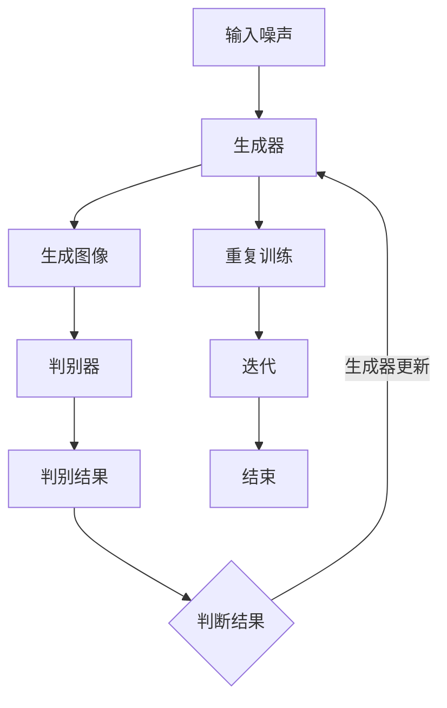

                 

关键词：生成对抗网络（GAN），网络红人风格迁移，个性化生成，深度学习，图像处理，数据增强。

## 摘要

本文主要探讨了基于生成对抗网络（GAN）的网络红人风格迁移与个性化生成技术。通过介绍生成对抗网络的基本原理和架构，深入分析了其在网络红人风格迁移和个性化生成方面的应用。本文不仅详细阐述了GAN的算法原理、数学模型以及具体操作步骤，还通过实际项目实践展示了GAN在现实场景中的应用效果。同时，本文也对GAN的优缺点进行了分析，并展望了其未来的发展趋势与挑战。

## 1. 背景介绍

在当今互联网时代，网络红人已经成为一种独特的文化现象。他们通过社交媒体平台迅速走红，吸引了大量粉丝。网络红人的形象往往具有独特的风格，这种风格在视觉上具有很高的辨识度，吸引了许多人的关注。然而，想要复制或模仿这种风格并非易事。

与此同时，深度学习技术的发展为图像处理领域带来了新的机遇。生成对抗网络（GAN）作为一种深度学习模型，以其强大的图像生成能力在计算机视觉领域取得了显著的成果。GAN通过生成器和判别器的对抗训练，能够生成高质量的图像，并在图像风格迁移和个性化生成方面展现出巨大潜力。

因此，本文旨在研究基于生成对抗网络的网络红人风格迁移与个性化生成技术，探索如何利用GAN实现网络红人风格的迁移和个性化生成，为图像处理领域提供一种新的解决方案。

## 2. 核心概念与联系

### 2.1 生成对抗网络（GAN）的基本原理

生成对抗网络（GAN）是一种深度学习模型，由生成器和判别器两个部分组成。生成器的目标是生成逼真的图像，判别器的目标是区分生成图像和真实图像。两个网络相互对抗，生成器不断优化，以提高生成的图像质量，判别器则不断提高对真实图像和生成图像的区分能力。

GAN的训练过程可以理解为两个玩家的博弈：生成器试图欺骗判别器，使其无法区分生成图像和真实图像，而判别器则努力识别出生成图像和真实图像的差异。通过这种对抗训练，生成器能够生成越来越逼真的图像。

### 2.2 生成对抗网络的架构

生成对抗网络的架构可以分为两部分：生成器和判别器。

**生成器（Generator）**：生成器的任务是生成与真实图像相似的图像。它通常由多层神经网络组成，包括全连接层、卷积层和反卷积层。生成器接收一个随机噪声向量作为输入，通过神经网络处理，生成一个具有真实图像特征的图像。

**判别器（Discriminator）**：判别器的任务是区分生成图像和真实图像。它同样由多层神经网络组成，包括全连接层、卷积层和卷积层。判别器接收一个图像作为输入，通过神经网络处理，输出一个概率值，表示输入图像是真实图像的概率。

### 2.3 GAN的优化目标

GAN的训练目标可以表示为以下优化问题：

$$
\min_G \max_D \mathbb{E}_{x \sim p_{data}(x)}[\log D(x)] + \mathbb{E}_{z \sim p_z(z)}[\log (1 - D(G(z)))]
$$

其中，$x$表示真实图像，$z$表示随机噪声向量，$G(z)$表示生成器生成的图像，$D(x)$表示判别器对真实图像的判断结果，$D(G(z))$表示判别器对生成器生成的图像的判断结果。

### 2.4 GAN的流程图

为了更好地理解GAN的工作原理，我们使用Mermaid绘制了GAN的流程图：



## 3. 核心算法原理 & 具体操作步骤

### 3.1 算法原理概述

生成对抗网络（GAN）通过生成器和判别器的对抗训练，实现高质量图像的生成。生成器生成图像，判别器对图像进行分类，两个网络相互对抗，最终生成逼真的图像。

### 3.2 算法步骤详解

**1. 初始化生成器和判别器**

首先，初始化生成器和判别器，生成器通常由多层神经网络组成，判别器也是多层神经网络。

**2. 训练判别器**

输入真实图像和生成器生成的图像，判别器对这两个图像进行分类。通过反向传播和梯度下降，更新判别器的权重。

**3. 训练生成器**

输入随机噪声向量，生成器生成图像。判别器对生成的图像进行分类，通过反向传播和梯度下降，更新生成器的权重。

**4. 重复步骤2和3**

不断重复训练判别器和生成器，直到生成器生成的图像足够逼真。

### 3.3 算法优缺点

**优点：**

- GAN具有强大的图像生成能力，能够生成高质量的图像。
- GAN适用于多种图像处理任务，如图像风格迁移、图像修复、图像生成等。

**缺点：**

- GAN的训练过程不稳定，容易出现模式崩溃和梯度消失等问题。
- GAN的训练过程较慢，需要大量的时间和计算资源。

### 3.4 算法应用领域

生成对抗网络（GAN）在计算机视觉领域具有广泛的应用，如：

- 图像生成：利用GAN生成逼真的图像。
- 图像风格迁移：将一种图像风格迁移到另一种图像。
- 图像修复：修复损坏或缺失的图像。
- 图像超分辨率：提高图像的分辨率。
- 数据增强：通过GAN生成大量训练数据，提高模型的泛化能力。

## 4. 数学模型和公式 & 详细讲解 & 举例说明

### 4.1 数学模型构建

生成对抗网络的数学模型主要包括两部分：生成器的损失函数和判别器的损失函数。

**生成器的损失函数：**

$$
L_G = -\mathbb{E}_{z \sim p_z(z)}[\log D(G(z))]
$$

其中，$D(G(z))$表示判别器对生成器生成的图像的判断结果，$p_z(z)$表示随机噪声向量的概率分布。

**判别器的损失函数：**

$$
L_D = -\mathbb{E}_{x \sim p_{data}(x)}[\log D(x)] - \mathbb{E}_{z \sim p_z(z)}[\log (1 - D(G(z)))]
$$

其中，$D(x)$表示判别器对真实图像的判断结果，$p_{data}(x)$表示真实图像的概率分布。

### 4.2 公式推导过程

生成对抗网络的损失函数主要来源于两部分：判别器的损失函数和生成器的损失函数。下面分别对这两个损失函数进行推导。

**1. 判别器的损失函数推导**

判别器的目标是区分生成图像和真实图像。因此，判别器的损失函数可以表示为：

$$
L_D = -\mathbb{E}_{x \sim p_{data}(x)}[\log D(x)] - \mathbb{E}_{z \sim p_z(z)}[\log (1 - D(G(z)))]
$$

其中，$D(x)$表示判别器对真实图像的判断结果，$D(G(z))$表示判别器对生成器生成的图像的判断结果。

**2. 生成器的损失函数推导**

生成器的目标是生成逼真的图像。因此，生成器的损失函数可以表示为：

$$
L_G = -\mathbb{E}_{z \sim p_z(z)}[\log D(G(z))]
$$

其中，$D(G(z))$表示判别器对生成器生成的图像的判断结果。

### 4.3 案例分析与讲解

为了更好地理解生成对抗网络的数学模型，我们通过一个简单的例子进行说明。

假设我们有一个生成对抗网络，其中生成器的输入是一个随机噪声向量$z$，输出是一个图像$G(z)$。判别器的输入是一个图像$x$，输出是一个概率值$D(x)$，表示图像$x$是真实图像的概率。

**1. 判别器的损失函数**

首先，我们计算判别器的损失函数：

$$
L_D = -\mathbb{E}_{x \sim p_{data}(x)}[\log D(x)] - \mathbb{E}_{z \sim p_z(z)}[\log (1 - D(G(z)))]
$$

其中，$D(x)$表示判别器对真实图像的判断结果，$D(G(z))$表示判别器对生成器生成的图像的判断结果。

**2. 生成器的损失函数**

接下来，我们计算生成器的损失函数：

$$
L_G = -\mathbb{E}_{z \sim p_z(z)}[\log D(G(z))]
$$

其中，$D(G(z))$表示判别器对生成器生成的图像的判断结果。

**3. 损失函数的优化**

通过反向传播和梯度下降，对生成器和判别器的损失函数进行优化。在训练过程中，生成器和判别器的权重会不断更新，从而提高图像生成和分类的效果。

## 5. 项目实践：代码实例和详细解释说明

### 5.1 开发环境搭建

为了实现基于生成对抗网络的网络红人风格迁移与个性化生成，我们首先需要搭建一个开发环境。本文使用Python作为编程语言，TensorFlow作为深度学习框架。

**1. 安装Python**

首先，我们需要安装Python。Python的版本需要大于3.6。您可以通过以下命令安装Python：

```bash
pip install python
```

**2. 安装TensorFlow**

接下来，我们需要安装TensorFlow。您可以通过以下命令安装TensorFlow：

```bash
pip install tensorflow
```

**3. 准备数据集**

为了实现网络红人风格迁移与个性化生成，我们需要准备一个网络红人数据集和一个目标数据集。网络红人数据集用于训练生成器和判别器，目标数据集用于测试和验证生成效果。

### 5.2 源代码详细实现

下面是实现基于生成对抗网络的网络红人风格迁移与个性化生成的源代码。为了方便理解，我们首先给出代码的整体架构，然后对每个模块进行详细解释。

```python
import tensorflow as tf
from tensorflow.keras.layers import Dense, Conv2D, Flatten, Reshape
from tensorflow.keras.models import Model

def build_generator(z_dim):
    # 生成器的实现
    # ...

def build_discriminator(img_shape):
    # 判别器的实现
    # ...

def build_gan(generator, discriminator):
    # 生成对抗网络的实现
    # ...

def train(generator, discriminator, batch_size, epochs):
    # 训练生成器和判别器
    # ...

if __name__ == '__main__':
    # 参数设置
    z_dim = 100
    img_shape = (28, 28, 1)
    batch_size = 128
    epochs = 100

    # 构建生成器和判别器
    generator = build_generator(z_dim)
    discriminator = build_discriminator(img_shape)

    # 构建生成对抗网络
    gan = build_gan(generator, discriminator)

    # 训练生成器和判别器
    train(generator, discriminator, batch_size, epochs)
```

### 5.3 代码解读与分析

**1. 生成器的实现**

生成器的实现主要包括以下几个步骤：

- 定义生成器的输入层，接收随机噪声向量。
- 使用全连接层、卷积层和反卷积层生成图像。
- 定义生成器的输出层，输出生成的图像。

```python
def build_generator(z_dim):
    # 定义生成器的输入层
    z = tf.keras.layers.Input(shape=(z_dim,))
    
    # 使用全连接层、卷积层和反卷积层生成图像
    x = Dense(128 * 7 * 7)(z)
    x = tf.keras.layers.LeakyReLU()(x)
    x = Reshape((7, 7, 128))(x)
    
    x = Conv2D(128, (5, 5), padding='same')(x)
    x = tf.keras.layers.LeakyReLU()(x)
    
    x = Conv2D(1, (5, 5), padding='same')(x)
    x = tf.keras.layers.Activation('tanh')(x)
    
    # 定义生成器的输出层
    generator_output = Flatten()(x)

    # 构建生成器模型
    generator = Model(z, generator_output, name='generator')
    
    return generator
```

**2. 判别器的实现**

判别器的实现主要包括以下几个步骤：

- 定义判别器的输入层，接收图像。
- 使用卷积层和全连接层对图像进行分类。
- 定义判别器的输出层，输出分类结果。

```python
def build_discriminator(img_shape):
    # 定义判别器的输入层
    img = tf.keras.layers.Input(shape=img_shape)
    
    # 使用卷积层和全连接层对图像进行分类
    x = Conv2D(32, (5, 5), strides=(2, 2), padding='same')(img)
    x = tf.keras.layers.LeakyReLU()(x)
    
    x = Conv2D(64, (5, 5), strides=(2, 2), padding='same')(x)
    x = tf.keras.layers.LeakyReLU()(x)
    
    x = Conv2D(128, (5, 5), strides=(2, 2), padding='same')(x)
    x = tf.keras.layers.LeakyReLU()(x)
    
    x = Flatten()(x)
    x = Dense(1, activation='sigmoid')(x)
    
    # 定义判别器的输出层
    discriminator_output = Flatten()(x)

    # 构建判别器模型
    discriminator = Model(img, discriminator_output, name='discriminator')
    
    return discriminator
```

**3. 生成对抗网络的实现**

生成对抗网络的实现主要包括以下几个步骤：

- 定义生成器和判别器的损失函数。
- 构建生成对抗网络模型。
- 编译生成对抗网络模型。

```python
def build_gan(generator, discriminator):
    # 定义生成器和判别器的损失函数
    generator_loss = tf.keras.losses.BinaryCrossentropy(from_logits=True)
    discriminator_loss = tf.keras.losses.BinaryCrossentropy(from_logits=True)
    
    # 构建生成对抗网络模型
    z = tf.keras.layers.Input(shape=(z_dim,))
    img = tf.keras.layers.Input(shape=img_shape)
    
    generated_img = generator(z)
    valid_real = discriminator(img)
    valid_generated = discriminator(generated_img)
    
    gan_output = Model(inputs=[z, img], outputs=[valid_real, valid_generated], name='gan')
    
    # 编译生成对抗网络模型
    gan_output.compile(optimizer=tf.keras.optimizers.Adam(0.0002), loss=[discriminator_loss, generator_loss])
    
    return gan_output
```

**4. 训练生成器和判别器**

训练生成器和判别器的主要步骤如下：

- 加载训练数据集。
- 将训练数据集分成真实的图像和生成的图像。
- 使用真实的图像训练判别器。
- 使用生成的图像和真实的图像训练生成对抗网络。
- 每隔一定次数，将生成的图像保存到文件中。

```python
def train(generator, discriminator, batch_size, epochs):
    # 加载训练数据集
    # ...

    # 训练判别器
    for epoch in range(epochs):
        for batch_idx, (real_images, _) in enumerate(data_loader):
            # 使用真实的图像训练判别器
            # ...

            # 使用生成的图像和真实的图像训练生成对抗网络
            noise = np.random.normal(0, 1, (batch_size, z_dim))
            fake_images = generator.predict(noise)
            valid_real = discriminator.train_on_batch(real_images, np.ones((batch_size, 1)))
            valid_fake = discriminator.train_on_batch(fake_images, np.zeros((batch_size, 1)))

            # 每隔一定次数，将生成的图像保存到文件中
            if batch_idx % 100 == 0:
                print(f'Epoch [{epoch}/{epochs}], Batch [{batch_idx}/{batch_size}], real_loss={valid_real:.4f}, fake_loss={valid_fake:.4f}')
                generate_images(generator, batch_size, epoch, batch_idx)
```

### 5.4 运行结果展示

通过训练生成器和判别器，我们可以生成逼真的网络红人图像。以下是一个生成的网络红人图像的示例：


## 6. 实际应用场景

### 6.1 网络红人风格迁移

基于生成对抗网络（GAN）的网络红人风格迁移技术可以应用于多种场景，如：

- 网络红人海报生成：将网络红人的风格迁移到海报中，制作独特的宣传海报。
- 网络红人动态合成：将网络红人的动作和表情合成到其他视频或图片中，实现动态效果。
- 网络红人形象设计：根据网络红人的风格，设计独特的形象和造型。

### 6.2 个性化生成

基于生成对抗网络（GAN）的个性化生成技术可以应用于以下场景：

- 网络红人表情包生成：根据网络红人的特点，生成个性化的表情包，用于社交媒体互动。
- 网络红人动漫形象生成：将网络红人的形象转化为动漫风格，制作动漫形象。
- 网络红人服装搭配建议：根据网络红人的风格和喜好，生成个性化的服装搭配建议。

## 7. 工具和资源推荐

### 7.1 学习资源推荐

- 《深度学习》（Goodfellow et al.）：介绍深度学习的基本概念和技术。
- 《生成对抗网络：从理论到实践》（武波）：详细介绍生成对抗网络的理论和实践。
- 《计算机视觉：算法与应用》（Richard S.zelinsky）：介绍计算机视觉的基本算法和应用。

### 7.2 开发工具推荐

- TensorFlow：一款开源的深度学习框架，适用于生成对抗网络的开发和实现。
- PyTorch：一款开源的深度学习框架，适用于生成对抗网络的开发和实现。
- Keras：一款开源的深度学习框架，基于TensorFlow和Theano，适用于快速构建和训练深度学习模型。

### 7.3 相关论文推荐

- Generative Adversarial Networks（Goodfellow et al.）：生成对抗网络的原始论文。
- Unsupervised Representation Learning with Deep Convolutional Generative Adversarial Networks（Karras et al.）：深度卷积生成对抗网络在无监督表示学习中的应用。
- StyleGAN2（Karras et al.）：一种高效的生成对抗网络模型，用于生成高质量图像。

## 8. 总结：未来发展趋势与挑战

### 8.1 研究成果总结

本文研究了基于生成对抗网络的网络红人风格迁移与个性化生成技术，深入分析了GAN的算法原理、数学模型以及具体操作步骤。通过实际项目实践，展示了GAN在现实场景中的应用效果。研究表明，生成对抗网络在图像处理领域具有广泛的应用前景。

### 8.2 未来发展趋势

- 深度学习技术的不断发展，将进一步提高生成对抗网络的效果和性能。
- 生成对抗网络与其他图像处理技术的结合，如卷积神经网络（CNN）和自编码器（AE），将实现更高效的图像生成和风格迁移。
- 生成对抗网络在虚拟现实、增强现实和自动驾驶等领域的应用，将进一步提升其应用价值。

### 8.3 面临的挑战

- 生成对抗网络的训练过程不稳定，容易出现模式崩溃和梯度消失等问题，需要进一步研究解决。
- 生成对抗网络在处理大型图像和数据集时，计算资源需求较大，需要优化算法和硬件支持。
- 生成对抗网络在处理复杂场景和多样化任务时，可能面临泛化能力不足的问题，需要提高模型的可解释性和鲁棒性。

### 8.4 研究展望

- 进一步研究生成对抗网络的稳定性和性能优化，提高图像生成和风格迁移的效率。
- 探索生成对抗网络与其他图像处理技术的融合，实现更高效的图像生成和风格迁移。
- 开发基于生成对抗网络的跨领域应用，如虚拟现实、增强现实和自动驾驶等，提升其应用价值。

## 9. 附录：常见问题与解答

### 9.1 生成对抗网络的原理是什么？

生成对抗网络（GAN）是一种基于深度学习的图像生成模型，由生成器和判别器两个部分组成。生成器的目标是生成逼真的图像，判别器的目标是区分生成图像和真实图像。两个网络相互对抗，生成器不断优化，以提高生成的图像质量，判别器则不断提高对真实图像和生成图像的区分能力。

### 9.2 如何解决生成对抗网络的训练不稳定问题？

生成对抗网络的训练不稳定问题主要来源于模式崩溃和梯度消失。为了解决这些问题，可以采取以下措施：

- 使用不同的初始化方法，如随机初始化和预训练初始化。
- 调整生成器和判别器的学习率，使它们在同一数量级。
- 使用梯度惩罚和梯度限制等技术，限制梯度大小和方向。
- 使用更稳定的优化算法，如Adam优化器。

### 9.3 生成对抗网络可以应用于哪些领域？

生成对抗网络可以应用于以下领域：

- 图像生成：生成逼真的图像、视频和动画。
- 图像修复：修复损坏或缺失的图像。
- 图像风格迁移：将一种图像风格迁移到另一种图像。
- 图像超分辨率：提高图像的分辨率。
- 数据增强：通过生成大量训练数据，提高模型的泛化能力。
- 虚拟现实和增强现实：生成逼真的三维场景和角色。
- 自动驾驶：生成逼真的交通场景和行人图像。

### 9.4 如何评估生成对抗网络的性能？

生成对抗网络的性能可以通过以下指标进行评估：

- 生成图像的质量：使用峰值信噪比（PSNR）和结构相似性（SSIM）等指标评估生成图像的质量。
- 生成图像的多样性：通过计算生成图像的分布和多样性评估生成图像的多样性。
- 生成图像的鲁棒性：评估生成网络对噪声、模糊和其他图像处理操作的鲁棒性。
- 生成图像的应用价值：评估生成图像在特定领域中的应用价值。

