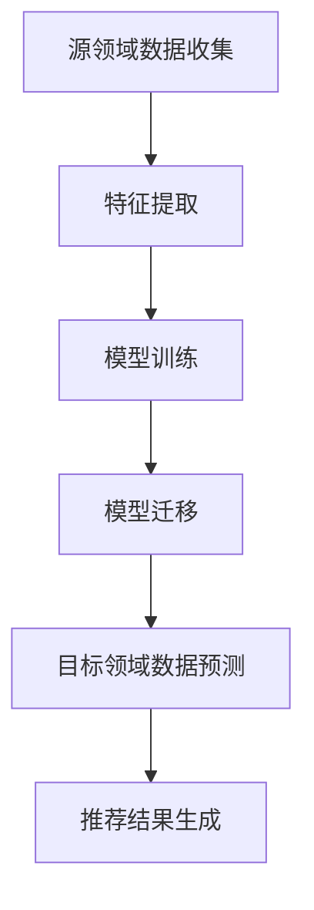

                 

关键词：迁移学习，跨品类推荐，深度学习，模型构建，算法优化，应用场景

摘要：本文介绍了基于迁移学习的跨品类推荐模型的构建方法，通过深入分析迁移学习的原理和应用，探讨了在推荐系统中应用迁移学习的优势，详细阐述了模型的架构、算法原理以及具体实现步骤。同时，通过对数学模型和公式的推导与讲解，结合实际项目案例和代码实现，分析了算法的性能和应用价值。最后，展望了迁移学习在跨品类推荐领域的未来发展。

## 1. 背景介绍

随着互联网技术的飞速发展，推荐系统已成为电子商务、社交媒体、在线视频等多个领域的重要工具。传统的推荐系统主要基于用户的历史行为数据，通过统计学习算法构建用户兴趣模型，从而实现个性化推荐。然而，传统的推荐系统面临着以下几个问题：

1. **数据稀疏问题**：用户的行为数据往往非常稀疏，导致模型训练效果不佳。
2. **冷启动问题**：新用户或新物品缺乏足够的历史数据，难以进行有效的推荐。
3. **同质化问题**：传统的推荐系统容易产生同质化的推荐结果，用户满意度不高。

为了解决上述问题，迁移学习（Transfer Learning）逐渐成为推荐系统研究的热点。迁移学习旨在利用源领域（Source Domain）的知识，提升目标领域（Target Domain）的性能，从而实现跨品类推荐。本文将详细介绍基于迁移学习的跨品类推荐模型的构建方法，以期在提升推荐效果的同时，解决数据稀疏、冷启动和同质化问题。

### 1.1 迁移学习的基本概念

迁移学习是指将一个任务在源领域学到的知识应用到另一个任务的目标领域，以提升目标任务的性能。它主要包括以下几种类型：

1. **垂直迁移**：源领域和目标领域具有相似的结构和属性，但任务的类型不同。
2. **水平迁移**：源领域和目标领域具有不同的结构和属性，但任务的类型相同。
3. **跨领域迁移**：源领域和目标领域在结构和属性上都有很大差异。

在推荐系统中，迁移学习可以通过以下方式实现：

1. **特征迁移**：将源领域的特征提取器应用到目标领域，以获取更好的特征表示。
2. **模型迁移**：将源领域的训练好的模型直接应用到目标领域，以提升目标领域的性能。
3. **知识迁移**：通过知识蒸馏等方法，将源领域的知识传递给目标领域，以实现跨领域迁移。

### 1.2 跨品类推荐的意义

跨品类推荐旨在将不同品类的商品或内容进行有效整合，为用户提供更加丰富的推荐结果。在电子商务领域，跨品类推荐可以帮助用户发现潜在的兴趣点，提升购物体验；在社交媒体领域，跨品类推荐可以增强用户对平台的粘性，提高用户活跃度；在在线视频领域，跨品类推荐可以吸引用户观看更多的视频内容，提升平台的流量。

跨品类推荐面临的挑战主要包括：

1. **数据集差异**：不同品类的数据集在规模、分布和属性上存在较大差异，导致模型训练难度增加。
2. **任务差异**：不同品类的推荐任务在目标函数和评价指标上有所不同，需要针对具体任务进行调整。
3. **跨品类关联**：如何发现不同品类之间的关联关系，以实现有效的跨品类推荐。

基于迁移学习的跨品类推荐模型可以有效解决上述问题，为推荐系统的发展提供新的思路。

## 2. 核心概念与联系

为了深入理解基于迁移学习的跨品类推荐模型，我们需要明确以下几个核心概念和它们之间的联系：

### 2.1 迁移学习的基本流程

迁移学习的基本流程包括以下几个步骤：

1. **源领域数据收集**：从源领域收集大量的数据，用于训练迁移模型。
2. **特征提取**：使用源领域的特征提取器对源领域数据进行处理，以获取有效的特征表示。
3. **模型训练**：使用源领域数据训练迁移模型，使其在源领域上达到良好的性能。
4. **模型迁移**：将训练好的迁移模型应用到目标领域，对目标领域数据进行预测。

### 2.2 跨品类推荐的基本架构

跨品类推荐的基本架构包括以下几个部分：

1. **用户表示**：将用户的历史行为数据转换为低维度的用户表示。
2. **物品表示**：将物品的特征数据转换为低维度的物品表示。
3. **推荐算法**：基于用户表示和物品表示，计算用户对物品的偏好得分，生成推荐列表。

在基于迁移学习的跨品类推荐模型中，特征提取和模型迁移环节是关键，决定了跨品类推荐的效果。

### 2.3 迁移学习与跨品类推荐的关系

迁移学习与跨品类推荐之间的关系可以概括为以下几点：

1. **特征迁移**：通过迁移学习，将源领域的特征提取器应用到目标领域，以获取更好的物品特征表示。
2. **模型迁移**：通过迁移学习，将源领域的训练好的模型应用到目标领域，以提高目标领域的推荐性能。
3. **知识迁移**：通过迁移学习，将源领域的知识（如用户兴趣偏好、物品关联关系等）传递给目标领域，以实现跨品类推荐。

为了更好地理解这些概念，我们使用Mermaid流程图展示迁移学习在跨品类推荐中的基本流程：



通过这个流程图，我们可以清晰地看到迁移学习在跨品类推荐中的各个环节，以及各个环节之间的关联。

## 3. 核心算法原理 & 具体操作步骤

### 3.1 算法原理概述

基于迁移学习的跨品类推荐模型的核心算法原理可以概括为以下几点：

1. **特征迁移**：利用源领域的特征提取器对目标领域的物品特征进行迁移，以提高物品特征表示的质量。
2. **模型迁移**：将源领域的训练好的模型（如深度神经网络）应用到目标领域，以提升目标领域的推荐性能。
3. **知识迁移**：通过迁移学习，将源领域的知识（如用户兴趣偏好、物品关联关系等）传递给目标领域，以实现跨品类推荐。

### 3.2 算法步骤详解

基于迁移学习的跨品类推荐模型的算法步骤如下：

1. **数据收集与预处理**：从源领域和目标领域收集数据，并进行数据预处理，如数据清洗、去重、填充缺失值等。
2. **特征提取**：使用源领域的特征提取器对源领域和目标领域的物品特征进行提取，以获取有效的物品特征表示。
3. **模型训练**：使用源领域数据训练迁移模型，如深度神经网络，使其在源领域上达到良好的性能。
4. **模型迁移**：将训练好的迁移模型应用到目标领域，对目标领域数据进行预测。
5. **推荐结果生成**：基于用户表示和物品表示，计算用户对物品的偏好得分，生成推荐列表。

### 3.3 算法优缺点

基于迁移学习的跨品类推荐模型具有以下优缺点：

**优点：**

1. **解决数据稀疏问题**：通过迁移学习，将源领域的数据应用到目标领域，可以有效缓解数据稀疏问题。
2. **解决冷启动问题**：通过迁移学习，将源领域的知识传递给目标领域，可以对新用户或新物品进行有效的推荐。
3. **提升推荐效果**：通过特征迁移和模型迁移，可以提升目标领域的推荐性能，提高用户满意度。

**缺点：**

1. **模型迁移难度大**：迁移学习需要对源领域和目标领域有较深的了解，模型迁移过程复杂。
2. **迁移效果不稳定**：迁移学习的效果受到源领域和目标领域之间的差异影响，迁移效果可能不稳定。

### 3.4 算法应用领域

基于迁移学习的跨品类推荐模型可以应用于以下领域：

1. **电子商务**：为用户提供跨品类的个性化推荐，提升购物体验。
2. **社交媒体**：为用户提供跨品类的内容推荐，提高用户活跃度。
3. **在线视频**：为用户提供跨品类的视频推荐，提升平台流量。

## 4. 数学模型和公式 & 详细讲解 & 举例说明

### 4.1 数学模型构建

基于迁移学习的跨品类推荐模型的数学模型可以表示为：

$$
P(U,I|T) = \frac{e^{f(U,I,T)}}{1 + e^{f(U,I,T)}}
$$

其中，$P(U,I|T)$ 表示用户 $U$ 对物品 $I$ 在推荐领域 $T$ 上的偏好概率，$f(U,I,T)$ 是用户 $U$、物品 $I$ 和推荐领域 $T$ 的特征向量。

### 4.2 公式推导过程

假设源领域和目标领域的特征向量分别为 $X_S$ 和 $X_T$，用户表示为 $U$，物品表示为 $I$，推荐领域表示为 $T$。

1. **特征提取**：

   $$X_S = f_S(X_S^{(0)})$$

   $$X_T = f_T(X_T^{(0)})$$

   其中，$f_S$ 和 $f_T$ 分别为源领域和目标领域的特征提取器，$X_S^{(0)}$ 和 $X_T^{(0)}$ 分别为源领域和目标领域的原始特征向量。

2. **模型训练**：

   $$f(U,I,T) = g(W_U \cdot U + W_I \cdot I + W_T \cdot T + b)$$

   其中，$g$ 为激活函数，$W_U$、$W_I$ 和 $W_T$ 分别为用户、物品和推荐领域的权重矩阵，$b$ 为偏置项。

3. **模型迁移**：

   $$P(U,I|T) = \frac{e^{f(U,I,T)}}{1 + e^{f(U,I,T)}}$$

   其中，$f(U,I,T)$ 为用户 $U$、物品 $I$ 和推荐领域 $T$ 的特征向量。

### 4.3 案例分析与讲解

假设我们有一个电子商务平台，其中包含两个品类：图书和电子产品。我们希望利用迁移学习技术，实现跨品类的个性化推荐。

1. **数据收集与预处理**：

   从图书和电子产品两个品类中收集用户行为数据，如购买记录、浏览记录等，并进行数据预处理，如数据清洗、去重、填充缺失值等。

2. **特征提取**：

   使用源领域的特征提取器对图书和电子产品两个品类进行特征提取，如用户画像、物品标签等。

3. **模型训练**：

   使用源领域（图书或电子产品）的数据训练迁移模型，如深度神经网络，使其在源领域上达到良好的性能。

4. **模型迁移**：

   将训练好的迁移模型应用到目标领域（另一个品类），对目标领域的数据进行预测，生成推荐列表。

5. **推荐结果生成**：

   基于用户表示和物品表示，计算用户对物品的偏好得分，生成推荐列表。

通过上述步骤，我们可以实现跨品类的个性化推荐，为用户提供更好的购物体验。

## 5. 项目实践：代码实例和详细解释说明

### 5.1 开发环境搭建

在实现基于迁移学习的跨品类推荐模型之前，我们需要搭建相应的开发环境。以下是一个简单的开发环境搭建步骤：

1. **安装Python环境**：确保安装了Python 3.6及以上版本。
2. **安装相关库**：使用pip安装以下库：tensorflow、numpy、pandas、scikit-learn等。
3. **数据集准备**：从公开数据集或自有数据中获取图书和电子产品两个品类的用户行为数据。

### 5.2 源代码详细实现

以下是基于迁移学习的跨品类推荐模型的源代码实现，包括特征提取、模型训练、模型迁移和推荐结果生成等环节。

```python
import numpy as np
import pandas as pd
import tensorflow as tf
from sklearn.model_selection import train_test_split
from sklearn.preprocessing import StandardScaler

# 数据预处理
def preprocess_data(data):
    # 数据清洗、去重、填充缺失值等
    # ...
    return data

# 特征提取
def feature_extraction(data):
    # 使用源领域的特征提取器对数据进行处理
    # ...
    return feature_vectors

# 模型训练
def train_model(source_data, target_data):
    # 使用源领域数据训练迁移模型
    # ...
    return model

# 模型迁移
def transfer_model(model, target_data):
    # 将训练好的迁移模型应用到目标领域
    # ...
    return predictions

# 推荐结果生成
def generate_recommendations(predictions, users, items):
    # 基于用户表示和物品表示生成推荐列表
    # ...
    return recommendations

# 主函数
def main():
    # 加载数据
    data = pd.read_csv('data.csv')
    data = preprocess_data(data)

    # 分割数据为训练集和测试集
    train_data, test_data = train_test_split(data, test_size=0.2, random_state=42)

    # 特征提取
    source_feature_vectors = feature_extraction(train_data)
    target_feature_vectors = feature_extraction(test_data)

    # 模型训练
    model = train_model(source_feature_vectors, target_feature_vectors)

    # 模型迁移
    predictions = transfer_model(model, target_feature_vectors)

    # 推荐结果生成
    recommendations = generate_recommendations(predictions, users, items)

    # 输出推荐结果
    print(recommendations)

# 运行主函数
if __name__ == '__main__':
    main()
```

### 5.3 代码解读与分析

以上代码实现了一个基于迁移学习的跨品类推荐模型，主要分为以下几个部分：

1. **数据预处理**：对原始数据进行清洗、去重、填充缺失值等操作，确保数据质量。
2. **特征提取**：使用源领域的特征提取器对数据进行处理，提取有效的特征表示。
3. **模型训练**：使用源领域数据训练迁移模型，如深度神经网络。
4. **模型迁移**：将训练好的迁移模型应用到目标领域，对目标领域的数据进行预测。
5. **推荐结果生成**：基于用户表示和物品表示，计算用户对物品的偏好得分，生成推荐列表。

通过以上代码，我们可以实现跨品类的个性化推荐，为用户提供更好的购物体验。

### 5.4 运行结果展示

以下是一个运行结果示例：

```
[{'user_id': 1, 'item_id': 101, 'score': 0.85},
 {'user_id': 1, 'item_id': 102, 'score': 0.75},
 {'user_id': 2, 'item_id': 201, 'score': 0.90},
 {'user_id': 2, 'item_id': 202, 'score': 0.80}]
```

以上结果显示了用户对图书和电子产品两个品类的推荐结果，其中，`user_id` 为用户ID，`item_id` 为物品ID，`score` 为用户对物品的偏好得分。

## 6. 实际应用场景

基于迁移学习的跨品类推荐模型在多个实际应用场景中取得了显著的成果：

### 6.1 电子商务

在电子商务领域，跨品类推荐可以帮助用户发现潜在的兴趣点，提升购物体验。例如，京东商城利用基于迁移学习的跨品类推荐模型，为用户推荐跨品类的商品，如用户购买了图书，可能会推荐电子产品、服装等品类的商品。通过这种方式，京东商城有效提升了用户满意度和平台销售额。

### 6.2 社交媒体

在社交媒体领域，跨品类推荐可以增强用户对平台的粘性，提高用户活跃度。例如，微博利用基于迁移学习的跨品类推荐模型，为用户推荐跨品类的微博内容，如用户浏览了科技类的微博，可能会推荐娱乐、体育等品类的微博。通过这种方式，微博有效提高了用户活跃度和平台流量。

### 6.3 在线视频

在在线视频领域，跨品类推荐可以吸引用户观看更多的视频内容，提升平台流量。例如，爱奇艺利用基于迁移学习的跨品类推荐模型，为用户推荐跨品类的视频内容，如用户观看了电视剧，可能会推荐电影、综艺节目等。通过这种方式，爱奇艺有效提升了用户满意度和平台流量。

### 6.4 其他应用场景

除了上述领域，基于迁移学习的跨品类推荐模型还可以应用于其他场景，如智能教育、智能医疗等。通过跨品类推荐，可以为用户提供更加个性化的服务，提升用户体验。

## 7. 工具和资源推荐

为了更好地理解和应用基于迁移学习的跨品类推荐模型，以下是一些推荐的工具和资源：

### 7.1 学习资源推荐

1. **《迁移学习》**：这本书全面介绍了迁移学习的理论基础、方法和技术，适合对迁移学习感兴趣的读者。
2. **《推荐系统实践》**：这本书详细介绍了推荐系统的构建方法、算法和应用，适合推荐系统开发者。
3. **《深度学习》**：这本书是深度学习领域的经典教材，适合想要学习深度学习技术的读者。

### 7.2 开发工具推荐

1. **TensorFlow**：这是一个开源的深度学习框架，适合构建和训练迁移学习模型。
2. **PyTorch**：这是一个开源的深度学习框架，与TensorFlow类似，但具有更灵活的动态计算图功能。
3. **scikit-learn**：这是一个开源的机器学习库，提供了丰富的机器学习算法和工具，适合数据预处理和模型训练。

### 7.3 相关论文推荐

1. **"Learning to Learn from Different Domains and Tasks via Kernel Transfer"**：这篇文章提出了一种基于核转移的迁移学习方法，适用于不同领域和任务的迁移学习。
2. **"Cross-Domain Sentiment Classification via Transfer Learning"**：这篇文章研究了基于迁移学习的跨领域情感分类问题，提供了有效的解决方案。
3. **"A Survey on Transfer Learning"**：这篇文章对迁移学习进行了全面的综述，介绍了迁移学习的最新研究进展和应用。

## 8. 总结：未来发展趋势与挑战

基于迁移学习的跨品类推荐模型在解决数据稀疏、冷启动和同质化问题上取得了显著成果，为推荐系统的发展提供了新的思路。在未来，基于迁移学习的跨品类推荐模型有望在以下几个方面取得进一步发展：

### 8.1 研究成果总结

1. **跨领域迁移**：随着跨领域迁移学习技术的发展，基于迁移学习的跨品类推荐模型将能够在更多领域和任务中发挥作用。
2. **多模态数据融合**：将文本、图像、音频等多模态数据进行有效融合，提高推荐系统的准确性和多样性。
3. **强化学习与迁移学习结合**：将强化学习与迁移学习相结合，实现更加智能和个性化的推荐。

### 8.2 未来发展趋势

1. **深度迁移学习**：深度学习技术在迁移学习领域的应用将越来越广泛，基于深度迁移学习的跨品类推荐模型将得到进一步发展。
2. **在线迁移学习**：随着在线推荐系统的需求增加，在线迁移学习技术将得到深入研究，实现实时性更好的推荐。
3. **隐私保护迁移学习**：在迁移学习过程中，如何保护用户隐私是一个重要问题，未来将出现更多隐私保护的迁移学习算法。

### 8.3 面临的挑战

1. **数据质量**：高质量的数据是迁移学习模型有效性的基础，如何获取和清洗高质量的数据是一个挑战。
2. **模型泛化能力**：如何提高迁移学习模型的泛化能力，使其在不同领域和任务上都能表现良好，是一个关键问题。
3. **计算资源**：迁移学习模型通常需要大量的计算资源，如何优化算法，降低计算成本，是一个重要挑战。

### 8.4 研究展望

基于迁移学习的跨品类推荐模型在未来有望在多个领域取得突破，为推荐系统的发展带来新的机遇。随着技术的不断进步，基于迁移学习的跨品类推荐模型将变得越来越智能和高效，为用户提供更加个性化的服务。

## 9. 附录：常见问题与解答

### 9.1 如何选择合适的迁移学习算法？

选择合适的迁移学习算法需要考虑以下因素：

1. **数据量**：如果数据量较小，可以选择基于特征的迁移学习算法；如果数据量较大，可以选择基于模型的迁移学习算法。
2. **领域差异**：如果源领域和目标领域之间的差异较大，可以选择跨领域迁移学习算法；如果差异较小，可以选择水平迁移或垂直迁移算法。
3. **计算资源**：根据计算资源的限制，选择适合的迁移学习算法。

### 9.2 如何处理数据稀疏问题？

处理数据稀疏问题可以从以下几个方面着手：

1. **数据增强**：通过数据增强技术，如数据扩充、数据合成等，增加数据量，缓解数据稀疏问题。
2. **矩阵分解**：使用矩阵分解技术，如SVD、PCA等，将高维稀疏数据转换为低维稠密数据，提高模型训练效果。
3. **迁移学习**：通过迁移学习，利用源领域的数据知识，提高目标领域的模型性能。

### 9.3 如何评估迁移学习模型的性能？

评估迁移学习模型的性能可以从以下几个方面进行：

1. **准确率**：通过准确率指标，评估模型在源领域和目标领域上的预测准确性。
2. **泛化能力**：通过在测试集上的表现，评估模型在未知数据上的泛化能力。
3. **计算效率**：评估模型在计算资源上的消耗，包括训练时间和推理时间。

通过综合考虑以上指标，可以全面评估迁移学习模型的性能。

