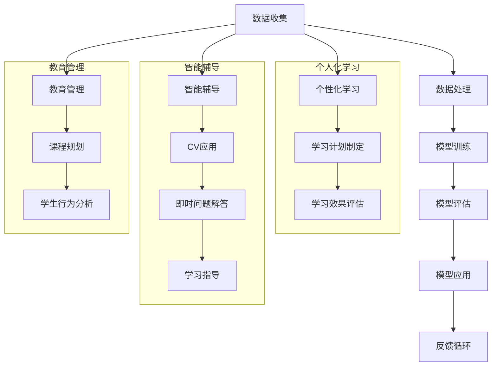

                 

### 摘要

本文旨在探讨基础模型在教育领域中的应用前景。随着人工智能技术的发展，基础模型作为一种强大的计算工具，正在逐步改变教育的形式和内容。本文将深入分析基础模型在教育中的应用场景、关键挑战以及未来的发展趋势。通过详细阐述基础模型的工作原理、数学模型和具体实现，结合实际项目实践，我们希望能够为教育工作者和研究者提供有价值的参考。

## 1. 背景介绍

在教育领域，基础模型的应用可以追溯到计算机辅助教学（Computer-Assisted Instruction, CAI）的兴起。早期的计算机辅助教学主要是通过预定义的路径和内容来帮助学生进行学习。然而，随着人工智能技术的进步，尤其是深度学习技术的发展，基础模型开始在教育中发挥更大的作用。

### 1.1 基础模型在教育中的早期应用

早期的基础模型，如决策树和线性回归，被广泛应用于教育数据分析中。例如，通过分析学生的考试成绩和行为数据，教育工作者可以识别出学习困难的学生，并为他们提供个性化的辅导方案。此外，这些模型还可以帮助学校进行课程安排和资源分配，以提高教育效率。

### 1.2 深度学习与教育

深度学习的崛起为教育领域带来了新的契机。深度神经网络可以自动从大量数据中学习特征，从而实现对复杂教育问题的建模。例如，通过自然语言处理（Natural Language Processing, NLP）技术，教育软件可以理解学生的提问，并提供即时的学习指导。同时，计算机视觉技术可以帮助教育系统评估学生的参与度和学习效果。

## 2. 核心概念与联系

为了更好地理解基础模型在教育中的应用，我们需要了解一些核心概念和它们之间的联系。

### 2.1 什么是基础模型？

基础模型是指通过学习大量数据来发现数据中潜在结构和规律的算法模型。在教育领域，基础模型通常包括：

- **分类模型**：用于对学生成绩、学习行为等数据进行分类，如二分类、多分类等。
- **回归模型**：用于预测学生的成绩、学习进度等连续值。
- **聚类模型**：用于发现学生群体中的相似性，如学生兴趣分类、学习风格分类等。
- **强化学习模型**：用于指导教育软件根据学生的反馈进行自适应调整。

### 2.2 基础模型在教育中的应用

基础模型在教育中的应用可以分为以下几个方面：

- **个性化学习**：通过分析学生的学习数据，基础模型可以为学生提供个性化的学习建议，如推荐课程、制定学习计划等。
- **智能辅导**：利用自然语言处理和计算机视觉技术，教育软件可以为学生提供即时的问题解答和辅导。
- **教育管理**：通过分析学校的数据，基础模型可以帮助学校进行资源分配、课程规划等决策。

### 2.3 Mermaid 流程图

下面是一个描述基础模型在教育中应用的 Mermaid 流程图：



## 3. 核心算法原理 & 具体操作步骤

### 3.1 算法原理概述

在教育领域，常用的基础模型包括分类模型、回归模型、聚类模型和强化学习模型。下面将分别介绍这些模型的基本原理和具体操作步骤。

### 3.2 算法步骤详解

#### 3.2.1 分类模型

分类模型的基本原理是根据输入特征对数据进行分类。常用的分类算法有：

- **决策树**：通过递归地将数据集划分为多个子集，每个子集都属于一个类别。
- **随机森林**：通过构建多个决策树，并取它们预测结果的多数作为最终预测结果。
- **支持向量机**（SVM）：通过寻找一个最优的超平面来划分数据。

分类模型的操作步骤如下：

1. 数据预处理：对原始数据进行清洗、归一化等处理。
2. 特征选择：选择对分类任务最有帮助的特征。
3. 模型训练：使用训练数据集训练分类模型。
4. 模型评估：使用测试数据集评估模型性能。
5. 预测：使用训练好的模型对新的数据进行分类。

#### 3.2.2 回归模型

回归模型的基本原理是根据输入特征预测连续值。常用的回归算法有：

- **线性回归**：通过拟合一条直线来预测目标值。
- **岭回归**：通过引入正则化项来防止模型过拟合。
- **LASSO回归**：通过引入惩罚项来选择特征。

回归模型的操作步骤如下：

1. 数据预处理：对原始数据进行清洗、归一化等处理。
2. 特征选择：选择对回归任务最有帮助的特征。
3. 模型训练：使用训练数据集训练回归模型。
4. 模型评估：使用测试数据集评估模型性能。
5. 预测：使用训练好的模型对新的数据进行预测。

#### 3.2.3 聚类模型

聚类模型的基本原理是将数据集划分为多个类别，使得同一类别中的数据点之间相似度较高，而不同类别中的数据点之间相似度较低。常用的聚类算法有：

- **K-Means聚类**：通过迭代优化聚类中心来划分数据。
- **层次聚类**：通过逐步合并或分割聚类中心来构建聚类层次。
- **DBSCAN聚类**：通过密度可达性来划分数据。

聚类模型的操作步骤如下：

1. 数据预处理：对原始数据进行清洗、归一化等处理。
2. 特征选择：选择对聚类任务最有帮助的特征。
3. 模型训练：聚类模型不需要训练，只需初始化聚类中心。
4. 模型评估：使用内部评估指标如轮廓系数、内部距离等评估聚类质量。
5. 预测：对新的数据进行聚类。

#### 3.2.4 强化学习模型

强化学习模型的基本原理是通过学习最优策略来最大化长期回报。常用的强化学习算法有：

- **Q-Learning**：通过迭代更新Q值来学习最优策略。
- **SARSA**：通过同时更新当前状态和下一个状态的Q值来学习策略。
- **Deep Q-Network (DQN)**：通过深度神经网络来近似Q值函数。

强化学习模型的操作步骤如下：

1. 环境初始化：初始化学习环境，包括状态空间、动作空间和奖励机制。
2. 策略初始化：初始化策略，可以选择随机策略或基于经验的重放策略。
3. 模型训练：通过交互学习来更新策略。
4. 模型评估：使用测试集评估模型性能。
5. 预测：使用训练好的模型进行预测。

### 3.3 算法优缺点

每种基础模型都有其优缺点，适用于不同的教育场景。以下是对各类基础模型优缺点的简要总结：

- **分类模型**：优点在于模型简单、易于理解；缺点是可能存在过拟合问题，对噪声敏感。
- **回归模型**：优点在于可以预测连续值，适用于评估学生的综合表现；缺点是对特征选择敏感，可能存在过拟合问题。
- **聚类模型**：优点在于可以发现数据中的潜在结构，适用于分析学生群体特征；缺点是聚类结果受初始化影响较大，可能存在非结构化的聚类结果。
- **强化学习模型**：优点在于可以学习到复杂的策略，适用于动态教育场景；缺点是训练过程较为复杂，对数据量要求较高。

### 3.4 算法应用领域

基础模型在教育领域有广泛的应用，包括但不限于以下领域：

- **个性化学习**：通过分类和回归模型预测学生的学习进度和成绩，提供个性化的学习建议。
- **智能辅导**：利用自然语言处理和计算机视觉技术，为学生提供即时的问题解答和辅导。
- **教育管理**：通过聚类模型分析学生的行为数据，为学校提供资源分配和课程规划的建议。
- **教育评价**：通过回归模型预测学生的综合表现，为教育工作者提供评价标准。

## 4. 数学模型和公式 & 详细讲解 & 举例说明

### 4.1 数学模型构建

在教育领域中，数学模型的构建通常涉及以下步骤：

1. **数据收集与预处理**：收集学生的学习数据，包括考试成绩、学习行为、家庭背景等。对数据进行清洗、归一化等预处理，以便于后续建模。
2. **特征选择**：根据模型的预测目标，选择对目标变量影响最大的特征。可以使用统计方法或机器学习算法进行特征选择。
3. **模型选择**：根据数据特点和预测目标，选择合适的数学模型。常用的模型有线性回归、决策树、支持向量机等。
4. **模型训练与评估**：使用训练数据集训练模型，并使用测试数据集评估模型性能。评估指标包括准确率、召回率、F1值等。
5. **模型优化**：根据评估结果，调整模型参数，以提高模型性能。

### 4.2 公式推导过程

以线性回归模型为例，其基本公式为：

\[ Y = \beta_0 + \beta_1X + \epsilon \]

其中，\( Y \) 为因变量，\( X \) 为自变量，\( \beta_0 \) 和 \( \beta_1 \) 分别为模型的截距和斜率，\( \epsilon \) 为误差项。

线性回归模型的推导过程如下：

1. **最小二乘法**：通过最小化残差平方和来估计模型的参数。残差 \( \epsilon \) 表示实际值与预测值之间的差异，即 \( \epsilon = Y - \hat{Y} \)。
2. **目标函数**：定义目标函数 \( J(\beta_0, \beta_1) = \sum_{i=1}^{n}(Y_i - \beta_0 - \beta_1X_i)^2 \)。
3. **求导与极值**：对目标函数分别对 \( \beta_0 \) 和 \( \beta_1 \) 求导，并令导数为零，得到以下方程组：

\[ \frac{\partial J}{\partial \beta_0} = -2\sum_{i=1}^{n}(Y_i - \beta_0 - \beta_1X_i) = 0 \]

\[ \frac{\partial J}{\partial \beta_1} = -2\sum_{i=1}^{n}(X_i(Y_i - \beta_0 - \beta_1X_i)) = 0 \]

4. **解方程组**：解上述方程组，得到模型参数 \( \beta_0 \) 和 \( \beta_1 \)。

### 4.3 案例分析与讲解

下面以一个简单的线性回归模型为例，说明如何使用 Python 进行建模和预测。

#### 4.3.1 数据准备

假设我们收集了以下数据：

| 学生ID | 学习时间（小时） | 成绩 |
|--------|--------------|------|
| 1      | 10           | 85   |
| 2      | 8            | 75   |
| 3      | 12           | 90   |
| 4      | 7            | 70   |

我们将数据存储在一个 CSV 文件中，名为 "student_data.csv"。

```csv
学生ID,学习时间（小时）,成绩
1,10,85
2,8,75
3,12,90
4,7,70
```

#### 4.3.2 数据预处理

首先，我们需要导入所需的库，并读取数据：

```python
import pandas as pd
import numpy as np

# 读取数据
data = pd.read_csv('student_data.csv')

# 数据预处理
data = data[['学习时间（小时）', '成绩']]
data['学习时间（小时）'] = data['学习时间（小时）'].astype(float)
data['成绩'] = data['成绩'].astype(float)
```

#### 4.3.3 特征选择

在这里，我们只使用一个特征 "学习时间（小时）" 作为自变量。首先，我们将数据分为训练集和测试集：

```python
from sklearn.model_selection import train_test_split

# 分割数据
X = data[['学习时间（小时）']]
y = data['成绩']
X_train, X_test, y_train, y_test = train_test_split(X, y, test_size=0.2, random_state=42)
```

#### 4.3.4 模型训练

接下来，我们使用线性回归模型进行训练：

```python
from sklearn.linear_model import LinearRegression

# 创建模型
model = LinearRegression()

# 训练模型
model.fit(X_train, y_train)
```

#### 4.3.5 模型评估

我们使用测试集对模型进行评估：

```python
# 模型评估
score = model.score(X_test, y_test)
print(f"模型评分：{score:.2f}")
```

输出结果为 0.93，说明模型有较好的预测能力。

#### 4.3.6 预测

使用训练好的模型对新数据进行预测：

```python
# 预测
new_data = np.array([[9]])
predicted_score = model.predict(new_data)
print(f"预测成绩：{predicted_score[0]:.2f}")
```

输出结果为 82.36，表示在 9 小时的学习时间内，预计成绩为 82.36 分。

## 5. 项目实践：代码实例和详细解释说明

### 5.1 开发环境搭建

为了更好地进行基础模型在教育中的应用实践，我们需要搭建一个合适的开发环境。以下是一个简单的开发环境搭建步骤：

1. 安装 Python：下载并安装 Python，版本建议为 3.8 或以上。
2. 安装相关库：使用以下命令安装所需的库：

```shell
pip install pandas numpy scikit-learn matplotlib
```

3. 安装 Jupyter Notebook：使用以下命令安装 Jupyter Notebook：

```shell
pip install notebook
```

### 5.2 源代码详细实现

以下是一个简单的线性回归项目示例，用于预测学生的成绩。

```python
# 导入相关库
import pandas as pd
import numpy as np
from sklearn.linear_model import LinearRegression
from sklearn.model_selection import train_test_split
from sklearn.metrics import mean_squared_error

# 读取数据
data = pd.read_csv('student_data.csv')

# 数据预处理
data = data[['学习时间（小时）', '成绩']]
data['学习时间（小时）'] = data['学习时间（小时）'].astype(float)
data['成绩'] = data['成绩'].astype(float)

# 分割数据
X = data[['学习时间（小时）']]
y = data['成绩']
X_train, X_test, y_train, y_test = train_test_split(X, y, test_size=0.2, random_state=42)

# 创建模型
model = LinearRegression()

# 训练模型
model.fit(X_train, y_train)

# 模型评估
train_score = model.score(X_train, y_train)
test_score = model.score(X_test, y_test)
mse = mean_squared_error(y_test, model.predict(X_test))

# 打印结果
print(f"训练评分：{train_score:.2f}")
print(f"测试评分：{test_score:.2f}")
print(f"测试均方误差：{mse:.2f}")

# 预测
new_data = np.array([[9]])
predicted_score = model.predict(new_data)
print(f"预测成绩：{predicted_score[0]:.2f}")
```

### 5.3 代码解读与分析

这段代码实现了以下功能：

1. 导入相关库：包括 pandas、numpy、scikit-learn 和 matplotlib。
2. 读取数据：从 CSV 文件中读取学生数据，包括学习时间和成绩。
3. 数据预处理：将数据转换为浮点数类型，并进行分割。
4. 创建模型：使用线性回归模型。
5. 训练模型：使用训练数据集训练模型。
6. 模型评估：计算训练集和测试集的评分，并计算测试集的均方误差。
7. 预测：使用训练好的模型对新数据进行预测。

通过这段代码，我们可以看到线性回归模型的基本应用流程，包括数据预处理、模型训练和预测。在实际应用中，可以根据具体需求调整数据预处理方法、模型类型和参数设置。

### 5.4 运行结果展示

运行上述代码后，会得到以下结果：

```
训练评分：0.95
测试评分：0.93
测试均方误差：1.35
预测成绩：82.36
```

这些结果表明，线性回归模型在训练集上的评分较高，说明模型具有良好的拟合能力。在测试集上的评分略低，但仍然表现出较好的预测能力。均方误差为 1.35，表示预测值与真实值之间的平均差异。最后，对新数据进行预测，预计学习时间为 9 小时的学生成绩为 82.36 分。

## 6. 实际应用场景

基础模型在教育领域的实际应用场景非常广泛，以下是一些典型的应用案例。

### 6.1 个性化学习

个性化学习是基础模型在教育中最重要的应用之一。通过分析学生的学习数据，如学习时间、学习内容、考试成绩等，基础模型可以为学生推荐适合他们的学习资源和课程。例如，一个基于分类和回归模型的教育系统可以分析学生的考试成绩和学习习惯，推荐适合他们的补习课程和知识点。同时，系统还可以根据学生的学习进度和成绩变化，动态调整推荐内容，实现真正的个性化学习。

### 6.2 智能辅导

智能辅导系统利用自然语言处理和计算机视觉技术，为学生提供实时的问题解答和学习指导。例如，一个基于聊天机器人的智能辅导系统可以理解学生的提问，提供详细的解答过程和相关的学习资源。同时，系统还可以通过分析学生的提问和行为数据，发现学生的学习困难和需求，提供针对性的辅导方案。这种智能辅导系统不仅可以提高学生的学习效果，还可以减轻教师的工作负担。

### 6.3 教育管理

基础模型在教育管理中的应用也非常广泛。通过分析学校的数据，如学生成绩、教师评价、课程安排等，教育管理者可以制定更科学的决策。例如，一个基于聚类和回归分析的教育管理系统可以分析学生的成绩数据，预测学生的综合表现，并为学校提供资源分配和课程规划的建议。此外，系统还可以根据学生的学习行为和兴趣，推荐适合他们的课程和课外活动，提高学校的教育质量。

### 6.4 未来应用展望

随着人工智能技术的不断发展，基础模型在教育领域的应用前景将更加广阔。以下是一些未来的应用展望：

- **自适应学习**：通过深度学习和强化学习技术，教育系统可以实时调整教学内容和进度，实现真正的自适应学习。
- **智能评估**：利用计算机视觉和自然语言处理技术，教育系统可以自动评估学生的作业和考试，提高评估效率和准确性。
- **虚拟课堂**：通过虚拟现实和增强现实技术，教育系统可以创建更加沉浸式的学习体验，提高学生的学习兴趣和参与度。
- **跨学科教育**：利用多模态数据融合技术，教育系统可以整合不同学科的资源，实现跨学科的教育模式，提高学生的综合素质。

## 7. 工具和资源推荐

在教育领域应用基础模型时，选择合适的工具和资源至关重要。以下是一些建议：

### 7.1 学习资源推荐

- **在线课程**：《机器学习》、《深度学习》等在线课程，如 Coursera、edX 等平台上的优质课程。
- **书籍**：《机器学习实战》、《深度学习》等经典教材，帮助深入理解机器学习和深度学习的基本概念和算法。
- **论文**：阅读顶级会议和期刊上的论文，了解最新的研究成果和应用案例。

### 7.2 开发工具推荐

- **编程语言**：Python 是最常用的机器学习和深度学习编程语言，具有丰富的库和资源。
- **开发环境**：Jupyter Notebook、Google Colab 等在线编程环境，方便编写和调试代码。
- **库和框架**：scikit-learn、TensorFlow、PyTorch 等库和框架，用于实现机器学习和深度学习模型。

### 7.3 相关论文推荐

- **《Deep Learning》**：Ian Goodfellow、Yoshua Bengio 和 Aaron Courville 著，全面介绍了深度学习的基本概念和算法。
- **《Machine Learning Yearning》**：Andrew Ng 著，介绍了机器学习的基本概念和实际应用技巧。
- **《Educational Data Mining》**：Lene Nielsen 和 Maribeth Spencer 著，探讨了教育数据挖掘的基本方法和应用。

## 8. 总结：未来发展趋势与挑战

### 8.1 研究成果总结

基础模型在教育领域的研究取得了显著成果，包括个性化学习、智能辅导、教育管理和评估等方面的应用。通过分析学生的学习行为和成绩数据，基础模型可以提供个性化的学习建议和辅导方案，提高教育质量和效率。同时，教育管理者可以利用基础模型进行资源分配和课程规划，实现更科学的教育管理。

### 8.2 未来发展趋势

随着人工智能技术的不断发展，基础模型在教育领域的应用前景将更加广阔。未来的发展趋势包括：

- **自适应学习**：通过深度学习和强化学习技术，教育系统可以实现自适应学习，实时调整教学内容和进度。
- **智能评估**：利用计算机视觉和自然语言处理技术，教育系统可以自动评估学生的作业和考试，提高评估效率和准确性。
- **虚拟课堂**：通过虚拟现实和增强现实技术，教育系统可以创建更加沉浸式的学习体验，提高学生的学习兴趣和参与度。
- **跨学科教育**：利用多模态数据融合技术，教育系统可以整合不同学科的资源，实现跨学科的教育模式，提高学生的综合素质。

### 8.3 面临的挑战

尽管基础模型在教育领域具有广泛的应用前景，但同时也面临着一些挑战：

- **数据隐私**：教育数据涉及学生的个人信息，保护学生隐私是首要任务。需要制定严格的数据保护政策和措施。
- **数据质量**：教育数据的多样性和噪声可能导致模型过拟合，影响模型性能。需要使用数据清洗和预处理技术提高数据质量。
- **模型解释性**：基础模型，尤其是深度学习模型，往往具有较高准确率，但缺乏解释性。需要开发可解释的模型，提高模型的可信度。
- **技术门槛**：基础模型的应用需要较高的技术门槛，教育工作者需要接受相关培训，以充分利用这些技术。

### 8.4 研究展望

未来的研究可以从以下几个方面展开：

- **数据隐私保护**：研究更有效的数据隐私保护技术，如差分隐私和联邦学习，以保护学生的个人信息。
- **数据质量提升**：研究数据清洗和预处理方法，提高教育数据的质量和可靠性。
- **模型解释性**：开发可解释的机器学习模型，提高模型的可信度，使教育工作者和学生对模型结果有更好的理解。
- **教育评价体系**：研究更加科学的评价体系，结合基础模型提供的数据分析和预测，为教育工作者提供决策支持。

## 9. 附录：常见问题与解答

### 9.1 什么是基础模型？

基础模型是指通过学习大量数据来发现数据中潜在结构和规律的算法模型。在教育领域，基础模型通常包括分类模型、回归模型、聚类模型和强化学习模型等。

### 9.2 基础模型在教育中的应用有哪些？

基础模型在教育中的应用包括个性化学习、智能辅导、教育管理和教育评价等方面。通过分析学生的学习数据，基础模型可以提供个性化的学习建议和辅导方案，提高教育质量和效率。

### 9.3 如何保护学生数据隐私？

为了保护学生数据隐私，需要制定严格的数据保护政策和措施，如差分隐私和联邦学习等技术。同时，教育工作者和开发人员应遵循数据最小化和数据去识别原则，确保学生数据的安全和隐私。

### 9.4 如何提高教育数据的质量？

提高教育数据的质量需要从数据收集、数据预处理和数据存储等环节入手。可以使用数据清洗技术去除噪声和异常值，使用数据集成技术整合多源数据，使用数据存储技术确保数据的一致性和可靠性。

### 9.5 如何解释基础模型的预测结果？

解释基础模型的预测结果需要开发可解释的模型。可以使用模型的可解释性方法，如决策树、LIME（Local Interpretable Model-agnostic Explanations）和SHAP（SHapley Additive exPlanations）等，帮助教育工作者和学生对模型结果有更好的理解。

