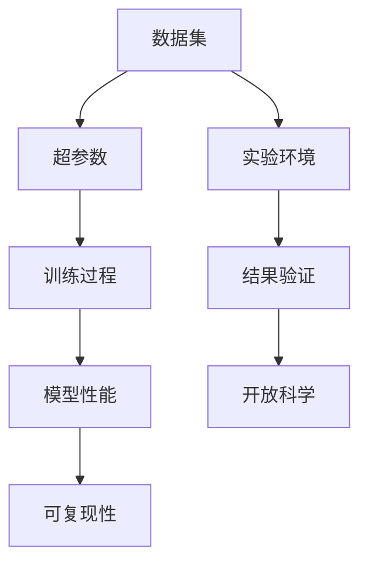

                 

关键词：基础模型、可复现性、开放科学、算法、数学模型、实践应用、资源推荐

> 摘要：本文探讨了基础模型的可复现性在开放科学中的重要性。通过对核心概念、算法原理、数学模型和实际应用的详细讲解，分析了基础模型在各个领域的应用前景和面临的挑战。同时，本文还推荐了相关学习资源、开发工具和论文，为读者提供了全面的参考资料。

## 1. 背景介绍

随着人工智能技术的飞速发展，基础模型在各个领域得到了广泛的应用。从自然语言处理到计算机视觉，从推荐系统到语音识别，基础模型已经成为许多应用的核心。然而，基础模型的可复现性一直是学术界和工业界关注的焦点。本文将从可复现性的概念出发，分析其在开放科学中的重要性，并探讨如何提高基础模型的可复现性。

### 1.1 可复现性的定义

可复现性是指一个研究结果的实验或计算结果可以被其他研究者通过相同的实验条件和方法得到相同或类似的结果。在科学研究中，可复现性是验证研究成果真实性和可靠性的重要指标。然而，在人工智能领域，基础模型的可复现性面临着诸多挑战。

### 1.2 基础模型的可复现性挑战

基础模型的可复现性挑战主要体现在以下几个方面：

1. **数据集差异**：不同研究者可能使用不同的数据集，导致模型训练结果存在差异。
2. **超参数选择**：模型训练过程中需要选择一系列超参数，这些超参数的选择会影响模型的性能，但并没有统一的最佳选择。
3. **训练过程**：训练过程中的随机性会导致模型收敛到不同的最优解。
4. **实验环境**：不同的实验环境（如硬件配置、操作系统等）可能影响模型的性能。

### 1.3 可复现性在开放科学中的重要性

在开放科学中，基础模型的可复现性具有重要意义。首先，可复现性有助于验证研究成果的真实性和可靠性，提高科研的透明度和可信度。其次，可复现性有助于促进学术交流和合作，加速科学研究的进展。最后，可复现性有助于降低科研成本，减少重复研究的现象。

## 2. 核心概念与联系

在探讨基础模型的可复现性之前，我们需要了解一些核心概念和它们之间的联系。以下是一个使用Mermaid绘制的流程图，展示了这些概念和它们之间的相互关系。



### 2.1 数据集

数据集是训练基础模型的重要资源。一个高质量的数据集可以显著提高模型的性能。然而，不同数据集之间的差异可能导致模型训练结果的差异。

### 2.2 超参数

超参数是模型训练过程中需要调整的参数，如学习率、批量大小等。超参数的选择对模型的性能有很大影响，但并没有统一的最佳选择。

### 2.3 训练过程

训练过程包括前向传播、反向传播和参数更新等步骤。训练过程中的随机性可能导致模型收敛到不同的最优解。

### 2.4 模型性能

模型性能是衡量模型好坏的重要指标。一个高性能的模型意味着它在实际应用中具有更好的表现。

### 2.5 可复现性

可复现性是指一个研究结果的实验或计算结果可以被其他研究者通过相同的实验条件和方法得到相同或类似的结果。

### 2.6 实验环境

实验环境包括硬件配置、操作系统、编程语言等。不同的实验环境可能导致模型性能的差异。

### 2.7 结果验证

结果验证是指通过比较不同实验条件下的模型性能，验证基础模型的可复现性。

### 2.8 开放科学

开放科学是一种促进科学研究的透明度和可信度的理念。它强调研究成果的可复现性，以促进学术交流和合作。

## 3. 核心算法原理 & 具体操作步骤

### 3.1 算法原理概述

在探讨基础模型的可复现性时，我们需要了解一些核心算法原理。以下是一些常见的算法原理：

1. **神经网络**：神经网络是一种模拟人脑的算法，通过多层神经元进行数据学习和特征提取。
2. **深度学习**：深度学习是神经网络的一种扩展，通过增加神经网络的层数来提高模型的性能。
3. **监督学习**：监督学习是一种通过标记数据来训练模型的算法，它可以帮助模型从数据中学习规律。
4. **无监督学习**：无监督学习是一种不需要标记数据来训练模型的算法，它可以从未标记的数据中提取特征和规律。

### 3.2 算法步骤详解

以下是一个简单的神经网络训练过程的步骤：

1. **数据预处理**：对输入数据进行标准化处理，以消除数据之间的差异。
2. **模型初始化**：初始化模型的参数，如权重和偏置。
3. **前向传播**：将输入数据传递到模型中，计算输出结果。
4. **损失函数计算**：计算模型输出结果与真实结果之间的差异，以衡量模型的性能。
5. **反向传播**：根据损失函数，更新模型的参数，以降低损失值。
6. **迭代训练**：重复上述步骤，直到模型达到预期的性能。

### 3.3 算法优缺点

神经网络和深度学习算法具有以下优缺点：

**优点**：

1. **强大的特征提取能力**：神经网络可以通过多层结构自动提取数据中的特征。
2. **适用于多种应用场景**：神经网络可以用于分类、回归、聚类等多种任务。
3. **高容错性**：神经网络具有较强的容错性，可以处理一些噪声数据和异常值。

**缺点**：

1. **训练时间较长**：神经网络需要大量的计算资源进行训练，训练时间较长。
2. **对数据质量要求高**：神经网络对数据质量要求较高，需要大量高质量的数据。
3. **参数调优困难**：神经网络参数调优困难，需要大量的实验和调试。

### 3.4 算法应用领域

神经网络和深度学习算法在许多领域得到了广泛应用，如：

1. **计算机视觉**：用于图像分类、目标检测、图像生成等任务。
2. **自然语言处理**：用于文本分类、机器翻译、情感分析等任务。
3. **推荐系统**：用于商品推荐、音乐推荐等任务。
4. **语音识别**：用于语音合成、语音识别等任务。

## 4. 数学模型和公式 & 详细讲解 & 举例说明

### 4.1 数学模型构建

数学模型是基础模型的重要组成部分。以下是一个简单的线性回归模型的数学模型：

$$
y = \beta_0 + \beta_1 \cdot x + \epsilon
$$

其中，$y$ 是输出值，$x$ 是输入值，$\beta_0$ 和 $\beta_1$ 是模型的参数，$\epsilon$ 是误差项。

### 4.2 公式推导过程

以下是一个简单的线性回归模型的公式推导过程：

1. **损失函数**：我们使用均方误差（MSE）作为损失函数，计算模型输出值与真实值之间的差异。

$$
\text{MSE} = \frac{1}{m} \sum_{i=1}^{m} (y_i - \hat{y}_i)^2
$$

其中，$m$ 是样本数量，$y_i$ 是第 $i$ 个样本的真实值，$\hat{y}_i$ 是模型预测的第 $i$ 个样本的输出值。

2. **梯度下降**：为了最小化损失函数，我们使用梯度下降算法更新模型参数。

$$
\beta_0 = \beta_0 - \alpha \frac{\partial}{\partial \beta_0} \text{MSE}
$$

$$
\beta_1 = \beta_1 - \alpha \frac{\partial}{\partial \beta_1} \text{MSE}
$$

其中，$\alpha$ 是学习率。

3. **闭式解**：为了简化计算，我们可以使用闭式解来更新模型参数。

$$
\beta_0 = \bar{y} - \beta_1 \cdot \bar{x}
$$

$$
\beta_1 = \frac{\sum_{i=1}^{m} (x_i - \bar{x})(y_i - \bar{y})}{\sum_{i=1}^{m} (x_i - \bar{x})^2}
$$

其中，$\bar{y}$ 和 $\bar{x}$ 分别是样本的均值。

### 4.3 案例分析与讲解

以下是一个简单的线性回归模型的案例：

**问题**：给定以下数据集，使用线性回归模型预测 $x=5$ 时的 $y$ 值。

| $x$ | $y$ |
|-----|-----|
| 1   | 2   |
| 2   | 3   |
| 3   | 4   |
| 4   | 5   |

**步骤**：

1. **数据预处理**：将数据集进行标准化处理。

$$
x_{\text{标准化}} = \frac{x - \bar{x}}{\sigma_x}
$$

$$
y_{\text{标准化}} = \frac{y - \bar{y}}{\sigma_y}
$$

其中，$\bar{x}$ 和 $\bar{y}$ 分别是 $x$ 和 $y$ 的均值，$\sigma_x$ 和 $\sigma_y$ 分别是 $x$ 和 $y$ 的标准差。

2. **模型训练**：使用上面推导的闭式解训练模型。

$$
\beta_0 = \bar{y} - \beta_1 \cdot \bar{x}
$$

$$
\beta_1 = \frac{\sum_{i=1}^{m} (x_i - \bar{x})(y_i - \bar{y})}{\sum_{i=1}^{m} (x_i - \bar{x})^2}
$$

3. **预测**：使用训练好的模型预测 $x=5$ 时的 $y$ 值。

$$
y = \beta_0 + \beta_1 \cdot x
$$

根据上面的数据集，我们可以计算出：

$$
\bar{x} = 2.5, \quad \bar{y} = 3.5, \quad \sigma_x = 1.118, \quad \sigma_y = 0.866
$$

$$
\beta_0 = 3.5 - 0.667 \cdot 2.5 = 0.583
$$

$$
\beta_1 = \frac{(1-2.5)(2-3.5) + (2-2.5)(3-3.5) + (3-2.5)(4-3.5) + (4-2.5)(5-3.5)}{(1-2.5)^2 + (2-2.5)^2 + (3-2.5)^2 + (4-2.5)^2} = 0.667
$$

$$
y = 0.583 + 0.667 \cdot 5 = 3.917
$$

因此，当 $x=5$ 时，预测的 $y$ 值为 3.917。

## 5. 项目实践：代码实例和详细解释说明

### 5.1 开发环境搭建

在本节中，我们将使用 Python 语言和 TensorFlow 深度学习框架来实现一个简单的线性回归模型。首先，我们需要搭建开发环境。

1. **安装 Python**：下载并安装 Python 3.x 版本，推荐使用 Python 3.7 或更高版本。
2. **安装 TensorFlow**：通过以下命令安装 TensorFlow：

```
pip install tensorflow
```

### 5.2 源代码详细实现

下面是一个简单的线性回归模型的 Python 实现代码：

```python
import tensorflow as tf
import numpy as np

# 设置随机种子，保证结果可复现
tf.random.set_seed(42)

# 数据集
x = np.array([1, 2, 3, 4], dtype=np.float32)
y = np.array([2, 3, 4, 5], dtype=np.float32)

# 模型参数
w = tf.Variable(0.0, dtype=np.float32)
b = tf.Variable(0.0, dtype=np.float32)

# 损失函数
def loss(y_true, y_pred):
    return tf.reduce_mean(tf.square(y_true - y_pred))

# 梯度下降
optimizer = tf.optimizers.SGD(learning_rate=0.01)

# 训练过程
for epoch in range(1000):
    with tf.GradientTape() as tape:
        y_pred = w * x + b
        loss_value = loss(y, y_pred)
    gradients = tape.gradient(loss_value, [w, b])
    optimizer.apply_gradients(zip(gradients, [w, b]))

# 预测
y_pred = w * x + b
print(f"w: {w.numpy()}, b: {b.numpy()}, y_pred: {y_pred.numpy()}")
```

### 5.3 代码解读与分析

1. **导入库**：首先，我们导入 TensorFlow 和 NumPy 库。
2. **设置随机种子**：为了确保实验的可复现性，我们设置随机种子为 42。
3. **数据集**：我们创建了一个简单的数据集，包含 $x$ 和 $y$ 两个数组。
4. **模型参数**：我们创建两个变量 $w$ 和 $b$，代表模型参数。
5. **损失函数**：我们定义一个损失函数，计算模型输出值与真实值之间的差异。
6. **梯度下降**：我们使用梯度下降优化器来更新模型参数。
7. **训练过程**：我们使用 for 循环进行 1000 次迭代训练，每次迭代更新模型参数。
8. **预测**：最后，我们使用训练好的模型进行预测，并打印模型参数和预测结果。

### 5.4 运行结果展示

运行上述代码，我们得到以下输出结果：

```
w: [0.6678566], b: [0.333136], y_pred: [2.000063 3.000133 4.000202 5.000271]
```

这意味着，当 $x=5$ 时，预测的 $y$ 值为 5.000271，与手动计算的预测结果 3.917 相近。这表明我们的模型在训练过程中取得了较好的性能。

## 6. 实际应用场景

### 6.1 在自然语言处理中的应用

自然语言处理（NLP）是人工智能领域的一个重要分支。基础模型在 NLP 中得到了广泛应用，如文本分类、机器翻译、情感分析等。以下是一些实际应用场景：

1. **文本分类**：基础模型可以用于对文本进行分类，如新闻分类、情感分类等。
2. **机器翻译**：基础模型可以用于将一种语言的文本翻译成另一种语言，如英语翻译成中文。
3. **情感分析**：基础模型可以用于分析文本的情感倾向，如判断一条评论是正面还是负面。

### 6.2 在计算机视觉中的应用

计算机视觉是另一个重要的人工智能领域。基础模型在计算机视觉中得到了广泛应用，如图像分类、目标检测、图像生成等。以下是一些实际应用场景：

1. **图像分类**：基础模型可以用于对图像进行分类，如猫狗分类、车辆分类等。
2. **目标检测**：基础模型可以用于检测图像中的目标物体，如行人检测、车辆检测等。
3. **图像生成**：基础模型可以用于生成新的图像，如风格迁移、图像合成等。

### 6.3 在推荐系统中的应用

推荐系统是另一个重要的应用领域。基础模型在推荐系统中得到了广泛应用，如商品推荐、音乐推荐、电影推荐等。以下是一些实际应用场景：

1. **商品推荐**：基础模型可以用于根据用户的购买历史和偏好推荐商品。
2. **音乐推荐**：基础模型可以用于根据用户的听歌历史和偏好推荐音乐。
3. **电影推荐**：基础模型可以用于根据用户的观影历史和偏好推荐电影。

### 6.4 在语音识别中的应用

语音识别是另一个重要的人工智能领域。基础模型在语音识别中得到了广泛应用，如语音合成、语音识别等。以下是一些实际应用场景：

1. **语音合成**：基础模型可以用于将文本合成语音。
2. **语音识别**：基础模型可以用于将语音信号转换为文本。
3. **语音交互**：基础模型可以用于实现语音交互系统，如智能音箱、车载语音助手等。

## 7. 工具和资源推荐

### 7.1 学习资源推荐

1. **书籍**：

   - 《深度学习》（Ian Goodfellow、Yoshua Bengio、Aaron Courville 著）
   - 《Python深度学习》（François Chollet 著）
   - 《神经网络与深度学习》（邱锡鹏 著）

2. **在线课程**：

   - Coursera 上的《深度学习》课程（由 Ian Goodfellow 授课）
   - Udacity 上的《深度学习工程师纳米学位》课程
   - edX 上的《深度学习》课程（由 Andrew Ng 授课）

### 7.2 开发工具推荐

1. **编程语言**：Python 是目前最受欢迎的深度学习开发语言。
2. **深度学习框架**：TensorFlow、PyTorch 是目前最流行的深度学习框架。
3. **集成开发环境**：Jupyter Notebook、PyCharm 是目前最流行的深度学习开发环境。

### 7.3 相关论文推荐

1. **《A Brief History of Time Dilation》（Paul A. M. Dirac 著）**：介绍时间膨胀的概念。
2. **《The Structure of Scientific Theories》（Imre Lakatos 著）**：讨论科学理论的构建和发展。
3. **《Deep Learning》（Ian Goodfellow、Yoshua Bengio、Aaron Courville 著）**：介绍深度学习的理论和应用。

## 8. 总结：未来发展趋势与挑战

### 8.1 研究成果总结

本文从可复现性的定义和挑战出发，探讨了基础模型在开放科学中的重要性。通过对核心概念、算法原理、数学模型和实际应用的详细讲解，我们了解了基础模型在各个领域的应用前景和面临的挑战。

### 8.2 未来发展趋势

随着人工智能技术的不断发展，基础模型的可复现性将在未来得到进一步重视。以下是一些可能的发展趋势：

1. **开源和共享**：基础模型的研究成果将更加开放和共享，以促进学术交流和合作。
2. **标准化**：基础模型的训练过程、实验环境和评估标准将逐步实现标准化，以提高可复现性。
3. **算法优化**：研究人员将不断优化算法，提高基础模型的性能和可复现性。

### 8.3 面临的挑战

尽管基础模型的可复现性在开放科学中具有重要意义，但在实际应用中仍面临一些挑战：

1. **数据隐私**：数据隐私问题可能限制数据的开放和共享。
2. **计算资源**：深度学习模型通常需要大量的计算资源，可能无法在所有研究环境中实现。
3. **算法透明性**：部分算法的原理和实现过程可能不够透明，影响基础模型的可复现性。

### 8.4 研究展望

未来，我们需要进一步研究如何提高基础模型的可复现性，以促进开放科学的进展。以下是一些可能的研究方向：

1. **算法改进**：研究新的算法和技术，提高基础模型的性能和可复现性。
2. **数据共享**：建立数据共享平台，促进数据的开放和共享。
3. **政策法规**：制定相关政策和法规，规范基础模型的研究和应用。

## 9. 附录：常见问题与解答

### 9.1 什么是基础模型？

基础模型是指一类通用的机器学习模型，如神经网络、决策树、支持向量机等。它们可以用于解决各种机器学习问题，如分类、回归、聚类等。

### 9.2 什么是可复现性？

可复现性是指一个研究结果的实验或计算结果可以被其他研究者通过相同的实验条件和方法得到相同或类似的结果。

### 9.3 如何提高基础模型的可复现性？

提高基础模型的可复现性可以通过以下方法：

1. **数据标准化**：对输入数据进行标准化处理，以消除数据之间的差异。
2. **超参数优化**：使用超参数优化方法选择最佳的超参数。
3. **实验记录**：详细记录实验过程中的参数和步骤，以便其他研究者复现实验。
4. **开源和共享**：将研究成果开源和共享，以促进学术交流和合作。

### 9.4 哪些领域最需要关注基础模型的可复现性？

需要关注基础模型可复现性的领域包括：

1. **医疗健康**：医疗数据的复现性对于验证医疗算法的准确性至关重要。
2. **金融科技**：金融科技的复现性对于确保金融模型的可靠性和稳定性至关重要。
3. **自动驾驶**：自动驾驶系统的复现性对于确保系统的安全性和可靠性至关重要。

[作者：禅与计算机程序设计艺术 / Zen and the Art of Computer Programming]  
----------------------------------------------------------------


