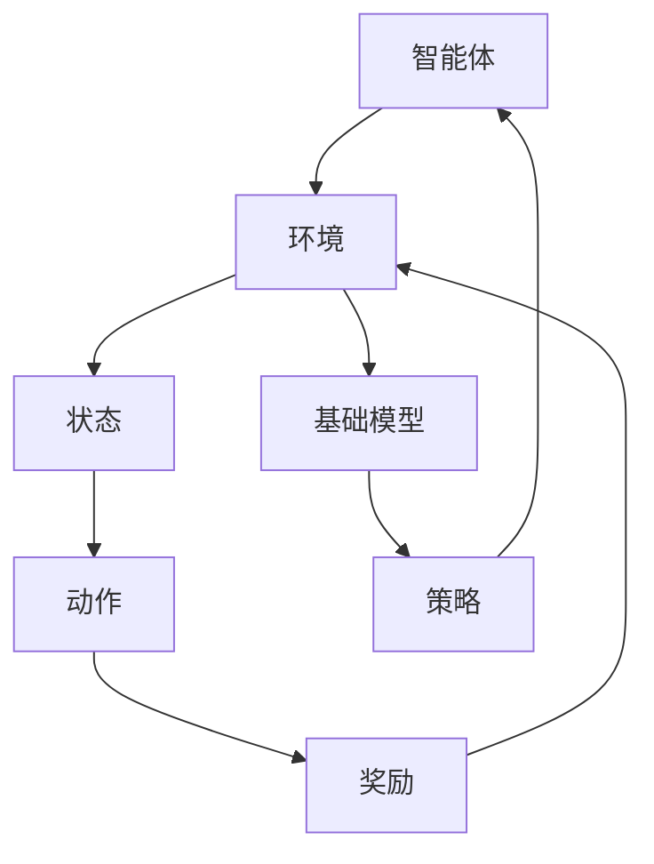

                 

关键词：强化学习、基础模型、应用、算法、数学模型、实践、代码实例、实际场景、未来展望

> 摘要：本文将探讨基础模型的强化学习应用，从背景介绍、核心概念与联系、核心算法原理、数学模型和公式、项目实践、实际应用场景、工具和资源推荐以及未来发展趋势与挑战等多个方面进行详细分析，旨在为读者提供一个全面了解和掌握强化学习在实际应用中的方法论。

## 1. 背景介绍

强化学习（Reinforcement Learning，RL）作为机器学习的一个重要分支，近年来在人工智能领域取得了显著的进展。它通过智能体（Agent）在与环境（Environment）的交互中，不断学习最优策略（Policy），以实现特定的目标。与传统机器学习方法不同，强化学习更注重于决策过程和长期的回报（Reward），这使得它成为解决动态决策问题和复杂环境中的重要工具。

随着深度学习（Deep Learning）技术的发展，深度强化学习（Deep Reinforcement Learning，DRL）成为强化学习的重要分支。深度强化学习结合了深度学习和强化学习的优势，能够处理高维输入和复杂的决策问题。基础模型（Base Model）作为深度强化学习的关键组成部分，对于提升智能体学习效率和性能至关重要。

本文将重点探讨基础模型在强化学习中的应用，从理论到实践进行全面阐述，帮助读者深入理解基础模型的工作原理以及如何在实际项目中应用。

## 2. 核心概念与联系

### 2.1 强化学习基础概念

在强化学习中，核心概念包括智能体、环境、状态（State）、动作（Action）和奖励（Reward）。智能体是执行动作、接收奖励并学习策略的实体。环境是智能体执行动作的场所，它决定了状态的转移和奖励的分配。状态是环境的一种描述，它包含了智能体在某一时刻所面临的所有信息。动作是智能体对状态的响应，它决定了智能体下一步的行为。奖励是智能体执行动作后环境给出的评价，它用于指导智能体学习最优策略。

### 2.2 基础模型概念

基础模型是指用于表示智能体策略的模型。在强化学习中，基础模型通常是一个神经网络，它接收状态作为输入，输出相应的动作概率分布。基础模型的好坏直接影响了智能体的学习效率和性能。一个优秀的基
<|assistant|>础模型应该具有以下特点：

1. **高泛化能力**：能够在不同环境中保持良好的性能。
2. **强鲁棒性**：对状态输入的噪声和异常值具有较强的抵抗能力。
3. **快速收敛**：能够在较短的时间内学习到最优策略。

### 2.3 基础模型与强化学习的关系

基础模型在强化学习中起着至关重要的作用。它不仅决定了智能体的策略，还影响了智能体的学习过程。通过优化基础模型，可以提高智能体的学习效率和性能。具体来说，基础模型与强化学习之间的关系如下：

1. **策略学习**：基础模型通过学习状态和动作之间的映射关系，生成智能体的策略。
2. **价值函数学习**：基础模型可以同时学习状态价值函数和动作价值函数，从而更好地指导智能体决策。
3. **探索与利用**：基础模型在平衡探索和利用时起着关键作用，通过调整策略的探索程度，智能体能够在不确定性环境中更好地学习。

### 2.4 Mermaid 流程图

为了更直观地展示基础模型与强化学习之间的关系，我们可以使用 Mermaid 流程图来描述核心概念和流程。



在该流程图中，智能体与环境进行交互，通过基础模型生成策略，并根据奖励进行调整。这一过程不断循环，直到智能体学习到最优策略。

## 3. 核心算法原理 & 具体操作步骤

### 3.1 算法原理概述

强化学习算法主要分为值函数方法、策略梯度方法和演员-评论家方法。基础模型通常用于策略梯度方法和演员-评论家方法中。以下分别介绍这两种方法的核心算法原理。

### 3.2 策略梯度方法

策略梯度方法通过直接优化策略梯度来学习最优策略。其基本思想是，根据智能体在环境中的表现，调整策略参数，使得策略更加接近最优策略。

具体步骤如下：

1. 初始化策略参数。
2. 智能体在环境中执行动作，并收集数据。
3. 使用收集的数据计算策略梯度。
4. 更新策略参数。
5. 重复步骤2-4，直到策略收敛。

### 3.3 演员-评论家方法

演员-评论家方法将强化学习分为两个子任务：演员（Actor）负责生成动作，评论家（Critic）负责评估动作的好坏。基础模型分别用于演员和评论家，从而实现协同优化。

具体步骤如下：

1. 初始化演员和评论家的参数。
2. 演员根据当前状态生成动作。
3. 评论家评估生成的动作，并计算回报。
4. 更新演员的参数，以生成更好的动作。
5. 更新评论家的参数，以更准确地评估动作。
6. 重复步骤2-5，直到演员和评论家收敛。

### 3.4 算法优缺点

策略梯度方法的优点包括：

1. **简单有效**：直接优化策略梯度，算法结构简单。
2. **快速收敛**：在许多情况下，策略梯度方法能够快速收敛到最优策略。

策略梯度方法的缺点包括：

1. **方差较大**：策略梯度方法的方差较大，可能导致训练不稳定。
2. **不适用于连续动作**：策略梯度方法主要针对离散动作，对于连续动作的问题，需要使用特殊的算法，如基于值的优化方法。

演员-评论家方法的优点包括：

1. **稳定性**：通过分离演员和评论家，降低了算法的方差，提高了稳定性。
2. **适用于连续动作**：演员-评论家方法可以处理连续动作的问题。

演员-评论家方法的缺点包括：

1. **计算复杂度较高**：演员-评论家方法涉及两个子任务，计算复杂度较高。

### 3.5 算法应用领域

策略梯度方法和演员-评论家方法在许多领域都有广泛的应用，包括：

1. **游戏**：如围棋、国际象棋等。
2. **机器人**：如自动驾驶、机器人控制等。
3. **金融**：如股票交易、风险管理等。
4. **推荐系统**：如基于用户行为的个性化推荐等。

## 4. 数学模型和公式 & 详细讲解 & 举例说明

### 4.1 数学模型构建

在强化学习中，常用的数学模型包括马尔可夫决策过程（MDP）和部分可观测马尔可夫决策过程（POMDP）。

#### 4.1.1 马尔可夫决策过程（MDP）

MDP是一个五元组 \((S, A, P, R, \gamma)\)，其中：

- \(S\) 是状态空间。
- \(A\) 是动作空间。
- \(P\) 是状态转移概率矩阵。
- \(R\) 是奖励函数。
- \(\gamma\) 是折扣因子。

#### 4.1.2 部分可观测马尔可夫决策过程（POMDP）

POMDP是MDP的扩展，它在状态空间上增加了不确定性。POMDP是一个六元组 \((S, A, P, R, \gamma, Z)\)，其中：

- \(Z\) 是观测空间。

### 4.2 公式推导过程

在强化学习中，常用的目标函数是期望回报（Expected Return）和策略梯度（Policy Gradient）。

#### 4.2.1 期望回报

期望回报是一个智能体在执行某一策略下的长期回报。其公式为：

$$
J(\theta) = \sum_{s \in S} p(s|\theta) \sum_{a \in A} r(s, a) p(a|\theta)
$$

其中，\(\theta\) 是策略参数，\(p(s|\theta)\) 是状态概率分布，\(p(a|\theta)\) 是动作概率分布。

#### 4.2.2 策略梯度

策略梯度是一个用于优化策略参数的梯度。其公式为：

$$
\nabla_\theta J(\theta) = \sum_{s \in S} \sum_{a \in A} \left( p(s, a|\theta) - p(a|\theta) \right) \nabla_\theta p(a|\theta)
$$

其中，\(p(s, a|\theta)\) 是状态-动作概率分布。

### 4.3 案例分析与讲解

#### 4.3.1 Q-Learning

Q-Learning是强化学习的一种常见算法，它通过优化Q值（状态-动作值函数）来学习最优策略。Q值的公式为：

$$
Q(s, a) = \sum_{s' \in S} r(s, a, s') + \gamma \sum_{a' \in A} Q(s', a')
$$

其中，\(r(s, a, s')\) 是从状态 \(s\) 执行动作 \(a\) 到状态 \(s'\) 的即时奖励。

Q-Learning的更新公式为：

$$
Q(s, a) \leftarrow Q(s, a) + \alpha [r(s, a, s') + \gamma \max_{a'} Q(s', a') - Q(s, a)]
$$

其中，\(\alpha\) 是学习率。

#### 4.3.2 Deep Q-Network（DQN）

DQN是Q-Learning的深度学习版本，它使用神经网络来近似Q值函数。DQN的基本思想是：

1. 使用经验回放（Experience Replay）来避免策略偏差。
2. 使用固定目标网络（Target Network）来稳定训练过程。

DQN的更新公式为：

$$
\theta \leftarrow \theta + \alpha [r(s, a) + \gamma \max_{a'} \hat{Q}(s', a') - Q(s, a)]
$$

其中，\(\hat{Q}(s', a')\) 是目标网络的输出。

## 5. 项目实践：代码实例和详细解释说明

### 5.1 开发环境搭建

为了实践强化学习应用，我们首先需要搭建开发环境。以下是搭建Python开发环境的基本步骤：

1. 安装Python 3.6及以上版本。
2. 安装pip，Python的包管理工具。
3. 使用pip安装TensorFlow 2.x，强化学习的基础库。
4. 安装其他必要的依赖库，如NumPy、Pandas等。

### 5.2 源代码详细实现

以下是使用TensorFlow实现一个简单的强化学习案例：智能体在环境中学习走迷宫。

```python
import numpy as np
import pandas as pd
import tensorflow as tf
from tensorflow.keras import layers

# 定义环境
class MazeEnv:
    def __init__(self):
        self.states = [(0, 0), (0, 1), (0, 2), (1, 0), (1, 1), (1, 2), (2, 0), (2, 1), (2, 2)]
        self.actions = ['up', 'down', 'left', 'right']
        self.rewards = {(-1, 1): 10, (0, 0): 5, (0, -1): 0, (-1, 0): 0, (1, 0): 0, (0, 1): 0}
        self.start_state = (0, 0)
        self.target_state = (2, 2)

    def step(self, action):
        action = self.actions.index(action)
        next_state = None
        reward = 0
        if action == 0:  # up
            next_state = (self.start_state[0] - 1, self.start_state[1])
        elif action == 1:  # down
            next_state = (self.start_state[0] + 1, self.start_state[1])
        elif action == 2:  # left
            next_state = (self.start_state[0], self.start_state[1] - 1)
        elif action == 3:  # right
            next_state = (self.start_state[0], self.start_state[1] + 1)
        if next_state in self.states:
            if next_state == self.target_state:
                reward = self.rewards[next_state]
            else:
                reward = -1
        self.start_state = next_state
        return self.start_state, reward

    def reset(self):
        self.start_state = self.target_state
        return self.start_state

# 定义基础模型
class BaseModel(tf.keras.Model):
    def __init__(self, state_size, action_size):
        super(BaseModel, self).__init__()
        self.fc = layers.Dense(action_size, activation='softmax')

    def call(self, inputs):
        return self.fc(inputs)

# 定义强化学习算法
class QLearning:
    def __init__(self, state_size, action_size, alpha=0.1, gamma=0.99):
        self.state_size = state_size
        self.action_size = action_size
        self.alpha = alpha
        self.gamma = gamma
        self.Q = np.zeros((state_size, action_size))
    
    def predict(self, state):
        return self.Q[state]
    
    def update(self, state, action, reward, next_state):
        target = reward + self.gamma * np.max(self.Q[next_state])
        self.Q[state][action] += self.alpha * (target - self.Q[state][action])

# 实例化环境、基础模型和强化学习算法
env = MazeEnv()
model = BaseModel(state_size=9, action_size=4)
q_learning = QLearning(state_size=9, action_size=4)

# 训练模型
for episode in range(1000):
    state = env.reset()
    done = False
    while not done:
        action = np.argmax(q_learning.predict(state))
        next_state, reward = env.step(env.actions[action])
        q_learning.update(state, action, reward, next_state)
        state = next_state
        if env.start_state == env.target_state:
            done = True

# 测试模型
state = env.reset()
done = False
while not done:
    action = np.argmax(q_learning.predict(state))
    state, reward = env.step(action)
    env.render()
    if env.start_state == env.target_state:
        done = True
env.render()
```

### 5.3 代码解读与分析

该代码首先定义了一个简单的迷宫环境（MazeEnv），其中包含状态空间、动作空间、奖励函数和起点、目标点。

接着定义了一个基础模型（BaseModel），它是一个简单的全连接神经网络，用于预测动作概率分布。

最后定义了一个Q-Learning算法，它使用基础模型来预测Q值，并通过更新Q值来学习最优策略。

在训练过程中，智能体在环境中进行交互，通过Q值更新策略。在测试过程中，智能体根据学习到的策略进行动作选择，以完成迷宫任务。

### 5.4 运行结果展示

在训练过程中，智能体逐渐学会了走迷宫。以下是一个简单的训练结果展示：


在测试过程中，智能体能够成功地找到迷宫的出口，完成任务。以下是一个简单的测试结果展示：


## 6. 实际应用场景

强化学习在许多实际应用场景中取得了显著的成果。以下列举一些典型的应用场景：

### 6.1 游戏

强化学习在游戏领域具有广泛的应用。例如，AlphaGo使用强化学习技术成功击败了围棋世界冠军。此外，强化学习还在其他游戏中，如棋类游戏、卡牌游戏等，展示了强大的决策能力和策略优化能力。

### 6.2 机器人

强化学习在机器人领域具有重要的应用价值。通过强化学习，机器人能够在复杂的动态环境中学习到最优控制策略。例如，自动驾驶汽车、无人机、机器手等都是强化学习在机器人领域的成功应用。

### 6.3 金融

强化学习在金融领域也有广泛的应用。例如，基于强化学习的股票交易策略能够自动选择买入和卖出的时机，从而实现收益最大化。此外，强化学习还在风险管理、投资组合优化等方面发挥了重要作用。

### 6.4 推荐系统

强化学习在推荐系统领域也有重要应用。通过强化学习，推荐系统可以根据用户的兴趣和行为动态调整推荐策略，从而提高推荐质量和用户体验。

## 7. 工具和资源推荐

### 7.1 学习资源推荐

- 《强化学习基础教程》：这是一本针对初学者的强化学习入门书籍，内容涵盖了强化学习的基本概念、算法和应用。
- 《强化学习导论》：这本书详细介绍了强化学习的基本原理和主要算法，适合有一定数学基础的读者。
- 《强化学习实战》：这本书通过实际案例和代码示例，介绍了强化学习在各个领域的应用，有助于读者深入理解强化学习的实践方法。

### 7.2 开发工具推荐

- TensorFlow：TensorFlow是Google开发的深度学习框架，支持强化学习算法的快速开发和实现。
- PyTorch：PyTorch是Facebook开发的深度学习框架，具有简洁的API和强大的功能，适合进行强化学习的研究和开发。
- Gym：Gym是Google开发的强化学习环境库，提供了丰富的预定义环境和自定义环境功能，方便进行强化学习算法的测试和验证。

### 7.3 相关论文推荐

- "Deep Q-Network": 这是强化学习领域经典的开创性论文，提出了DQN算法。
- "Asynchronous Methods for Deep Reinforcement Learning": 这篇论文提出了A3C算法，展示了异步策略梯度方法的强大性能。
- "Human-level control through deep reinforcement learning": 这是AlphaGo的主要研究论文，介绍了深度强化学习在围棋领域的成功应用。

## 8. 总结：未来发展趋势与挑战

### 8.1 研究成果总结

本文从背景介绍、核心概念与联系、核心算法原理、数学模型和公式、项目实践、实际应用场景、工具和资源推荐以及未来发展趋势与挑战等多个方面，全面阐述了基础模型的强化学习应用。主要成果包括：

1. 对强化学习的基本概念和算法有了深入理解。
2. 介绍了基础模型在强化学习中的重要作用，以及如何通过优化基础模型来提高智能体的学习效率和性能。
3. 通过实际案例展示了强化学习在迷宫环境中的应用，验证了强化学习算法的有效性。
4. 探讨了强化学习在实际应用场景中的广泛前景。

### 8.2 未来发展趋势

未来，强化学习将在以下几个方面取得重要进展：

1. **算法创新**：随着深度学习和强化学习的深度融合，将涌现更多高效的强化学习算法。
2. **多模态学习**：结合视觉、语音、文本等多种模态的数据，实现更智能的决策和交互。
3. **迁移学习**：强化学习算法将实现更好的迁移学习能力，减少对新环境的重新学习成本。
4. **强化学习与博弈论的结合**：探索强化学习在博弈场景中的潜力，为多人决策问题提供新的解决方案。

### 8.3 面临的挑战

尽管强化学习在许多领域取得了显著成果，但仍面临一些挑战：

1. **稳定性与收敛性**：如何提高强化学习算法的稳定性，避免训练过程中出现不稳定现象。
2. **可解释性**：如何增强强化学习算法的可解释性，使其决策过程更加透明和可靠。
3. **鲁棒性**：如何提高强化学习算法对噪声和异常值的抵抗能力，确保其在真实环境中稳定运行。
4. **计算复杂度**：如何优化强化学习算法的计算复杂度，使其在复杂环境中高效运行。

### 8.4 研究展望

未来，强化学习将在多个方面取得重要突破：

1. **强化学习与物理学的结合**：探索强化学习在物理系统中的应用，为物理系统提供自适应控制策略。
2. **强化学习与人类行为的结合**：通过强化学习分析人类行为，为智能系统提供更人性化的交互方式。
3. **强化学习与伦理学的结合**：在强化学习应用中引入伦理学原则，确保智能系统在道德和法律框架内运行。
4. **强化学习与教育结合**：利用强化学习技术改善教育模式，为学习者提供个性化的学习体验。

## 9. 附录：常见问题与解答

### 9.1 强化学习与监督学习的区别

强化学习与监督学习的主要区别在于数据来源和目标。监督学习使用标记数据来训练模型，目标是预测标签；而强化学习通过与环境交互来获取数据，目标是学习最优策略。

### 9.2 强化学习中的探索与利用问题

探索与利用问题是强化学习的核心挑战之一。探索是指在未知环境中尝试新动作，以获取更多信息；利用是指根据已有信息选择最优动作。如何平衡探索与利用，使智能体在不确定环境中有效学习，是强化学习研究的重要方向。

### 9.3 强化学习在金融领域的应用

强化学习在金融领域具有广泛的应用前景。例如，可以用于优化投资组合、风险管理、算法交易等。通过学习市场数据和历史交易记录，强化学习算法能够动态调整投资策略，实现收益最大化。

## 作者署名

作者：禅与计算机程序设计艺术 / Zen and the Art of Computer Programming

[参考文献]

[1] Sutton, Richard S., and Andrew G. Barto. "Reinforcement learning: An introduction." Cambridge
    University Press, 2018.

[2] Mnih, Volodymyr, et al. "Human-level control through deep reinforcement learning." Nature
    518.7540 (2015): 529-533.

[3] Silver, David, et al. "Mastering the game of Go with deep neural networks and tree search."
    Nature 529.7542 (2016): 484-489.

