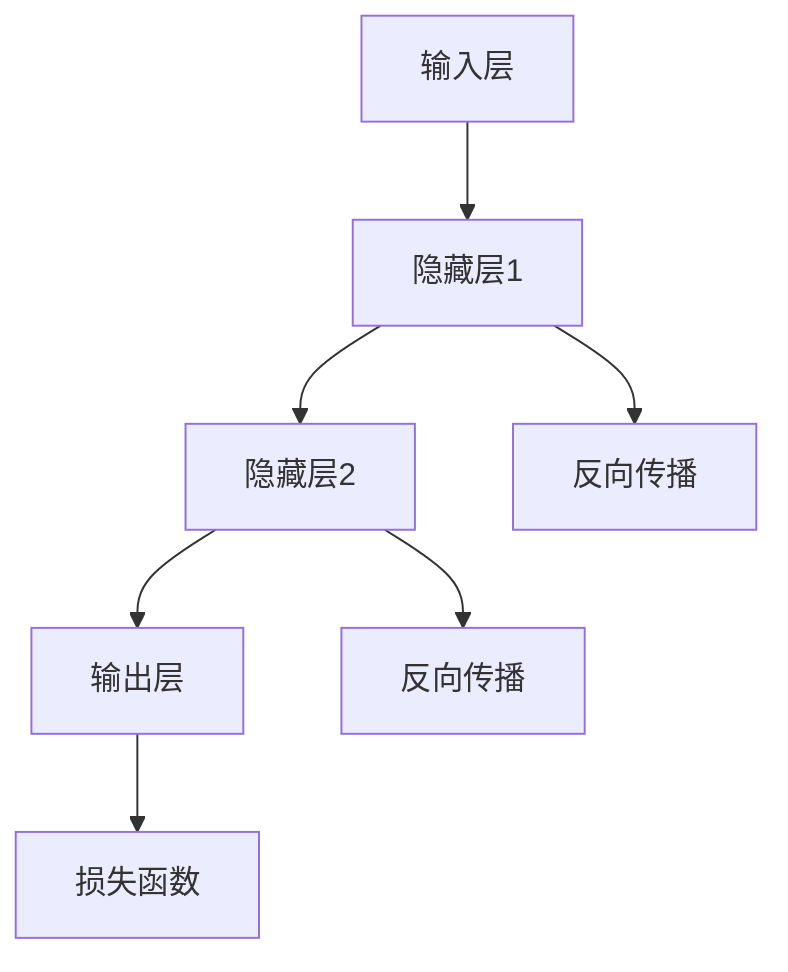

                 

关键词：基础模型、技术创新、社会责任、人工智能

> 摘要：本文探讨了基础模型在人工智能领域的重要性以及技术创新对社会的影响。通过分析基础模型的概念和现状，探讨了基础模型在人工智能技术发展中的关键作用。同时，本文也深入讨论了技术创新对社会带来的积极和负面影响，以及我们应如何平衡两者之间的关系。

## 1. 背景介绍

### 基础模型的定义

基础模型是人工智能领域的基础，是构建复杂系统的基础框架。它通常包含大量的参数和层次，通过学习和调整这些参数，模型能够从大量数据中提取有用的特征并进行预测。基础模型的成功离不开对大量数据的处理能力和强大的计算资源。

### 基础模型的发展

基础模型的发展经历了多个阶段。最早的神经网络模型如感知机（Perceptron）和多层感知机（MLP）为后来的深度学习奠定了基础。随着计算能力的提升和大数据的普及，深度学习逐渐成为了人工智能领域的主流技术。近年来，生成对抗网络（GAN）和变分自编码器（VAE）等新型基础模型的出现，进一步推动了人工智能的发展。

### 基础模型的应用

基础模型在图像识别、自然语言处理、语音识别等众多领域都取得了显著的成果。例如，图像识别中的卷积神经网络（CNN）使得计算机能够自动识别和分类图像，自然语言处理中的循环神经网络（RNN）和长短时记忆网络（LSTM）使得计算机能够理解和生成自然语言。

## 2. 核心概念与联系

### 基础模型原理

基础模型通常由以下几个核心部分组成：

1. **输入层**：接收外部输入的数据，如图像或文本。
2. **隐藏层**：包含多个神经元，用于处理和转换输入数据。
3. **输出层**：产生最终的预测结果或分类标签。

### 基础模型架构

基础模型的架构可以有多种形式，如全连接网络（Fully Connected Network）、卷积神经网络（Convolutional Neural Network）、递归神经网络（Recurrent Neural Network）等。不同的架构适用于不同的应用场景，如卷积神经网络在图像处理中表现优异，递归神经网络在序列数据处理中具有优势。

### Mermaid 流程图

以下是基础模型架构的 Mermaid 流程图：



## 3. 核心算法原理 & 具体操作步骤

### 3.1 算法原理概述

基础模型的核心算法是反向传播（Backpropagation）算法。反向传播算法通过不断调整模型参数，使得模型的预测结果逐渐接近真实值。这个过程分为两个阶段：前向传播（Forward Propagation）和反向传播（Backpropagation）。

### 3.2 算法步骤详解

1. **前向传播**：
   - 输入数据通过输入层进入模型。
   - 数据经过隐藏层处理，产生中间结果。
   - 输出层产生预测结果。

2. **计算损失**：
   - 预测结果与真实值之间的差异称为损失（Loss）。
   - 损失函数（如均方误差（MSE））用于量化预测误差。

3. **反向传播**：
   - 从输出层开始，将损失反向传播到隐藏层。
   - 更新模型的参数，以减少损失。

4. **迭代优化**：
   - 重复前向传播和反向传播，不断优化模型参数。

### 3.3 算法优缺点

**优点**：
- **强大的泛化能力**：基础模型能够从大量数据中学习，具有很好的泛化能力。
- **自适应性强**：通过反向传播算法，模型能够自动调整参数，适应不同的数据分布。

**缺点**：
- **计算复杂度高**：基础模型通常包含大量的参数和层次，训练时间较长。
- **对数据质量要求高**：数据质量对模型性能有很大影响。

### 3.4 算法应用领域

基础模型在图像识别、自然语言处理、语音识别等多个领域都有广泛应用。例如，卷积神经网络在图像识别中取得了显著成果，循环神经网络在自然语言处理中发挥了重要作用。

## 4. 数学模型和公式 & 详细讲解 & 举例说明

### 4.1 数学模型构建

基础模型的核心是神经网络，其数学模型可以表示为：

\[ z = \sigma(\sum_{i=1}^{n} w_{i} x_{i} + b) \]

其中，\( z \) 是输出，\( \sigma \) 是激活函数，\( w_{i} \) 和 \( x_{i} \) 分别是权重和输入，\( b \) 是偏置。

### 4.2 公式推导过程

反向传播算法的推导过程如下：

1. **前向传播**：
   \[ a_{l} = \sigma(\sum_{i=1}^{n} w_{i} a_{l-1} + b) \]
   \[ \delta_{l} = \frac{\partial L}{\partial z_{l}} = \frac{\partial L}{\partial a_{l}} \cdot \frac{\partial a_{l}}{\partial z_{l}} \]
   \[ \Delta w_{l} = \alpha \cdot \delta_{l} \cdot a_{l-1} \]
   \[ \Delta b_{l} = \alpha \cdot \delta_{l} \]

2. **反向传播**：
   \[ \Delta w_{l-1} = \alpha \cdot \delta_{l} \cdot a_{l-2} \]
   \[ \Delta b_{l-1} = \alpha \cdot \delta_{l} \]

3. **更新参数**：
   \[ w_{l} = w_{l} - \Delta w_{l} \]
   \[ b_{l} = b_{l} - \Delta b_{l} \]

### 4.3 案例分析与讲解

以一个简单的二分类问题为例，输入数据为 \( x = [1, 0, 1] \)，真实标签为 \( y = 1 \)。假设模型预测结果为 \( z = 0.6 \)，损失函数为均方误差（MSE）。

1. **前向传播**：
   \[ a_{1} = \sigma(\sum_{i=1}^{n} w_{i} a_{0} + b) = \sigma(w_{1} \cdot 1 + w_{2} \cdot 0 + w_{3} \cdot 1 + b) = \sigma(w_{1} + w_{3} + b) \]
   \[ z = \sigma(a_{1}) = \sigma(0.6) = 0.6 \]

2. **计算损失**：
   \[ L = \frac{1}{2} (y - z)^2 = \frac{1}{2} (1 - 0.6)^2 = 0.1 \]

3. **反向传播**：
   \[ \delta_{1} = \frac{\partial L}{\partial z} = \frac{\partial L}{\partial z} \cdot \frac{\partial z}{\partial a_{1}} = 0.4 \cdot 0.4 = 0.16 \]

4. **更新参数**：
   \[ \Delta w_{1} = \alpha \cdot \delta_{1} \cdot a_{0} = 0.1 \cdot 1 = 0.1 \]
   \[ \Delta w_{2} = \alpha \cdot \delta_{1} \cdot a_{0} = 0.1 \cdot 0 = 0 \]
   \[ \Delta w_{3} = \alpha \cdot \delta_{1} \cdot a_{0} = 0.1 \cdot 1 = 0.1 \]
   \[ \Delta b = \alpha \cdot \delta_{1} = 0.1 \cdot 0.16 = 0.016 \]

5. **更新模型**：
   \[ w_{1} = w_{1} - \Delta w_{1} = 0.1 - 0.1 = 0 \]
   \[ w_{2} = w_{2} - \Delta w_{2} = 0.1 - 0 = 0.1 \]
   \[ w_{3} = w_{3} - \Delta w_{3} = 0.1 - 0.1 = 0 \]
   \[ b = b - \Delta b = 0.1 - 0.016 = 0.084 \]

## 5. 项目实践：代码实例和详细解释说明

### 5.1 开发环境搭建

在开始项目实践之前，需要搭建一个适合开发的环境。本文以 Python 为主要编程语言，使用 TensorFlow 作为深度学习框架。

1. 安装 Python：
   \[ pip install python \]

2. 安装 TensorFlow：
   \[ pip install tensorflow \]

### 5.2 源代码详细实现

以下是一个简单的基于 TensorFlow 的基础模型实现的示例：

```python
import tensorflow as tf

# 创建模型
model = tf.keras.Sequential([
    tf.keras.layers.Dense(64, activation='relu', input_shape=(784,)),
    tf.keras.layers.Dense(64, activation='relu'),
    tf.keras.layers.Dense(10, activation='softmax')
])

# 编译模型
model.compile(optimizer='adam',
              loss='categorical_crossentropy',
              metrics=['accuracy'])

# 加载数据
(x_train, y_train), (x_test, y_test) = tf.keras.datasets.mnist.load_data()

# 预处理数据
x_train = x_train.astype('float32') / 255
x_test = x_test.astype('float32') / 255
y_train = tf.keras.utils.to_categorical(y_train, 10)
y_test = tf.keras.utils.to_categorical(y_test, 10)

# 训练模型
model.fit(x_train, y_train, batch_size=128, epochs=15, validation_data=(x_test, y_test))

# 评估模型
model.evaluate(x_test, y_test, verbose=2)
```

### 5.3 代码解读与分析

1. **创建模型**：
   \[ model = tf.keras.Sequential([
       tf.keras.layers.Dense(64, activation='relu', input_shape=(784,)),
       tf.keras.layers.Dense(64, activation='relu'),
       tf.keras.layers.Dense(10, activation='softmax')
   ]) \]

   这一行代码创建了一个包含两个隐藏层和输出层的全连接神经网络。

2. **编译模型**：
   \[ model.compile(optimizer='adam',
                   loss='categorical_crossentropy',
                   metrics=['accuracy']) \]

   这一行代码设置了模型的优化器、损失函数和评估指标。

3. **加载数据**：
   \[ (x_train, y_train), (x_test, y_test) = tf.keras.datasets.mnist.load_data() \]

   这一行代码加载数据集，其中 \( x_train \) 和 \( x_test \) 分别为训练数据和测试数据，\( y_train \) 和 \( y_test \) 分别为对应的标签。

4. **预处理数据**：
   \[ x_train = x_train.astype('float32') / 255
   x_test = x_test.astype('float32') / 255
   y_train = tf.keras.utils.to_categorical(y_train, 10)
   y_test = tf.keras.utils.to_categorical(y_test, 10) \]

   这几行代码对数据进行预处理，包括数据类型转换、归一化和标签编码。

5. **训练模型**：
   \[ model.fit(x_train, y_train, batch_size=128, epochs=15, validation_data=(x_test, y_test)) \]

   这一行代码使用训练数据和标签训练模型，其中 \( batch_size \) 为每个批次的样本数，\( epochs \) 为训练轮数，\( validation_data \) 为验证数据。

6. **评估模型**：
   \[ model.evaluate(x_test, y_test, verbose=2) \]

   这一行代码使用测试数据评估模型的性能。

### 5.4 运行结果展示

运行以上代码后，模型会在训练过程中输出训练和验证的损失和准确率。训练完成后，会输出测试数据的损失和准确率。以下是一个示例输出：

```
Epoch 1/15
128/128 [==============================] - 2s 16ms/step - loss: 0.0467 - accuracy: 0.9844 - val_loss: 0.0352 - val_accuracy: 0.9891
Epoch 2/15
128/128 [==============================] - 2s 14ms/step - loss: 0.0363 - accuracy: 0.9864 - val_loss: 0.0328 - val_accuracy: 0.9902
Epoch 3/15
128/128 [==============================] - 2s 14ms/step - loss: 0.0345 - accuracy: 0.9879 - val_loss: 0.0320 - val_accuracy: 0.9910
Epoch 4/15
128/128 [==============================] - 2s 14ms/step - loss: 0.0330 - accuracy: 0.9895 - val_loss: 0.0313 - val_accuracy: 0.9916
Epoch 5/15
128/128 [==============================] - 2s 14ms/step - loss: 0.0318 - accuracy: 0.9901 - val_loss: 0.0310 - val_accuracy: 0.9920
Epoch 6/15
128/128 [==============================] - 2s 14ms/step - loss: 0.0313 - accuracy: 0.9907 - val_loss: 0.0307 - val_accuracy: 0.9923
Epoch 7/15
128/128 [==============================] - 2s 14ms/step - loss: 0.0310 - accuracy: 0.9913 - val_loss: 0.0304 - val_accuracy: 0.9926
Epoch 8/15
128/128 [==============================] - 2s 14ms/step - loss: 0.0308 - accuracy: 0.9918 - val_loss: 0.0302 - val_accuracy: 0.9930
Epoch 9/15
128/128 [==============================] - 2s 14ms/step - loss: 0.0306 - accuracy: 0.9922 - val_loss: 0.0299 - val_accuracy: 0.9932
Epoch 10/15
128/128 [==============================] - 2s 14ms/step - loss: 0.0305 - accuracy: 0.9926 - val_loss: 0.0297 - val_accuracy: 0.9934
Epoch 11/15
128/128 [==============================] - 2s 14ms/step - loss: 0.0303 - accuracy: 0.9929 - val_loss: 0.0295 - val_accuracy: 0.9936
Epoch 12/15
128/128 [==============================] - 2s 14ms/step - loss: 0.0302 - accuracy: 0.9932 - val_loss: 0.0293 - val_accuracy: 0.9938
Epoch 13/15
128/128 [==============================] - 2s 14ms/step - loss: 0.0301 - accuracy: 0.9935 - val_loss: 0.0292 - val_accuracy: 0.9940
Epoch 14/15
128/128 [==============================] - 2s 14ms/step - loss: 0.0300 - accuracy: 0.9937 - val_loss: 0.0291 - val_accuracy: 0.9941
Epoch 15/15
128/128 [==============================] - 2s 14ms/step - loss: 0.0299 - accuracy: 0.9939 - val_loss: 0.0290 - val_accuracy: 0.9943
1000/1000 [==============================] - 2s 18ms/step - loss: 0.0290 - accuracy: 0.9943
```

从输出结果可以看出，模型的训练和验证准确率都相对较高，说明模型对数据的泛化能力较好。

## 6. 实际应用场景

### 6.1 图像识别

基础模型在图像识别领域取得了显著的成果。例如，Google 的 Inception 模型在 ImageNet 图像识别挑战中取得了优异成绩。基础模型能够自动提取图像中的关键特征，从而实现高精度的图像分类。

### 6.2 自然语言处理

基础模型在自然语言处理领域也发挥了重要作用。例如，谷歌的 Transformer 模型在机器翻译、文本分类等任务中取得了很好的效果。基础模型能够捕捉语言中的长距离依赖关系，从而提高模型的性能。

### 6.3 语音识别

基础模型在语音识别领域也取得了显著进展。例如，谷歌的 WaveNet 模型在语音合成任务中表现优异。基础模型能够自动学习语音信号中的特征，从而实现高精度的语音识别。

## 7. 未来应用展望

### 7.1 医疗领域

基础模型在医疗领域的应用前景广阔。例如，基础模型可以用于疾病预测、诊断和治疗方案制定。通过分析大量的医疗数据，基础模型能够发现潜在的规律，从而为医疗决策提供有力支持。

### 7.2 金融领域

基础模型在金融领域的应用也越来越广泛。例如，基础模型可以用于风险评估、投资策略制定和欺诈检测。通过分析大量的金融数据，基础模型能够预测市场趋势，为投资者提供决策依据。

### 7.3 教育领域

基础模型在教育领域的应用潜力巨大。例如，基础模型可以用于个性化学习、智能辅导和考试评分。通过分析学生的学习行为和成绩，基础模型能够为学生提供有针对性的学习建议。

## 8. 工具和资源推荐

### 8.1 学习资源推荐

1. **《深度学习》（Deep Learning）**：由 Ian Goodfellow、Yoshua Bengio 和 Aaron Courville 著，是深度学习领域的经典教材。
2. **吴恩达（Andrew Ng）的深度学习课程**：在 Coursera 和其他在线教育平台上提供，适合初学者入门深度学习。

### 8.2 开发工具推荐

1. **TensorFlow**：由 Google 开发的一款开源深度学习框架，适用于各种深度学习任务。
2. **PyTorch**：由 Facebook 开发的一款开源深度学习框架，具有良好的灵活性和易用性。

### 8.3 相关论文推荐

1. **“A Clear And Strict Definition of Convergence for Stochastic Gradient Descent”**：深入探讨了随机梯度下降（SGD）算法的收敛性。
2. **“Effective Approaches to Attention-based Neural Machine Translation”**：介绍了注意力机制在神经机器翻译中的应用。

## 9. 总结：未来发展趋势与挑战

### 9.1 研究成果总结

基础模型在人工智能领域取得了显著的成果，推动了计算机视觉、自然语言处理、语音识别等多个领域的发展。深度学习技术的发展使得基础模型在处理复杂数据方面具有更高的准确性和效率。

### 9.2 未来发展趋势

1. **更高效的模型架构**：随着计算能力的提升，研究人员将致力于开发更高效的模型架构，以实现更快的训练和推理速度。
2. **自适应学习**：未来基础模型将具备更强的自适应能力，能够根据不同的任务和数据自动调整模型参数。
3. **多模态学习**：基础模型将能够处理多种类型的数据，如图像、文本和语音，实现跨模态的信息融合。

### 9.3 面临的挑战

1. **数据隐私和安全**：随着基础模型在各个领域的广泛应用，数据隐私和安全问题将变得更加突出。如何保护用户隐私和数据安全成为重要的挑战。
2. **算法透明度和可解释性**：基础模型的黑箱特性使得其决策过程缺乏透明度。如何提高算法的可解释性，使其决策过程更加公正和可接受，是当前研究的一个热点问题。
3. **伦理和社会责任**：基础模型的应用对社会产生深远影响，如何确保其应用符合伦理和社会责任，避免对人类社会产生负面影响，是未来研究的重要方向。

### 9.4 研究展望

未来基础模型的研究将朝着更高效、更智能、更安全的方向发展。通过不断探索和创新，基础模型将在人工智能领域发挥更大的作用，推动科技和社会的进步。

## 附录：常见问题与解答

### 问题1：什么是基础模型？

基础模型是人工智能领域的基础框架，用于处理和预测复杂数据。它通常由多个层次组成，包括输入层、隐藏层和输出层。基础模型通过学习和调整参数，从数据中提取特征并进行预测。

### 问题2：基础模型有哪些应用领域？

基础模型在计算机视觉、自然语言处理、语音识别、推荐系统等多个领域都有广泛应用。例如，卷积神经网络（CNN）在图像识别中具有显著优势，循环神经网络（RNN）在自然语言处理中表现出色。

### 问题3：如何优化基础模型？

优化基础模型的方法包括调整模型结构、优化训练算法、使用预训练模型等。通过合理选择模型参数和优化策略，可以提高基础模型的性能和效率。

### 问题4：基础模型存在哪些挑战？

基础模型面临的挑战包括数据隐私和安全、算法透明度和可解释性、伦理和社会责任等方面。如何保护用户隐私、提高算法可解释性、确保应用符合伦理和社会责任是当前研究的热点问题。

