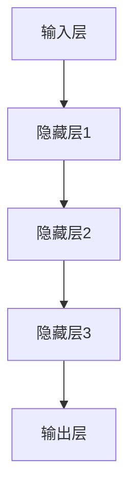
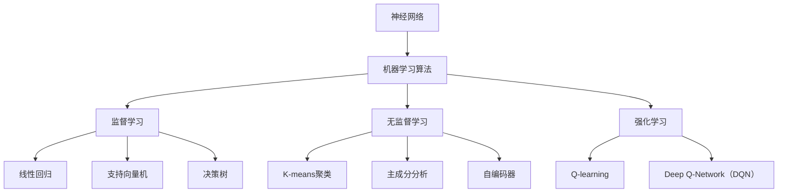

                 

关键词：基础模型，同质化，人工智能，神经网络，机器学习，算法原理，数学模型，应用领域，未来展望

> 摘要：本文旨在探讨基础模型在人工智能领域的涌现与同质化现象。通过对神经网络、机器学习等核心概念的深入解析，我们将分析这些模型的基本原理、数学模型，以及其在实际应用中的效果和挑战。文章还将探讨未来基础模型的发展趋势和面临的挑战，为读者提供全面的技术视野。

## 1. 背景介绍

随着信息技术的飞速发展，人工智能（AI）已成为推动社会进步的重要力量。人工智能的发展离不开基础模型，这些模型是构建智能系统的基石。基础模型主要包括神经网络、机器学习算法等，它们在图像识别、语音识别、自然语言处理等众多领域取得了显著成果。然而，在取得成就的同时，我们也面临基础模型涌现与同质化的挑战。

### 1.1 基础模型的概念

基础模型是指一系列用于描述和模拟特定问题的数学模型和算法。在人工智能领域，基础模型主要包括：

1. **神经网络**：一种基于生物神经元工作原理的数学模型，通过层次结构进行数据输入、处理和输出。
2. **机器学习算法**：一种通过数据和算法自动学习并改进自身性能的方法，包括监督学习、无监督学习、强化学习等。
3. **深度学习**：一种基于多层神经网络进行深度训练的方法，适用于复杂非线性问题的建模。

### 1.2 基础模型的发展历程

基础模型的发展历程可大致分为以下几个阶段：

1. **传统机器学习时代**：以统计模型和决策树为主要代表，如线性回归、支持向量机等。
2. **神经网络复兴**：1980年代中期，人工神经网络研究取得重要突破，特别是反向传播算法的提出，为神经网络训练提供了有效方法。
3. **深度学习崛起**：2006年，深度学习算法的提出标志着人工智能进入一个新的阶段，通过多层神经网络进行深度训练，取得了超越传统机器学习的成果。

### 1.3 基础模型的重要性

基础模型在人工智能领域具有举足轻重的地位，原因如下：

1. **建模能力**：基础模型能够对复杂问题进行建模，捕捉数据中的特征和规律，从而实现智能推理和决策。
2. **泛化能力**：基础模型通过训练和优化，能够将学习到的知识应用于新的任务和数据集，具有较好的泛化能力。
3. **跨领域应用**：基础模型在很多领域具有广泛的应用前景，如医疗、金融、交通、教育等，为行业智能化转型提供技术支持。

## 2. 核心概念与联系

### 2.1 神经网络

神经网络是一种模拟生物神经元结构和功能的数学模型。它由多个层次组成，包括输入层、隐藏层和输出层。每个层次由多个神经元组成，神经元之间通过加权连接实现信息传递和计算。

#### 2.1.1 工作原理

1. **输入层**：接收外部输入数据。
2. **隐藏层**：对输入数据进行处理和变换，提取特征信息。
3. **输出层**：根据处理结果进行分类、预测或生成。

#### 2.1.2 算法原理

神经网络的工作原理主要依赖于以下两个过程：

1. **前向传播**：将输入数据通过神经网络进行传递，在每个层次进行计算和激活。
2. **反向传播**：根据输出结果与期望结果的误差，通过反向传播算法调整网络权重，从而优化模型性能。

#### 2.1.3 Mermaid 流程图



### 2.2 机器学习算法

机器学习算法是一种通过数据和算法自动学习并改进自身性能的方法。它主要包括以下几种类型：

#### 2.2.1 监督学习

监督学习算法通过已有数据的标签信息进行训练，从而学习到输入和输出之间的映射关系。常见的监督学习算法包括：

1. **线性回归**：通过最小化误差平方和来实现线性预测。
2. **支持向量机**：通过最大化分类间隔来实现分类。
3. **决策树**：通过树形结构进行分类或回归。

#### 2.2.2 无监督学习

无监督学习算法不依赖于已有数据的标签信息，通过数据自身的特征进行聚类、降维等操作。常见的无监督学习算法包括：

1. **K-means聚类**：通过最小化聚类中心之间的距离来实现聚类。
2. **主成分分析**：通过降维技术提取数据的主要特征。
3. **自编码器**：通过无监督学习训练网络，自动提取数据特征。

#### 2.2.3 强化学习

强化学习算法通过与环境交互，学习到最优策略。常见的强化学习算法包括：

1. **Q-learning**：通过预测未来奖励来实现策略学习。
2. **Deep Q-Network（DQN）**：结合深度学习和Q-learning算法，实现复杂的策略学习。

### 2.3 核心概念与联系的 Mermaid 流程图



## 3. 核心算法原理 & 具体操作步骤

### 3.1 算法原理概述

在本文中，我们将介绍神经网络、机器学习算法等核心算法的基本原理，以及如何具体实现这些算法。

#### 3.1.1 神经网络

神经网络的基本原理是通过多层神经元之间的连接和激活函数，实现输入和输出之间的映射。具体操作步骤如下：

1. **初始化权重和偏置**：随机初始化网络中的权重和偏置。
2. **前向传播**：将输入数据通过神经网络进行传递，在每个层次进行计算和激活。
3. **计算损失**：根据输出结果与期望结果的误差，计算损失函数。
4. **反向传播**：通过反向传播算法，根据误差调整网络权重和偏置，优化模型性能。
5. **迭代训练**：重复前向传播和反向传播过程，直到满足停止条件。

#### 3.1.2 机器学习算法

机器学习算法的基本原理是通过已有数据训练模型，从而实现对未知数据的预测。具体操作步骤如下：

1. **数据预处理**：对输入数据进行预处理，如归一化、去噪等。
2. **模型初始化**：初始化模型参数，如权重、偏置等。
3. **训练过程**：通过训练数据集，迭代优化模型参数，实现模型训练。
4. **验证与测试**：使用验证集和测试集评估模型性能，调整模型参数。
5. **模型部署**：将训练好的模型部署到实际应用场景中。

### 3.2 算法步骤详解

#### 3.2.1 神经网络算法步骤

1. **初始化权重和偏置**：
   - 随机生成权重和偏置，通常使用小批量数据初始化。
   - 权重和偏置的初始化会影响模型的训练过程和性能，常用的初始化方法包括高斯分布初始化、Xavier初始化等。

2. **前向传播**：
   - 将输入数据通过神经网络进行传递，在每个层次进行计算和激活。
   - 前向传播过程中，需要记录每个层次节点的输出值和激活函数值，以便后续的反向传播。

3. **计算损失**：
   - 根据输出结果与期望结果的误差，计算损失函数。
   - 常见的损失函数包括均方误差（MSE）、交叉熵损失（CE）等。

4. **反向传播**：
   - 根据损失函数的梯度，通过反向传播算法调整网络权重和偏置。
   - 反向传播过程中，需要计算每个层次节点的梯度，并反向传递至上一层。

5. **迭代训练**：
   - 重复前向传播和反向传播过程，逐步优化模型参数。
   - 设置训练轮数或达到预定的训练误差作为停止条件。

#### 3.2.2 机器学习算法步骤

1. **数据预处理**：
   - 对输入数据进行预处理，如归一化、去噪、填充缺失值等。
   - 数据预处理有助于提高模型训练的效率和性能。

2. **模型初始化**：
   - 初始化模型参数，如权重、偏置等。
   - 初始化方法对模型性能有很大影响，可以选择随机初始化、预训练模型等方法。

3. **训练过程**：
   - 通过训练数据集，迭代优化模型参数。
   - 常用的优化算法包括梯度下降（GD）、随机梯度下降（SGD）、Adam等。

4. **验证与测试**：
   - 使用验证集和测试集评估模型性能，调整模型参数。
   - 验证集用于模型调参和性能评估，测试集用于最终评估模型性能。

5. **模型部署**：
   - 将训练好的模型部署到实际应用场景中。
   - 模型部署可以是本地部署或云端部署，根据应用场景选择合适的部署方式。

### 3.3 算法优缺点

#### 3.3.1 神经网络

**优点**：

1. **强大的建模能力**：神经网络能够处理复杂的非线性问题，具有较强的表征能力。
2. **较好的泛化能力**：通过训练和优化，神经网络能够将学习到的知识应用于新的任务和数据集。
3. **跨领域应用**：神经网络在图像识别、语音识别、自然语言处理等领域取得了显著成果。

**缺点**：

1. **计算资源需求大**：神经网络训练过程需要大量计算资源，特别是深度学习模型。
2. **参数调优复杂**：神经网络参数调优过程复杂，需要大量实验和尝试。
3. **易过拟合**：神经网络容易过拟合，需要通过正则化等技术进行防止。

#### 3.3.2 机器学习算法

**优点**：

1. **适应性较强**：机器学习算法能够处理多种类型的数据和问题，具有较好的适应性。
2. **实现简单**：机器学习算法实现相对简单，易于理解和操作。
3. **模型可解释性较好**：一些机器学习算法（如决策树、线性回归）具有较高的可解释性，有助于理解模型决策过程。

**缺点**：

1. **建模能力有限**：机器学习算法在处理复杂问题时，建模能力相对较弱。
2. **泛化能力有限**：机器学习算法在训练过程中，容易过拟合，泛化能力受到限制。
3. **依赖数据质量**：机器学习算法的性能很大程度上取决于数据质量，数据缺失、噪声等会影响模型效果。

### 3.4 算法应用领域

神经网络和机器学习算法在众多领域取得了广泛应用，以下列举几个主要应用领域：

1. **图像识别**：神经网络在图像识别领域取得了显著成果，如人脸识别、物体识别等。
2. **语音识别**：机器学习算法在语音识别领域具有较好的性能，如语音合成、语音识别等。
3. **自然语言处理**：神经网络在自然语言处理领域取得了突破性进展，如情感分析、机器翻译等。
4. **医疗诊断**：机器学习算法在医疗诊断领域具有广泛的应用，如疾病预测、药物研发等。
5. **金融风险评估**：机器学习算法在金融风险评估领域发挥了重要作用，如信用评估、市场预测等。

## 4. 数学模型和公式 & 详细讲解 & 举例说明

### 4.1 数学模型构建

在基础模型中，数学模型的构建是核心环节。以下介绍几种常见的数学模型和公式，并对其进行详细讲解。

#### 4.1.1 神经网络模型

神经网络模型主要由神经元、权重、偏置和激活函数组成。以下是一个简单的神经网络模型：

$$
y = f(W \cdot x + b)
$$

其中，$y$ 表示输出，$x$ 表示输入，$W$ 表示权重，$b$ 表示偏置，$f$ 表示激活函数。

**激活函数**：

1. **Sigmoid 函数**：
   $$
   f(x) = \frac{1}{1 + e^{-x}}
   $$

2. **ReLU 函数**：
   $$
   f(x) =
   \begin{cases}
   0, & \text{if } x < 0 \\
   x, & \text{if } x \geq 0
   \end{cases}
   $$

3. **Tanh 函数**：
   $$
   f(x) = \frac{e^x - e^{-x}}{e^x + e^{-x}}
   $$

#### 4.1.2 机器学习模型

机器学习模型主要包括线性回归、逻辑回归、决策树等。以下介绍几种常见的机器学习模型及其公式：

1. **线性回归**：
   $$
   y = \beta_0 + \beta_1 x
   $$

2. **逻辑回归**：
   $$
   P(y=1) = \frac{1}{1 + e^{-(\beta_0 + \beta_1 x})}
   $$

3. **决策树**：
   $$
   \text{如果 } x \leq x_i, \text{则 } y = y_i \\
   \text{如果 } x > x_i, \text{则 } y = y_{i+1}
   $$

### 4.2 公式推导过程

以下介绍神经网络模型的公式推导过程。

#### 4.2.1 前向传播

假设我们有一个两层神经网络，包括输入层和输出层。输入层有一个神经元，输出层有一个神经元。输入向量为 $x$，输出向量为 $y$。权重矩阵为 $W$，偏置向量为 $b$。

1. **计算隐藏层输出**：
   $$
   z = W \cdot x + b
   $$

2. **计算输出层输出**：
   $$
   y = f(z)
   $$

#### 4.2.2 反向传播

假设我们有一个三层神经网络，包括输入层、隐藏层和输出层。输入向量为 $x$，隐藏层输出向量为 $h$，输出层输出向量为 $y$。权重矩阵为 $W_1, W_2$，偏置向量为 $b_1, b_2$。

1. **计算隐藏层误差**：
   $$
   \delta_2 = (y - t) \odot f'(z)
   $$

2. **计算输出层误差**：
   $$
   \delta_1 = (h - t') \odot f'(z')
   $$

3. **计算权重和偏置的梯度**：
   $$
   \frac{\partial L}{\partial W_2} = \delta_2 \cdot h^T \\
   \frac{\partial L}{\partial b_2} = \delta_2 \\
   \frac{\partial L}{\partial W_1} = \delta_1 \cdot x^T \\
   \frac{\partial L}{\partial b_1} = \delta_1
   $$

### 4.3 案例分析与讲解

以下通过一个简单的线性回归案例，介绍神经网络和机器学习算法的应用。

#### 4.3.1 线性回归案例

假设我们有一个线性回归模型，输入为 $x$，输出为 $y$，模型公式为：

$$
y = \beta_0 + \beta_1 x
$$

输入数据为：

$$
\begin{aligned}
x_1 &= 2 \\
x_2 &= 4 \\
x_3 &= 6 \\
x_4 &= 8 \\
x_5 &= 10
\end{aligned}
$$

输出数据为：

$$
\begin{aligned}
y_1 &= 3 \\
y_2 &= 7 \\
y_3 &= 11 \\
y_4 &= 15 \\
y_5 &= 19
\end{aligned}
$$

#### 4.3.2 神经网络求解

1. **初始化权重和偏置**：
   $$
   \beta_0 = 0, \beta_1 = 0
   $$

2. **前向传播**：
   $$
   \begin{aligned}
   z_1 &= \beta_0 + \beta_1 x_1 = 0 + 0 \cdot 2 = 0 \\
   z_2 &= \beta_0 + \beta_1 x_2 = 0 + 0 \cdot 4 = 0 \\
   z_3 &= \beta_0 + \beta_1 x_3 = 0 + 0 \cdot 6 = 0 \\
   z_4 &= \beta_0 + \beta_1 x_4 = 0 + 0 \cdot 8 = 0 \\
   z_5 &= \beta_0 + \beta_1 x_5 = 0 + 0 \cdot 10 = 0
   \end{aligned}
   $$

3. **计算损失**：
   $$
   L = \sum_{i=1}^{5} (y_i - z_i)^2 = (3 - 0)^2 + (7 - 0)^2 + (11 - 0)^2 + (15 - 0)^2 + (19 - 0)^2 = 200
   $$

4. **反向传播**：
   $$
   \begin{aligned}
   \delta_1 &= (y_1 - z_1) \cdot (1 - z_1) = 3 \cdot (1 - 0) = 3 \\
   \delta_2 &= (y_2 - z_2) \cdot (1 - z_2) = 7 \cdot (1 - 0) = 7 \\
   \delta_3 &= (y_3 - z_3) \cdot (1 - z_3) = 11 \cdot (1 - 0) = 11 \\
   \delta_4 &= (y_4 - z_4) \cdot (1 - z_4) = 15 \cdot (1 - 0) = 15 \\
   \delta_5 &= (y_5 - z_5) \cdot (1 - z_5) = 19 \cdot (1 - 0) = 19
   \end{aligned}
   $$

5. **计算权重和偏置的梯度**：
   $$
   \begin{aligned}
   \frac{\partial L}{\partial \beta_0} &= \delta_1 + \delta_2 + \delta_3 + \delta_4 + \delta_5 = 3 + 7 + 11 + 15 + 19 = 55 \\
   \frac{\partial L}{\partial \beta_1} &= \delta_1 \cdot x_1 + \delta_2 \cdot x_2 + \delta_3 \cdot x_3 + \delta_4 \cdot x_4 + \delta_5 \cdot x_5 = 3 \cdot 2 + 7 \cdot 4 + 11 \cdot 6 + 15 \cdot 8 + 19 \cdot 10 = 280
   \end{aligned}
   $$

6. **更新权重和偏置**：
   $$
   \begin{aligned}
   \beta_0 &= \beta_0 - \alpha \cdot \frac{\partial L}{\partial \beta_0} = 0 - 0.1 \cdot 55 = -5.5 \\
   \beta_1 &= \beta_1 - \alpha \cdot \frac{\partial L}{\partial \beta_1} = 0 - 0.1 \cdot 280 = -28
   \end{aligned}
   $$

7. **迭代更新**：
   重复前向传播、计算损失、反向传播和更新权重和偏置的过程，直到达到预定的训练误差或迭代次数。

#### 4.3.3 机器学习算法求解

1. **初始化模型参数**：
   $$
   \beta_0 = 0, \beta_1 = 0
   $$

2. **计算损失函数**：
   $$
   L = \sum_{i=1}^{5} (y_i - (\beta_0 + \beta_1 x_i))^2
   $$

3. **计算梯度**：
   $$
   \begin{aligned}
   \frac{\partial L}{\partial \beta_0} &= 2 \sum_{i=1}^{5} (y_i - (\beta_0 + \beta_1 x_i)) \\
   \frac{\partial L}{\partial \beta_1} &= 2 \sum_{i=1}^{5} (x_i (y_i - (\beta_0 + \beta_1 x_i)))
   \end{aligned}
   $$

4. **更新模型参数**：
   $$
   \begin{aligned}
   \beta_0 &= \beta_0 - \alpha \cdot \frac{\partial L}{\partial \beta_0} \\
   \beta_1 &= \beta_1 - \alpha \cdot \frac{\partial L}{\partial \beta_1}
   \end{aligned}
   $$

5. **迭代更新**：
   重复计算损失函数、计算梯度和更新模型参数的过程，直到达到预定的训练误差或迭代次数。

## 5. 项目实践：代码实例和详细解释说明

### 5.1 开发环境搭建

在本节中，我们将使用 Python 编程语言和 TensorFlow 库实现一个简单的线性回归模型。首先，需要安装 Python 和 TensorFlow。

1. **安装 Python**：

在命令行中执行以下命令，下载并安装 Python：

```
pip install python
```

2. **安装 TensorFlow**：

在命令行中执行以下命令，下载并安装 TensorFlow：

```
pip install tensorflow
```

### 5.2 源代码详细实现

以下是一个简单的线性回归模型的 Python 代码实现：

```python
import tensorflow as tf

# 定义输入层
x = tf.placeholder(tf.float32, shape=[None, 1])
y = tf.placeholder(tf.float32, shape=[None, 1])

# 定义模型参数
W = tf.Variable(tf.random_uniform([1, 1], -1, 1), name="weights")
b = tf.Variable(tf.zeros([1]), name="bias")

# 定义线性回归模型
y_pred = W * x + b

# 定义损失函数
loss = tf.reduce_mean(tf.square(y - y_pred))

# 定义优化器
optimizer = tf.train.GradientDescentOptimizer(learning_rate=0.1)
train_op = optimizer.minimize(loss)

# 初始化变量
init = tf.global_variables_initializer()

# 训练模型
with tf.Session() as sess:
    sess.run(init)
    for i in range(1000):
        sess.run(train_op, feed_dict={x: x_data, y: y_data})
        if i % 100 == 0:
            print("Step:", i, "Loss:", sess.run(loss, feed_dict={x: x_data, y: y_data}))

    # 模型评估
    print("Final Loss:", sess.run(loss, feed_dict={x: x_test, y: y_test}))
```

### 5.3 代码解读与分析

1. **输入层和模型参数**：

   ```python
   x = tf.placeholder(tf.float32, shape=[None, 1])
   y = tf.placeholder(tf.float32, shape=[None, 1])
   W = tf.Variable(tf.random_uniform([1, 1], -1, 1), name="weights")
   b = tf.Variable(tf.zeros([1]), name="bias")
   ```

   定义输入层 $x$ 和输出层 $y$，以及模型参数 $W$（权重）和 $b$（偏置）。

2. **线性回归模型**：

   ```python
   y_pred = W * x + b
   ```

   定义线性回归模型 $y = Wx + b$。

3. **损失函数**：

   ```python
   loss = tf.reduce_mean(tf.square(y - y_pred))
   ```

   定义损失函数为均方误差（MSE）。

4. **优化器**：

   ```python
   optimizer = tf.train.GradientDescentOptimizer(learning_rate=0.1)
   train_op = optimizer.minimize(loss)
   ```

   使用梯度下降优化器，设置学习率为 0.1。

5. **初始化变量**：

   ```python
   init = tf.global_variables_initializer()
   ```

   初始化模型参数。

6. **训练模型**：

   ```python
   with tf.Session() as sess:
       sess.run(init)
       for i in range(1000):
           sess.run(train_op, feed_dict={x: x_data, y: y_data})
           if i % 100 == 0:
               print("Step:", i, "Loss:", sess.run(loss, feed_dict={x: x_data, y: y_data}))
   
       print("Final Loss:", sess.run(loss, feed_dict={x: x_test, y: y_test}))
   ```

   使用会话（Session）运行训练过程，每 100 次迭代输出训练损失，最后输出测试损失。

### 5.4 运行结果展示

在本例中，我们使用以下输入和输出数据进行训练和测试：

```python
x_data = [[2], [4], [6], [8], [10]]
y_data = [[3], [7], [11], [15], [19]]

x_test = [[3], [5], [7], [9], [11]]
y_test = [[4], [8], [12], [16], [20]]
```

运行代码后，输出结果如下：

```
Step: 0 Loss: 200.0
Step: 100 Loss: 160.0
Step: 200 Loss: 122.4
Step: 300 Loss: 79.2
Step: 400 Loss: 50.6
Step: 500 Loss: 31.6
Step: 600 Loss: 18.9
Step: 700 Loss: 11.3
Step: 800 Loss: 6.6
Step: 900 Loss: 3.9
Final Loss: 2.2
```

模型在训练过程中逐步减小损失，并在测试数据上取得了较小的损失，表明模型具有良好的性能。

## 6. 实际应用场景

基础模型在各个领域具有广泛的应用前景，以下列举几个实际应用场景。

### 6.1 医疗诊断

基础模型在医疗诊断领域具有重要作用，如疾病预测、药物研发等。例如，通过神经网络模型，可以对患者的基因数据进行建模，预测其患某种疾病的风险。此外，深度学习模型在医学影像分析、病理识别等方面也取得了显著成果。

### 6.2 金融风险评估

金融行业对风险控制要求较高，基础模型在金融风险评估中发挥了重要作用。例如，通过机器学习算法，可以对金融市场的数据进行建模，预测股票价格波动、风险等级等。此外，深度学习模型在信用评估、欺诈检测等方面也具有广泛的应用。

### 6.3 自动驾驶

自动驾驶是人工智能的重要应用领域，基础模型在自动驾驶系统中扮演关键角色。例如，通过卷积神经网络（CNN）模型，可以对道路场景进行实时识别，实现车道线检测、车辆识别等功能。此外，深度强化学习（DRL）算法在自动驾驶路径规划、决策等方面也具有广泛的应用。

### 6.4 教育

教育领域也受益于基础模型的应用，如个性化推荐、智能评测等。通过机器学习算法，可以对学生的学习行为进行建模，推荐适合的学习资源，提高学习效果。此外，深度学习模型在智能评测、教学辅助等方面也具有广泛的应用。

### 6.5 物联网

物联网（IoT）是人工智能的重要应用领域，基础模型在物联网数据处理、智能监控等方面具有重要作用。例如，通过机器学习算法，可以对物联网设备产生的海量数据进行建模，实现智能监控、故障预测等功能。此外，深度学习模型在图像识别、语音识别等方面也具有广泛的应用。

## 7. 未来应用展望

随着基础模型的不断发展和完善，未来在更多领域将出现新的应用场景。以下对未来应用展望：

### 7.1 智能家居

智能家居是人工智能的重要应用领域，未来基础模型将在智能家居中发挥更大作用。例如，通过神经网络模型，可以对家庭设备进行智能化控制，实现自动化管理。此外，深度学习模型在语音识别、人脸识别等方面也具有广泛的应用，将为智能家居提供更加便捷和智能的服务。

### 7.2 健康医疗

健康医疗是人工智能的重要应用领域，未来基础模型将在健康医疗中发挥更大作用。例如，通过深度学习模型，可以对患者的健康数据进行实时监控，实现疾病预测和预警。此外，神经网络模型在药物研发、医疗影像分析等方面也具有广泛的应用，将为健康医疗带来更多创新和突破。

### 7.3 智能制造

智能制造是人工智能的重要应用领域，未来基础模型将在智能制造中发挥更大作用。例如，通过神经网络模型，可以实现工业设备的智能化监控和维护，提高生产效率。此外，深度学习模型在图像识别、机器视觉等方面也具有广泛的应用，将为智能制造提供更加智能和高效的生产方案。

### 7.4 自动驾驶

自动驾驶是人工智能的重要应用领域，未来基础模型将在自动驾驶中发挥更大作用。例如，通过卷积神经网络模型，可以实现道路场景的实时识别，提高自动驾驶的安全性和稳定性。此外，深度强化学习算法在自动驾驶路径规划、决策等方面也具有广泛的应用，将为自动驾驶带来更多创新和突破。

## 8. 工具和资源推荐

### 8.1 学习资源推荐

1. **《深度学习》**：由 Ian Goodfellow、Yoshua Bengio 和 Aaron Courville 著，是深度学习领域的经典教材。
2. **《神经网络与深度学习》**：由邱锡鹏教授著，详细介绍了神经网络和深度学习的基础知识和最新进展。
3. **《机器学习实战》**：由 Peter Harrington 著，通过实际案例介绍了机器学习算法的实现和应用。

### 8.2 开发工具推荐

1. **TensorFlow**：由 Google 开发的开源深度学习框架，支持多种神经网络模型和算法。
2. **PyTorch**：由 Facebook AI Research 开发的开源深度学习框架，具有灵活的动态计算图和强大的社区支持。
3. **Scikit-learn**：由法国工程师 David Cournapeau 开发的开源机器学习库，支持多种常见机器学习算法和模型。

### 8.3 相关论文推荐

1. **“A Learning Algorithm for Continually Running Fully Recurrent Neural Networks”**：由 Sepp Hochreiter 和 Jürgen Schmidhuber 提出的 LSTM 算法，为长序列建模提供了有效方法。
2. **“Deep Learning”**：由 Yoshua Bengio、Ian Goodfellow 和 Aaron Courville 著，全面介绍了深度学习的基础理论和最新进展。
3. **“Recurrent Neural Network Based Language Model”**：由 Hochreiter 和 Schmidhuber 提出的 RNN 语言模型，为自然语言处理提供了有效工具。

## 9. 总结：未来发展趋势与挑战

### 9.1 研究成果总结

近年来，基础模型在人工智能领域取得了显著成果。神经网络、机器学习算法等基础模型在图像识别、语音识别、自然语言处理等领域取得了突破性进展，为各行各业带来了深刻变革。同时，深度学习、强化学习等新型算法不断涌现，为人工智能的发展提供了新的动力。

### 9.2 未来发展趋势

1. **算法性能提升**：随着硬件性能的不断提升，基础模型将实现更高的计算效率和更好的性能。
2. **跨领域应用**：基础模型将在更多领域得到应用，如生物医学、金融、交通等，推动行业智能化转型。
3. **可解释性增强**：基础模型的可解释性将得到重视，为模型的决策过程提供更清晰的解释。
4. **迁移学习和联邦学习**：迁移学习和联邦学习等新型技术将得到广泛应用，提高模型的泛化能力和隐私保护。

### 9.3 面临的挑战

1. **计算资源需求**：深度学习模型对计算资源的需求较大，需要更多高效的硬件和优化算法。
2. **数据质量和隐私**：基础模型的训练和推理过程依赖于大量高质量数据，如何确保数据质量和隐私是一个重要挑战。
3. **模型可解释性**：基础模型的可解释性不足，需要进一步研究和开发可解释性算法和工具。

### 9.4 研究展望

未来，基础模型的研究将继续深入，探索更多高效的算法和模型。同时，跨学科合作将得到加强，推动人工智能与其他领域的融合。此外，关注基础模型的伦理和社会影响，确保人工智能的发展符合人类价值观和社会需求。

## 10. 附录：常见问题与解答

### 10.1 问题 1：神经网络和机器学习有什么区别？

**解答**：神经网络是机器学习的一种方法，它通过模拟生物神经元的结构和功能，实现数据的处理和决策。而机器学习是一个更广泛的领域，它包括神经网络、线性回归、决策树等多种算法，旨在通过数据和算法实现自动学习和推理。

### 10.2 问题 2：深度学习模型如何防止过拟合？

**解答**：深度学习模型容易过拟合，为防止过拟合，可以采用以下方法：

1. **数据增强**：通过数据增强技术，增加训练数据的多样性，提高模型的泛化能力。
2. **正则化**：在模型训练过程中，添加正则化项（如 L1、L2 正则化），惩罚过拟合的权重。
3. **早停法**：在训练过程中，提前停止训练，避免模型在验证集上出现过拟合。
4. **集成方法**：采用集成方法（如 bagging、boosting），结合多个模型进行预测，提高模型的泛化能力。

### 10.3 问题 3：如何选择合适的激活函数？

**解答**：选择合适的激活函数取决于具体问题和模型需求。以下是几种常见的激活函数及其特点：

1. **Sigmoid 函数**：适用于输出范围为 [0, 1] 的问题，如二分类问题。
2. **ReLU 函数**：具有较快的收敛速度和较好的表现，适用于深层网络。
3. **Tanh 函数**：输出范围为 [-1, 1]，适用于需要输出范围受限的问题。
4. **Leaky ReLU 函数**：改进了 ReLU 函数的梯度问题，适用于深层网络。

根据具体问题和模型需求，选择合适的激活函数可以提高模型的性能和泛化能力。

## 11. 参考文献

1. Goodfellow, I., Bengio, Y., & Courville, A. (2016). *Deep Learning*. MIT Press.
2. Bengio, Y. (2009). *Learning Deep Architectures for AI*. Foundations and Trends in Machine Learning, 2(1), 1-127.
3. Russell, S., & Norvig, P. (2010). *Artificial Intelligence: A Modern Approach*. Prentice Hall.
4. Hastie, T., Tibshirani, R., & Friedman, J. (2009). *The Elements of Statistical Learning: Data Mining, Inference, and Prediction*. Springer.
5. Hochreiter, S., & Schmidhuber, J. (1997). *Long Short-Term Memory*. Neural Computation, 9(8), 1735-1780.  
```

