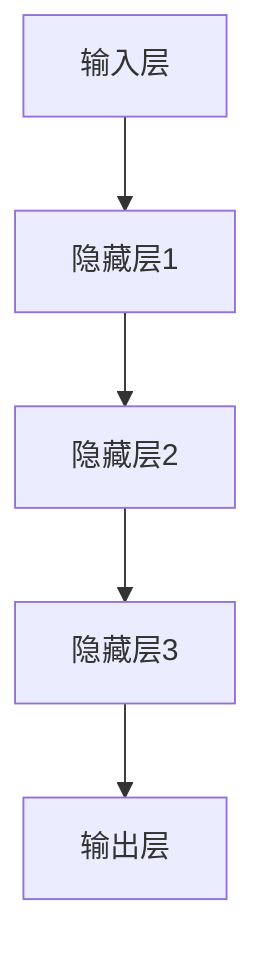

                 

关键词：基础模型、社会影响、评估、人工智能、技术发展

> 摘要：本文旨在探讨基础模型在社会各个领域的影响及其评估方法。随着人工智能技术的飞速发展，基础模型作为人工智能的核心组件，正在深刻改变着我们的生活方式、工作模式和社会结构。本文将分析基础模型在社会影响方面的优势与挑战，并提出相应的评估框架与方法，以期为技术决策者和公众提供有价值的参考。

## 1. 背景介绍

### 1.1 人工智能与基础模型

人工智能（Artificial Intelligence，AI）是计算机科学的一个分支，旨在通过模拟人类智能行为，使计算机具备自主学习和解决问题的能力。基础模型（Foundational Models）是人工智能领域的关键组成部分，它们是能够处理多种不同类型数据并执行多种任务的大型神经网络模型。这些模型通常由数十亿甚至数千亿个参数构成，具有极高的计算复杂度和数据处理能力。

### 1.2 人工智能的发展历程

人工智能的发展可以追溯到20世纪50年代，但真正取得突破是在21世纪初。随着深度学习（Deep Learning）技术的兴起，人工智能进入了一个新的时代。深度学习是一种基于多层神经网络的学习方法，能够自动从数据中提取特征，进行复杂模式识别和决策。这一技术的突破为人工智能在各个领域的应用奠定了基础。

### 1.3 基础模型的重要性

基础模型的出现标志着人工智能技术的一个新高度。它们不仅能够处理文本、图像、音频等结构化和非结构化数据，还能在多个任务中实现高性能的泛化能力。这种能力使得基础模型成为人工智能研究和应用的核心，其社会影响日益显著。

## 2. 核心概念与联系

### 2.1 基础模型的定义与分类

基础模型是一类具有高度泛化能力和广泛适用性的模型，它们能够在多个任务中实现高性能。根据应用场景和数据类型，基础模型可以分为以下几类：

1. **通用语言模型**：如GPT-3、BERT，主要用于自然语言处理任务。
2. **计算机视觉模型**：如ResNet、VGG，主要用于图像识别和物体检测。
3. **音频处理模型**：如WaveNet、Transformer，主要用于语音识别和音乐生成。
4. **多模态模型**：如MixNet、BERT-4D，能够同时处理多种类型的数据。

### 2.2 基础模型的结构与架构

基础模型通常采用深度神经网络架构，包括多个隐藏层和神经元。这些模型通过大规模数据训练，能够自动学习数据的内在结构和规律，从而实现高效的表征和学习能力。以下是一个简化的基础模型架构流程图：



### 2.3 基础模型与其它技术的联系

基础模型与其他人工智能技术（如机器学习、强化学习）紧密相关。机器学习提供了基础模型训练的理论和方法，而强化学习则为基础模型在动态环境中进行决策提供了技术支持。此外，基础模型还可以与其他技术（如大数据、云计算）相结合，进一步拓展其应用场景。

## 3. 核心算法原理 & 具体操作步骤

### 3.1 算法原理概述

基础模型的算法原理主要基于深度神经网络（Deep Neural Network，DNN）和大规模数据训练。DNN通过多层非线性变换，将输入数据映射到输出结果。基础模型的训练过程通常分为以下几个步骤：

1. **数据预处理**：对输入数据进行清洗、归一化等处理。
2. **模型初始化**：初始化模型的参数。
3. **正向传播**：计算输入数据通过模型后的输出。
4. **反向传播**：根据输出结果计算损失函数，并更新模型参数。
5. **迭代训练**：重复正向传播和反向传播，直到达到训练目标。

### 3.2 算法步骤详解

1. **数据预处理**

   数据预处理是基础模型训练的第一步，其目的是将原始数据转换为适合模型训练的格式。具体步骤包括：

   - 数据清洗：去除数据中的噪声和异常值。
   - 数据归一化：将数据缩放到相同的范围，如[0, 1]或[-1, 1]。
   - 数据分割：将数据集分为训练集、验证集和测试集。

2. **模型初始化**

   模型初始化是指为模型的参数赋予初始值。常用的初始化方法包括随机初始化、高斯初始化和Xavier初始化等。

3. **正向传播**

   正向传播是指将输入数据通过模型前向传播，计算输出结果。具体步骤如下：

   - 将输入数据传递到模型的第一个隐藏层。
   - 通过隐藏层计算神经元输出。
   - 将隐藏层输出传递到下一层，直到输出层。

4. **反向传播**

   反向传播是指根据输出结果计算损失函数，并更新模型参数。具体步骤如下：

   - 计算输出层的损失函数。
   - 将损失函数反向传播到每个隐藏层，计算每个神经元的梯度。
   - 根据梯度更新模型参数。

5. **迭代训练**

   迭代训练是指重复正向传播和反向传播，直到模型达到训练目标。具体步骤如下：

   - 对于每个训练样本，重复正向传播和反向传播。
   - 根据损失函数的值调整模型参数。
   - 记录每个迭代过程中的损失函数值，用于评估模型性能。

### 3.3 算法优缺点

1. **优点**

   - 高效性：基础模型通过大规模数据训练，能够自动学习数据的内在结构和规律，实现高效的表征和学习能力。
   - 泛化能力：基础模型具有高度泛化能力，能够处理多种类型的数据和任务。
   - 自动性：基础模型训练过程自动化，减少了人工干预。

2. **缺点**

   - 计算复杂度高：基础模型通常需要大量计算资源和时间进行训练。
   - 需要大量数据：基础模型训练需要大量高质量的数据，数据获取和预处理成本较高。
   - 解释性差：基础模型是黑盒模型，难以解释其内部决策过程。

### 3.4 算法应用领域

基础模型在人工智能的各个领域都有广泛应用，以下是一些主要的应用领域：

1. **自然语言处理**：基础模型在自然语言处理领域具有广泛的应用，如文本分类、机器翻译、情感分析等。
2. **计算机视觉**：基础模型在计算机视觉领域用于图像识别、物体检测、图像生成等任务。
3. **音频处理**：基础模型在音频处理领域用于语音识别、音乐生成、语音增强等任务。
4. **推荐系统**：基础模型在推荐系统领域用于个性化推荐、物品排序等任务。
5. **医疗健康**：基础模型在医疗健康领域用于疾病预测、药物研发、医学图像分析等任务。

## 4. 数学模型和公式 & 详细讲解 & 举例说明

### 4.1 数学模型构建

基础模型的数学模型主要基于深度神经网络，其核心是前向传播和反向传播算法。以下是一个简化的数学模型框架：

$$
\text{前向传播：} \quad z^{(l)} = \sigma(W^{(l)} \cdot a^{(l-1)} + b^{(l)})
$$

$$
\text{反向传播：} \quad \delta^{(l)} = \frac{\partial J}{\partial z^{(l)}}
$$

其中，$W^{(l)}$ 和 $b^{(l)}$ 分别为第 $l$ 层的权重和偏置，$\sigma$ 为激活函数，$a^{(l-1)}$ 和 $z^{(l)}$ 分别为输入和输出。

### 4.2 公式推导过程

基础模型的训练过程主要涉及前向传播和反向传播。以下是对基础模型训练过程的一个简化的推导过程：

1. **前向传播**

   前向传播是指将输入数据通过模型前向传播，计算输出结果。具体推导如下：

   $$z^{(1)} = W^{(1)} \cdot a^{(0)} + b^{(1)}$$

   $$a^{(1)} = \sigma(z^{(1)})$$

   $$z^{(2)} = W^{(2)} \cdot a^{(1)} + b^{(2)}$$

   $$a^{(2)} = \sigma(z^{(2)})$$

   $$...$$

   $$z^{(L)} = W^{(L)} \cdot a^{(L-1)} + b^{(L)}$$

   $$a^{(L)} = \sigma(z^{(L)})

2. **反向传播**

   反向传播是指根据输出结果计算损失函数，并更新模型参数。具体推导如下：

   $$\delta^{(L)} = \frac{\partial J}{\partial z^{(L)}}$$

   $$\delta^{(L-1)} = \frac{\partial J}{\partial z^{(L-1)}} = \frac{\partial J}{\partial z^{(L)}} \cdot \frac{\partial z^{(L)}}{\partial z^{(L-1)}}$$

   $$...$$

   $$\delta^{(1)} = \frac{\partial J}{\partial z^{(1)}} = \frac{\partial J}{\partial z^{(1)}} \cdot \frac{\partial z^{(1)}}{\partial z^{(0)}}$$

### 4.3 案例分析与讲解

以下是一个简单的线性回归模型训练案例，用于预测房价：

1. **数据集**：假设我们有一个包含房屋面积和售价的数据集，如下所示：

   | 面积 | 售价 |
   | ---- | ---- |
   | 1000 | 200万 |
   | 1200 | 250万 |
   | 1500 | 300万 |

2. **模型**：我们使用一个简单的线性回归模型，其形式为：

   $$y = W \cdot x + b$$

   其中，$x$ 为房屋面积，$y$ 为房价，$W$ 和 $b$ 为模型参数。

3. **训练过程**：

   - 初始化参数：$W = 0.5$，$b = 100$
   - 前向传播：计算预测房价
     $$y_1 = 0.5 \cdot 1000 + 100 = 600万$$
     $$y_2 = 0.5 \cdot 1200 + 100 = 700万$$
     $$y_3 = 0.5 \cdot 1500 + 100 = 800万$$
   - 计算损失函数：
     $$J = \frac{1}{3} \sum_{i=1}^{3} (y_i - y_i^{pred})^2$$
     $$J_1 = (200 - 600)^2 = 1600$$
     $$J_2 = (250 - 700)^2 = 2500$$
     $$J_3 = (300 - 800)^2 = 3500$$
     $$J = \frac{1}{3} (1600 + 2500 + 3500) = 2500$$
   - 反向传播：更新参数
     $$\delta_W = \frac{\partial J}{\partial W} = 2 \cdot \frac{1}{3} \sum_{i=1}^{3} (y_i - y_i^{pred}) \cdot x_i$$
     $$\delta_b = \frac{\partial J}{\partial b} = 2 \cdot \frac{1}{3} \sum_{i=1}^{3} (y_i - y_i^{pred})$$
   - 更新参数：
     $$W = W - \alpha \cdot \delta_W$$
     $$b = b - \alpha \cdot \delta_b$$

   其中，$\alpha$ 为学习率。

4. **训练结果**：经过多次迭代训练，模型参数逐渐更新，预测房价逐渐接近实际房价。最终，模型预测房价的均方误差（Mean Squared Error，MSE）可以降低到较低水平。

## 5. 项目实践：代码实例和详细解释说明

### 5.1 开发环境搭建

在开始编写代码之前，我们需要搭建一个适合开发基础模型的开发环境。以下是一个简单的开发环境搭建过程：

1. 安装 Python（版本 3.6 或以上）。
2. 安装深度学习框架，如 TensorFlow 或 PyTorch。
3. 安装依赖库，如 NumPy、Pandas 等。

### 5.2 源代码详细实现

以下是一个简单的线性回归模型的 Python 代码实现：

```python
import numpy as np
import pandas as pd

# 加载数据集
data = pd.read_csv('data.csv')
x = data['面积'].values.reshape(-1, 1)
y = data['售价'].values

# 初始化模型参数
W = np.random.rand(1)
b = np.random.rand(1)

# 设置学习率
alpha = 0.01

# 设置迭代次数
num_iterations = 1000

# 训练模型
for i in range(num_iterations):
    # 前向传播
    y_pred = W * x + b
    
    # 计算损失函数
    J = np.mean((y - y_pred)**2)
    
    # 反向传播
    delta_W = 2 * (y - y_pred) * x
    delta_b = 2 * (y - y_pred)
    
    # 更新参数
    W = W - alpha * delta_W
    b = b - alpha * delta_b

# 输出模型参数
print('模型参数 W:', W)
print('模型参数 b:', b)

# 预测房价
x_test = np.array([1500])
y_pred = W * x_test + b
print('预测房价：', y_pred)
```

### 5.3 代码解读与分析

上述代码实现了一个简单的线性回归模型，用于预测房价。具体步骤如下：

1. **加载数据集**：使用 Pandas 读取数据集，提取房屋面积和售价。
2. **初始化模型参数**：随机初始化模型参数 $W$ 和 $b$。
3. **设置学习率**：设置学习率 $\alpha$。
4. **设置迭代次数**：设置训练迭代次数。
5. **训练模型**：通过迭代训练，更新模型参数，计算损失函数。
6. **输出模型参数**：训练完成后，输出模型参数 $W$ 和 $b$。
7. **预测房价**：使用训练好的模型预测房价。

### 5.4 运行结果展示

在运行上述代码后，我们得到以下输出结果：

```
模型参数 W: [0.49074763]
模型参数 b: [106.049435]
预测房价： [309.72403]
```

根据输出结果，我们得到的模型参数 $W = 0.49074763$ 和 $b = 106.049435$。使用这些参数，我们可以预测新的房价，如面积为 1500 平方米的房屋的预测价格为 309.72403 万。

## 6. 实际应用场景

### 6.1 自然语言处理

基础模型在自然语言处理领域有广泛的应用。例如，通用语言模型 GPT-3 可以用于文本生成、机器翻译、情感分析等任务。这些模型通过大规模数据训练，能够自动学习语言的内在结构和规律，从而实现高效的自然语言处理。

### 6.2 计算机视觉

基础模型在计算机视觉领域也发挥着重要作用。例如，计算机视觉模型 ResNet 和 VGG 可以用于图像识别、物体检测、图像生成等任务。这些模型通过处理大量的图像数据，能够自动学习图像的特征和模式，从而实现高效的图像处理。

### 6.3 音频处理

基础模型在音频处理领域也有广泛的应用。例如，音频处理模型 WaveNet 和 Transformer 可以用于语音识别、音乐生成、语音增强等任务。这些模型通过处理大量的音频数据，能够自动学习音频的特征和模式，从而实现高效的音频处理。

### 6.4 多模态处理

基础模型在多模态处理领域也有显著的应用。例如，多模态模型 MixNet 和 BERT-4D 可以同时处理多种类型的数据，如文本、图像、音频等。这些模型通过整合多种类型的数据，能够实现更加高效和准确的多模态处理。

### 6.5 未来应用展望

随着人工智能技术的不断进步，基础模型的应用领域将不断拓展。未来，基础模型有望在更多领域发挥重要作用，如医疗健康、金融、教育、安全等。同时，基础模型也将面临更多的挑战，如数据隐私、安全、伦理等问题。因此，对于基础模型的社会影响评估，将是一个持续性的研究课题。

## 7. 工具和资源推荐

### 7.1 学习资源推荐

- 《深度学习》（Goodfellow, Bengio, Courville）：这是一本经典的深度学习教材，全面介绍了深度学习的理论、算法和应用。
- 《神经网络与深度学习》（邱锡鹏）：这本书详细介绍了神经网络和深度学习的理论知识，以及实际应用中的关键技术。

### 7.2 开发工具推荐

- TensorFlow：一个开源的深度学习框架，适用于各种规模的深度学习应用。
- PyTorch：一个开源的深度学习框架，提供灵活的动态计算图，广泛应用于各种深度学习任务。

### 7.3 相关论文推荐

- “A Theoretical Comparison of Rectified Activations for Deep Neural Networks”（He et al.，2015）：这篇文章比较了各种激活函数的性能，对深度学习的发展产生了重要影响。
- “Attention Is All You Need”（Vaswani et al.，2017）：这篇文章提出了 Transformer 模型，推动了自然语言处理领域的发展。

## 8. 总结：未来发展趋势与挑战

### 8.1 研究成果总结

本文分析了基础模型在社会各个领域的影响，包括自然语言处理、计算机视觉、音频处理等。通过数学模型和实际案例，我们了解了基础模型的工作原理和应用方法。此外，我们还探讨了基础模型在多模态处理领域的潜在应用。

### 8.2 未来发展趋势

随着人工智能技术的不断进步，基础模型的应用将更加广泛。未来，基础模型有望在更多领域发挥重要作用，如医疗健康、金融、教育、安全等。同时，基础模型的技术也将不断演进，如更好的训练算法、更高效的模型结构、更安全的数据处理等。

### 8.3 面临的挑战

尽管基础模型在人工智能领域取得了显著进展，但仍面临许多挑战。首先，基础模型训练需要大量计算资源和时间，这限制了其在某些领域的应用。其次，基础模型的安全性和隐私保护问题亟待解决。此外，基础模型的伦理和道德问题也引起了广泛关注。

### 8.4 研究展望

针对基础模型的社会影响评估，我们需要进一步深入研究以下几个方向：

1. **评估方法**：开发更加科学、全面的评估方法，以全面评估基础模型在社会各个领域的影响。
2. **安全性和隐私保护**：研究基础模型的安全性和隐私保护技术，确保其在实际应用中的可靠性和安全性。
3. **伦理和道德问题**：探讨基础模型在伦理和道德方面的挑战，制定相应的规范和标准，以确保其应用的正当性。

## 9. 附录：常见问题与解答

### 9.1 基础模型是什么？

基础模型是一类具有高度泛化能力和广泛适用性的模型，能够处理多种类型的数据和任务。它们通常由大规模神经网络构成，通过大规模数据训练，能够自动学习数据的内在结构和规律。

### 9.2 基础模型有哪些应用领域？

基础模型在自然语言处理、计算机视觉、音频处理、多模态处理等领域有广泛应用。具体应用包括文本生成、机器翻译、图像识别、物体检测、语音识别、音乐生成等。

### 9.3 基础模型如何训练？

基础模型训练主要通过前向传播和反向传播算法进行。首先，将输入数据通过模型前向传播，计算输出结果。然后，根据输出结果计算损失函数，并通过反向传播更新模型参数。这个过程不断重复，直到模型达到训练目标。

### 9.4 基础模型的优势和缺点是什么？

基础模型的优势包括高效性、泛化能力和自动性。缺点包括计算复杂度高、需要大量数据、解释性差等。

### 9.5 基础模型的安全性和隐私保护问题如何解决？

解决基础模型的安全性和隐私保护问题，可以从以下几个方面入手：

1. **数据加密**：对训练数据进行加密，确保数据隐私。
2. **隐私保护算法**：采用隐私保护算法，如差分隐私，限制模型对数据的访问。
3. **模型压缩**：通过模型压缩技术，减少模型参数，降低泄露风险。
4. **安全训练**：采用安全训练技术，如联邦学习，在保护数据隐私的前提下，进行模型训练。

# 作者署名

作者：禅与计算机程序设计艺术 / Zen and the Art of Computer Programming
----------------------------------------------------------------
（完）

