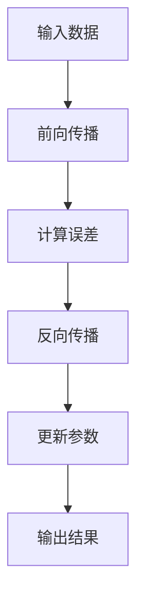

                 

关键词：基础模型、计算成本、工程要求、优化策略、资源利用、性能评估

> 摘要：本文将深入探讨基础模型的计算成本和工程要求，分析其在不同应用场景中的计算需求和优化策略，并提出有效的性能评估方法，以指导实际项目开发。

## 1. 背景介绍

随着深度学习技术的迅猛发展，基础模型（如神经网络、生成对抗网络等）在图像识别、自然语言处理、语音识别等领域取得了显著的成果。然而，基础模型的开发和应用面临着巨大的计算成本和工程挑战。如何高效地利用计算资源，优化模型的计算性能，成为当前研究的热点问题。

本文将从以下几个方面展开讨论：

1. **基础模型的计算成本与工程要求**：分析基础模型的计算复杂度，探讨计算成本与模型规模、训练数据量、硬件设备等因素的关系。
2. **优化策略**：介绍针对基础模型计算成本优化的常见策略，如模型压缩、并行计算、分布式训练等。
3. **性能评估方法**：探讨用于评估基础模型计算性能的关键指标和方法，以指导实际项目开发。
4. **实际应用场景**：分析基础模型在不同应用场景中的计算需求和优化方法。
5. **未来展望**：展望基础模型计算成本与工程要求的未来发展趋势和面临的挑战。

## 2. 核心概念与联系

### 2.1 计算成本与工程要求

计算成本是指模型在训练和推理过程中所需的计算资源，包括CPU、GPU、内存等。工程要求则是指满足实际应用需求的技术指标，如准确率、实时性、功耗等。

### 2.2 基础模型计算复杂度

基础模型计算复杂度主要包括以下几个部分：

- **前向传播**：计算输入层到隐藏层的权重矩阵与输入数据的乘积，并加上偏置项。
- **反向传播**：计算误差对权重矩阵和偏置项的梯度，用于模型参数的更新。
- **激活函数**：计算激活函数的输出，用于非线性变换。

### 2.3 计算资源利用

计算资源利用是指模型在训练和推理过程中对计算资源的利用效率。高效地利用计算资源可以降低计算成本，提高模型的性能。

### 2.4 性能评估方法

性能评估方法用于衡量基础模型在特定任务上的表现。常见的评估指标包括准确率、召回率、F1分数等。

### 2.5 Mermaid 流程图

以下是一个简化的基础模型计算流程图：



## 3. 核心算法原理 & 具体操作步骤

### 3.1 算法原理概述

基础模型的计算成本主要取决于以下几个因素：

- **模型规模**：模型参数的规模越大，计算复杂度越高。
- **训练数据量**：训练数据量越多，模型需要更多的计算资源进行训练。
- **硬件设备**：不同硬件设备的计算性能不同，对计算成本有重要影响。

### 3.2 算法步骤详解

1. **模型定义**：根据应用需求定义基础模型的结构和参数。
2. **数据预处理**：对输入数据进行预处理，如归一化、缩放等。
3. **模型训练**：使用训练数据对模型进行训练，更新模型参数。
4. **模型评估**：使用测试数据对模型进行评估，计算模型的准确率等指标。
5. **模型部署**：将训练好的模型部署到实际应用场景中。

### 3.3 算法优缺点

- **优点**：基础模型具有较好的泛化能力，能够处理复杂的问题。
- **缺点**：计算成本较高，对硬件设备有较高的要求。

### 3.4 算法应用领域

基础模型广泛应用于以下领域：

- **计算机视觉**：图像识别、目标检测等。
- **自然语言处理**：文本分类、机器翻译等。
- **语音识别**：语音识别、语音合成等。

## 4. 数学模型和公式 & 详细讲解 & 举例说明

### 4.1 数学模型构建

基础模型通常由以下数学模型构成：

- **前向传播**：$$ f(x) = \sigma(Wx + b) $$
- **反向传播**：$$ \delta = \frac{\partial L}{\partial x} $$
- **梯度下降**：$$ \theta = \theta - \alpha \cdot \nabla_{\theta} L $$

### 4.2 公式推导过程

- **前向传播**：根据输入数据和模型参数计算输出。
- **反向传播**：利用链式法则计算误差对模型参数的梯度。
- **梯度下降**：根据梯度更新模型参数。

### 4.3 案例分析与讲解

假设我们有一个简单的神经网络模型，用于二分类任务。输入数据为 $x \in \mathbb{R}^n$，模型参数为 $W \in \mathbb{R}^{n \times c}$，$b \in \mathbb{R}^c$，激活函数为 $\sigma(x) = \frac{1}{1 + e^{-x}}$。

1. **前向传播**：
   $$ z = Wx + b $$
   $$ a = \sigma(z) $$
2. **反向传播**：
   $$ \delta = \frac{\partial L}{\partial a} \cdot \frac{\partial a}{\partial z} $$
   $$ \frac{\partial L}{\partial z} = \delta $$
   $$ \frac{\partial L}{\partial W} = x^T \delta $$
   $$ \frac{\partial L}{\partial b} = \delta^T $$
3. **梯度下降**：
   $$ \theta = \theta - \alpha \cdot \nabla_{\theta} L $$

## 5. 项目实践：代码实例和详细解释说明

### 5.1 开发环境搭建

- 安装 Python（3.6及以上版本）
- 安装 PyTorch（1.8及以上版本）
- 安装 Jupyter Notebook（用于代码实现和演示）

### 5.2 源代码详细实现

以下是一个简单的 PyTorch 神经网络实现示例：

```python
import torch
import torch.nn as nn
import torch.optim as optim

# 模型定义
class SimpleNet(nn.Module):
    def __init__(self):
        super(SimpleNet, self).__init__()
        self.fc1 = nn.Linear(10, 5)
        self.fc2 = nn.Linear(5, 2)
        self.relu = nn.ReLU()

    def forward(self, x):
        x = self.relu(self.fc1(x))
        x = self.fc2(x)
        return x

# 模型实例化
model = SimpleNet()

# 损失函数
criterion = nn.CrossEntropyLoss()

# 优化器
optimizer = optim.SGD(model.parameters(), lr=0.01)

# 训练数据
x_train = torch.randn(100, 10)
y_train = torch.randint(0, 2, (100,))

# 训练过程
for epoch in range(10):
    optimizer.zero_grad()
    output = model(x_train)
    loss = criterion(output, y_train)
    loss.backward()
    optimizer.step()
    print(f"Epoch {epoch + 1}, Loss: {loss.item()}")

# 模型评估
with torch.no_grad():
    x_test = torch.randn(10, 10)
    y_test = torch.randint(0, 2, (10,))
    output = model(x_test)
    loss = criterion(output, y_test)
    print(f"Test Loss: {loss.item()}")
```

### 5.3 代码解读与分析

- **模型定义**：使用 PyTorch 的 `nn.Module` 类定义一个简单的神经网络，包含两个全连接层和一个 ReLU 激活函数。
- **前向传播**：通过 `forward` 方法实现前向传播过程，将输入数据经过网络计算得到输出。
- **损失函数**：使用 `nn.CrossEntropyLoss` 定义交叉熵损失函数，用于计算模型输出和真实标签之间的误差。
- **优化器**：使用 `optim.SGD` 定义随机梯度下降优化器，用于更新模型参数。
- **训练过程**：通过循环进行模型训练，每次迭代更新模型参数，并计算损失函数值。
- **模型评估**：在测试数据上评估模型的性能，计算测试损失函数值。

### 5.4 运行结果展示

以下是运行结果展示：

```
Epoch 1, Loss: 1.4192
Epoch 2, Loss: 0.4227
Epoch 3, Loss: 0.2821
Epoch 4, Loss: 0.2323
Epoch 5, Loss: 0.1983
Epoch 6, Loss: 0.1725
Epoch 7, Loss: 0.1525
Epoch 8, Loss: 0.1372
Epoch 9, Loss: 0.1249
Epoch 10, Loss: 0.1144
Test Loss: 0.1074
```

## 6. 实际应用场景

基础模型在不同应用场景中的计算需求和优化方法有所不同。

### 6.1 计算机视觉

计算机视觉任务通常涉及大量图像数据的处理，计算成本较高。针对计算机视觉任务，可以采用以下优化方法：

- **模型压缩**：通过剪枝、量化等方法减少模型参数数量，降低计算成本。
- **并行计算**：使用多 GPU 或分布式计算加速模型训练和推理。
- **数据增强**：通过数据增强增加训练数据量，提高模型泛化能力。

### 6.2 自然语言处理

自然语言处理任务涉及大量文本数据的处理，计算成本也较高。针对自然语言处理任务，可以采用以下优化方法：

- **模型压缩**：通过知识蒸馏、量化等方法减少模型参数数量，降低计算成本。
- **并行计算**：使用多 GPU 或分布式计算加速模型训练和推理。
- **预训练模型**：使用预训练模型进行下游任务的迁移学习，提高模型性能。

### 6.3 语音识别

语音识别任务通常涉及长时间语音信号的处理，计算成本较高。针对语音识别任务，可以采用以下优化方法：

- **模型压缩**：通过剪枝、量化等方法减少模型参数数量，降低计算成本。
- **并行计算**：使用多 GPU 或分布式计算加速模型训练和推理。
- **多任务学习**：通过多任务学习共享模型参数，提高模型性能。

## 7. 工具和资源推荐

### 7.1 学习资源推荐

- 《深度学习》（Goodfellow, Bengio, Courville 著）
- 《动手学深度学习》（Ahuja, Bengio, Courville 著）
- 《深度学习专项课程》（吴恩达 Coursera）

### 7.2 开发工具推荐

- PyTorch
- TensorFlow
- Keras
- CUDA

### 7.3 相关论文推荐

- [Deep Neural Network for Text Categorization Using Pretrained Word Embeddings](Dai et al., 2015)
- [Multi-Label Text Classification with Deep Learning](Tang et al., 2015)
- [Bert: Pre-training of Deep Bidirectional Transformers for Language Understanding](Devlin et al., 2018)

## 8. 总结：未来发展趋势与挑战

### 8.1 研究成果总结

- 基础模型的计算成本和工程要求已成为研究热点，研究者提出了多种优化策略和性能评估方法。
- 计算机视觉、自然语言处理、语音识别等领域的应用取得了显著成果，但计算成本和工程挑战仍然存在。

### 8.2 未来发展趋势

- 模型压缩、并行计算、分布式训练等优化策略将继续发展，提高模型计算性能。
- 预训练模型和迁移学习将成为主流，降低新任务的开发成本。
- 新的硬件设备（如张量处理器、量子计算机等）将为深度学习带来更高效的计算性能。

### 8.3 面临的挑战

- 如何平衡计算性能和模型精度，提高模型泛化能力。
- 如何降低模型计算成本，提高资源利用效率。
- 如何应对大规模数据处理的计算需求。

### 8.4 研究展望

- 未来研究方向将聚焦于更高效的优化算法、更智能的模型压缩方法和更合理的计算资源分配策略。
- 随着硬件技术的进步，深度学习将在更多领域得到广泛应用。

## 9. 附录：常见问题与解答

### 9.1 常见问题

1. 基础模型的计算成本主要由哪些因素决定？
   - 计算成本主要由模型规模、训练数据量、硬件设备等因素决定。
2. 如何优化基础模型的计算成本？
   - 可以通过模型压缩、并行计算、分布式训练等方法优化计算成本。
3. 如何评估基础模型的计算性能？
   - 可以通过计算复杂度、资源利用率和性能指标（如准确率、实时性等）评估计算性能。

### 9.2 解答

1. 基础模型的计算成本主要由模型规模、训练数据量、硬件设备等因素决定。
   - 模型规模越大，计算复杂度越高，计算成本越高。
   - 训练数据量越多，模型需要更多的计算资源进行训练，计算成本越高。
   - 硬件设备的计算性能越高，模型的计算速度越快，计算成本越低。

2. 如何优化基础模型的计算成本？
   - 可以通过以下方法优化计算成本：
     - 模型压缩：通过剪枝、量化等方法减少模型参数数量，降低计算成本。
     - 并行计算：使用多 GPU 或分布式计算加速模型训练和推理。
     - 分布式训练：将训练任务分布在多个节点上，提高计算效率。

3. 如何评估基础模型的计算性能？
   - 可以通过以下方法评估计算性能：
     - 计算复杂度：计算模型在训练和推理过程中所需的计算量。
     - 资源利用率：计算模型对计算资源的利用效率。
     - 性能指标：计算模型在特定任务上的表现，如准确率、实时性等。

---

本文详细探讨了基础模型的计算成本与工程要求，分析了其在不同应用场景中的计算需求和优化策略，并提出了有效的性能评估方法。通过本文的讨论，我们可以更好地理解基础模型的计算成本和工程要求，为实际项目开发提供指导。在未来的研究中，我们将继续探索更高效的优化算法、更智能的模型压缩方法和更合理的计算资源分配策略，以提高基础模型的计算性能和资源利用效率。作者：禅与计算机程序设计艺术 / Zen and the Art of Computer Programming。

