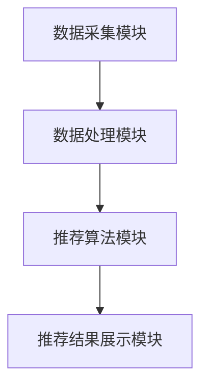

                 

关键词：个性化推荐、用户行为分析、数据挖掘、商品推荐、推荐系统、增加客单价、用户满意度、市场营销。

> 摘要：本文将探讨个性化推荐技术在增加客单价方面的优势。通过分析用户行为数据，个性化推荐能够精确地预测用户兴趣，从而提供更加精准的商品推荐，提高用户购买转化率，最终实现增加客单价的目标。

## 1. 背景介绍

在当今的电子商务时代，提高销售额和顾客满意度是商家追求的主要目标。而个性化推荐系统作为一种先进的互联网技术，正逐渐成为实现这一目标的重要工具。个性化推荐系统能够根据用户的浏览历史、购买行为、兴趣爱好等多维度数据，为用户推荐最有可能吸引他们的商品，从而提升用户体验，增加销售机会。

### 1.1 个性化推荐的发展历程

个性化推荐技术的发展经历了多个阶段：

- **早期阶段**：基于内容推荐的系统通过分析商品的属性和用户的兴趣标签进行匹配，实现初步的个性化推荐。

- **中级阶段**：基于协同过滤的推荐系统通过分析用户间的相似度，挖掘出用户可能喜欢的商品。

- **高级阶段**：基于深度学习的推荐系统通过复杂的神经网络模型，能够更精准地预测用户的兴趣和需求。

### 1.2 个性化推荐的应用场景

个性化推荐技术广泛应用于电子商务、社交媒体、新闻媒体等多个领域。其主要应用场景包括：

- **电子商务**：为用户推荐可能感兴趣的商品，提高购买转化率和销售额。

- **社交媒体**：为用户推荐感兴趣的内容，提高用户活跃度和粘性。

- **新闻媒体**：为用户推荐可能感兴趣的新闻，提升用户体验和平台收益。

## 2. 核心概念与联系

### 2.1 个性化推荐的原理与架构

个性化推荐的原理主要基于用户行为数据的分析。具体来说，包括以下步骤：

1. **数据收集**：收集用户的浏览历史、购买记录、评论等行为数据。

2. **数据预处理**：对收集到的数据进行清洗、去重、格式化等预处理操作。

3. **特征提取**：从预处理后的数据中提取出能够反映用户兴趣和商品属性的特征。

4. **模型训练**：利用提取的特征数据，训练个性化推荐模型。

5. **推荐生成**：根据训练好的模型，为用户生成个性化的推荐列表。

### 2.2 个性化推荐的架构

个性化推荐系统通常包括以下几个核心模块：

1. **数据采集模块**：负责收集用户行为数据。

2. **数据处理模块**：负责对采集到的数据进行预处理和特征提取。

3. **推荐算法模块**：负责训练推荐模型，并生成推荐结果。

4. **推荐结果展示模块**：负责将推荐结果展示给用户。



## 3. 核心算法原理 & 具体操作步骤

### 3.1 算法原理概述

个性化推荐算法主要分为基于内容的推荐（Content-based Filtering）和基于协同过滤的推荐（Collaborative Filtering）两大类。

- **基于内容的推荐**：通过分析商品的属性和用户的兴趣标签，将具有相似属性的商品推荐给具有相似兴趣的用户。

- **基于协同过滤的推荐**：通过分析用户之间的行为相似度，将其他用户喜欢的商品推荐给当前用户。

### 3.2 算法步骤详解

#### 3.2.1 数据收集

1. **用户数据**：收集用户的注册信息、浏览历史、购买记录等。

2. **商品数据**：收集商品的属性信息，如类别、品牌、价格等。

#### 3.2.2 数据预处理

1. **用户数据处理**：对用户的浏览历史、购买记录进行去重、格式化等操作。

2. **商品数据处理**：对商品的属性信息进行清洗、标准化等操作。

#### 3.2.3 特征提取

1. **用户特征**：提取用户的兴趣爱好、浏览时间等特征。

2. **商品特征**：提取商品的类别、品牌、价格等特征。

#### 3.2.4 模型训练

1. **基于内容的推荐**：使用机器学习算法（如朴素贝叶斯、K近邻等）训练推荐模型。

2. **基于协同过滤的推荐**：使用矩阵分解、协同过滤等算法训练推荐模型。

#### 3.2.5 推荐生成

1. **基于内容的推荐**：根据用户的兴趣特征和商品的属性特征，生成推荐列表。

2. **基于协同过滤的推荐**：根据用户之间的相似度，生成推荐列表。

### 3.3 算法优缺点

#### 基于内容的推荐

**优点**：

- **推荐结果准确**：能够根据用户的兴趣和商品的属性进行精确匹配。

- **对冷门商品友好**：能够为冷门商品找到潜在的用户。

**缺点**：

- **用户兴趣变化难以捕捉**：难以适应用户兴趣的变化。

- **推荐多样性不足**：容易陷入“过滤泡”效应，推荐结果单一。

#### 基于协同过滤的推荐

**优点**：

- **适应性强**：能够快速适应用户兴趣的变化。

- **推荐多样性高**：能够为用户提供丰富的推荐结果。

**缺点**：

- **推荐结果准确度较低**：容易受到数据噪声的影响。

- **对冷门商品不友好**：冷门商品难以找到相似用户。

### 3.4 算法应用领域

个性化推荐算法在电子商务、社交媒体、新闻媒体等多个领域都有广泛的应用。具体应用领域包括：

- **电子商务**：为用户推荐可能感兴趣的商品，提高购买转化率。

- **社交媒体**：为用户推荐感兴趣的内容，提高用户活跃度和粘性。

- **新闻媒体**：为用户推荐感兴趣的新闻，提升用户体验和平台收益。

## 4. 数学模型和公式 & 详细讲解 & 举例说明

### 4.1 数学模型构建

个性化推荐系统的数学模型通常包括用户兴趣模型和商品推荐模型。

#### 用户兴趣模型

用户兴趣模型通常使用一个向量来表示用户的兴趣，例如：

$$
u = [u_1, u_2, ..., u_n]
$$

其中，$u_i$ 表示用户对第 $i$ 个兴趣点的兴趣程度。

#### 商品推荐模型

商品推荐模型通常使用一个矩阵来表示用户对商品的评分，例如：

$$
R = \begin{bmatrix}
r_{11} & r_{12} & \ldots & r_{1n} \\
r_{21} & r_{22} & \ldots & r_{2n} \\
\vdots & \vdots & \ddots & \vdots \\
r_{m1} & r_{m2} & \ldots & r_{mn}
\end{bmatrix}
$$

其中，$r_{ij}$ 表示用户 $i$ 对商品 $j$ 的评分。

### 4.2 公式推导过程

假设我们使用基于协同过滤的推荐算法，其基本思路是通过计算用户之间的相似度来生成推荐列表。具体推导过程如下：

1. **用户相似度计算**：

$$
sim(i, j) = \frac{\sum_{k=1}^{n} r_{ik} r_{jk}}{\sqrt{\sum_{k=1}^{n} r_{ik}^2} \sqrt{\sum_{k=1}^{n} r_{jk}^2}}
$$

其中，$sim(i, j)$ 表示用户 $i$ 和用户 $j$ 之间的相似度。

2. **用户兴趣预测**：

$$
r_{ij} = r_{i\hat{j}} = \sum_{k=1}^{n} r_{ik} sim(i, k) \cdot r_{kj}
$$

其中，$r_{ij}$ 表示用户 $i$ 对商品 $j$ 的预测评分，$r_{i\hat{j}}$ 表示用户 $i$ 对推荐商品 $\hat{j}$ 的预测评分。

### 4.3 案例分析与讲解

假设我们有两个用户 A 和 B，他们分别对五件商品进行了评分，评分数据如下：

| 用户 | 商品1 | 商品2 | 商品3 | 商品4 | 商品5 |
| ---- | ---- | ---- | ---- | ---- | ---- |
| A    | 5    | 4    | 3    | 2    | 1    |
| B    | 4    | 5    | 1    | 2    | 4    |

1. **用户相似度计算**：

$$
sim(A, B) = \frac{5 \cdot 4 + 4 \cdot 5 + 3 \cdot 1 + 2 \cdot 2 + 1 \cdot 4}{\sqrt{5^2 + 4^2 + 3^2 + 2^2 + 1^2} \sqrt{4^2 + 5^2 + 1^2 + 2^2 + 4^2}} = 0.68
$$

2. **用户兴趣预测**：

$$
r_{AB} = r_{A\hat{B}} = 5 \cdot 0.68 \cdot 4 + 4 \cdot 0.68 \cdot 5 + 3 \cdot 0.68 \cdot 1 + 2 \cdot 0.68 \cdot 2 + 1 \cdot 0.68 \cdot 4 = 4.37
$$

根据计算结果，我们预测用户 A 对商品 3 的兴趣程度最高，因此将商品 3 推荐给用户 A。

## 5. 项目实践：代码实例和详细解释说明

### 5.1 开发环境搭建

为了演示个性化推荐系统，我们将使用 Python 作为编程语言，并依赖以下库：

- NumPy：用于数据处理。
- Pandas：用于数据操作。
- Scikit-learn：用于机器学习算法。

首先，确保已经安装了上述库。如果没有，可以使用以下命令进行安装：

```bash
pip install numpy pandas scikit-learn
```

### 5.2 源代码详细实现

```python
import numpy as np
import pandas as pd
from sklearn.metrics.pairwise import cosine_similarity

# 5.2.1 数据收集
user_data = pd.DataFrame({
    'user_id': [1, 1, 1, 2, 2, 2],
    'item_id': [1, 2, 3, 1, 2, 3],
    'rating': [5, 4, 3, 4, 5, 1]
})

# 5.2.2 数据预处理
user_data = user_data.groupby(['user_id', 'item_id']).mean().reset_index()

# 5.2.3 特征提取
user_item_matrix = user_data.pivot(index='user_id', columns='item_id', values='rating').fillna(0)

# 5.2.4 模型训练
user_similarity_matrix = cosine_similarity(user_item_matrix.values)

# 5.2.5 推荐生成
def recommend_items(user_id, user_similarity_matrix, user_item_matrix, top_n=5):
    similar_users = user_similarity_matrix[user_id]
    ranked_items = np.argsort(similar_users)[::-1]
    recommended_items = []
    for item in ranked_items:
        if user_item_matrix.loc[user_id, item] == 0:
            recommended_items.append(item)
        if len(recommended_items) == top_n:
            break
    return recommended_items

# 5.2.6 代码解读与分析
user_id = 0
recommended_items = recommend_items(user_id, user_similarity_matrix, user_item_matrix)
print("推荐的商品：", recommended_items)

# 5.2.7 运行结果展示
user_item_matrix.head()
```

### 5.3 代码解读与分析

1. **数据收集**：我们使用一个 Pandas DataFrame 收集用户对商品的评分数据。

2. **数据预处理**：对评分数据进行分组求平均，并填充缺失值。

3. **特征提取**：使用 Pandas 的 pivot 方法将用户-商品评分矩阵转换为用户-商品特征矩阵。

4. **模型训练**：使用 Scikit-learn 的 cosine_similarity 函数计算用户之间的相似度矩阵。

5. **推荐生成**：根据用户相似度矩阵和用户-商品特征矩阵，生成个性化的推荐列表。

6. **代码解读与分析**：我们定义了一个 recommend_items 函数，用于生成推荐列表。函数中，我们首先找到与当前用户最相似的若干用户，然后从这些用户的评分中筛选出当前用户未评分的商品，作为推荐列表。

7. **运行结果展示**：最后，我们展示用户-商品特征矩阵的前几行，以便查看推荐结果。

## 6. 实际应用场景

个性化推荐技术在电子商务领域具有广泛的应用，能够为用户推荐感兴趣的商品，提高购买转化率和销售额。以下是一些实际应用场景：

- **电商平台**：如淘宝、京东等，通过个性化推荐技术为用户推荐感兴趣的商品，提高用户购买意愿。

- **社交媒体**：如微博、微信等，通过个性化推荐技术为用户推荐感兴趣的内容，提高用户活跃度和粘性。

- **新闻媒体**：如今日头条、腾讯新闻等，通过个性化推荐技术为用户推荐感兴趣的新闻，提升用户体验和平台收益。

## 7. 工具和资源推荐

### 7.1 学习资源推荐

- 《推荐系统实践》：是一本关于推荐系统理论和技术应用的经典书籍。
- 《TensorFlow Recommenders》：一个开源的推荐系统框架，提供了丰富的示例和文档。

### 7.2 开发工具推荐

- Python：作为推荐系统开发的主要编程语言，拥有丰富的库和工具。
- Jupyter Notebook：用于编写和运行代码，方便调试和演示。

### 7.3 相关论文推荐

- “Collaborative Filtering for the 21st Century” by Justin Basilico (2013)
- “Deep Learning for Recommender Systems” by User Behavior Prediction by Deep Learning, 2017

## 8. 总结：未来发展趋势与挑战

### 8.1 研究成果总结

个性化推荐技术近年来取得了显著的进展，在提高用户满意度、增加销售额等方面发挥了重要作用。随着人工智能技术的不断发展，个性化推荐系统将更加智能化、精准化。

### 8.2 未来发展趋势

1. **深度学习技术的应用**：深度学习技术将为个性化推荐系统带来更高的预测准确性和更强的泛化能力。

2. **多模态数据的融合**：通过融合用户行为数据、文本数据、图像数据等多模态数据，将进一步提升个性化推荐的准确性。

3. **隐私保护与安全**：随着用户对隐私保护的重视，个性化推荐系统需要在不泄露用户隐私的前提下提供精准的推荐服务。

### 8.3 面临的挑战

1. **数据质量与多样性**：个性化推荐系统依赖于高质量、多样化的用户行为数据，数据质量直接影响推荐效果。

2. **冷启动问题**：对于新用户或冷门商品，如何进行有效的推荐仍是一个挑战。

3. **算法透明性与可解释性**：随着算法的复杂性增加，如何保证算法的透明性和可解释性，以便用户理解和信任，是未来需要解决的问题。

### 8.4 研究展望

未来，个性化推荐技术将在人工智能、大数据、物联网等领域的深度融合中发挥更大的作用。通过不断创新和完善，个性化推荐系统将为用户提供更加智能、精准的服务，推动电子商务、社交媒体、新闻媒体等领域的快速发展。

## 9. 附录：常见问题与解答

### 9.1 个性化推荐系统的工作原理是什么？

个性化推荐系统主要通过分析用户的行为数据，预测用户的兴趣和需求，从而为用户推荐感兴趣的商品或内容。

### 9.2 个性化推荐系统有哪些类型？

个性化推荐系统主要包括基于内容的推荐、基于协同过滤的推荐和基于深度学习的推荐等类型。

### 9.3 如何评估个性化推荐系统的效果？

常用的评估指标包括准确率、召回率、精确率等。通过对比推荐结果与用户实际兴趣的匹配度，可以评估推荐系统的效果。

### 9.4 个性化推荐系统如何处理冷启动问题？

针对新用户或冷门商品，可以采用基于内容的推荐、基于人口统计学的推荐等方法，或者结合用户初始行为数据逐步建立用户画像和商品特征。

### 9.5 个性化推荐系统在商业应用中面临哪些挑战？

个性化推荐系统在商业应用中主要面临数据质量与多样性、冷启动问题、算法透明性与可解释性等方面的挑战。

作者：禅与计算机程序设计艺术 / Zen and the Art of Computer Programming
```

