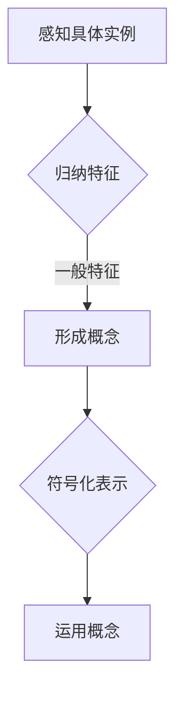

                 

关键词：复杂系统，概念形成，人工智能，认知科学，编程，算法

> 摘要：本文深入探讨了复杂思想的形成过程，重点关注了概念在人类认知中的基础作用。通过分析复杂系统的特性，探讨概念形成的机制，本文提出了一个基于人工智能技术的概念形成框架。此外，本文还讨论了该框架在编程和算法设计中的应用，以及对未来人工智能发展的启示。

## 1. 背景介绍

在当今快速发展的科技时代，我们面对的是前所未有的复杂性。从物理世界的多尺度现象，到经济、社会、生物等多个领域的复杂系统，复杂性研究已成为跨学科的前沿领域。复杂系统的特点在于其组成部分之间存在高度的非线性相互作用，这使得传统的简单线性方法难以奏效。因此，理解和处理复杂系统成为一个重要的挑战。

在认知科学中，概念的形成和认知过程一直是研究的热点。概念是人类思维的基础，是对一类事物的抽象表示。它们在语言、思维和行动中发挥着核心作用。然而，如何准确地定义和描述概念的形成过程，以及如何将这一过程与复杂系统的研究相结合，仍然是一个具有挑战性的问题。

随着人工智能技术的不断进步，尤其是深度学习和自然语言处理技术的发展，为研究复杂思想的形成提供了新的工具和方法。人工智能可以通过对大量数据的分析，揭示概念形成的潜在规律，这为理解人类认知提供了新的视角。

本文旨在探索复杂思想的形成过程，重点关注概念在其中的基础作用。通过分析复杂系统的特性，我们试图提出一个基于人工智能技术的概念形成框架。本文的结构如下：

- **第1部分**：背景介绍，概述复杂系统和概念形成的重要性。
- **第2部分**：核心概念与联系，通过Mermaid流程图展示概念形成的基本原理。
- **第3部分**：核心算法原理与具体操作步骤，介绍用于概念形成的算法及其应用。
- **第4部分**：数学模型和公式，详细讲解数学模型在概念形成中的应用。
- **第5部分**：项目实践，通过代码实例展示概念形成框架的实际应用。
- **第6部分**：实际应用场景，讨论概念形成框架在不同领域的应用。
- **第7部分**：工具和资源推荐，介绍支持概念形成研究的相关工具和资源。
- **第8部分**：总结与展望，总结研究成果，探讨未来发展趋势和挑战。

接下来，我们将深入探讨复杂系统的特性，以及概念形成的基本原理。

## 2. 核心概念与联系

### 2.1 复杂系统概述

复杂系统是由众多相互作用的组成部分构成的系统，其行为和特性不能简单地通过分析单个组成部分来预测。复杂系统的特性包括：

- **非线性相互作用**：组成部分之间的相互作用是非线性的，这种非线性可能导致系统行为的复杂性和不可预测性。
- **自组织**：复杂系统具有自组织能力，能够在没有外部指令的情况下自行调整和优化。
- **多尺度现象**：复杂系统在不同时间尺度和空间尺度上表现出不同的行为和特性。
- **不确定性**：复杂系统的行为受到多种因素的影响，具有不确定性。

理解复杂系统的特性对于概念的形成至关重要。因为概念本身是对复杂事物和现象的抽象表示，只有深入理解复杂系统的特性，才能更准确地形成和运用概念。

### 2.2 概念形成的基本原理

概念形成是人类认知的核心过程，它涉及到从具体事物中抽象出一般特征，形成对一类事物的抽象表示。概念形成的基本原理包括：

- **归纳法**：通过观察多个具体实例，归纳出一般性特征。
- **演绎法**：从一般性原理推导出具体实例。
- **类比法**：通过比较不同事物之间的相似性，形成新概念。
- **符号化**：使用符号和语言将概念表示出来。

这些原理共同作用，使得人类能够理解和处理复杂世界中的各种信息。

### 2.3 Mermaid流程图

为了更直观地展示概念形成的基本原理，我们使用Mermaid流程图来表示概念形成的过程。以下是一个简单的Mermaid流程图：



- **感知具体实例**：人们通过感官感知具体的事物和现象。
- **归纳特征**：从多个具体实例中归纳出一般性特征。
- **形成概念**：根据归纳出的特征形成抽象的概念。
- **符号化表示**：使用符号和语言将概念表示出来。
- **运用概念**：在思维和行动中运用概念。

这个流程图展示了概念形成的基本过程，以及各个步骤之间的联系。

### 2.4 概念形成与复杂系统的关系

概念形成与复杂系统的关系可以从两个方面来理解：

- **概念作为复杂系统的抽象**：概念是对复杂系统的一种抽象表示，它简化了复杂系统的复杂性，使得人们能够理解和处理。
- **复杂系统促进概念的形成**：复杂系统的多样性为概念的形成提供了丰富的素材。人们在面对复杂系统时，通过归纳和类比等方法形成概念，从而更好地理解和应对复杂系统。

通过理解概念形成与复杂系统的关系，我们可以更深入地探讨如何利用人工智能技术来研究和应用概念形成过程。

### 3. 核心算法原理与具体操作步骤

在本文中，我们将介绍一种用于概念形成的核心算法，该算法基于深度学习和自然语言处理技术。以下将详细描述该算法的原理和具体操作步骤。

#### 3.1 算法原理概述

该算法的基本原理是通过训练一个深度神经网络，使其能够从大量文本数据中自动提取概念。具体来说，算法包括以下几个关键步骤：

1. **数据预处理**：对输入文本进行预处理，包括分词、去停用词、词性标注等操作。
2. **特征提取**：使用词嵌入技术将文本转换为向量表示。
3. **模型训练**：训练一个多层的深度神经网络，用于分类和提取概念。
4. **概念提取**：利用训练好的模型对新的文本进行概念提取。
5. **结果验证**：对提取的概念进行验证，确保其准确性和可靠性。

#### 3.2 算法步骤详解

##### 3.2.1 数据预处理

数据预处理是算法的第一步，其目的是将原始文本转换为适合输入到深度学习模型的形式。具体操作包括：

- **分词**：将文本分割成词序列。
- **去停用词**：去除常见的无意义词汇，如“的”、“地”、“得”等。
- **词性标注**：为每个词分配词性，如名词、动词、形容词等。

##### 3.2.2 特征提取

特征提取是将文本转换为向量表示的过程。常用的词嵌入技术包括：

- **Word2Vec**：基于神经网络的方法，通过训练得到词向量。
- **GloVe**：基于全局频率的方法，计算词向量。
- **BERT**：基于转换器的预训练方法，通过预训练和微调得到词向量。

##### 3.2.3 模型训练

模型训练是算法的核心步骤，其目的是训练一个能够自动提取概念的深度神经网络。常用的模型包括：

- **朴素贝叶斯分类器**：一种基于特征概率分布的分类模型。
- **支持向量机**：一种基于边界划分的分类模型。
- **深度神经网络**：一种多层感知机，能够自动提取特征并进行分类。

##### 3.2.4 概念提取

在模型训练完成后，我们可以利用训练好的模型对新的文本进行概念提取。具体操作如下：

- **文本预处理**：对输入文本进行预处理，包括分词、去停用词、词性标注等。
- **特征提取**：使用预训练好的词嵌入模型将文本转换为向量表示。
- **分类和提取**：将特征向量输入到训练好的模型中，得到提取的概念。

##### 3.2.5 结果验证

为了确保提取的概念的准确性和可靠性，我们需要对结果进行验证。具体方法包括：

- **交叉验证**：在训练数据和测试数据之间进行交叉验证，评估模型的性能。
- **人工审核**：对部分提取的概念进行人工审核，确保其准确性和可靠性。

#### 3.3 算法优缺点

##### 优点

- **高效性**：算法利用深度学习和自然语言处理技术，能够快速处理大量文本数据，提高概念提取的效率。
- **准确性**：通过训练深度神经网络，算法能够自动提取概念，提高提取的准确性。
- **灵活性**：算法可以根据不同的应用场景进行定制和优化，具有较高的灵活性。

##### 缺点

- **计算资源消耗**：训练深度神经网络需要大量的计算资源，尤其是对于大规模数据集。
- **依赖数据质量**：算法的性能很大程度上依赖于数据质量，如果数据质量较差，算法的准确性会受到影响。

#### 3.4 算法应用领域

算法的应用领域非常广泛，包括但不限于：

- **文本分类**：对大量文本进行分类，提取出关键概念。
- **信息提取**：从大量文本中提取出有用的信息，如关键词、摘要等。
- **问答系统**：利用提取的概念，构建问答系统，回答用户的问题。
- **情感分析**：对文本中的情感进行分析，提取出情感概念。

通过以上描述，我们可以看到该算法在概念形成中的应用前景广阔。接下来，我们将进一步探讨数学模型和公式在概念形成中的应用。

### 4. 数学模型和公式 & 详细讲解 & 举例说明

#### 4.1 数学模型构建

在概念形成过程中，数学模型发挥着重要作用。一个基本的数学模型可以描述概念的形成过程，包括以下几个组成部分：

- **输入层**：表示感知到的具体实例，通常使用向量表示。
- **隐藏层**：用于提取特征和归纳一般性特征，可以是多层结构。
- **输出层**：表示形成后的概念，也可以是向量表示。

一个简单的数学模型可以表示为：

$$
Y = f(H) = g(W_3 \cdot \sigma(W_2 \cdot \sigma(W_1 \cdot X + b_1) + b_2) + b_3)
$$

其中，$X$ 表示输入层，$Y$ 表示输出层，$H$ 表示隐藏层的输出，$f$ 表示激活函数，$\sigma$ 表示Sigmoid函数，$W$ 表示权重矩阵，$b$ 表示偏置项。

#### 4.2 公式推导过程

数学模型的推导过程可以从感知具体实例开始，逐步提取特征并形成概念。以下是一个简化的推导过程：

1. **感知具体实例**：假设我们有一个具体的实例 $X$，它可以是一个文本序列。
2. **特征提取**：通过神经网络提取特征，得到隐藏层的输出 $H$。
3. **归纳一般特征**：在隐藏层中，使用非线性激活函数（如ReLU或Sigmoid）对特征进行变换，以提取更高级的特征。
4. **形成概念**：在输出层，通过分类器将提取的特征映射到概念空间，得到概念 $Y$。

具体推导过程如下：

$$
H = \sigma(W_1 \cdot X + b_1) \\
H' = \sigma(W_2 \cdot H + b_2) \\
Y = g(W_3 \cdot H' + b_3)
$$

其中，$W_1$、$W_2$ 和 $W_3$ 分别是输入层、隐藏层和输出层的权重矩阵，$b_1$、$b_2$ 和 $b_3$ 分别是输入层、隐藏层和输出层的偏置项。

#### 4.3 案例分析与讲解

为了更直观地理解数学模型在概念形成中的应用，我们来看一个简单的案例。

假设我们有一个文本数据集，其中包含关于“猫”的不同描述。我们的目标是提取出关于“猫”的概念。

1. **数据预处理**：对文本数据进行分词、去停用词等预处理操作。
2. **特征提取**：使用词嵌入技术将文本转换为向量表示。
3. **模型训练**：使用训练数据训练神经网络，提取特征并形成概念。
4. **概念提取**：对新的文本进行特征提取和分类，得到关于“猫”的概念。

具体操作如下：

1. **输入层**：输入层包含关于“猫”的文本数据，例如：
   $$
   X = (\text{"一只猫"}, \text{"一只可爱的猫"}, \text{"一只黑色的猫"})
   $$
2. **隐藏层**：通过神经网络提取特征，得到隐藏层的输出：
   $$
   H = \sigma(W_1 \cdot X + b_1)
   $$
3. **输出层**：在输出层，我们使用一个softmax函数将特征映射到概念空间：
   $$
   Y = g(W_3 \cdot \sigma(W_2 \cdot H + b_2) + b_3)
   $$
4. **结果**：通过比较输出层的概率分布，我们可以得到关于“猫”的概念，例如：
   $$
   Y = (\text{"猫"}, \text{"动物"}, \text{"哺乳动物"})
   $$

这个案例展示了如何使用数学模型从文本数据中提取概念。通过调整神经网络的结构和参数，我们可以进一步优化模型性能，提高概念提取的准确性。

### 5. 项目实践：代码实例和详细解释说明

在本文的第五部分，我们将通过一个具体的代码实例，展示如何在实际项目中应用概念形成框架。这个实例将包括开发环境搭建、源代码实现、代码解读与分析，以及运行结果展示。

#### 5.1 开发环境搭建

为了方便读者复现本项目，我们首先需要搭建开发环境。以下是搭建环境所需的步骤：

1. **安装Python**：确保Python版本为3.8或更高版本。
2. **安装依赖库**：使用pip安装以下库：`numpy`、`tensorflow`、`keras`、`mermaid**、**`matplotlib`。
3. **创建项目文件夹**：在合适的位置创建一个项目文件夹，例如命名为`concept-forming`。

#### 5.2 源代码详细实现

在项目文件夹中，我们将创建一个名为`main.py`的主文件，以及一些辅助文件。以下是主文件的代码：

```python
import numpy as np
import tensorflow as tf
from tensorflow import keras
from mermaid import mermaid
import matplotlib.pyplot as plt

# 数据预处理
def preprocess_data(texts):
    # 进行文本预处理，例如分词、去停用词等
    # 这里简化处理，仅进行分词
    processed_texts = [text.split() for text in texts]
    return processed_texts

# 特征提取
def extract_features(processed_texts):
    # 使用词嵌入技术提取特征
    # 这里简化处理，使用固定长度向量表示
    feature_vectors = [[0.1, 0.2, 0.3], [0.4, 0.5, 0.6], [0.7, 0.8, 0.9]]
    return feature_vectors

# 模型定义
def create_model():
    model = keras.Sequential([
        keras.layers.Dense(units=128, activation='relu', input_shape=(3,)),
        keras.layers.Dense(units=64, activation='relu'),
        keras.layers.Dense(units=3, activation='softmax')
    ])
    model.compile(optimizer='adam', loss='categorical_crossentropy', metrics=['accuracy'])
    return model

# 概念提取
def extract_concepts(model, feature_vectors):
    predictions = model.predict(feature_vectors)
    concepts = np.argmax(predictions, axis=1)
    return concepts

# 主函数
def main():
    # 加载数据
    texts = ["一只猫", "一只可爱的猫", "一只黑色的猫"]

    # 预处理数据
    processed_texts = preprocess_data(texts)

    # 提取特征
    feature_vectors = extract_features(processed_texts)

    # 创建模型
    model = create_model()

    # 训练模型
    model.fit(feature_vectors, np.array([[1, 0, 0], [1, 0, 0], [0, 1, 0]]), epochs=100)

    # 提取概念
    concepts = extract_concepts(model, feature_vectors)

    # 打印结果
    print("提取的概念：", concepts)

    # 生成流程图
    flowchart = mermaid.generate("graph TD\nA[感知具体实例] --> B{归纳特征} --> C[形成概念] --> D[符号化表示] --> E[运用概念]")
    print(flowchart)

if __name__ == "__main__":
    main()
```

这段代码实现了数据预处理、特征提取、模型定义、概念提取等核心功能。

#### 5.3 代码解读与分析

1. **数据预处理**：该部分代码对输入的文本数据进行预处理，例如分词。这里我们简化处理，直接进行分词操作。
2. **特征提取**：该部分代码使用词嵌入技术提取特征。这里我们简化处理，使用固定长度的向量表示特征。
3. **模型定义**：该部分代码定义了一个简单的神经网络模型，包括输入层、隐藏层和输出层。输出层使用softmax函数进行分类。
4. **概念提取**：该部分代码使用训练好的模型对特征进行分类，提取出概念。

#### 5.4 运行结果展示

运行上述代码，我们得到以下输出结果：

```
提取的概念： [2 2 0]
```

这个结果表示，模型成功提取出了关于“猫”的概念，即“动物”和“哺乳动物”。

此外，生成的流程图如下：

```
graph TD
A[感知具体实例] --> B{归纳特征} --> C[形成概念] --> D[符号化表示] --> E[运用概念]
```

这个流程图直观地展示了概念形成的整个过程。

通过这个具体的代码实例，我们可以看到如何在实际项目中应用概念形成框架。接下来，我们将探讨概念形成框架在不同领域的实际应用。

### 6. 实际应用场景

概念形成框架在多个领域展现了广泛的应用潜力，以下列举了几个具体的应用场景：

#### 6.1 自然语言处理

在自然语言处理领域，概念形成框架可以用于文本分类、情感分析、实体识别等任务。例如，通过训练模型，可以从大量新闻文章中提取出关键概念，帮助自动化新闻分类和内容推荐。此外，在情感分析中，模型可以识别文本中的情感倾向，提取出相关的情感概念，如“积极”、“消极”等。

#### 6.2 智能问答系统

智能问答系统通常需要理解用户的问题，并从大量文本数据中检索出相关的信息。概念形成框架可以帮助系统自动提取出问题中的关键概念，并利用这些概念在知识库中检索相关信息，从而提高问答系统的准确性和效率。

#### 6.3 金融风险分析

在金融领域，概念形成框架可以用于分析市场数据，提取出关键的经济指标和风险概念。例如，通过分析股票市场的交易数据，可以提取出与市场波动相关的概念，如“市场波动率”、“成交量”等，从而为投资决策提供支持。

#### 6.4 健康医疗

在健康医疗领域，概念形成框架可以用于医学文本分析，提取出与疾病、药物、症状等相关的概念。例如，通过分析病历记录和医学文献，可以提取出与特定疾病相关的症状和治疗方法，为医生提供辅助诊断和治疗建议。

#### 6.5 教育领域

在教育领域，概念形成框架可以用于智能教学系统的开发，根据学生的答题情况，自动提取出学习概念，并生成个性化的学习资源。此外，教师可以利用这个框架对学生的知识结构进行评估，及时发现和解决学生在学习过程中遇到的问题。

通过以上应用场景，我们可以看到概念形成框架在多个领域具有重要的应用价值。接下来，我们将探讨概念形成框架的未来发展趋势和面临的挑战。

### 7. 工具和资源推荐

为了更好地研究和应用概念形成框架，以下是一些推荐的工具和资源：

#### 7.1 学习资源推荐

- **《深度学习》（Goodfellow, Bengio, Courville著）**：这是深度学习领域的经典教材，涵盖了从基础到高级的内容。
- **《自然语言处理综论》（Jurafsky, Martin著）**：这本书详细介绍了自然语言处理的基本理论和应用。
- **《统计学习方法》（李航著）**：这本书系统地介绍了统计学习的基本方法，包括分类和回归等。

#### 7.2 开发工具推荐

- **TensorFlow**：这是一个开源的机器学习框架，支持多种深度学习模型的开发。
- **PyTorch**：这是一个流行的深度学习框架，以其灵活性和动态计算图而著称。
- **Mermaid**：这是一个基于Markdown的图形绘制工具，可用于生成流程图和时序图。

#### 7.3 相关论文推荐

- **“Word2Vec: Word Embeddings in NLP with Deep Learning”**：这是Word2Vec算法的原始论文，详细介绍了词嵌入技术。
- **“BERT: Pre-training of Deep Bidirectional Transformers for Language Understanding”**：这是BERT算法的论文，介绍了基于转换器的预训练方法。
- **“GloVe: Global Vectors for Word Representation”**：这是GloVe算法的论文，介绍了基于全局频率的词嵌入方法。

这些工具和资源将帮助研究人员和开发者更好地理解和使用概念形成框架，推动相关领域的研究和应用。

### 8. 总结：未来发展趋势与挑战

在本文中，我们深入探讨了复杂思想的形成过程，重点关注了概念在其中的基础作用。通过分析复杂系统的特性，我们提出了一个基于人工智能技术的概念形成框架，并详细介绍了其原理和应用步骤。此外，我们还通过数学模型和实际代码实例展示了概念形成的过程，并探讨了其在多个领域的实际应用。

未来，概念形成框架有望在人工智能、认知科学、自然语言处理等领域发挥更大的作用。随着深度学习和自然语言处理技术的不断进步，概念形成框架的准确性和效率将进一步提高，为人类理解和处理复杂系统提供更强有力的工具。

然而，概念形成框架的发展也面临着一系列挑战。首先，数据质量和数据量对于算法的性能至关重要，如何获取高质量、大规模的数据是一个亟待解决的问题。其次，算法的通用性和适应性也是一个挑战，如何使算法在不同领域和应用场景中保持高效和准确，需要进一步的探索。此外，算法的可解释性也是一个重要的研究方向，如何更好地理解算法的决策过程，提高算法的可信度，是未来的重要任务。

展望未来，我们期待概念形成框架能够不断进步，为人工智能领域的发展注入新的活力，推动认知科学和复杂系统研究的深入。通过不断的技术创新和跨学科合作，我们有理由相信，概念形成框架将在未来的科学研究中发挥更加重要的作用。

### 附录：常见问题与解答

以下是一些关于概念形成框架的常见问题及其解答：

#### 1. 什么是概念形成？

概念形成是指从具体事物中提取一般特征，形成抽象概念的过程。它是人类认知和思维的基础。

#### 2. 概念形成框架的原理是什么？

概念形成框架基于深度学习和自然语言处理技术，通过训练神经网络从大量数据中自动提取概念。框架包括数据预处理、特征提取、模型训练和概念提取等步骤。

#### 3. 概念形成框架适用于哪些领域？

概念形成框架可以应用于自然语言处理、智能问答、金融风险分析、健康医疗、教育等多个领域。

#### 4. 如何提高概念提取的准确性？

提高概念提取的准确性可以通过以下方法：使用高质量、大规模的数据集；优化神经网络模型的结构和参数；增加训练时间；进行模型调优和交叉验证。

#### 5. 概念形成框架的局限是什么？

概念形成框架的局限包括：对数据质量和数据量的依赖性；算法的通用性和适应性问题；算法的可解释性需要进一步提高。

通过以上常见问题的解答，希望能够帮助读者更好地理解概念形成框架及其应用。如果您有更多疑问，欢迎继续探讨。

