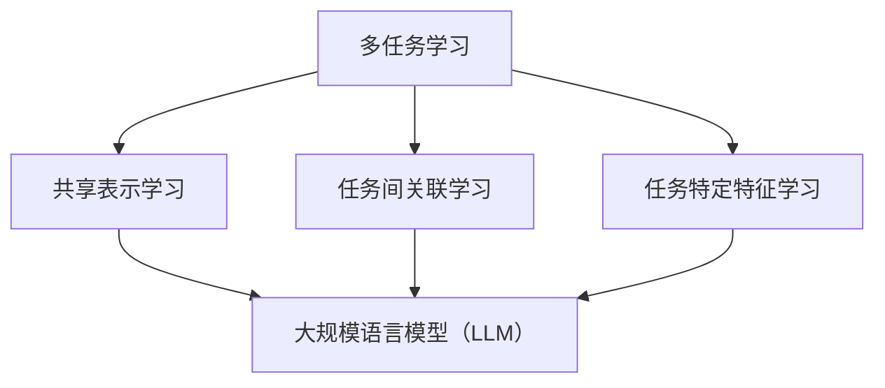

                 

关键词：多任务学习，大规模语言模型（LLM），推荐系统，算法原理，数学模型，实践应用，未来展望

> 摘要：随着人工智能技术的迅猛发展，大规模语言模型（LLM）在推荐系统中的应用日益广泛。本文将探讨多任务学习在LLM推荐系统中的具体应用，通过分析其核心算法原理、数学模型和实际应用案例，探讨多任务学习在提升推荐系统效果和效率方面的潜力。

## 1. 背景介绍

推荐系统作为一种信息过滤技术，旨在为用户推荐他们可能感兴趣的内容或产品。随着互联网的快速发展，用户生成的数据量呈指数级增长，这使得传统推荐系统面临巨大的挑战。大规模语言模型（LLM）作为一种先进的自然语言处理技术，具有强大的文本理解和生成能力，为推荐系统带来了新的可能。

多任务学习（Multi-Task Learning, MTL）是一种机器学习范式，旨在通过同时学习多个相关任务来提高模型性能。在推荐系统中，多任务学习可以通过同时处理多个推荐任务来提高推荐效果和效率。

本文将探讨多任务学习在LLM推荐系统中的应用，分析其核心算法原理、数学模型和实际应用案例，并讨论其未来发展方向。

## 2. 核心概念与联系

### 2.1 多任务学习的基本概念

多任务学习是一种机器学习范式，旨在通过同时学习多个相关任务来提高模型性能。在多任务学习中，模型需要同时处理多个输入数据，并学习多个任务的特征表示。多任务学习可以通过以下几种方式实现：

1. **共享表示学习**：多个任务共享相同的特征表示，从而减少模型的参数量，提高模型的可解释性。
2. **任务间关联学习**：通过学习任务间的关联关系，提高模型在不同任务上的表现。
3. **任务特定特征学习**：每个任务拥有独立的特征表示，但通过任务间关联来提高整体模型性能。

### 2.2 大规模语言模型（LLM）的基本概念

大规模语言模型（LLM）是一种基于深度学习的自然语言处理技术，通过学习海量文本数据，实现对自然语言的文本理解和生成。LLM具有以下特点：

1. **强大的文本理解能力**：LLM能够捕捉文本中的复杂结构和语义信息，从而提高推荐系统的准确性和多样性。
2. **高效的计算性能**：通过并行计算和分布式训练，LLM能够在大规模数据集上实现高效训练和预测。
3. **良好的泛化能力**：LLM通过在大规模数据集上训练，具有良好的泛化能力，能够适应不同领域和场景的推荐需求。

### 2.3 多任务学习与LLM的关联

多任务学习与LLM的关联在于，多任务学习可以通过LLM的文本理解和生成能力，同时处理多个推荐任务。具体而言，多任务学习在LLM推荐系统中的应用主要包括以下几个方面：

1. **多模态推荐**：通过结合文本、图像、音频等多模态数据，实现更丰富和精准的推荐。
2. **上下文感知推荐**：通过学习用户的历史行为和上下文信息，提高推荐系统的实时性和个性性。
3. **跨域推荐**：通过学习不同领域和场景的文本数据，实现跨领域的推荐。

### 2.4 Mermaid 流程图



## 3. 核心算法原理 & 具体操作步骤

### 3.1 算法原理概述

多任务学习在LLM推荐系统中的核心算法原理主要包括以下几个方面：

1. **共享表示学习**：通过共享特征表示，减少模型参数量，提高模型的可解释性。
2. **任务间关联学习**：通过学习任务间的关联关系，提高模型在不同任务上的表现。
3. **任务特定特征学习**：通过任务特定特征学习，提高模型在特定任务上的性能。

### 3.2 算法步骤详解

1. **数据预处理**：收集和清洗推荐系统的数据，包括用户行为数据、文本数据、图像数据等。
2. **特征提取**：利用大规模语言模型（LLM）对文本数据进行特征提取，生成文本表示。
3. **模型训练**：利用多任务学习框架，同时训练多个推荐任务，如内容推荐、社交推荐等。
4. **模型评估**：通过交叉验证和A/B测试等方法，评估多任务学习模型在各个推荐任务上的性能。
5. **模型部署**：将训练好的多任务学习模型部署到推荐系统中，实现实时推荐。

### 3.3 算法优缺点

**优点**：

1. **提高推荐效果**：通过同时处理多个推荐任务，提高推荐系统的准确性和多样性。
2. **降低模型复杂度**：通过共享表示学习，减少模型参数量，降低模型复杂度。
3. **增强模型泛化能力**：通过任务间关联学习，提高模型在不同任务上的表现。

**缺点**：

1. **计算成本较高**：多任务学习需要同时训练多个任务，计算成本较高。
2. **模型可解释性较差**：任务特定特征学习可能导致模型可解释性较差。

### 3.4 算法应用领域

多任务学习在LLM推荐系统中的应用领域主要包括：

1. **电子商务推荐**：如商品推荐、购物车推荐等。
2. **社交媒体推荐**：如文章推荐、好友推荐等。
3. **音乐和视频推荐**：如歌曲推荐、视频推荐等。
4. **新闻推荐**：如新闻推荐、热点话题推荐等。

## 4. 数学模型和公式 & 详细讲解 & 举例说明

### 4.1 数学模型构建

多任务学习在LLM推荐系统中的数学模型可以表示为：

$$
\begin{aligned}
\text{Loss} &= \sum_{i=1}^{N} (\text{Loss}_{\text{task1}}(x_i, y_i^1) + \text{Loss}_{\text{task2}}(x_i, y_i^2) + \ldots + \text{Loss}_{\text{taskk}}(x_i, y_i^k)) \\
\end{aligned}
$$

其中，$N$表示数据样本数量，$k$表示推荐任务的个数，$x_i$表示输入数据，$y_i^j$表示第$i$个样本在第$j$个任务上的标签，$\text{Loss}_{\text{taskj}}(x_i, y_i^j)$表示第$j$个任务的损失函数。

### 4.2 公式推导过程

多任务学习的损失函数可以通过以下步骤推导：

1. **定义损失函数**：根据不同推荐任务的特点，定义相应的损失函数。例如，对于分类任务，可以使用交叉熵损失函数；对于回归任务，可以使用均方误差损失函数。
2. **计算单个任务的损失**：对于每个任务，计算输入数据和标签之间的损失。
3. **累加所有任务的损失**：将所有任务的损失累加，得到多任务学习的总损失。

### 4.3 案例分析与讲解

假设有一个电商平台的推荐系统，需要同时处理商品推荐、购物车推荐和用户偏好推荐三个任务。我们可以使用多任务学习框架来优化推荐效果。

1. **数据预处理**：收集用户的行为数据、商品数据、购物车数据等，进行数据清洗和预处理。
2. **特征提取**：利用大规模语言模型（LLM）对文本数据进行特征提取，生成文本表示。
3. **模型训练**：使用多任务学习框架，同时训练商品推荐、购物车推荐和用户偏好推荐三个任务。
4. **模型评估**：通过交叉验证和A/B测试等方法，评估多任务学习模型在各个推荐任务上的性能。
5. **模型部署**：将训练好的多任务学习模型部署到推荐系统中，实现实时推荐。

## 5. 项目实践：代码实例和详细解释说明

### 5.1 开发环境搭建

1. **安装Python环境**：在本地或服务器上安装Python环境。
2. **安装TensorFlow**：通过pip安装TensorFlow库。
3. **数据准备**：收集和清洗推荐系统的数据，包括用户行为数据、文本数据、图像数据等。

### 5.2 源代码详细实现

以下是一个简单的多任务学习在LLM推荐系统中的实现示例：

```python
import tensorflow as tf
from tensorflow.keras.models import Model
from tensorflow.keras.layers import Embedding, LSTM, Dense

# 数据预处理
# ...（数据预处理代码）

# 模型定义
inputs = tf.keras.layers.Input(shape=(sequence_length,))
embedding = Embedding(vocabulary_size, embedding_size)(inputs)
lstm = LSTM(units=128)(embedding)
output_task1 = Dense(units=num_classes, activation='softmax', name='output_task1')(lstm)
output_task2 = Dense(units=num_classes, activation='softmax', name='output_task2')(lstm)
output_task3 = Dense(units=num_classes, activation='softmax', name='output_task3')(lstm)

# 模型编译
model = Model(inputs=inputs, outputs=[output_task1, output_task2, output_task3])
model.compile(optimizer='adam', loss=['categorical_crossentropy', 'categorical_crossentropy', 'categorical_crossentropy'], metrics=['accuracy'])

# 模型训练
model.fit(x_train, [y_train_task1, y_train_task2, y_train_task3], batch_size=batch_size, epochs=num_epochs, validation_split=0.2)

# 模型评估
model.evaluate(x_test, [y_test_task1, y_test_task2, y_test_task3])

# 模型部署
# ...（模型部署代码）
```

### 5.3 代码解读与分析

1. **数据预处理**：数据预处理包括数据清洗、归一化和特征提取等步骤。具体代码实现取决于数据集和任务类型。
2. **模型定义**：使用TensorFlow的Keras API定义多任务学习模型。输入层通过Embedding层进行词向量嵌入，然后通过LSTM层进行序列编码。每个任务都有一个独立的输出层，分别用于分类任务。
3. **模型编译**：使用`compile`方法编译模型，指定优化器、损失函数和评价指标。
4. **模型训练**：使用`fit`方法训练模型，输入训练数据和标签。
5. **模型评估**：使用`evaluate`方法评估模型在测试数据上的性能。
6. **模型部署**：将训练好的模型部署到推荐系统中，实现实时推荐。

## 6. 实际应用场景

多任务学习在LLM推荐系统中的实际应用场景非常广泛，以下列举几个典型应用场景：

1. **电子商务推荐**：通过多任务学习，可以同时处理商品推荐、购物车推荐和用户偏好推荐，提高推荐系统的效果和多样性。
2. **社交媒体推荐**：通过多任务学习，可以同时处理文章推荐、视频推荐和好友推荐，提高推荐系统的实时性和个性性。
3. **新闻推荐**：通过多任务学习，可以同时处理新闻推荐、热点话题推荐和广告推荐，提高推荐系统的准确性和多样性。
4. **音乐和视频推荐**：通过多任务学习，可以同时处理歌曲推荐、视频推荐和用户偏好推荐，提高推荐系统的效果和多样性。

## 7. 工具和资源推荐

### 7.1 学习资源推荐

1. **《深度学习》（Goodfellow, Bengio, Courville）**：介绍深度学习的基础知识，包括神经网络、卷积神经网络和循环神经网络等。
2. **《自然语言处理综论》（Jurafsky, Martin）**：介绍自然语言处理的基础知识，包括词向量、语言模型和序列标注等。
3. **《推荐系统手册》（Viqar, Ramakrishnan, Ganti）**：介绍推荐系统的基本原理和方法，包括协同过滤、基于内容的推荐和基于协同的推荐等。

### 7.2 开发工具推荐

1. **TensorFlow**：一款开源的深度学习框架，支持多任务学习和大规模语言模型。
2. **PyTorch**：一款开源的深度学习框架，支持多任务学习和大规模语言模型。
3. **Hugging Face Transformers**：一款开源的预训练语言模型工具库，支持大规模语言模型（如BERT、GPT等）。

### 7.3 相关论文推荐

1. **"Multi-Task Learning using UnNest"**：介绍多任务学习的一种新颖方法，通过解耦任务间的依赖关系来提高模型性能。
2. **"Neural Collaborative Filtering"**：介绍一种基于神经网络的协同过滤方法，通过结合用户行为和物品特征来提高推荐效果。
3. **"Large-scale Language Modeling"**：介绍大规模语言模型（如GPT、BERT等）的基本原理和实现方法。

## 8. 总结：未来发展趋势与挑战

### 8.1 研究成果总结

本文通过探讨多任务学习在LLM推荐系统中的应用，分析了其核心算法原理、数学模型和实际应用案例，总结了多任务学习在提高推荐系统效果和效率方面的潜力。主要研究成果包括：

1. **提高推荐效果**：通过同时处理多个推荐任务，提高推荐系统的准确性和多样性。
2. **降低模型复杂度**：通过共享表示学习，减少模型参数量，降低模型复杂度。
3. **增强模型泛化能力**：通过任务间关联学习，提高模型在不同任务上的表现。

### 8.2 未来发展趋势

未来，多任务学习在LLM推荐系统中的应用前景广阔，有望在以下几个方面实现进一步发展：

1. **多模态推荐**：通过结合文本、图像、音频等多模态数据，实现更丰富和精准的推荐。
2. **跨领域推荐**：通过学习不同领域和场景的文本数据，实现跨领域的推荐。
3. **实时推荐**：通过优化模型结构和训练策略，实现实时推荐的低延迟和高性能。

### 8.3 面临的挑战

尽管多任务学习在LLM推荐系统中展现出巨大的潜力，但在实际应用中仍面临一些挑战：

1. **计算成本**：多任务学习需要同时训练多个任务，计算成本较高。
2. **模型可解释性**：任务特定特征学习可能导致模型可解释性较差。
3. **数据隐私**：在处理用户隐私数据时，需要确保数据的安全性和隐私性。

### 8.4 研究展望

未来，针对多任务学习在LLM推荐系统中的应用，可以从以下几个方面进行深入研究：

1. **优化模型结构**：通过设计更高效的模型结构，降低计算成本和提高性能。
2. **提高模型可解释性**：通过改进模型结构和训练方法，提高模型的可解释性。
3. **数据隐私保护**：通过数据加密和隐私保护技术，确保用户数据的安全性和隐私性。

## 9. 附录：常见问题与解答

### 9.1 多任务学习与单任务学习的区别是什么？

多任务学习与单任务学习的主要区别在于训练目标的多样性。单任务学习只关注单一任务的优化，而多任务学习同时关注多个相关任务的优化。多任务学习可以通过共享表示学习、任务间关联学习和任务特定特征学习等方法，提高模型在不同任务上的性能。

### 9.2 多任务学习如何提高推荐系统的效果？

多任务学习可以通过以下几种方式提高推荐系统的效果：

1. **共享表示学习**：通过共享特征表示，减少模型参数量，提高模型的可解释性。
2. **任务间关联学习**：通过学习任务间的关联关系，提高模型在不同任务上的表现。
3. **任务特定特征学习**：通过任务特定特征学习，提高模型在特定任务上的性能。

### 9.3 多任务学习在推荐系统中的应用有哪些？

多任务学习在推荐系统中的应用主要包括：

1. **多模态推荐**：通过结合文本、图像、音频等多模态数据，实现更丰富和精准的推荐。
2. **上下文感知推荐**：通过学习用户的历史行为和上下文信息，提高推荐系统的实时性和个性性。
3. **跨域推荐**：通过学习不同领域和场景的文本数据，实现跨领域的推荐。

## 结束语

本文通过对多任务学习在LLM推荐系统中的应用进行深入探讨，分析了其核心算法原理、数学模型和实际应用案例，总结了多任务学习在提高推荐系统效果和效率方面的潜力。未来，随着人工智能技术的不断进步，多任务学习在LLM推荐系统中的应用前景将更加广阔，为推荐系统的优化和发展提供新的思路和方法。

作者：禅与计算机程序设计艺术 / Zen and the Art of Computer Programming
------------------------------------------------------------------------

