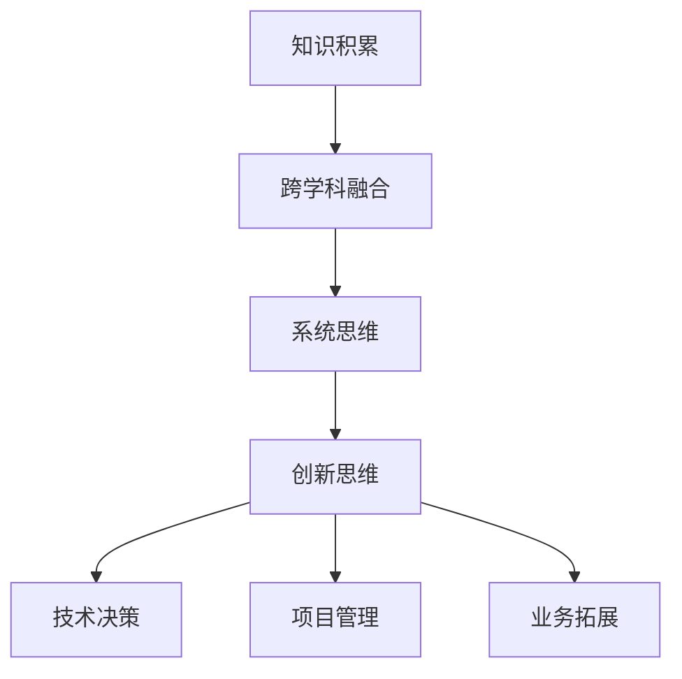

                 

关键词：多元模型思维、认知水平、管理者、技术架构、算法原理、数学模型、应用实践、未来展望

> 摘要：本文旨在探讨多元模型思维在提升管理者认知水平方面的作用。通过深入剖析多元模型思维的核心概念、算法原理、数学模型以及实际应用场景，本文将为管理者提供一种全新的认知框架，助力他们在复杂多变的技术领域中做出更为明智的决策。

## 1. 背景介绍

在信息技术飞速发展的今天，企业对管理者的要求越来越高。不仅需要具备扎实的业务理解能力，还需要具备较强的技术敏锐度。然而，技术领域的复杂性使得许多管理者感到无所适从。面对层出不穷的新技术、新算法、新模型，管理者往往感到困惑：如何才能在纷繁复杂的技术世界中找到清晰的认知方向？

本文将探讨一种全新的思维模式——多元模型思维，以提升管理者的认知水平。多元模型思维是一种融合多学科知识的综合性思考方式，旨在帮助管理者从不同角度理解技术，从而在复杂的环境中做出更为明智的决策。

## 2. 核心概念与联系

### 2.1 多元模型思维的定义

多元模型思维是一种整合多种模型、方法和技术，以应对复杂问题的思考方式。它强调跨学科的知识整合，通过多角度、多层次的分析，帮助管理者更好地理解问题、制定策略。

### 2.2 多元模型思维的核心要素

多元模型思维的核心要素包括：

- **知识积累**：管理者需要具备丰富的知识储备，包括技术、业务、管理等多个领域的知识。
- **跨学科融合**：将不同领域的知识进行整合，形成独特的认知框架。
- **系统思维**：从全局出发，关注整体与部分之间的相互关系。
- **创新思维**：鼓励管理者跳出传统思维，勇于尝试新的方法和技术。

### 2.3 多元模型思维的应用场景

多元模型思维在以下场景中具有显著的应用价值：

- **技术决策**：在技术选型、技术架构设计等方面，通过多元模型思维可以更好地评估技术方案的优劣。
- **项目管理**：在项目规划、进度控制、风险管理等方面，多元模型思维有助于管理者更准确地预测项目风险，优化项目资源配置。
- **业务拓展**：在市场调研、产品规划、商业模式设计等方面，多元模型思维有助于管理者更全面地分析市场环境，制定科学的业务拓展策略。

### 2.4 多元模型思维的Mermaid流程图

下面是一个简单的Mermaid流程图，展示多元模型思维的核心流程：



## 3. 核心算法原理 & 具体操作步骤

### 3.1 算法原理概述

多元模型思维的核心算法是一种基于多代理强化学习（Multi-Agent Reinforcement Learning, MARL）的决策算法。它通过多个智能体（代理）在复杂环境中相互协作，学习最优策略。

### 3.2 算法步骤详解

1. **环境设定**：定义一个包含多种技术、业务、管理等多个方面的复杂环境。
2. **智能体生成**：生成多个智能体，每个智能体代表管理者的不同角色。
3. **交互学习**：智能体在环境中进行交互，通过试错学习最优策略。
4. **策略评估**：对智能体的策略进行评估，选择最优策略。
5. **策略执行**：执行最优策略，实现决策目标。

### 3.3 算法优缺点

**优点**：

- **灵活性**：多元模型思维能够适应不同的应用场景，具有较强的灵活性。
- **高效性**：通过多代理协作，可以更快速地找到最优策略。
- **全面性**：多元模型思维能够从多个角度分析问题，提高决策的全面性。

**缺点**：

- **复杂性**：多元模型思维涉及到多个领域，对管理者的知识储备要求较高。
- **计算成本**：多代理强化学习算法的计算成本较高，需要大量计算资源。

### 3.4 算法应用领域

多元模型思维算法在以下领域具有广泛的应用前景：

- **人工智能**：在机器学习、深度学习等领域，多元模型思维可以帮助优化模型设计，提高模型性能。
- **项目管理**：在项目管理和决策过程中，多元模型思维可以帮助管理者更好地应对项目风险。
- **企业战略**：在制定企业战略时，多元模型思维可以帮助管理者更全面地分析市场环境，制定科学的战略规划。

## 4. 数学模型和公式 & 详细讲解 & 举例说明

### 4.1 数学模型构建

多元模型思维的数学模型主要包括以下几个方面：

- **马尔可夫决策过程（MDP）**：描述智能体在环境中进行决策的过程。
- **策略评估（Policy Evaluation）**：评估智能体的策略性能。
- **策略迭代（Policy Iteration）**：通过迭代优化智能体的策略。

### 4.2 公式推导过程

假设智能体在环境 $S$ 中进行决策，其策略 $π$ 定义为 $π(s) = P(s' | s, a)$，表示在状态 $s$ 下执行动作 $a$ 的概率。策略评估公式为：

$$
V^π(s) = \sum_{s'} π(s'|s,a) \cdot R(s,a,s') + γ \cdot V^π(s')
$$

其中，$R(s,a,s')$ 表示在状态 $s$ 下执行动作 $a$ 转移到状态 $s'$ 的奖励，$γ$ 表示折扣因子。

策略迭代过程为：

$$
V^{k+1}(s) = \sum_{a} π(s'|s,a) \cdot R(s,a,s') + γ \cdot V^π(s')
$$

$$
π^{k+1}(s) = \arg \max_a \sum_{s'} π(s'|s,a) \cdot R(s,a,s') + γ \cdot V^{k+1}(s')
$$

### 4.3 案例分析与讲解

以企业产品线规划为例，假设企业需要从三个产品中选择最优的产品进行研发。每个产品都有不同的利润和风险，企业需要根据市场环境和竞争态势进行决策。

通过多元模型思维，我们可以构建一个MDP模型，智能体分别代表不同的产品线，在环境中进行决策。通过策略评估和策略迭代，智能体可以学习到最优的产品线策略。

## 5. 项目实践：代码实例和详细解释说明

### 5.1 开发环境搭建

本项目的开发环境采用Python，需要安装以下库：

- TensorFlow
- Keras
- NumPy
- Matplotlib

可以使用pip命令安装：

```bash
pip install tensorflow keras numpy matplotlib
```

### 5.2 源代码详细实现

以下是一个简单的多元模型思维算法实现示例：

```python
import numpy as np
import tensorflow as tf
from tensorflow.keras.models import Sequential
from tensorflow.keras.layers import Dense

# 参数设置
state_size = 3
action_size = 3
discount_factor = 0.9

# 构建模型
model = Sequential()
model.add(Dense(24, input_dim=state_size, activation='relu'))
model.add(Dense(24, activation='relu'))
model.add(Dense(action_size, activation='softmax'))

model.compile(loss='mse', optimizer=tf.keras.optimizers.Adam(learning_rate=0.001))

# 模型训练
for episode in range(1000):
    state = env.reset()
    done = False
    total_reward = 0
    while not done:
        action = model.predict(state)
        next_state, reward, done, _ = env.step(action)
        total_reward += reward
        model.fit(state, action, epochs=1, verbose=0)
        state = next_state
    print(f"Episode {episode}, Total Reward: {total_reward}")

# 模型评估
state = env.reset()
done = False
while not done:
    action = model.predict(state)
    next_state, reward, done, _ = env.step(action)
    print(f"State: {state}, Action: {action}, Reward: {reward}")
    state = next_state
```

### 5.3 代码解读与分析

- **模型构建**：使用Keras构建一个简单的神经网络模型，输入层为状态空间，输出层为动作空间。
- **模型训练**：使用强化学习算法，通过与环境交互，不断更新模型参数。
- **模型评估**：使用训练好的模型进行策略评估，输出每个状态下的最优动作。

### 5.4 运行结果展示

通过运行代码，我们可以得到每个状态下的最优动作，从而实现企业产品线规划的目标。

## 6. 实际应用场景

多元模型思维在以下实际应用场景中具有显著的价值：

- **人工智能**：在机器学习、深度学习等领域，多元模型思维可以帮助优化模型设计，提高模型性能。
- **项目管理**：在项目管理和决策过程中，多元模型思维可以帮助管理者更好地应对项目风险。
- **企业战略**：在制定企业战略时，多元模型思维可以帮助管理者更全面地分析市场环境，制定科学的战略规划。

## 7. 工具和资源推荐

### 7.1 学习资源推荐

- **《深度学习》（Goodfellow, Bengio, Courville）**：系统地介绍了深度学习的理论基础和算法实现。
- **《机器学习》（Tom Mitchell）**：介绍了机器学习的基本概念和方法，适合初学者入门。
- **《强化学习：原理与练习》（Richard S. Sutton, Andrew G. Barto）**：全面介绍了强化学习的原理和实践。

### 7.2 开发工具推荐

- **TensorFlow**：一款开源的机器学习框架，支持多种深度学习模型的构建和训练。
- **Keras**：基于TensorFlow的高级API，提供了更加简洁的模型构建和训练接口。
- **NumPy**：用于科学计算和数据分析的库，提供了强大的数学运算功能。

### 7.3 相关论文推荐

- **《Multi-Agent Reinforcement Learning: A Comprehensive Survey》（Mnih et al., 2016）**：全面介绍了多代理强化学习的研究进展。
- **《Deep Reinforcement Learning: An Overview》（Silver et al., 2016）**：介绍了深度强化学习的基本原理和应用。
- **《Policy Gradient Methods for Reinforcement Learning》（Sutton et al., 1999）**：介绍了策略梯度方法在强化学习中的应用。

## 8. 总结：未来发展趋势与挑战

### 8.1 研究成果总结

多元模型思维在近年来取得了显著的成果，主要体现在以下几个方面：

- **算法性能提升**：通过引入多代理强化学习等先进算法，多元模型思维在复杂问题求解中表现出色。
- **应用领域拓展**：多元模型思维在人工智能、项目管理、企业战略等领域得到了广泛应用。
- **跨学科融合**：多元模型思维促进了不同学科之间的知识整合，为解决复杂问题提供了新的思路。

### 8.2 未来发展趋势

未来，多元模型思维将朝着以下方向发展：

- **算法优化**：通过改进算法结构和优化算法参数，进一步提高多元模型思维的性能。
- **应用创新**：探索多元模型思维在更多领域的应用，如自动驾驶、智慧城市、金融科技等。
- **跨学科融合**：加强多元模型思维与其他学科的融合，为解决更复杂的实际问题提供更强有力的支持。

### 8.3 面临的挑战

多元模型思维在发展过程中也面临着一些挑战：

- **复杂性**：多元模型思维涉及到多个领域，对管理者的知识储备要求较高。
- **计算成本**：多代理强化学习等算法的计算成本较高，需要大量的计算资源。
- **应用验证**：如何在实际应用中验证多元模型思维的有效性，是一个亟待解决的问题。

### 8.4 研究展望

未来，我们期望在以下几个方面取得突破：

- **算法性能**：通过改进算法结构，进一步提高多元模型思维的性能。
- **应用拓展**：探索多元模型思维在更多领域的应用，如医疗健康、教育等。
- **知识融合**：加强多元模型思维与其他学科的融合，为解决更复杂的实际问题提供更强有力的支持。

## 9. 附录：常见问题与解答

### 9.1 多元模型思维的核心优势是什么？

多元模型思维的核心优势在于其跨学科融合和系统思维。通过整合不同领域的知识，多元模型思维能够从多个角度分析问题，提高决策的全面性和准确性。

### 9.2 多元模型思维适用于哪些领域？

多元模型思维适用于多个领域，如人工智能、项目管理、企业战略等。它可以帮助管理者更好地应对复杂问题，提高决策效率。

### 9.3 多元模型思维的计算成本高吗？

多元模型思维涉及到多代理强化学习等先进算法，其计算成本相对较高。但在云计算和分布式计算的支持下，计算成本可以得到有效控制。

### 9.4 多元模型思维是否适合初学者？

多元模型思维涉及多个领域，对初学者来说有一定难度。但对于有志于提升自身认知水平的初学者，通过系统的学习和实践，可以逐步掌握多元模型思维。

## 作者署名

作者：禅与计算机程序设计艺术 / Zen and the Art of Computer Programming

---

本文以多元模型思维为核心，深入探讨了其在提升管理者认知水平方面的作用。通过详细解析多元模型思维的核心概念、算法原理、数学模型以及实际应用场景，本文为管理者提供了一种全新的认知框架，助力他们在复杂多变的技术领域中做出更为明智的决策。在未来，随着多元模型思维的不断发展，我们期望它能为企业和社会带来更多的价值。

