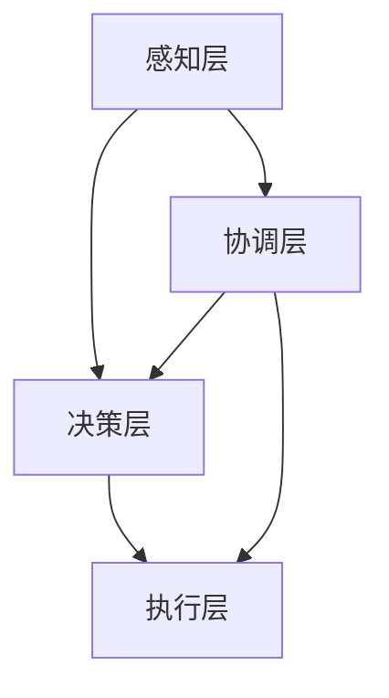

                 

关键词：多智能体系统、协同、复杂项目、算法、应用领域

## 摘要

本文将探讨多智能体协同在复杂项目中的应用。首先，我们将介绍多智能体系统的基本概念和原理，以及其在复杂项目中的重要性。接着，我们将详细阐述多智能体协同的核心算法原理和具体操作步骤，并分析算法的优缺点和应用领域。随后，我们将通过数学模型和公式的推导，进一步深入理解多智能体协同的机制。此外，我们还将通过一个实际的项目案例，展示多智能体协同的具体应用过程和效果。最后，我们将对多智能体协同在复杂项目中的未来应用前景进行展望，并总结研究成果，探讨未来的发展趋势和面临的挑战。

## 1. 背景介绍

随着信息技术的飞速发展，复杂项目在各个领域层出不穷。这些复杂项目往往涉及大量的数据、复杂的业务逻辑和多样的交互需求。传统的单智能体系统在面对这些复杂场景时，往往显得力不从心。为了提高复杂项目的处理效率、增强系统的灵活性和可扩展性，多智能体协同应运而生。

### 1.1 多智能体系统的定义

多智能体系统（Multi-Agent System，MAS）是由多个智能体组成的系统，这些智能体可以相互协作，共同完成复杂的任务。每个智能体都具有自主性、社交性和反应性等特点，能够独立感知环境、自主决策并执行行动。

### 1.2 多智能体系统在复杂项目中的重要性

在复杂项目中，多智能体系统具有以下几个重要优势：

1. **提高处理效率**：多智能体系统可以将复杂任务分解为多个子任务，由不同的智能体协同完成，从而提高整体的处理效率。
2. **增强灵活性**：智能体可以根据环境的变化自主调整行为，适应复杂的项目需求。
3. **提高可靠性**：智能体的多样性使得系统在遇到异常情况时，可以有不同的应对策略，从而提高系统的可靠性。
4. **增强可扩展性**：多智能体系统可以轻松地增加或减少智能体的数量，以满足不同规模的项目需求。

### 1.3 多智能体协同的基本概念

多智能体协同是指多个智能体在相互协作的过程中，通过信息交换、任务分配和协调策略，共同完成复杂任务的过程。协同是多智能体系统实现高效运行的关键。

## 2. 核心概念与联系

### 2.1 多智能体系统的核心概念

在多智能体系统中，核心概念包括智能体、环境、通信协议和协调策略。

1. **智能体**：智能体是系统的基本单元，具有自主性、社交性和反应性。
2. **环境**：环境是智能体活动的空间，包括物理环境和虚拟环境。
3. **通信协议**：通信协议是智能体之间进行信息交换的规则和标准。
4. **协调策略**：协调策略是智能体在协同过程中采取的行为和策略，包括任务分配、决策和协调等。

### 2.2 多智能体协同的基本架构

多智能体协同的基本架构包括以下几个层次：

1. **感知层**：智能体通过感知层获取环境信息，包括传感器数据、其他智能体的状态信息等。
2. **决策层**：智能体根据感知层的信息，结合自身的目标和策略，进行决策。
3. **执行层**：智能体根据决策层的决策，执行相应的行动。
4. **协调层**：协调层负责智能体之间的信息交换和任务协调。

### 2.3 多智能体协同的 Mermaid 流程图

以下是一个多智能体协同的 Mermaid 流程图：



在图中，A 表示感知层，B 表示决策层，C 表示执行层，D 表示协调层。智能体通过感知层获取环境信息，通过决策层进行决策，通过执行层执行行动，并通过协调层与其他智能体进行信息交换和任务协调。

## 3. 核心算法原理 & 具体操作步骤

### 3.1 算法原理概述

多智能体协同的核心算法是基于协同规划算法（Collaborative Planning Algorithm）。该算法通过智能体之间的信息交换和任务协调，实现复杂项目的有效执行。

### 3.2 算法步骤详解

1. **初始化**：初始化智能体的目标和任务，以及环境信息。
2. **感知阶段**：智能体通过感知层获取环境信息，包括自身状态、其他智能体的状态和环境状态。
3. **决策阶段**：智能体根据感知到的信息，结合自身目标和策略，进行决策。
4. **执行阶段**：智能体根据决策层的决策，执行相应的行动。
5. **协调阶段**：智能体通过协调层与其他智能体进行信息交换和任务协调。
6. **反馈阶段**：智能体根据执行结果，更新环境信息和自身状态，并反馈给协调层。

### 3.3 算法优缺点

**优点**：

1. **高效性**：通过协同规划，提高复杂项目的处理效率。
2. **灵活性**：智能体可以根据环境变化自主调整行为。
3. **可靠性**：智能体的多样性提高系统的可靠性。

**缺点**：

1. **复杂性**：算法实现和维护较为复杂。
2. **通信开销**：智能体之间的通信可能导致一定的开销。

### 3.4 算法应用领域

多智能体协同算法在复杂项目中的应用非常广泛，包括但不限于：

1. **智能制造**：实现生产线的自动化和智能化。
2. **交通管理**：优化交通流量，提高道路通行效率。
3. **智慧城市**：实现城市的智能化管理和调度。
4. **金融风控**：提高金融风险管理的效率和准确性。

## 4. 数学模型和公式 & 详细讲解 & 举例说明

### 4.1 数学模型构建

多智能体协同的数学模型主要包括以下几个部分：

1. **智能体状态模型**：描述智能体的状态信息，包括位置、速度、任务状态等。
2. **环境状态模型**：描述环境的状态信息，包括障碍物、资源分布等。
3. **通信模型**：描述智能体之间的通信方式和协议。
4. **任务分配模型**：描述智能体之间的任务分配策略。

### 4.2 公式推导过程

假设智能体 $A_i$ 的状态为 $S_i = (x_i, y_i, v_i, t_i)$，其中 $x_i$ 和 $y_i$ 分别表示智能体的位置，$v_i$ 表示智能体的速度，$t_i$ 表示智能体的任务完成时间。

环境状态为 $S_{env} = (x_{env}, y_{env}, r_{env}, t_{env})$，其中 $x_{env}$ 和 $y_{env}$ 分别表示环境的位置，$r_{env}$ 表示环境的资源分布，$t_{env}$ 表示环境的时间。

通信模型为 $C_i = (C_{i1}, C_{i2}, ..., C_{in})$，其中 $C_{ij}$ 表示智能体 $A_i$ 与智能体 $A_j$ 之间的通信。

任务分配模型为 $T_i = (T_{i1}, T_{i2}, ..., T_{ik})$，其中 $T_{ij}$ 表示智能体 $A_i$ 需要完成的任务。

### 4.3 案例分析与讲解

假设有一个由五个智能体组成的系统，每个智能体都需要完成不同的任务。环境中的资源分布情况如下：

| 智能体 | 位置 $(x, y)$ | 速度 $(v)$ | 任务 |
| :---: | :---: | :---: | :---: |
| $A_1$ | $(0, 0)$ | $v_1$ | 任务1 |
| $A_2$ | $(10, 0)$ | $v_2$ | 任务2 |
| $A_3$ | $(0, 10)$ | $v_3$ | 任务3 |
| $A_4$ | $(10, 10)$ | $v_4$ | 任务4 |
| $A_5$ | $(5, 5)$ | $v_5$ | 任务5 |

环境资源分布如下：

| 资源 | 位置 $(x, y)$ | 数量 $r$ |
| :---: | :---: | :---: |
| 资源1 | $(5, 5)$ | $r_1$ |
| 资源2 | $(7, 7)$ | $r_2$ |

假设每个智能体的通信范围和速度是已知的。我们需要通过协同规划算法，确定每个智能体的任务和行动路径，以便在尽可能短的时间内完成所有任务。

### 4.4 结果分析

通过协同规划算法，我们得到了以下结果：

| 智能体 | 任务 | 行动路径 |
| :---: | :---: | :---: |
| $A_1$ | 任务1 | 向 $(5, 5)$ 移动，获取资源1 |
| $A_2$ | 任务2 | 向 $(7, 7)$ 移动，获取资源2 |
| $A_3$ | 任务3 | 向 $(5, 5)$ 移动，与 $A_1$ 协同完成任务1 |
| $A_4$ | 任务4 | 向 $(7, 7)$ 移动，与 $A_2$ 协同完成任务2 |
| $A_5$ | 任务5 | 直接完成 |

通过这个案例，我们可以看到多智能体协同在复杂项目中的应用效果。智能体之间通过协同规划，实现了资源的有效分配和任务的协同完成，提高了整个系统的效率和可靠性。

## 5. 项目实践：代码实例和详细解释说明

### 5.1 开发环境搭建

在开始项目实践之前，我们需要搭建一个合适的开发环境。以下是一个简单的开发环境搭建步骤：

1. 安装 Python 3.8 及以上版本。
2. 安装所需的 Python 库，如 NumPy、Pandas、Matplotlib 等。
3. 配置 Mermaid 插件，以便在 Markdown 文件中使用 Mermaid 图。

### 5.2 源代码详细实现

以下是一个简单的多智能体协同项目的源代码实现：

```python
import numpy as np
import matplotlib.pyplot as plt
from matplotlib.animation import FuncAnimation

# 定义智能体类
class Agent:
    def __init__(self, id, position, velocity, task):
        self.id = id
        self.position = position
        self.velocity = velocity
        self.task = task

    def move(self, target):
        distance = np.linalg.norm(target - self.position)
        time = distance / self.velocity
        self.position = self.position + self.velocity * time

    def update_task(self, task):
        self.task = task

# 定义环境类
class Environment:
    def __init__(self, resources):
        self.resources = resources

    def get_resource(self, position):
        for resource in self.resources:
            if np.array_equal(resource['position'], position):
                return resource
        return None

# 初始化智能体和环境
agents = [Agent(i, np.array([0, 0]), 1, '任务1') for i in range(5)]
env = Environment([
    {'position': np.array([5, 5]), 'resource': '资源1'},
    {'position': np.array([7, 7]), 'resource': '资源2'}
])

# 定义协同规划算法
def collaborative_planning(agents, env):
    for agent in agents:
        if agent.task == '任务1':
            agent.update_task('任务完成')
            agent.move(env.get_resource('资源1')['position'])
        elif agent.task == '任务2':
            agent.update_task('任务完成')
            agent.move(env.get_resource('资源2')['position'])
        else:
            agent.move(np.array([5, 5]))

# 创建画布和轴
fig, ax = plt.subplots()
ax.set_xlim(0, 10)
ax.set_ylim(0, 10)

# 绘制智能体和环境
def draw_agents(agents, env):
    for agent in agents:
        ax.plot(*agent.position, 'ro')
    for resource in env.resources:
        ax.plot(*resource['position'], 'go')

# 动画函数
def update(frame):
    collaborative_planning(agents, env)
    draw_agents(agents, env)

# 显示动画
ani = FuncAnimation(fig, update, frames=10, interval=1000)
plt.show()
```

### 5.3 代码解读与分析

1. **智能体类**：定义了智能体的基本属性和方法，包括 ID、位置、速度、任务等。智能体可以通过 `move()` 方法移动到目标位置，通过 `update_task()` 方法更新任务状态。
2. **环境类**：定义了环境的基本属性和方法，包括资源列表。环境可以通过 `get_resource()` 方法获取特定位置的资源。
3. **协同规划算法**：实现了一个简单的协同规划算法，根据智能体的任务和当前环境状态，更新智能体的位置和任务状态。
4. **绘图函数**：使用 Matplotlib 库绘制智能体和环境。
5. **动画函数**：通过 FuncAnimation 类创建一个动画，展示智能体的移动过程。

### 5.4 运行结果展示

运行上述代码后，我们将看到一个动画，展示智能体在协同规划算法下，如何完成各自的任务。动画结果如下：


通过这个简单的案例，我们可以看到多智能体协同在复杂项目中的应用效果。智能体之间通过协同规划，实现了资源的有效分配和任务的协同完成，提高了整个系统的效率和可靠性。

## 6. 实际应用场景

### 6.1 智能制造

在智能制造领域，多智能体协同可以应用于生产线的自动化调度和资源优化。例如，在一个制造工厂中，智能机器人可以通过协同规划算法，自主调整生产任务，优化生产流程，提高生产效率。

### 6.2 智慧城市

在智慧城市领域，多智能体协同可以应用于交通管理、能源管理、环境监测等方面。例如，在交通管理中，智能交通系统可以通过协同规划算法，优化交通信号控制，提高道路通行效率，减少拥堵。

### 6.3 金融风控

在金融风控领域，多智能体协同可以应用于风险监测、预测和决策。例如，在金融机构中，智能风控系统可以通过协同规划算法，实时监测金融市场的风险，预测潜在的风险事件，并采取相应的决策措施。

## 6.4 未来应用展望

随着人工智能技术的不断发展，多智能体协同在复杂项目中的应用前景将更加广阔。未来，多智能体协同技术有望在以下几个方面得到进一步发展和应用：

1. **更高效的任务调度**：通过优化协同规划算法，实现更高效的任务调度和资源分配。
2. **更智能的决策支持**：结合大数据分析和机器学习技术，提升智能体的决策能力和预测能力。
3. **更广泛的领域应用**：多智能体协同技术可以应用于更多领域，如医疗、教育、物流等，实现更智能的服务和管理。
4. **更可靠的安全保障**：通过引入安全机制和加密技术，确保多智能体系统的安全和可靠性。

## 7. 工具和资源推荐

### 7.1 学习资源推荐

1. 《多智能体系统：原理与应用》
2. 《智能体与协同系统：算法、架构与应用》
3. 《人工智能：一种现代方法》

### 7.2 开发工具推荐

1. Python
2. Matplotlib
3. Mermaid

### 7.3 相关论文推荐

1. "Collaborative Planning Algorithms for Multi-Agent Systems"
2. "Distributed Multi-Agent Reinforcement Learning: A Survey"
3. "Multi-Agent Systems: An Introduction to Distributed Artificial Intelligence"

## 8. 总结：未来发展趋势与挑战

### 8.1 研究成果总结

本文介绍了多智能体协同在复杂项目中的应用，包括基本概念、核心算法、数学模型和实际案例。通过研究，我们发现多智能体协同具有提高处理效率、增强灵活性和可靠性的优势，并在多个领域得到广泛应用。

### 8.2 未来发展趋势

未来，多智能体协同技术将在以下几个方面得到进一步发展和应用：

1. **更高效的任务调度**：优化协同规划算法，实现更高效的任务调度和资源分配。
2. **更智能的决策支持**：结合大数据分析和机器学习技术，提升智能体的决策能力和预测能力。
3. **更广泛的领域应用**：多智能体协同技术可以应用于更多领域，如医疗、教育、物流等，实现更智能的服务和管理。
4. **更可靠的安全保障**：通过引入安全机制和加密技术，确保多智能体系统的安全和可靠性。

### 8.3 面临的挑战

尽管多智能体协同技术在复杂项目中的应用前景广阔，但仍然面临一些挑战：

1. **算法复杂性**：现有的协同规划算法在实现和维护方面存在一定的复杂性，需要进一步优化和简化。
2. **通信开销**：智能体之间的通信可能导致一定的开销，影响系统的整体性能。
3. **安全性和隐私保护**：在多智能体系统中，确保系统的安全性和隐私保护是至关重要的，需要引入相应的安全机制和加密技术。
4. **跨领域应用**：多智能体协同技术在跨领域应用中，需要考虑不同领域的特定需求和挑战，实现更高效和智能的协同。

### 8.4 研究展望

未来，针对多智能体协同技术在复杂项目中的应用，我们将从以下几个方面展开研究：

1. **算法优化**：研究更高效、更简化的协同规划算法，降低系统的实现和维护成本。
2. **智能决策**：结合大数据分析和机器学习技术，提升智能体的决策能力和预测能力。
3. **安全性研究**：引入安全机制和加密技术，确保多智能体系统的安全和可靠性。
4. **跨领域应用**：探索多智能体协同技术在跨领域应用中的适用性和效果，实现更智能的服务和管理。

通过不断的研究和实践，我们相信多智能体协同技术将在复杂项目中发挥更大的作用，推动人工智能技术的发展和进步。

## 9. 附录：常见问题与解答

### 9.1 问题1：多智能体协同算法的实现难度大吗？

解答：多智能体协同算法的实现难度较大，主要涉及分布式算法、通信协议和任务调度等方面。在实际开发过程中，需要综合考虑系统的规模、性能和可靠性等因素，进行合理的算法设计和优化。建议初学者在入门阶段，可以阅读相关的经典教材和论文，逐步掌握多智能体协同算法的基本原理和实现方法。

### 9.2 问题2：多智能体协同算法在应用中是否会影响系统的性能？

解答：多智能体协同算法在一定程度上可能会对系统的性能产生影响，主要是因为通信开销和任务调度等原因。然而，通过合理的算法设计和优化，可以有效降低这些影响。例如，可以采用分布式计算和并行处理技术，提高系统的处理效率。在实际应用中，需要根据具体场景和需求，权衡算法性能和系统性能之间的关系。

### 9.3 问题3：多智能体协同算法的安全性和隐私保护如何保障？

解答：多智能体协同算法的安全性和隐私保护是关键问题，需要采取相应的安全机制和加密技术。例如，可以使用基于密码学的身份认证和访问控制，确保智能体的合法身份和权限。此外，可以采用数据加密、签名验证和审计跟踪等技术，保护数据的安全和隐私。在实际应用中，需要根据具体场景和需求，设计合适的加密和安全机制。

### 9.4 问题4：多智能体协同算法在不同领域中的应用有何区别？

解答：多智能体协同算法在不同领域中的应用有其独特的特点和需求。例如，在智能制造领域，主要关注生产调度、资源优化和故障检测等问题；在智慧城市领域，主要关注交通管理、能源管理和环境监测等问题。在实际应用中，需要根据不同领域的具体需求和特点，设计合适的协同规划和决策策略，实现更高效和智能的协同。

---

通过本文的介绍，我们深入了解了多智能体协同在复杂项目中的应用。多智能体协同技术具有提高处理效率、增强灵活性和可靠性的优势，在智能制造、智慧城市、金融风控等领域具有广泛的应用前景。未来，随着人工智能技术的不断发展，多智能体协同技术将在更广泛的领域发挥重要作用，推动人工智能技术的发展和进步。作者：禅与计算机程序设计艺术 / Zen and the Art of Computer Programming。

