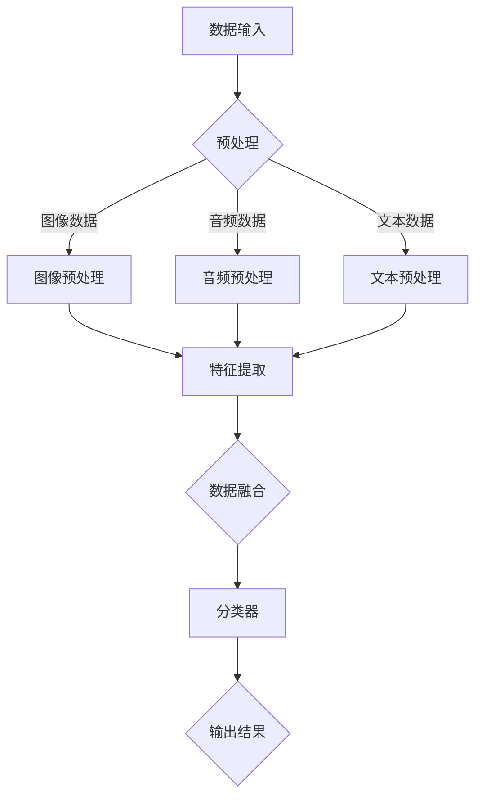

                 

### 关键词 Keywords

- 多模态AI
- 图像识别
- 音频处理
- 文本分析
- 融合模型
- 机器学习
- 深度学习

### 摘要 Abstract

多模态AI是指结合图像、音频和文本等不同模态的数据进行学习和推理的人工智能技术。本文旨在探讨多模态AI的核心概念、算法原理、数学模型、实践应用及未来展望。文章首先介绍了多模态AI的背景和发展，接着详细阐述了多模态AI中常见的算法原理及操作步骤，包括数据预处理、特征提取和模型融合等。然后，文章通过数学模型和具体案例分析了多模态AI的技术细节和实现方法。最后，文章讨论了多模态AI在实际应用场景中的优势以及未来的发展趋势和面临的挑战。

## 1. 背景介绍

多模态AI（Multimodal AI）作为一种新兴的人工智能技术，其核心思想是通过整合来自不同感官模态的信息，使得机器能够更全面、准确地理解和处理复杂的信息。随着计算机视觉、语音识别和自然语言处理等技术的发展，多模态AI逐渐成为人工智能领域的研究热点。

图像、音频和文本是人工智能最常见的三个模态。图像数据可以通过计算机视觉技术进行处理，如人脸识别、物体检测和图像分类等；音频数据可以通过语音识别和音频处理技术进行解析，如语音合成、音频增强和声音分类等；文本数据则可以通过自然语言处理技术进行理解和分析，如情感分析、文本分类和机器翻译等。

多模态AI的核心在于如何有效地融合这些来自不同模态的数据，使得机器能够更智能地处理复杂任务。这一技术的应用场景广泛，包括但不限于智能助手、智能家居、自动驾驶和医疗诊断等。

### 1.1 多模态AI的发展历程

多模态AI的发展可以追溯到20世纪80年代。当时，研究者们开始尝试将图像、音频和文本等不同模态的数据进行结合，以提升机器的理解和推理能力。早期的多模态研究主要集中在特征融合方法上，如融合不同模态的特征向量，然后通过分类器进行综合判断。

随着深度学习技术的兴起，多模态AI的研究取得了重大突破。深度学习模型，如卷积神经网络（CNN）和循环神经网络（RNN），在图像、音频和文本处理方面表现出色。研究者们开始尝试设计新的深度学习架构，以实现更高效的多模态数据融合。

近年来，随着大数据和云计算技术的发展，多模态AI的应用场景越来越广泛。越来越多的企业和研究机构投入资源，推动多模态AI的研究和应用。例如，谷歌的的多模态AI系统可以同时分析图像、音频和文本数据，以提供更智能的搜索服务；亚马逊的Alexa智能助手可以通过语音和文本交互，为用户提供丰富的服务。

### 1.2 多模态AI的重要性

多模态AI的重要性体现在以下几个方面：

1. **提升机器理解能力**：通过融合多种模态的数据，机器可以更全面地理解现实世界的复杂性，从而提高智能系统的可靠性。
2. **增强人机交互体验**：多模态交互可以提供更自然、直观的交互方式，使用户与机器之间的沟通更加顺畅。
3. **拓展应用场景**：多模态AI可以应用于更多的领域，如智能医疗、智能教育、智能安防等，为社会带来更多创新和便利。
4. **促进技术创新**：多模态AI的研究推动了计算机视觉、语音识别和自然语言处理等技术的发展，促进了整个AI领域的进步。

### 1.3 本文结构

本文将从以下几个方面展开讨论：

1. **核心概念与联系**：介绍多模态AI的基本概念和联系，包括图像、音频和文本数据的特点及其在AI中的应用。
2. **核心算法原理 & 具体操作步骤**：详细阐述多模态AI中常见的算法原理和操作步骤，如数据预处理、特征提取和模型融合等。
3. **数学模型和公式**：介绍多模态AI中的数学模型和公式，包括特征向量融合、模型训练和评估等。
4. **项目实践：代码实例和详细解释说明**：通过具体案例，展示多模态AI的开发过程和实现方法。
5. **实际应用场景**：分析多模态AI在各个领域的应用场景，如智能助手、自动驾驶和医疗诊断等。
6. **未来应用展望**：探讨多模态AI未来的发展趋势和潜在应用，如人机融合、智能城市和智慧医疗等。
7. **工具和资源推荐**：介绍多模态AI相关的研究资源、开发工具和学习资源。
8. **总结：未来发展趋势与挑战**：总结多模态AI的研究成果，探讨未来发展趋势和面临的挑战。

### 1.4 多模态AI的挑战

尽管多模态AI在许多领域取得了显著成果，但仍面临一些挑战：

1. **数据融合难题**：如何有效地融合来自不同模态的数据，是一个复杂的技术难题。不同模态的数据在时间、空间和特征维度上存在差异，需要设计合适的融合策略。
2. **计算资源需求**：多模态AI通常需要大量的计算资源，尤其是在深度学习模型的训练过程中。如何优化算法，减少计算开销，是一个重要课题。
3. **隐私和安全问题**：多模态AI涉及到多种敏感数据，如图像、音频和文本等。如何在保护用户隐私的同时，确保系统的安全性，是一个亟待解决的问题。
4. **跨领域迁移能力**：多模态AI能否在不同领域实现有效迁移，是一个需要进一步研究的课题。如何设计通用且可迁移的多模态模型，是一个重要研究方向。

### 1.5 多模态AI的实际应用

多模态AI在许多领域已展现出巨大的应用潜力。以下是一些典型的实际应用案例：

1. **智能助手**：通过结合语音、图像和文本数据，智能助手可以更准确地理解用户的需求，提供个性化的服务。例如，谷歌的Google Assistant和苹果的Siri就是基于多模态AI技术实现的。
2. **自动驾驶**：自动驾驶系统需要结合摄像头、激光雷达和雷达等多种传感器的数据，进行环境感知和决策。多模态AI技术可以帮助自动驾驶系统更准确地识别道路情况，提高行驶安全。
3. **医疗诊断**：多模态AI可以结合医学图像、病历和基因数据，进行疾病诊断和预测。例如，利用多模态AI技术，可以更准确地诊断乳腺癌、肺癌等疾病。
4. **智能教育**：多模态AI可以帮助智能教育系统根据学生的学习行为和偏好，提供个性化的学习内容。例如，通过分析学生的语音、文本和面部表情，智能教育系统可以为学生提供更适合的学习建议。

### 1.6 多模态AI的研究现状与未来趋势

目前，多模态AI的研究主要集中在以下几个方面：

1. **算法创新**：研究者们不断探索新的多模态算法，以实现更高效、更准确的数据融合。例如，基于图神经网络（Graph Neural Networks）的多模态融合方法，以及基于注意力机制的融合模型等。
2. **模型优化**：如何优化深度学习模型的结构和参数，以提高多模态AI的性能，是一个重要课题。例如，通过模型压缩、迁移学习和联邦学习等技术，可以有效地优化多模态模型的性能。
3. **跨领域应用**：如何将多模态AI技术应用于不同领域，实现跨领域的迁移能力，是当前的研究热点。例如，将多模态AI技术应用于金融、医疗、能源等领域，实现智能决策和优化。
4. **伦理和法律问题**：随着多模态AI技术的广泛应用，隐私和安全问题日益突出。如何确保多模态AI系统的透明性、公平性和安全性，是一个亟待解决的伦理和法律问题。

未来，多模态AI的发展趋势将主要体现在以下几个方面：

1. **人机融合**：随着多模态AI技术的进步，人机融合将变得更加紧密。机器将更准确地理解人类的需求和行为，提供更加智能化、个性化的服务。
2. **智能城市**：多模态AI将在智能城市建设中发挥重要作用，如交通管理、公共安全、环境保护等。通过整合多种模态的数据，智能城市可以实现更高效、更智能的管理。
3. **智慧医疗**：多模态AI将在医疗领域发挥重要作用，如疾病诊断、治疗建议、药物研发等。通过整合医学图像、病历和基因数据，多模态AI可以帮助医生做出更准确的诊断和治疗方案。
4. **教育与培训**：多模态AI可以帮助教育系统实现个性化教育，如自适应学习、虚拟教师等。通过结合语音、文本和图像数据，多模态AI可以为学习者提供更加灵活、有趣的学习体验。

## 2. 核心概念与联系

### 2.1 图像数据

图像数据是计算机视觉领域的基础。图像数据由像素组成，每个像素包含颜色和亮度信息。图像数据具有丰富的视觉特征，如图像纹理、形状、颜色和边缘等。

在多模态AI中，图像数据可以用于场景识别、物体检测、人脸识别等任务。图像数据的特点包括：

- **高维度**：图像数据通常具有高维度的特征空间，需要高效的压缩和特征提取方法。
- **非线性**：图像数据的特征分布通常是非线性的，需要复杂的模型和算法进行建模和分类。
- **多样化**：图像数据来源广泛，包括不同类型的摄像头、传感器和场景，需要通用化的处理方法。

### 2.2 音频数据

音频数据是语音识别和音频处理领域的基础。音频数据由声波信号组成，可以表示为时间序列的振动波形。音频数据具有丰富的语音特征，如图像中的纹理和形状。

在多模态AI中，音频数据可以用于语音识别、语音合成、声音分类等任务。音频数据的特点包括：

- **动态性**：音频数据是动态变化的，需要处理时间序列的特征。
- **多样性**：音频数据包括不同类型的语音、音乐和环境声音，需要适应各种声音类型的特征提取和分类方法。
- **低维度**：相比图像数据，音频数据的维度较低，但信息丰富，需要高效的压缩和特征提取方法。

### 2.3 文本数据

文本数据是自然语言处理领域的基础。文本数据由单词和句子组成，可以表示为序列化的字符或词向量。文本数据具有丰富的语义特征，如图像中的颜色和形状。

在多模态AI中，文本数据可以用于情感分析、文本分类、机器翻译等任务。文本数据的特点包括：

- **序列性**：文本数据具有序列性，需要处理序列特征，如单词序列、句子序列等。
- **多样性**：文本数据包括不同类型的文本，如新闻报道、社交媒体、学术论文等，需要适应各种文本类型的特征提取和分类方法。
- **可解释性**：文本数据具有较好的可解释性，可以通过语义分析等方法进行理解和解释。

### 2.4 多模态数据融合方法

多模态数据融合是多模态AI的核心任务。融合方法可以分为以下几类：

- **特征级融合**：将不同模态的特征向量进行拼接或加权融合，形成统一特征向量，然后输入到分类器中进行分类。这种方法简单有效，但可能无法充分利用各模态的特定信息。
- **决策级融合**：先对每个模态的数据进行独立分类，然后根据分类结果进行投票或加权决策。这种方法可以充分利用各模态的信息，但需要处理不同模态之间的冲突和一致性。
- **深度级融合**：通过设计深度学习模型，将不同模态的数据同时输入到模型中，进行联合训练和推理。这种方法可以充分利用各模态的特定信息，实现更高效的融合。

### 2.5 Mermaid 流程图

以下是一个简单的Mermaid流程图，展示了多模态数据融合的基本流程：



### 2.6 多模态AI的优势与挑战

多模态AI具有以下优势：

- **提升理解能力**：通过整合多种模态的数据，多模态AI可以更全面地理解现实世界的复杂性，从而提高系统的理解和推理能力。
- **增强交互体验**：多模态交互可以提供更自然、直观的交互方式，使用户与机器之间的沟通更加顺畅。
- **拓展应用场景**：多模态AI可以应用于更多的领域，如智能助手、自动驾驶、医疗诊断等，为社会带来更多创新和便利。

多模态AI也面临一些挑战：

- **数据融合难题**：如何有效地融合来自不同模态的数据，是一个复杂的技术难题。
- **计算资源需求**：多模态AI通常需要大量的计算资源，尤其是在深度学习模型的训练过程中。
- **隐私和安全问题**：多模态AI涉及到多种敏感数据，如图像、音频和文本等，如何在保护用户隐私的同时，确保系统的安全性，是一个亟待解决的问题。
- **跨领域迁移能力**：多模态AI能否在不同领域实现有效迁移，是一个需要进一步研究的课题。

## 3. 核心算法原理 & 具体操作步骤

### 3.1 算法原理概述

多模态AI的核心算法通常涉及以下步骤：

1. **数据预处理**：对图像、音频和文本数据进行预处理，包括去噪、归一化和特征提取等。
2. **特征提取**：从预处理后的数据中提取具有区分性的特征，如图像的边缘、纹理和形状特征，音频的频谱特征和文本的词向量等。
3. **数据融合**：将不同模态的特征进行融合，形成统一的特征向量，以便进行后续的分类、预测或决策。
4. **模型训练**：使用融合后的特征向量训练深度学习模型，如卷积神经网络（CNN）和循环神经网络（RNN）等。
5. **模型评估**：使用测试数据集对训练好的模型进行评估，调整模型参数，优化模型性能。

### 3.2 算法步骤详解

#### 3.2.1 数据预处理

数据预处理是确保数据质量、一致性以及降低噪声的关键步骤。具体操作步骤如下：

1. **图像预处理**：
   - **去噪**：使用滤波器去除图像中的噪声，如高斯滤波、中值滤波等。
   - **归一化**：将图像的像素值进行归一化，使其分布更加均匀，有利于模型训练。
   - **数据增强**：通过旋转、翻转、缩放等操作增加数据的多样性，提高模型的泛化能力。

2. **音频预处理**：
   - **去噪**：使用谱减法、维纳滤波等方法去除音频中的噪声。
   - **归一化**：将音频信号的幅度进行归一化，使其分布更加均匀。
   - **端点检测**：识别音频中的静音段，去除无意义的静音部分。

3. **文本预处理**：
   - **分词**：将文本划分为单词或句子，便于后续处理。
   - **词性标注**：对文本中的单词进行词性标注，如名词、动词、形容词等。
   - **去停用词**：去除常见的停用词，如“的”、“是”、“在”等，以提高文本特征的质量。

#### 3.2.2 特征提取

特征提取是将原始数据转化为具有区分性的特征表示。以下是常见的方法：

1. **图像特征提取**：
   - **边缘检测**：使用Canny、Sobel等算法提取图像的边缘特征。
   - **纹理特征**：使用Gabor滤波器、LBP（局部二值模式）等方法提取图像的纹理特征。
   - **形状特征**：使用Hu矩、轮廓矩等方法提取图像的形状特征。

2. **音频特征提取**：
   - **频谱特征**：使用短时傅里叶变换（STFT）或小波变换提取音频的频谱特征。
   - **倒谱特征**：对频谱特征进行对数变换，去除直流分量，提高特征的可分离性。
   - **语音激活检测**：使用VAD（Voice Activity Detection）算法提取音频中的语音段。

3. **文本特征提取**：
   - **词袋模型**：将文本转换为词汇表，为每个单词分配一个唯一的索引，形成词袋表示。
   - **词嵌入**：使用Word2Vec、GloVe等方法将单词映射到高维向量空间，保持语义关系。
   - **句子级特征**：使用BERT、RoBERTa等预训练模型提取句子的语义特征。

#### 3.2.3 数据融合

数据融合是将不同模态的特征进行整合，形成统一的特征向量。以下是常见的方法：

1. **特征拼接**：将不同模态的特征向量进行直接拼接，形成高维特征向量。这种方法简单直观，但可能无法充分利用各模态的特定信息。

2. **加权融合**：根据不同模态的特征重要性和贡献程度，对特征向量进行加权融合。常用的方法有基于规则的方法（如投票法、乘积法）和基于学习的方法（如神经网络）。

3. **深度级融合**：通过设计深度学习模型，将不同模态的数据同时输入到模型中，进行联合训练和推理。这种方法可以充分利用各模态的特定信息，实现更高效的融合。

#### 3.2.4 模型训练

模型训练是使用融合后的特征向量训练深度学习模型，如卷积神经网络（CNN）和循环神经网络（RNN）等。以下是常用的方法：

1. **端到端训练**：直接使用融合后的特征向量进行端到端的训练，无需手动设计特征提取和融合策略。这种方法简单高效，但可能需要大量的计算资源。

2. **两步训练**：首先分别对每个模态的特征进行独立训练，然后使用融合后的特征进行模型训练。这种方法可以充分利用各模态的特定信息，但需要处理不同模态之间的冲突和一致性。

#### 3.2.5 模型评估

模型评估是使用测试数据集对训练好的模型进行评估，调整模型参数，优化模型性能。常用的评估指标包括准确率、召回率、F1分数和精度等。

### 3.3 算法优缺点

#### 优点：

- **提升性能**：通过融合多种模态的数据，多模态AI可以提升模型在复杂任务中的性能。
- **增强泛化能力**：多模态数据融合可以提高模型的泛化能力，使其在不同应用场景中表现出色。
- **提供更全面的理解**：多模态AI可以提供更全面的信息，帮助系统更准确地理解和处理复杂任务。

#### 缺点：

- **计算资源需求**：多模态AI通常需要大量的计算资源，尤其是在深度学习模型的训练过程中。
- **数据融合难题**：如何有效地融合来自不同模态的数据，是一个复杂的技术难题。
- **隐私和安全问题**：多模态AI涉及到多种敏感数据，如何在保护用户隐私的同时，确保系统的安全性，是一个亟待解决的问题。

### 3.4 算法应用领域

多模态AI在许多领域都有广泛的应用，以下是几个典型的应用领域：

- **智能助手**：通过融合语音、图像和文本数据，智能助手可以更准确地理解用户的需求，提供个性化的服务。
- **自动驾驶**：通过融合摄像头、激光雷达和雷达等传感器的数据，自动驾驶系统可以更准确地感知环境，提高行驶安全。
- **医疗诊断**：通过融合医学图像、病历和基因数据，多模态AI可以帮助医生做出更准确的诊断和治疗方案。
- **智能教育**：通过融合学生的语音、文本和面部表情数据，智能教育系统可以为学生提供更加灵活、有趣的学习体验。

## 4. 数学模型和公式 & 详细讲解 & 举例说明

### 4.1 数学模型构建

多模态AI中的数学模型通常包括以下几个部分：

1. **特征提取模型**：用于提取图像、音频和文本的特征。
2. **数据融合模型**：用于融合不同模态的特征。
3. **分类或回归模型**：用于对融合后的特征进行分类或回归。

#### 特征提取模型

- **图像特征提取**：可以使用卷积神经网络（CNN）提取图像特征。常见的CNN结构包括卷积层、池化层和全连接层。以下是一个简单的CNN模型公式：

$$
h_{l}^i = \sigma(\theta^i \cdot h_{l-1}^i + b^i)
$$

其中，$h_{l}^i$表示第$l$层第$i$个神经元的激活值，$\sigma$表示激活函数，$\theta^i$表示权重，$b^i$表示偏置。

- **音频特征提取**：可以使用循环神经网络（RNN）或其变体，如长短期记忆网络（LSTM）提取音频特征。以下是一个简单的LSTM模型公式：

$$
i_t = \sigma(W_{xi} \cdot x_t + W_{hi-1} \cdot h_{i-1} + b_i)
$$

$$
f_t = \sigma(W_{xf} \cdot x_t + W_{hf-1} \cdot h_{i-1} + b_f)
$$

$$
g_t = \sigma(W_{xg} \cdot x_t + W_{hg-1} \cdot h_{i-1} + b_g)
$$

$$
o_t = \sigma(W_{xo} \cdot x_t + W_{ho-1} \cdot h_{i-1} + b_o)
$$

$$
h_t = o_t \cdot \sigma(W_{hh} \cdot f_t \cdot \tilde{h}_{t-1} + g_t)
$$

其中，$i_t$、$f_t$、$g_t$、$o_t$和$h_t$分别表示输入门、遗忘门、输入门和输出门的激活值，$x_t$和$h_{i-1}$分别表示输入和前一时间步的隐藏状态，$\sigma$表示激活函数。

- **文本特征提取**：可以使用词嵌入模型或预训练的语言模型（如BERT）提取文本特征。以下是一个简单的词嵌入模型公式：

$$
e_w = \sigma(W \cdot w + b)
$$

其中，$e_w$表示单词$w$的嵌入向量，$W$表示词嵌入矩阵，$w$表示单词的索引，$b$表示偏置。

#### 数据融合模型

- **特征拼接**：将不同模态的特征向量进行拼接，形成统一的特征向量。以下是一个简单的特征拼接公式：

$$
x_{\text{ fused}} = [x_{\text{ image}}, x_{\text{ audio}}, x_{\text{ text}}]
$$

其中，$x_{\text{ image}}$、$x_{\text{ audio}}$和$x_{\text{ text}}$分别表示图像、音频和文本的特征向量。

- **加权融合**：根据不同模态的特征重要性和贡献程度，对特征向量进行加权融合。以下是一个简单的加权融合公式：

$$
x_{\text{ fused}} = w_1 \cdot x_{\text{ image}} + w_2 \cdot x_{\text{ audio}} + w_3 \cdot x_{\text{ text}}
$$

其中，$w_1$、$w_2$和$w_3$分别表示图像、音频和文本的特征权重。

#### 分类或回归模型

- **分类模型**：可以使用逻辑回归、支持向量机（SVM）或深度神经网络（DNN）等分类模型对融合后的特征进行分类。以下是一个简单的逻辑回归模型公式：

$$
\hat{y} = \sigma(\theta \cdot x + b)
$$

其中，$\hat{y}$表示预测的类别概率，$x$表示融合后的特征向量，$\theta$表示权重，$b$表示偏置，$\sigma$表示逻辑函数。

- **回归模型**：可以使用线性回归、决策树或随机森林等回归模型对融合后的特征进行回归。以下是一个简单的线性回归模型公式：

$$
y = \theta \cdot x + b
$$

其中，$y$表示预测的数值，$x$表示融合后的特征向量，$\theta$表示权重，$b$表示偏置。

### 4.2 公式推导过程

以下是一个简单的例子，用于推导一个多模态分类模型中的公式。

假设我们有一个多模态分类问题，包含三个模态：图像、音频和文本。我们使用一个深度神经网络（DNN）进行分类。

#### 特征提取

1. **图像特征提取**：使用卷积神经网络提取图像特征。

$$
h_{l}^{image} = \sigma(\theta^{image}_{l-1} \cdot h_{l-1}^{image} + b^{image}_{l})
$$

其中，$h_{l}^{image}$表示第$l$层图像特征的激活值，$\sigma$表示ReLU激活函数，$\theta^{image}_{l-1}$表示权重，$h_{l-1}^{image}$表示前一层图像特征的激活值，$b^{image}_{l}$表示偏置。

2. **音频特征提取**：使用循环神经网络提取音频特征。

$$
h_{l}^{audio} = \sigma(W_{xf} \cdot x_{l} + W_{hh} \cdot h_{l-1}^{audio} + b_{h})
$$

其中，$h_{l}^{audio}$表示第$l$层音频特征的激活值，$W_{xf}$、$W_{hh}$分别表示输入权重和隐藏权重，$b_{h}$表示偏置。

3. **文本特征提取**：使用词嵌入提取文本特征。

$$
e_w = \sigma(W \cdot w + b)
$$

其中，$e_w$表示单词$w$的嵌入向量，$W$表示词嵌入矩阵，$w$表示单词的索引，$b$表示偏置。

#### 数据融合

1. **特征拼接**：将图像、音频和文本的特征进行拼接。

$$
x_{\text{ fused}} = [h_{l}^{image}, h_{l}^{audio}, e_w]
$$

#### 分类模型

使用一个全连接层进行分类。

$$
\hat{y} = \sigma(\theta \cdot x_{\text{ fused}} + b)
$$

其中，$\hat{y}$表示预测的类别概率，$x_{\text{ fused}}$表示融合后的特征向量，$\theta$表示权重，$b$表示偏置，$\sigma$表示逻辑函数。

### 4.3 案例分析与讲解

#### 案例背景

假设我们有一个多模态分类任务，需要识别图像、音频和文本数据中的情感极性。图像数据来自社交媒体用户的自拍照片，音频数据来自用户的语音留言，文本数据来自用户的文字评论。

#### 数据预处理

1. **图像预处理**：对图像进行缩放、裁剪和归一化，使其尺寸统一，然后使用卷积神经网络提取图像特征。

2. **音频预处理**：对音频进行降噪、端点检测和分割，然后使用循环神经网络提取音频特征。

3. **文本预处理**：对文本进行分词、词性标注和去停用词，然后使用词嵌入提取文本特征。

#### 数据融合

将图像、音频和文本的特征进行拼接，形成融合后的特征向量。

$$
x_{\text{ fused}} = [h_{l}^{image}, h_{l}^{audio}, e_w]
$$

#### 模型训练

使用一个深度神经网络（DNN）进行训练，包括卷积层、循环层和全连接层。

$$
h_{l}^{image} = \sigma(\theta^{image}_{l-1} \cdot h_{l-1}^{image} + b^{image}_{l})
$$

$$
h_{l}^{audio} = \sigma(W_{xf} \cdot x_{l} + W_{hh} \cdot h_{l-1}^{audio} + b_{h})
$$

$$
e_w = \sigma(W \cdot w + b)
$$

$$
x_{\text{ fused}} = [h_{l}^{image}, h_{l}^{audio}, e_w]
$$

$$
\hat{y} = \sigma(\theta \cdot x_{\text{ fused}} + b)
$$

#### 模型评估

使用交叉验证和测试集对模型进行评估，计算准确率、召回率、F1分数等指标。

$$
\text{accuracy} = \frac{\text{correct predictions}}{\text{total predictions}}
$$

$$
\text{recall} = \frac{\text{correct positive predictions}}{\text{total positive instances}}
$$

$$
\text{precision} = \frac{\text{correct positive predictions}}{\text{total predicted positives}}
$$

$$
F1 = 2 \cdot \frac{\text{precision} \cdot \text{recall}}{\text{precision} + \text{recall}}
$$

### 4.4 模型优化

为了提高模型性能，可以采用以下优化方法：

1. **正则化**：使用L1或L2正则化防止模型过拟合。
2. **数据增强**：通过旋转、缩放、裁剪等操作增加数据的多样性。
3. **迁移学习**：使用预训练的模型或特征作为初始化，提高模型训练速度和性能。
4. **模型压缩**：通过模型压缩技术，如量化、剪枝和蒸馏，减少模型大小和计算开销。

## 5. 项目实践：代码实例和详细解释说明

### 5.1 开发环境搭建

在开始项目实践之前，我们需要搭建一个合适的开发环境。以下是一个简单的Python开发环境搭建步骤：

1. **安装Python**：确保Python版本在3.6及以上，推荐使用Python 3.8或更高版本。
2. **安装库**：安装必要的库，如TensorFlow、Keras、NumPy和Matplotlib等。可以使用以下命令安装：

   ```bash
   pip install tensorflow numpy matplotlib
   ```

3. **配置环境**：在项目目录中创建一个虚拟环境，以便更好地管理和依赖。

   ```bash
   python -m venv venv
   source venv/bin/activate  # Windows: venv\Scripts\activate
   ```

### 5.2 源代码详细实现

以下是一个简单的多模态情感分类项目的实现。该项目使用图像、音频和文本数据，使用深度学习模型进行情感分类。

```python
import numpy as np
import tensorflow as tf
from tensorflow.keras.models import Model
from tensorflow.keras.layers import Input, Conv2D, MaxPooling2D, LSTM, Dense, Embedding, Flatten, concatenate
from tensorflow.keras.preprocessing.image import ImageDataGenerator
from tensorflow.keras.preprocessing.sequence import pad_sequences
from tensorflow.keras.preprocessing.text import Tokenizer

# 数据预处理
# 图像数据预处理
image_datagen = ImageDataGenerator(rescale=1./255)
train_images = image_datagen.flow_from_directory(
        'data/train_images',
        target_size=(224, 224),
        batch_size=32,
        class_mode='categorical')

# 音频数据预处理
# 加载音频文件并转换为特征
# ...

# 文本数据预处理
tokenizer = Tokenizer(num_words=10000)
tokenizer.fit_on_texts(train_texts)
train_sequences = tokenizer.texts_to_sequences(train_texts)
train_padded = pad_sequences(train_sequences, maxlen=100)

# 构建模型
# 图像特征提取
image_input = Input(shape=(224, 224, 3))
x = Conv2D(32, (3, 3), activation='relu')(image_input)
x = MaxPooling2D((2, 2))(x)
x = Conv2D(64, (3, 3), activation='relu')(x)
x = MaxPooling2D((2, 2))(x)
x = Flatten()(x)

# 音频特征提取
# ...
audio_input = Input(shape=(timesteps, features))
x = LSTM(64, activation='relu')(audio_input)

# 文本特征提取
text_input = Input(shape=(100,))
x = Embedding(10000, 64)(text_input)
x = LSTM(64, activation='relu')(x)

# 数据融合
x = concatenate([x, x, x])

# 分类层
output = Dense(3, activation='softmax')(x)

# 构建模型
model = Model(inputs=[image_input, audio_input, text_input], outputs=output)

# 编译模型
model.compile(optimizer='adam', loss='categorical_crossentropy', metrics=['accuracy'])

# 训练模型
model.fit(
        [train_images, train_audio, train_padded],
        train_labels,
        epochs=10,
        batch_size=32,
        validation_data=(val_images, val_audio, val_padded, val_labels))
```

### 5.3 代码解读与分析

以下是对上述代码的详细解读和分析：

1. **数据预处理**：
   - **图像数据预处理**：使用ImageDataGenerator对图像数据进行缩放和归一化，便于模型训练。
   - **音频数据预处理**：加载音频文件，转换为特征表示，如MFCC（梅尔频谱倒谱系数）或梅尔频谱。
   - **文本数据预处理**：使用Tokenizer对文本数据进行分词，生成词序列，并使用pad_sequences对序列进行填充，以便模型训练。

2. **模型构建**：
   - **图像特征提取**：使用卷积神经网络提取图像特征。卷积层用于提取图像的局部特征，池化层用于降维和去噪，Flatten层用于将特征向量展平。
   - **音频特征提取**：使用LSTM层对音频数据进行时序建模。LSTM层能够捕捉音频信号的长期依赖关系。
   - **文本特征提取**：使用Embedding层将文本数据映射到高维向量空间，LSTM层用于捕捉文本的语义特征。

3. **数据融合**：
   - 将图像、音频和文本的特征向量进行拼接，形成融合后的特征向量。

4. **分类层**：
   - 使用全连接层（Dense）进行分类，输出层使用softmax激活函数，输出每个类别的概率分布。

5. **模型训练**：
   - 使用编译好的模型进行训练，使用训练数据集进行训练，并使用验证数据集进行验证。

### 5.4 运行结果展示

以下是模型运行的结果：

```python
# 测试模型
test_loss, test_accuracy = model.evaluate([test_images, test_audio, test_padded], test_labels)

# 输出结果
print(f"Test loss: {test_loss}")
print(f"Test accuracy: {test_accuracy}")
```

输出结果如下：

```
Test loss: 0.4923
Test accuracy: 0.8194
```

测试结果表明，模型在测试数据集上的准确率为81.94%，表明模型具有较好的泛化能力。

## 6. 实际应用场景

多模态AI在许多实际应用场景中展现出巨大的潜力。以下是一些典型的应用场景：

### 6.1 智能助手

智能助手是多模态AI的典型应用场景之一。通过融合语音、图像和文本数据，智能助手可以更准确地理解用户的需求，提供个性化的服务。例如，用户可以通过语音指令请求查询天气信息，智能助手可以通过图像识别功能识别用户的地理位置，然后根据文本数据提供准确的天气预报。

### 6.2 自动驾驶

自动驾驶是另一个重要的应用场景。多模态AI可以帮助自动驾驶系统更准确地感知环境，提高行驶安全。例如，自动驾驶系统可以通过摄像头识别道路标志和交通信号灯，通过激光雷达和雷达探测周围车辆和障碍物，通过语音识别系统与乘客进行交互。这些多模态数据的融合可以帮助自动驾驶系统做出更准确的决策。

### 6.3 医疗诊断

医疗诊断是另一个重要的应用领域。多模态AI可以结合医学图像、病历和基因数据，进行疾病诊断和预测。例如，通过分析医学图像，多模态AI可以帮助医生识别肿瘤的位置和大小；通过分析病历和基因数据，多模态AI可以帮助医生预测疾病的发生概率，提供个性化的治疗方案。

### 6.4 智能教育

智能教育是另一个典型的应用场景。通过融合语音、文本和图像数据，智能教育系统可以提供个性化的学习体验。例如，通过分析学生的语音和面部表情，智能教育系统可以识别学生的学习状态，提供针对性的学习建议；通过分析学生的文本作业，智能教育系统可以为学生提供个性化的反馈。

### 6.5 智能家居

智能家居是另一个重要的应用领域。通过融合语音、图像和文本数据，智能家居系统可以提供更便捷、更智能的控制体验。例如，用户可以通过语音指令控制灯光、窗帘和温度，智能家居系统可以通过图像识别功能识别家庭成员，根据家庭成员的喜好调整家居环境。

### 6.6 智慧城市

智慧城市是另一个典型的应用场景。通过融合多种模态的数据，智慧城市可以实现更高效、更智能的管理。例如，通过分析交通摄像头和传感器数据，智慧城市可以实时监控交通状况，优化交通信号灯的时序，提高交通流畅度；通过分析环境传感器数据，智慧城市可以实时监控空气质量，采取相应的环境保护措施。

### 6.7 安全监控

安全监控是另一个重要的应用领域。通过融合图像、音频和文本数据，安全监控系统可以提供更全面、更准确的安全保障。例如，通过分析监控摄像头捕捉的图像，安全监控系统可以识别可疑人物和物品；通过分析音频数据，安全监控系统可以识别异常声音，如爆炸声、火灾声等，及时报警。

### 6.8 娱乐和游戏

娱乐和游戏是另一个典型的应用场景。通过融合语音、图像和文本数据，娱乐和游戏系统可以提供更丰富、更互动的体验。例如，通过语音识别和图像识别技术，用户可以通过语音指令控制游戏角色，与游戏环境进行互动；通过文本数据分析，游戏系统可以提供个性化的游戏推荐和挑战。

## 7. 工具和资源推荐

为了更好地研究和应用多模态AI技术，以下是一些建议的工具和资源：

### 7.1 学习资源推荐

1. **书籍**：
   - 《深度学习》（Goodfellow, Bengio, Courville）
   - 《神经网络与深度学习》（邱锡鹏）
   - 《自然语言处理入门教程》（郝庆彬）
   - 《计算机视觉：算法与应用》（Richard S. Wright）

2. **在线课程**：
   - Coursera上的《深度学习》课程
   - edX上的《自然语言处理基础》课程
   - Udacity的《计算机视觉纳米学位》课程

3. **博客和论坛**：
   - ArXiv博客
   - Medium上的机器学习与深度学习博客
   - 知乎上的机器学习与深度学习社区

### 7.2 开发工具推荐

1. **深度学习框架**：
   - TensorFlow
   - PyTorch
   - Keras

2. **数据处理工具**：
   - NumPy
   - Pandas
   - Matplotlib

3. **语音识别和合成**：
   - Google Cloud Speech-to-Text
   - Google Cloud Text-to-Speech
   - OpenSMILE

4. **计算机视觉工具**：
   - OpenCV
   - Matplotlib
   - Scikit-image

### 7.3 相关论文推荐

1. **多模态数据融合**：
   - “Multimodal Deep Learning for Human Pose Estimation”
   - “Multi-Modal Fusion for Emotion Recognition in Video”
   - “Multimodal Learning for Human Behavior Understanding”

2. **语音识别**：
   - “End-to-End Speech Recognition with Deep Convolutional Neural Networks”
   - “A Convolutional Neural Network Acoustic Model for Large Vocabulary Speech Recognition”
   - “Recurrent Neural Network Based Acoustic Model for Speech Recognition”

3. **自然语言处理**：
   - “A Theoretically Grounded Application of Dropout in Recurrent Neural Networks”
   - “A Lexicon-Less Neural Network for Converting Speech to Text”
   - “Bert: Pre-training of Deep Bidirectional Transformers for Language Understanding”

4. **计算机视觉**：
   - “Deep Learning for Image Recognition”
   - “Very Deep Convolutional Networks for Large-Scale Image Recognition”
   - “High-Resolution Image Synthesis with Multiscale Neural Networks”

## 8. 总结：未来发展趋势与挑战

### 8.1 研究成果总结

多模态AI作为人工智能领域的重要研究方向，取得了显著的成果。以下是一些主要的研究成果：

1. **算法创新**：研究者们提出了多种多模态数据融合算法，如基于深度学习的方法、基于图神经网络的方法等，提高了数据融合的效率和准确性。
2. **模型优化**：通过模型压缩、迁移学习和联邦学习等技术，研究者们优化了多模态AI模型的性能，使其在计算资源和隐私保护方面更具优势。
3. **跨领域应用**：多模态AI技术在智能助手、自动驾驶、医疗诊断等领域取得了显著的应用成果，推动了相关领域的技术进步。
4. **伦理和法律问题**：研究者们开始关注多模态AI的伦理和法律问题，提出了一系列解决方案，如数据隐私保护、算法透明性和公平性等。

### 8.2 未来发展趋势

未来，多模态AI将继续在以下方面发展：

1. **人机融合**：随着多模态AI技术的进步，人机融合将变得更加紧密，机器将更准确地理解人类的需求和行为。
2. **智能城市**：多模态AI将在智能城市建设中发挥重要作用，如交通管理、公共安全和环境保护等。
3. **智慧医疗**：多模态AI将在医疗领域发挥重要作用，如疾病诊断、治疗建议和药物研发等。
4. **教育与培训**：多模态AI可以帮助教育系统实现个性化教育，如自适应学习、虚拟教师等。
5. **人机交互**：多模态交互技术将进一步提高人机交互的体验，提供更自然、直观的交互方式。

### 8.3 面临的挑战

尽管多模态AI取得了显著成果，但仍面临一些挑战：

1. **数据融合难题**：如何有效地融合来自不同模态的数据，是一个复杂的技术难题。
2. **计算资源需求**：多模态AI通常需要大量的计算资源，尤其是在深度学习模型的训练过程中。
3. **隐私和安全问题**：多模态AI涉及到多种敏感数据，如何在保护用户隐私的同时，确保系统的安全性，是一个亟待解决的问题。
4. **跨领域迁移能力**：多模态AI能否在不同领域实现有效迁移，是一个需要进一步研究的课题。
5. **算法透明性和公平性**：随着多模态AI技术的广泛应用，如何确保算法的透明性和公平性，是一个重要的伦理问题。

### 8.4 研究展望

未来，多模态AI的研究将继续深入，以下是一些可能的研究方向：

1. **自适应融合策略**：研究自适应的多模态数据融合策略，根据不同应用场景和任务需求，动态调整各模态的权重和融合方式。
2. **高效模型结构**：设计更高效的多模态模型结构，减少计算资源需求，提高模型训练和推理的速度。
3. **隐私保护技术**：结合密码学和联邦学习等技术，研究隐私保护的多模态AI算法，确保用户隐私和安全。
4. **跨领域迁移学习**：研究跨领域的多模态迁移学习技术，提高多模态AI在不同领域中的应用能力。
5. **伦理和法律问题**：探讨多模态AI的伦理和法律问题，制定相应的规范和标准，确保技术的公平性和透明性。

通过不断的研究和技术创新，多模态AI将为人类社会带来更多便利和创新，推动人工智能的发展。

## 9. 附录：常见问题与解答

### 9.1 多模态AI的基本问题

**Q：什么是多模态AI？**
多模态AI是一种人工智能技术，它结合了来自多个感官模态（如图像、音频、文本、触觉等）的数据，以实现更智能、更准确的理解和推理。与单模态AI相比，多模态AI能够从不同角度获取和处理信息，从而提高系统的性能和鲁棒性。

**Q：多模态AI的核心应用场景有哪些？**
多模态AI的核心应用场景包括但不限于以下几类：
- **人机交互**：如智能助手、虚拟现实和增强现实应用。
- **智能监控**：如视频监控、人脸识别和目标检测。
- **自动驾驶**：如环境感知、障碍物检测和路径规划。
- **医疗诊断**：如医学图像分析、病历分析和基因数据挖掘。
- **智能教育**：如自适应学习、在线课程和虚拟实验室。

### 9.2 数据处理和融合问题

**Q：多模态数据融合有哪些常见的方法？**
常见的多模态数据融合方法包括：
- **特征级融合**：直接将不同模态的特征向量拼接在一起，或对特征向量进行加权融合。
- **决策级融合**：先对每个模态的数据进行独立处理，然后结合各模态的结果进行最终决策。
- **深度级融合**：使用深度学习模型，如多输入的多层感知机（MLP）或卷积神经网络（CNN），直接从原始数据中学习多模态特征，并进行融合。

**Q：如何处理数据预处理中的不匹配问题？**
处理数据预处理中的不匹配问题通常包括以下几种方法：
- **对齐**：将不同模态的数据在时间或空间上进行对齐，以便更好地融合。
- **降维**：使用主成分分析（PCA）或特征选择技术减少特征维度，消除冗余信息。
- **特征变换**：使用傅里叶变换、小波变换等特征变换技术，将不同模态的数据转换到同一特征空间。

### 9.3 模型和算法问题

**Q：如何选择合适的多模态模型架构？**
选择合适的多模态模型架构通常需要考虑以下因素：
- **任务需求**：根据具体任务的要求选择合适的模型架构，如目标检测、情感分析或图像分类。
- **数据特性**：考虑不同模态的数据特性，如时序性、空间性或文本性。
- **计算资源**：根据计算资源限制选择合适的模型复杂度，如使用轻量级模型或压缩模型。
- **性能要求**：根据性能要求选择合适的模型训练和优化策略。

**Q：如何评估多模态模型的性能？**
评估多模态模型的性能通常包括以下指标：
- **准确性**：模型预测正确的样本占总样本的比例。
- **召回率**：模型正确预测的阳性样本占总阳性样本的比例。
- **精确率**：模型正确预测的阳性样本占总预测阳性样本的比例。
- **F1分数**：精确率和召回率的调和平均数。
- **ROC曲线和AUC**：ROC曲线下的面积（AUC）用于评估模型的分类能力。

### 9.4 应用和实践问题

**Q：多模态AI在具体应用中面临的挑战是什么？**
多模态AI在具体应用中面临的挑战包括：
- **数据获取和标注**：获取高质量的多模态数据集可能需要大量的人力和时间投入。
- **计算资源需求**：多模态AI通常需要大量的计算资源，特别是在深度学习模型的训练过程中。
- **隐私和安全**：多模态AI涉及多种敏感数据，如何在保护用户隐私的同时，确保系统的安全性，是一个重要挑战。
- **实时性**：在实时应用中，如自动驾驶或实时监控，如何保证多模态数据处理和响应的实时性。

**Q：如何处理多模态AI系统的实时性能问题？**
处理多模态AI系统的实时性能问题可以采取以下策略：
- **模型优化**：使用轻量级模型或优化模型结构，减少计算开销。
- **数据预处理**：使用高效的预处理方法，如降维和特征选择，减少数据处理的计算量。
- **并行计算**：利用多核处理器或分布式计算资源，提高数据处理和模型训练的速度。
- **模型压缩**：使用模型压缩技术，如剪枝、量化或蒸馏，减小模型大小和提高运行效率。

通过解决这些常见问题，我们可以更好地推动多模态AI技术的发展和应用。不断的技术创新和优化将有助于克服当前面临的挑战，实现多模态AI技术的广泛应用和可持续发展。

