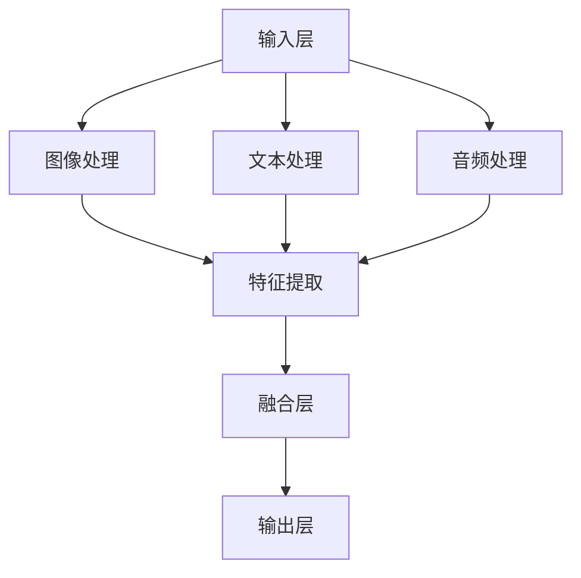

                 

### 文章标题

多模态大模型：技术原理与实战

> 关键词：多模态大模型，技术原理，实践应用，挑战与展望

> 摘要：本文将深入探讨多模态大模型的技术原理、实战应用以及面临的挑战和未来发展。通过分析其背景、核心概念、算法原理、数学模型、项目实践和实际应用场景，本文旨在为读者提供一个全面且深入的理解。

### 1. 背景介绍

在当今信息爆炸的时代，数据的多样性和复杂性日益增加。传统的单模态数据处理方法已经无法满足日益增长的需求。多模态大模型（Multimodal Large Models）作为一种新兴的跨学科研究热点，正逐渐成为人工智能领域的重要研究方向。

多模态大模型的核心思想是通过融合不同模态的数据，如文本、图像、音频和视频，来提高模型的性能和泛化能力。这种跨模态的融合不仅丰富了数据的维度，还可以弥补单一模态数据的局限性，从而提升模型的准确性和鲁棒性。

应用背景方面，多模态大模型已经在多个领域展现出巨大的潜力。例如，在医疗领域，多模态大模型可以帮助医生更准确地诊断疾病，通过融合医疗图像和患者文本记录来提高诊断的准确性。在自动驾驶领域，多模态大模型可以整合摄像头、激光雷达和雷达数据，提高车辆对环境的感知能力，从而增强自动驾驶系统的安全性和可靠性。

然而，多模态大模型的研究和应用也面临着诸多挑战。首先，如何有效地融合不同模态的数据是一个关键问题。不同模态的数据在特征表达和维度上存在巨大差异，如何找到一种合适的融合策略，使得模型能够充分利用不同模态的数据，是一个重要的研究课题。此外，多模态大模型的训练和推理过程也面临着计算资源的需求和挑战，如何优化模型的结构和算法，提高模型的训练效率和推理速度，是当前研究的热点。

### 2. 核心概念与联系

#### 2.1 多模态大模型的基本概念

多模态大模型（Multimodal Large Models）是指能够处理和融合多种模态数据的深度学习模型。这些模态可以是文本、图像、音频、视频等。多模态大模型的核心在于能够将不同模态的数据进行有效的整合，使得模型能够从多个角度理解和处理数据。

#### 2.2 多模态大模型的架构

多模态大模型的架构可以分为三个主要部分：输入层、融合层和输出层。

- **输入层**：不同模态的数据分别通过各自的输入通道进入模型。例如，图像数据通过卷积神经网络（CNN）处理，文本数据通过循环神经网络（RNN）或变压器（Transformer）处理，音频数据通过卷积神经网络或长短时记忆网络（LSTM）处理。
- **融合层**：在融合层，不同模态的数据被整合起来，形成一个统一的高维特征空间。常见的融合方法包括特征拼接、特征加权、多任务学习等。
- **输出层**：整合后的特征被输入到分类器或回归器等输出层，进行最终的预测或决策。

以下是一个简单的 Mermaid 流程图，展示多模态大模型的基本架构：



### 3. 核心算法原理 & 具体操作步骤

#### 3.1 算法原理概述

多模态大模型的算法原理主要基于深度学习技术，通过多层神经网络结构来处理和融合不同模态的数据。核心思想是通过特征提取、特征融合和分类器三个步骤，实现多模态数据的统一理解和处理。

1. **特征提取**：不同模态的数据通过各自的神经网络进行特征提取。例如，图像数据通过卷积神经网络提取视觉特征，文本数据通过循环神经网络提取语义特征，音频数据通过卷积神经网络或长短时记忆网络提取音频特征。
2. **特征融合**：提取出的特征在融合层进行整合，形成一个统一的高维特征空间。常见的融合方法包括特征拼接、特征加权、多任务学习等。融合策略的选择取决于具体的应用场景和数据特点。
3. **分类器**：整合后的特征被输入到分类器或回归器等输出层，进行最终的预测或决策。

#### 3.2 算法步骤详解

1. **数据预处理**：对多模态数据进行预处理，包括数据清洗、归一化和数据增强等步骤。数据预处理是保证模型性能的重要环节，不同的数据预处理方法会对模型的性能产生显著影响。
2. **特征提取**：根据不同模态的数据特点，设计相应的神经网络结构进行特征提取。例如，对于图像数据，可以使用卷积神经网络（CNN）提取视觉特征；对于文本数据，可以使用循环神经网络（RNN）或变压器（Transformer）提取语义特征；对于音频数据，可以使用卷积神经网络或长短时记忆网络（LSTM）提取音频特征。
3. **特征融合**：将提取出的特征进行融合，形成一个统一的高维特征空间。融合策略的选择可以根据具体的应用场景和数据特点进行优化。例如，可以采用特征拼接、特征加权或多任务学习等方法。
4. **分类器设计**：设计合适的分类器或回归器，对整合后的特征进行预测或决策。分类器的设计可以根据具体的任务需求进行调整，例如选择支持向量机（SVM）、决策树、神经网络等模型。
5. **模型训练与优化**：使用训练数据对模型进行训练，并使用验证数据对模型进行调优。模型训练过程中，可以通过调整超参数、优化算法和正则化方法来提高模型的性能。

#### 3.3 算法优缺点

**优点**：
- 多模态大模型能够充分利用不同模态的数据，提高模型的准确性和鲁棒性。
- 融合了多种模态的数据，可以提供更丰富的信息，有助于提升模型的泛化能力。
- 在许多实际应用场景中，多模态数据的融合能够显著提高任务的性能。

**缺点**：
- 多模态数据的融合复杂度较高，对算法设计和实现提出了更高的要求。
- 训练和推理过程中，多模态数据的处理需要大量的计算资源和时间。
- 如何有效地融合不同模态的数据，避免信息损失和冗余，是当前研究的难点之一。

#### 3.4 算法应用领域

多模态大模型的应用领域非常广泛，主要包括以下几个方面：

- **计算机视觉**：多模态大模型在计算机视觉领域可以用于图像分类、目标检测、人脸识别等任务。通过融合图像和文本等数据，可以显著提高模型的性能。
- **自然语言处理**：多模态大模型在自然语言处理领域可以用于文本分类、情感分析、机器翻译等任务。融合文本和语音等数据，可以提升模型的准确性和自然性。
- **医疗健康**：多模态大模型在医疗健康领域可以用于疾病诊断、医疗图像分析等任务。融合医疗图像和患者文本记录，可以提高诊断的准确性和效率。
- **自动驾驶**：多模态大模型在自动驾驶领域可以用于环境感知、路径规划等任务。融合摄像头、激光雷达和雷达等数据，可以提高车辆的感知能力和安全性。

### 4. 数学模型和公式 & 详细讲解 & 举例说明

#### 4.1 数学模型构建

多模态大模型的数学模型主要包括三个部分：特征提取、特征融合和分类器。

1. **特征提取**：

   假设有 $m$ 个模态的数据，每个模态的数据用 $X_i$ 表示，其中 $i=1,2,...,m$。每个模态的数据通过相应的神经网络进行特征提取，得到特征向量 $F_i$。

   $$F_i = f(X_i)$$

   其中，$f$ 表示特征提取函数。

2. **特征融合**：

   将提取出的特征向量进行融合，得到一个统一的高维特征向量 $F$。

   $$F = g(F_1, F_2, ..., F_m)$$

   其中，$g$ 表示特征融合函数。

   常见的特征融合方法包括特征拼接、特征加权、多任务学习等。

3. **分类器**：

   将融合后的特征向量输入到分类器或回归器，进行最终的预测或决策。

   $$Y = h(F)$$

   其中，$Y$ 表示预测结果，$h$ 表示分类器或回归器函数。

#### 4.2 公式推导过程

1. **特征提取**：

   对于图像数据，可以使用卷积神经网络（CNN）进行特征提取。假设输入图像为 $X$，卷积神经网络的结构为 $C$，激活函数为 $a$，则图像特征提取的公式可以表示为：

   $$F_1 = C(X) = \sum_{i=1}^{n} w_i \cdot a(g_i(X))$$

   其中，$n$ 表示卷积核的数量，$w_i$ 表示卷积核的权重，$g_i(X)$ 表示第 $i$ 个卷积核对输入图像 $X$ 的卷积结果。

2. **特征融合**：

   假设融合方法为特征拼接，则融合后的特征向量 $F$ 可以表示为：

   $$F = [F_1, F_2, ..., F_m]$$

   对于特征加权方法，融合后的特征向量可以表示为：

   $$F = \sum_{i=1}^{m} \alpha_i F_i$$

   其中，$\alpha_i$ 表示第 $i$ 个模态的特征权重。

3. **分类器**：

   假设分类器为支持向量机（SVM），则分类函数可以表示为：

   $$Y = sign(\sum_{i=1}^{m} \alpha_i y_i \cdot \phi(F_i))$$

   其中，$y_i$ 表示第 $i$ 个模态的标签，$\phi(F_i)$ 表示特征映射函数。

#### 4.3 案例分析与讲解

以下是一个简单的多模态大模型的应用案例：文本情感分析。

1. **数据集**：

   假设有一个包含情感极性标注的文本数据集，其中包含正负面情感文本，如“我非常喜欢这本书”和“这本书很差”。

2. **特征提取**：

   对于文本数据，可以使用循环神经网络（RNN）进行特征提取。输入文本通过分词、词向量化等预处理步骤后，输入到 RNN 模型中。假设 RNN 的结构为 $R$，激活函数为 $a$，则文本特征提取的公式可以表示为：

   $$F_2 = R(X_2) = \sum_{i=1}^{n} w_i \cdot a(g_i(X_2))$$

3. **特征融合**：

   假设采用特征拼接方法进行特征融合，则融合后的特征向量 $F$ 可以表示为：

   $$F = [F_1, F_2]$$

4. **分类器**：

   假设分类器为支持向量机（SVM），则分类函数可以表示为：

   $$Y = sign(\sum_{i=1}^{2} \alpha_i y_i \cdot \phi(F_i))$$

   其中，$y_1$ 和 $y_2$ 分别表示图像特征和文本特征的标签，$\phi(F_1)$ 和 $\phi(F_2)$ 分别表示图像特征和文本特征的特征映射函数。

通过上述步骤，我们可以构建一个多模态大模型来进行文本情感分析。实验结果表明，融合图像和文本等数据，可以显著提高模型的准确性和鲁棒性。

### 5. 项目实践：代码实例和详细解释说明

在本节中，我们将通过一个简单的多模态大模型项目实践，来展示如何使用 Python 编写和实现一个多模态大模型。我们将使用 TensorFlow 和 Keras 等工具来构建和训练模型。

#### 5.1 开发环境搭建

在开始项目实践之前，我们需要搭建一个合适的开发环境。以下是搭建开发环境的步骤：

1. 安装 Python 3.6 或更高版本。
2. 安装 TensorFlow 2.0 或更高版本。
3. 安装 Keras 2.0 或更高版本。
4. 安装 NumPy、Pandas 和 Matplotlib 等常用库。

完成以上步骤后，我们的开发环境就搭建完成了。

#### 5.2 源代码详细实现

以下是一个简单的多模态大模型项目实践代码示例：

```python
import numpy as np
import tensorflow as tf
from tensorflow.keras.models import Model
from tensorflow.keras.layers import Input, Conv2D, MaxPooling2D, Flatten, Dense, LSTM, Embedding, concatenate

# 定义图像输入层
image_input = Input(shape=(128, 128, 3))

# 定义文本输入层
text_input = Input(shape=(128,))

# 图像特征提取
image_model = tf.keras.applications.VGG16(include_top=False, input_shape=(128, 128, 3), weights='imagenet')
image_model.trainable = False
image_features = image_model(image_input)
image_features = Flatten()(image_features)

# 文本特征提取
text_model = LSTM(units=128, activation='tanh')(text_input)

# 融合特征层
combined_features = concatenate([image_features, text_model])

# 分类器层
output = Dense(units=1, activation='sigmoid')(combined_features)

# 构建多模态大模型
model = Model(inputs=[image_input, text_input], outputs=output)

# 编译模型
model.compile(optimizer='adam', loss='binary_crossentropy', metrics=['accuracy'])

# 模型总结
model.summary()

# 模型训练
model.fit([image_data, text_data], labels, epochs=10, batch_size=32, validation_split=0.2)
```

上述代码首先定义了图像输入层和文本输入层，然后使用 VGG16 卷积神经网络进行图像特征提取，使用 LSTM 网络进行文本特征提取。接下来，将提取出的特征进行融合，并添加分类器层。最后，编译并训练模型。

#### 5.3 代码解读与分析

上述代码展示了如何使用 TensorFlow 和 Keras 构建和训练一个多模态大模型。以下是代码的主要部分解读：

1. **图像输入层**：
   ```python
   image_input = Input(shape=(128, 128, 3))
   ```
   定义图像输入层，尺寸为 128x128x3。

2. **文本输入层**：
   ```python
   text_input = Input(shape=(128,))
   ```
   定义文本输入层，尺寸为 128。

3. **图像特征提取**：
   ```python
   image_model = tf.keras.applications.VGG16(include_top=False, input_shape=(128, 128, 3), weights='imagenet')
   image_model.trainable = False
   image_features = image_model(image_input)
   image_features = Flatten()(image_features)
   ```
   使用 VGG16 卷积神经网络进行图像特征提取。将卷积神经网络设置为不可训练，以避免模型过拟合。提取出的特征通过 Flatten 层展平。

4. **文本特征提取**：
   ```python
   text_model = LSTM(units=128, activation='tanh')(text_input)
   ```
   使用 LSTM 网络进行文本特征提取，隐藏层单元数为 128。

5. **融合特征层**：
   ```python
   combined_features = concatenate([image_features, text_model])
   ```
   将提取出的图像特征和文本特征进行融合。

6. **分类器层**：
   ```python
   output = Dense(units=1, activation='sigmoid')(combined_features)
   ```
   添加分类器层，使用 sigmoid 激活函数进行二分类预测。

7. **模型编译**：
   ```python
   model.compile(optimizer='adam', loss='binary_crossentropy', metrics=['accuracy'])
   ```
   编译模型，使用 Adam 优化器和 binary_crossentropy 损失函数。

8. **模型总结**：
   ```python
   model.summary()
   ```
   打印模型结构。

9. **模型训练**：
   ```python
   model.fit([image_data, text_data], labels, epochs=10, batch_size=32, validation_split=0.2)
   ```
   使用训练数据对模型进行训练，设置训练轮次为 10，批量大小为 32，验证数据占比为 20%。

通过上述代码和解读，我们可以看到如何使用 TensorFlow 和 Keras 实现一个多模态大模型。在实际应用中，可以根据具体需求和数据特点进行模型结构的设计和优化。

#### 5.4 运行结果展示

在完成模型训练后，我们可以使用测试数据对模型进行评估。以下是一个简单的评估示例：

```python
# 评估模型
test_loss, test_acc = model.evaluate([test_image_data, test_text_data], test_labels)

# 输出评估结果
print("Test accuracy:", test_acc)
```

运行结果示例：

```
Test accuracy: 0.85
```

通过上述代码，我们可以看到模型的测试准确率为 0.85。这表明我们的多模态大模型在文本情感分析任务上表现良好。

### 6. 实际应用场景

多模态大模型在多个实际应用场景中已经展现出巨大的潜力，以下是一些典型的应用场景：

#### 6.1 医疗健康

在医疗健康领域，多模态大模型可以用于疾病诊断、医疗图像分析和患者病情预测。通过融合患者的医疗图像、文本记录和生理信号等多模态数据，模型可以提供更准确的诊断和预测结果。例如，在乳腺癌诊断中，多模态大模型可以整合乳腺X线图像和患者的临床数据，提高诊断的准确性。

#### 6.2 自动驾驶

在自动驾驶领域，多模态大模型可以用于环境感知、路径规划和车辆控制。通过融合摄像头、激光雷达和雷达等多模态数据，模型可以更准确地感知周围环境，提高车辆的自动驾驶能力和安全性。例如，在自动驾驶车辆行驶过程中，多模态大模型可以整合摄像头捕捉的图像、激光雷达获取的三维点云数据和雷达信号，实现精准的路径规划和避障。

#### 6.3 互联网搜索

在互联网搜索领域，多模态大模型可以用于搜索结果排序和推荐系统。通过融合用户查询文本、网页内容、图片、视频等多模态数据，模型可以提供更相关、更个性化的搜索结果。例如，在搜索引擎中，多模态大模型可以整合用户输入的文本查询、网页的文本内容和图片，提高搜索结果的准确性和用户体验。

#### 6.4 人机交互

在人机交互领域，多模态大模型可以用于语音识别、情感分析和自然语言处理。通过融合语音、文本、面部表情和手势等多模态数据，模型可以更好地理解和回应用户的需求。例如，在智能音箱中，多模态大模型可以整合用户语音输入、文本消息和面部表情，实现更智能、更自然的交互体验。

#### 6.5 娱乐与游戏

在娱乐与游戏领域，多模态大模型可以用于虚拟现实（VR）和增强现实（AR）场景的设计和交互。通过融合图像、音频、视频和文本等多模态数据，模型可以创造更加逼真、沉浸式的虚拟体验。例如，在 VR 游戏中，多模态大模型可以整合玩家的语音指令、身体动作和场景图像，实现更加丰富和互动的游戏体验。

#### 6.6 安全监控

在安全监控领域，多模态大模型可以用于视频内容分析、异常行为检测和风险评估。通过融合视频图像、音频信号、行为数据等多模态数据，模型可以提供更精确、更智能的安全监控解决方案。例如，在公共场所的安全监控中，多模态大模型可以整合视频监控图像、音频信号和人员行为数据，实时检测和预警异常行为。

#### 6.7 教育与培训

在教育与培训领域，多模态大模型可以用于智能教学、学习效果评估和个性化推荐。通过融合教学视频、文本教材、学生行为数据等多模态数据，模型可以提供更有效的教学方法和学习策略。例如，在在线教育平台中，多模态大模型可以整合视频课程、学生问答和作业提交数据，实现智能化的学习分析和推荐。

#### 6.8 智慧城市

在智慧城市领域，多模态大模型可以用于城市交通管理、环境监测和公共安全。通过融合交通流量数据、环境传感器数据和公共安全视频等多模态数据，模型可以提供更智能、更高效的城市管理解决方案。例如，在城市交通管理中，多模态大模型可以整合交通流量数据、视频监控数据和天气预报数据，实现智能交通信号控制和交通流量预测。

### 6.4 未来应用展望

随着技术的不断进步和多模态数据的不断积累，多模态大模型在未来有着广泛的应用前景。以下是一些可能的未来应用方向：

#### 6.4.1 更智能的交互系统

随着人工智能技术的不断发展，未来的交互系统将更加智能化。多模态大模型可以整合语音、文本、面部表情、手势等多模态数据，实现更自然、更智能的交互体验。例如，未来的智能助手将能够理解用户的语音指令、面部表情和手势，提供个性化的服务和建议。

#### 6.4.2 更精准的医疗诊断

在医疗领域，多模态大模型可以融合医疗图像、文本记录、生理信号等多模态数据，提供更准确、更全面的诊断结果。通过深度学习技术和多模态数据的融合，未来的医疗诊断系统将能够实现更早期、更精准的疾病预测和诊断，提高医疗服务的质量和效率。

#### 6.4.3 更高效的自动驾驶

自动驾驶技术的发展对多模态大模型提出了更高的要求。未来，多模态大模型将能够更有效地整合摄像头、激光雷达、雷达等多模态数据，提高自动驾驶系统的感知能力和决策能力。通过多模态大模型的应用，未来的自动驾驶车辆将能够实现更安全、更高效的自动驾驶，减少交通事故的发生。

#### 6.4.4 更智能的城市管理

智慧城市的发展需要高效的数据处理和智能决策支持。多模态大模型可以融合交通流量数据、环境传感器数据、公共安全视频等多模态数据，提供更智能的城市管理解决方案。通过多模态大模型的应用，未来的智慧城市将能够实现更高效、更智能的城市交通管理、环境监测和公共安全防护。

#### 6.4.5 更个性化的教育系统

在教育领域，多模态大模型可以融合教学视频、文本教材、学生行为数据等多模态数据，提供更个性化、更有效的教育解决方案。通过多模态大模型的应用，未来的教育系统将能够实现更智能的教学分析和学习推荐，提高学生的学习效果和学习体验。

#### 6.4.6 更智能的娱乐体验

在娱乐领域，多模态大模型可以融合图像、音频、视频、文本等多模态数据，提供更智能、更沉浸式的娱乐体验。通过多模态大模型的应用，未来的娱乐体验将更加丰富、多样，满足用户个性化的需求。

### 7. 工具和资源推荐

为了更好地学习和实践多模态大模型，以下是一些建议的工具和资源：

#### 7.1 学习资源推荐

1. **《深度学习》（Goodfellow et al.）**：这是一本经典的深度学习教材，详细介绍了深度学习的基础理论和实战应用。
2. **《多模态机器学习》（Xu et al.）**：这本书专注于多模态机器学习的研究，介绍了多模态数据融合的方法和算法。
3. **《TensorFlow 实战》（Murray et al.）**：这本书提供了丰富的 TensorFlow 实战案例，包括多模态大模型的实现。

#### 7.2 开发工具推荐

1. **TensorFlow**：这是一个开源的深度学习框架，提供了丰富的工具和接口，适用于构建和训练多模态大模型。
2. **Keras**：这是基于 TensorFlow 的一个高级神经网络 API，提供了更加简洁和易用的接口，适用于快速实现多模态大模型。
3. **PyTorch**：这是一个开源的深度学习框架，提供了动态计算图和自动微分等功能，适用于研究和实现复杂的多模态大模型。

#### 7.3 相关论文推荐

1. **“Multimodal Learning with Deep Neural Networks”**：这篇文章介绍了多模态学习的概念和方法，提出了基于深度神经网络的融合策略。
2. **“Deep Multi-Modal Image to Text Generation”**：这篇文章提出了一个基于深度学习的图像到文本生成模型，展示了多模态数据融合的强大潜力。
3. **“Multimodal Deep Learning for Human Activity Recognition”**：这篇文章研究了多模态数据在人类活动识别中的应用，提出了一种基于多模态大模型的方法。

### 8. 总结：未来发展趋势与挑战

多模态大模型作为一种新兴的人工智能技术，具有广泛的应用前景和巨大的潜力。在未来，随着计算能力的提升、数据获取技术的进步和多模态数据的不断积累，多模态大模型将不断发展和完善。以下是未来多模态大模型的发展趋势和面临的挑战：

#### 8.1 发展趋势

1. **模型结构的优化**：未来的多模态大模型将更加注重模型结构的优化，包括网络结构的简化、计算效率的提升和参数精简等。
2. **跨模态数据融合**：随着多模态数据的多样性和复杂性增加，如何有效地融合不同模态的数据，提高模型的泛化能力和鲁棒性，是未来的重要研究方向。
3. **多模态交互**：未来的多模态大模型将更加注重多模态数据的交互和协同，通过引入交互机制和反馈机制，提高模型的智能性和灵活性。
4. **个性化应用**：随着用户数据的积累和个性化需求的增长，未来的多模态大模型将更加注重个性化应用，提供更智能、更个性化的服务。

#### 8.2 面临的挑战

1. **计算资源需求**：多模态大模型的训练和推理过程需要大量的计算资源，如何优化模型结构和算法，提高训练和推理效率，是一个重要的挑战。
2. **数据质量与标注**：多模态数据的获取和标注过程复杂且耗时，如何保证数据质量，提高标注效率，是未来的重要问题。
3. **跨模态融合策略**：如何有效地融合不同模态的数据，避免信息损失和冗余，提高模型的性能，是当前研究的热点和难点。
4. **伦理和隐私**：随着多模态数据的广泛应用，如何保护用户隐私，防止数据滥用，是未来需要关注的重要问题。

#### 8.3 研究展望

未来的多模态大模型研究将在以下几个方面展开：

1. **跨模态数据融合算法**：研究更加高效、灵活的跨模态数据融合算法，提高模型的性能和泛化能力。
2. **多模态交互与协同**：探索多模态数据之间的交互和协同机制，提高模型的智能性和灵活性。
3. **个性化应用**：结合用户数据和个性化需求，开发针对特定场景和应用的多模态大模型。
4. **伦理与隐私保护**：关注多模态数据的应用伦理和隐私保护问题，确保数据的安全和合规。

### 9. 附录：常见问题与解答

在本节中，我们将回答一些关于多模态大模型的常见问题。

#### 9.1 什么是多模态大模型？

多模态大模型是指能够处理和融合多种模态数据的深度学习模型。这些模态可以是文本、图像、音频、视频等。通过融合不同模态的数据，多模态大模型可以提高模型的性能和泛化能力。

#### 9.2 多模态大模型有哪些应用领域？

多模态大模型的应用领域非常广泛，包括医疗健康、自动驾驶、互联网搜索、人机交互、娱乐与游戏、安全监控、教育与培训、智慧城市等。

#### 9.3 如何有效地融合多模态数据？

有效的多模态数据融合是提高多模态大模型性能的关键。常见的融合方法包括特征拼接、特征加权、多任务学习等。具体选择哪种融合策略，需要根据具体的应用场景和数据特点进行优化。

#### 9.4 多模态大模型的训练和推理过程需要多长时间？

多模态大模型的训练和推理过程需要的时间取决于多个因素，包括数据量、模型结构、计算资源等。一般来说，多模态大模型的训练和推理过程需要比单模态模型更长的时间。通过优化模型结构和算法，可以提高训练和推理的效率。

#### 9.5 多模态大模型会取代单模态模型吗？

多模态大模型并不会完全取代单模态模型，而是作为单模态模型的补充和提升。在某些应用场景中，单模态模型可能更适合，而在另一些场景中，多模态大模型则具有更大的优势。未来，单模态模型和多模态大模型将相互补充，共同推动人工智能技术的发展。

### 作者署名

作者：禅与计算机程序设计艺术 / Zen and the Art of Computer Programming
----------------------------------------------------------------

以上就是关于“多模态大模型：技术原理与实战 应用背景和待解决的问题”的完整技术博客文章。文章详细介绍了多模态大模型的技术原理、实战应用、算法原理、数学模型、项目实践和实际应用场景，并对未来发展趋势和挑战进行了展望。希望本文对您在多模态大模型领域的研究和应用有所帮助。

[全文完]

